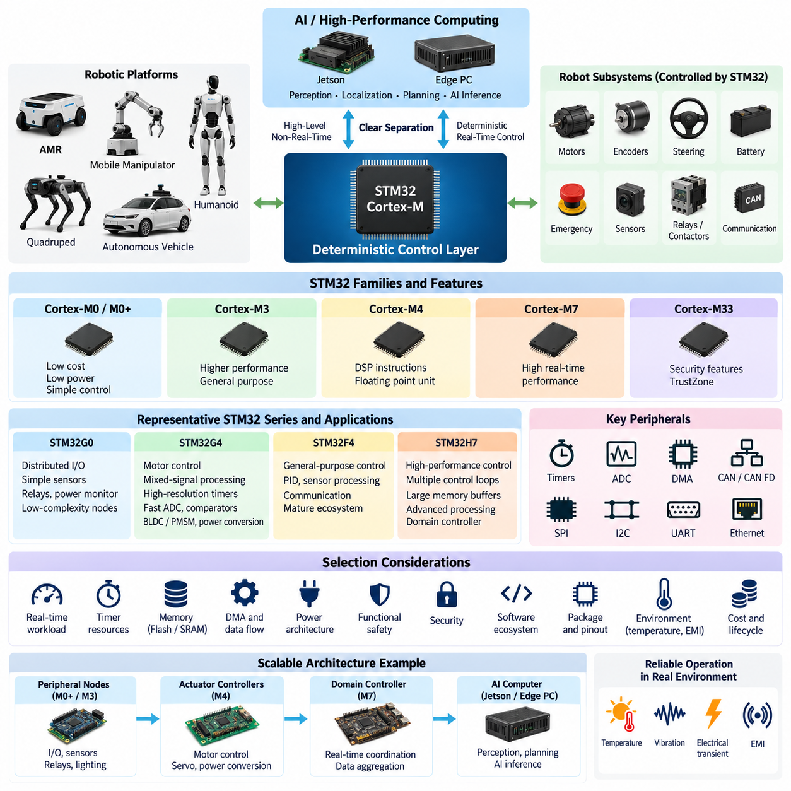
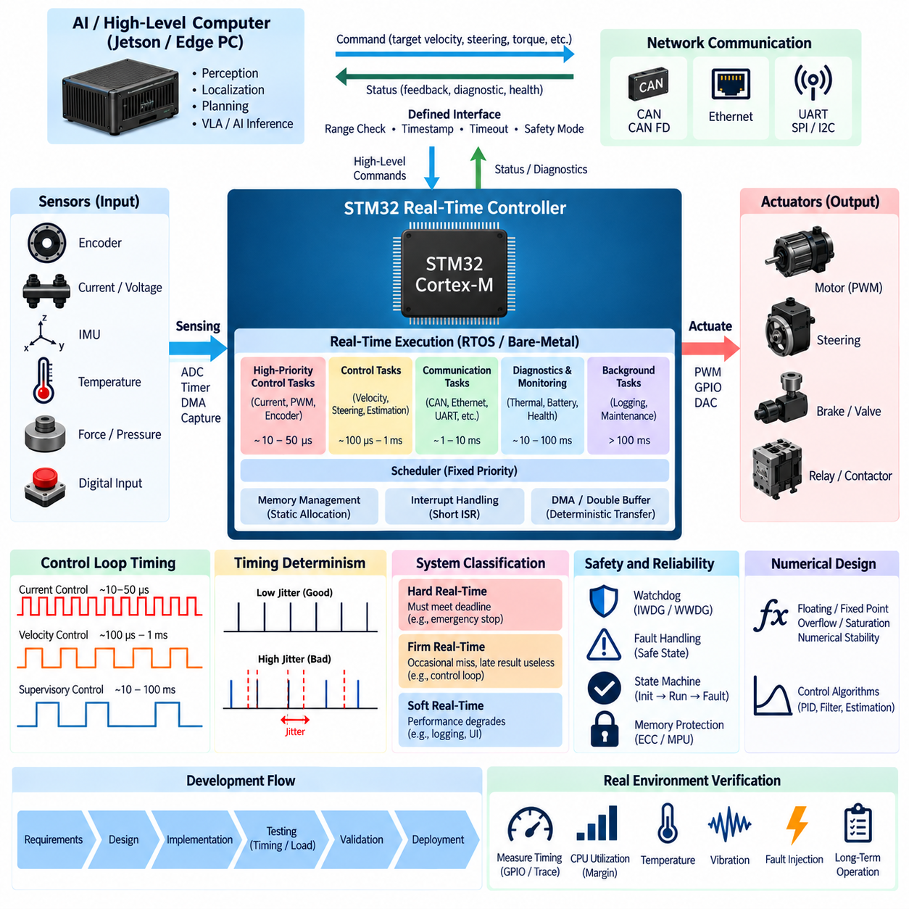
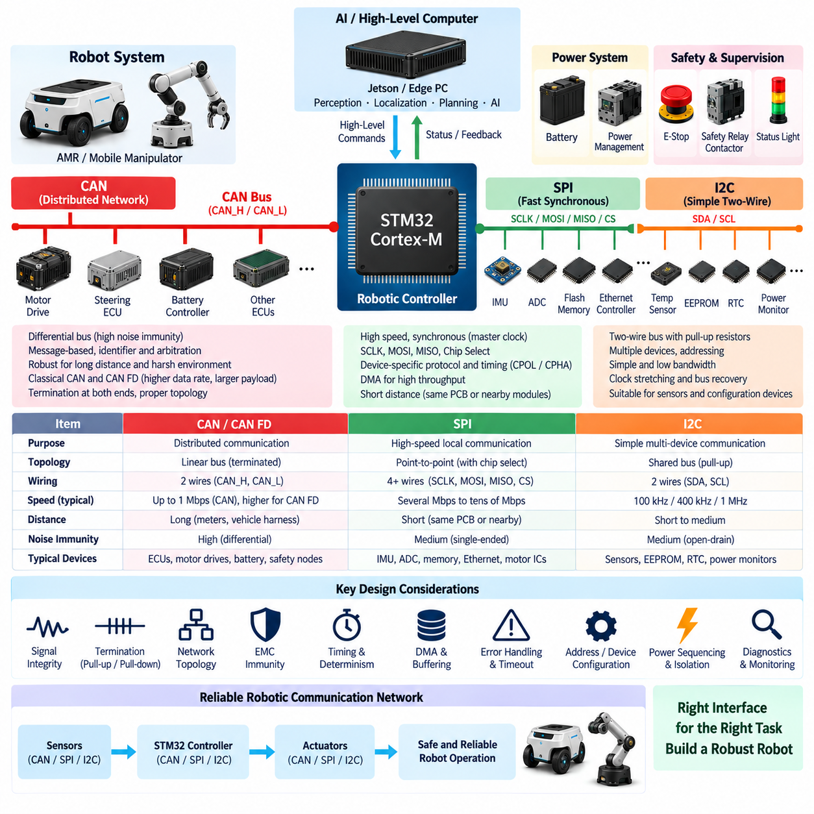
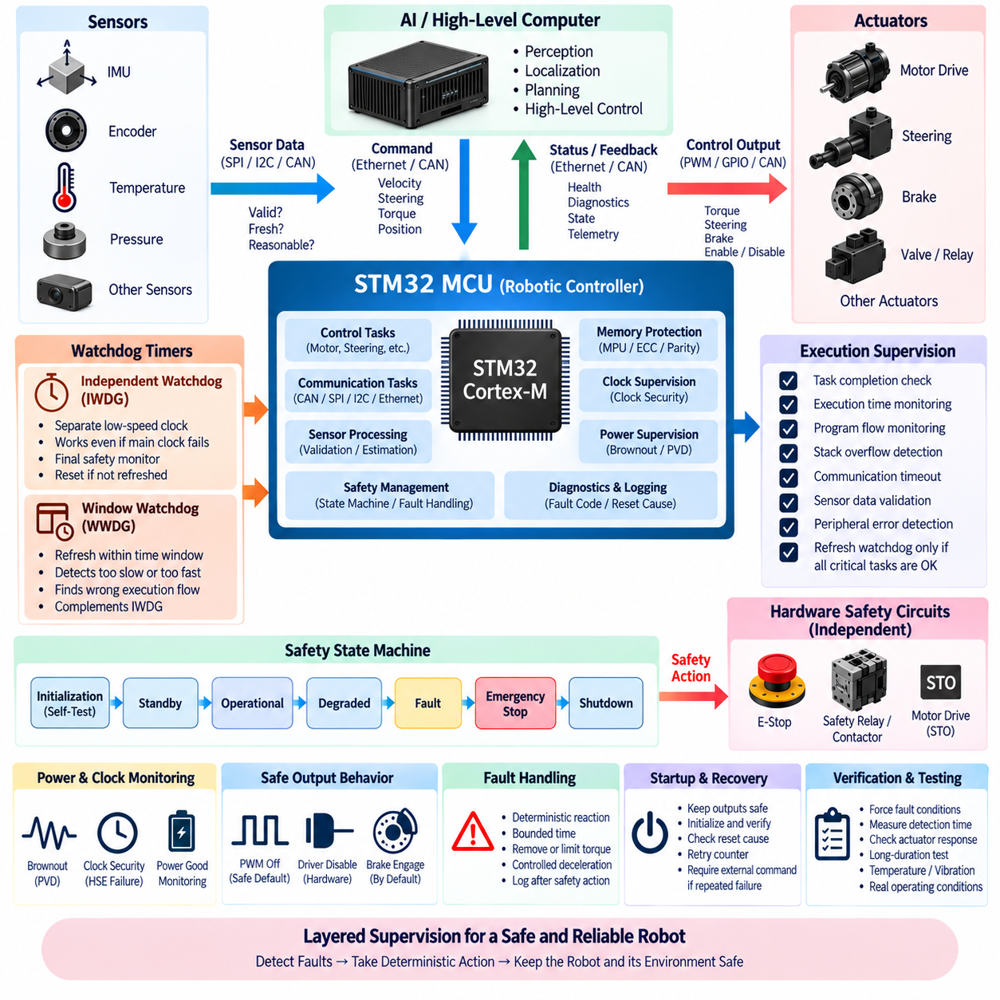
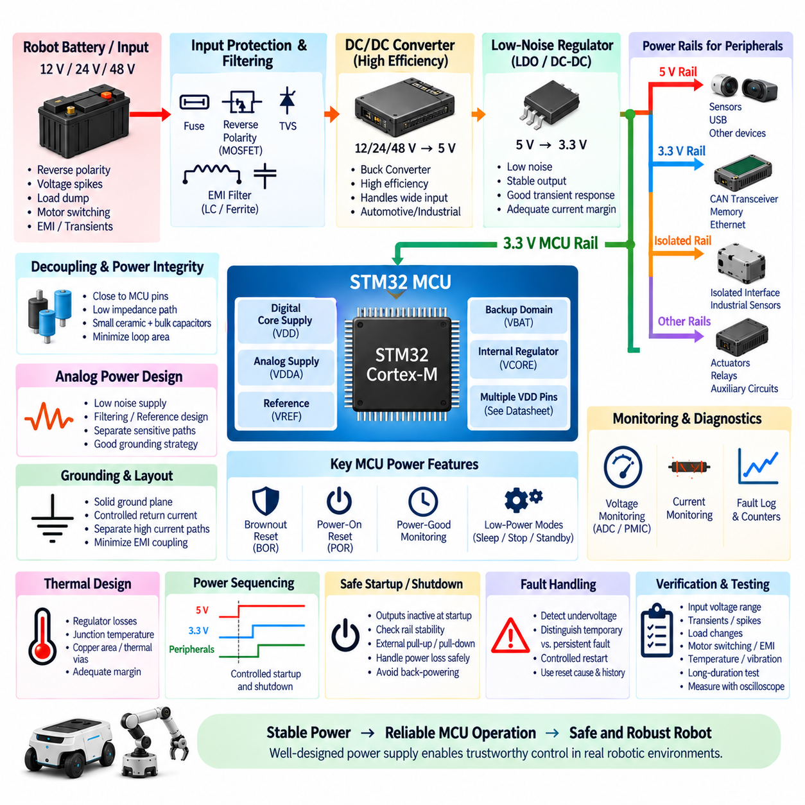

**Volume 16 Compute and AI Architecture**


# Chapter 01. MCU Architecture

##  

## 01.01. STM32/Cortex-M Selection

{width="7.268055555555556in" height="7.268055555555556in"}

The STM32 Cortex-M family provides a broad range of microcontrollers suitable for deterministic control, sensor interfacing, communication, diagnostics, and safety supervision in robotic electrical architectures. Selecting the correct device is therefore not simply a matter of choosing the highest clock frequency. The MCU must be matched to control-loop timing, peripheral requirements, memory demand, power consumption, functional safety goals, environmental constraints, software complexity, and the expected evolution of the robot platform.

A useful starting point is to treat the MCU as the deterministic control layer beneath higher-performance computing platforms. In an AMR, mobile manipulator, quadruped, humanoid, or autonomous vehicle, an STM32 may manage motor commands, wheel encoders, steering actuators, battery signals, emergency inputs, thermal sensors, relays, contactors, and communication buses while a Jetson or edge PC performs perception, localization, planning, and AI inference. This separation prevents variable AI workloads from disturbing time-critical hardware control.

The Cortex-M architecture spans devices optimized for very different purposes. Cortex-M0/M0+ devices emphasize low cost, low power, and relatively simple control tasks. Cortex-M3 and M4 devices provide stronger processing capability, with Cortex-M4 adding DSP-oriented instructions and commonly a floating-point unit. Cortex-M7 devices target substantially higher real-time computing performance, while Cortex-M33 and newer security-oriented implementations introduce capabilities such as TrustZone that are valuable when secure execution becomes part of the embedded architecture.

For robotics, STM32G0 and similar entry-level families are appropriate for distributed I/O modules, simple sensor interfaces, relay controllers, power monitors, lighting modules, and low-complexity actuator nodes. These applications normally require deterministic GPIO, ADC, timers, UART, SPI, I2C, or CAN connectivity rather than intensive numerical computation. Using a smaller MCU at distributed nodes can reduce PCB cost, power consumption, software complexity, and harness traffic while keeping local hardware functions independent from the central computer.

STM32G4 is particularly attractive where motor control and mixed-signal processing are central requirements. Its combination of Cortex-M4 processing, high-resolution timers, fast ADC resources, comparators, operational amplifiers, and mathematical acceleration makes it suitable for BLDC/PMSM control, servo systems, power conversion, battery-related control, and compact actuator electronics. In such applications, peripheral timing and analog integration can be more important than raw CPU frequency because current sampling and PWM generation must remain tightly synchronized.

STM32F4 and related Cortex-M4 devices remain useful for general-purpose robotic controllers requiring a mature software ecosystem and balanced computational capability. They can execute PID control, kinematic preprocessing, sensor filtering, communication management, diagnostic logic, and moderate DSP workloads while supporting common embedded interfaces. Their long history also means that extensive middleware, board examples, libraries, debugging knowledge, and existing firmware designs can often be reused, reducing development risk when maximum MCU performance is unnecessary.

STM32H7-class devices are better suited to high-performance real-time controllers where multiple fast control loops, extensive communications, large memory buffers, signal processing, or sophisticated local estimation must execute simultaneously. Cortex-M7 implementations provide substantially greater computational capability, and some H7 variants combine heterogeneous cores. Such devices can serve as domain controllers between simple distributed MCUs and Linux-based AI computers, handling deterministic control and aggregation without assigning every real-time function to the central processor.

Selection should begin with the worst-case real-time workload rather than average CPU utilization. Engineers should identify the fastest control period, interrupt frequency, communication traffic, sensor sampling rates, filtering workload, diagnostic execution, and maximum simultaneous event load. A controller that appears lightly loaded during normal operation can become unstable when CAN traffic, encoder interrupts, ADC conversion callbacks, diagnostics, and fault processing occur together. Adequate timing margin is therefore an architectural requirement rather than unused computing capacity.

Timer architecture deserves special attention in robotics. Motor control, encoder measurement, PWM generation, input capture, synchronized ADC triggering, pulse counting, and precise actuator sequencing often depend directly on timer resources. The number and capability of advanced-control timers, general-purpose timers, encoder interfaces, DMA channels, and trigger connections should be evaluated before selecting the MCU. A processor with higher benchmark performance can still be unsuitable when its timer topology cannot support the required deterministic I/O relationships.

Communication interfaces are equally important because the MCU normally connects several electrical domains. CAN and CAN FD may connect motor controllers, battery systems, steering modules, and distributed ECUs, while SPI and I2C connect local sensors and peripheral ICs. UART may support GNSS, service interfaces, or auxiliary modules, and Ethernet can provide higher-level connectivity on capable devices. Peripheral quantity must include redundancy and future expansion rather than merely matching the first prototype configuration.

Memory sizing must consider executable code, RTOS objects, communication stacks, calibration parameters, bootloader space, diagnostic data, buffers, logging, and future software growth. SRAM requirements can increase rapidly when CAN FD, Ethernet, sensor streams, filtering, and multiple software tasks operate concurrently. Flash capacity should also reserve sufficient space for secure boot, firmware update strategies, rollback images, or additional diagnostic functionality. Selecting memory with reasonable engineering margin reduces expensive MCU migration later in the product lifecycle.

DMA capability is critical when high-rate peripherals operate concurrently. ADC acquisition, SPI transfers, UART reception, timer events, and communication interfaces should move data with minimal CPU intervention wherever practical. Effective DMA usage reduces interrupt overhead and improves timing predictability, but channel allocation, bus contention, cache behavior, and memory placement must be considered on high-performance devices. MCU selection should therefore evaluate the complete data movement architecture rather than treating DMA as a secondary peripheral feature.

Power architecture also influences device choice. Distributed robot controllers may remain continuously energized even when high-performance computers are shut down, making standby current and low-power modes significant. Conversely, high-performance STM32 devices may require more careful regulator sizing, decoupling, clock design, and thermal analysis. The designer should evaluate operating voltage, peak current, startup behavior, brownout conditions, reset sequencing, and interaction with the robot\'s 12 V, 24 V, or 48 V power distribution system.

Safety-related controllers require additional consideration. Independent watchdogs, window watchdogs, brownout detection, clock monitoring, ECC or parity protection where available, memory protection, fault exceptions, redundant sensing, and deterministic safe-state outputs can contribute to a robust architecture. The MCU itself does not automatically make the system functionally safe; safety depends on the complete hardware and software design, diagnostic coverage, failure analysis, independence, verification process, and the safety integrity required by the target robotic application.

Security is increasingly connected to MCU selection because robotic controllers may receive firmware updates or commands through interconnected networks. Hardware cryptographic accelerators, secure key storage, protected memory regions, secure boot mechanisms, debug-port protection, and TrustZone-capable Cortex-M33 architectures can strengthen the root of trust. This becomes particularly important when an MCU controls physical actuators while communicating with Linux computers, fleet infrastructure, maintenance tools, or remote update systems that have broader attack surfaces.

Software ecosystem maturity should be evaluated together with hardware capability. STM32CubeMX, HAL and LL drivers, RTOS support, CMSIS components, debugging tools, motor-control libraries, communication middleware, and established development practices can shorten implementation time. However, generated configuration should not replace architectural understanding. Clock trees, interrupt priorities, DMA allocation, memory mapping, watchdog behavior, startup sequencing, and peripheral error recovery should be explicitly engineered and documented for production robotic systems.

Package selection is another practical constraint. High-pin-count packages provide additional communication channels, ADC inputs, timers, external memory interfaces, and expansion capability but increase PCB routing complexity and board area. Smaller packages reduce cost and footprint but may expose only a subset of peripheral functions. Pin multiplexing must therefore be validated early, especially when CAN, Ethernet, multiple SPI buses, encoder channels, PWM outputs, safety inputs, debugging interfaces, and external memory must coexist on one controller.

Environmental requirements should be included before the final part number is frozen. Industrial and mobile robots can experience vibration, temperature variation, electrical transients, electromagnetic interference, supply disturbances, and repeated power cycling. Appropriate temperature grades, qualification levels, PCB protection, EMC design, grounding, filtering, connector design, and power conditioning must complement the MCU. A technically powerful processor cannot compensate for an electrical design that allows resets, corrupted communication, or unstable sensor acquisition in the actual operating environment.

A scalable robotic architecture often benefits from using several STM32 classes rather than standardizing on one oversized MCU. Low-cost Cortex-M0+/M3 devices can operate peripheral nodes, Cortex-M4 devices can handle actuator and motor-control functions, and Cortex-M7-class controllers can perform domain-level real-time coordination. Above them, Jetson platforms or edge PCs execute perception and Physical AI workloads. This hierarchy distributes computation according to determinism, bandwidth, safety, and processing characteristics rather than concentrating every function in one processor.

The final STM32 selection should therefore emerge from a requirements matrix covering control frequency, computational margin, timer resources, ADC performance, CAN/CAN FD channels, SPI/I2C/UART demand, Ethernet requirements, Flash and SRAM capacity, DMA topology, safety mechanisms, security functions, temperature range, package constraints, power consumption, software support, cost, and lifecycle availability. The best Cortex-M device is the smallest platform that satisfies these requirements with sufficient margin while preserving a clear migration path for future robotic functions.

STM32 Cortex-M 제품군은 로봇 전기 아키텍처(Robotic Electrical Architecture)에서 결정론적 제어(Deterministic Control), 센서 인터페이스(Sensor Interfacing), 통신(Communication), 진단(Diagnostics), 안전 감시(Safety Supervision)에 적합한 폭넓은 마이크로컨트롤러(Microcontroller)를 제공한다. 따라서 올바른 장치를 선택하는 것은 단순히 가장 높은 클록 주파수(Clock Frequency)를 선택하는 문제가 아니다. MCU는 제어 루프 타이밍(Control-Loop Timing), 주변장치 요구사항(Peripheral Requirements), 메모리 수요(Memory Demand), 전력 소비(Power Consumption), 기능 안전(Functional Safety) 목표, 환경 조건(Environmental Constraints), 소프트웨어 복잡도(Software Complexity), 로봇 플랫폼의 향후 확장성을 종합적으로 고려하여 선정해야 한다.

유용한 출발점은 MCU를 고성능 컴퓨팅 플랫폼(High-Performance Computing Platform) 아래에 위치하는 결정론적 제어 계층(Deterministic Control Layer)으로 정의하는 것이다. AMR, 모바일 매니퓰레이터(Mobile Manipulator), 사족보행 로봇(Quadruped), 휴머노이드(Humanoid), 자율주행 차량(Autonomous Vehicle)에서 STM32는 모터 명령, 휠 인코더(Wheel Encoder), 조향 액추에이터(Steering Actuator), 배터리 신호, 비상 입력, 열 센서, 릴레이(Relay), 접촉기(Contactor), 통신 버스(Communication Bus)를 관리할 수 있다. 반면 Jetson이나 엣지 PC(Edge PC)는 인지(Perception), 위치추정(Localization), 경로계획(Planning), AI 추론(AI Inference)을 수행한다. 이러한 분리는 변동성이 큰 AI 워크로드(AI Workload)가 시간 결정적인 하드웨어 제어를 방해하는 것을 방지한다.

Cortex-M 아키텍처는 서로 다른 목적에 최적화된 다양한 장치로 구성된다. Cortex-M0/M0+ 장치는 낮은 비용, 저전력, 비교적 단순한 제어 작업에 중점을 둔다. Cortex-M3와 M4는 더 높은 처리 성능을 제공하며, Cortex-M4는 디지털 신호 처리(Digital Signal Processing)를 위한 명령어와 일반적으로 부동소수점 장치(Floating-Point Unit)를 추가한다. Cortex-M7은 훨씬 높은 실시간 컴퓨팅 성능(Real-Time Computing Performance)을 목표로 하며, Cortex-M33과 새로운 보안 중심 구현은 보안 실행(Secure Execution)이 임베디드 아키텍처(Embedded Architecture)의 일부가 될 때 유용한 TrustZone과 같은 기능을 제공한다.

로봇 시스템에서 STM32G0 및 이와 유사한 보급형 제품군은 분산 입출력 모듈(Distributed I/O Module), 단순 센서 인터페이스, 릴레이 제어기, 전력 모니터(Power Monitor), 조명 모듈, 저복잡도 액추에이터 노드(Actuator Node)에 적합하다. 이러한 응용 분야에서는 높은 수치 연산 능력보다 결정론적인 GPIO, ADC, 타이머(Timer), UART, SPI, I2C 또는 CAN 연결성이 더 중요하다. 분산 노드에 소형 MCU를 사용하면 PCB 비용, 전력 소비, 소프트웨어 복잡도, 와이어 하니스(Wire Harness)의 통신 부하를 줄이는 동시에 로컬 하드웨어 기능을 중앙 컴퓨터와 독립적으로 유지할 수 있다.

STM32G4는 모터 제어(Motor Control)와 혼합 신호 처리(Mixed-Signal Processing)가 핵심 요구사항인 경우 특히 매력적인 선택이다. Cortex-M4 처리 성능과 고해상도 타이머(High-Resolution Timer), 고속 ADC, 비교기(Comparator), 연산 증폭기(Operational Amplifier), 수학 연산 가속 기능을 결합하여 BLDC/PMSM 제어, 서보 시스템(Servo System), 전력 변환(Power Conversion), 배터리 관련 제어, 소형 액추에이터 전자장치에 적합하다. 이러한 응용에서는 전류 샘플링(Current Sampling)과 PWM 생성이 긴밀하게 동기화되어야 하므로 단순 CPU 주파수보다 주변장치 타이밍과 아날로그 통합(Analog Integration)이 더욱 중요할 수 있다.

STM32F4 및 관련 Cortex-M4 장치는 성숙한 소프트웨어 생태계(Software Ecosystem)와 균형 잡힌 연산 성능이 필요한 범용 로봇 제어기에 여전히 유용하다. PID 제어, 운동학 전처리(Kinematic Preprocessing), 센서 필터링(Sensor Filtering), 통신 관리, 진단 로직(Diagnostic Logic), 중간 수준의 DSP 작업을 수행하면서 일반적인 임베디드 인터페이스(Embedded Interface)를 지원할 수 있다. 또한 오랜 기간 사용된 제품군이므로 광범위한 미들웨어(Middleware), 보드 예제, 라이브러리(Library), 디버깅 지식(Debugging Knowledge), 기존 펌웨어 설계(Firmware Design)를 재사용할 수 있어 최대 MCU 성능이 필요하지 않은 시스템의 개발 위험을 줄일 수 있다.

STM32H7급 장치는 여러 개의 고속 제어 루프, 광범위한 통신, 대용량 메모리 버퍼(Memory Buffer), 신호 처리, 복잡한 로컬 상태추정(Local Estimation)을 동시에 실행해야 하는 고성능 실시간 제어기(High-Performance Real-Time Controller)에 더 적합하다. Cortex-M7 구현은 상당히 높은 연산 능력을 제공하며 일부 H7 모델은 이기종 코어(Heterogeneous Core)를 결합한다. 이러한 장치는 단순 분산 MCU와 Linux 기반 AI 컴퓨터 사이의 도메인 제어기(Domain Controller)로 사용되어 모든 실시간 기능을 중앙 프로세서에 집중시키지 않으면서 결정론적 제어와 데이터 집계(Data Aggregation)를 담당할 수 있다.

MCU 선정은 평균 CPU 사용률이 아니라 최악 조건 실시간 워크로드(Worst-Case Real-Time Workload)를 기준으로 시작해야 한다. 엔지니어는 가장 빠른 제어 주기(Control Period), 인터럽트 주파수(Interrupt Frequency), 통신 트래픽(Communication Traffic), 센서 샘플링 속도(Sampling Rate), 필터링 부하, 진단 실행, 최대 동시 이벤트 부하를 파악해야 한다. 정상 운전에서는 부하가 낮아 보이는 제어기도 CAN 트래픽, 인코더 인터럽트, ADC 변환 콜백(Callback), 진단, 고장 처리(Fault Processing)가 동시에 발생하면 불안정해질 수 있다. 따라서 충분한 타이밍 마진(Timing Margin)은 단순히 남는 연산 능력이 아니라 아키텍처 차원의 필수 요구사항이다.

타이머 아키텍처(Timer Architecture)는 로봇 시스템에서 특별히 주의해야 한다. 모터 제어, 인코더 측정, PWM 생성, 입력 캡처(Input Capture), 동기화된 ADC 트리거링(ADC Triggering), 펄스 카운팅(Pulse Counting), 정밀 액추에이터 시퀀싱(Actuator Sequencing)은 타이머 자원에 직접 의존하는 경우가 많다. MCU를 선정하기 전에 고급 제어 타이머(Advanced-Control Timer), 범용 타이머(General-Purpose Timer), 인코더 인터페이스, DMA 채널, 트리거 연결 구조의 수량과 기능을 평가해야 한다. 벤치마크 성능이 더 높은 프로세서라도 타이머 토폴로지(Timer Topology)가 필요한 결정론적 입출력 관계를 지원하지 못한다면 적합하지 않을 수 있다.

통신 인터페이스(Communication Interface) 역시 중요하다. MCU는 일반적으로 여러 전기적 도메인(Electrical Domain)을 연결하기 때문이다. CAN과 CAN FD는 모터 제어기, 배터리 시스템, 조향 모듈, 분산 ECU를 연결할 수 있으며, SPI와 I2C는 로컬 센서와 주변 IC를 연결한다. UART는 GNSS, 서비스 인터페이스(Service Interface), 보조 모듈을 지원할 수 있고, 지원 가능한 장치에서는 Ethernet을 통해 상위 수준의 연결성을 제공할 수 있다. 주변장치 수량은 최초 시제품 구성만 충족하는 것이 아니라 이중화(Redundancy)와 향후 확장까지 고려하여 결정해야 한다.

메모리 용량(Memory Sizing)은 실행 코드, RTOS 객체, 통신 스택(Communication Stack), 캘리브레이션 파라미터(Calibration Parameter), 부트로더(Bootloader), 진단 데이터, 버퍼(Buffer), 로깅(Logging), 향후 소프트웨어 확장을 모두 고려해야 한다. CAN FD, Ethernet, 센서 스트림(Sensor Stream), 필터링, 다중 소프트웨어 태스크가 동시에 작동하면 SRAM 요구량이 빠르게 증가할 수 있다. Flash 용량 역시 보안 부팅(Secure Boot), 펌웨어 업데이트(Firmware Update), 롤백 이미지(Rollback Image), 추가 진단 기능을 위한 충분한 공간을 확보해야 한다. 적절한 설계 여유를 가진 메모리를 선정하면 제품 수명주기(Product Lifecycle) 중 비용이 큰 MCU 변경을 줄일 수 있다.

DMA 기능은 고속 주변장치가 동시에 작동할 때 매우 중요하다. ADC 데이터 취득(Data Acquisition), SPI 전송, UART 수신, 타이머 이벤트, 통신 인터페이스는 가능한 한 CPU 개입을 최소화하면서 데이터를 이동시켜야 한다. 효과적인 DMA 사용은 인터럽트 오버헤드(Interrupt Overhead)를 줄이고 타이밍 예측성(Timing Predictability)을 향상시키지만, 고성능 장치에서는 DMA 채널 할당, 버스 경합(Bus Contention), 캐시 동작(Cache Behavior), 메모리 배치(Memory Placement)를 함께 고려해야 한다. 따라서 MCU 선정에서는 DMA를 단순한 보조 기능으로 보지 말고 전체 데이터 이동 아키텍처(Data Movement Architecture)를 평가해야 한다.

전력 아키텍처(Power Architecture)도 MCU 선택에 영향을 준다. 분산 로봇 제어기는 고성능 컴퓨터가 종료된 상태에서도 계속 전원이 공급될 수 있으므로 대기 전류(Standby Current)와 저전력 모드(Low-Power Mode)가 중요하다. 반대로 고성능 STM32 장치는 전압 조정기(Regulator) 용량, 디커플링(Decoupling), 클록 설계, 열 설계(Thermal Analysis)에 더 세심한 접근이 필요할 수 있다. 설계자는 동작 전압, 피크 전류(Peak Current), 기동 동작(Startup Behavior), 브라운아웃(Brownout), 리셋 시퀀싱(Reset Sequencing), 로봇의 12 V, 24 V 또는 48 V 전력 분배 시스템(Power Distribution System)과의 상호작용을 평가해야 한다.

안전 관련 제어기(Safety-Related Controller)는 추가적인 검토가 필요하다. 독립 워치독(Independent Watchdog), 윈도우 워치독(Window Watchdog), 브라운아웃 감지(Brownout Detection), 클록 모니터링(Clock Monitoring), 지원되는 경우 ECC 또는 패리티 보호(Parity Protection), 메모리 보호(Memory Protection), 고장 예외(Fault Exception), 이중화 센싱(Redundant Sensing), 결정론적 안전 상태 출력(Safe-State Output)은 견고한 아키텍처 구축에 기여할 수 있다. 그러나 MCU 자체만으로 시스템이 자동으로 기능 안전을 확보하는 것은 아니다. 안전성은 전체 하드웨어와 소프트웨어 설계, 진단 커버리지(Diagnostic Coverage), 고장 분석(Failure Analysis), 독립성(Independence), 검증 프로세스(Verification Process), 목표 로봇 응용 분야에서 요구되는 안전 무결성(Safety Integrity)에 의해 결정된다.

보안(Security)은 로봇 제어기가 상호 연결된 네트워크를 통해 펌웨어 업데이트나 명령을 받을 수 있기 때문에 MCU 선정과 점점 더 밀접하게 연결되고 있다. 하드웨어 암호화 가속기(Hardware Cryptographic Accelerator), 보안 키 저장소(Secure Key Storage), 보호 메모리 영역(Protected Memory Region), 보안 부팅 메커니즘(Secure Boot Mechanism), 디버그 포트 보호(Debug-Port Protection), TrustZone을 지원하는 Cortex-M33 아키텍처는 신뢰점(Root of Trust)을 강화할 수 있다. 이는 MCU가 물리적 액추에이터를 제어하면서 Linux 컴퓨터, 플릿 인프라(Fleet Infrastructure), 유지보수 도구, 원격 업데이트 시스템과 통신하는 환경에서 특히 중요하다.

소프트웨어 생태계의 성숙도(Software Ecosystem Maturity)는 하드웨어 성능과 함께 평가해야 한다. STM32CubeMX, HAL 및 LL 드라이버(Driver), RTOS 지원, CMSIS 구성요소, 디버깅 도구, 모터 제어 라이브러리, 통신 미들웨어, 검증된 개발 방법은 구현 시간을 단축할 수 있다. 그러나 자동 생성된 설정이 아키텍처에 대한 이해를 대신해서는 안 된다. 클록 트리(Clock Tree), 인터럽트 우선순위(Interrupt Priority), DMA 할당, 메모리 매핑(Memory Mapping), 워치독 동작, 기동 시퀀싱, 주변장치 오류 복구(Error Recovery)는 양산 로봇 시스템을 위해 명시적으로 설계하고 문서화해야 한다.

패키지 선정(Package Selection) 역시 실질적인 제약 조건이다. 핀 수가 많은 패키지는 추가 통신 채널, ADC 입력, 타이머, 외부 메모리 인터페이스(External Memory Interface), 확장 기능을 제공하지만 PCB 배선 복잡도와 보드 면적을 증가시킨다. 작은 패키지는 비용과 크기를 줄일 수 있지만 주변장치 기능의 일부만 외부 핀으로 제공할 수 있다. 따라서 CAN, Ethernet, 다중 SPI 버스, 인코더 채널, PWM 출력, 안전 입력, 디버깅 인터페이스, 외부 메모리가 하나의 제어기에서 동시에 사용되어야 한다면 초기 설계 단계에서 핀 멀티플렉싱(Pin Multiplexing)을 반드시 검증해야 한다.

최종 부품 번호(Part Number)를 확정하기 전에 환경 요구사항(Environmental Requirements)도 포함해야 한다. 산업용 및 이동형 로봇은 진동, 온도 변화, 전기적 과도현상(Electrical Transient), 전자기 간섭(Electromagnetic Interference), 전원 변동, 반복적인 전원 온·오프에 노출될 수 있다. 적절한 온도 등급(Temperature Grade), 인증 수준(Qualification Level), PCB 보호, EMC 설계, 접지(Grounding), 필터링(Filtering), 커넥터 설계, 전원 컨디셔닝(Power Conditioning)이 MCU와 함께 고려되어야 한다. 아무리 성능이 뛰어난 프로세서라도 실제 운용 환경에서 리셋, 통신 오류, 센서 데이터 불안정이 발생하는 전기 설계를 보완할 수는 없다.

확장 가능한 로봇 아키텍처(Scalable Robotic Architecture)에서는 하나의 과도하게 큰 MCU로 표준화하기보다 여러 등급의 STM32를 적절하게 사용하는 것이 효과적이다. 저비용 Cortex-M0+/M3 장치는 주변 노드(Peripheral Node)를 담당하고, Cortex-M4 장치는 액추에이터 및 모터 제어 기능을 처리하며, Cortex-M7급 제어기는 도메인 수준의 실시간 조정(Domain-Level Real-Time Coordination)을 수행할 수 있다. 그 상위에서는 Jetson 플랫폼이나 엣지 PC가 인지와 피지컬 AI(Physical AI) 워크로드를 실행한다. 이러한 계층 구조는 모든 기능을 하나의 프로세서에 집중시키는 대신 결정성(Determinism), 대역폭(Bandwidth), 안전성, 처리 특성에 따라 연산을 분산한다.

최종 STM32 선정은 제어 주파수(Control Frequency), 연산 여유(Computational Margin), 타이머 자원, ADC 성능, CAN/CAN FD 채널, SPI/I2C/UART 요구량, Ethernet 요구사항, Flash 및 SRAM 용량, DMA 토폴로지, 안전 메커니즘(Safety Mechanism), 보안 기능(Security Function), 온도 범위, 패키지 제약, 전력 소비, 소프트웨어 지원, 비용, 제품 공급 수명(Lifecycle Availability)을 포함하는 요구사항 매트릭스(Requirements Matrix)를 기반으로 이루어져야 한다. 최적의 Cortex-M 장치는 이러한 요구사항을 충분한 설계 여유와 함께 만족하면서 향후 로봇 기능 확장을 위한 명확한 마이그레이션 경로(Migration Path)를 유지할 수 있는 가장 작은 플랫폼이다.

##  

## 01.02. Real Time Control Design

{width="7.268055555555556in" height="7.268055555555556in"}

Real-time control design defines how a robotic controller senses physical events, computes control actions, and updates actuators within explicitly bounded time intervals. Unlike general computing, correctness depends not only on producing the correct numerical result but also on producing it before a defined deadline. In an STM32-based robotic architecture, deterministic execution is therefore a fundamental design requirement for motor control, steering, braking, power management, safety supervision, and distributed actuator coordination.

A real-time system should first be classified according to the consequences of missing its timing deadline. Hard real-time functions require the result to be available before the deadline because a late response may create an unsafe or uncontrollable state. Firm real-time functions tolerate occasional misses but consider late results useless, while soft real-time functions primarily experience degraded performance. Emergency shutdown, motor commutation, and safety monitoring generally require much stricter timing behavior than telemetry, logging, or user-interface updates.

The fundamental structure of a real-time controller is a repeated sense-compute-actuate cycle. Sensors provide encoder positions, currents, voltages, temperatures, forces, inertial measurements, or digital states. The MCU acquires these inputs at defined sampling instants, executes estimation and control algorithms, and updates PWM signals, motor commands, valves, relays, or other actuators. Maintaining a stable and predictable cycle period is essential because most control algorithms are designed around a known sampling interval rather than an arbitrarily varying execution schedule.

Control-loop frequency must be selected according to the dynamics of the controlled system. Fast electrical processes such as motor current regulation may require substantially higher update rates than velocity, steering, thermal, or supervisory control. A robot can therefore contain several nested control loops operating at different frequencies. The MCU architecture must guarantee that the fastest loop receives the highest timing priority while slower functions execute without introducing excessive interference, blocking, or computational overload.

Sampling jitter is one of the most important sources of real-time control degradation. Jitter occurs when the actual execution or sampling instant deviates from its intended periodic schedule. Excessive jitter changes the effective sampling interval and can reduce controller accuracy, phase margin, or stability. Timer-triggered ADC conversion, hardware capture, DMA transfers, and precisely scheduled control tasks are preferable to software polling when deterministic acquisition is required, because hardware timing minimizes variability introduced by unrelated software activity.

Execution time must be characterized using worst-case execution time rather than average measurements. A control algorithm that normally completes in 100 microseconds but occasionally requires 250 microseconds must be designed around the longer condition if its deadline is critical. Cache behavior, interrupt preemption, communication processing, memory contention, conditional branches, floating-point operations, and diagnostic functions can all change execution time. Adequate timing margin should remain after the worst credible combination of tasks has been considered.

Interrupt architecture strongly influences deterministic behavior. High-priority interrupts should be reserved for genuinely time-critical events such as control timers, encoder capture, critical communication reception, or safety-related inputs. Long computations should generally not execute directly inside interrupt service routines. Instead, the interrupt should capture the event, store essential data, and activate an appropriate task or state transition. Keeping interrupt service routines short reduces blocking and makes response latency easier to analyze and verify.

Interrupt priority must reflect system criticality rather than software development convenience. A high-frequency but low-importance peripheral can otherwise delay a lower-frequency safety-critical event. Nested interrupts, priority grouping, critical sections, and interrupt masking should therefore be designed systematically. Particular attention is required when firmware disables interrupts while accessing shared data, because an apparently short critical section can increase worst-case latency and interfere with motor-control, communication, or emergency-response deadlines.

A real-time operating system can organize increasingly complex robotic firmware into independent tasks for control, communication, diagnostics, monitoring, and background processing. Each task can be assigned a period, deadline, and priority according to its function. Fixed-priority scheduling is common in MCU systems because it is relatively straightforward to implement and analyze. However, an RTOS does not automatically guarantee real-time behavior; task execution time, blocking, synchronization, interrupt interaction, and total processor utilization must still be engineered explicitly.

Priority inversion can occur when a high-priority control task waits for a resource held by a lower-priority task while an intermediate-priority task continues executing. This condition can unexpectedly increase response latency and violate deadlines. Mutex mechanisms with priority inheritance or priority ceiling techniques can reduce this risk. Better architectural partitioning can eliminate many shared-resource dependencies entirely, particularly when control loops communicate through carefully defined buffers rather than sharing large mutable software structures.

Communication processing must also be integrated into the timing model. CAN, CAN FD, SPI, I2C, UART, and Ethernet traffic can generate asynchronous interrupts and significant processing load. Critical control messages should be assigned appropriate network priorities and handled without allowing communication bursts to monopolize the processor. Receive queues, transmit queues, DMA, hardware filtering, and bounded message-processing budgets help separate communication timing from control-loop timing while preventing buffer overflow or stale command execution.

DMA is especially valuable for deterministic real-time designs because it allows peripheral data to move without requiring the CPU to process every byte or sample. ADC sequences, SPI sensor transfers, UART streams, and other repetitive transactions can be transferred directly between peripherals and memory. The CPU can then execute control algorithms while DMA operates concurrently. Nevertheless, DMA itself must be designed carefully because simultaneous transfers can create bus contention, memory-access delays, or synchronization problems on high-performance STM32 devices.

Double buffering is a useful technique for separating data acquisition from computation. One memory buffer can receive sensor data through DMA while the control algorithm processes the previously completed buffer. When acquisition finishes, the buffers exchange roles. This approach reduces the need to stop sampling during computation and establishes a clear boundary between producer and consumer operations. Sequence counters or timestamps can additionally detect lost, duplicated, or delayed samples when system integrity is important.

Time synchronization becomes increasingly important when a controller combines measurements from several sensors or distributed ECUs. Encoder, IMU, force, steering, and motor-current measurements should represent sufficiently consistent physical time if they are used together in estimation or control. Local hardware timers provide precise timing within an MCU, while distributed systems may require synchronized clocks or timestamp exchange across communication networks. Without consistent timestamps, sensor fusion can interpret temporal misalignment as actual physical motion or disturbance.

State machines provide an effective supervisory structure around high-frequency control loops. A robotic controller may transition through initialization, self-test, standby, enabled, active control, degraded operation, fault, and safe shutdown states. Each transition should have explicit conditions and defined outputs. Separating supervisory state logic from numerical control algorithms improves traceability and prevents uncontrolled actuator activation during startup, communication loss, sensor failure, or abnormal power conditions.

Watchdog mechanisms should supervise the real-time execution architecture rather than merely reset the MCU when software freezes. An independent watchdog can verify that essential software execution continues, while a window watchdog can detect tasks executing too slowly or unexpectedly quickly. More advanced designs update watchdog supervision only after several critical tasks have completed successfully. This prevents a noncritical background task from continually refreshing the watchdog while the actual control function has failed.

Fault handling must be bounded in time just like normal control execution. Sensor timeout, invalid encoder values, overcurrent, overtemperature, communication loss, memory errors, and actuator disagreement should trigger predetermined responses. Depending on severity, the controller may substitute a valid fallback value, reduce actuator authority, enter degraded operation, disable a channel, or transition immediately to a safe state. Fault management should avoid uncontrolled retry loops or lengthy diagnostic routines inside critical execution paths.

Numerical design also affects real-time performance. Floating-point processing is convenient for control algorithms, filters, coordinate transformations, and estimation, particularly on Cortex-M4 and Cortex-M7 devices equipped with floating-point hardware. Fixed-point arithmetic may still be appropriate for highly constrained controllers or algorithms requiring tightly bounded execution. Regardless of representation, numerical overflow, saturation, division by small values, invalid floating-point results, and accumulated integration error must be explicitly handled.

Memory allocation should remain predictable during real-time operation. Dynamic allocation can introduce variable execution time, fragmentation, allocation failure, and difficult-to-reproduce behavior. Critical firmware therefore commonly allocates control structures, communication buffers, task stacks, and sensor data statically during initialization. Stack usage should be measured under worst-case nesting conditions, and sufficient margin should be reserved for interrupts, library calls, diagnostic paths, and exceptional operating conditions.

Control and communication data shared between tasks or interrupts require explicit concurrency protection. Atomic operations, short critical sections, lock-free buffers, queues, or carefully designed ownership models can prevent partially updated data from being consumed. Protection mechanisms should be selected according to timing impact because excessive locking can damage determinism. For high-rate sensor and actuator paths, transferring immutable snapshots or indexed buffers is often preferable to allowing several software components to modify the same structure.

A practical STM32 real-time architecture can divide execution into several timing domains. The fastest domain handles motor current, PWM synchronization, encoder capture, or other hardware-near functions. A medium-rate domain performs velocity, steering, actuator coordination, and state estimation. Slower domains handle diagnostics, thermal management, battery supervision, communication management, and health reporting. Background execution can perform logging or maintenance functions only when sufficient processor time remains.

Real-time control should be separated from high-level AI and perception workloads. Jetson platforms or edge PCs can execute camera processing, LiDAR perception, localization, path planning, VLA models, or other computationally intensive algorithms whose latency may vary. The STM32 should receive bounded commands such as target velocity, steering angle, torque, or actuator position and convert them into deterministic hardware actions. If the high-level computer becomes delayed or unavailable, the MCU must detect command timeout and execute a predefined safe response.

The interface between AI computing and deterministic control should therefore be treated as a contract. Commands require valid ranges, sequence information, timestamps where necessary, timeout limits, operating-mode conditions, and explicit fault behavior. The MCU should not blindly execute arbitrary values received from a high-level processor. Range checking, rate limiting, plausibility verification, state validation, and command freshness checks form a protective boundary between nondeterministic intelligent computing and the physical actuator system.

Verification requires measurement of actual timing behavior on the target hardware. GPIO timing pins, hardware timers, trace facilities, cycle counters, RTOS runtime statistics, and communication timestamps can reveal execution duration, jitter, interrupt latency, scheduling delays, and deadline misses. Testing should include maximum communication load, simultaneous sensor activity, fault injection, startup and shutdown, thermal conditions, and prolonged operation rather than evaluating only a lightly loaded laboratory scenario.

Processor utilization should retain sufficient reserve for abnormal conditions and future software expansion. Designing a controller to operate continuously near full CPU utilization leaves little margin for communication bursts, diagnostics, fault processing, firmware growth, or execution-time variation. The exact acceptable margin depends on architecture and criticality, but the engineering objective is clear: deterministic deadlines must remain satisfied under worst credible operating conditions rather than only during nominal demonstrations.

A robust real-time control design ultimately combines deterministic hardware timing, bounded software execution, carefully assigned priorities, predictable memory behavior, structured communication, explicit fault management, watchdog supervision, and measured timing verification. In the compute hierarchy of a Physical AI robot, the STM32 real-time controller forms the dependable bridge between intelligent high-level decisions and physical motion, ensuring that commands are translated into actuator behavior with predictable timing even when the surrounding computing environment is complex or variable.

실시간 제어 설계(Real-Time Control Design)는 로봇 제어기(Robotic Controller)가 물리적 이벤트를 감지하고, 제어 동작을 계산하며, 명확하게 제한된 시간 간격 내에서 액추에이터(Actuator)를 갱신하는 방법을 정의한다. 일반적인 컴퓨팅과 달리 실시간 시스템의 정확성은 올바른 수치 결과를 생성하는 것뿐만 아니라 정의된 마감시간(Deadline) 이전에 결과를 생성하는 것에도 달려 있다. 따라서 STM32 기반 로봇 아키텍처에서는 결정론적 실행(Deterministic Execution)이 모터 제어, 조향, 제동, 전력 관리, 안전 감시, 분산 액추에이터 협조를 위한 기본적인 설계 요구사항이다.

실시간 시스템(Real-Time System)은 먼저 타이밍 마감시간(Timing Deadline)을 놓쳤을 때 발생하는 결과에 따라 분류해야 한다. 하드 실시간(Hard Real-Time) 기능은 늦은 응답이 불안전하거나 제어 불가능한 상태를 만들 수 있기 때문에 반드시 마감시간 이전에 결과가 제공되어야 한다. 펌 실시간(Firm Real-Time)은 가끔 마감시간을 놓치는 것을 허용하지만 늦은 결과는 무효로 간주하며, 소프트 실시간(Soft Real-Time)은 주로 성능 저하가 발생한다. 비상 정지, 모터 정류(Motor Commutation), 안전 감시는 일반적으로 텔레메트리(Telemetry), 로깅(Logging), 사용자 인터페이스 갱신보다 훨씬 엄격한 타이밍 특성을 요구한다.

실시간 제어기의 기본 구조는 반복적인 감지-계산-구동(Sense-Compute-Actuate) 주기로 구성된다. 센서는 인코더 위치, 전류, 전압, 온도, 힘, 관성 측정값(Inertial Measurement), 디지털 상태를 제공한다. MCU는 정의된 샘플링 시점(Sampling Instant)에 이러한 입력을 취득하고 상태 추정(Estimation)과 제어 알고리즘(Control Algorithm)을 실행한 다음 PWM 신호, 모터 명령, 밸브, 릴레이 또는 기타 액추에이터를 갱신한다. 대부분의 제어 알고리즘은 임의로 변하는 실행 주기가 아니라 알려진 샘플링 간격(Sampling Interval)을 기준으로 설계되므로 안정적이고 예측 가능한 제어 주기(Control Cycle)를 유지하는 것이 중요하다.

제어 루프 주파수(Control-Loop Frequency)는 제어 대상 시스템의 동특성(Dynamics)에 따라 선정해야 한다. 모터 전류 제어와 같은 빠른 전기적 과정은 속도, 조향, 열 관리 또는 상위 감독 제어보다 훨씬 높은 갱신 속도를 요구할 수 있다. 따라서 하나의 로봇에는 서로 다른 주파수로 동작하는 여러 개의 중첩 제어 루프(Nested Control Loop)가 존재할 수 있다. MCU 아키텍처는 가장 빠른 루프에 가장 높은 타이밍 우선순위(Timing Priority)를 보장하면서 느린 기능이 과도한 간섭, 블로킹(Blocking), 연산 과부하를 발생시키지 않고 실행되도록 해야 한다.

샘플링 지터(Sampling Jitter)는 실시간 제어 성능을 저하시키는 가장 중요한 원인 중 하나이다. 지터는 실제 실행 또는 샘플링 시점이 의도된 주기적 스케줄에서 벗어날 때 발생한다. 과도한 지터는 유효 샘플링 간격을 변화시켜 제어기의 정확도, 위상 여유(Phase Margin), 안정성을 저하시킬 수 있다. 결정론적 데이터 취득이 필요한 경우 소프트웨어 폴링(Software Polling)보다 타이머 트리거 ADC 변환(Timer-Triggered ADC Conversion), 하드웨어 캡처(Hardware Capture), DMA 전송, 정밀하게 스케줄링된 제어 태스크(Control Task)를 사용하는 것이 바람직하다. 하드웨어 기반 타이밍은 관련 없는 소프트웨어 동작으로 발생하는 변동성을 최소화하기 때문이다.

실행 시간(Execution Time)은 평균 측정값이 아니라 최악 실행 시간(Worst-Case Execution Time, WCET)을 기준으로 평가해야 한다. 일반적으로 100마이크로초 내에 완료되지만 특정 조건에서 250마이크로초가 필요한 제어 알고리즘이라면 마감시간이 중요한 경우 더 긴 실행 조건을 기준으로 설계해야 한다. 캐시 동작(Cache Behavior), 인터럽트 선점(Interrupt Preemption), 통신 처리, 메모리 경합(Memory Contention), 조건 분기, 부동소수점 연산(Floating-Point Operation), 진단 기능은 모두 실행 시간을 변화시킬 수 있다. 현실적으로 발생 가능한 최악의 태스크 조합을 고려한 이후에도 충분한 타이밍 여유(Timing Margin)를 확보해야 한다.

인터럽트 아키텍처(Interrupt Architecture)는 결정론적 동작에 큰 영향을 준다. 높은 우선순위의 인터럽트는 제어 타이머, 인코더 캡처, 중요 통신 수신, 안전 관련 입력과 같이 실제로 시간 결정적인 이벤트를 위해 사용해야 한다. 긴 연산은 일반적으로 인터럽트 서비스 루틴(Interrupt Service Routine, ISR) 내부에서 직접 수행하지 않는 것이 바람직하다. 대신 인터럽트에서는 이벤트를 캡처하고 필수 데이터를 저장한 후 적절한 태스크나 상태 전이(State Transition)를 활성화해야 한다. ISR을 짧게 유지하면 블로킹을 줄이고 응답 지연(Response Latency)을 보다 쉽게 분석하고 검증할 수 있다.

인터럽트 우선순위(Interrupt Priority)는 소프트웨어 개발 편의성이 아니라 시스템 중요도(System Criticality)를 반영해야 한다. 그렇지 않으면 높은 빈도로 발생하지만 중요도가 낮은 주변장치가 빈도는 낮지만 안전에 중요한 이벤트를 지연시킬 수 있다. 따라서 중첩 인터럽트(Nested Interrupt), 우선순위 그룹(Priority Grouping), 임계 구역(Critical Section), 인터럽트 마스킹(Interrupt Masking)을 체계적으로 설계해야 한다. 특히 공유 데이터에 접근하기 위해 펌웨어가 인터럽트를 비활성화할 경우 주의가 필요하다. 짧아 보이는 임계 구역도 최악 조건 지연시간을 증가시켜 모터 제어, 통신, 비상 대응 마감시간에 영향을 줄 수 있기 때문이다.

실시간 운영체제(Real-Time Operating System, RTOS)는 복잡해지는 로봇 펌웨어를 제어, 통신, 진단, 모니터링, 백그라운드 처리 등을 담당하는 독립적인 태스크(Task)로 구성할 수 있게 한다. 각 태스크에는 기능에 따라 주기(Period), 마감시간, 우선순위를 할당할 수 있다. 고정 우선순위 스케줄링(Fixed-Priority Scheduling)은 구현과 분석이 비교적 명확하기 때문에 MCU 시스템에서 널리 사용된다. 그러나 RTOS를 사용한다고 해서 실시간 동작이 자동으로 보장되는 것은 아니다. 태스크 실행 시간, 블로킹, 동기화(Synchronization), 인터럽트 상호작용, 전체 프로세서 사용률을 명시적으로 설계해야 한다.

우선순위 역전(Priority Inversion)은 높은 우선순위의 제어 태스크가 낮은 우선순위 태스크가 점유한 자원을 기다리는 동안 중간 우선순위 태스크가 계속 실행할 때 발생할 수 있다. 이러한 상황은 예상하지 못한 응답 지연을 증가시켜 마감시간 위반(Deadline Miss)을 발생시킬 수 있다. 우선순위 상속(Priority Inheritance) 또는 우선순위 상한(Priority Ceiling)을 지원하는 뮤텍스(Mutex)를 사용하면 이러한 위험을 줄일 수 있다. 특히 제어 루프가 대규모 가변 소프트웨어 구조를 공유하지 않고 명확하게 정의된 버퍼(Buffer)를 통해 통신하도록 설계하면 많은 공유 자원 의존성을 구조적으로 제거할 수 있다.

통신 처리(Communication Processing) 역시 타이밍 모델(Timing Model)에 통합해야 한다. CAN, CAN FD, SPI, I2C, UART, Ethernet 트래픽은 비동기 인터럽트(Asynchronous Interrupt)와 상당한 처리 부하를 발생시킬 수 있다. 중요 제어 메시지에는 적절한 네트워크 우선순위(Network Priority)를 부여하고 통신 버스트(Communication Burst)가 프로세서를 독점하지 않도록 처리해야 한다. 수신 큐(Receive Queue), 송신 큐(Transmit Queue), DMA, 하드웨어 필터링(Hardware Filtering), 제한된 메시지 처리 예산(Message-Processing Budget)을 사용하면 통신 타이밍과 제어 루프 타이밍을 분리하면서 버퍼 오버플로(Buffer Overflow)나 오래된 명령 실행을 방지할 수 있다.

DMA는 주변장치 데이터를 CPU가 모든 바이트 또는 샘플마다 직접 처리하지 않고 이동시킬 수 있기 때문에 결정론적 실시간 설계에서 특히 유용하다. ADC 시퀀스, SPI 센서 전송, UART 스트림 및 기타 반복적인 트랜잭션(Transaction)을 주변장치와 메모리 사이에서 직접 전송할 수 있다. CPU는 DMA가 병렬로 동작하는 동안 제어 알고리즘을 실행할 수 있다. 그러나 고성능 STM32에서는 여러 DMA 전송이 동시에 발생하면 버스 경합, 메모리 접근 지연, 동기화 문제가 발생할 수 있으므로 DMA 자체도 신중하게 설계해야 한다.

이중 버퍼링(Double Buffering)은 데이터 취득(Data Acquisition)과 연산을 분리하는 유용한 기법이다. 하나의 메모리 버퍼가 DMA를 통해 센서 데이터를 수신하는 동안 제어 알고리즘은 이전에 완료된 버퍼를 처리할 수 있다. 데이터 취득이 완료되면 두 버퍼의 역할을 교환한다. 이 방식은 연산 중 샘플링을 중단할 필요성을 줄이고 생산자(Producer)와 소비자(Consumer) 동작 사이에 명확한 경계를 형성한다. 시스템 무결성(System Integrity)이 중요한 경우 시퀀스 카운터(Sequence Counter) 또는 타임스탬프(Timestamp)를 추가하여 누락, 중복, 지연된 샘플을 탐지할 수 있다.

시간 동기화(Time Synchronization)는 제어기가 여러 센서 또는 분산 ECU의 측정값을 결합할 때 더욱 중요해진다. 인코더, IMU, 힘, 조향, 모터 전류 측정값을 상태 추정이나 제어에 함께 사용한다면 충분히 일관된 물리적 시간(Physical Time)을 나타내야 한다. 로컬 하드웨어 타이머(Local Hardware Timer)는 MCU 내부에서 정밀한 타이밍을 제공하며, 분산 시스템에서는 통신 네트워크를 통한 동기화된 클록(Synchronized Clock)이나 타임스탬프 교환이 필요할 수 있다. 일관된 타임스탬프가 없으면 센서 융합(Sensor Fusion)이 시간적 불일치(Temporal Misalignment)를 실제 물리적 움직임이나 외란(Disturbance)으로 잘못 해석할 수 있다.

상태 머신(State Machine)은 고주파 제어 루프 주변의 상위 감독 구조(Supervisory Structure)를 구성하는 효과적인 방법이다. 로봇 제어기는 초기화(Initialization), 자체 진단(Self-Test), 대기(Standby), 활성화(Enabled), 능동 제어(Active Control), 성능 저하 운전(Degraded Operation), 고장(Fault), 안전 정지(Safe Shutdown) 상태를 전환할 수 있다. 각 상태 전이에는 명확한 조건과 정의된 출력이 있어야 한다. 상위 상태 로직과 수치 제어 알고리즘을 분리하면 추적성(Traceability)을 향상시키고 기동, 통신 손실, 센서 고장, 비정상 전원 조건에서 의도하지 않은 액추에이터 작동을 방지할 수 있다.

워치독 메커니즘(Watchdog Mechanism)은 단순히 소프트웨어가 정지했을 때 MCU를 리셋하는 용도가 아니라 실시간 실행 아키텍처 자체를 감시하도록 설계해야 한다. 독립 워치독(Independent Watchdog)은 필수 소프트웨어가 계속 실행되는지 확인할 수 있으며, 윈도우 워치독(Window Watchdog)은 태스크가 지나치게 느리거나 비정상적으로 빠르게 실행되는 상황을 탐지할 수 있다. 더욱 발전된 설계에서는 여러 중요 태스크가 정상적으로 완료된 이후에만 워치독을 갱신한다. 이를 통해 실제 제어 기능이 실패했는데 중요하지 않은 백그라운드 태스크가 계속 워치독을 갱신하는 상황을 방지할 수 있다.

고장 처리(Fault Handling)는 정상적인 제어 실행과 마찬가지로 제한된 시간 내에 수행되어야 한다. 센서 타임아웃(Sensor Timeout), 잘못된 인코더 값, 과전류(Overcurrent), 과열(Overtemperature), 통신 손실, 메모리 오류, 액추에이터 불일치가 발생하면 미리 정의된 대응을 실행해야 한다. 심각도에 따라 유효한 대체값을 사용하거나, 액추에이터 제어 권한을 제한하거나, 성능 저하 운전으로 전환하거나, 특정 채널을 비활성화하거나, 즉시 안전 상태(Safe State)로 전환할 수 있다. 중요 실행 경로에서는 제어되지 않는 재시도 루프나 장시간의 진단 절차를 피해야 한다.

수치 연산 설계(Numerical Design) 역시 실시간 성능에 영향을 미친다. 부동소수점 처리(Floating-Point Processing)는 특히 부동소수점 하드웨어를 갖춘 Cortex-M4와 Cortex-M7에서 제어 알고리즘, 필터, 좌표 변환(Coordinate Transformation), 상태 추정을 구현하기 편리하다. 고정소수점 연산(Fixed-Point Arithmetic)은 자원이 매우 제한된 제어기나 엄격하게 제한된 실행 시간을 요구하는 알고리즘에서 여전히 적합할 수 있다. 표현 방식과 관계없이 수치 오버플로(Numerical Overflow), 포화(Saturation), 작은 값으로 나누기, 잘못된 부동소수점 결과, 누적 적분 오차(Accumulated Integration Error)를 명시적으로 처리해야 한다.

메모리 할당(Memory Allocation)은 실시간 동작 중 예측 가능하게 유지되어야 한다. 동적 메모리 할당(Dynamic Allocation)은 가변적인 실행 시간, 메모리 단편화(Fragmentation), 할당 실패, 재현하기 어려운 동작을 발생시킬 수 있다. 따라서 중요 펌웨어에서는 제어 구조, 통신 버퍼, 태스크 스택(Task Stack), 센서 데이터를 초기화 단계에서 정적으로 할당(Static Allocation)하는 경우가 일반적이다. 스택 사용량(Stack Usage)은 최악의 중첩 실행 조건에서 측정해야 하며 인터럽트, 라이브러리 호출, 진단 경로, 예외적인 운전 조건을 위한 충분한 여유를 확보해야 한다.

태스크 또는 인터럽트 사이에서 공유되는 제어 및 통신 데이터에는 명시적인 동시성 보호(Concurrency Protection)가 필요하다. 원자적 연산(Atomic Operation), 짧은 임계 구역, 락 프리 버퍼(Lock-Free Buffer), 큐 또는 명확하게 설계된 소유권 모델(Ownership Model)을 사용하면 부분적으로 갱신된 데이터가 사용되는 것을 방지할 수 있다. 과도한 잠금(Locking)은 결정성을 저하시킬 수 있으므로 보호 메커니즘은 타이밍 영향을 고려하여 선택해야 한다. 고속 센서 및 액추에이터 경로에서는 여러 소프트웨어 구성요소가 동일한 구조를 수정하도록 하는 것보다 변경 불가능한 스냅샷(Immutable Snapshot)이나 인덱스 버퍼(Indexed Buffer)를 전달하는 방식이 유리한 경우가 많다.

실용적인 STM32 실시간 아키텍처는 실행 기능을 여러 타이밍 도메인(Timing Domain)으로 구분할 수 있다. 가장 빠른 도메인은 모터 전류, PWM 동기화, 인코더 캡처와 같은 하드웨어 근접 기능(Hardware-Near Function)을 처리한다. 중간 속도 도메인은 속도, 조향, 액추에이터 협조, 상태 추정을 수행한다. 더 느린 도메인은 진단, 열 관리, 배터리 감시, 통신 관리, 상태 보고(Health Reporting)를 담당한다. 백그라운드 실행(Background Execution)은 충분한 프로세서 시간이 남아 있을 때만 로깅이나 유지보수 기능을 수행할 수 있다.

실시간 제어는 상위 AI 및 인지 워크로드(Perception Workload)와 분리해야 한다. Jetson 플랫폼이나 엣지 PC(Edge PC)는 카메라 처리, LiDAR 인지, 위치추정(Localization), 경로계획(Path Planning), VLA 모델 또는 지연시간이 변동할 수 있는 기타 고연산 알고리즘을 실행할 수 있다. STM32는 목표 속도(Target Velocity), 조향각(Steering Angle), 토크(Torque), 액추에이터 위치와 같이 제한된 명령을 수신하여 이를 결정론적인 하드웨어 동작으로 변환해야 한다. 상위 컴퓨터가 지연되거나 사용 불가능해지면 MCU는 명령 타임아웃(Command Timeout)을 탐지하고 사전에 정의된 안전 대응을 실행해야 한다.

따라서 AI 컴퓨팅과 결정론적 제어 사이의 인터페이스는 하나의 계약(Contract)으로 취급해야 한다. 명령에는 유효 범위(Valid Range), 시퀀스 정보(Sequence Information), 필요한 경우 타임스탬프, 타임아웃 제한, 운전 모드 조건, 명확한 고장 동작이 포함되어야 한다. MCU는 상위 프로세서에서 수신한 임의의 값을 무조건 실행해서는 안 된다. 범위 검사(Range Checking), 변화율 제한(Rate Limiting), 타당성 검증(Plausibility Verification), 상태 검증(State Validation), 명령 최신성 검사(Command Freshness Check)는 비결정론적 지능형 컴퓨팅과 물리적 액추에이터 시스템 사이의 보호 경계(Protective Boundary)를 형성한다.

검증(Verification)은 목표 하드웨어에서 실제 타이밍 동작을 측정하는 과정을 포함해야 한다. GPIO 타이밍 핀, 하드웨어 타이머, 트레이스 기능(Trace Facility), 사이클 카운터(Cycle Counter), RTOS 실행시간 통계(Runtime Statistics), 통신 타임스탬프를 사용하면 실행 시간, 지터, 인터럽트 지연시간(Interrupt Latency), 스케줄링 지연(Scheduling Delay), 마감시간 위반을 확인할 수 있다. 시험은 가벼운 실험실 조건에만 국한하지 않고 최대 통신 부하, 동시 센서 동작, 고장 주입(Fault Injection), 기동 및 종료, 열적 조건, 장시간 연속 운전을 포함해야 한다.

프로세서 사용률(Processor Utilization)은 비정상 상황과 향후 소프트웨어 확장을 위한 충분한 여유를 유지해야 한다. 제어기가 지속적으로 CPU 최대 사용률에 근접하도록 설계되면 통신 버스트, 진단, 고장 처리, 펌웨어 확장, 실행 시간 변동을 수용할 여유가 거의 없다. 허용 가능한 정확한 여유는 아키텍처와 시스템 중요도에 따라 달라지지만 엔지니어링 목표는 명확하다. 결정론적 마감시간은 정상적인 시연 환경뿐 아니라 현실적으로 발생 가능한 최악의 운전 조건에서도 항상 충족되어야 한다.

견고한 실시간 제어 설계는 궁극적으로 결정론적 하드웨어 타이밍(Deterministic Hardware Timing), 제한된 소프트웨어 실행(Bounded Software Execution), 체계적으로 할당된 우선순위, 예측 가능한 메모리 동작, 구조화된 통신, 명확한 고장 관리, 워치독 감시, 실제 측정에 기반한 타이밍 검증을 결합한다. 피지컬 AI(Physical AI) 로봇의 컴퓨팅 계층 구조에서 STM32 실시간 제어기(Real-Time Controller)는 지능형 상위 의사결정과 실제 물리적 운동을 연결하는 신뢰성 높은 가교 역할을 하며, 주변 컴퓨팅 환경이 복잡하거나 변동하더라도 명령을 예측 가능한 타이밍으로 액추에이터 동작으로 변환하도록 보장한다.

##  

## 01.03. CAN/SPI/I2C Peripheral

{width="7.268055555555556in" height="7.268055555555556in"}

CAN, SPI, and I2C form the core communication interfaces of many STM32-based robotic controllers. Although all three move information between electronic components, they address fundamentally different communication requirements. CAN is designed for robust distributed networking across multiple controllers, while SPI provides fast synchronous communication between devices on the same PCB or nearby modules. I2C emphasizes simple two-wire connectivity for lower-bandwidth peripherals such as sensors, configuration devices, monitoring ICs, and identification memories.

In a robotic electrical architecture, these interfaces should be assigned according to physical distance, bandwidth, timing requirements, electromagnetic environment, device count, fault tolerance, and serviceability. CAN commonly connects distributed ECUs, motor drives, battery controllers, steering modules, and safety-related nodes. SPI is typically used for high-rate local sensors, ADCs, memory devices, and communication controllers. I2C is well suited to temperature sensors, power monitors, EEPROMs, RTCs, and other relatively low-speed devices located within a controlled electrical environment.

CAN uses a differential physical layer that provides strong noise immunity for distributed systems operating around motors, switching power electronics, long harnesses, and other sources of electromagnetic interference. CAN transceivers communicate through CAN_H and CAN_L lines, and the network normally uses termination resistors at both ends of the main bus. Differential signaling allows the receiver to detect the voltage difference between the two conductors, reducing sensitivity to common-mode electrical disturbances compared with many single-ended communication interfaces.

The CAN protocol is message-oriented rather than based on fixed point-to-point addressing. Nodes transmit frames containing identifiers, and other nodes determine whether a message is relevant through hardware or software filtering. The identifier also participates in bus arbitration, allowing higher-priority messages to gain access without corrupting lower-priority transmissions. This characteristic is especially useful in robots because emergency states, actuator commands, and critical feedback can be assigned higher communication priority than diagnostics, configuration data, or noncritical telemetry.

CAN FD extends classical CAN by allowing a larger payload and a higher data rate during the data phase. This improves efficiency when controllers exchange richer diagnostic information, multiple sensor values, calibration parameters, or higher-rate control data. STM32 devices equipped with FDCAN peripherals can therefore serve as important communication nodes in modern robotic networks. Nevertheless, nominal bit rate, data-phase bit rate, bus length, transceiver characteristics, termination, cable quality, and network topology must be engineered as one complete communication system.

Reliable CAN design requires careful attention to bus topology. A linear trunk with short stubs is generally preferable to uncontrolled star wiring because reflections can degrade signal integrity as communication speed increases. Termination should match the characteristic impedance of the network, and connector pin assignments, twisted-pair routing, shielding strategy, grounding, and common-mode behavior should be considered together. Oscilloscope measurements of CAN_H and CAN_L under actual operating conditions are often essential when diagnosing intermittent communication errors in a robot.

The STM32 CAN or FDCAN peripheral reduces CPU workload through hardware frame handling, filtering, buffering, error detection, and interrupt generation. Filters should be configured so that irrelevant traffic is rejected before unnecessary software processing occurs. Receive FIFOs and transmit queues must be sized according to worst-case traffic rather than normal traffic. Software should also detect queue overflow, repeated transmission failure, bus-off conditions, stale messages, unexpected identifiers, and sequence errors instead of assuming that network communication is continuously valid.

SPI operates differently from CAN because it is normally a short-distance synchronous interface controlled by a clock generated by the master. Typical signals include SCLK, MOSI, MISO, and one or more chip-select lines. Because clock and data are transferred separately, SPI can achieve high throughput with relatively simple protocol overhead. This makes it useful for inertial sensors, high-speed ADCs, external Flash memory, Ethernet controllers, motor-control devices, and other peripherals requiring faster local communication than I2C commonly provides.

SPI does not define a single universal transaction format above the electrical signaling level. Each peripheral can specify its own command structure, register addressing, frame length, clock polarity, clock phase, bit order, timing delays, and chip-select behavior. Firmware must therefore configure the STM32 SPI peripheral according to the exact requirements of each connected device. Incorrect CPOL or CPHA settings can produce communication that appears active on an oscilloscope but generates completely invalid data at the receiving device.

Chip-select architecture becomes important when several SPI peripherals share the same clock and data lines. Each device normally requires an independent chip-select signal so that only the intended peripheral participates in a transaction. The firmware must respect setup, hold, and inactive timing around chip select. Devices with incompatible SPI modes or substantially different electrical requirements may be better separated onto different SPI controllers, particularly when deterministic sensor acquisition or high communication reliability is required.

DMA can significantly improve SPI performance by transferring blocks of data between the peripheral and memory without requiring the CPU to process every transmitted or received byte. This is valuable for high-rate IMUs, ADC sampling, display data, or external memory transfers. Timer-triggered acquisition combined with SPI and DMA can create highly deterministic sampling pipelines. Double buffering can further allow one data block to be processed while the next block is transferred, reducing CPU interruption and improving real-time execution consistency.

SPI signal integrity becomes increasingly important as clock frequency and PCB trace length increase. Clock edges can produce ringing, overshoot, crosstalk, and timing uncertainty even when the nominal SPI frequency appears modest. Trace routing, reference planes, connector transitions, series damping resistors, device drive strength, capacitive loading, and cable length can influence reliability. SPI should therefore not automatically be treated as a convenient long-distance robot harness interface merely because laboratory prototypes function with loosely connected wires.

I2C provides a simpler shared bus using serial data, SDA, and serial clock, SCL. Both signals typically use open-drain outputs with external pull-up resistors, allowing multiple devices to share the same two conductors. Devices are identified through addresses, enabling several sensors or support ICs to connect with minimal MCU pin usage. This makes I2C especially attractive when PCB space and GPIO resources are limited and the required communication bandwidth is moderate.

Pull-up resistor selection is a fundamental part of I2C electrical design. The resistor value interacts with supply voltage, bus capacitance, communication speed, and the current that devices must sink when driving the line low. Pull-ups that are too weak produce slow rising edges and timing violations, while excessively strong pull-ups increase sink current and power consumption. The complete bus capacitance, including PCB traces, connectors, cables, and device inputs, should therefore be considered rather than selecting a resistor value only from a common reference schematic.

I2C address management must be checked early when multiple devices are connected. Two devices with the same fixed address cannot normally coexist on one bus unless an address-selection option, multiplexer, or separate I2C controller is used. This issue frequently appears when several identical sensors are required around a robot. Engineers should therefore create an address map during architecture design and verify configurable address pins, startup states, voltage domains, and required bus segmentation before PCB routing is finalized.

Bus recovery is particularly important for I2C because an interrupted transaction or malfunctioning peripheral can leave SDA or SCL in an unexpected state. Robust firmware should detect communication timeout and provide a defined recovery strategy rather than waiting indefinitely. Depending on the device and hardware architecture, recovery may involve generating additional clock pulses, reinitializing the I2C peripheral, resetting the affected sensor, switching its power domain, or declaring the device unavailable and entering an appropriate degraded operating mode.

Clock stretching is another I2C behavior that must be considered. A peripheral may hold SCL low while it completes internal processing, delaying the master transaction. Firmware and timeout logic must account for this behavior when supported by the device. In real-time robotic systems, however, peripherals with unpredictable clock-stretching delays should not be placed directly in highly time-critical control paths unless their worst-case timing characteristics are understood and compatible with the required control deadline.

Peripheral selection should therefore consider determinism as well as bandwidth. CAN arbitration introduces bounded network access behavior that can be analyzed when message priorities and bus utilization are controlled. SPI can provide highly predictable local transfers because the master explicitly determines transaction timing. I2C is efficient for low-bandwidth configuration and monitoring but can become less predictable when many devices, retries, clock stretching, or bus recovery events occur. The fastest interface is not automatically the best interface for every robotic function.

STM32 firmware should isolate communication drivers from application-level control logic. A low-level driver can manage registers, DMA, interrupts, errors, and electrical-interface behavior, while a service layer interprets sensor values or network messages. Control algorithms should consume validated data through clearly defined interfaces rather than directly manipulating peripheral registers. This separation improves portability, testability, fault containment, and migration when a sensor, MCU family, communication speed, or peripheral assignment changes during product development.

Timeout handling is essential across all three interfaces. A controller should never wait indefinitely for a CAN frame, SPI response, or I2C transaction when the missing information affects physical operation. Each data source should have a freshness requirement based on its function. A missing temperature reading may permit temporary degraded operation, while missing steering feedback or motor-state information may require rapid transition to a safe state. Communication timeout policy should therefore be linked directly to system-level fault management.

Data integrity should also be considered beyond the error mechanisms built into each interface. CAN includes strong frame-level error detection, whereas many SPI and I2C peripheral protocols may require additional application-level checks. Sequence counters, status fields, plausibility checks, redundant values, CRC fields, timestamps, or register consistency checks can detect stale or corrupted information. The appropriate mechanism depends on the consequence of incorrect data and the diagnostic coverage required by the robotic function.

Power sequencing can influence peripheral communication. A sensor or transceiver that is unpowered while the STM32 remains active may clamp communication lines through internal protection structures or produce undefined bus states. Conversely, an MCU that starts before a peripheral has completed initialization may interpret temporary communication failure as a permanent fault. Power-good signals, reset control, startup delays, voltage-domain compatibility, and controlled initialization sequences should therefore be integrated with CAN, SPI, and I2C software design.

Electrical isolation may be required when CAN connects controllers operating across different power or grounding domains. Isolated CAN transceivers can reduce ground-current problems and improve protection in systems with high-power drives, long cables, or distributed power supplies. SPI and I2C can also be isolated when necessary, but isolation adds propagation delay, component cost, power requirements, and sometimes protocol-specific limitations. Isolation should therefore be based on electrical architecture and hazard analysis rather than added without system-level justification.

Diagnostic visibility greatly improves development and field service. Firmware should expose communication error counters, timeout counts, bus states, queue utilization, retry information, peripheral reset events, and relevant timing statistics. CAN networks can additionally support service and diagnostic protocols, while SPI and I2C devices can report status registers through higher-level diagnostics. Capturing these indicators makes intermittent wiring, EMI, sensor, firmware, and timing problems significantly easier to distinguish during robot validation.

Verification should combine software tests with measurements on actual hardware. CAN should be tested under maximum expected bus utilization, error injection, node disconnection, and power cycling. SPI should be checked across supported clock rates, transfer lengths, DMA operation, and electrical loading. I2C should be tested with maximum device population, bus capacitance, timeout conditions, and forced stuck-bus scenarios. Temperature, vibration, supply disturbances, and motor-generated EMI should be included when they represent realistic robot operating conditions.

A scalable STM32 robotic controller often uses all three interfaces simultaneously rather than choosing only one. CAN or CAN FD forms the distributed communication backbone between controllers, SPI connects high-rate local peripherals requiring deterministic throughput, and I2C connects lower-bandwidth monitoring and configuration devices with minimal wiring. When their electrical characteristics, timing behavior, firmware architecture, diagnostics, and failure responses are designed together, these peripherals form a reliable communication foundation between the MCU and the wider robotic electrical system.

CAN, SPI, I2C는 많은 STM32 기반 로봇 제어기(Robotic Controller)의 핵심 통신 인터페이스(Communication Interface)를 구성한다. 세 인터페이스 모두 전자 구성요소 사이에서 정보를 전달하지만 근본적으로 서로 다른 통신 요구사항을 해결한다. CAN은 여러 제어기 사이의 견고한 분산 네트워킹(Distributed Networking)을 위해 설계되었으며, SPI는 동일한 PCB 또는 인접한 모듈 사이에서 고속 동기식 통신(Synchronous Communication)을 제공한다. I2C는 센서, 설정 장치, 모니터링 IC, 식별용 메모리와 같은 비교적 낮은 대역폭의 주변장치를 위한 단순한 2선 연결(Two-Wire Connectivity)에 중점을 둔다.

로봇 전기 아키텍처(Robotic Electrical Architecture)에서는 물리적 거리, 대역폭(Bandwidth), 타이밍 요구사항, 전자기 환경(Electromagnetic Environment), 장치 수, 고장 허용성(Fault Tolerance), 정비성(Serviceability)을 기준으로 이러한 인터페이스를 배정해야 한다. CAN은 일반적으로 분산 ECU, 모터 드라이브, 배터리 제어기, 조향 모듈, 안전 관련 노드를 연결한다. SPI는 고속 로컬 센서, ADC, 메모리 장치, 통신 제어기에 주로 사용된다. I2C는 온도 센서, 전력 모니터, EEPROM, RTC 및 비교적 낮은 속도로 동작하는 장치에 적합하다.

CAN은 차동 물리 계층(Differential Physical Layer)을 사용하여 모터, 스위칭 전력전자장치(Switching Power Electronics), 긴 와이어 하니스(Wire Harness), 기타 전자기 간섭원 주변에서 동작하는 분산 시스템에 높은 잡음 내성(Noise Immunity)을 제공한다. CAN 트랜시버(Transceiver)는 CAN_H와 CAN_L 선을 통해 통신하며, 네트워크는 일반적으로 메인 버스 양 끝에 종단 저항(Termination Resistor)을 사용한다. 차동 신호 방식(Differential Signaling)은 두 도체 사이의 전압 차이를 검출하므로 단일 종단 통신(Single-Ended Communication)에 비해 공통 모드 전기적 외란(Common-Mode Disturbance)의 영향을 줄일 수 있다.

CAN 프로토콜(CAN Protocol)은 고정된 점대점 주소 지정(Point-to-Point Addressing)이 아니라 메시지 중심(Message-Oriented) 방식으로 동작한다. 노드는 식별자(Identifier)가 포함된 프레임(Frame)을 전송하고 다른 노드는 하드웨어 또는 소프트웨어 필터링을 통해 해당 메시지가 자신에게 필요한지를 판단한다. 식별자는 버스 중재(Bus Arbitration)에도 사용되어 높은 우선순위 메시지가 낮은 우선순위 전송을 손상시키지 않고 먼저 버스를 사용할 수 있게 한다. 이러한 특성은 비상 상태, 액추에이터 명령, 중요 피드백을 진단, 설정 데이터, 비핵심 텔레메트리(Telemetry)보다 높은 통신 우선순위로 설정할 수 있어 로봇 시스템에 특히 유용하다.

CAN FD는 클래식 CAN(Classical CAN)을 확장하여 더 큰 페이로드(Payload)와 데이터 구간(Data Phase)에서 더 높은 데이터 속도를 지원한다. 이를 통해 제어기 사이에서 보다 풍부한 진단 정보, 여러 센서 값, 캘리브레이션 파라미터(Calibration Parameter), 고속 제어 데이터를 교환할 때 효율을 향상시킬 수 있다. 따라서 FDCAN 주변장치를 갖춘 STM32는 현대 로봇 네트워크의 중요한 통신 노드로 활용될 수 있다. 그러나 공칭 비트율(Nominal Bit Rate), 데이터 구간 비트율, 버스 길이, 트랜시버 특성, 종단, 케이블 품질, 네트워크 토폴로지(Network Topology)를 하나의 완전한 통신 시스템으로 통합하여 설계해야 한다.

신뢰성 높은 CAN 설계에서는 버스 토폴로지를 세심하게 고려해야 한다. 통신 속도가 증가할수록 신호 반사(Reflection)가 신호 무결성(Signal Integrity)을 저하시킬 수 있으므로 제어되지 않은 스타 배선(Star Wiring)보다 짧은 스텁(Stub)을 갖는 선형 트렁크(Linear Trunk)가 일반적으로 유리하다. 종단은 네트워크의 특성 임피던스(Characteristic Impedance)와 일치해야 하며 커넥터 핀 배치, 트위스트 페어(Twisted Pair) 배선, 실드(Shield) 전략, 접지(Grounding), 공통 모드 특성을 함께 고려해야 한다. 로봇에서 간헐적인 통신 오류를 진단할 때 실제 운전 조건에서 CAN_H와 CAN_L을 오실로스코프(Oscilloscope)로 측정하는 과정이 매우 중요할 수 있다.

STM32 CAN 또는 FDCAN 주변장치는 하드웨어 프레임 처리, 필터링, 버퍼링(Buffering), 오류 검출(Error Detection), 인터럽트 생성을 통해 CPU 부하를 줄인다. 관련 없는 트래픽이 불필요한 소프트웨어 처리로 이어지지 않도록 필터를 설정해야 한다. 수신 FIFO와 송신 큐(Transmit Queue)는 정상적인 트래픽이 아니라 최악 조건 트래픽을 기준으로 크기를 결정해야 한다. 또한 소프트웨어는 네트워크 통신이 항상 정상이라고 가정하지 말고 큐 오버플로(Queue Overflow), 반복적인 송신 실패, 버스 오프(Bus-Off), 오래된 메시지, 예상하지 않은 식별자, 시퀀스 오류(Sequence Error)를 탐지해야 한다.

SPI는 일반적으로 마스터(Master)가 생성하는 클록(Clock)에 의해 제어되는 단거리 동기식 인터페이스라는 점에서 CAN과 다르게 동작한다. 대표적인 신호에는 SCLK, MOSI, MISO 및 하나 이상의 칩 선택(Chip Select) 선이 포함된다. 클록과 데이터가 별도로 전송되기 때문에 SPI는 비교적 단순한 프로토콜 오버헤드(Protocol Overhead)로 높은 처리량(Throughput)을 제공할 수 있다. 따라서 관성 센서(Inertial Sensor), 고속 ADC, 외부 Flash 메모리, Ethernet 제어기, 모터 제어 장치와 같이 일반적인 I2C보다 빠른 로컬 통신이 필요한 주변장치에 유용하다.

SPI는 전기적 신호 계층보다 상위 수준에서 단일한 범용 트랜잭션 형식(Transaction Format)을 정의하지 않는다. 각 주변장치는 자체 명령 구조, 레지스터 주소 지정(Register Addressing), 프레임 길이, 클록 극성(Clock Polarity), 클록 위상(Clock Phase), 비트 순서(Bit Order), 타이밍 지연, 칩 선택 동작을 정의할 수 있다. 따라서 펌웨어는 연결된 각 장치의 정확한 요구사항에 따라 STM32 SPI 주변장치를 설정해야 한다. 잘못된 CPOL 또는 CPHA 설정은 오실로스코프에서는 통신이 이루어지는 것처럼 보이더라도 수신 장치에서는 완전히 잘못된 데이터를 생성할 수 있다.

여러 SPI 주변장치가 동일한 클록과 데이터 선을 공유할 때는 칩 선택 아키텍처(Chip-Select Architecture)가 중요해진다. 일반적으로 각 장치에는 독립적인 칩 선택 신호가 필요하며 이를 통해 원하는 주변장치만 트랜잭션에 참여하도록 한다. 펌웨어는 칩 선택 전후의 셋업 시간(Setup Time), 홀드 시간(Hold Time), 비활성 시간을 준수해야 한다. 서로 호환되지 않는 SPI 모드 또는 크게 다른 전기적 요구사항을 가진 장치는 서로 다른 SPI 제어기로 분리하는 것이 유리할 수 있으며, 특히 결정론적 센서 데이터 취득이나 높은 통신 신뢰성이 요구되는 경우 더욱 중요하다.

DMA는 CPU가 송수신되는 모든 바이트를 직접 처리하지 않고 주변장치와 메모리 사이에서 데이터 블록을 전송함으로써 SPI 성능을 크게 향상시킬 수 있다. 이는 고속 IMU, ADC 샘플링, 디스플레이 데이터, 외부 메모리 전송에 유용하다. 타이머 트리거 데이터 취득(Timer-Triggered Acquisition)을 SPI 및 DMA와 결합하면 매우 결정론적인 샘플링 파이프라인(Deterministic Sampling Pipeline)을 구성할 수 있다. 이중 버퍼링(Double Buffering)을 추가하면 다음 데이터 블록이 전송되는 동안 이전 블록을 처리할 수 있어 CPU 인터럽트를 줄이고 실시간 실행의 일관성을 향상시킬 수 있다.

SPI 신호 무결성(Signal Integrity)은 클록 주파수와 PCB 패턴 길이가 증가할수록 더욱 중요해진다. 공칭 SPI 주파수가 비교적 낮아 보이는 경우에도 빠른 클록 에지(Clock Edge)는 링잉(Ringing), 오버슈트(Overshoot), 누화(Crosstalk), 타이밍 불확실성을 발생시킬 수 있다. 패턴 배선, 기준 평면(Reference Plane), 커넥터 전이, 직렬 댐핑 저항(Series Damping Resistor), 장치의 구동 강도(Drive Strength), 용량성 부하(Capacitive Loading), 케이블 길이가 신뢰성에 영향을 줄 수 있다. 따라서 실험실 시제품에서 느슨하게 연결된 배선으로 동작한다는 이유만으로 SPI를 장거리 로봇 하니스 인터페이스로 사용해서는 안 된다.

I2C는 직렬 데이터(Serial Data)인 SDA와 직렬 클록(Serial Clock)인 SCL을 사용하는 보다 단순한 공유 버스(Shared Bus)를 제공한다. 두 신호는 일반적으로 외부 풀업 저항(Pull-Up Resistor)을 갖는 오픈 드레인 출력(Open-Drain Output)을 사용하여 여러 장치가 동일한 두 도체를 공유할 수 있도록 한다. 장치는 주소(Address)를 통해 식별되므로 최소한의 MCU 핀만 사용하여 여러 센서나 지원 IC를 연결할 수 있다. 이러한 특성 때문에 PCB 공간과 GPIO 자원이 제한되고 필요한 통신 대역폭이 중간 수준인 경우 I2C가 특히 유용하다.

풀업 저항 선정(Pull-Up Resistor Selection)은 I2C 전기 설계의 기본 요소이다. 저항값은 공급 전압, 버스 정전용량(Bus Capacitance), 통신 속도, 장치가 신호선을 Low로 구동할 때 흘려야 하는 전류와 상호작용한다. 풀업이 지나치게 약하면 상승 에지(Rising Edge)가 느려져 타이밍 위반이 발생하고, 지나치게 강하면 싱크 전류(Sink Current)와 전력 소비가 증가한다. 따라서 일반적인 참조 회로의 저항값을 그대로 선택하기보다 PCB 패턴, 커넥터, 케이블, 장치 입력을 포함한 전체 버스 정전용량을 고려해야 한다.

여러 장치를 연결할 때는 I2C 주소 관리(Address Management)를 설계 초기부터 확인해야 한다. 동일한 고정 주소를 가진 두 장치는 일반적으로 주소 선택 기능, 멀티플렉서(Multiplexer), 별도의 I2C 제어기를 사용하지 않는 한 하나의 버스에 함께 존재할 수 없다. 이러한 문제는 로봇 주변에 동일한 센서를 여러 개 배치할 때 자주 발생한다. 따라서 아키텍처 설계 단계에서 주소 맵(Address Map)을 작성하고 PCB 배선을 확정하기 전에 설정 가능한 주소 핀, 기동 상태, 전압 도메인(Voltage Domain), 필요한 버스 분할(Bus Segmentation)을 검증해야 한다.

I2C에서는 중단된 트랜잭션이나 오동작하는 주변장치로 인해 SDA 또는 SCL이 비정상 상태에 남을 수 있으므로 버스 복구(Bus Recovery)가 특히 중요하다. 견고한 펌웨어는 통신 타임아웃(Communication Timeout)을 탐지하고 무한정 기다리는 대신 명확하게 정의된 복구 전략을 제공해야 한다. 장치와 하드웨어 아키텍처에 따라 추가 클록 펄스(Clock Pulse)를 발생시키거나, I2C 주변장치를 재초기화하거나, 해당 센서를 리셋하거나, 전원 도메인을 전환하거나, 장치를 사용 불가능 상태로 선언하고 적절한 성능 저하 운전(Degraded Operating Mode)으로 전환할 수 있다.

클록 스트레칭(Clock Stretching)은 고려해야 할 또 다른 I2C 동작이다. 주변장치는 내부 처리를 완료하는 동안 SCL을 Low 상태로 유지하여 마스터 트랜잭션을 지연시킬 수 있다. 해당 장치가 이 기능을 지원한다면 펌웨어와 타임아웃 로직은 이러한 동작을 고려해야 한다. 그러나 실시간 로봇 시스템에서는 예측하기 어려운 클록 스트레칭 지연을 가진 주변장치를 최악 조건 타이밍 특성이 충분히 파악되고 요구되는 제어 마감시간과 호환되는 경우가 아니라면 매우 시간 결정적인 제어 경로에 직접 배치하지 않는 것이 바람직하다.

따라서 주변장치 인터페이스 선정에서는 대역폭뿐 아니라 결정성(Determinism)도 고려해야 한다. CAN 중재는 메시지 우선순위와 버스 사용률을 제어할 경우 분석 가능한 제한된 네트워크 접근 특성을 제공한다. SPI는 마스터가 트랜잭션 타이밍을 직접 결정하기 때문에 매우 예측 가능한 로컬 데이터 전송을 제공할 수 있다. I2C는 낮은 대역폭의 설정 및 모니터링에 효율적이지만 장치 수, 재시도, 클록 스트레칭, 버스 복구 이벤트가 증가하면 예측성이 낮아질 수 있다. 따라서 가장 빠른 인터페이스가 모든 로봇 기능에 항상 최적의 인터페이스인 것은 아니다.

STM32 펌웨어는 통신 드라이버(Communication Driver)를 응용 수준의 제어 로직(Application-Level Control Logic)과 분리해야 한다. 저수준 드라이버(Low-Level Driver)는 레지스터, DMA, 인터럽트, 오류, 전기적 인터페이스 동작을 관리하고 서비스 계층(Service Layer)은 센서 값이나 네트워크 메시지를 해석할 수 있다. 제어 알고리즘은 주변장치 레지스터를 직접 조작하는 대신 명확하게 정의된 인터페이스를 통해 검증된 데이터를 사용해야 한다. 이러한 분리는 제품 개발 중 센서, MCU 제품군, 통신 속도 또는 주변장치 할당이 변경될 때 이식성(Portability), 시험성(Testability), 고장 격리(Fault Containment), 마이그레이션(Migration)을 향상시킨다.

타임아웃 처리(Timeout Handling)는 세 인터페이스 모두에서 필수적이다. 누락된 정보가 물리적 동작에 영향을 미치는 경우 제어기가 CAN 프레임, SPI 응답, I2C 트랜잭션을 무한정 기다려서는 안 된다. 각 데이터 소스에는 기능에 따른 데이터 최신성 요구사항(Data Freshness Requirement)이 있어야 한다. 온도 측정값의 일시적 누락은 성능 저하 운전을 허용할 수 있지만 조향 피드백이나 모터 상태 정보가 누락되면 신속하게 안전 상태(Safe State)로 전환해야 할 수 있다. 따라서 통신 타임아웃 정책은 시스템 수준의 고장 관리(Fault Management)와 직접 연결되어야 한다.

각 인터페이스 자체에 내장된 오류 메커니즘 외에도 데이터 무결성(Data Integrity)을 고려해야 한다. CAN은 강력한 프레임 수준 오류 검출 기능을 포함하지만 많은 SPI와 I2C 주변장치 프로토콜에서는 추가적인 응용 수준 검사가 필요할 수 있다. 시퀀스 카운터(Sequence Counter), 상태 필드(Status Field), 타당성 검사(Plausibility Check), 이중화 값(Redundant Value), CRC 필드, 타임스탬프(Timestamp), 레지스터 일관성 검사(Register Consistency Check)를 통해 오래되거나 손상된 정보를 탐지할 수 있다. 적절한 방법은 잘못된 데이터가 초래하는 결과와 로봇 기능에 필요한 진단 커버리지(Diagnostic Coverage)에 따라 결정해야 한다.

전원 시퀀싱(Power Sequencing)은 주변장치 통신에 영향을 줄 수 있다. STM32에는 전원이 공급된 상태에서 센서나 트랜시버의 전원이 차단되면 내부 보호 구조를 통해 통신선을 클램핑(Clamping)하거나 정의되지 않은 버스 상태를 만들 수 있다. 반대로 주변장치가 초기화를 완료하기 전에 MCU가 먼저 시작되면 일시적인 통신 실패를 영구적인 고장으로 잘못 판단할 수 있다. 따라서 전원 정상 신호(Power-Good Signal), 리셋 제어, 기동 지연(Startup Delay), 전압 도메인 호환성, 제어된 초기화 시퀀스(Initialization Sequence)를 CAN, SPI, I2C 소프트웨어 설계와 통합해야 한다.

CAN이 서로 다른 전원 또는 접지 도메인에 위치한 제어기를 연결하는 경우 전기적 절연(Electrical Isolation)이 필요할 수 있다. 절연형 CAN 트랜시버(Isolated CAN Transceiver)는 고출력 드라이브, 긴 케이블, 분산 전원 공급장치를 사용하는 시스템에서 접지 전류 문제를 줄이고 보호 성능을 향상시킬 수 있다. 필요한 경우 SPI와 I2C도 절연할 수 있지만 절연은 전파 지연(Propagation Delay), 부품 비용, 전력 요구량, 프로토콜별 제약을 추가한다. 따라서 절연은 단순히 추가하는 것이 아니라 전기 아키텍처와 위험 분석(Hazard Analysis)을 기반으로 결정해야 한다.

진단 가시성(Diagnostic Visibility)을 확보하면 개발과 현장 정비(Field Service)가 크게 향상된다. 펌웨어는 통신 오류 카운터, 타임아웃 횟수, 버스 상태, 큐 사용률, 재시도 정보, 주변장치 리셋 이벤트, 관련 타이밍 통계를 제공해야 한다. CAN 네트워크는 추가적으로 서비스 및 진단 프로토콜을 지원할 수 있으며 SPI와 I2C 장치는 상위 수준 진단을 통해 상태 레지스터(Status Register)를 보고할 수 있다. 이러한 지표를 기록하면 로봇 검증 과정에서 간헐적인 배선, EMI, 센서, 펌웨어, 타이밍 문제를 훨씬 쉽게 구분할 수 있다.

검증(Verification)은 소프트웨어 시험과 실제 하드웨어 측정을 결합해야 한다. CAN은 예상되는 최대 버스 사용률, 오류 주입(Error Injection), 노드 분리, 전원 재인가 조건에서 시험해야 한다. SPI는 지원되는 클록 속도, 전송 길이, DMA 동작, 전기적 부하 조건에서 확인해야 한다. I2C는 최대 장치 수, 버스 정전용량, 타임아웃 조건, 강제 버스 고정(Stuck-Bus) 상황에서 시험해야 한다. 온도, 진동, 전원 외란(Supply Disturbance), 모터에서 발생하는 EMI가 실제 로봇 운전 조건을 나타낸다면 이러한 환경도 검증에 포함해야 한다.

확장 가능한 STM32 로봇 제어기(Scalable STM32 Robotic Controller)는 하나의 인터페이스만 선택하기보다 세 가지 인터페이스를 동시에 사용하는 경우가 많다. CAN 또는 CAN FD는 제어기 사이의 분산 통신 백본(Distributed Communication Backbone)을 형성하고, SPI는 결정론적 처리량(Deterministic Throughput)이 필요한 고속 로컬 주변장치를 연결하며, I2C는 최소한의 배선으로 낮은 대역폭의 모니터링 및 설정 장치를 연결한다. 이들의 전기적 특성, 타이밍 동작, 펌웨어 아키텍처, 진단 기능, 고장 대응을 통합적으로 설계하면 MCU와 전체 로봇 전기 시스템 사이에 신뢰성 높은 통신 기반을 구축할 수 있다.

##  

## 01.04. MCU Watchdog and Safety

{width="7.268055555555556in" height="7.268055555555556in"}

An MCU watchdog is a supervisory mechanism designed to detect failures that prevent embedded software from executing its intended control sequence. In a robotic controller, the watchdog is not merely a reset timer but part of the overall safety architecture. It must detect stalled tasks, corrupted execution flow, timing violations, deadlocks, peripheral failures, and other abnormal conditions before they propagate into uncontrolled motor, steering, braking, power, or actuator behavior.

STM32 microcontrollers commonly provide an Independent Watchdog and a Window Watchdog with different supervision characteristics. The Independent Watchdog operates from a dedicated low-speed clock source and can continue functioning even when the main system clock becomes abnormal. The Window Watchdog supervises whether software refreshes the watchdog within an allowed time window, enabling detection of execution that is not only too slow but also unexpectedly fast or incorrectly sequenced.

The Independent Watchdog is particularly valuable as a final software-execution monitor because its operation is relatively independent of the main CPU clock configuration. Firmware must periodically refresh it before expiration, otherwise the MCU is reset. However, simply refreshing the watchdog from a periodic interrupt or low-priority background loop provides weak diagnostic coverage because the watchdog may continue to be serviced even when an important control algorithm, communication task, or safety function has already failed.

A stronger architecture uses watchdog servicing as evidence that critical software functions have completed correctly. Motor control, communication supervision, sensor validation, safety-state processing, and actuator monitoring can each report successful execution to a central watchdog manager. The watchdog is refreshed only when all required execution checkpoints have been observed within the expected cycle. If one critical function stalls or misses its deadline, the refresh condition is withheld and the watchdog eventually forces recovery.

The Window Watchdog adds temporal supervision by defining an acceptable refresh interval. A refresh that occurs too late indicates delayed execution, while one that occurs too early may indicate corrupted program flow, an unexpectedly accelerated loop, or incorrect watchdog logic. This makes window-based supervision useful when the execution sequence itself must remain within known timing boundaries. The window must nevertheless be configured with sufficient margin for worst-case interrupt latency, task scheduling, and legitimate execution-time variation.

Watchdog timeout selection should be derived from the controlled system rather than chosen arbitrarily. A timeout that is too short can generate nuisance resets during temporary but acceptable execution delays, while a timeout that is too long allows unsafe conditions to persist unnecessarily. The designer should consider control-loop periods, actuator dynamics, communication timeout requirements, fault reaction time, shutdown sequence duration, and the maximum acceptable interval before an independent safety mechanism must intervene.

Resetting the MCU is not automatically equivalent to placing the robot in a safe state. During reset, MCU pins may become high impedance, PWM outputs may stop, communication may disappear, and actuator-control circuits may enter hardware-dependent conditions. The electrical architecture must therefore define what every safety-relevant output does before, during, and after reset. External pull resistors, gate-driver disable inputs, relay logic, contactor circuits, brake defaults, and independent safety hardware may be required to guarantee predictable behavior.

For motor-control systems, a watchdog failure should normally remove or limit torque through a mechanism that does not depend solely on continued firmware execution. A motor driver may provide a hardware enable input that defaults to disabled when the MCU stops driving it. Similar principles apply to steering, braking, hydraulic valves, relays, and other physical outputs. Safety-related actuators should be designed so that loss of MCU control leads toward a defined state rather than leaving the last command indefinitely active.

A watchdog should also supervise communication freshness where external commands influence physical motion. An STM32 controller receiving target velocity, steering, torque, or actuator position from a Jetson or edge PC must detect when commands stop arriving within the specified interval. This communication watchdog is logically separate from the MCU hardware watchdog. The processor may still be functioning perfectly while the high-level computer, Ethernet connection, CAN network, or upstream application has failed.

Command timeout behavior should be explicitly linked to operating state. A missing command during standby may require no action, whereas the same timeout during active autonomous motion may require controlled deceleration, torque inhibition, braking, or transition to a safe state. The controller should therefore evaluate message freshness together with state-machine context rather than implementing a universal timeout response. Sequence counters and timestamps can additionally identify repeated or delayed messages that appear electrically valid.

Sensor supervision follows the same principle. A sensor may continue communicating while producing implausible, frozen, saturated, or internally faulty data. Safety monitoring should therefore evaluate not only whether data arrives but whether it remains physically reasonable. Range checks, rate-of-change limits, timeout monitoring, redundant comparison, status-bit inspection, and consistency checks between related sensors can reveal failures that a communication watchdog alone cannot detect.

A robust MCU safety architecture combines hardware watchdogs with software supervision. Software monitors can detect task overruns, invalid states, stack problems, communication timeouts, sensor inconsistencies, numerical faults, and peripheral errors before the hardware watchdog expires. The hardware watchdog then provides an independent final layer when software supervision itself becomes unable to execute. These mechanisms should complement each other rather than duplicate the same failure detection path.

Clock supervision is another important protection mechanism because real-time control depends directly on correct timing. STM32 devices may provide clock security mechanisms capable of detecting failure of an external oscillator and switching or reacting accordingly. Firmware should define whether continued degraded operation is acceptable after a clock fault. A controller performing timing-critical PWM, communication, or control calculations may need to disable outputs rather than continue operating with uncertain timing characteristics.

Brownout and power-supply supervision are equally important. A falling supply voltage can cause unpredictable processor or peripheral behavior before complete power loss occurs. Brownout reset and power-voltage detection mechanisms can force the MCU into reset or generate an early warning when voltage leaves the valid operating region. The power architecture should coordinate these mechanisms with regulators, power-good signals, contactors, motor drivers, and energy storage so that the controller does not continue issuing commands under unstable supply conditions.

Memory faults can compromise control logic even when the processor continues executing. Depending on the selected STM32 family, parity, ECC, memory protection, MPU functions, or error-status mechanisms may provide additional diagnostic coverage. Critical variables can also be protected through range checks, duplicated representations, CRC verification, or periodic integrity testing. The required level of protection should correspond to the consequence of corrupted data rather than applying identical mechanisms to every variable in the firmware.

Stack overflow is a particularly dangerous embedded failure because it can overwrite unrelated memory and produce unpredictable behavior rather than an immediate clean crash. RTOS-based designs should allocate sufficient stack for worst-case execution and monitor stack usage during validation. Stack guards, MPU regions, RTOS overflow detection, and runtime high-water-mark measurements can provide additional protection. Interrupt nesting and exceptional diagnostic paths must be included when determining worst-case stack consumption.

Program-flow monitoring can detect cases where software executes but follows an incorrect sequence. Critical functions can update signatures, counters, or checkpoints as they pass through expected execution stages. A supervisor verifies that these events occur in the correct order and within expected timing boundaries. This provides stronger evidence of correct execution than a single watchdog refresh point because random execution or partial task completion is less likely to satisfy the complete supervision sequence.

The safety state machine should define how detected faults change robot behavior. Typical states may include initialization, self-test, standby, operational, degraded, fault, emergency stop, and shutdown. Faults should be classified according to severity and recoverability so that every anomaly does not unnecessarily produce the same response. A temporary noncritical sensor failure may permit degraded operation, while loss of actuator feedback, corrupted control timing, or emergency-stop activation may require immediate motion inhibition.

Fault reactions should be deterministic and bounded in time. When a critical condition is detected, the controller should not enter lengthy logging, retry, or diagnostic routines before executing the required safety action. The physical output should first move toward the defined safe condition, after which diagnostic information can be captured if sufficient time and resources remain. This ordering prevents diagnostic software from delaying the function that actually protects the robot and its surrounding environment.

External safety circuits should remain independent where the risk assessment requires independence from the main MCU. Emergency-stop chains, safety relays, safety PLCs, motor-driver safe-torque-off inputs, or dedicated safety controllers can remove actuator energy without relying on the STM32 application software. The MCU can monitor these circuits and report their state, but monitoring should not create a dependency that prevents the independent hardware safety path from functioning when the MCU itself has failed.

Startup behavior requires the same attention as runtime faults. Immediately after power-on or reset, outputs should remain in safe defaults until clocks, memory, peripherals, communication, sensors, and internal software states have been initialized and validated. The controller should not enable motor drivers merely because firmware has reached the main loop. An explicit enable sequence should confirm required preconditions before actuator authority is granted, and failed startup checks should prevent transition into the operational state.

Recovery after watchdog reset should be controlled rather than automatically returning to active operation. Reset-cause registers should be examined during startup so that firmware can distinguish watchdog reset, power reset, software reset, brownout, or other causes where supported. Repeated watchdog resets can indicate a persistent fault and should not create an endless reboot cycle that repeatedly energizes hardware. A retry counter or latched fault policy can require maintenance or an external command before operation resumes.

Diagnostic information should be preserved whenever practical. Reset cause, fault code, operating state, task status, communication condition, recent sensor information, and timing statistics can help engineers determine why the watchdog activated. Nonvolatile memory or retained memory may be used selectively, but diagnostic storage must not delay critical safety reactions or wear Flash excessively. Event records should be compact, bounded, and designed specifically for post-fault analysis.

Functional safety requires systematic reasoning beyond the presence of watchdog hardware. Safety goals, hazards, failure modes, diagnostic coverage, independence, fault reaction time, and verification evidence must be considered at system level. Depending on the robotic application, relevant engineering processes may draw on standards such as IEC 61508, ISO 13849, ISO 3691-4, or ISO 26262 concepts. The MCU watchdog contributes to the safety mechanism, but it cannot by itself establish the required safety integrity.

Verification should deliberately force watchdog and safety mechanisms to operate. Tests can suspend critical tasks, block interrupts, corrupt execution checkpoints, disconnect communication, freeze sensor updates, introduce abnormal timing, disturb power, or force software into invalid states. The objective is not merely to confirm that a reset occurs but to measure detection latency, physical actuator response, reset behavior, diagnostic preservation, and successful transition to the intended safe state under realistic operating conditions.

Long-duration testing is also necessary because timing faults, memory corruption, resource leakage, and rare communication interactions may not appear during short laboratory tests. Robot controllers should be exercised under high CPU load, maximum network traffic, repeated power cycles, temperature variation, vibration, actuator switching, and prolonged operation. Watchdog statistics and fault counters can reveal marginal conditions before they become field failures, providing valuable evidence for production readiness.

A dependable STM32 safety design therefore treats the watchdog as one component of a layered supervision architecture. Independent and window watchdogs, task execution monitoring, communication and sensor freshness checks, clock and voltage supervision, memory protection, deterministic state machines, external safety circuits, controlled startup, and post-fault diagnostics work together. The objective is not simply to keep the MCU running, but to ensure that any loss of trustworthy control is detected quickly and drives the physical robot toward a predictable and verifiable safe condition.

MCU 워치독(MCU Watchdog)은 임베디드 소프트웨어(Embedded Software)가 의도된 제어 순서를 실행하지 못하게 만드는 고장을 탐지하도록 설계된 감시 메커니즘(Supervisory Mechanism)이다. 로봇 제어기에서 워치독은 단순한 리셋 타이머(Reset Timer)가 아니라 전체 안전 아키텍처(Safety Architecture)의 일부이다. 워치독은 정지된 태스크, 손상된 실행 흐름, 타이밍 위반, 교착 상태(Deadlock), 주변장치 고장 등의 비정상 상태가 제어되지 않는 모터, 조향, 제동, 전력 또는 액추에이터 동작으로 확산되기 전에 이를 탐지해야 한다.

STM32 마이크로컨트롤러는 일반적으로 서로 다른 감시 특성을 가진 독립 워치독(Independent Watchdog)과 윈도우 워치독(Window Watchdog)을 제공한다. 독립 워치독은 전용 저속 클록 소스(Dedicated Low-Speed Clock Source)를 사용하여 메인 시스템 클록이 비정상적인 경우에도 계속 동작할 수 있다. 윈도우 워치독은 소프트웨어가 허용된 시간 윈도우(Time Window) 내에서 워치독을 갱신하는지 감시하여 실행이 지나치게 느린 경우뿐만 아니라 비정상적으로 빠르거나 잘못된 순서로 실행되는 경우도 탐지할 수 있다.

독립 워치독은 메인 CPU 클록 설정과 비교적 독립적으로 동작하기 때문에 최종 소프트웨어 실행 감시기(Final Software-Execution Monitor)로서 특히 유용하다. 펌웨어는 만료되기 전에 주기적으로 워치독을 갱신해야 하며 그렇지 않으면 MCU가 리셋된다. 그러나 주기적 인터럽트나 낮은 우선순위의 백그라운드 루프에서 단순히 워치독을 계속 갱신하는 방식은 중요한 제어 알고리즘, 통신 태스크 또는 안전 기능이 이미 실패한 경우에도 워치독이 계속 갱신될 수 있으므로 진단 커버리지(Diagnostic Coverage)가 낮다.

더 강력한 아키텍처에서는 워치독 갱신(Watchdog Servicing)을 중요 소프트웨어 기능이 정상적으로 완료되었다는 증거로 사용한다. 모터 제어, 통신 감시, 센서 검증, 안전 상태 처리, 액추에이터 모니터링은 각각 정상 실행 완료를 중앙 워치독 관리자(Watchdog Manager)에 보고할 수 있다. 필요한 모든 실행 체크포인트(Execution Checkpoint)가 예상 주기 내에 확인된 경우에만 워치독을 갱신한다. 하나의 중요 기능이라도 정지하거나 마감시간을 놓치면 갱신 조건이 충족되지 않고 결국 워치독이 복구 동작을 강제로 실행한다.

윈도우 워치독은 허용 가능한 갱신 시간 범위(Refresh Interval)를 정의함으로써 시간적 감시(Temporal Supervision)를 추가한다. 지나치게 늦은 갱신은 실행 지연을 의미하며 지나치게 빠른 갱신은 손상된 프로그램 흐름, 비정상적으로 빨라진 루프 또는 잘못된 워치독 로직을 나타낼 수 있다. 따라서 윈도우 기반 감시는 실행 순서 자체가 알려진 타이밍 범위 내에서 유지되어야 하는 시스템에 유용하다. 다만 최악 조건의 인터럽트 지연, 태스크 스케줄링, 정상적인 실행 시간 변동을 고려하여 충분한 여유를 가진 윈도우를 설정해야 한다.

워치독 타임아웃(Watchdog Timeout)은 임의로 선택하지 말고 제어 대상 시스템을 기준으로 결정해야 한다. 타임아웃이 너무 짧으면 일시적이지만 허용 가능한 실행 지연에서도 불필요한 리셋(Nuisance Reset)이 발생할 수 있고, 너무 길면 위험한 상태가 불필요하게 오래 지속될 수 있다. 설계자는 제어 루프 주기, 액추에이터 동특성(Actuator Dynamics), 통신 타임아웃 요구사항, 고장 반응 시간(Fault Reaction Time), 정지 시퀀스 시간, 독립 안전 메커니즘이 개입하기 전까지 허용 가능한 최대 시간을 함께 고려해야 한다.

MCU를 리셋하는 것이 자동으로 로봇을 안전 상태(Safe State)로 만드는 것은 아니다. 리셋 중 MCU 핀은 고임피던스(High Impedance) 상태가 될 수 있고 PWM 출력이 중단되며 통신이 사라지고 액추에이터 제어 회로가 하드웨어에 따라 서로 다른 상태로 진입할 수 있다. 따라서 전기 아키텍처는 안전 관련 출력이 리셋 전, 리셋 중, 리셋 후에 각각 어떤 상태를 갖는지 정의해야 한다. 예측 가능한 동작을 보장하려면 외부 풀 저항(External Pull Resistor), 게이트 드라이버 비활성화 입력, 릴레이 로직, 접촉기 회로, 브레이크 기본 상태, 독립 안전 하드웨어가 필요할 수 있다.

모터 제어 시스템에서는 워치독 고장 발생 시 지속적인 펌웨어 실행에만 의존하지 않는 메커니즘을 통해 토크를 제거하거나 제한하는 것이 일반적으로 바람직하다. 모터 드라이버는 MCU가 더 이상 제어 신호를 출력하지 않을 때 기본적으로 비활성화되는 하드웨어 활성화 입력(Hardware Enable Input)을 제공할 수 있다. 동일한 원리는 조향, 제동, 유압 밸브, 릴레이 및 기타 물리적 출력에도 적용된다. 안전 관련 액추에이터는 MCU 제어가 상실되었을 때 마지막 명령을 무기한 유지하는 대신 정의된 상태로 이동하도록 설계해야 한다.

외부 명령이 물리적 운동에 영향을 주는 경우 워치독은 통신 최신성(Communication Freshness)도 감시해야 한다. Jetson 또는 엣지 PC(Edge PC)에서 목표 속도, 조향, 토크, 액추에이터 위치를 수신하는 STM32 제어기는 지정된 시간 내에 명령이 더 이상 도착하지 않는 상황을 탐지해야 한다. 이러한 통신 워치독(Communication Watchdog)은 MCU 하드웨어 워치독과 논리적으로 별개의 기능이다. 프로세서 자체는 완벽하게 동작하더라도 상위 컴퓨터, Ethernet 연결, CAN 네트워크 또는 상위 응용프로그램이 실패할 수 있기 때문이다.

명령 타임아웃(Command Timeout) 동작은 운전 상태(Operating State)와 명확하게 연결되어야 한다. 대기 상태에서 명령이 누락되는 경우에는 별도의 조치가 필요하지 않을 수 있지만 능동 자율주행 중 동일한 타임아웃이 발생하면 제어된 감속, 토크 억제, 제동 또는 안전 상태 전환이 필요할 수 있다. 따라서 제어기는 모든 상황에 동일한 타임아웃 대응을 적용하기보다 상태 머신(State Machine)의 문맥과 함께 메시지 최신성을 평가해야 한다. 시퀀스 카운터(Sequence Counter)와 타임스탬프(Timestamp)를 사용하면 전기적으로는 정상으로 보이지만 반복되거나 지연된 메시지도 식별할 수 있다.

센서 감시(Sensor Supervision)에도 동일한 원리가 적용된다. 센서는 통신을 계속하면서도 비현실적이거나, 고정되거나, 포화되거나, 내부적으로 고장 난 데이터를 출력할 수 있다. 따라서 안전 모니터링은 데이터가 도착하는지만 확인하는 것이 아니라 물리적으로 타당한 상태를 유지하는지도 평가해야 한다. 범위 검사(Range Check), 변화율 제한(Rate-of-Change Limit), 타임아웃 감시, 이중화 비교(Redundant Comparison), 상태 비트 검사, 관련 센서 사이의 일관성 검사를 통해 통신 워치독만으로는 탐지할 수 없는 고장을 발견할 수 있다.

견고한 MCU 안전 아키텍처는 하드웨어 워치독과 소프트웨어 감시(Software Supervision)를 결합한다. 소프트웨어 모니터는 하드웨어 워치독이 만료되기 전에 태스크 오버런(Task Overrun), 잘못된 상태, 스택 문제, 통신 타임아웃, 센서 불일치, 수치 연산 오류, 주변장치 오류를 탐지할 수 있다. 하드웨어 워치독은 소프트웨어 감시 기능 자체가 실행 불가능해졌을 때 독립적인 최종 보호 계층을 제공한다. 이러한 메커니즘은 동일한 고장 탐지 경로를 단순히 중복하기보다 서로 보완하도록 설계해야 한다.

실시간 제어는 정확한 타이밍에 직접 의존하므로 클록 감시(Clock Supervision) 역시 중요한 보호 메커니즘이다. STM32 장치는 외부 오실레이터(External Oscillator)의 고장을 탐지하고 적절하게 전환하거나 대응할 수 있는 클록 보안 메커니즘(Clock Security Mechanism)을 제공할 수 있다. 펌웨어는 클록 고장 이후 성능 저하 상태로 계속 운전할 수 있는지를 명확하게 정의해야 한다. 시간 결정적인 PWM, 통신 또는 제어 계산을 수행하는 제어기는 불확실한 타이밍 특성으로 계속 동작하기보다 출력을 비활성화해야 할 수 있다.

브라운아웃(Brownout)과 전원 공급 감시(Power-Supply Supervision)도 마찬가지로 중요하다. 공급 전압이 낮아지면 완전한 전원 상실 이전에 프로세서나 주변장치가 예측할 수 없는 동작을 할 수 있다. 브라운아웃 리셋(Brownout Reset)과 전원 전압 검출(Power-Voltage Detection) 메커니즘은 전압이 유효 동작 영역을 벗어날 경우 MCU를 리셋 상태로 전환하거나 조기 경고를 발생시킬 수 있다. 전력 아키텍처는 이러한 기능을 레귤레이터(Regulator), 전원 정상 신호(Power-Good Signal), 접촉기, 모터 드라이버, 에너지 저장장치와 연계하여 불안정한 전원 상태에서 제어기가 계속 명령을 출력하지 않도록 해야 한다.

메모리 고장(Memory Fault)은 프로세서가 계속 실행되는 상태에서도 제어 로직을 손상시킬 수 있다. 선택한 STM32 제품군에 따라 패리티(Parity), ECC, 메모리 보호(Memory Protection), MPU 기능 또는 오류 상태 메커니즘이 추가적인 진단 커버리지를 제공할 수 있다. 중요 변수는 범위 검사, 이중 표현(Duplicated Representation), CRC 검증, 주기적인 무결성 시험(Integrity Testing)을 통해 추가로 보호할 수 있다. 필요한 보호 수준은 펌웨어의 모든 변수에 동일한 메커니즘을 적용하기보다 데이터 손상이 초래하는 결과에 따라 결정해야 한다.

스택 오버플로(Stack Overflow)는 즉각적이고 명확한 충돌을 발생시키는 대신 관련 없는 메모리를 덮어써 예측 불가능한 동작을 만들 수 있으므로 특히 위험한 임베디드 고장이다. RTOS 기반 설계에서는 최악 조건 실행에 충분한 스택을 할당하고 검증 과정에서 스택 사용량을 모니터링해야 한다. 스택 가드(Stack Guard), MPU 영역, RTOS 오버플로 탐지, 런타임 하이워터 마크(Runtime High-Water Mark) 측정을 통해 추가적인 보호가 가능하다. 최악 조건 스택 사용량을 결정할 때 인터럽트 중첩과 예외적인 진단 실행 경로도 포함해야 한다.

프로그램 흐름 감시(Program-Flow Monitoring)는 소프트웨어가 실행되고 있지만 잘못된 순서를 따르는 경우를 탐지할 수 있다. 중요 기능은 예상되는 실행 단계를 통과하면서 시그니처(Signature), 카운터 또는 체크포인트를 갱신할 수 있다. 감시기는 이러한 이벤트가 올바른 순서와 예상 타이밍 범위 내에서 발생하는지 확인한다. 무작위 실행이나 부분적으로 완료된 태스크가 전체 감시 시퀀스를 만족할 가능성이 낮기 때문에 단일 워치독 갱신 지점보다 정상 실행 여부에 대한 더 강력한 증거를 제공한다.

안전 상태 머신(Safety State Machine)은 탐지된 고장이 로봇 동작을 어떻게 변화시키는지를 정의해야 한다. 대표적인 상태에는 초기화(Initialization), 자체 진단(Self-Test), 대기(Standby), 정상 운전(Operational), 성능 저하(Degraded), 고장(Fault), 비상 정지(Emergency Stop), 종료(Shutdown)가 포함될 수 있다. 모든 이상 상태에 동일한 대응을 적용하지 않도록 고장을 심각도와 복구 가능성(Recoverability)에 따라 분류해야 한다. 일시적인 비핵심 센서 고장은 성능 저하 운전을 허용할 수 있지만 액추에이터 피드백 상실, 제어 타이밍 손상 또는 비상 정지 활성화는 즉각적인 운동 억제를 요구할 수 있다.

고장 대응(Fault Reaction)은 결정론적이고 제한된 시간 내에 수행되어야 한다. 중요한 상태가 탐지되면 필요한 안전 동작을 실행하기 전에 긴 로깅, 재시도 또는 진단 루틴을 수행해서는 안 된다. 물리적 출력은 먼저 정의된 안전 상태를 향해 이동해야 하며, 충분한 시간과 자원이 남아 있는 경우 그 이후에 진단 정보를 기록할 수 있다. 이러한 순서는 진단 소프트웨어가 실제로 로봇과 주변 환경을 보호하는 기능의 실행을 지연시키는 것을 방지한다.

위험 분석(Risk Assessment)에서 메인 MCU와의 독립성이 요구되는 경우 외부 안전 회로(External Safety Circuit)는 독립적으로 유지되어야 한다. 비상 정지 체인(Emergency-Stop Chain), 안전 릴레이(Safety Relay), 안전 PLC(Safety PLC), 모터 드라이버의 안전 토크 차단(Safe Torque Off, STO) 입력 또는 전용 안전 제어기(Dedicated Safety Controller)는 STM32 응용 소프트웨어에 의존하지 않고 액추에이터 에너지를 차단할 수 있다. MCU는 이러한 회로를 모니터링하고 상태를 보고할 수 있지만 MCU 자체가 고장 난 경우에도 독립적인 하드웨어 안전 경로가 정상적으로 작동할 수 있어야 한다.

기동 동작(Startup Behavior)은 런타임 고장과 동일한 수준으로 주의 깊게 설계해야 한다. 전원 인가 또는 리셋 직후 출력은 클록, 메모리, 주변장치, 통신, 센서, 내부 소프트웨어 상태가 초기화되고 검증될 때까지 안전 기본값(Safe Default)을 유지해야 한다. 펌웨어가 메인 루프에 도달했다는 이유만으로 모터 드라이버를 활성화해서는 안 된다. 명시적인 활성화 시퀀스(Enable Sequence)를 통해 필요한 사전 조건을 확인한 이후에만 액추에이터 제어 권한을 부여하고 기동 검사에 실패하면 정상 운전 상태로 전환되지 않도록 해야 한다.

워치독 리셋 이후의 복구(Recovery)는 자동으로 다시 능동 운전 상태로 돌아가는 방식이 아니라 제어된 방식으로 수행되어야 한다. 기동 시 리셋 원인 레지스터(Reset-Cause Register)를 확인하여 지원되는 경우 워치독 리셋, 전원 리셋, 소프트웨어 리셋, 브라운아웃 등의 원인을 구분해야 한다. 반복적인 워치독 리셋은 지속적인 고장을 의미할 수 있으므로 하드웨어에 반복적으로 전원을 인가하는 무한 재부팅 루프(Endless Reboot Cycle)를 만들어서는 안 된다. 재시도 카운터(Retry Counter) 또는 래치 고장 정책(Latched Fault Policy)을 사용하여 운전 재개 전에 유지보수나 외부 명령을 요구할 수 있다.

가능한 경우 진단 정보(Diagnostic Information)를 보존해야 한다. 리셋 원인, 고장 코드, 운전 상태, 태스크 상태, 통신 상태, 최근 센서 정보, 타이밍 통계는 엔지니어가 워치독이 활성화된 원인을 파악하는 데 도움을 줄 수 있다. 비휘발성 메모리(Nonvolatile Memory) 또는 유지 메모리(Retained Memory)를 선택적으로 사용할 수 있지만 진단 정보 저장이 중요한 안전 대응을 지연시키거나 Flash를 과도하게 마모시켜서는 안 된다. 이벤트 기록은 간결하고 크기가 제한되어야 하며 고장 이후 분석(Post-Fault Analysis)을 목적으로 설계해야 한다.

기능 안전(Functional Safety)은 워치독 하드웨어의 존재를 넘어 체계적인 분석을 요구한다. 안전 목표(Safety Goal), 위험(Hazard), 고장 모드(Failure Mode), 진단 커버리지, 독립성(Independence), 고장 반응 시간, 검증 증거(Verification Evidence)를 시스템 수준에서 고려해야 한다. 로봇 응용 분야에 따라 IEC 61508, ISO 13849, ISO 3691-4 또는 ISO 26262의 개념과 같은 관련 엔지니어링 프로세스를 활용할 수 있다. MCU 워치독은 안전 메커니즘에 기여하지만 그 자체만으로 요구되는 안전 무결성(Safety Integrity)을 확립할 수는 없다.

검증(Verification)에서는 워치독과 안전 메커니즘이 실제로 동작하도록 의도적으로 고장을 발생시켜야 한다. 중요 태스크를 정지시키거나, 인터럽트를 차단하거나, 실행 체크포인트를 손상시키거나, 통신을 분리하거나, 센서 갱신을 정지시키거나, 비정상적인 타이밍을 발생시키거나, 전원에 외란을 주거나, 소프트웨어를 잘못된 상태로 강제 전환하는 시험을 수행할 수 있다. 목적은 단순히 리셋이 발생하는지를 확인하는 것이 아니라 현실적인 운전 조건에서 탐지 지연시간, 물리적 액추에이터 반응, 리셋 동작, 진단 정보 보존, 의도된 안전 상태로의 전환을 측정하는 것이다.

장시간 시험(Long-Duration Testing) 역시 필요하다. 타이밍 고장, 메모리 손상, 자원 누수(Resource Leakage), 드물게 발생하는 통신 상호작용은 짧은 실험실 시험에서는 나타나지 않을 수 있다. 로봇 제어기는 높은 CPU 부하, 최대 네트워크 트래픽, 반복적인 전원 사이클, 온도 변화, 진동, 액추에이터 스위칭, 장시간 연속 운전 조건에서 시험해야 한다. 워치독 통계와 고장 카운터(Fault Counter)는 현장 고장으로 발전하기 전에 한계 조건을 발견할 수 있으며 양산 준비도(Production Readiness)를 판단하는 중요한 근거를 제공한다.

신뢰할 수 있는 STM32 안전 설계는 워치독을 계층형 감시 아키텍처(Layered Supervision Architecture)의 하나의 구성요소로 취급한다. 독립 및 윈도우 워치독, 태스크 실행 감시, 통신 및 센서 최신성 검사, 클록 및 전압 감시, 메모리 보호, 결정론적 상태 머신, 외부 안전 회로, 제어된 기동, 고장 후 진단(Post-Fault Diagnostics)이 함께 동작해야 한다. 목표는 단순히 MCU가 계속 실행되도록 만드는 것이 아니라 신뢰할 수 있는 제어(Trustworthy Control)가 상실되는 모든 상황을 신속하게 탐지하고 물리적 로봇을 예측 가능하고 검증 가능한 안전 상태로 전환하도록 보장하는 것이다.

##  

## 01.05. MCU Power Supply Design

{width="7.268055555555556in" height="7.268055555555556in"}

The MCU power supply is a foundational element of robotic controller reliability because every computation, communication interface, sensor input, and actuator command ultimately depends on stable electrical power. An STM32 may operate from only a few volts, but the surrounding robot can contain 12 V, 24 V, or 48 V power domains exposed to motor switching, battery transients, contactor events, electromagnetic interference, and repeated startup or shutdown cycles. Power design must therefore be treated as part of the controller architecture rather than as a simple voltage conversion function.

The first design step is to define the complete power tree from the robot battery or low-voltage distribution network to the MCU and its peripherals. A typical architecture may convert the main supply through a protected DC/DC converter to an intermediate rail such as 5 V, followed by a low-noise regulator generating 3.3 V for the STM32. Additional rails may supply sensors, CAN transceivers, Ethernet devices, memory, analog circuits, or isolated interfaces. Each rail should have a defined source, load, startup sequence, protection strategy, and fault behavior.

A switching regulator is generally preferred when a large voltage difference must be converted efficiently. Converting 24 V or 12 V directly to 3.3 V with a linear regulator would dissipate substantial power as heat, especially when the controller also supplies peripheral devices. A buck converter can efficiently generate an intermediate 5 V or 3.3 V rail, while an LDO may be placed downstream where low noise is more important than conversion efficiency. The architecture should balance efficiency, thermal performance, noise, cost, and PCB area.

Regulator selection should be based on worst-case current rather than the MCU\'s nominal consumption alone. The power budget must include STM32 peak current, external memories, transceivers, sensors, indicator circuits, oscillators, pull-up networks, communication devices, and startup surges. Peripheral activity can create significant transient demand when several interfaces operate simultaneously. Engineering margin should be retained so that regulator current limiting or excessive voltage droop does not occur during maximum CPU load, communication bursts, or sensor activation.

Transient response is particularly important because MCU current consumption can change rapidly as processor frequency, peripheral activity, DMA transfers, communication, and computational workload vary. A regulator that maintains the correct average voltage may still produce short voltage dips or overshoot during load transitions. Output capacitance, regulator control-loop characteristics, PCB impedance, and local decoupling determine how effectively these disturbances are controlled. Power integrity should therefore be evaluated in both steady-state and dynamic operating conditions.

Decoupling capacitors provide local energy storage and a low-impedance path for high-frequency current demanded by the MCU. Small ceramic capacitors should be located close to the corresponding STM32 supply pins with short connections to power and ground. Larger local bulk capacitance supports lower-frequency load changes. The objective is not merely to place a specified number of capacitors on the schematic but to minimize the current-loop area and impedance between each supply pin, its decoupling capacitor, and the ground return.

STM32 devices can contain several supply domains such as digital core supplies, analog supplies, reference supplies, backup domains, and internal regulator connections depending on the selected family. Each pin must be connected according to the device-specific reference manual and datasheet rather than assuming that all VDD-related pins are electrically identical. Analog supply and reference quality are especially important when the MCU ADC is used for current, voltage, temperature, pressure, or other measurements that influence control or diagnostics.

Analog power should be protected from excessive digital and switching noise. ADC accuracy can be degraded by regulator ripple, motor switching, fast GPIO activity, Ethernet traffic, PWM edges, or poor grounding. Appropriate filtering, reference design, power-plane partitioning, and careful return-current management can reduce coupling. Complete separation of analog and digital grounds is not automatically desirable; the grounding strategy should instead control current paths so that high-current or high-frequency return currents do not disturb sensitive measurement references.

Input protection is necessary because robotic power networks can experience reverse polarity, overvoltage, voltage spikes, load dump-like events, inductive switching, and connector disturbances. Protection may include a fuse or resettable protection element, reverse-polarity protection, transient-voltage suppression, filtering, and appropriately rated DC/DC components. The exact protection architecture depends on the robot\'s supply system and expected environment. Protection components must be coordinated so that they survive the energy they are expected to absorb or interrupt.

A transient voltage suppressor can clamp short overvoltage events before they reach sensitive regulators and MCU circuits, but selecting a TVS requires more than choosing a voltage above the nominal supply. Stand-off voltage, breakdown voltage, clamping voltage, pulse capability, source impedance, and downstream component ratings must be evaluated together. If the clamp voltage remains higher than the regulator\'s absolute maximum rating under the expected transient current, the protection network may fail to provide meaningful protection.

Reverse-polarity protection is valuable when batteries, service connectors, or removable modules can be connected incorrectly. A simple diode provides straightforward protection but introduces voltage drop and power loss. MOSFET-based reverse protection can achieve substantially lower loss and is often preferable for higher-current controllers. The design must also consider reverse current through regulators, communication lines, sensor interfaces, and protection structures because unintended current paths can partially power the MCU even when its primary supply is disconnected.

Power sequencing is important when the STM32 communicates with peripherals operating from different rails. If the MCU is powered while a sensor or communication device is unpowered, signal lines may inject current through internal protection diodes. The reverse condition can produce similar problems. Enable pins, reset signals, isolation switches, series resistance, and firmware-controlled power domains can help maintain defined states. The initialization sequence should ensure that communication begins only after each required rail and peripheral has become stable.

Power-good monitoring provides the MCU or an external supervisor with information about whether a supply rail has reached a valid operating range. This can prevent firmware from enabling actuators or communication before supporting electronics are ready. In more safety-critical designs, an independent voltage supervisor can hold the MCU in reset until power is stable and force reset when voltage falls outside defined limits. This provides protection that does not depend on software being operational during an unstable supply event.

Brownout reset is an important internal defense against low supply voltage. When VDD falls below the valid operating region, processor instructions, memory accesses, peripheral operation, or Flash behavior may become unreliable. A correctly configured brownout mechanism forces the MCU into reset before uncontrolled execution occurs. The selected threshold should be compatible with the operating voltage, regulator tolerance, transient behavior, and required system margin rather than being disabled simply to prevent resets observed during an inadequately designed power transient.

Power-on reset and startup timing should establish deterministic behavior from the moment energy is applied. Safety-related outputs should remain inactive while supply rails rise, clocks stabilize, memory initializes, and firmware performs self-tests. External pull-up or pull-down resistors may be required to guarantee safe logic levels before GPIO configuration is complete. Motor enables, contactor commands, brake release signals, and other critical outputs should never depend on undefined MCU pin states during power-up.

Shutdown behavior requires equivalent attention. When the main supply disappears, different rails may decay at different rates because of capacitance and load conditions. The MCU can remain partially powered while peripherals shut down, or communication lines can back-power internal circuitry. If sufficient energy remains, early power-fail detection can allow the controller to store essential diagnostic information or command a controlled shutdown. Safety actions, however, must not depend solely on software having enough time to execute after power begins collapsing.

Grounding is inseparable from power-supply design. The MCU ground is the reference for digital logic, analog measurement, communication transceivers, and many protection devices. Motor currents, relay coils, DC/DC converters, and high-current loads should not share uncontrolled return paths with sensitive MCU or ADC circuits. PCB ground planes, connector grounding, chassis connections, shield termination, and system-level current paths should be considered together to prevent voltage differences that appear to the controller as noise or false sensor signals.

DC/DC converter switching can become a significant electromagnetic interference source. Switching-node geometry, inductor placement, input and output capacitor loops, diode or synchronous MOSFET paths, and ground-plane design strongly influence radiated and conducted emissions. The high di/dt loop should be physically compact and separated from sensitive clocks, ADC references, communication traces, and sensor inputs. A converter with good specifications can still create serious EMC problems when its PCB layout is poorly implemented.

Input filtering can prevent high-frequency disturbances from entering the controller and reduce switching noise returned to the robot power network. LC, ferrite, or common-mode filtering may be useful depending on the disturbance mechanism. Filters must be designed with source and load impedance in mind because poorly damped networks can resonate and create larger voltage excursions than the original disturbance. Filter components must also tolerate DC current without saturation or unacceptable voltage drop.

Thermal design is directly related to power reliability. Regulator losses, protection components, transceivers, and the MCU itself generate heat that raises local PCB temperature. Maximum junction temperature must be evaluated under high ambient temperature, enclosed housings, reduced airflow, maximum processing load, and worst-case input voltage. Copper area, thermal vias, component placement, heatsinking, and enclosure conduction can be used to control temperature. Thermal margin also improves component lifetime and parameter stability.

Low-power modes can reduce energy consumption when a robotic subsystem is idle, but the power architecture must support the intended wake-up behavior. STM32 sleep, stop, standby, or backup modes can preserve different levels of state while reducing consumption. Wake sources may include timers, CAN activity, GPIO events, safety inputs, or external supervisors. Designers must determine which regulators, sensors, communication devices, and memory domains remain powered so that the system can return to operation predictably.

Battery-powered robots also require consideration of quiescent current. Even small continuous currents can significantly discharge a battery during long storage or standby periods when multiplied across many distributed controllers. DC/DC converter standby current, LDO quiescent current, pull resistors, transceivers, LEDs, supervisors, and sensors should therefore be included in the off-state power budget. A controller that consumes little power during active operation can still create unacceptable battery drain if its shutdown architecture is poorly designed.

Power-domain partitioning can improve fault containment and energy management. Sensors, communication interfaces, actuators, and auxiliary electronics may be supplied from separately controllable rails while the MCU supervisory domain remains active. The controller can then power-cycle a failed sensor, disable nonessential loads during low-battery conditions, or isolate a malfunctioning peripheral. Power switching devices should include defined default states so that firmware failure does not unintentionally energize hazardous loads.

Monitoring supply voltage and current gives the MCU valuable diagnostic information. ADC channels or dedicated power-monitor ICs can measure input voltage, regulated rails, current consumption, and sometimes energy usage. Trends can reveal overloaded regulators, deteriorating connectors, abnormal peripheral consumption, or battery problems before complete failure occurs. Measurements used for safety decisions should include appropriate accuracy, filtering, plausibility checking, and independent protection where the risk requires it.

Fault handling should distinguish between temporary disturbances and persistent electrical failures. A short voltage dip may justify a controlled restart, while repeated brownouts can indicate an overloaded supply, damaged battery, poor connector, or failing regulator. Repeated automatic rebooting without diagnosis can create unstable actuator behavior. Reset-cause information, voltage history, fault counters, and power-good status can therefore be incorporated into startup logic to determine whether normal operation should resume.

Verification must reproduce realistic electrical conditions rather than testing only from a clean laboratory bench supply. The controller should be evaluated across its specified input-voltage range, maximum load, startup and shutdown, rapid load changes, communication activity, actuator switching, brownout, transient events, reverse connection where applicable, and repeated power cycling. Oscilloscope measurements at MCU supply pins are essential for observing voltage ripple, droop, overshoot, startup behavior, and disturbances hidden by slower instruments.

Environmental verification should combine power testing with temperature, vibration, and electromagnetic conditions because these stresses interact. Connector resistance can change with vibration, regulator thermal margin decreases at high temperature, and motor-generated EMI can couple into supply rails. Long-duration operation under representative load is especially valuable for detecting marginal regulator sizing, thermal accumulation, intermittent resets, and component degradation that may not appear during short functional tests.

A robust STM32 power supply therefore combines efficient voltage conversion, adequate current margin, local decoupling, transient and reverse-polarity protection, controlled sequencing, brownout supervision, safe startup and shutdown, disciplined grounding, EMC-conscious layout, thermal management, and diagnostic monitoring. Its purpose is not merely to deliver 3.3 V to the MCU, but to maintain trustworthy computation and predictable control despite the electrically harsh and dynamically changing conditions of a real robotic system.

MCU 전원 공급장치(MCU Power Supply)는 모든 연산, 통신 인터페이스, 센서 입력, 액추에이터 명령이 궁극적으로 안정적인 전력에 의존하기 때문에 로봇 제어기 신뢰성(Robotic Controller Reliability)의 기반 요소이다. STM32 자체는 수 V 정도에서 동작하지만 주변 로봇 시스템에는 모터 스위칭, 배터리 과도현상(Battery Transient), 접촉기 동작, 전자기 간섭(Electromagnetic Interference), 반복적인 기동 및 종료에 노출되는 12 V, 24 V 또는 48 V 전원 도메인(Power Domain)이 존재할 수 있다. 따라서 전원 설계는 단순한 전압 변환 기능이 아니라 제어기 아키텍처의 일부로 다루어야 한다.

첫 번째 설계 단계는 로봇 배터리 또는 저전압 배전망(Low-Voltage Distribution Network)에서 MCU와 주변장치까지 이어지는 전체 전원 트리(Power Tree)를 정의하는 것이다. 일반적인 아키텍처에서는 메인 전원을 보호 기능이 적용된 DC/DC 컨버터(DC/DC Converter)를 통해 5 V와 같은 중간 전원 레일(Intermediate Rail)로 변환하고, 이후 저잡음 레귤레이터(Low-Noise Regulator)를 통해 STM32용 3.3 V를 생성할 수 있다. 추가 전원 레일은 센서, CAN 트랜시버, Ethernet 장치, 메모리, 아날로그 회로 또는 절연 인터페이스에 전력을 공급할 수 있다. 각 레일에는 명확한 전원 소스, 부하, 기동 순서, 보호 전략, 고장 동작이 정의되어야 한다.

큰 전압 차이를 효율적으로 변환해야 하는 경우 일반적으로 스위칭 레귤레이터(Switching Regulator)가 선호된다. 특히 제어기가 주변장치에도 전력을 공급하는 경우 24 V 또는 12 V를 선형 레귤레이터(Linear Regulator)만으로 직접 3.3 V로 변환하면 상당한 전력이 열로 소모된다. 벅 컨버터(Buck Converter)를 사용하면 5 V 또는 3.3 V의 중간 전원을 효율적으로 생성할 수 있으며, 변환 효율보다 낮은 잡음이 중요한 위치에는 후단 LDO를 사용할 수 있다. 전체 아키텍처에서는 효율, 열 성능, 잡음, 비용, PCB 면적 사이의 균형을 고려해야 한다.

레귤레이터 선정(Regulator Selection)은 MCU의 공칭 소비전류만이 아니라 최악 조건 전류(Worst-Case Current)를 기준으로 해야 한다. 전력 예산(Power Budget)에는 STM32의 최대 전류, 외부 메모리, 트랜시버, 센서, 표시 회로, 오실레이터(Oscillator), 풀업 네트워크(Pull-Up Network), 통신 장치, 기동 돌입전류(Startup Surge)를 포함해야 한다. 여러 주변장치가 동시에 동작하면 상당한 순간 부하가 발생할 수 있다. 최대 CPU 부하, 통신 버스트(Communication Burst), 센서 활성화 중에도 레귤레이터 전류 제한이나 과도한 전압 강하가 발생하지 않도록 충분한 설계 여유(Engineering Margin)를 확보해야 한다.

MCU의 전류 소비는 프로세서 주파수, 주변장치 동작, DMA 전송, 통신, 연산 부하에 따라 빠르게 변할 수 있으므로 과도 응답(Transient Response)이 특히 중요하다. 평균 전압을 정상적으로 유지하는 레귤레이터도 급격한 부하 변화 시 짧은 전압 강하나 오버슈트(Overshoot)를 발생시킬 수 있다. 출력 커패시턴스(Output Capacitance), 레귤레이터 제어 루프 특성, PCB 임피던스, 로컬 디커플링(Local Decoupling)이 이러한 외란을 얼마나 효과적으로 억제하는지를 결정한다. 따라서 전력 무결성(Power Integrity)은 정상 상태뿐 아니라 동적 운전 조건에서도 평가해야 한다.

디커플링 커패시터(Decoupling Capacitor)는 MCU가 요구하는 고주파 전류를 위한 로컬 에너지 저장소와 낮은 임피던스 경로를 제공한다. 소형 세라믹 커패시터(Ceramic Capacitor)는 해당 STM32 전원 핀 가까이에 배치하고 전원 및 접지까지의 연결을 짧게 유지해야 한다. 더 큰 로컬 벌크 커패시턴스(Bulk Capacitance)는 저주파 부하 변화를 지원한다. 목적은 단순히 회로도에 규정된 수량의 커패시터를 배치하는 것이 아니라 각 전원 핀, 디커플링 커패시터, 접지 귀환 경로 사이의 전류 루프 면적과 임피던스를 최소화하는 것이다.

STM32 장치는 선택한 제품군에 따라 디지털 코어 전원(Digital Core Supply), 아날로그 전원(Analog Supply), 기준 전원(Reference Supply), 백업 도메인(Backup Domain), 내부 레귤레이터 연결 등 여러 전원 도메인을 포함할 수 있다. 모든 VDD 관련 핀이 전기적으로 동일하다고 가정하지 말고 장치별 참조 매뉴얼(Reference Manual)과 데이터시트(Datasheet)에 따라 각 핀을 연결해야 한다. 특히 MCU ADC를 전류, 전압, 온도, 압력 또는 제어와 진단에 영향을 미치는 기타 신호 측정에 사용할 경우 아날로그 전원과 기준 전압의 품질이 매우 중요하다.

아날로그 전원(Analog Power)은 과도한 디지털 및 스위칭 잡음으로부터 보호해야 한다. 레귤레이터 리플(Regulator Ripple), 모터 스위칭, 고속 GPIO 동작, Ethernet 트래픽, PWM 에지 또는 부적절한 접지는 ADC 정확도를 저하시킬 수 있다. 적절한 필터링, 기준 전압 설계, 전원 평면 분할(Power-Plane Partitioning), 귀환 전류 관리(Return-Current Management)를 통해 결합 잡음을 줄일 수 있다. 아날로그와 디지털 접지를 완전히 분리하는 것이 항상 바람직한 것은 아니며, 고전류 또는 고주파 귀환 전류가 민감한 측정 기준을 방해하지 않도록 전류 경로를 제어하는 방식으로 접지 전략을 설계해야 한다.

로봇 전원 네트워크에는 역극성(Reverse Polarity), 과전압, 전압 스파이크, 로드 덤프와 유사한 과도현상(Load-Dump-Like Transient), 유도성 스위칭(Inductive Switching), 커넥터 외란이 발생할 수 있으므로 입력 보호(Input Protection)가 필요하다. 보호 회로에는 퓨즈 또는 재설정 가능한 보호 소자, 역극성 보호, 과도전압 억제(Transient-Voltage Suppression), 필터링, 적절한 정격의 DC/DC 부품이 포함될 수 있다. 정확한 보호 아키텍처는 로봇의 전원 시스템과 예상 운용 환경에 따라 결정해야 하며 보호 부품은 실제로 흡수하거나 차단해야 하는 에너지를 견딜 수 있도록 상호 협조되어야 한다.

과도전압 억제기(Transient Voltage Suppressor, TVS)는 짧은 과전압 이벤트가 민감한 레귤레이터와 MCU 회로에 도달하기 전에 이를 제한할 수 있지만, TVS 선정은 단순히 공칭 전원보다 높은 전압의 부품을 선택하는 문제가 아니다. 스탠드오프 전압(Stand-Off Voltage), 항복 전압(Breakdown Voltage), 클램핑 전압(Clamping Voltage), 펄스 처리 능력(Pulse Capability), 전원 소스 임피던스(Source Impedance), 후단 부품의 정격을 함께 평가해야 한다. 예상 과도전류에서 클램핑 전압이 레귤레이터의 절대 최대 정격보다 높게 유지된다면 해당 보호 네트워크는 실질적인 보호 기능을 제공하지 못할 수 있다.

배터리, 서비스 커넥터 또는 탈착형 모듈이 잘못 연결될 가능성이 있는 경우 역극성 보호(Reverse-Polarity Protection)가 유용하다. 단순한 다이오드는 구현이 쉽지만 전압 강하와 전력 손실이 발생한다. MOSFET 기반 역극성 보호는 훨씬 낮은 손실을 구현할 수 있어 비교적 높은 전류를 사용하는 제어기에 적합하다. 또한 레귤레이터, 통신선, 센서 인터페이스, 보호 구조를 통한 역전류(Reverse Current)도 고려해야 한다. 이러한 의도하지 않은 전류 경로는 주 전원이 차단된 상태에서도 MCU에 부분적으로 전원을 공급하는 백파워링(Back-Powering)을 발생시킬 수 있다.

STM32가 서로 다른 전원 레일에서 동작하는 주변장치와 통신할 경우 전원 시퀀싱(Power Sequencing)이 중요하다. MCU에는 전원이 공급되어 있지만 센서나 통신 장치가 꺼져 있으면 신호선을 통해 내부 보호 다이오드로 전류가 유입될 수 있으며 반대 상황에서도 유사한 문제가 발생할 수 있다. 활성화 핀(Enable Pin), 리셋 신호, 절연 스위치(Isolation Switch), 직렬 저항, 펌웨어 제어 전원 도메인을 사용하여 정의된 상태를 유지할 수 있다. 초기화 시퀀스는 필요한 각 전원 레일과 주변장치가 안정화된 이후에만 통신을 시작하도록 설계해야 한다.

전원 정상 감시(Power-Good Monitoring)는 전원 레일이 유효한 동작 범위에 도달했는지를 MCU 또는 외부 감시기(External Supervisor)에 알려준다. 이를 통해 관련 전자장치가 준비되기 전에 펌웨어가 액추에이터나 통신을 활성화하는 것을 방지할 수 있다. 안전성이 더 중요한 설계에서는 독립 전압 감시기(Independent Voltage Supervisor)가 전원이 안정될 때까지 MCU를 리셋 상태로 유지하고 전압이 정의된 범위를 벗어나면 다시 리셋할 수 있다. 이러한 방식은 불안정한 전원 상황에서 소프트웨어 동작 여부에 의존하지 않는 보호 기능을 제공한다.

브라운아웃 리셋(Brownout Reset)은 낮은 공급 전압에 대응하는 중요한 내부 보호 기능이다. VDD가 유효 동작 범위 아래로 떨어지면 프로세서 명령 실행, 메모리 접근, 주변장치 동작 또는 Flash 동작의 신뢰성이 저하될 수 있다. 적절하게 설정된 브라운아웃 메커니즘은 제어되지 않은 실행이 발생하기 전에 MCU를 리셋 상태로 전환한다. 브라운아웃 임계값은 부적절한 전원 과도현상에서 발생하는 리셋을 단순히 방지하기 위해 비활성화할 것이 아니라 동작 전압, 레귤레이터 허용오차, 과도 응답, 필요한 시스템 여유와 호환되도록 설정해야 한다.

전원 인가 리셋(Power-On Reset)과 기동 타이밍(Startup Timing)은 에너지가 공급되는 순간부터 결정론적 동작(Deterministic Behavior)을 확립해야 한다. 전원 레일이 상승하고 클록이 안정화되며 메모리가 초기화되고 펌웨어가 자체 진단(Self-Test)을 수행하는 동안 안전 관련 출력은 비활성 상태를 유지해야 한다. GPIO 설정이 완료되기 전에 안전한 논리 레벨을 보장하기 위해 외부 풀업 또는 풀다운 저항이 필요할 수 있다. 모터 활성화, 접촉기 명령, 브레이크 해제 신호와 같은 중요 출력은 전원 인가 과정에서 정의되지 않은 MCU 핀 상태에 의존해서는 안 된다.

종료 동작(Shutdown Behavior) 역시 동일한 수준의 주의가 필요하다. 메인 전원이 사라질 때 커패시턴스와 부하 조건 때문에 서로 다른 전원 레일이 서로 다른 속도로 감소할 수 있다. 주변장치가 이미 종료된 상태에서도 MCU가 부분적으로 전원을 유지하거나 통신선을 통해 내부 회로에 역으로 전력이 공급될 수 있다. 충분한 에너지가 남아 있다면 조기 전원 고장 검출(Early Power-Fail Detection)을 통해 필수 진단 정보를 저장하거나 제어된 종료를 명령할 수 있다. 그러나 안전 동작은 전원이 감소하기 시작한 이후 소프트웨어가 실행될 시간이 충분하다는 가정에만 의존해서는 안 된다.

접지(Grounding)는 전원 공급 설계와 분리해서 생각할 수 없다. MCU 접지는 디지털 로직, 아날로그 측정, 통신 트랜시버, 많은 보호 장치의 기준 전위가 된다. 모터 전류, 릴레이 코일, DC/DC 컨버터, 고전류 부하는 민감한 MCU 또는 ADC 회로와 제어되지 않은 귀환 경로를 공유해서는 안 된다. PCB 접지 평면(Ground Plane), 커넥터 접지, 섀시 연결(Chassis Connection), 실드 종단(Shield Termination), 시스템 수준 전류 경로를 함께 고려하여 전압 차이가 제어기에서 잡음이나 잘못된 센서 신호로 나타나는 것을 방지해야 한다.

DC/DC 컨버터 스위칭은 중요한 전자기 간섭(EMI) 발생원이 될 수 있다. 스위칭 노드 형상(Switching-Node Geometry), 인덕터 배치, 입력 및 출력 커패시터 루프, 다이오드 또는 동기식 MOSFET 경로, 접지 평면 설계는 방사 및 전도 방출(Radiated and Conducted Emissions)에 큰 영향을 준다. 높은 di/dt 루프는 물리적으로 작게 구성하고 민감한 클록, ADC 기준 신호, 통신 패턴, 센서 입력에서 떨어뜨려야 한다. 사양이 우수한 컨버터도 PCB 레이아웃이 부적절하면 심각한 EMC 문제를 발생시킬 수 있다.

입력 필터링(Input Filtering)은 고주파 외란이 제어기로 유입되는 것을 방지하고 스위칭 잡음이 로봇 전원 네트워크로 되돌아가는 것을 줄일 수 있다. 외란 메커니즘에 따라 LC 필터, 페라이트(Ferrite), 공통 모드 필터(Common-Mode Filter)를 사용할 수 있다. 그러나 필터는 소스 및 부하 임피던스를 고려하여 설계해야 한다. 감쇠가 부족한 네트워크는 공진(Resonance)을 발생시켜 원래의 외란보다 더 큰 전압 변동을 만들 수 있다. 필터 부품은 직류 전류에서도 포화(Saturation)되거나 허용할 수 없는 전압 강하를 발생시키지 않아야 한다.

열 설계(Thermal Design)는 전원 신뢰성과 직접적으로 연결된다. 레귤레이터 손실, 보호 부품, 트랜시버, MCU 자체에서 발생하는 열은 PCB의 국부 온도를 상승시킨다. 최대 접합 온도(Maximum Junction Temperature)는 높은 주변 온도, 밀폐된 하우징, 제한된 공기 흐름, 최대 연산 부하, 최악 입력 전압 조건에서 평가해야 한다. 구리 면적(Copper Area), 열 비아(Thermal Via), 부품 배치, 방열판, 하우징을 통한 열전도 등을 이용해 온도를 제어할 수 있다. 충분한 열적 여유(Thermal Margin)는 부품 수명과 파라미터 안정성도 향상시킨다.

저전력 모드(Low-Power Mode)는 로봇 서브시스템이 유휴 상태일 때 에너지 소비를 줄일 수 있지만 전원 아키텍처가 의도된 웨이크업 동작(Wake-Up Behavior)을 지원해야 한다. STM32의 슬립(Sleep), 스톱(Stop), 스탠바이(Standby), 백업 모드(Backup Mode)는 서로 다른 수준의 상태를 유지하면서 소비전력을 줄일 수 있다. 웨이크업 소스에는 타이머, CAN 활동, GPIO 이벤트, 안전 입력, 외부 감시기가 포함될 수 있다. 시스템이 예측 가능하게 정상 운전으로 복귀하려면 어떤 레귤레이터, 센서, 통신 장치, 메모리 도메인이 계속 전원을 유지해야 하는지 결정해야 한다.

배터리 기반 로봇에서는 대기 전류(Quiescent Current)도 고려해야 한다. 작은 연속 전류라도 여러 분산 제어기에서 장시간 저장 또는 대기 상태가 지속되면 배터리를 상당히 방전시킬 수 있다. 따라서 DC/DC 컨버터 대기 전류, LDO 대기 전류, 풀 저항, 트랜시버, LED, 감시기, 센서를 오프 상태 전력 예산(Off-State Power Budget)에 포함해야 한다. 정상 운전 중 소비전력이 낮은 제어기라도 종료 아키텍처가 부적절하면 허용할 수 없는 배터리 방전을 일으킬 수 있다.

전원 도메인 분할(Power-Domain Partitioning)은 고장 격리(Fault Containment)와 에너지 관리를 향상시킬 수 있다. 센서, 통신 인터페이스, 액추에이터, 보조 전자장치를 별도로 제어 가능한 전원 레일에서 공급하면서 MCU 감시 도메인은 계속 활성 상태로 유지할 수 있다. 그러면 제어기는 고장 난 센서의 전원을 재인가하거나 저배터리 상태에서 불필요한 부하를 차단하거나 오동작하는 주변장치를 격리할 수 있다. 전원 스위칭 장치는 펌웨어 고장 시 위험한 부하가 의도하지 않게 활성화되지 않도록 정의된 기본 상태(Default State)를 가져야 한다.

공급 전압과 전류를 모니터링하면 MCU가 유용한 진단 정보(Diagnostic Information)를 얻을 수 있다. ADC 채널 또는 전용 전력 모니터 IC를 사용하여 입력 전압, 조정된 전원 레일, 소비전류, 경우에 따라 에너지 사용량을 측정할 수 있다. 이러한 변화 추세를 분석하면 완전한 고장이 발생하기 전에 과부하된 레귤레이터, 열화된 커넥터, 비정상적인 주변장치 소비전력, 배터리 문제를 탐지할 수 있다. 안전 판단에 사용하는 측정값에는 적절한 정확도, 필터링, 타당성 검사(Plausibility Checking), 위험 수준에 따른 독립적인 보호 기능이 필요하다.

고장 처리(Fault Handling)는 일시적인 외란과 지속적인 전기적 고장을 구분해야 한다. 짧은 전압 강하는 제어된 재시작(Controlled Restart)으로 대응할 수 있지만 반복적인 브라운아웃은 과부하된 전원 공급장치, 손상된 배터리, 불량 커넥터 또는 고장 난 레귤레이터를 의미할 수 있다. 진단 없이 자동 재부팅을 반복하면 불안정한 액추에이터 동작이 발생할 수 있다. 따라서 리셋 원인 정보, 전압 이력, 고장 카운터(Fault Counter), 전원 정상 상태를 기동 로직에 통합하여 정상 운전을 재개할 수 있는지를 판단해야 한다.

검증(Verification)은 깨끗한 실험실 전원 공급장치만 사용하는 것이 아니라 현실적인 전기적 조건을 재현해야 한다. 제어기는 규정된 입력 전압 범위, 최대 부하, 기동과 종료, 급격한 부하 변화, 통신 활동, 액추에이터 스위칭, 브라운아웃, 과도현상, 적용 가능한 경우 역접속, 반복적인 전원 사이클 조건에서 평가해야 한다. MCU 전원 핀에서 직접 오실로스코프(Oscilloscope)로 측정하는 것은 느린 계측기로는 확인하기 어려운 전압 리플, 강하, 오버슈트, 기동 동작, 순간적인 외란을 관찰하는 데 필수적이다.

환경 검증(Environmental Verification)은 이러한 스트레스가 서로 영향을 주기 때문에 전원 시험을 온도, 진동, 전자기 환경과 결합해야 한다. 진동에 따라 커넥터 저항이 변할 수 있고 높은 온도에서는 레귤레이터의 열적 여유가 감소하며 모터에서 발생하는 EMI가 전원 레일에 결합될 수 있다. 대표적인 부하 조건에서 장시간 운전(Long-Duration Operation)을 수행하면 짧은 기능 시험에서는 나타나지 않을 수 있는 부족한 레귤레이터 용량, 열 축적, 간헐적 리셋, 부품 열화를 발견하는 데 특히 유용하다.

견고한 STM32 전원 공급 설계(STM32 Power Supply Design)는 효율적인 전압 변환, 충분한 전류 여유, 로컬 디커플링, 과도전압 및 역극성 보호, 제어된 전원 시퀀싱, 브라운아웃 감시, 안전한 기동과 종료, 체계적인 접지, EMC를 고려한 레이아웃, 열 관리, 진단 모니터링을 통합한다. 그 목적은 단순히 MCU에 3.3 V를 공급하는 것이 아니라 실제 로봇 시스템의 전기적으로 가혹하고 동적으로 변화하는 환경에서도 신뢰할 수 있는 연산(Trustworthy Computation)과 예측 가능한 제어(Predictable Control)를 지속적으로 유지하는 것이다.
