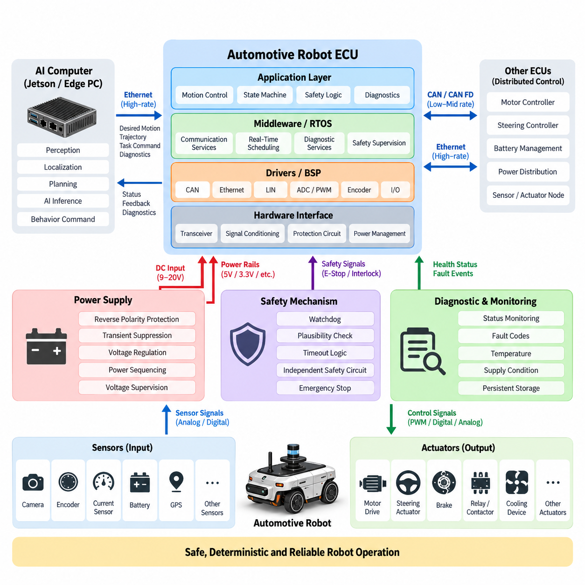
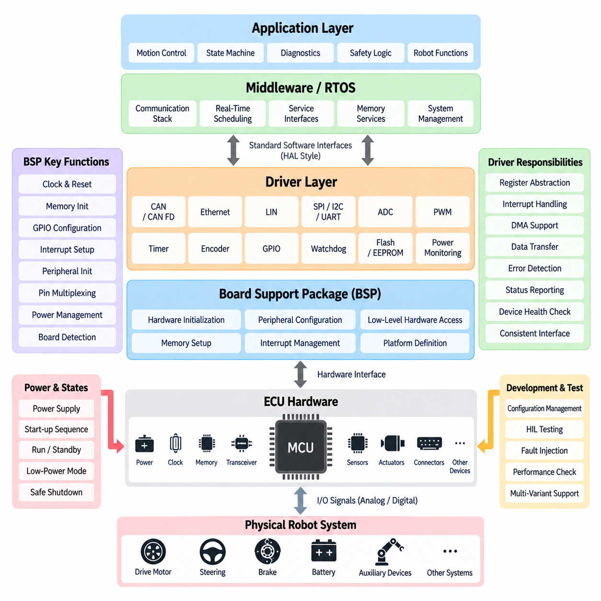
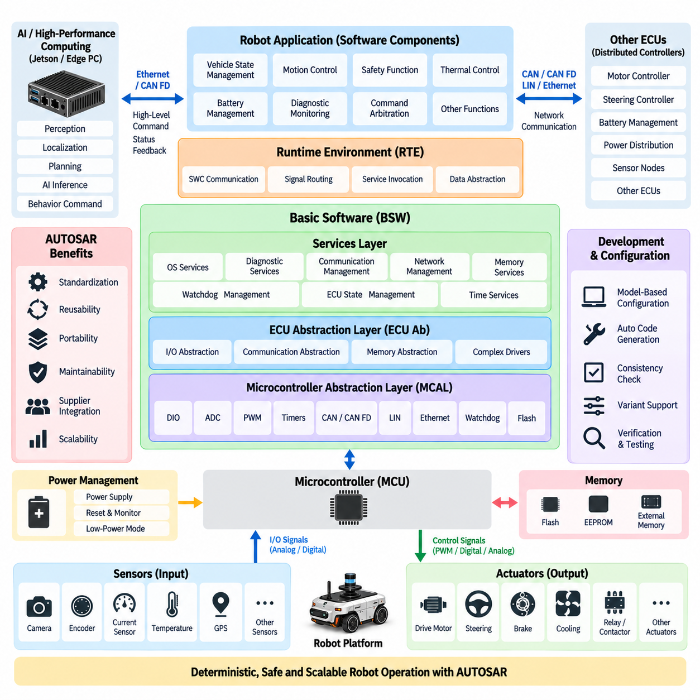
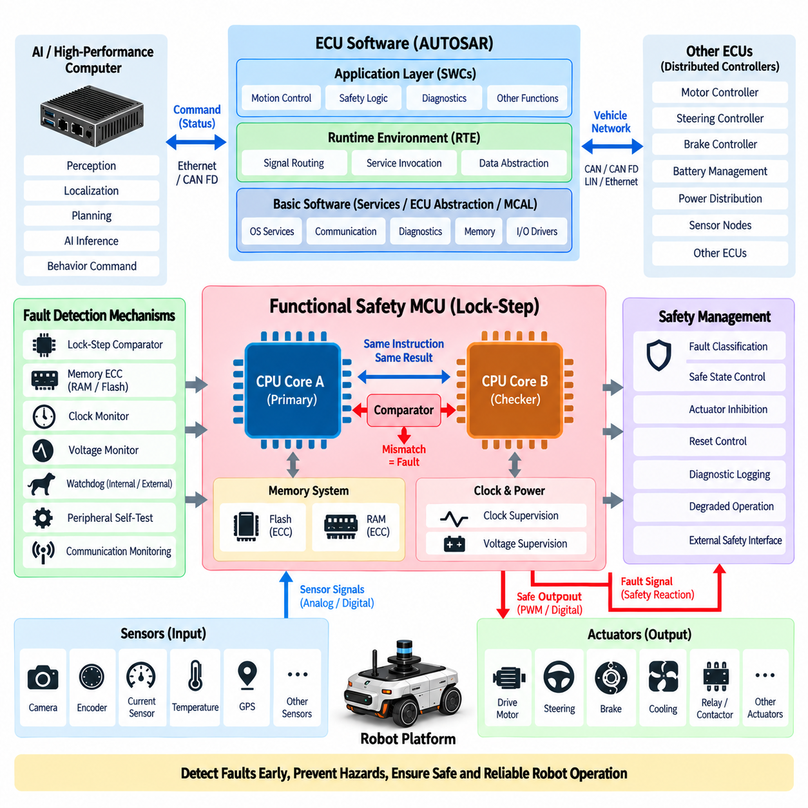
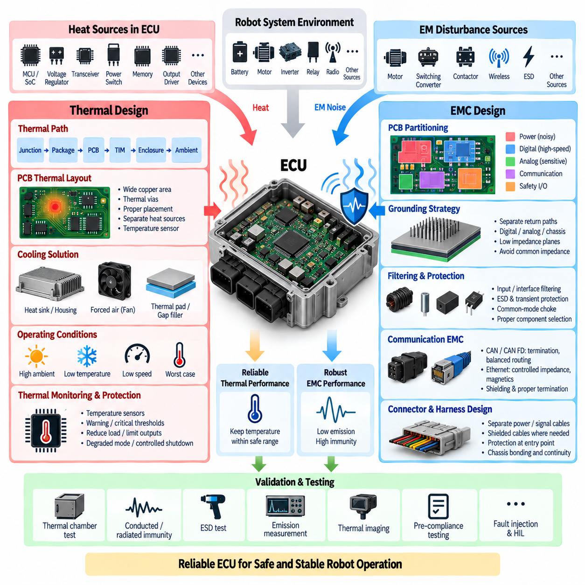

**Volume 16 Compute and AI Architecture**


# Chapter 02. ECU Design

##  

## 02.01. Automotive Robot ECU Architecture

{width="7.268055555555556in" height="7.268055555555556in"}

An automotive robot ECU is the deterministic control core that connects high-level computing with the physical mechanisms of a mobile robot. While an AI computer performs perception, localization, planning, and learned inference, the ECU manages functions that require predictable timing, direct hardware access, and controlled failure behavior. Typical responsibilities include steering, propulsion, braking, power-state supervision, actuator coordination, sensor acquisition, diagnostics, and communication with other embedded controllers.

The architecture is usually divided into functional layers rather than implemented as one monolithic controller. Hardware interfaces occupy the lowest layer and connect the processor to CAN or CAN FD transceivers, Ethernet PHYs, LIN devices, digital and analog I/O, PWM outputs, encoder interfaces, current sensors, and safety circuits. Above them, device drivers and the board support package abstract processor-specific resources so application functions can operate without continuously manipulating registers or peripheral hardware directly.

At the center of the ECU is an automotive- or industrial-grade microcontroller selected for deterministic execution, rich communication peripherals, fault monitoring, and long-term availability. Cortex-M and higher-performance automotive MCU families can execute control loops while supervising timers, ADC channels, capture units, watchdogs, and communication interfaces. More demanding robot ECUs may combine a real-time MCU with an application processor or companion accelerator, separating hard real-time control from computationally intensive functions.

This separation is especially important in Physical AI robots. A Jetson platform or edge PC may determine desired velocity, steering angle, trajectory, manipulation command, or behavioral objective, but these commands should not directly drive power electronics. The ECU acts as an execution boundary. It validates command ranges, checks system state, applies rate and acceleration constraints, verifies interlocks, and converts accepted commands into deterministic actuator requests while continuously observing feedback from the physical system.

A representative signal path therefore begins with the autonomy computer and passes through an Ethernet, CAN FD, or other controlled interface into the ECU. The ECU interprets the requested action and combines it with encoder feedback, steering position, motor status, battery information, emergency-stop state, and other local signals. Real-time control logic then generates outputs for motor drives, steering actuators, brakes, relays, contactors, cooling devices, or auxiliary equipment while reporting actual execution status upstream.

Communication architecture strongly influences ECU scalability. CAN remains valuable for robust distributed control, CAN FD increases payload and bandwidth, and Automotive Ethernet provides a path for high-rate diagnostics, software services, gateways, and integration with advanced compute platforms. A robot may consequently use Ethernet between the AI computer and central ECU while using CAN or CAN FD between the ECU, motor controllers, steering controller, BMS, power-distribution modules, and distributed sensor or actuator nodes.

Time behavior must be explicitly engineered because robot control is a cyber-physical process. Tasks such as motor supervision, steering control, wheel-speed acquisition, brake monitoring, and safety-state evaluation operate at different periods and priorities. A real-time scheduler or RTOS assigns execution windows so critical control functions are protected from lower-priority diagnostics and communication workloads. Worst-case execution time, interrupt latency, bus delay, and task jitter must therefore be considered as architectural parameters.

Power architecture is equally important because the ECU must remain predictable during battery transients and abnormal operating states. The input stage normally includes reverse-polarity protection, transient suppression, filtering, regulated voltage rails, sequencing, and voltage supervision. Separate supply domains may be used for the MCU, communication interfaces, analog measurement circuitry, external sensors, and actuator interfaces. Brownout detection and controlled reset behavior prevent partially powered electronics from generating undefined commands during startup or shutdown.

The ECU should also manage the robot as a state machine rather than merely execute continuous control algorithms. States may include power-off, initialization, standby, ready, autonomous operation, manual operation, degraded operation, emergency stop, fault handling, and shutdown. Transition conditions are evaluated using communication health, actuator readiness, safety inputs, battery condition, sensor validity, and command authorization. This creates a controlled operational envelope around both conventional autonomy and AI-generated behavior.

Diagnostics form another architectural layer. Each important subsystem should expose operating status, fault codes, communication health, supply conditions, temperature, reset cause, and plausibility information. The ECU can aggregate these observations into diagnostic events and communicate them to service software or the robot management system. Persistent fault storage is useful for distinguishing transient anomalies from recurring hardware problems and supports field maintenance, root-cause analysis, reliability improvement, and fleet-level monitoring.

Safety mechanisms must remain sufficiently independent from complex AI software. Watchdogs can detect stalled execution, communication supervision can detect missing messages, plausibility checks can reject impossible sensor values, and timeout logic can invalidate obsolete commands. Critical designs may additionally use lock-step processors, external watchdogs, redundant sensing, independent safety controllers, or separate emergency-stop circuits. The objective is to ensure that failure of high-level computing does not automatically become uncontrolled physical motion.

A robust ECU also distinguishes between normal control communication and safety-related authority. For example, an autonomy computer may request forward motion, but the ECU can deny that request if an emergency stop is active, the steering system is not initialized, a drive controller reports a critical fault, or communication freshness exceeds its allowed timeout. This command arbitration establishes a hierarchy in which physical safety conditions and verified machine state have priority over behavioral commands generated elsewhere.

Software architecture benefits from a similarly disciplined separation. The BSP and driver layer manages hardware dependencies, middleware handles communication and diagnostic services, real-time services provide scheduling and state supervision, and application components implement vehicle or robot functions. AUTOSAR concepts can be adopted where automotive compatibility and standardized software abstraction are valuable, while lighter RTOS-based architectures may be more appropriate for compact AMRs and specialized robotic platforms.

Thermal and EMC engineering must be treated as part of ECU architecture rather than as enclosure-level afterthoughts. Processor load, power conversion, communication transceivers, and output drivers create localized heat, while motors, inverters, relays, switching converters, and long harnesses create electromagnetic disturbances. PCB partitioning, grounding, filtering, shielding, connector selection, thermal conduction, component derating, and enclosure design collectively determine whether control electronics remain reliable in real robotic operating environments.

The ECU becomes more valuable as the robot architecture expands from one machine into a product family. Stable interfaces allow the same control concept to support indoor AMRs, outdoor autonomous robots, inspection platforms, mobile manipulators, and other Physical AI systems while higher-level compute hardware evolves independently. The uploaded architecture places ECU design between MCU architecture and Jetson, edge-PC, GPU-server, on-premise AI, fleet AI, and Physical AI computing topics, reflecting this bridging role.

Ultimately, automotive robot ECU architecture should be understood as the trusted real-time execution layer of the robotic system. AI computing determines increasingly sophisticated interpretations and intentions, but the ECU converts those intentions into bounded, observable, diagnosable, and physically executable actions. By combining deterministic control, hardware abstraction, communication, power supervision, diagnostics, state management, and safety mechanisms, the ECU provides the stable engineering foundation on which scalable autonomous and Physical AI robots can operate.

자동차 로봇 전자제어장치(Automotive Robot Electronic Control Unit, ECU)는 상위 수준 컴퓨팅(High-Level Computing)과 이동 로봇(Mobile Robot)의 물리적 구동 메커니즘(Physical Mechanism)을 연결하는 결정론적 제어 핵심부(Deterministic Control Core)이다. 인공지능 컴퓨터(AI Computer)가 인지(Perception), 위치추정(Localization), 계획(Planning), 학습 기반 추론(Learned Inference)을 수행하는 동안, ECU는 예측 가능한 타이밍(Predictable Timing), 직접적인 하드웨어 접근(Direct Hardware Access), 제어된 고장 동작(Controlled Failure Behavior)이 필요한 기능을 담당한다. 대표적으로 조향(Steering), 추진(Propulsion), 제동(Braking), 전원 상태 감시(Power-State Supervision), 액추에이터 협조 제어(Actuator Coordination), 센서 데이터 획득(Sensor Acquisition), 진단(Diagnostics), 다른 임베디드 제어기(Embedded Controller)와의 통신을 수행한다.

ECU 아키텍처(ECU Architecture)는 일반적으로 하나의 단일 제어기(Monolithic Controller)로 구현하기보다 기능 계층(Functional Layer)으로 구분한다. 가장 하위 계층에는 하드웨어 인터페이스(Hardware Interface)가 위치하며, 프로세서를 CAN 또는 CAN FD 트랜시버(Transceiver), 이더넷 물리 계층(Ethernet PHY), LIN 장치, 디지털 및 아날로그 입출력(Digital and Analog I/O), PWM 출력, 엔코더 인터페이스(Encoder Interface), 전류 센서(Current Sensor), 안전 회로(Safety Circuit)에 연결한다. 그 상위의 디바이스 드라이버(Device Driver)와 보드 지원 패키지(Board Support Package, BSP)는 프로세서별 자원을 추상화하여 응용 기능이 레지스터(Register)나 주변장치 하드웨어(Peripheral Hardware)를 지속적으로 직접 제어하지 않고도 동작하도록 한다.

ECU의 중심에는 결정론적 실행(Deterministic Execution), 다양한 통신 주변장치(Communication Peripheral), 고장 감시(Fault Monitoring), 장기 공급성(Long-Term Availability)을 고려하여 선정된 자동차용 또는 산업용 마이크로컨트롤러(Automotive- or Industrial-Grade Microcontroller)가 위치한다. Cortex-M 및 고성능 자동차용 MCU 계열은 타이머(Timer), ADC 채널, 캡처 유닛(Capture Unit), 워치독(Watchdog), 통신 인터페이스를 감시하면서 제어 루프(Control Loop)를 실행할 수 있다. 더 높은 성능이 필요한 로봇 ECU에서는 실시간 MCU(Real-Time MCU)와 애플리케이션 프로세서(Application Processor) 또는 보조 가속기(Companion Accelerator)를 결합하여 하드 실시간 제어(Hard Real-Time Control)와 연산 집약적 기능(Compute-Intensive Function)을 분리할 수 있다.

이러한 분리는 피지컬 AI 로봇(Physical AI Robot)에서 특히 중요하다. 젯슨 플랫폼(Jetson Platform)이나 엣지 PC(Edge PC)는 목표 속도(Desired Velocity), 조향각(Steering Angle), 궤적(Trajectory), 조작 명령(Manipulation Command), 행동 목표(Behavioral Objective)를 결정할 수 있지만, 이러한 명령이 전력전자장치(Power Electronics)를 직접 구동해서는 안 된다. ECU는 실행 경계(Execution Boundary) 역할을 수행한다. 명령 범위를 검증하고 시스템 상태를 확인하며 변화율 및 가속도 제한(Rate and Acceleration Constraint)과 인터록(Interlock)을 적용한 후, 승인된 명령을 결정론적 액추에이터 요청(Deterministic Actuator Request)으로 변환하면서 물리 시스템의 피드백을 지속적으로 감시한다.

대표적인 신호 경로(Signal Path)는 자율주행 컴퓨터(Autonomy Computer)에서 시작하여 이더넷(Ethernet), CAN FD 또는 기타 제어된 인터페이스(Controlled Interface)를 통해 ECU로 전달된다. ECU는 요청된 동작을 해석하고 엔코더 피드백(Encoder Feedback), 조향 위치(Steering Position), 모터 상태(Motor Status), 배터리 정보(Battery Information), 비상정지 상태(Emergency-Stop State), 기타 로컬 신호(Local Signal)를 함께 처리한다. 이후 실시간 제어 로직(Real-Time Control Logic)은 모터 드라이브(Motor Drive), 조향 액추에이터(Steering Actuator), 브레이크(Brake), 릴레이(Relay), 컨택터(Contactor), 냉각 장치(Cooling Device), 보조 장비(Auxiliary Equipment)에 대한 출력을 생성하고 실제 실행 상태를 상위 시스템으로 보고한다.

통신 아키텍처(Communication Architecture)는 ECU의 확장성(Scalability)에 큰 영향을 미친다. CAN은 견고한 분산 제어(Distributed Control)에 유용하며, CAN FD는 페이로드(Payload)와 대역폭(Bandwidth)을 증가시키고, 자동차 이더넷(Automotive Ethernet)은 고속 진단(High-Rate Diagnostics), 소프트웨어 서비스(Software Service), 게이트웨이(Gateway), 고성능 컴퓨팅 플랫폼과의 통합을 지원한다. 따라서 로봇은 AI 컴퓨터와 중앙 ECU 사이에 이더넷을 사용하면서 ECU와 모터 제어기(Motor Controller), 조향 제어기(Steering Controller), 배터리 관리 시스템(Battery Management System, BMS), 전력 분배 모듈(Power Distribution Module), 분산 센서 또는 액추에이터 노드 사이에는 CAN 또는 CAN FD를 사용할 수 있다.

로봇 제어는 사이버 물리 프로세스(Cyber-Physical Process)이므로 시간 동작(Time Behavior)을 명시적으로 설계해야 한다. 모터 감시(Motor Supervision), 조향 제어(Steering Control), 휠 속도 획득(Wheel-Speed Acquisition), 브레이크 감시(Brake Monitoring), 안전 상태 평가(Safety-State Evaluation)와 같은 작업은 서로 다른 주기와 우선순위로 동작한다. 실시간 스케줄러(Real-Time Scheduler) 또는 실시간 운영체제(Real-Time Operating System, RTOS)는 실행 시간 구간을 할당하여 중요 제어 기능을 낮은 우선순위의 진단 및 통신 작업으로부터 보호한다. 따라서 최악 실행 시간(Worst-Case Execution Time), 인터럽트 지연(Interrupt Latency), 버스 지연(Bus Delay), 태스크 지터(Task Jitter)를 아키텍처 파라미터(Architectural Parameter)로 고려해야 한다.

전원 아키텍처(Power Architecture) 역시 중요하다. ECU는 배터리 과도현상(Battery Transient)과 비정상 운전 상태에서도 예측 가능한 동작을 유지해야 하기 때문이다. 입력단에는 일반적으로 역극성 보호(Reverse-Polarity Protection), 과도전압 억제(Transient Suppression), 필터링(Filtering), 안정화 전압 레일(Regulated Voltage Rail), 전원 시퀀싱(Power Sequencing), 전압 감시(Voltage Supervision)가 포함된다. MCU, 통신 인터페이스, 아날로그 측정 회로(Analog Measurement Circuitry), 외부 센서, 액추에이터 인터페이스에는 별도의 전원 도메인(Supply Domain)을 사용할 수 있다. 브라운아웃 검출(Brownout Detection)과 제어된 리셋(Controlled Reset)은 기동 및 종료 과정에서 부분적으로 전원이 공급된 전자장치가 정의되지 않은 명령을 발생시키는 것을 방지한다.

ECU는 단순히 연속적인 제어 알고리즘(Control Algorithm)을 실행하는 것이 아니라 로봇 전체를 상태 기계(State Machine)로 관리해야 한다. 상태에는 전원 차단(Power-Off), 초기화(Initialization), 대기(Standby), 준비(Ready), 자율 운전(Autonomous Operation), 수동 운전(Manual Operation), 성능 저하 운전(Degraded Operation), 비상정지(Emergency Stop), 고장 처리(Fault Handling), 종료(Shutdown) 등이 포함될 수 있다. 상태 전이 조건(State Transition Condition)은 통신 건전성(Communication Health), 액추에이터 준비 상태(Actuator Readiness), 안전 입력(Safety Input), 배터리 상태(Battery Condition), 센서 유효성(Sensor Validity), 명령 권한(Command Authorization)을 기반으로 평가된다. 이를 통해 기존 자율주행 기능과 AI 생성 행동(AI-Generated Behavior) 모두에 제어된 운용 범위(Controlled Operational Envelope)를 형성할 수 있다.

진단(Diagnostics)은 또 하나의 중요한 아키텍처 계층(Architectural Layer)을 구성한다. 주요 서브시스템(Subsystem)은 동작 상태(Operating Status), 고장 코드(Fault Code), 통신 건전성, 전원 상태(Supply Condition), 온도(Temperature), 리셋 원인(Reset Cause), 타당성 정보(Plausibility Information)를 제공해야 한다. ECU는 이러한 관측 정보를 진단 이벤트(Diagnostic Event)로 통합하여 서비스 소프트웨어(Service Software) 또는 로봇 관리 시스템(Robot Management System)으로 전달할 수 있다. 영구 고장 저장(Persistent Fault Storage)은 일시적인 이상과 반복되는 하드웨어 문제를 구분하는 데 유용하며, 현장 유지보수(Field Maintenance), 근본 원인 분석(Root-Cause Analysis), 신뢰성 개선(Reliability Improvement), 플릿 수준 감시(Fleet-Level Monitoring)를 지원한다.

안전 메커니즘(Safety Mechanism)은 복잡한 AI 소프트웨어(AI Software)로부터 충분히 독립적으로 유지되어야 한다. 워치독(Watchdog)은 실행 정지를 감지하고, 통신 감시(Communication Supervision)는 메시지 손실을 검출하며, 타당성 검사(Plausibility Check)는 불가능한 센서 값을 거부하고, 타임아웃 로직(Timeout Logic)은 오래되어 유효하지 않은 명령을 무효화할 수 있다. 중요 시스템에서는 록스텝 프로세서(Lock-Step Processor), 외부 워치독(External Watchdog), 중복 센싱(Redundant Sensing), 독립 안전 제어기(Independent Safety Controller), 별도의 비상정지 회로(Emergency-Stop Circuit)를 추가로 사용할 수 있다. 핵심 목적은 상위 컴퓨팅(High-Level Computing)의 고장이 곧바로 제어되지 않은 물리적 움직임으로 이어지지 않도록 하는 것이다.

견고한 ECU는 일반 제어 통신(Normal Control Communication)과 안전 관련 권한(Safety-Related Authority)도 명확히 구분한다. 예를 들어 자율주행 컴퓨터가 전진 명령을 요청하더라도 비상정지가 활성화되어 있거나, 조향 시스템이 초기화되지 않았거나, 구동 제어기(Drive Controller)가 심각한 고장을 보고하거나, 통신 최신성(Communication Freshness)이 허용된 타임아웃을 초과한 경우 ECU는 해당 요청을 거부할 수 있다. 이러한 명령 중재(Command Arbitration)는 물리적 안전 조건과 검증된 기계 상태가 다른 시스템에서 생성된 행동 명령보다 높은 우선순위를 갖는 권한 계층(Authority Hierarchy)을 형성한다.

소프트웨어 아키텍처(Software Architecture) 역시 체계적인 계층 분리를 통해 이점을 얻는다. 보드 지원 패키지(BSP)와 드라이버 계층(Driver Layer)은 하드웨어 의존성을 관리하고, 미들웨어(Middleware)는 통신 및 진단 서비스를 담당하며, 실시간 서비스(Real-Time Service)는 스케줄링과 상태 감시를 제공하고, 애플리케이션 컴포넌트(Application Component)는 차량 또는 로봇 기능을 구현한다. 자동차 호환성과 표준화된 소프트웨어 추상화가 중요한 경우 오토사(AUTOSAR) 개념을 적용할 수 있으며, 소형 자율이동로봇(Autonomous Mobile Robot, AMR)이나 특수 로봇 플랫폼에서는 보다 경량화된 RTOS 기반 아키텍처(RTOS-Based Architecture)가 적합할 수 있다.

열 및 전자기 적합성 엔지니어링(Thermal and Electromagnetic Compatibility Engineering, EMC)은 인클로저 수준(Enclosure Level)의 사후 고려사항이 아니라 ECU 아키텍처 자체의 일부로 다루어야 한다. 프로세서 부하(Processor Load), 전력 변환(Power Conversion), 통신 트랜시버, 출력 드라이버(Output Driver)는 국부적인 열을 발생시키며, 모터, 인버터(Inverter), 릴레이, 스위칭 컨버터(Switching Converter), 긴 와이어 하니스(Wire Harness)는 전자기 간섭(Electromagnetic Interference)을 발생시킨다. PCB 영역 분할(PCB Partitioning), 접지(Grounding), 필터링, 차폐(Shielding), 커넥터 선정(Connector Selection), 열전도(Thermal Conduction), 부품 디레이팅(Component Derating), 인클로저 설계가 결합되어 실제 로봇 운용 환경에서 제어 전자장치의 신뢰성을 결정한다.

ECU는 단일 로봇에서 제품군(Product Family)으로 아키텍처가 확장될수록 그 가치가 더욱 커진다. 안정적인 인터페이스(Stable Interface)를 구축하면 상위 컴퓨팅 하드웨어가 독립적으로 발전하더라도 동일한 제어 개념을 실내 AMR(Indoor AMR), 실외 자율주행 로봇(Outdoor Autonomous Robot), 점검 플랫폼(Inspection Platform), 모바일 매니퓰레이터(Mobile Manipulator), 기타 피지컬 AI 시스템에 적용할 수 있다. 전체 컴퓨팅 및 AI 아키텍처(Compute and AI Architecture)에서 ECU 설계는 MCU 아키텍처(MCU Architecture)와 젯슨 플랫폼, 엣지 PC, GPU 서버(GPU Server), 온프레미스 AI(On-Premise AI), 플릿 AI(Fleet AI), 피지컬 AI 컴퓨팅(Physical AI Computing)을 연결하는 중간 계층의 역할을 수행한다.

궁극적으로 자동차 로봇 ECU 아키텍처(Automotive Robot ECU Architecture)는 로봇 시스템의 신뢰 가능한 실시간 실행 계층(Trusted Real-Time Execution Layer)으로 이해해야 한다. AI 컴퓨팅은 점점 더 정교한 환경 해석과 행동 의도(Behavioral Intention)를 결정하지만, ECU는 이러한 의도를 제한 가능하고(Bounded), 관측 가능하며(Observable), 진단 가능하고(Diagnosable), 물리적으로 실행 가능한(Physically Executable) 동작으로 변환한다. 결정론적 제어, 하드웨어 추상화(Hardware Abstraction), 통신, 전원 감시, 진단, 상태 관리(State Management), 안전 메커니즘을 통합함으로써 ECU는 확장 가능한 자율 로봇(Autonomous Robot)과 피지컬 AI 로봇이 안정적으로 동작하기 위한 핵심 엔지니어링 기반(Engineering Foundation)을 제공한다.

##  

## 02.02. BSP and Driver Layer

{width="7.268055555555556in" height="7.268055555555556in"}

A Board Support Package, or BSP, forms the software boundary between an ECU's physical hardware and the higher-level embedded software that controls the robot. It contains the processor-specific initialization, peripheral configuration, low-level hardware access, and platform definitions required to make a particular ECU board operational. By isolating these hardware dependencies, the BSP allows control applications, middleware, diagnostics, and safety functions to operate through stable software interfaces rather than directly manipulating microcontroller registers.

During ECU startup, the BSP is among the first software components executed after reset. It establishes the processor clock, configures memory, initializes interrupt controllers, prepares timers, enables watchdog resources, configures GPIO pins, and activates required communication peripherals. It may also initialize external memories, power-management devices, Ethernet PHYs, CAN transceivers, and board-specific monitoring circuits. This controlled initialization sequence creates a known hardware state before application software begins normal robot operation.

The driver layer sits directly above or partially within the BSP and provides functional access to individual hardware peripherals. Drivers translate software requests into register operations, interrupt handling, DMA transfers, and electrical interface behavior. Typical ECU drivers include CAN and CAN FD, Ethernet, LIN, SPI, I2C, UART, ADC, PWM, timer, encoder, GPIO, watchdog, flash memory, and power-monitoring drivers. Each driver hides implementation details while exposing a predictable interface to upper software layers.

This abstraction is essential when robot hardware evolves across product generations. A motion-control application should not need to know which timer register generates a PWM signal or which CAN controller instance transmits a motor command. Instead, it requests a defined service from the driver interface. If the ECU later changes to another MCU family or PCB revision, engineers can modify the BSP and hardware drivers while preserving much of the middleware and application software above them.

BSP design normally begins with a detailed mapping between the ECU schematic and MCU resources. Every connector signal must ultimately correspond to a physical pin, peripheral channel, communication controller, ADC input, timer channel, interrupt source, or external device. Pin multiplexing must therefore be carefully managed because one MCU pin may support several alternate functions. Incorrect configuration can produce failures that appear to be software problems even though the underlying cause is a mismatched hardware-resource definition.

Interrupt management is another fundamental responsibility. Robot ECUs receive asynchronous events from communication controllers, encoders, timers, fault inputs, and external devices. The BSP configures interrupt sources and priorities, while drivers implement interrupt service routines that capture events with minimum latency. Time-critical interrupts must be protected from excessive processing by lower-priority services, and lengthy operations should normally be deferred to scheduled tasks rather than executed entirely inside interrupt context.

Direct Memory Access, or DMA, can significantly reduce MCU workload when peripherals exchange continuous or high-frequency data. ADC sampling, UART communication, SPI transfers, and some Ethernet operations can move data between peripherals and memory without requiring the CPU to process every byte or sample individually. Drivers coordinate DMA descriptors, buffers, completion events, and error handling. Proper DMA design improves deterministic behavior but requires careful management of memory ownership, synchronization, and cache coherency.

Communication drivers are particularly important in an automotive robot ECU because distributed controllers must exchange commands and status reliably. A CAN driver configures bit timing, message buffers, acceptance filters, interrupts, and error states, while higher software interprets the actual application messages. CAN FD adds larger payloads and higher data-phase rates. Ethernet drivers manage MAC and PHY operation, frame transfer, link status, and buffers, providing the foundation for higher-level protocols, diagnostics, gateways, and communication with AI computers.

Sensor and actuator interfaces require equally disciplined driver design. ADC drivers acquire voltages from current sensors, temperature sensors, analog position devices, and power-monitoring circuits. PWM and timer drivers generate precisely timed outputs for actuators or auxiliary devices. Encoder drivers capture wheel, steering, or motor position information, while GPIO drivers handle discrete signals such as enable lines, contactor feedback, interlocks, and fault inputs. Hardware access is thereby converted into consistent software-visible signals and commands.

Device drivers should not merely transfer data; they must also represent hardware health. Communication drivers can report bus-off conditions, frame errors, link failures, and timeout events. ADC services can detect saturation or implausible ranges, while memory drivers can report programming or integrity failures. Peripheral initialization failures should also be exposed to diagnostic software. This approach allows the ECU to distinguish a valid measurement from data produced by a failed, disconnected, or incorrectly initialized hardware interface.

Watchdog support demonstrates the close relationship between the BSP, drivers, and ECU safety architecture. The BSP configures internal or external watchdog hardware during initialization, but normal software must service it only when required execution conditions are satisfied. A simple periodic watchdog refresh may conceal stalled application functions. A stronger architecture allows supervisory software to verify critical task execution and system health before authorizing the low-level watchdog driver to refresh the hardware timer.

Power-state handling also depends heavily on BSP services. An ECU may pass through reset, initialization, standby, operational, degraded, shutdown, and low-power states. Drivers must behave correctly during these transitions, particularly when peripherals or external devices lose power independently. Communication interfaces may need to be disabled before supply removal, output pins may require safe default states, and wake-up sources must be configured before entering sleep. BSP behavior therefore contributes directly to predictable ECU startup and shutdown.

Memory services form another important part of the low-level software architecture. Internal flash, external EEPROM, QSPI flash, or other nonvolatile memory may store calibration parameters, diagnostic records, boot information, configuration data, and software images. Drivers must manage erase and write constraints, alignment, access timing, and error conditions. Critical data may require CRC protection, redundant storage, version information, or transactional updates so interrupted writes do not leave the ECU configuration in an unusable state.

The BSP also establishes the time base used by higher-level software. Hardware timers provide periodic scheduler ticks, high-resolution timestamps, input capture, output compare, and timeout measurement. Reliable timing is essential for real-time control, communication supervision, sensor acquisition, actuator control, and diagnostics. When an ECU participates in a larger synchronized robot architecture, low-level timer services may also support timestamp alignment with CAN, Ethernet, PTP, or other system-level synchronization mechanisms.

Configuration management becomes increasingly important as a BSP supports multiple ECU variants. Different robot models may share one software architecture while using different pin assignments, sensor populations, communication channels, or actuator interfaces. Hardware-specific configuration should therefore be separated from reusable driver logic wherever practical. Board identifiers, compile-time configuration, generated configuration files, or runtime hardware detection can allow one software platform to support several ECU variants without duplicating the entire codebase.

Testing of BSP and driver software must begin before full robot integration. Engineers can verify GPIO states, ADC accuracy, PWM timing, communication throughput, interrupt latency, watchdog behavior, memory access, and fault handling using bench equipment and hardware-in-the-loop environments. Boundary conditions such as communication overload, invalid frames, supply disturbances, sensor disconnection, and repeated resets should also be exercised. These tests establish confidence in the hardware abstraction before complex autonomy software depends on it.

In a layered ECU software architecture, the BSP and drivers should remain focused on hardware control rather than robot behavior. Motion decisions, state machines, diagnostic policies, safety strategies, and autonomy logic belong in higher layers. Maintaining this boundary prevents hardware-specific code from spreading throughout the application and makes software easier to test, port, maintain, and certify. The uploaded structure places this topic directly between automotive robot ECU architecture and AUTOSAR structure, reflecting this foundational role.

For Physical AI systems, this separation becomes even more important because high-level compute platforms may change much faster than embedded control hardware. Jetson modules, edge PCs, AI accelerators, perception models, and VLA systems can evolve while the robot still requires stable real-time access to motors, steering, brakes, power devices, and safety signals. A well-engineered BSP and driver layer therefore provides the durable hardware foundation that allows advanced AI computing to interact with physical machinery through controlled, deterministic, and maintainable interfaces.

보드 지원 패키지(Board Support Package, BSP)는 ECU의 물리적 하드웨어(Physical Hardware)와 로봇을 제어하는 상위 수준 임베디드 소프트웨어(Higher-Level Embedded Software) 사이의 소프트웨어 경계(Software Boundary)를 형성한다. BSP에는 특정 ECU 보드를 동작시키는 데 필요한 프로세서별 초기화(Processor-Specific Initialization), 주변장치 설정(Peripheral Configuration), 저수준 하드웨어 접근(Low-Level Hardware Access), 플랫폼 정의(Platform Definition)가 포함된다. 이러한 하드웨어 의존성을 분리함으로써 제어 애플리케이션(Control Application), 미들웨어(Middleware), 진단(Diagnostics), 안전 기능(Safety Function)은 마이크로컨트롤러 레지스터(Microcontroller Register)를 직접 조작하지 않고 안정적인 소프트웨어 인터페이스(Software Interface)를 통해 동작할 수 있다.

ECU가 기동될 때 BSP는 리셋(Reset) 이후 가장 먼저 실행되는 소프트웨어 구성요소 중 하나이다. BSP는 프로세서 클록(Processor Clock)을 설정하고, 메모리(Memory)를 구성하며, 인터럽트 제어기(Interrupt Controller)를 초기화하고, 타이머(Timer)를 준비하며, 워치독(Watchdog) 자원을 활성화한다. 또한 GPIO 핀과 필요한 통신 주변장치(Communication Peripheral)를 설정한다. 외부 메모리(External Memory), 전원 관리 장치(Power-Management Device), 이더넷 물리 계층(Ethernet PHY), CAN 트랜시버(CAN Transceiver), 보드별 감시 회로(Board-Specific Monitoring Circuit)도 초기화할 수 있다. 이러한 제어된 초기화 절차는 애플리케이션 소프트웨어가 정상적인 로봇 동작을 시작하기 전에 알려진 하드웨어 상태(Known Hardware State)를 형성한다.

드라이버 계층(Driver Layer)은 BSP의 바로 상위에 위치하거나 일부가 BSP 내부에 포함되며, 개별 하드웨어 주변장치(Hardware Peripheral)에 기능적으로 접근할 수 있도록 한다. 드라이버(Driver)는 소프트웨어 요청을 레지스터 연산(Register Operation), 인터럽트 처리(Interrupt Handling), 직접 메모리 접근 전송(DMA Transfer), 전기적 인터페이스 동작(Electrical Interface Behavior)으로 변환한다. 대표적인 ECU 드라이버에는 CAN, CAN FD, 이더넷(Ethernet), LIN, SPI, I2C, UART, ADC, PWM, 타이머, 엔코더(Encoder), GPIO, 워치독, 플래시 메모리(Flash Memory), 전원 감시(Power Monitoring) 드라이버가 있다. 각각의 드라이버는 구현 세부사항을 숨기면서 상위 소프트웨어 계층에 예측 가능한 인터페이스를 제공한다.

이러한 추상화(Abstraction)는 로봇 하드웨어가 제품 세대(Product Generation)에 따라 발전할 때 특히 중요하다. 모션 제어 애플리케이션(Motion-Control Application)은 어떤 타이머 레지스터가 PWM 신호를 생성하는지 또는 어떤 CAN 제어기 인스턴스(Controller Instance)가 모터 명령을 전송하는지 알 필요가 없어야 한다. 대신 정의된 서비스를 드라이버 인터페이스(Driver Interface)에 요청한다. 이후 ECU가 다른 MCU 계열이나 새로운 PCB 개정판(PCB Revision)으로 변경되더라도 엔지니어는 BSP와 하드웨어 드라이버를 수정하면서 상위 미들웨어와 애플리케이션 소프트웨어의 상당 부분을 그대로 유지할 수 있다.

BSP 설계는 일반적으로 ECU 회로도(ECU Schematic)와 MCU 자원 사이의 상세한 매핑(Mapping)에서 시작한다. 모든 커넥터 신호(Connector Signal)는 궁극적으로 물리적 핀(Physical Pin), 주변장치 채널(Peripheral Channel), 통신 제어기(Communication Controller), ADC 입력, 타이머 채널, 인터럽트 소스(Interrupt Source), 외부 장치(External Device) 중 하나와 연결되어야 한다. 하나의 MCU 핀이 여러 대체 기능(Alternate Function)을 지원할 수 있으므로 핀 멀티플렉싱(Pin Multiplexing)을 세심하게 관리해야 한다. 잘못된 설정은 실제 원인이 하드웨어 자원 정의의 불일치임에도 소프트웨어 문제처럼 보이는 고장을 발생시킬 수 있다.

인터럽트 관리(Interrupt Management)는 또 하나의 핵심적인 역할이다. 로봇 ECU는 통신 제어기, 엔코더, 타이머, 고장 입력(Fault Input), 외부 장치로부터 비동기 이벤트(Asynchronous Event)를 수신한다. BSP는 인터럽트 소스와 우선순위를 설정하고, 드라이버는 최소한의 지연시간(Latency)으로 이벤트를 포착하는 인터럽트 서비스 루틴(Interrupt Service Routine, ISR)을 구현한다. 시간 임계 인터럽트(Time-Critical Interrupt)는 낮은 우선순위 서비스의 과도한 처리로부터 보호되어야 하며, 긴 연산은 일반적으로 인터럽트 문맥(Interrupt Context)에서 모두 수행하기보다 예약된 태스크(Scheduled Task)로 넘겨 처리해야 한다.

직접 메모리 접근(Direct Memory Access, DMA)은 주변장치가 연속적이거나 높은 주파수의 데이터를 교환할 때 MCU의 처리 부하를 크게 줄일 수 있다. ADC 샘플링(ADC Sampling), UART 통신, SPI 전송, 일부 이더넷 동작에서는 CPU가 모든 바이트나 샘플을 개별적으로 처리하지 않고 주변장치와 메모리 사이에서 데이터를 이동시킬 수 있다. 드라이버는 DMA 디스크립터(DMA Descriptor), 버퍼(Buffer), 완료 이벤트(Completion Event), 오류 처리(Error Handling)를 조정한다. 적절한 DMA 설계는 결정론적 동작(Deterministic Behavior)을 향상시키지만 메모리 소유권(Memory Ownership), 동기화(Synchronization), 캐시 일관성(Cache Coherency)을 세심하게 관리해야 한다.

자동차 로봇 ECU(Automotive Robot ECU)에서는 분산 제어기(Distributed Controller)가 명령과 상태를 신뢰성 있게 교환해야 하므로 통신 드라이버(Communication Driver)가 특히 중요하다. CAN 드라이버는 비트 타이밍(Bit Timing), 메시지 버퍼(Message Buffer), 수신 필터(Acceptance Filter), 인터럽트, 오류 상태(Error State)를 설정하며, 상위 소프트웨어는 실제 애플리케이션 메시지를 해석한다. CAN FD는 더 큰 페이로드(Payload)와 높은 데이터 구간 전송률(Data-Phase Rate)을 지원한다. 이더넷 드라이버(Ethernet Driver)는 MAC 및 PHY 동작, 프레임 전송(Frame Transfer), 링크 상태(Link Status), 버퍼를 관리하여 상위 프로토콜, 진단, 게이트웨이(Gateway), AI 컴퓨터와의 통신을 위한 기반을 제공한다.

센서 및 액추에이터 인터페이스(Sensor and Actuator Interface)에도 체계적인 드라이버 설계가 필요하다. ADC 드라이버는 전류 센서(Current Sensor), 온도 센서(Temperature Sensor), 아날로그 위치 장치(Analog Position Device), 전원 감시 회로에서 전압을 획득한다. PWM 및 타이머 드라이버는 액추에이터나 보조 장치를 위한 정밀한 타이밍의 출력을 생성한다. 엔코더 드라이버(Encoder Driver)는 휠, 조향 또는 모터 위치 정보를 획득하고, GPIO 드라이버는 활성화 신호(Enable Line), 컨택터 피드백(Contactor Feedback), 인터록(Interlock), 고장 입력과 같은 이산 신호(Discrete Signal)를 처리한다. 이를 통해 하드웨어 접근은 일관된 소프트웨어 수준의 신호와 명령으로 변환된다.

디바이스 드라이버(Device Driver)는 단순히 데이터를 전송하는 역할에 그치지 않고 하드웨어 건전성(Hardware Health)도 표현해야 한다. 통신 드라이버는 버스 오프(Bus-Off), 프레임 오류(Frame Error), 링크 장애(Link Failure), 타임아웃 이벤트(Timeout Event)를 보고할 수 있다. ADC 서비스는 포화(Saturation) 또는 비현실적인 범위(Implausible Range)를 검출할 수 있으며, 메모리 드라이버는 프로그래밍 또는 무결성 오류(Integrity Failure)를 보고할 수 있다. 주변장치 초기화 실패도 진단 소프트웨어에 전달되어야 한다. 이를 통해 ECU는 정상적인 측정값과 고장, 연결 해제 또는 잘못 초기화된 하드웨어 인터페이스에서 발생한 데이터를 구분할 수 있다.

워치독 지원(Watchdog Support)은 BSP, 드라이버, ECU 안전 아키텍처(Safety Architecture)의 긴밀한 관계를 보여준다. BSP는 초기화 과정에서 내부 또는 외부 워치독 하드웨어를 설정하지만, 정상 소프트웨어는 필요한 실행 조건이 충족된 경우에만 이를 갱신해야 한다. 단순한 주기적 워치독 갱신(Periodic Watchdog Refresh)은 정지된 애플리케이션 기능을 숨길 수 있다. 보다 견고한 아키텍처에서는 감시 소프트웨어(Supervisory Software)가 중요 태스크의 실행과 시스템 건전성을 확인한 후에만 저수준 워치독 드라이버가 하드웨어 타이머를 갱신하도록 허용한다.

전원 상태 처리(Power-State Handling) 역시 BSP 서비스에 크게 의존한다. ECU는 리셋, 초기화(Initialization), 대기(Standby), 운용(Operational), 성능 저하(Degraded), 종료(Shutdown), 저전력(Low-Power) 상태를 거칠 수 있다. 특히 주변장치나 외부 장치의 전원이 독립적으로 차단되는 경우 드라이버는 이러한 상태 전이(State Transition) 과정에서 올바르게 동작해야 한다. 전원 제거 전에 통신 인터페이스를 비활성화해야 할 수 있으며, 출력 핀(Output Pin)은 안전한 기본 상태(Safe Default State)를 가져야 하고, 슬립(Sleep) 상태 진입 전에 웨이크업 소스(Wake-Up Source)를 설정해야 한다. 따라서 BSP 동작은 ECU의 예측 가능한 기동과 종료에 직접적으로 기여한다.

메모리 서비스(Memory Service)는 저수준 소프트웨어 아키텍처(Low-Level Software Architecture)의 또 다른 중요한 부분이다. 내부 플래시(Internal Flash), 외부 EEPROM, QSPI 플래시 또는 기타 비휘발성 메모리(Nonvolatile Memory)는 캘리브레이션 파라미터(Calibration Parameter), 진단 기록(Diagnostic Record), 부트 정보(Boot Information), 설정 데이터(Configuration Data), 소프트웨어 이미지(Software Image)를 저장할 수 있다. 드라이버는 삭제 및 쓰기 제약(Erase and Write Constraint), 정렬(Alignment), 접근 시간(Access Timing), 오류 상태를 관리해야 한다. 중요한 데이터에는 CRC 보호(CRC Protection), 중복 저장(Redundant Storage), 버전 정보(Version Information), 트랜잭션 기반 업데이트(Transactional Update)를 적용하여 쓰기 작업이 중단되더라도 ECU 설정이 사용할 수 없는 상태가 되는 것을 방지할 수 있다.

BSP는 상위 소프트웨어에서 사용하는 시간 기준(Time Base)도 설정한다. 하드웨어 타이머(Hardware Timer)는 주기적인 스케줄러 틱(Scheduler Tick), 고해상도 타임스탬프(High-Resolution Timestamp), 입력 캡처(Input Capture), 출력 비교(Output Compare), 타임아웃 측정(Timeout Measurement)을 제공한다. 신뢰할 수 있는 타이밍은 실시간 제어(Real-Time Control), 통신 감시, 센서 데이터 획득, 액추에이터 제어, 진단에 필수적이다. ECU가 더 큰 동기화 로봇 아키텍처(Synchronized Robot Architecture)에 참여하는 경우 저수준 타이머 서비스는 CAN, 이더넷, 정밀 시간 프로토콜(Precision Time Protocol, PTP) 또는 기타 시스템 수준 동기화 메커니즘과의 타임스탬프 정렬(Timestamp Alignment)을 지원할 수도 있다.

하나의 BSP가 여러 ECU 변형(ECU Variant)을 지원할수록 구성 관리(Configuration Management)의 중요성이 증가한다. 서로 다른 로봇 모델이 동일한 소프트웨어 아키텍처를 공유하면서도 핀 할당(Pin Assignment), 센서 구성(Sensor Population), 통신 채널, 액추에이터 인터페이스가 다를 수 있다. 따라서 가능한 경우 하드웨어별 설정(Hardware-Specific Configuration)을 재사용 가능한 드라이버 로직(Reusable Driver Logic)과 분리해야 한다. 보드 식별자(Board Identifier), 컴파일 시점 설정(Compile-Time Configuration), 자동 생성 설정 파일(Generated Configuration File), 런타임 하드웨어 감지(Runtime Hardware Detection)를 사용하면 전체 코드베이스를 복제하지 않고도 하나의 소프트웨어 플랫폼으로 여러 ECU 변형을 지원할 수 있다.

BSP 및 드라이버 소프트웨어의 시험(Testing)은 전체 로봇 통합 이전부터 시작해야 한다. 엔지니어는 벤치 장비(Bench Equipment)와 하드웨어 인 더 루프(Hardware-in-the-Loop, HIL) 환경을 사용하여 GPIO 상태, ADC 정확도, PWM 타이밍, 통신 처리량(Communication Throughput), 인터럽트 지연, 워치독 동작, 메모리 접근, 고장 처리를 검증할 수 있다. 통신 과부하(Communication Overload), 잘못된 프레임(Invalid Frame), 전원 교란(Supply Disturbance), 센서 연결 해제(Sensor Disconnection), 반복적인 리셋과 같은 경계 조건(Boundary Condition)도 시험해야 한다. 이러한 검증은 복잡한 자율주행 소프트웨어가 하드웨어 추상화 계층(Hardware Abstraction Layer)에 의존하기 전에 그 신뢰성을 확보하는 과정이다.

계층형 ECU 소프트웨어 아키텍처(Layered ECU Software Architecture)에서 BSP와 드라이버는 로봇의 행동 자체가 아니라 하드웨어 제어(Hardware Control)에 집중해야 한다. 모션 결정(Motion Decision), 상태 기계(State Machine), 진단 정책(Diagnostic Policy), 안전 전략(Safety Strategy), 자율주행 로직(Autonomy Logic)은 상위 계층에 위치해야 한다. 이러한 경계를 유지하면 하드웨어별 코드가 애플리케이션 전체로 확산되는 것을 방지하고 소프트웨어를 보다 쉽게 시험하고, 이식하고(Port), 유지보수하며, 인증할 수 있다. 전체 구조에서 이 주제는 자동차 로봇 ECU 아키텍처(Automotive Robot ECU Architecture)와 오토사 구조(AUTOSAR Structure) 사이에 위치하며, 저수준 소프트웨어 기반 계층으로서의 역할을 나타낸다.

피지컬 AI 시스템(Physical AI System)에서는 상위 컴퓨팅 플랫폼이 임베디드 제어 하드웨어보다 훨씬 빠르게 변화할 수 있으므로 이러한 분리가 더욱 중요해진다. 젯슨 모듈(Jetson Module), 엣지 PC(Edge PC), AI 가속기(AI Accelerator), 인지 모델(Perception Model), 비전-언어-행동 시스템(Vision-Language-Action System, VLA)이 발전하더라도 로봇은 모터, 조향, 브레이크, 전력 장치, 안전 신호에 대한 안정적인 실시간 접근을 계속 필요로 한다. 잘 설계된 BSP와 드라이버 계층은 첨단 AI 컴퓨팅이 제어되고 결정론적이며 유지보수 가능한 인터페이스를 통해 물리적 기계와 상호작용할 수 있도록 하는 지속 가능한 하드웨어 소프트웨어 기반(Durable Hardware-Software Foundation)을 제공한다.

##  

## 02.03. AUTOSAR Structure

{width="7.268055555555556in" height="7.268055555555556in"}

AUTOSAR, or AUTomotive Open System ARchitecture, provides a standardized software architecture for automotive electronic control units by separating application functions from hardware-dependent implementation. In a robot ECU, this concept can reduce coupling between motion-control logic, communication services, diagnostics, safety functions, and the underlying microcontroller. The resulting architecture improves software reuse, portability, integration discipline, and maintainability across different ECU hardware generations.

The fundamental AUTOSAR concept is layered software separation. Application functionality is placed at the upper level, standardized runtime communication occupies an intermediate abstraction layer, and infrastructure software manages operating-system services, communication, diagnostics, memory, and hardware access below it. This prevents application developers from directly controlling peripheral registers and allows robot functions to interact with hardware through defined interfaces rather than board-specific software dependencies.

Classic AUTOSAR is particularly relevant to deterministic embedded controllers that execute real-time functions on microcontrollers. Such ECUs may supervise propulsion, steering, braking, power distribution, actuator states, communication, and safety-related functions. These workloads differ significantly from perception or AI inference running on Jetson or edge computers. AUTOSAR therefore fits naturally into the deterministic ECU domain while higher-performance computing platforms can use other software frameworks suited to complex operating systems and AI workloads.

At the top of the Classic AUTOSAR architecture are Software Components, commonly called SWCs. An SWC represents a functional unit such as vehicle-state management, actuator supervision, thermal control, battery coordination, diagnostic monitoring, or command arbitration. Instead of accessing hardware directly, SWCs exchange data or invoke services through standardized ports and interfaces. This structure makes functional software less dependent on the specific MCU, communication controller, or ECU board on which it executes.

The Runtime Environment, or RTE, forms the communication boundary between application Software Components and the underlying AUTOSAR infrastructure. It provides standardized mechanisms through which SWCs exchange signals, invoke operations, and access services without requiring detailed knowledge of communication routing or hardware implementation. From the application perspective, communication can therefore remain logically consistent even when data originates from another SWC, another ECU, or an underlying communication network.

Below the RTE is the Basic Software, commonly abbreviated as BSW. Basic Software provides the reusable infrastructure required by the ECU and is organized into functional groups rather than application-specific robot behavior. It supports communication, diagnostics, memory, operating-system execution, ECU-state management, watchdog supervision, I/O access, and hardware abstraction. This layer is essential because it converts low-level MCU and peripheral resources into standardized services that higher software can use consistently.

The Services Layer occupies the upper region of Basic Software and provides system-level capabilities largely independent of individual hardware devices. Typical responsibilities include operating-system services, diagnostic event handling, communication management, network management, ECU-state control, memory services, watchdog management, and time-related functions. In a robot ECU, these services support coordinated startup, normal operation, degraded states, fault handling, shutdown, diagnostic recording, and communication supervision across multiple embedded functions.

The ECU Abstraction Layer isolates upper software from the physical arrangement of devices on the ECU board. It provides interfaces for accessing onboard and external peripherals without requiring higher layers to understand whether a device is connected directly to the MCU or through another interface component. This abstraction is valuable when ECU revisions change sensor interfaces, external memory, transceivers, I/O expanders, or power-monitoring devices while the higher software architecture remains largely unchanged.

The Microcontroller Abstraction Layer, or MCAL, is positioned close to the MCU hardware and provides standardized drivers for microcontroller peripherals. Depending on the platform, these can include digital I/O, ADC, PWM, timers, communication controllers, watchdogs, flash memory, and other processor resources. MCAL performs a role closely related to the BSP and driver layer, but within an AUTOSAR-defined structure that standardizes configuration and interfaces for automotive embedded software integration.

Complex Drivers provide an intentional escape path when standard AUTOSAR modules cannot efficiently support specialized hardware or strict timing requirements. Robot ECUs may contain unusual motor interfaces, high-speed encoder acquisition, custom FPGA connections, specialized safety devices, or proprietary sensor interfaces. A Complex Driver can provide direct or optimized access to such resources while remaining integrated with the broader ECU architecture. Its use should remain controlled because excessive custom access can weaken the benefits of standardized abstraction.

Communication inside AUTOSAR is divided across multiple cooperating modules. Application signals can pass through the RTE into communication services and eventually reach CAN, CAN FD, LIN, or Ethernet interfaces through lower-level modules and drivers. The reverse path delivers received network information upward to the appropriate software components. This layered routing separates application meaning from physical transport and allows communication architecture to evolve without forcing extensive modifications to robot-control functions.

Diagnostic architecture is similarly integrated into the software stack. Fault information generated by drivers, Basic Software modules, or application functions can be processed by diagnostic services and associated with standardized diagnostic events. Communication failures, sensor faults, actuator abnormalities, memory errors, voltage problems, and internal software conditions can therefore be represented within a common diagnostic framework. Persistent information can then support service tools, maintenance analysis, fleet monitoring, and systematic root-cause investigation.

Operating-system integration provides the deterministic execution foundation required by Classic AUTOSAR. Application runnables and Basic Software functions are mapped to tasks, events, interrupts, and scheduling mechanisms with defined timing behavior. Control functions can therefore be assigned appropriate periods and priorities while communication, diagnostics, and background processing are scheduled separately. This organization is important for robot ECUs where steering, propulsion, safety monitoring, and actuator supervision must meet bounded execution and response times.

AUTOSAR configuration is heavily model- and configuration-driven because many relationships between software components, signals, tasks, networks, drivers, and ECU resources must remain consistent. Configuration tools can generate significant portions of the RTE, Basic Software configuration, and low-level integration code. This reduces repetitive manual implementation but does not eliminate engineering responsibility. Timing, resource allocation, communication mapping, memory usage, safety behavior, and hardware assumptions still require careful system-level design and verification.

For robotic systems, full AUTOSAR adoption is not always necessary. Compact AMRs with a small number of controllers may achieve better development efficiency using a lightweight RTOS, carefully designed BSP, hardware abstraction, middleware, and application layers. AUTOSAR becomes more attractive as ECU complexity, supplier interaction, functional-safety requirements, product variants, diagnostic requirements, and automotive compatibility increase. The engineering decision should therefore be based on system scale and lifecycle requirements rather than standardization for its own sake.

A hybrid architecture is particularly practical for Physical AI robots. The deterministic ECU domain can use AUTOSAR concepts or Classic AUTOSAR for actuator control, safety supervision, diagnostics, and automotive communication, while Jetson or edge-computing platforms execute Linux, ROS 2, perception, localization, planning, and AI inference. Ethernet or CAN FD can form the controlled boundary between these domains, allowing advanced AI functions to request actions without directly bypassing the embedded real-time control architecture.

This separation also establishes a useful authority boundary. High-level AI software may generate desired velocity, trajectory, steering, manipulation, or behavioral commands, but ECU software can independently validate those requests against machine state, communication freshness, safety conditions, actuator readiness, and configured limits. AUTOSAR-style layering does not itself guarantee robot safety, but it provides disciplined interfaces and software separation that make supervision, diagnostics, verification, and controlled execution easier to engineer systematically.

The relationship between AUTOSAR and the surrounding compute architecture should therefore be understood as complementary rather than universal. The uploaded structure places AUTOSAR after the BSP and Driver Layer and before Functional Safety MCU Lock-Step, while later chapters address Jetson platforms, edge PCs, GPU servers, on-premise AI, fleet AI, and Physical AI architecture. This sequence reflects AUTOSAR's primary role as structured embedded ECU software rather than as a replacement for high-performance AI computing.

Ultimately, AUTOSAR provides a disciplined architectural framework for transforming MCU hardware resources into reusable ECU software services and well-defined application interfaces. Its Software Components, RTE, Basic Software, ECU abstraction, MCAL, communication services, diagnostics, and operating-system mechanisms establish clear boundaries from hardware to application behavior. For advanced robots, these principles help create a stable deterministic control foundation beneath rapidly evolving autonomy and Physical AI computing layers.

오토사(AUTomotive Open System ARchitecture, AUTOSAR)는 애플리케이션 기능(Application Function)을 하드웨어 의존적 구현(Hardware-Dependent Implementation)으로부터 분리함으로써 자동차 전자제어장치(Automotive Electronic Control Unit, ECU)를 위한 표준화된 소프트웨어 아키텍처(Standardized Software Architecture)를 제공한다. 로봇 ECU에서 이러한 개념은 모션 제어 로직(Motion-Control Logic), 통신 서비스(Communication Service), 진단(Diagnostics), 안전 기능(Safety Function), 그리고 기반 마이크로컨트롤러(Underlying Microcontroller) 사이의 결합도(Coupling)를 낮출 수 있다. 이를 통해 서로 다른 ECU 하드웨어 세대에 걸쳐 소프트웨어 재사용성(Software Reuse), 이식성(Portability), 통합 체계성(Integration Discipline), 유지보수성(Maintainability)을 향상시킬 수 있다.

AUTOSAR의 기본 개념은 계층형 소프트웨어 분리(Layered Software Separation)이다. 애플리케이션 기능은 상위 계층에 배치되고, 표준화된 런타임 통신(Standardized Runtime Communication)은 중간 추상화 계층(Intermediate Abstraction Layer)을 구성하며, 그 아래에서는 인프라 소프트웨어(Infrastructure Software)가 운영체제 서비스(Operating-System Service), 통신, 진단, 메모리, 하드웨어 접근을 관리한다. 이를 통해 애플리케이션 개발자가 주변장치 레지스터(Peripheral Register)를 직접 제어하는 것을 방지하고, 로봇 기능이 보드별 소프트웨어 의존성 대신 정의된 인터페이스를 통해 하드웨어와 상호작용하도록 한다.

클래식 오토사(Classic AUTOSAR)는 마이크로컨트롤러에서 실시간 기능을 실행하는 결정론적 임베디드 제어기(Deterministic Embedded Controller)에 특히 적합하다. 이러한 ECU는 추진(Propulsion), 조향(Steering), 제동(Braking), 전력 분배(Power Distribution), 액추에이터 상태(Actuator State), 통신, 안전 관련 기능을 감시할 수 있다. 이러한 작업 부하는 젯슨(Jetson)이나 엣지 컴퓨터(Edge Computer)에서 수행되는 인지(Perception) 또는 AI 추론(AI Inference)과 크게 다르다. 따라서 AUTOSAR는 결정론적 ECU 영역에 자연스럽게 적용되며, 고성능 컴퓨팅 플랫폼(High-Performance Computing Platform)은 복잡한 운영체제와 AI 작업 부하에 적합한 다른 소프트웨어 프레임워크를 사용할 수 있다.

Classic AUTOSAR 아키텍처의 최상위에는 일반적으로 SWC라고 부르는 소프트웨어 컴포넌트(Software Component)가 위치한다. SWC는 차량 상태 관리(Vehicle-State Management), 액추에이터 감시(Actuator Supervision), 열 제어(Thermal Control), 배터리 협조 제어(Battery Coordination), 진단 감시(Diagnostic Monitoring), 명령 중재(Command Arbitration)와 같은 기능 단위를 나타낸다. SWC는 하드웨어에 직접 접근하지 않고 표준화된 포트(Port)와 인터페이스를 통해 데이터를 교환하거나 서비스를 호출한다. 이러한 구조를 통해 기능 소프트웨어는 자신이 실행되는 특정 MCU, 통신 제어기 또는 ECU 보드에 대한 의존성을 줄일 수 있다.

런타임 환경(Runtime Environment, RTE)은 애플리케이션 소프트웨어 컴포넌트와 기반 AUTOSAR 인프라 사이의 통신 경계(Communication Boundary)를 형성한다. RTE는 SWC가 통신 라우팅(Communication Routing)이나 하드웨어 구현에 대한 세부 지식 없이 신호를 교환하고, 연산을 호출하며, 서비스에 접근할 수 있도록 표준화된 메커니즘을 제공한다. 따라서 애플리케이션 관점에서는 데이터가 다른 SWC, 다른 ECU 또는 하위 통신 네트워크에서 전달되더라도 논리적으로 일관된 통신 구조를 유지할 수 있다.

RTE 아래에는 일반적으로 BSW라고 부르는 기본 소프트웨어(Basic Software)가 위치한다. 기본 소프트웨어는 ECU에 필요한 재사용 가능한 인프라를 제공하며, 로봇의 특정 행동이 아니라 기능 그룹(Functional Group)을 중심으로 구성된다. BSW는 통신, 진단, 메모리, 운영체제 실행, ECU 상태 관리(ECU-State Management), 워치독 감시(Watchdog Supervision), 입출력 접근(I/O Access), 하드웨어 추상화(Hardware Abstraction)를 지원한다. 이 계층은 저수준 MCU 및 주변장치 자원을 상위 소프트웨어가 일관되게 사용할 수 있는 표준화된 서비스로 변환한다는 점에서 중요하다.

서비스 계층(Services Layer)은 기본 소프트웨어의 상위 영역에 위치하며 개별 하드웨어 장치와 대부분 독립적인 시스템 수준 기능(System-Level Capability)을 제공한다. 대표적인 역할에는 운영체제 서비스, 진단 이벤트 처리(Diagnostic Event Handling), 통신 관리(Communication Management), 네트워크 관리(Network Management), ECU 상태 제어, 메모리 서비스(Memory Service), 워치독 관리(Watchdog Management), 시간 관련 기능(Time-Related Function)이 포함된다. 로봇 ECU에서는 이러한 서비스가 여러 임베디드 기능에 걸쳐 협조된 기동, 정상 운전, 성능 저하 상태(Degraded State), 고장 처리, 종료, 진단 기록, 통신 감시를 지원한다.

ECU 추상화 계층(ECU Abstraction Layer)은 상위 소프트웨어를 ECU 보드에 배치된 물리적 장치 구성으로부터 분리한다. 이 계층은 장치가 MCU에 직접 연결되어 있는지 또는 다른 인터페이스 구성요소를 통해 연결되어 있는지를 상위 계층이 알 필요 없이 온보드 및 외부 주변장치(Onboard and External Peripheral)에 접근할 수 있는 인터페이스를 제공한다. 이러한 추상화는 ECU 개정 과정에서 센서 인터페이스, 외부 메모리, 트랜시버(Transceiver), 입출력 확장기(I/O Expander), 전원 감시 장치가 변경되더라도 상위 소프트웨어 아키텍처를 대부분 유지할 수 있게 한다.

마이크로컨트롤러 추상화 계층(Microcontroller Abstraction Layer, MCAL)은 MCU 하드웨어와 가까운 위치에 배치되며 마이크로컨트롤러 주변장치에 대한 표준화된 드라이버를 제공한다. 플랫폼에 따라 디지털 입출력(Digital I/O), ADC, PWM, 타이머(Timer), 통신 제어기(Communication Controller), 워치독(Watchdog), 플래시 메모리(Flash Memory), 기타 프로세서 자원이 포함될 수 있다. MCAL은 BSP 및 드라이버 계층(BSP and Driver Layer)과 밀접하게 관련된 역할을 수행하지만, 자동차 임베디드 소프트웨어 통합을 위해 설정과 인터페이스를 표준화한 AUTOSAR 정의 구조 안에서 동작한다.

복합 드라이버(Complex Driver)는 표준 AUTOSAR 모듈이 특수 하드웨어나 엄격한 타이밍 요구사항을 효율적으로 지원하지 못할 때 의도적으로 사용할 수 있는 확장 경로를 제공한다. 로봇 ECU에는 특수한 모터 인터페이스, 고속 엔코더 데이터 획득(High-Speed Encoder Acquisition), 맞춤형 FPGA 연결, 특수 안전 장치 또는 독자적인 센서 인터페이스가 포함될 수 있다. 복합 드라이버는 이러한 자원에 직접적이거나 최적화된 접근을 제공하면서 전체 ECU 아키텍처와 통합될 수 있다. 다만 과도한 맞춤형 접근은 표준화된 추상화의 장점을 약화시킬 수 있으므로 사용을 체계적으로 관리해야 한다.

AUTOSAR 내부의 통신은 여러 협력 모듈(Cooperating Module)에 걸쳐 분리된다. 애플리케이션 신호(Application Signal)는 RTE를 거쳐 통신 서비스로 전달되고, 이후 하위 모듈과 드라이버를 통해 CAN, CAN FD, LIN 또는 이더넷(Ethernet) 인터페이스에 도달할 수 있다. 반대 방향에서는 네트워크에서 수신한 정보가 적절한 소프트웨어 컴포넌트로 전달된다. 이러한 계층형 라우팅(Layered Routing)은 애플리케이션의 의미를 물리적 전송 방식(Physical Transport)으로부터 분리하여 로봇 제어 기능을 대규모로 수정하지 않고도 통신 아키텍처를 발전시킬 수 있도록 한다.

진단 아키텍처(Diagnostic Architecture) 역시 소프트웨어 스택(Software Stack)에 통합된다. 드라이버, 기본 소프트웨어 모듈 또는 애플리케이션 기능에서 생성된 고장 정보는 진단 서비스를 통해 처리되고 표준화된 진단 이벤트(Diagnostic Event)와 연계될 수 있다. 통신 장애, 센서 고장, 액추에이터 이상, 메모리 오류, 전압 문제, 내부 소프트웨어 상태를 공통된 진단 프레임워크(Common Diagnostic Framework) 안에서 표현할 수 있다. 영구적으로 저장된 정보(Persistent Information)는 서비스 도구(Service Tool), 유지보수 분석, 플릿 감시(Fleet Monitoring), 체계적인 근본 원인 분석(Root-Cause Investigation)을 지원할 수 있다.

운영체제 통합(Operating-System Integration)은 Classic AUTOSAR에 필요한 결정론적 실행 기반(Deterministic Execution Foundation)을 제공한다. 애플리케이션 러너블(Application Runnable)과 기본 소프트웨어 기능은 정의된 시간 동작에 따라 태스크(Task), 이벤트(Event), 인터럽트(Interrupt), 스케줄링 메커니즘(Scheduling Mechanism)에 매핑된다. 따라서 제어 기능에는 적절한 주기와 우선순위를 할당하고 통신, 진단, 백그라운드 처리(Background Processing)는 별도로 스케줄링할 수 있다. 이는 조향, 추진, 안전 감시, 액추에이터 감시가 제한된 실행 및 응답 시간(Bounded Execution and Response Time)을 만족해야 하는 로봇 ECU에서 중요하다.

AUTOSAR 설정(Configuration)은 소프트웨어 컴포넌트, 신호, 태스크, 네트워크, 드라이버, ECU 자원 사이의 많은 관계를 일관되게 유지해야 하므로 모델 및 설정 기반(Model- and Configuration-Driven)으로 이루어진다. 설정 도구(Configuration Tool)는 RTE, 기본 소프트웨어 설정, 저수준 통합 코드의 상당 부분을 자동으로 생성할 수 있다. 이는 반복적인 수동 구현을 줄이지만 엔지니어링 책임까지 제거하는 것은 아니다. 타이밍, 자원 할당(Resource Allocation), 통신 매핑(Communication Mapping), 메모리 사용량, 안전 동작, 하드웨어 가정은 여전히 시스템 수준에서 신중하게 설계하고 검증해야 한다.

로봇 시스템에서는 항상 전체 AUTOSAR를 도입해야 하는 것은 아니다. 제어기 수가 적은 소형 자율이동로봇(Autonomous Mobile Robot, AMR)은 경량 실시간 운영체제(Lightweight RTOS), 체계적으로 설계된 BSP, 하드웨어 추상화 계층, 미들웨어, 애플리케이션 계층을 사용하는 것이 개발 효율 측면에서 더 적합할 수 있다. ECU 복잡도, 공급업체 간 협업(Supplier Interaction), 기능 안전 요구사항(Functional-Safety Requirement), 제품 변형(Product Variant), 진단 요구사항, 자동차 시스템과의 호환성이 증가할수록 AUTOSAR의 장점도 커진다. 따라서 AUTOSAR 도입은 표준화 자체가 목적이 아니라 시스템 규모와 제품 수명주기 요구사항(System Lifecycle Requirement)을 기반으로 결정해야 한다.

하이브리드 아키텍처(Hybrid Architecture)는 피지컬 AI 로봇(Physical AI Robot)에 특히 실용적이다. 결정론적 ECU 영역은 액추에이터 제어, 안전 감시, 진단, 자동차 통신을 위해 AUTOSAR 개념 또는 Classic AUTOSAR를 사용할 수 있으며, 젯슨 또는 엣지 컴퓨팅 플랫폼은 리눅스(Linux), ROS 2, 인지, 위치추정(Localization), 계획(Planning), AI 추론을 실행할 수 있다. 이더넷 또는 CAN FD는 두 영역 사이의 제어된 경계(Controlled Boundary)를 구성하여 고급 AI 기능이 임베디드 실시간 제어 아키텍처를 직접 우회하지 않고 동작을 요청할 수 있도록 한다.

이러한 분리는 유용한 권한 경계(Authority Boundary)도 형성한다. 상위 AI 소프트웨어는 목표 속도(Desired Velocity), 궤적(Trajectory), 조향, 조작(Manipulation), 행동 명령(Behavioral Command)을 생성할 수 있지만 ECU 소프트웨어는 기계 상태(Machine State), 통신 최신성(Communication Freshness), 안전 조건(Safety Condition), 액추에이터 준비 상태(Actuator Readiness), 설정된 제한값(Configured Limit)을 기준으로 이러한 요청을 독립적으로 검증할 수 있다. AUTOSAR 방식의 계층화 자체가 로봇의 안전을 보장하는 것은 아니지만 감시, 진단, 검증, 제어된 실행을 체계적으로 설계하기 위한 명확한 인터페이스와 소프트웨어 분리 구조를 제공한다.

따라서 AUTOSAR와 전체 컴퓨팅 아키텍처(Compute Architecture)의 관계는 모든 영역을 대체하는 보편적 구조가 아니라 서로 보완적인 관계로 이해해야 한다. 전체 구조에서 AUTOSAR는 BSP 및 드라이버 계층(BSP and Driver Layer) 다음에 위치하고 기능 안전 MCU 록스텝(Functional Safety MCU Lock-Step) 이전에 배치되며, 이후 장에서는 젯슨 플랫폼(Jetson Platform), 엣지 PC(Edge PC), GPU 서버(GPU Server), 온프레미스 AI(On-Premise AI), 플릿 AI(Fleet AI), 피지컬 AI 아키텍처(Physical AI Architecture)를 다룬다. 이러한 구성은 AUTOSAR가 고성능 AI 컴퓨팅을 대체하는 것이 아니라 구조화된 임베디드 ECU 소프트웨어(Structured Embedded ECU Software)를 위한 핵심 아키텍처임을 보여준다.

궁극적으로 AUTOSAR는 MCU 하드웨어 자원을 재사용 가능한 ECU 소프트웨어 서비스와 명확하게 정의된 애플리케이션 인터페이스로 변환하기 위한 체계적인 아키텍처 프레임워크(Architectural Framework)를 제공한다. 소프트웨어 컴포넌트(Software Component), RTE, 기본 소프트웨어(Basic Software), ECU 추상화, MCAL, 통신 서비스, 진단, 운영체제 메커니즘은 하드웨어에서 애플리케이션 동작까지 명확한 경계를 형성한다. 첨단 로봇에서 이러한 원칙은 빠르게 발전하는 자율주행(Autonomy) 및 피지컬 AI 컴퓨팅 계층 아래에 안정적이고 결정론적인 제어 기반(Deterministic Control Foundation)을 구축하는 데 중요한 역할을 한다.

##  

## 02.04. Functional Safety (MCU Lock-Step)

{width="7.268055555555556in" height="7.268055555555556in"}

Functional safety in a robot ECU is concerned with preventing unacceptable physical risk when electronic or software faults occur. Because an ECU may directly influence propulsion, steering, braking, power distribution, or actuator behavior, an internal computation error can become a hazardous physical action. Safety-oriented MCU architectures therefore incorporate hardware mechanisms that detect faults quickly, contain their effects, and move the controlled system toward a predefined safe or degraded operating state.

A lock-step MCU addresses this problem by executing the same instruction stream simultaneously on two closely coupled processor cores. One core performs the primary computation while another performs an equivalent computation under controlled synchronization. Their internal results are continuously compared by dedicated hardware. Under correct operation, corresponding results should agree. A mismatch indicates that at least one computational path has experienced an abnormal condition requiring immediate safety supervision.

Lock-step operation is different from ordinary multicore parallel processing. In a conventional multicore processor, different cores execute different tasks to increase computational throughput. In lock-step operation, redundant cores intentionally execute equivalent operations so that one execution path can check the other. Computational redundancy is therefore used primarily for fault detection rather than performance improvement. This distinction is important when selecting an MCU for safety-critical steering, braking, propulsion, or motion-control functions.

The comparator is a critical element of the lock-step architecture. It observes selected outputs or internal states from the redundant execution paths and determines whether they remain consistent. Comparison may cover instruction execution results, addresses, control signals, or other implementation-dependent processor states. When divergence is detected, the MCU generates a fault indication that can be routed to an exception handler, safety management logic, external watchdog, reset controller, or independent safety device.

Lock-step processing is particularly effective against transient hardware faults that can corrupt computation without producing an obvious software failure. Electrical disturbances, radiation-induced bit changes, clock anomalies, marginal voltage conditions, and internal logic faults can potentially alter processor state or calculation results. If only one redundant execution path is affected, the comparator can detect the divergence before the corrupted value propagates into an actuator command or safety-related control decision.

However, lock-step architecture alone cannot guarantee functional safety. Redundant cores may still be vulnerable to common-cause failures that affect both channels simultaneously. A defective clock source, incorrect power supply, systematic software error, shared memory corruption, or flawed requirement can cause both cores to produce the same incorrect result. Functional safety architecture must therefore combine lock-step processing with additional independent mechanisms covering memory, clock, power, communication, software execution, and external system behavior.

Memory integrity is commonly protected using error detection and correction mechanisms. Error-Correcting Code, or ECC, can detect and correct certain faults in RAM and flash storage, while parity or CRC mechanisms can protect other memory structures and transferred data. Memory tests performed during startup or periodically during operation can identify latent faults. Together with lock-step execution, these mechanisms extend fault coverage beyond the processor core into the data and program storage used by safety-related software.

Clock supervision is equally important because redundant CPU cores may depend on common timing resources. Safety-oriented MCUs can use clock monitors to detect missing, excessively slow, excessively fast, or unstable clocks. Independent oscillators or backup clock sources may provide additional protection depending on the architecture. If the primary clock becomes invalid, safety logic must detect the condition within the required fault-tolerant time interval and prevent uncontrolled continuation of safety-critical control functions.

Voltage monitoring protects the MCU against supply conditions that could produce unpredictable digital behavior. Brownout detectors, overvoltage monitors, power-on reset circuits, and external power-management ICs can supervise critical rails. A safety architecture should define how the ECU responds when supply voltage leaves its valid range. Depending on the robot function, the response may include controlled reset, output inhibition, actuator disablement, degraded operation, or transition toward a system-level safe state.

Watchdogs provide another independent line of defense. An internal watchdog can detect software that stops executing normally, while an external watchdog can supervise the MCU from outside the processor itself. More advanced watchdog schemes use challenge-response mechanisms or execution monitoring rather than accepting a simple periodic trigger. The objective is to ensure that the watchdog is refreshed only when critical tasks, timing behavior, and software control flow remain consistent with expected ECU operation.

Safety-related communication also requires protection because correct computation is insufficient if corrupted commands are transmitted to distributed actuators. CAN, CAN FD, or Ethernet communication can be supplemented by end-to-end protection mechanisms such as sequence counters, data identifiers, CRC values, freshness checks, and timeout supervision. These measures help detect repeated, lost, delayed, incorrectly addressed, or corrupted messages before they are accepted as valid steering, braking, propulsion, or actuator commands.

The ECU safety manager coordinates these hardware and software fault-detection mechanisms. It collects information from the lock-step comparator, ECC logic, watchdogs, clock monitors, voltage supervisors, communication diagnostics, peripheral tests, and application-level plausibility checks. Rather than treating every fault identically, it classifies their severity and determines the appropriate response. Some faults permit continued degraded operation, while others require immediate torque removal, motion inhibition, controlled stopping, or emergency shutdown.

A safe state must be defined at the system level rather than assumed to mean simply resetting the MCU. Resetting a steering or braking ECU at the wrong moment may itself create hazardous behavior. For an AMR or autonomous robot, a safe response may involve commanding zero propulsion torque, applying a brake, maintaining steering control long enough to stop, disabling selected actuators, or transferring authority to an independent safety controller. The required reaction depends on the robot's mechanics, operating environment, speed, and hazard analysis.

Lock-step MCU architecture should therefore be connected to independent actuator-control boundaries. A processor fault indication can disable PWM outputs, block motor-enable signals, open safety relays, command a safety power stage, or notify another controller. Hardware-based reaction paths are valuable when software execution itself may no longer be trustworthy. The architecture should minimize the number of components between fault detection and the mechanism that places hazardous outputs into their defined safe condition.

Startup diagnostics help identify faults before the robot begins motion. Processor self-tests, RAM tests, flash integrity checks, peripheral tests, watchdog verification, clock monitoring, and I/O plausibility checks can be executed during initialization. Some tests may also run periodically during normal operation to detect latent faults that appear after startup. The challenge is to achieve sufficient diagnostic coverage without violating real-time deadlines or interrupting critical control functions during robot operation.

Software architecture must complement the MCU hardware mechanisms. Safety-related tasks should have defined execution periods, deadlines, data ranges, state transitions, and fault responses. Memory protection, privilege separation, controlled interfaces, and defensive programming can prevent unrelated software from corrupting critical functions. In an AUTOSAR-oriented ECU, standardized operating-system, watchdog, diagnostic, communication, and end-to-end protection services can be combined with MCU-specific safety mechanisms provided through the lower software layers.

The relationship with high-level AI computing must remain carefully controlled. Jetson platforms or edge PCs may perform perception, planning, VLA inference, or trajectory generation, but their requested actions should pass through a deterministic ECU safety boundary. The safety MCU can validate command freshness, permitted ranges, robot state, actuator readiness, and interlocks before execution. If the AI computer crashes, communicates invalid data, or stops responding, the ECU can independently initiate the predefined degraded or safe response.

Verification requires deliberate fault injection rather than only normal functional testing. Engineers can simulate corrupted memory, watchdog expiration, communication timeout, sensor inconsistency, invalid voltage conditions, processor faults, and other abnormal states to confirm that detection and reaction mechanisms operate within required timing limits. Hardware-in-the-loop testing can further verify how ECU faults propagate through motors, steering, braking, power systems, and supervisory controllers without exposing a full robot to uncontrolled hazards.

Safety analysis must also consider diagnostic coverage, latent faults, independence, and common-cause failure. Adding two processor cores does not automatically create a sufficiently safe architecture if both depend on the same vulnerable resource or if fault detection cannot activate the required system response. Lock-step processing should therefore be treated as one mechanism within a broader safety concept that combines redundancy, monitoring, fault containment, diagnostics, communication protection, and controlled physical reaction.

Within the uploaded compute and AI architecture, Functional Safety MCU Lock-Step follows Automotive Robot ECU Architecture, BSP and Driver Layer, and AUTOSAR Structure, and precedes ECU Thermal and EMC Design. This placement reflects a progression from ECU organization and software abstraction toward fault-tolerant execution and then physical reliability considerations. It positions lock-step safety as an integral property of ECU design rather than an isolated processor feature.

Ultimately, a functional-safety MCU architecture creates a trusted execution boundary between sophisticated robot intelligence and potentially hazardous physical motion. Lock-step cores provide rapid computational fault detection, while ECC, watchdogs, clock and voltage supervision, communication protection, diagnostics, and independent reaction paths broaden system fault coverage. When integrated with well-defined safe states and verified fault responses, these mechanisms allow advanced autonomous and Physical AI robots to execute commands through a more deterministic, fault-aware, and controllable embedded platform.

로봇 ECU의 기능 안전(Functional Safety)은 전자장치 또는 소프트웨어 고장이 발생했을 때 허용할 수 없는 물리적 위험(Physical Risk)을 방지하는 것을 목적으로 한다. ECU는 추진(Propulsion), 조향(Steering), 제동(Braking), 전력 분배(Power Distribution), 액추에이터 동작(Actuator Behavior)에 직접적인 영향을 줄 수 있으므로 내부 연산 오류(Computation Error)가 위험한 물리적 동작으로 이어질 수 있다. 따라서 안전 지향 MCU 아키텍처(Safety-Oriented MCU Architecture)는 고장을 신속하게 검출하고 영향을 제한하며 제어 대상 시스템을 사전에 정의된 안전 상태(Safe State) 또는 성능 저하 운전 상태(Degraded Operating State)로 전환하기 위한 하드웨어 메커니즘을 포함한다.

록스텝 MCU(Lock-Step MCU)는 긴밀하게 결합된 두 개의 프로세서 코어(Processor Core)에서 동일한 명령 스트림(Instruction Stream)을 동시에 실행함으로써 이러한 문제에 대응한다. 하나의 코어가 주 연산(Primary Computation)을 수행하는 동안 다른 코어는 제어된 동기화 상태에서 동일한 연산을 수행한다. 두 코어의 내부 결과는 전용 하드웨어를 통해 지속적으로 비교된다. 정상 동작에서는 대응되는 결과가 일치해야 하며, 불일치는 최소 하나의 연산 경로에서 비정상 상태가 발생하여 즉각적인 안전 감시(Safety Supervision)가 필요함을 의미한다.

록스텝 동작(Lock-Step Operation)은 일반적인 멀티코어 병렬 처리(Multicore Parallel Processing)와 다르다. 일반적인 멀티코어 프로세서에서는 서로 다른 코어가 서로 다른 태스크(Task)를 실행하여 연산 처리량(Computational Throughput)을 높인다. 반면 록스텝 동작에서는 하나의 실행 경로가 다른 실행 경로를 검증할 수 있도록 중복 코어가 의도적으로 동일한 연산을 수행한다. 따라서 연산 중복성(Computational Redundancy)은 성능 향상보다 고장 검출(Fault Detection)을 주된 목적으로 사용된다. 이러한 차이는 안전이 중요한 조향, 제동, 추진 또는 모션 제어(Motion Control) 기능을 위한 MCU를 선정할 때 특히 중요하다.

비교기(Comparator)는 록스텝 아키텍처(Lock-Step Architecture)의 핵심 요소이다. 비교기는 중복 실행 경로(Redundant Execution Path)의 선택된 출력 또는 내부 상태를 관찰하여 두 경로가 일관성을 유지하는지를 판단한다. 비교 대상에는 명령 실행 결과(Instruction Execution Result), 주소(Address), 제어 신호(Control Signal) 또는 구현 방식에 따라 정의된 기타 프로세서 상태가 포함될 수 있다. 불일치가 검출되면 MCU는 고장 표시(Fault Indication)를 발생시키며, 이는 예외 처리기(Exception Handler), 안전 관리 로직(Safety Management Logic), 외부 워치독(External Watchdog), 리셋 제어기(Reset Controller) 또는 독립 안전 장치(Independent Safety Device)로 전달될 수 있다.

록스텝 처리는 명백한 소프트웨어 고장을 발생시키지 않으면서 연산을 손상시킬 수 있는 일시적 하드웨어 고장(Transient Hardware Fault)에 특히 효과적이다. 전기적 교란(Electrical Disturbance), 방사선에 의한 비트 변화(Radiation-Induced Bit Change), 클록 이상(Clock Anomaly), 한계 전압 조건(Marginal Voltage Condition), 내부 논리 고장(Internal Logic Fault)은 프로세서 상태 또는 연산 결과를 변경할 가능성이 있다. 중복 실행 경로 중 하나만 영향을 받는 경우 비교기는 손상된 값이 액추에이터 명령이나 안전 관련 제어 판단으로 전파되기 전에 두 실행 경로의 불일치를 검출할 수 있다.

그러나 록스텝 아키텍처만으로 기능 안전을 보장할 수는 없다. 중복 코어는 두 채널에 동시에 영향을 미치는 공통 원인 고장(Common-Cause Failure)에 여전히 취약할 수 있다. 결함이 있는 클록 소스(Clock Source), 잘못된 전원 공급(Power Supply), 체계적 소프트웨어 오류(Systematic Software Error), 공유 메모리 손상(Shared Memory Corruption), 잘못된 요구사항(Flawed Requirement)은 두 코어가 동일하게 잘못된 결과를 생성하게 할 수 있다. 따라서 기능 안전 아키텍처는 록스텝 처리와 함께 메모리, 클록, 전원, 통신, 소프트웨어 실행, 외부 시스템 동작을 감시하는 추가적인 독립 메커니즘을 결합해야 한다.

메모리 무결성(Memory Integrity)은 일반적으로 오류 검출 및 정정 메커니즘(Error Detection and Correction Mechanism)을 통해 보호된다. 오류 정정 코드(Error-Correcting Code, ECC)는 RAM과 플래시 저장장치(Flash Storage)의 특정 오류를 검출하고 정정할 수 있으며, 패리티(Parity) 또는 순환 중복 검사(Cyclic Redundancy Check, CRC)는 다른 메모리 구조와 전송 데이터를 보호할 수 있다. 기동 시 또는 운전 중 주기적으로 수행되는 메모리 시험(Memory Test)은 잠재 고장(Latent Fault)을 식별하는 데 활용될 수 있다. 이러한 메커니즘을 록스텝 실행과 결합하면 프로세서 코어를 넘어 안전 관련 소프트웨어가 사용하는 데이터 및 프로그램 저장 영역까지 고장 검출 범위를 확장할 수 있다.

중복 CPU 코어가 공통된 타이밍 자원(Timing Resource)에 의존할 수 있으므로 클록 감시(Clock Supervision) 역시 중요하다. 안전 지향 MCU는 클록 모니터(Clock Monitor)를 사용하여 클록 정지, 지나치게 느리거나 빠른 클록, 불안정한 클록을 검출할 수 있다. 아키텍처에 따라 독립 발진기(Independent Oscillator) 또는 백업 클록 소스(Backup Clock Source)를 이용하여 추가적인 보호를 제공할 수 있다. 주 클록(Primary Clock)이 유효하지 않게 되면 안전 로직은 요구되는 고장 허용 시간 간격(Fault-Tolerant Time Interval) 내에서 이를 검출하고 안전 중요 제어 기능이 제어되지 않은 상태로 계속 실행되는 것을 방지해야 한다.

전압 감시(Voltage Monitoring)는 예측할 수 없는 디지털 동작을 발생시킬 수 있는 전원 상태로부터 MCU를 보호한다. 브라운아웃 검출기(Brownout Detector), 과전압 감시기(Overvoltage Monitor), 전원 인가 리셋 회로(Power-On Reset Circuit), 외부 전원 관리 IC(Power-Management IC)는 주요 전압 레일을 감시할 수 있다. 안전 아키텍처에서는 공급 전압이 정상 범위를 벗어날 때 ECU가 어떻게 대응할 것인지를 정의해야 한다. 로봇 기능에 따라 제어된 리셋(Controlled Reset), 출력 차단(Output Inhibition), 액추에이터 비활성화(Actuator Disablement), 성능 저하 운전 또는 시스템 수준 안전 상태로의 전환이 수행될 수 있다.

워치독(Watchdog)은 또 다른 독립적인 방어 계층을 제공한다. 내부 워치독(Internal Watchdog)은 소프트웨어가 정상적인 실행을 중단한 상태를 검출할 수 있으며, 외부 워치독은 프로세서 외부에서 MCU를 감시할 수 있다. 보다 발전된 워치독 구조에서는 단순한 주기적 트리거(Periodic Trigger)를 허용하는 대신 질의-응답 메커니즘(Challenge-Response Mechanism)이나 실행 감시(Execution Monitoring)를 사용할 수 있다. 핵심 목적은 중요 태스크, 타이밍 동작, 소프트웨어 제어 흐름(Control Flow)이 예상된 ECU 동작과 일치하는 경우에만 워치독이 갱신되도록 하는 것이다.

안전 관련 통신(Safety-Related Communication)도 보호가 필요하다. 올바른 연산이 수행되더라도 손상된 명령이 분산 액추에이터(Distributed Actuator)로 전달된다면 충분하지 않기 때문이다. CAN, CAN FD 또는 이더넷(Ethernet) 통신에는 시퀀스 카운터(Sequence Counter), 데이터 식별자(Data Identifier), CRC 값, 최신성 검사(Freshness Check), 타임아웃 감시(Timeout Supervision)와 같은 종단 간 보호 메커니즘(End-to-End Protection Mechanism)을 추가할 수 있다. 이를 통해 반복되거나, 손실되거나, 지연되거나, 잘못된 주소로 전달되거나, 손상된 메시지가 유효한 조향, 제동, 추진 또는 액추에이터 명령으로 받아들여지는 것을 방지할 수 있다.

ECU 안전 관리자(ECU Safety Manager)는 이러한 하드웨어 및 소프트웨어 고장 검출 메커니즘을 통합적으로 조정한다. 안전 관리자는 록스텝 비교기, ECC 로직, 워치독, 클록 모니터, 전압 감시기, 통신 진단(Communication Diagnostics), 주변장치 시험(Peripheral Test), 애플리케이션 수준 타당성 검사(Application-Level Plausibility Check)에서 정보를 수집한다. 모든 고장을 동일하게 처리하는 대신 심각도(Severity)를 분류하고 적절한 대응을 결정한다. 일부 고장에서는 성능 저하 운전을 계속할 수 있지만, 다른 고장에서는 즉각적인 토크 제거(Torque Removal), 움직임 억제(Motion Inhibition), 제어 정지(Controlled Stopping) 또는 비상 종료(Emergency Shutdown)가 필요할 수 있다.

안전 상태(Safe State)는 단순히 MCU를 리셋하는 것으로 가정해서는 안 되며 시스템 수준에서 정의되어야 한다. 조향 또는 제동 ECU를 잘못된 시점에 리셋하는 행위 자체가 위험한 동작을 만들 수 있다. 자율이동로봇(Autonomous Mobile Robot, AMR)이나 자율 로봇(Autonomous Robot)의 안전 대응에는 추진 토크를 0으로 명령하고, 브레이크를 작동시키며, 정지할 때까지 일정 시간 조향 제어를 유지하고, 특정 액추에이터를 비활성화하거나, 제어 권한(Control Authority)을 독립 안전 제어기(Independent Safety Controller)로 이전하는 동작이 포함될 수 있다. 필요한 대응 방식은 로봇의 기계 구조, 운용 환경, 속도, 위험 분석(Hazard Analysis)에 따라 결정된다.

따라서 록스텝 MCU 아키텍처는 독립적인 액추에이터 제어 경계(Independent Actuator-Control Boundary)와 연결되어야 한다. 프로세서 고장 신호(Processor Fault Indication)는 PWM 출력을 비활성화하거나, 모터 활성화 신호(Motor-Enable Signal)를 차단하고, 안전 릴레이(Safety Relay)를 개방하거나, 안전 전력단(Safety Power Stage)을 제어하거나, 다른 제어기에 고장을 알릴 수 있다. 소프트웨어 실행 자체를 더 이상 신뢰할 수 없는 상황에서는 하드웨어 기반 반응 경로(Hardware-Based Reaction Path)가 특히 중요하다. 고장 검출 지점에서 위험 출력이 정의된 안전 상태로 전환되는 메커니즘까지의 구성요소 수를 최소화하는 것이 바람직하다.

기동 진단(Startup Diagnostics)은 로봇이 움직이기 전에 고장을 식별하는 데 도움을 준다. 프로세서 자체 시험(Processor Self-Test), RAM 시험, 플래시 무결성 검사(Flash Integrity Check), 주변장치 시험, 워치독 검증(Watchdog Verification), 클록 감시, 입출력 타당성 검사(I/O Plausibility Check)를 초기화 과정에서 수행할 수 있다. 일부 시험은 기동 이후에 발생하는 잠재 고장을 검출하기 위해 정상 운전 중에도 주기적으로 실행될 수 있다. 중요한 과제는 로봇 운전 중 실시간 마감시간(Real-Time Deadline)을 위반하거나 중요 제어 기능을 방해하지 않으면서 충분한 진단 범위(Diagnostic Coverage)를 확보하는 것이다.

소프트웨어 아키텍처(Software Architecture)는 MCU의 하드웨어 안전 메커니즘을 보완해야 한다. 안전 관련 태스크에는 정의된 실행 주기(Execution Period), 마감시간(Deadline), 데이터 범위(Data Range), 상태 전이(State Transition), 고장 대응(Fault Response)이 있어야 한다. 메모리 보호(Memory Protection), 권한 분리(Privilege Separation), 제어된 인터페이스(Controlled Interface), 방어적 프로그래밍(Defensive Programming)을 통해 관련 없는 소프트웨어가 중요 기능을 손상시키는 것을 방지할 수 있다. AUTOSAR 기반 ECU에서는 표준화된 운영체제, 워치독, 진단, 통신, 종단 간 보호 서비스를 하위 소프트웨어 계층에서 제공되는 MCU별 안전 메커니즘과 결합할 수 있다.

상위 AI 컴퓨팅(High-Level AI Computing)과의 관계 역시 신중하게 제어되어야 한다. 젯슨 플랫폼(Jetson Platform) 또는 엣지 PC(Edge PC)는 인지(Perception), 계획(Planning), 비전-언어-행동 추론(Vision-Language-Action Inference, VLA), 궤적 생성(Trajectory Generation)을 수행할 수 있지만, 이들이 요청하는 동작은 결정론적 ECU 안전 경계(Deterministic ECU Safety Boundary)를 통과해야 한다. 안전 MCU(Safety MCU)는 명령 최신성, 허용 범위, 로봇 상태, 액추에이터 준비 상태, 인터록(Interlock)을 검증한 후 명령을 실행할 수 있다. AI 컴퓨터가 충돌하거나 잘못된 데이터를 전송하거나 응답을 중단하는 경우에도 ECU는 독립적으로 사전에 정의된 성능 저하 또는 안전 대응을 시작할 수 있다.

검증(Verification)에서는 정상적인 기능 시험만 수행하는 것이 아니라 의도적인 고장 주입(Fault Injection)이 필요하다. 엔지니어는 손상된 메모리, 워치독 만료(Watchdog Expiration), 통신 타임아웃, 센서 불일치(Sensor Inconsistency), 비정상 전압 상태, 프로세서 고장 및 기타 비정상 상태를 모의하여 검출 및 대응 메커니즘이 요구되는 시간 제한 내에서 동작하는지 확인할 수 있다. 하드웨어 인 더 루프 시험(Hardware-in-the-Loop Testing, HIL)을 이용하면 실제 로봇을 제어되지 않은 위험에 노출시키지 않고 ECU 고장이 모터, 조향, 제동, 전원 시스템, 상위 감시 제어기(Supervisory Controller)로 어떻게 전파되는지 추가로 검증할 수 있다.

안전 분석(Safety Analysis)에서는 진단 범위(Diagnostic Coverage), 잠재 고장(Latent Fault), 독립성(Independence), 공통 원인 고장도 함께 고려해야 한다. 두 개의 프로세서 코어를 추가했다고 해서 두 코어가 동일한 취약 자원에 의존하거나 고장 검출 이후 필요한 시스템 대응을 수행할 수 없다면 충분히 안전한 아키텍처가 자동으로 만들어지는 것은 아니다. 따라서 록스텝 처리는 중복성(Redundancy), 감시(Monitoring), 고장 격리(Fault Containment), 진단, 통신 보호, 제어된 물리적 대응(Controlled Physical Reaction)을 결합하는 더 광범위한 안전 개념의 하나의 메커니즘으로 다루어야 한다.

전체 컴퓨팅 및 AI 아키텍처(Compute and AI Architecture)에서 기능 안전 MCU 록스텝(Functional Safety MCU Lock-Step)은 자동차 로봇 ECU 아키텍처(Automotive Robot ECU Architecture), BSP 및 드라이버 계층(BSP and Driver Layer), AUTOSAR 구조(AUTOSAR Structure) 다음에 위치하고 ECU 열 및 전자기 적합성 설계(ECU Thermal and EMC Design) 이전에 배치된다. 이러한 순서는 ECU 구성과 소프트웨어 추상화에서 시작하여 고장 허용 실행(Fault-Tolerant Execution)을 거쳐 물리적 신뢰성(Physical Reliability)으로 확장되는 설계 흐름을 나타낸다. 즉, 록스텝 안전은 독립된 프로세서 기능이 아니라 ECU 설계에 통합되어야 하는 핵심 특성으로 이해할 수 있다.

궁극적으로 기능 안전 MCU 아키텍처(Functional-Safety MCU Architecture)는 고도화된 로봇 지능(Robot Intelligence)과 잠재적으로 위험한 물리적 움직임 사이에 신뢰할 수 있는 실행 경계(Trusted Execution Boundary)를 형성한다. 록스텝 코어(Lock-Step Core)는 빠른 연산 고장 검출을 제공하고, ECC, 워치독, 클록 및 전압 감시, 통신 보호, 진단, 독립적인 반응 경로가 시스템 전체의 고장 검출 범위를 확장한다. 이러한 메커니즘을 명확하게 정의된 안전 상태 및 검증된 고장 대응과 통합하면 첨단 자율 로봇과 피지컬 AI 로봇(Physical AI Robot)이 더욱 결정론적이고(Deterministic), 고장을 인식하며(Fault-Aware), 제어 가능한(Controllable) 임베디드 플랫폼을 통해 명령을 안전하게 실행할 수 있다.

##  

## 02.05. ECU Thermal and EMC Design

{width="7.268055555555556in" height="7.268055555555556in"}

Thermal and electromagnetic compatibility design are fundamental parts of ECU engineering because electronic reliability depends on both temperature and electromagnetic environment. A robot ECU may operate near motors, inverters, DC/DC converters, relays, batteries, high-current harnesses, and radio equipment while continuously executing real-time control. The design must therefore remove internally generated heat while preventing external or self-generated electromagnetic disturbances from corrupting computation, communication, sensing, or actuator commands.

Heat inside an ECU originates from multiple components rather than only from the main microcontroller. Voltage regulators, communication transceivers, power switches, protection devices, memory, output drivers, and processing devices all dissipate electrical power as heat. Their combined losses determine the internal thermal load. Because power density can vary greatly across the PCB, thermal analysis must identify localized hot spots instead of relying only on average enclosure temperature or total ECU power consumption.

The basic thermal path extends from a semiconductor junction through its package, PCB, thermal interface materials, enclosure, and finally into the surrounding environment. Every element introduces thermal resistance, so junction temperature can be significantly higher than ambient temperature. Component power dissipation and the effective junction-to-ambient thermal resistance therefore provide an initial estimate of operating temperature, but detailed designs must also consider airflow, mounting orientation, enclosure material, neighboring heat sources, and transient operating conditions.

PCB layout strongly influences heat distribution. High-loss regulators, processors, transceivers, and power drivers should be positioned so that heat can spread into adequate copper areas without excessively heating temperature-sensitive components. Thermal vias can transfer heat between PCB layers, while internal and external copper planes increase spreading area. Components with conflicting thermal characteristics should be separated where practical, and temperature sensors should be placed where they provide meaningful information about critical thermal zones rather than simply measuring convenient locations.

The enclosure becomes part of the thermal system when natural convection alone cannot remove sufficient heat. Aluminum or other thermally conductive housings can transfer heat from the PCB to the exterior through thermal pads, gap fillers, heat spreaders, or direct mechanical interfaces. Fins can increase external surface area, while forced airflow may be used for higher-power ECUs. Robot applications must balance cooling performance against dust, water ingress, fan reliability, acoustic noise, packaging space, weight, and maintenance requirements.

Thermal design must consider worst-case operating conditions rather than room-temperature laboratory behavior. Outdoor robots may experience solar heating, high ambient temperature, enclosed installation spaces, low vehicle speed, blocked airflow, and simultaneous high actuator loads. Conversely, low-temperature operation affects component characteristics and startup behavior. Engineering margins should account for component tolerances, aging, contamination, thermal-interface degradation, and production variation so that the ECU remains reliable throughout its intended operating environment and service life.

Temperature monitoring allows software to participate in thermal protection. MCU sensors, external temperature devices, power-management ICs, and intelligent transceivers can provide measurements to diagnostic and supervisory functions. The ECU may reduce computational load, limit selected outputs, increase cooling, enter a degraded operating mode, or initiate controlled shutdown when temperature thresholds are exceeded. Thermal protection should use defined warning and critical limits with suitable hysteresis so that the system does not repeatedly oscillate between operating states.

Electromagnetic compatibility, or EMC, addresses both emissions generated by the ECU and immunity to disturbances originating elsewhere. Conducted emissions can propagate through power and signal wiring, while radiated emissions can couple through free space. Conversely, disturbances from motors, inverters, contactors, switching converters, wireless transmitters, electrostatic discharge, or nearby harnesses can enter the ECU. A successful design must therefore control noise at its source, interrupt coupling paths, and protect susceptible circuits simultaneously.

PCB partitioning is one of the most effective EMC design techniques. Noisy switching-power circuits, high-speed digital logic, analog measurement sections, communication interfaces, and safety-related I/O should be organized according to their electrical behavior. High-current switching loops should be physically compact, and sensitive analog traces should be kept away from fast clock lines and switching nodes. Signal return paths must remain continuous because uncontrolled return-current detours increase loop area, electromagnetic radiation, susceptibility, and signal-integrity problems.

Grounding strategy must be designed as a current-return architecture rather than treated simply as connecting every circuit to ground. Digital, analog, chassis, shield, and power return currents have different characteristics and should be controlled so that high-frequency or high-current noise does not flow through sensitive reference paths. Ground planes generally provide low-impedance return paths, while carefully designed chassis connections can divert high-frequency disturbances away from functional electronics. Poor grounding can create common-impedance coupling and difficult intermittent failures.

Filtering is most effective when applied close to the point where disturbances enter or leave the ECU. Power inputs may use transient suppression, common-mode filtering, differential filtering, capacitors, ferrites, and appropriate protection devices. Communication and sensor lines may require common-mode chokes, termination networks, ESD protection, or feedthrough filtering depending on interface requirements. Filter components must be selected using real frequency behavior because parasitic inductance and capacitance can make idealized low-frequency calculations misleading at high frequencies.

The ECU power input deserves particular attention because robot batteries and power electronics create severe electrical transients. Motor switching, regenerative events, contactor operation, load changes, and long harness inductance can generate disturbances that propagate through the low-voltage supply network. Input protection should coordinate transient suppressors, reverse-polarity protection, filtering, DC/DC conversion, and local decoupling. Sensitive MCU and analog supply rails should remain stable even when the robot power network experiences short-duration disturbances.

Decoupling capacitors provide local high-frequency current to integrated circuits and reduce noise propagation through power-distribution networks. Small capacitors should be located close to relevant supply pins with short connections to power and ground planes, while larger bulk capacitance supports lower-frequency load changes. Effective decoupling is not simply a matter of adding more capacitance; capacitor value, package inductance, placement, plane geometry, regulator dynamics, and resonances collectively determine power-distribution impedance across frequency.

Communication interfaces require special EMC attention because their cables can become efficient coupling paths. CAN and CAN FD networks depend on controlled differential signaling, correct termination, balanced routing, suitable transceivers, and appropriate common-mode behavior. Ethernet interfaces require controlled impedance, differential-pair symmetry, magnetics or interface components as applicable, and careful connector integration. Shield termination and chassis coupling should be designed according to frequency behavior rather than relying on long, high-inductance grounding leads.

Connector and harness design directly affect ECU EMC performance. External cables can collect radiated energy and conduct disturbances into the PCB, so protection should be positioned near connector entry points. Power, motor, communication, analog sensor, and high-speed signals should be separated according to noise sensitivity and emission potential. Shielded cables may be necessary for selected interfaces, but shielding effectiveness depends strongly on termination quality, connector construction, chassis bonding, and continuity through the complete installation.

Thermal and EMC design interact physically on the same PCB and enclosure. Large copper structures can improve heat spreading while also affecting return-current paths and electromagnetic coupling. Metal housings can act as effective heat spreaders and electromagnetic shields, but only when bonding, seams, connector penetrations, and grounding are properly engineered. Thermal pads and mounting structures must therefore be evaluated not only mechanically and thermally but also for their influence on chassis coupling, isolation, and noise-current paths.

Component placement should also consider temperature-dependent electrical behavior. Oscillators, precision references, analog front ends, sensors, and communication components can change characteristics with temperature, while high-power switching devices may generate both heat and electromagnetic noise. Locating sensitive circuits beside hot switching regulators can therefore create combined thermal and EMC problems. Early architecture should establish functional PCB zones so that thermal sources, noise sources, sensitive measurements, and external interfaces are intentionally managed together.

Validation must reproduce realistic electrical and thermal stress rather than testing these domains independently under ideal conditions. Thermal chamber testing, high-load operation, repeated power cycling, conducted immunity, radiated immunity, electrostatic discharge, transient testing, and emission measurements can reveal interactions that simulation or bench operation misses. Tests should also evaluate communication errors, sensor deviations, processor resets, diagnostic events, actuator behavior, and safe-state transitions while disturbances are applied.

Pre-compliance testing early in development can significantly reduce redesign risk. Near-field probes, current probes, spectrum analyzers, thermal cameras, thermocouples, and programmable power equipment can identify hot spots and dominant noise sources before formal qualification. Engineers can compare PCB revisions, grounding alternatives, filter configurations, shielding concepts, and enclosure designs while modifications remain practical. Thermal simulation and electromagnetic analysis can further guide design decisions, but physical measurement remains essential for final verification.

Functional safety considerations make thermal and EMC robustness even more important. Excessive temperature or electromagnetic disturbance may not cause immediate permanent damage but can produce transient processor faults, corrupted sensor readings, communication errors, or unintended resets. Safety mechanisms such as lock-step execution, ECC, watchdogs, voltage monitoring, communication protection, and plausibility checks provide additional fault coverage, but they should complement rather than replace robust physical ECU design.

Within the uploaded compute and AI architecture, ECU Thermal and EMC Design completes the ECU Design chapter after Automotive Robot ECU Architecture, BSP and Driver Layer, AUTOSAR Structure, and Functional Safety MCU Lock-Step. This sequence connects system architecture, software abstraction, standardized embedded structure, fault-tolerant computation, and finally physical electronic robustness before the material advances to Jetson and higher-performance computing platforms.

Ultimately, a reliable robot ECU must remain computationally correct while operating inside a thermally and electromagnetically harsh machine. Thermal paths, PCB layout, enclosure design, grounding, filtering, shielding, decoupling, connector engineering, power protection, monitoring, and validation must therefore be developed as one coordinated architecture. When these disciplines are integrated from the beginning, the ECU can provide the stable deterministic control foundation required by autonomous robots and increasingly powerful Physical AI systems.

열 설계(Thermal Design)와 전자기 적합성 설계(Electromagnetic Compatibility Design, EMC)는 전자 시스템의 신뢰성이 온도와 전자기 환경(Electromagnetic Environment) 모두에 의존하기 때문에 ECU 엔지니어링의 핵심 요소이다. 로봇 ECU는 모터(Motor), 인버터(Inverter), DC/DC 컨버터(DC/DC Converter), 릴레이(Relay), 배터리(Battery), 대전류 하니스(High-Current Harness), 무선 장비(Radio Equipment) 근처에서 실시간 제어를 지속적으로 수행할 수 있다. 따라서 내부에서 발생하는 열을 효과적으로 방출하는 동시에 외부 또는 자체적으로 발생한 전자기 교란이 연산, 통신, 센싱, 액추에이터 명령을 손상시키지 않도록 설계해야 한다.

ECU 내부의 열은 주 마이크로컨트롤러(Main Microcontroller)에서만 발생하는 것이 아니라 다양한 부품에서 발생한다. 전압 레귤레이터(Voltage Regulator), 통신 트랜시버(Communication Transceiver), 전력 스위치(Power Switch), 보호 소자(Protection Device), 메모리(Memory), 출력 드라이버(Output Driver), 프로세싱 장치(Processing Device)는 모두 전력을 열로 소모한다. 이들의 손실을 합산하면 내부 열 부하(Thermal Load)가 결정된다. PCB 전체에서 전력 밀도(Power Density)는 크게 달라질 수 있으므로 열 분석에서는 평균 인클로저 온도나 ECU 전체 소비전력에만 의존하지 않고 국부적인 핫스팟(Hot Spot)을 식별해야 한다.

기본적인 열 전달 경로(Thermal Path)는 반도체 접합부(Semiconductor Junction)에서 시작하여 패키지(Package), PCB, 열 인터페이스 재료(Thermal Interface Material), 인클로저(Enclosure)를 거쳐 최종적으로 주변 환경으로 이어진다. 각 요소는 열저항(Thermal Resistance)을 발생시키므로 접합부 온도(Junction Temperature)는 주변 온도(Ambient Temperature)보다 상당히 높아질 수 있다. 부품의 전력 손실과 유효 접합부-주변 열저항(Effective Junction-to-Ambient Thermal Resistance)을 이용하여 초기 동작 온도를 추정할 수 있지만, 상세 설계에서는 공기 흐름(Airflow), 장착 방향, 인클로저 재질, 인접 열원, 과도 운전 조건(Transient Operating Condition)도 함께 고려해야 한다.

PCB 레이아웃(PCB Layout)은 열 분포에 큰 영향을 미친다. 손실이 큰 레귤레이터, 프로세서, 트랜시버, 전력 드라이버는 온도에 민감한 부품을 과도하게 가열하지 않으면서 충분한 구리 영역(Copper Area)으로 열을 확산할 수 있도록 배치해야 한다. 열 비아(Thermal Via)는 PCB 층 사이로 열을 전달할 수 있으며, 내부 및 외부 구리 평면(Copper Plane)은 열 확산 면적을 증가시킨다. 열 특성이 상충되는 부품은 가능한 한 분리하고, 온도 센서(Temperature Sensor)는 단순히 배치하기 편한 위치가 아니라 중요한 열 영역(Critical Thermal Zone)의 상태를 의미 있게 측정할 수 있는 위치에 배치해야 한다.

자연 대류(Natural Convection)만으로 충분한 열을 제거할 수 없는 경우 인클로저는 열 시스템(Thermal System)의 일부가 된다. 알루미늄과 같은 열전도성 하우징(Thermally Conductive Housing)은 열 패드(Thermal Pad), 갭 필러(Gap Filler), 히트 스프레더(Heat Spreader) 또는 직접적인 기계적 접촉을 통해 PCB의 열을 외부로 전달할 수 있다. 방열핀(Fin)은 외부 표면적을 증가시키며, 고전력 ECU에서는 강제 공랭(Forced Airflow)을 사용할 수 있다. 로봇 응용에서는 냉각 성능뿐 아니라 먼지, 수분 유입(Water Ingress), 팬 신뢰성(Fan Reliability), 소음, 패키징 공간, 무게, 유지보수 요구사항을 함께 고려해야 한다.

열 설계는 실험실의 상온 동작이 아니라 최악 운전 조건(Worst-Case Operating Condition)을 고려해야 한다. 실외 로봇(Outdoor Robot)은 태양 복사열(Solar Heating), 높은 주변 온도, 밀폐된 설치 공간, 낮은 이동 속도, 제한된 공기 흐름, 동시에 발생하는 높은 액추에이터 부하에 노출될 수 있다. 반대로 저온 운전(Low-Temperature Operation)은 부품 특성과 기동 동작에 영향을 준다. 설계 마진(Engineering Margin)에는 부품 공차, 노화(Aging), 오염, 열 인터페이스 열화(Thermal-Interface Degradation), 생산 편차를 포함하여 ECU가 목표 운용 환경과 전체 서비스 수명 동안 신뢰성을 유지하도록 해야 한다.

온도 감시(Temperature Monitoring)를 통해 소프트웨어도 열 보호(Thermal Protection)에 참여할 수 있다. MCU 내부 센서, 외부 온도 장치, 전원 관리 IC(Power-Management IC), 지능형 트랜시버(Intelligent Transceiver)는 진단 및 감시 기능에 온도 측정값을 제공할 수 있다. ECU는 온도 임계값(Temperature Threshold)을 초과하면 연산 부하를 낮추고, 특정 출력을 제한하며, 냉각 성능을 높이고, 성능 저하 운전 모드(Degraded Operating Mode)로 전환하거나 제어된 종료(Controlled Shutdown)를 시작할 수 있다. 열 보호에는 적절한 히스테리시스(Hysteresis)를 가진 경고 및 임계 한계값을 정의하여 시스템이 운전 상태 사이에서 반복적으로 전환되는 것을 방지해야 한다.

전자기 적합성(Electromagnetic Compatibility, EMC)은 ECU에서 발생하는 방출(Emission)과 외부에서 발생하는 교란에 대한 내성(Immunity)을 모두 다룬다. 전도성 방출(Conducted Emission)은 전원 및 신호 배선을 통해 전파될 수 있으며, 방사성 방출(Radiated Emission)은 공간을 통해 결합될 수 있다. 반대로 모터, 인버터, 컨택터(Contactor), 스위칭 컨버터(Switching Converter), 무선 송신기(Wireless Transmitter), 정전기 방전(Electrostatic Discharge, ESD), 인접 하니스에서 발생한 교란이 ECU 내부로 유입될 수 있다. 성공적인 설계를 위해서는 노이즈를 발생원에서 제어하고 결합 경로(Coupling Path)를 차단하며 민감한 회로를 동시에 보호해야 한다.

PCB 영역 분할(PCB Partitioning)은 가장 효과적인 EMC 설계 기법 중 하나이다. 노이즈가 큰 스위칭 전원 회로(Switching-Power Circuit), 고속 디지털 로직(High-Speed Digital Logic), 아날로그 측정 영역(Analog Measurement Section), 통신 인터페이스, 안전 관련 입출력(Safety-Related I/O)은 각각의 전기적 특성에 따라 구분하여 배치해야 한다. 대전류 스위칭 루프(High-Current Switching Loop)는 물리적으로 작게 유지하고, 민감한 아날로그 배선은 빠른 클록 신호와 스위칭 노드에서 떨어뜨려야 한다. 신호 귀환 경로(Signal Return Path)는 연속성을 유지해야 하며, 제어되지 않은 귀환 전류의 우회는 루프 면적, 전자기 방사, 감수성(Susceptibility), 신호 무결성 문제를 증가시킨다.

접지 전략(Grounding Strategy)은 모든 회로를 단순히 접지에 연결하는 것이 아니라 전류 귀환 아키텍처(Current-Return Architecture)로 설계해야 한다. 디지털, 아날로그, 섀시(Chassis), 실드(Shield), 전력 귀환 전류는 서로 다른 특성을 가지므로 고주파 또는 대전류 노이즈가 민감한 기준 경로(Reference Path)를 통해 흐르지 않도록 제어해야 한다. 접지 평면(Ground Plane)은 일반적으로 낮은 임피던스의 귀환 경로를 제공하며, 적절하게 설계된 섀시 연결은 고주파 교란을 기능 전자회로에서 우회시킬 수 있다. 잘못된 접지는 공통 임피던스 결합(Common-Impedance Coupling)과 재현하기 어려운 간헐적 고장을 발생시킬 수 있다.

필터링(Filtering)은 교란이 ECU에 들어오거나 나가는 지점 가까이에 적용할 때 가장 효과적이다. 전원 입력에는 과도현상 억제(Transient Suppression), 공통 모드 필터링(Common-Mode Filtering), 차동 모드 필터링(Differential Filtering), 커패시터(Capacitor), 페라이트(Ferrite), 적절한 보호 소자를 사용할 수 있다. 통신 및 센서 라인에는 인터페이스 요구사항에 따라 공통 모드 초크(Common-Mode Choke), 종단 네트워크(Termination Network), ESD 보호, 피드스루 필터(Feedthrough Filter)가 필요할 수 있다. 기생 인덕턴스(Parasitic Inductance)와 기생 커패시턴스(Parasitic Capacitance) 때문에 이상적인 저주파 계산이 고주파에서 부정확할 수 있으므로 실제 주파수 특성을 기준으로 필터 부품을 선정해야 한다.

로봇의 배터리와 전력전자장치가 심각한 전기적 과도현상(Electrical Transient)을 발생시킬 수 있으므로 ECU 전원 입력에는 특별한 주의가 필요하다. 모터 스위칭, 회생 동작(Regenerative Event), 컨택터 작동, 부하 변화, 긴 하니스의 인덕턴스는 저전압 전원 네트워크를 통해 전달되는 교란을 발생시킬 수 있다. 입력 보호(Input Protection)는 과도전압 억제기(Transient Suppressor), 역극성 보호(Reverse-Polarity Protection), 필터링, DC/DC 변환, 로컬 디커플링(Local Decoupling)을 조정하여 설계해야 한다. 로봇 전원 네트워크에 단시간 교란이 발생하더라도 민감한 MCU 및 아날로그 전원 레일은 안정적으로 유지되어야 한다.

디커플링 커패시터(Decoupling Capacitor)는 집적회로(Integrated Circuit)에 국부적인 고주파 전류를 공급하고 전력 분배 네트워크(Power-Distribution Network)를 통한 노이즈 전파를 줄인다. 작은 커패시터는 짧은 경로를 통해 전원 및 접지 평면과 연결되도록 해당 전원 핀 가까이에 배치해야 하며, 더 큰 벌크 커패시턴스(Bulk Capacitance)는 낮은 주파수의 부하 변화에 대응한다. 효과적인 디커플링은 단순히 커패시턴스를 많이 추가하는 것이 아니라 커패시터 값, 패키지 인덕턴스(Package Inductance), 배치, 평면 형상(Plane Geometry), 레귤레이터 동특성(Regulator Dynamics), 공진(Resonance)이 주파수에 따른 전력 분배 임피던스를 어떻게 결정하는지 고려해야 한다.

통신 인터페이스(Communication Interface)의 케이블은 효과적인 전자기 결합 경로가 될 수 있으므로 특별한 EMC 설계가 필요하다. CAN 및 CAN FD 네트워크는 제어된 차동 신호(Controlled Differential Signaling), 올바른 종단(Termination), 균형 잡힌 배선(Balanced Routing), 적절한 트랜시버, 공통 모드 특성(Common-Mode Behavior)에 의존한다. 이더넷 인터페이스(Ethernet Interface)는 제어 임피던스(Controlled Impedance), 차동쌍 대칭성(Differential-Pair Symmetry), 필요한 경우 마그네틱스(Magnetics) 또는 인터페이스 부품, 세심한 커넥터 통합이 필요하다. 실드 종단(Shield Termination)과 섀시 결합은 긴 고인덕턴스 접지선에 의존하지 않고 주파수 특성을 기준으로 설계해야 한다.

커넥터 및 하니스 설계(Connector and Harness Design)는 ECU의 EMC 성능에 직접적인 영향을 준다. 외부 케이블은 방사 에너지를 수집하여 교란을 PCB로 전달할 수 있으므로 보호 회로는 커넥터 진입 지점 가까이에 배치해야 한다. 전원, 모터, 통신, 아날로그 센서, 고속 신호는 노이즈 민감도와 방출 가능성에 따라 분리해야 한다. 일부 인터페이스에는 차폐 케이블(Shielded Cable)이 필요할 수 있지만, 차폐 효과(Shielding Effectiveness)는 종단 품질, 커넥터 구조, 섀시 본딩(Chassis Bonding), 전체 설치 경로의 연속성에 크게 의존한다.

열 설계와 EMC 설계는 동일한 PCB와 인클로저에서 물리적으로 상호작용한다. 넓은 구리 구조는 열 확산을 개선하는 동시에 귀환 전류 경로와 전자기 결합에 영향을 줄 수 있다. 금속 하우징(Metal Housing)은 효과적인 히트 스프레더와 전자기 차폐(Electromagnetic Shield) 역할을 동시에 수행할 수 있지만, 본딩(Bonding), 이음부(Seam), 커넥터 관통부(Connector Penetration), 접지가 적절하게 설계되어야 한다. 따라서 열 패드와 장착 구조는 기계적 및 열적 특성뿐 아니라 섀시 결합, 절연(Isolation), 노이즈 전류 경로에 미치는 영향도 함께 평가해야 한다.

부품 배치(Component Placement)는 온도에 따른 전기적 특성 변화도 고려해야 한다. 발진기(Oscillator), 정밀 기준 회로(Precision Reference), 아날로그 프런트엔드(Analog Front End), 센서, 통신 부품은 온도에 따라 특성이 변화할 수 있으며, 고전력 스위칭 소자는 열과 전자기 노이즈를 동시에 발생시킬 수 있다. 민감한 회로를 뜨거운 스위칭 레귤레이터 옆에 배치하면 열 및 EMC 문제가 동시에 발생할 수 있다. 따라서 초기 아키텍처 단계에서 기능별 PCB 영역(Functional PCB Zone)을 설정하여 열원, 노이즈원, 민감한 측정 회로, 외부 인터페이스를 통합적으로 관리해야 한다.

검증(Validation)은 이상적인 조건에서 열과 전자기 영역을 독립적으로 시험하는 것이 아니라 실제에 가까운 전기적 및 열적 스트레스(Electrical and Thermal Stress)를 재현해야 한다. 열 챔버 시험(Thermal Chamber Testing), 고부하 운전, 반복 전원 사이클링(Power Cycling), 전도 내성(Conducted Immunity), 방사 내성(Radiated Immunity), 정전기 방전, 과도현상 시험, 방출 측정(Emission Measurement)을 통해 시뮬레이션이나 일반적인 벤치 시험에서 발견하지 못한 상호작용을 확인할 수 있다. 교란이 인가되는 동안 통신 오류, 센서 편차, 프로세서 리셋, 진단 이벤트, 액추에이터 동작, 안전 상태 전이(Safe-State Transition)도 함께 평가해야 한다.

개발 초기의 사전 적합성 시험(Pre-Compliance Testing)은 재설계 위험을 크게 줄일 수 있다. 근접장 프로브(Near-Field Probe), 전류 프로브(Current Probe), 스펙트럼 분석기(Spectrum Analyzer), 열화상 카메라(Thermal Camera), 열전대(Thermocouple), 프로그래머블 전원 장비(Programmable Power Equipment)를 사용하면 공식 인증 시험 전에 핫스팟과 주요 노이즈원을 식별할 수 있다. 엔지니어는 수정이 용이한 단계에서 PCB 개정판, 접지 방식, 필터 구성, 차폐 구조, 인클로저 설계를 비교할 수 있다. 열 시뮬레이션(Thermal Simulation)과 전자기 해석(Electromagnetic Analysis)도 설계 판단을 지원할 수 있지만 최종 검증에서는 실제 측정이 필수적이다.

기능 안전(Functional Safety)의 관점에서도 열 및 EMC 견고성(Robustness)은 더욱 중요하다. 과도한 온도나 전자기 교란은 즉각적인 영구 손상을 발생시키지 않더라도 일시적인 프로세서 고장(Transient Processor Fault), 손상된 센서 측정값, 통신 오류, 의도하지 않은 리셋을 유발할 수 있다. 록스텝 실행(Lock-Step Execution), 오류 정정 코드(Error-Correcting Code, ECC), 워치독(Watchdog), 전압 감시, 통신 보호, 타당성 검사(Plausibility Check)와 같은 안전 메커니즘은 추가적인 고장 검출 범위를 제공하지만, 견고한 물리적 ECU 설계를 대체하는 것이 아니라 이를 보완해야 한다.

전체 컴퓨팅 및 AI 아키텍처(Compute and AI Architecture)에서 ECU 열 및 EMC 설계(ECU Thermal and EMC Design)는 자동차 로봇 ECU 아키텍처(Automotive Robot ECU Architecture), BSP 및 드라이버 계층(BSP and Driver Layer), AUTOSAR 구조(AUTOSAR Structure), 기능 안전 MCU 록스텝(Functional Safety MCU Lock-Step)에 이어 ECU 설계(ECU Design) 장을 마무리한다. 이러한 순서는 시스템 아키텍처, 소프트웨어 추상화, 표준화된 임베디드 구조, 고장 허용 연산(Fault-Tolerant Computation), 최종적인 물리적 전자 신뢰성(Physical Electronic Robustness)을 연결한 후 젯슨(Jetson) 및 고성능 컴퓨팅 플랫폼으로 확장되는 설계 흐름을 나타낸다.

궁극적으로 신뢰성 높은 로봇 ECU는 열적·전자기적으로 가혹한 기계 내부 환경에서도 연산의 정확성을 유지해야 한다. 열 전달 경로, PCB 레이아웃, 인클로저 설계, 접지, 필터링, 차폐, 디커플링, 커넥터 엔지니어링(Connector Engineering), 전원 보호(Power Protection), 감시, 검증을 하나의 통합된 아키텍처로 개발해야 한다. 이러한 설계 분야를 초기 단계부터 함께 통합하면 ECU는 자율 로봇(Autonomous Robot)과 점점 더 강력해지는 피지컬 AI 시스템(Physical AI System)이 요구하는 안정적이고 결정론적인 제어 기반(Deterministic Control Foundation)을 제공할 수 있다.
