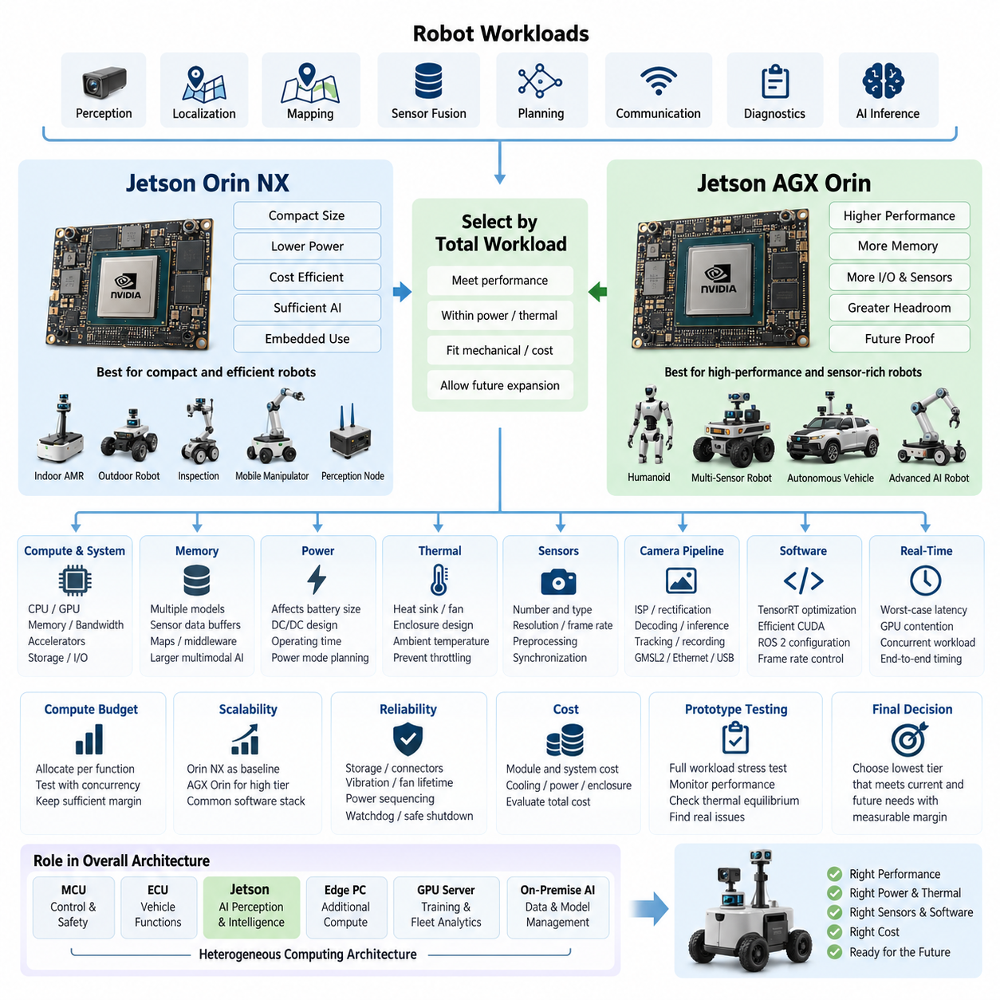
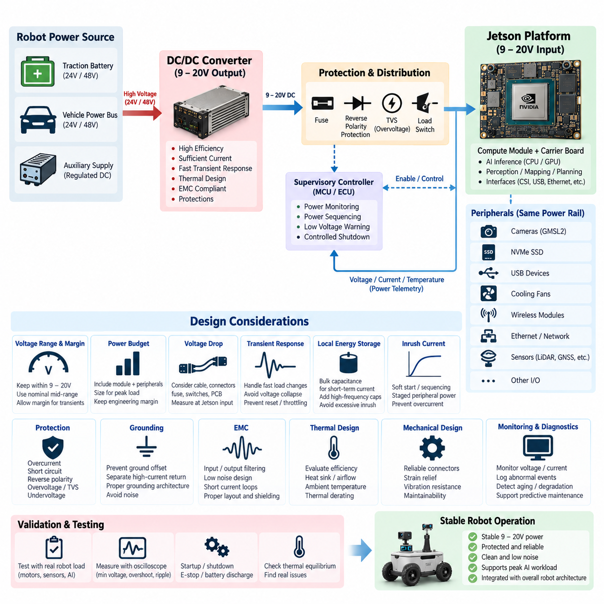
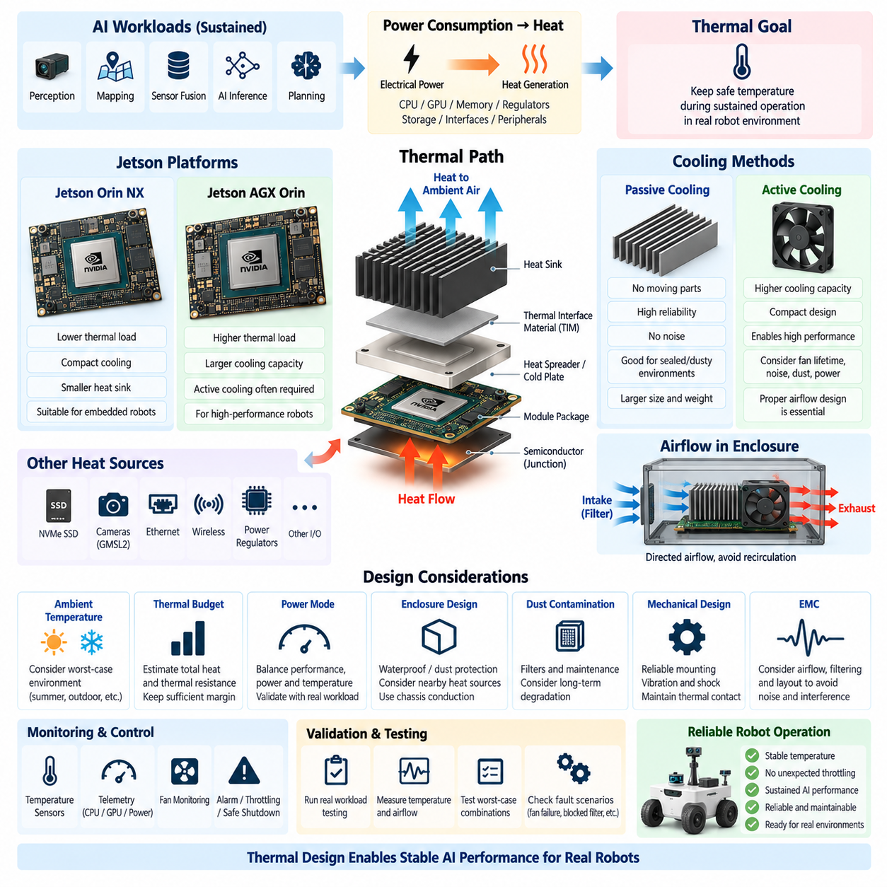
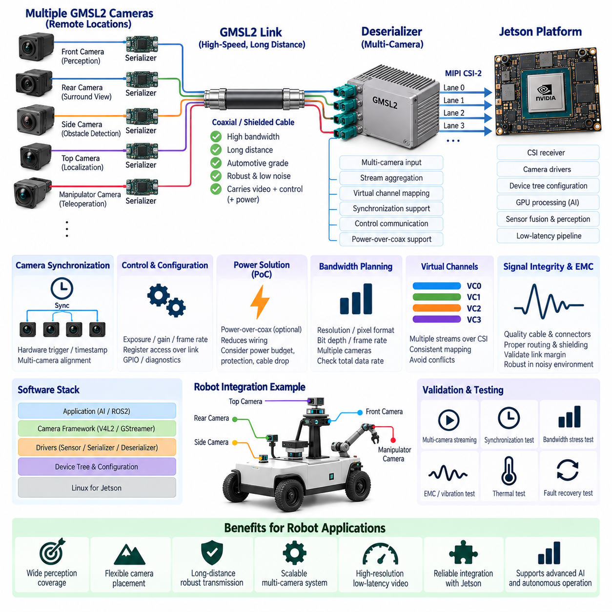
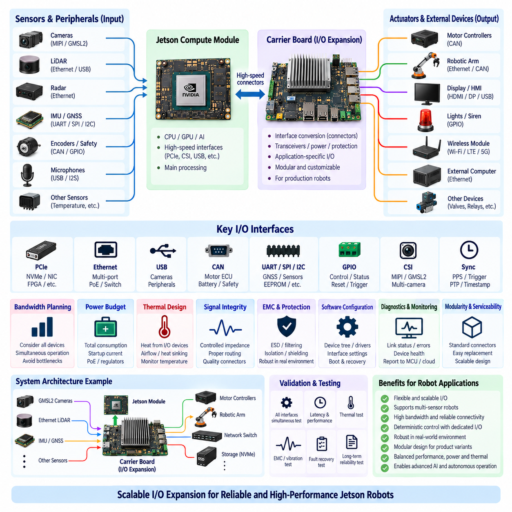

**Volume 16 Compute and AI Architecture**


# Chapter 03. Jetson Platform

##  

## 03.01. Jetson Orin NX/AGX Selection

{width="7.268055555555556in" height="7.268055555555556in"}

The selection between Jetson Orin NX and Jetson AGX Orin should begin with the robot's complete computing workload rather than a simple comparison of processor specifications. A robotics computer must execute perception, localization, mapping, sensor fusion, planning, communication, diagnostics, and increasingly AI inference at the same time. The appropriate platform is therefore the device that satisfies peak computational demand while remaining within the robot's electrical, thermal, mechanical, and cost constraints.

Jetson Orin NX is particularly suitable when high AI performance must be concentrated into a compact embedded computing module. It provides a practical foundation for indoor AMRs, compact outdoor robots, inspection platforms, mobile manipulators, and distributed perception nodes. Its relatively moderate power requirement simplifies battery integration and cooling, while the module architecture allows designers to build application-specific carrier boards containing Ethernet, CAN, USB, camera, storage, and other robot interfaces.

Jetson AGX Orin should be considered when the robot requires substantially greater computing headroom or must execute several demanding AI pipelines concurrently. Typical workloads include multi-camera perception, high-resolution object detection, semantic segmentation, 3D perception, large sensor-fusion networks, local planning, and advanced neural inference. The additional compute margin is valuable when future software releases are expected to introduce larger models or additional perception functions without replacing the computing platform.

Raw AI performance alone is not an adequate selection criterion. CPU resources, GPU utilization, memory capacity, memory bandwidth, accelerator availability, storage traffic, and communication interfaces must be evaluated as one computing system. Robotics applications frequently move large amounts of camera, LiDAR, radar, and intermediate neural-network data between processing stages. A platform with sufficient nominal inference performance may therefore become constrained by memory pressure, data movement, CPU scheduling, or I/O throughput before the GPU reaches its theoretical limit.

Memory capacity becomes increasingly important as Physical AI workloads evolve from independent perception models toward integrated multimodal architectures. Multiple neural networks, CUDA buffers, camera frames, point clouds, occupancy representations, maps, middleware processes, and system services may coexist in memory. Vision-language and vision-language-action workloads can increase this demand further. Orin NX can be appropriate for carefully optimized embedded pipelines, whereas AGX Orin provides greater architectural margin for larger models and concurrent workloads.

Power consumption must be treated as a system-level design parameter because compute selection directly influences battery capacity, DC/DC conversion, wiring, protection devices, and operating duration. Orin NX generally favors robots where energy efficiency and compact packaging are dominant requirements. AGX Orin permits higher sustained computational loading but requires the electrical architecture to support correspondingly greater peak and continuous demand. Power-mode configuration should therefore be incorporated into mission-level energy calculations rather than selected only after software development.

Thermal design is inseparable from platform selection. AI processors may operate for long periods near high utilization while the robot is moving slowly or stationary, conditions in which natural airflow can be limited. Heat-sink size, fan capacity, enclosure temperature, ambient operating range, dust protection, and neighboring heat sources must therefore be considered before finalizing the module. A theoretically faster AGX Orin can provide little practical benefit if thermal throttling prevents sustained operation at the required performance level.

The number and type of sensors strongly influence the decision. A robot using a small number of depth cameras and a 2D LiDAR may operate efficiently on Orin NX, while a platform combining several high-resolution cameras, multiple 3D LiDARs, radar, GNSS, IMU, and advanced fusion algorithms can justify AGX Orin. Sensor count should not be considered alone; resolution, frame rate, preprocessing, encoding, synchronization, neural inference frequency, and retained historical frames determine the actual computing and memory workload.

Camera architecture deserves particular attention because image processing can consume a large portion of embedded computing resources. Multi-camera robots may require image signal processing, rectification, synchronization, decoding, neural preprocessing, detection, segmentation, depth estimation, tracking, and recording simultaneously. Designers should estimate bandwidth from the sensor interface through memory and inference stages. This analysis also determines whether native interfaces are sufficient or whether GMSL2, Ethernet, USB, or dedicated expansion hardware is required elsewhere in the Jetson platform architecture.

Software architecture can reduce the required hardware class. TensorRT optimization, reduced-precision inference, efficient CUDA pipelines, zero-copy transport, appropriate ROS 2 communication settings, controlled frame rates, and selective execution of expensive models can allow Orin NX to support workloads that would otherwise appear to require a larger platform. Conversely, poorly optimized pipelines can exhaust AGX Orin resources. Hardware selection should therefore be performed using representative software rather than theoretical TOPS calculations alone.

Real-time behavior must also be distinguished from average throughput. A robot may achieve an acceptable mean inference rate while occasionally experiencing latency spikes caused by GPU contention, memory allocation, storage access, middleware scheduling, or simultaneous neural execution. Autonomous systems are sensitive to these tail latencies because delayed perception can propagate into localization and planning. Platform benchmarking should consequently measure worst-case and percentile latency under concurrent mission workloads, not merely isolated model frames per second.

A useful engineering approach is to construct a compute budget for every major function. Perception, localization, SLAM, sensor fusion, planning, VLA inference, recording, networking, visualization, and diagnostics should each receive estimated CPU, GPU, memory, bandwidth, and power allocations. The combined workload should then be tested with realistic concurrency. Sufficient reserve should remain after nominal operation because production robots require logging, health monitoring, remote access, software updates, and abnormal-condition processing that prototype benchmarks often omit.

Scalability should influence the decision when a common architecture will support several robot products. Orin NX can serve as the efficient baseline compute tier, while AGX Orin can become the high-performance tier for sensor-rich or AI-intensive variants. Maintaining compatible software interfaces, container environments, middleware conventions, and deployment pipelines across these tiers reduces engineering fragmentation. Applications can then migrate between platforms with limited architectural change while individual products receive computing capacity appropriate to their mission.

Reliability considerations extend beyond processor capability. Storage endurance, connector retention, vibration resistance, fan lifetime, power sequencing, undervoltage behavior, watchdog recovery, and controlled shutdown must be engineered around the Jetson module. Mobile robots experience battery transients, motor-generated electrical noise, shock, vibration, and environmental temperature variation that laboratory AI computers may never encounter. The selected platform must therefore be evaluated as part of the robot ECU rather than as an isolated development board.

For cost-sensitive production robots, Orin NX is often attractive because it can reduce not only module cost but also secondary costs associated with cooling, power conversion, enclosure volume, and battery capacity. AGX Orin becomes economically reasonable when its additional computing capability eliminates another computer, supports significantly more sensors, enables higher-value AI functions, or preserves the architecture across future software generations. Total system cost is consequently more meaningful than comparing the purchase prices of the modules alone.

Prototype development should include representative stress scenarios before committing to either platform. Tests should run simultaneous sensor acquisition, perception, localization, planning, recording, networking, and AI inference while monitoring GPU utilization, CPU utilization, memory consumption, memory bandwidth, temperatures, clock behavior, power draw, and end-to-end latency. Testing should continue long enough to reveal thermal equilibrium and resource accumulation. Short demonstrations can hide throttling, memory leaks, queue growth, and intermittent latency problems.

The final selection can therefore be expressed as a workload-and-margin decision. Jetson Orin NX is the preferred starting point when compactness, energy efficiency, cost, and optimized embedded inference dominate the requirements. Jetson AGX Orin is preferred when multi-sensor processing, concurrent high-performance AI, large models, or substantial future expansion dominate. Neither platform should be selected solely because it is smaller or faster; the correct choice is the platform that satisfies the complete robot compute budget with measurable operational margin.

Within the broader compute and AI architecture, the Jetson platform should also remain distinct from MCU, ECU, edge-PC, GPU-server, and on-premise AI roles. Deterministic low-level control and safety functions can remain on dedicated controllers, while Jetson performs computationally intensive perception and intelligence. Edge PCs and servers can provide additional acceleration, training, fleet analytics, and centralized services. This separation creates a heterogeneous computing architecture in which each processor class executes workloads matched to its timing, power, safety, and performance characteristics.

Ultimately, Orin NX versus AGX Orin selection is an architectural decision connecting AI ambition to physical robot constraints. The compute module determines not only inference capability but also power architecture, thermal engineering, sensor scalability, software optimization requirements, enclosure design, and product cost. A disciplined selection process therefore begins with mission workloads, models concurrent execution, validates sustained performance, preserves engineering margin, and chooses the lowest platform tier that can reliably satisfy both current functions and credible future expansion.

Jetson Orin NX와 Jetson AGX Orin의 선택은 단순한 프로세서 사양 비교가 아니라 로봇의 전체 컴퓨팅 작업부하(Computing Workload)를 기준으로 시작해야 한다. 로봇 컴퓨터는 인지(Perception), 위치추정(Localization), 매핑(Mapping), 센서 융합(Sensor Fusion), 경로 계획(Planning), 통신(Communication), 진단(Diagnostics), 그리고 점차 중요해지는 AI 추론(AI Inference)을 동시에 수행해야 한다. 따라서 적절한 플랫폼은 로봇의 전기적, 열적, 기계적, 비용적 제약조건을 만족하면서 최대 컴퓨팅 요구량을 처리할 수 있는 장치이다.

Jetson Orin NX는 높은 AI 성능을 소형 임베디드 컴퓨팅 모듈(Embedded Computing Module)에 집약해야 하는 경우 특히 적합하다. 실내 자율이동로봇(Indoor AMR), 소형 실외 로봇(Outdoor Robot), 점검 플랫폼(Inspection Platform), 모바일 매니퓰레이터(Mobile Manipulator), 분산 인지 노드(Distributed Perception Node)의 실용적인 기반이 될 수 있다. 비교적 적절한 전력 요구량은 배터리 통합과 냉각 설계를 단순화하며, 모듈 구조를 통해 Ethernet, CAN, USB, 카메라(Camera), 저장장치(Storage) 등의 인터페이스를 갖춘 전용 캐리어 보드(Carrier Board)를 구성할 수 있다.

Jetson AGX Orin은 로봇에 훨씬 큰 컴퓨팅 여유도(Computing Headroom)가 필요하거나 여러 고부하 AI 파이프라인(AI Pipeline)을 동시에 실행해야 할 때 고려해야 한다. 대표적인 작업에는 다중 카메라 인지(Multi-Camera Perception), 고해상도 객체 검출(Object Detection), 의미론적 분할(Semantic Segmentation), 3차원 인지(3D Perception), 대규모 센서 융합 네트워크(Sensor-Fusion Network), 로컬 경로 계획(Local Planning), 고급 신경망 추론(Neural Inference)이 포함된다. 추가적인 연산 여유는 향후 더 큰 모델이나 새로운 인지 기능을 도입할 때 컴퓨팅 플랫폼 교체 가능성을 줄여준다.

순수한 AI 연산 성능(Raw AI Performance)만으로 플랫폼을 선택해서는 안 된다. CPU 자원, GPU 사용률, 메모리 용량(Memory Capacity), 메모리 대역폭(Memory Bandwidth), 가속기(Accelerator), 저장장치 트래픽(Storage Traffic), 통신 인터페이스를 하나의 컴퓨팅 시스템으로 평가해야 한다. 로봇 응용에서는 카메라, LiDAR, Radar와 신경망 중간 데이터가 처리 단계 사이에서 대량 이동한다. 따라서 명목상 충분한 추론 성능을 가진 플랫폼도 GPU의 이론적 한계에 도달하기 전에 메모리 압박, 데이터 이동, CPU 스케줄링 또는 입출력 처리량(I/O Throughput)에 의해 제한될 수 있다.

메모리 용량은 피지컬 AI(Physical AI) 작업부하가 개별 인지 모델에서 통합 멀티모달 아키텍처(Multimodal Architecture)로 발전하면서 더욱 중요해진다. 여러 신경망, CUDA 버퍼(Buffer), 카메라 프레임(Frame), 포인트 클라우드(Point Cloud), 점유 표현(Occupancy Representation), 지도(Map), 미들웨어(Middleware) 프로세스와 시스템 서비스가 메모리에 동시에 존재할 수 있다. 비전-언어 모델(Vision-Language Model)과 비전-언어-행동 모델(Vision-Language-Action Model)은 이러한 요구량을 더욱 증가시킨다. Orin NX는 최적화된 임베디드 파이프라인에 적합하며, AGX Orin은 더 큰 모델과 동시 작업을 위한 추가적인 구조적 여유를 제공한다.

전력 소비(Power Consumption)는 시스템 수준 설계 변수(System-Level Design Parameter)로 다루어야 한다. 컴퓨팅 플랫폼 선택은 배터리 용량, DC/DC 변환, 배선(Wiring), 보호장치(Protection Device), 운용시간에 직접 영향을 미친다. Orin NX는 에너지 효율과 소형 패키징이 중요한 로봇에 일반적으로 유리하다. AGX Orin은 더 높은 지속 연산 부하를 허용하지만, 전기 아키텍처(Electrical Architecture)가 이에 상응하는 최대 및 연속 전력 요구량을 지원해야 한다. 따라서 전력 모드(Power Mode)는 소프트웨어 개발 이후가 아니라 임무 수준 에너지 계산(Mission-Level Energy Calculation)에 포함하여 결정해야 한다.

열 설계(Thermal Design)는 플랫폼 선택과 분리할 수 없다. AI 프로세서는 로봇이 저속으로 이동하거나 정지한 상태에서도 장시간 높은 사용률로 작동할 수 있으며, 이러한 조건에서는 자연적인 공기 흐름이 제한될 수 있다. 따라서 모듈을 최종 선정하기 전에 방열판(Heat Sink) 크기, 팬(Fan) 용량, 인클로저(Enclosure) 온도, 주변 운용온도, 방진(Dust Protection), 인접 열원(Heat Source)을 고려해야 한다. 이론적으로 더 빠른 AGX Orin도 열 스로틀링(Thermal Throttling)으로 요구 성능을 지속할 수 없다면 실제적인 장점을 충분히 제공하지 못한다.

센서의 수와 종류도 플랫폼 결정에 큰 영향을 미친다. 소수의 깊이 카메라(Depth Camera)와 2D LiDAR를 사용하는 로봇은 Orin NX에서 효율적으로 운용될 수 있지만, 여러 고해상도 카메라, 복수의 3D LiDAR, Radar, GNSS, IMU와 고급 융합 알고리즘을 결합한 플랫폼에서는 AGX Orin이 적합할 수 있다. 단순한 센서 개수만으로 판단해서는 안 되며 해상도, 프레임 속도(Frame Rate), 전처리(Preprocessing), 인코딩(Encoding), 시간 동기화(Time Synchronization), 신경망 추론 주기, 과거 프레임 보존량이 실제 연산 및 메모리 작업부하를 결정한다.

카메라 아키텍처(Camera Architecture)는 이미지 처리가 임베디드 컴퓨팅 자원의 상당 부분을 사용할 수 있기 때문에 특별히 고려해야 한다. 다중 카메라 로봇은 이미지 신호 처리(Image Signal Processing), 보정(Rectification), 동기화(Synchronization), 디코딩(Decoding), 신경망 전처리, 검출(Detection), 분할(Segmentation), 깊이 추정(Depth Estimation), 추적(Tracking), 녹화(Recording)를 동시에 수행할 수 있다. 설계자는 센서 인터페이스에서 메모리와 추론 단계까지의 대역폭을 추정해야 하며, 이를 통해 GMSL2, Ethernet, USB 또는 전용 확장 하드웨어(Dedicated Expansion Hardware)의 필요성도 결정할 수 있다.

소프트웨어 아키텍처(Software Architecture)를 최적화하면 요구되는 하드웨어 등급을 낮출 수 있다. TensorRT 최적화, 저정밀도 추론(Reduced-Precision Inference), 효율적인 CUDA 파이프라인, 제로 카피 전송(Zero-Copy Transport), 적절한 ROS 2 통신 설정, 프레임 속도 제어, 고비용 모델의 선택적 실행을 통해 Orin NX에서도 원래 더 높은 플랫폼이 필요해 보이는 작업을 수행할 수 있다. 반대로 최적화되지 않은 파이프라인은 AGX Orin의 자원도 쉽게 소진할 수 있으므로 하드웨어 선정은 이론적인 TOPS 계산만이 아니라 대표적인 실제 소프트웨어를 사용하여 수행해야 한다.

실시간 동작(Real-Time Behavior)은 평균 처리량(Average Throughput)과 구분하여 평가해야 한다. 로봇이 허용 가능한 평균 추론 속도를 달성하더라도 GPU 경합(Contention), 메모리 할당, 저장장치 접근, 미들웨어 스케줄링, 동시 신경망 실행 때문에 간헐적인 지연시간 급증(Latency Spike)이 발생할 수 있다. 자율 시스템에서는 지연된 인지 결과가 위치추정과 경로 계획까지 전달될 수 있다. 따라서 플랫폼 벤치마킹(Benchmarking)은 단독 모델의 초당 프레임 수뿐만 아니라 실제 동시 임무 작업에서 최악 조건 및 백분위 지연시간(Percentile Latency)을 측정해야 한다.

효과적인 엔지니어링 접근방법은 주요 기능별 컴퓨팅 예산(Compute Budget)을 구성하는 것이다. 인지, 위치추정, SLAM, 센서 융합, 경로 계획, VLA 추론, 데이터 기록, 네트워킹(Networking), 시각화(Visualization), 진단에 각각 CPU, GPU, 메모리, 대역폭, 전력 예산을 할당해야 한다. 이후 결합된 작업부하를 실제 동시 실행 조건에서 시험해야 한다. 양산 로봇에는 프로토타입 벤치마크에서 누락되기 쉬운 로깅(Logging), 상태 감시(Health Monitoring), 원격 접속(Remote Access), 소프트웨어 업데이트, 비정상 상태 처리도 필요하므로 정상 운용 이후에도 충분한 자원 여유가 남아 있어야 한다.

공통 아키텍처로 여러 로봇 제품을 지원하려는 경우 확장성(Scalability)도 중요한 선택 기준이다. Orin NX를 효율적인 기본 컴퓨팅 등급(Baseline Compute Tier)으로 사용하고, AGX Orin을 센서가 많거나 AI 작업부하가 높은 제품을 위한 고성능 등급(High-Performance Tier)으로 구성할 수 있다. 두 플랫폼에서 호환 가능한 소프트웨어 인터페이스, 컨테이너 환경(Container Environment), 미들웨어 규칙, 배포 파이프라인(Deployment Pipeline)을 유지하면 엔지니어링 파편화(Engineering Fragmentation)를 줄일 수 있다.

신뢰성(Reliability)은 프로세서의 연산 성능을 넘어서는 문제이다. 저장장치 내구성(Storage Endurance), 커넥터 고정, 진동 저항성(Vibration Resistance), 팬 수명, 전원 시퀀싱(Power Sequencing), 저전압 동작(Undervoltage Behavior), 워치독 복구(Watchdog Recovery), 제어된 종료(Controlled Shutdown)를 Jetson 모듈 주변에서 함께 설계해야 한다. 이동 로봇은 실험실 AI 컴퓨터와 달리 배터리 과도현상(Battery Transient), 모터 전기 노이즈, 충격, 진동, 환경 온도 변화에 노출되므로 선택된 플랫폼을 독립적인 개발보드가 아니라 로봇 ECU의 일부로 평가해야 한다.

비용에 민감한 양산 로봇에서는 Orin NX가 모듈 자체의 비용뿐만 아니라 냉각, 전력 변환, 인클로저 부피, 배터리 용량과 관련된 부수 비용까지 줄일 수 있어 매력적이다. 반면 AGX Orin의 추가 연산 능력이 별도의 컴퓨터를 제거하거나, 더 많은 센서를 지원하거나, 고부가가치 AI 기능을 가능하게 하거나, 향후 여러 소프트웨어 세대에 걸쳐 동일한 아키텍처를 유지하게 한다면 경제적으로 합리적인 선택이 될 수 있다. 따라서 모듈의 구매가격만 비교하기보다는 전체 시스템 비용(Total System Cost)을 평가하는 것이 중요하다.

프로토타입 개발(Prototype Development) 단계에서는 플랫폼을 확정하기 전에 대표적인 스트레스 시나리오(Stress Scenario)를 시험해야 한다. 센서 데이터 수집, 인지, 위치추정, 경로 계획, 기록, 네트워킹, AI 추론을 동시에 실행하면서 GPU 사용률, CPU 사용률, 메모리 소비량, 메모리 대역폭, 온도, 클록 동작(Clock Behavior), 소비전력, 종단간 지연시간(End-to-End Latency)을 측정해야 한다. 또한 열평형(Thermal Equilibrium)과 자원 누적 현상을 확인할 수 있을 만큼 충분히 장시간 시험해야 한다. 짧은 시연만으로는 스로틀링, 메모리 누수, 큐 증가(Queue Growth), 간헐적인 지연 문제를 발견하기 어렵다.

따라서 최종 플랫폼 선정은 작업부하와 여유도(Workload-and-Margin)에 기반한 의사결정으로 정의할 수 있다. 소형화, 에너지 효율, 비용, 최적화된 임베디드 추론이 주요 요구사항이라면 Jetson Orin NX가 우선적인 선택이 된다. 반면 다중 센서 처리, 동시 고성능 AI 실행, 대형 모델, 상당한 미래 확장성이 중요하다면 Jetson AGX Orin이 적합하다. 어느 플랫폼도 단순히 더 작거나 더 빠르다는 이유로 선택해서는 안 되며, 전체 로봇 컴퓨팅 예산을 측정 가능한 운용 여유도와 함께 만족시키는 플랫폼을 선택해야 한다.

보다 넓은 컴퓨팅 및 AI 아키텍처(Compute and AI Architecture) 관점에서 Jetson 플랫폼의 역할은 MCU, ECU, 엣지 PC(Edge PC), GPU 서버(GPU Server), 온프레미스 AI(On-Premise AI)의 역할과 구분되어야 한다. 결정론적인 저수준 제어(Deterministic Low-Level Control)와 안전 기능은 전용 제어기에 유지하고, Jetson은 계산 집약적인 인지와 지능 처리를 담당할 수 있다. 엣지 PC와 서버는 추가 가속, 학습(Training), 플릿 분석(Fleet Analytics), 중앙 집중형 서비스를 제공함으로써 각 프로세서 계층이 시간, 전력, 안전, 성능 요구에 적합한 작업을 담당하는 이기종 컴퓨팅 아키텍처(Heterogeneous Computing Architecture)를 구성할 수 있다.

궁극적으로 Orin NX와 AGX Orin의 선택은 AI 목표를 실제 로봇의 물리적 제약조건과 연결하는 아키텍처 의사결정(Architectural Decision)이다. 컴퓨팅 모듈은 추론 성능뿐만 아니라 전력 아키텍처, 열 설계, 센서 확장성, 소프트웨어 최적화 요구사항, 인클로저 설계, 제품 비용까지 결정한다. 따라서 체계적인 선정 과정은 임무 작업부하(Mission Workload)에서 시작하여 동시 실행을 모델링하고, 지속 성능(Sustained Performance)을 검증하며, 충분한 엔지니어링 여유도(Engineering Margin)를 확보한 뒤 현재 기능과 현실적인 미래 확장 요구를 모두 안정적으로 충족할 수 있는 최소 플랫폼 등급을 선택하는 방향으로 이루어져야 한다.

##  

## 03.02. Power Supply (9-20V) Design

{width="7.268055555555556in" height="7.268055555555556in"}

A 9--20 V power supply for a Jetson-based robotic computing platform must be designed as a complete power-delivery system rather than as a simple voltage connection. The input source may originate from a battery, DC/DC converter, vehicle power bus, or regulated auxiliary rail, and its behavior can change significantly during startup, charging, motor acceleration, regenerative events, or emergency shutdown. The design must therefore guarantee stable input voltage at the Jetson under both steady-state and transient operating conditions.

The first design objective is to maintain the Jetson input within its permitted operating range under every expected robot condition. A nominal supply voltage does not guarantee that the voltage measured at the computing module remains identical. Cable resistance, connectors, fuses, switches, protection devices, PCB traces, and converter impedance introduce voltage drop. These losses become particularly important when CPU and GPU workloads change rapidly and the platform draws short-duration peak current.

Input-voltage selection should include sufficient margin from both the lower and upper operating boundaries. Operating continuously near the minimum input voltage increases sensitivity to cable drop, battery discharge, connector aging, and transient current demand. Operating close to the upper boundary similarly reduces tolerance to converter overshoot or supply disturbances. A well-designed system therefore establishes a controlled nominal voltage near the center of the usable range and reserves margin for dynamic conditions.

In mobile robots, the Jetson supply is commonly derived from a higher-voltage traction battery through a dedicated DC/DC converter. A 24 V or 48 V robot power architecture should not feed the computing module directly unless the voltage is explicitly compatible with the selected hardware configuration. The converter must regulate the battery-domain voltage into the required Jetson input range while providing isolation from major disturbances generated by motors, actuators, relays, pumps, and other high-current loads.

DC/DC converter selection must be based on more than its nominal output voltage. Continuous output current, peak current capability, conversion efficiency, switching frequency, thermal derating, transient response, protection functions, and electromagnetic compatibility must all be evaluated. The converter should sustain the maximum realistic Jetson workload together with connected peripherals while maintaining adequate engineering margin rather than being sized exactly to the average measured consumption.

Peak power demand deserves particular attention because modern AI processors exhibit highly dynamic loading. GPU inference, camera processing, CUDA kernels, neural-network initialization, storage activity, and CPU bursts can cause current to change much faster than a battery-level power estimate suggests. If the DC/DC converter or distribution path responds too slowly, the local input voltage can collapse temporarily even though average power remains acceptable, potentially causing throttling, instability, or an unexpected system reset.

The power budget should include the complete Jetson subsystem rather than only the compute module. Carrier-board losses, NVMe SSDs, USB devices, GMSL2 camera interfaces, Ethernet adapters, cooling fans, wireless modules, and external I/O hardware may all draw energy from the same regulated rail. Their simultaneous startup or operation can increase both continuous and transient demand. The supply should therefore be sized from measured or conservatively estimated worst-case system consumption.

Voltage-drop analysis should be performed from the converter output to the actual Jetson power connector. Wire length, conductor cross-section, connector contact resistance, fuse resistance, switching elements, and PCB distribution paths should be included. Because voltage drop is proportional to current, a design that appears acceptable during idle operation may become unstable during intensive inference. Measuring voltage directly at the Jetson input during maximum computational loading provides a more meaningful validation than measuring only at the converter.

Local energy storage helps stabilize fast load transitions that the upstream converter cannot immediately follow. Appropriate bulk capacitance near the computing platform can supply short-duration current while the regulator responds, while smaller capacitors suppress higher-frequency disturbances. Capacitance should not be added without analysis, however, because excessive input capacitance can create large inrush current, stress connectors and switches, or interact with the DC/DC converter control loop.

Inrush-current management is especially important during system startup. Charging input capacitors, powering the carrier board, initializing storage, starting fans, and activating peripherals can produce a short but substantial current pulse. If several robot computers and sensors are enabled simultaneously, the combined inrush may exceed the converter or protection-device capability. Controlled power sequencing, soft-start behavior, staged peripheral activation, or dedicated load switches can reduce this startup stress.

Protection architecture should address overcurrent, short circuit, reverse polarity, overvoltage, undervoltage, and abnormal transient conditions. A fuse or electronic protection device should protect the wiring and downstream electronics without nuisance interruption during normal peak loads. Reverse-polarity protection is valuable for service and prototype environments, while overvoltage suppression can prevent upstream converter failures or electrical transients from propagating directly into the expensive computing subsystem.

Undervoltage behavior requires deliberate engineering because a slowly collapsing supply can produce unpredictable software and storage behavior. When battery voltage approaches its operational limit, the robot should detect the condition before the Jetson becomes unstable. A supervisory controller or MCU can initiate workload reduction, data synchronization, controlled application termination, and orderly shutdown. This approach is preferable to allowing the computer to reset repeatedly as the input crosses its minimum operating threshold.

Power sequencing should coordinate the Jetson with the robot's MCU, ECU, sensors, network devices, and actuator controllers. The low-level controller may need to remain operational before and after the AI computer so that startup authorization, shutdown supervision, diagnostics, and safe-state management remain available. The Jetson should therefore not necessarily be connected to the same uncontrolled ignition line as every peripheral. A supervised enable architecture provides more predictable system behavior.

Grounding is equally important in the power-supply design. High-current motor return paths should be prevented from introducing excessive voltage differences into sensitive computing and sensor grounds. The distribution architecture should define where power returns are joined and how the Jetson, sensors, communication interfaces, chassis, and shielding reference one another. Poor grounding can appear as random USB failures, Ethernet instability, camera corruption, sensor noise, or intermittent computer resets rather than as an obvious power problem.

Electromagnetic compatibility must be considered when selecting and integrating the DC/DC converter. Switching converters generate conducted and radiated noise, while motors and inverters can inject additional disturbances onto the shared battery network. Input filtering, output filtering, appropriate grounding, short current loops, shield termination, PCB layout, and physical separation from sensitive communication paths help prevent power electronics from degrading cameras, LiDAR, GNSS, Ethernet, or other perception systems.

Thermal performance of the power converter must be evaluated under the same environmental conditions as the Jetson. Converter efficiency directly determines heat generation, and efficiency may vary with input voltage and load. A converter that operates comfortably on an open laboratory bench may overheat inside a sealed robot enclosure exposed to high ambient temperature. Thermal derating, airflow, heat-sink mounting, enclosure conduction, and nearby heat sources should therefore be incorporated into the power architecture.

The mechanical implementation of the power path also affects reliability. Connectors must tolerate vibration and repeated service operations, while cables require appropriate strain relief and routing away from sharp edges or high-temperature components. Power connectors should not loosen under vehicle vibration, and service technicians should be able to disconnect the computing subsystem without disturbing unrelated safety wiring. Electrical performance and maintainability should be treated as complementary requirements.

Monitoring voltage, current, temperature, and power status provides valuable diagnostic information for production robots. The MCU or supervisory controller can record abnormal voltage dips, converter overtemperature events, excessive current consumption, or repeated startup failures. These records help distinguish software crashes from electrical problems and support predictive maintenance. Power telemetry can also reveal gradual degradation caused by aging connectors, cooling deterioration, or newly introduced computational workloads.

Validation should reproduce realistic worst-case operating conditions rather than testing the Jetson independently on a laboratory supply. Motors should accelerate, actuators should switch, sensors should stream data, storage should record, and AI workloads should execute concurrently while input voltage and current are monitored. Startup, shutdown, battery discharge, emergency-stop transitions, communication activity, and thermal equilibrium should all be tested to expose disturbances that may not appear during isolated bench operation.

Oscilloscope measurements are particularly useful because a conventional multimeter can hide short-duration voltage dips and switching transients. Measurements should be taken at the converter input, converter output, and Jetson power connector under representative dynamic loads. Engineers should examine minimum voltage, overshoot, ripple, startup waveform, shutdown behavior, and transient recovery. This allows the actual electrical margin to be quantified rather than inferred from nominal component specifications.

Ultimately, the 9--20 V supply architecture should provide clean, stable, protected, and observable power throughout the robot mission. The preferred solution combines adequate converter capacity, low-resistance distribution, transient energy support, controlled sequencing, grounding, filtering, protection, thermal management, and diagnostics. Designing these elements together allows the Jetson platform to sustain intensive AI workloads without electrical instability while remaining integrated with the broader MCU, ECU, sensor, communication, and robot power architecture.

Jetson 기반 로봇 컴퓨팅 플랫폼을 위한 9\~20 V 전원 공급장치(Power Supply)는 단순한 전압 연결이 아니라 완전한 전력 공급 시스템(Power-Delivery System)으로 설계해야 한다. 입력 전원은 배터리(Battery), DC/DC 컨버터(DC/DC Converter), 차량 전원 버스(Vehicle Power Bus), 또는 안정화된 보조 전원 레일(Regulated Auxiliary Rail)에서 공급될 수 있으며, 기동, 충전, 모터 가속, 회생 동작(Regenerative Event), 비상 정지 과정에서 특성이 크게 변할 수 있다. 따라서 정상상태와 과도상태(Transient Condition) 모두에서 Jetson 입력 전압의 안정성을 보장해야 한다.

첫 번째 설계 목표는 예상되는 모든 로봇 운용 조건에서 Jetson 입력을 허용 운용 범위(Permitted Operating Range) 내에 유지하는 것이다. 공칭 공급전압(Nominal Supply Voltage)이 컴퓨팅 모듈에서 측정되는 실제 전압과 동일하다고 보장할 수는 없다. 케이블 저항, 커넥터, 퓨즈(Fuse), 스위치, 보호장치, PCB 패턴(PCB Trace), 컨버터 임피던스(Converter Impedance)는 전압 강하(Voltage Drop)를 발생시킨다. 이러한 손실은 CPU와 GPU 작업부하가 급격히 변화하여 플랫폼에서 순간적인 최대 전류(Peak Current)가 요구될 때 특히 중요해진다.

입력전압(Input Voltage)을 선정할 때는 운용 범위의 하한과 상한 모두로부터 충분한 여유도(Margin)를 확보해야 한다. 최소 입력전압에 가까운 상태로 지속 운용하면 케이블 전압 강하, 배터리 방전, 커넥터 노화, 순간적인 전류 요구에 대한 민감도가 증가한다. 반대로 상한에 너무 가깝게 운용하면 컨버터 오버슈트(Converter Overshoot)나 전원 교란에 대한 허용 여유가 감소한다. 따라서 적절한 시스템은 사용 가능한 범위의 중앙 부근에 제어된 공칭전압을 설정하고 동적 조건을 위한 여유도를 확보해야 한다.

이동 로봇(Mobile Robot)에서는 일반적으로 Jetson 전원을 높은 전압의 구동 배터리(Traction Battery)에서 전용 DC/DC 컨버터를 통해 생성한다. 24 V 또는 48 V 로봇 전원 아키텍처(Robot Power Architecture)는 선택된 하드웨어 구성에서 해당 전압과의 호환성이 명확하게 확인되지 않는 한 컴퓨팅 모듈에 직접 연결해서는 안 된다. 컨버터는 배터리 영역의 전압을 Jetson에 필요한 입력 범위로 안정화하는 동시에 모터, 액추에이터(Actuator), 릴레이(Relay), 펌프(Pump) 등의 고전류 부하에서 발생하는 주요 전기적 교란으로부터 컴퓨팅 시스템을 보호해야 한다.

DC/DC 컨버터의 선정은 단순히 공칭 출력전압만을 기준으로 해서는 안 된다. 연속 출력전류(Continuous Output Current), 최대 전류 용량(Peak Current Capability), 변환 효율(Conversion Efficiency), 스위칭 주파수(Switching Frequency), 열 디레이팅(Thermal Derating), 과도응답(Transient Response), 보호 기능, 전자파 적합성(Electromagnetic Compatibility)을 모두 평가해야 한다. 컨버터는 평균 소비전력에 정확히 맞추는 것이 아니라 연결된 주변장치와 Jetson의 현실적인 최대 작업부하를 충분한 엔지니어링 여유도(Engineering Margin)를 두고 지속적으로 공급할 수 있어야 한다.

최대 전력 요구(Peak Power Demand)는 최신 AI 프로세서의 부하가 매우 동적으로 변화하기 때문에 특별히 고려해야 한다. GPU 추론(Inference), 카메라 처리, CUDA 커널(CUDA Kernel), 신경망 초기화, 저장장치 동작, CPU의 순간적인 연산 증가는 배터리 수준의 평균 전력 계산보다 훨씬 빠른 전류 변화를 발생시킬 수 있다. DC/DC 컨버터 또는 전력 분배 경로(Power Distribution Path)의 응답이 너무 느리면 평균 전력이 허용 범위에 있더라도 국부적인 입력전압이 순간적으로 떨어져 스로틀링(Throttling), 시스템 불안정 또는 예기치 않은 재부팅(System Reset)이 발생할 수 있다.

전력 예산(Power Budget)은 컴퓨팅 모듈만이 아니라 전체 Jetson 서브시스템(Subsystem)을 포함해야 한다. 캐리어 보드(Carrier Board)의 손실, NVMe SSD, USB 장치, GMSL2 카메라 인터페이스, Ethernet 어댑터, 냉각 팬(Cooling Fan), 무선 모듈(Wireless Module), 외부 입출력 하드웨어가 동일한 안정화 전원 레일에서 전력을 소비할 수 있다. 이러한 장치가 동시에 기동하거나 동작하면 연속 및 과도 전력 요구량이 모두 증가하므로 최악조건의 시스템 소비전력을 측정하거나 보수적으로 추정하여 전원 용량을 결정해야 한다.

전압 강하 분석(Voltage-Drop Analysis)은 컨버터 출력에서 실제 Jetson 전원 커넥터까지 전체 경로를 대상으로 수행해야 한다. 배선 길이, 도체 단면적(Conductor Cross-Section), 커넥터 접촉저항(Contact Resistance), 퓨즈 저항, 스위칭 소자, PCB 전력 분배 경로를 포함해야 한다. 전압 강하는 전류에 비례하므로 유휴 상태(Idle Operation)에서는 정상으로 보이는 설계도 고부하 AI 추론 과정에서는 불안정해질 수 있다. 따라서 최대 연산 부하에서 컨버터 출력만 측정하는 것보다 Jetson 입력단에서 직접 전압을 측정하는 것이 더욱 의미 있는 검증 방법이다.

국부적인 에너지 저장(Local Energy Storage)은 상위 컨버터가 즉각적으로 대응하기 어려운 빠른 부하 변화를 안정화하는 데 도움이 된다. 컴퓨팅 플랫폼 가까이에 적절한 대용량 커패시터(Bulk Capacitance)를 배치하면 레귤레이터(Regulator)가 응답하는 동안 짧은 시간 동안 필요한 전류를 공급할 수 있으며, 작은 커패시터는 고주파 교란을 억제한다. 그러나 과도한 입력 커패시턴스(Input Capacitance)는 큰 돌입전류(Inrush Current)를 발생시키고 커넥터와 스위치에 스트레스를 주거나 DC/DC 컨버터의 제어 루프(Control Loop)와 상호작용할 수 있으므로 분석 없이 임의로 추가해서는 안 된다.

돌입전류 관리(Inrush-Current Management)는 시스템 기동 과정에서 특히 중요하다. 입력 커패시터 충전, 캐리어 보드 전원 인가, 저장장치 초기화, 팬 기동, 주변장치 활성화 과정에서 짧지만 상당히 큰 전류 펄스(Current Pulse)가 발생할 수 있다. 여러 로봇 컴퓨터와 센서가 동시에 활성화되면 전체 돌입전류가 컨버터 또는 보호장치의 허용 용량을 초과할 수 있다. 제어된 전원 시퀀싱(Power Sequencing), 소프트 스타트(Soft Start), 단계적인 주변장치 활성화, 전용 부하 스위치(Load Switch)를 사용하여 이러한 기동 스트레스를 줄일 수 있다.

보호 아키텍처(Protection Architecture)는 과전류(Overcurrent), 단락(Short Circuit), 역극성(Reverse Polarity), 과전압(Overvoltage), 저전압(Undervoltage), 비정상적인 과도상태를 처리해야 한다. 퓨즈 또는 전자식 보호장치(Electronic Protection Device)는 정상적인 최대 부하에서 불필요하게 차단되지 않으면서 배선과 하위 전자장치를 보호해야 한다. 역극성 보호는 정비 및 프로토타입 환경에서 유용하며, 과전압 억제(Overvoltage Suppression)는 상위 컨버터 고장이나 전기적 과도현상이 고가의 컴퓨팅 서브시스템으로 직접 전달되는 것을 방지할 수 있다.

저전압 동작(Undervoltage Behavior)은 전원이 서서히 감소할 경우 소프트웨어와 저장장치가 예측하기 어려운 상태에 빠질 수 있기 때문에 의도적으로 설계해야 한다. 배터리 전압이 운용 한계에 접근하면 Jetson이 불안정해지기 전에 로봇이 이를 감지해야 한다. 감독 제어기(Supervisory Controller) 또는 MCU는 작업부하 감소, 데이터 동기화(Data Synchronization), 애플리케이션의 제어된 종료, 정상적인 시스템 종료(Orderly Shutdown)를 수행할 수 있다. 이는 입력전압이 최소 운용 임계값을 반복적으로 넘나들면서 컴퓨터가 계속 재부팅되는 것보다 바람직하다.

전원 시퀀싱(Power Sequencing)은 Jetson과 로봇의 MCU, ECU, 센서, 네트워크 장치, 액추에이터 제어기 사이에서 조정되어야 한다. 저수준 제어기(Low-Level Controller)는 기동 승인, 종료 감시, 진단, 안전 상태 관리(Safe-State Management)를 수행하기 위해 AI 컴퓨터보다 먼저 켜지고 이후까지 동작해야 할 수 있다. 따라서 Jetson을 모든 주변장치와 동일한 비제어 점화 전원선(Uncontrolled Ignition Line)에 연결할 필요는 없으며, 감시형 활성화 아키텍처(Supervised Enable Architecture)를 적용하면 보다 예측 가능한 시스템 동작을 구현할 수 있다.

접지(Grounding) 역시 전원 공급 설계에서 매우 중요하다. 고전류 모터의 귀환 경로(Return Path)가 민감한 컴퓨팅 및 센서 접지에 과도한 전위차를 발생시키지 않도록 해야 한다. 전력 분배 아키텍처는 전원 귀환 경로가 어디에서 결합되는지, 그리고 Jetson, 센서, 통신 인터페이스, 섀시(Chassis), 실드(Shield)가 서로 어떤 기준전위를 사용하는지 정의해야 한다. 잘못된 접지는 명확한 전원 문제 대신 무작위 USB 장애, Ethernet 불안정, 카메라 데이터 손상, 센서 노이즈 또는 간헐적인 컴퓨터 재부팅 형태로 나타날 수 있다.

DC/DC 컨버터를 선정하고 통합할 때는 전자파 적합성(Electromagnetic Compatibility)을 고려해야 한다. 스위칭 컨버터는 전도성 및 방사성 노이즈(Conducted and Radiated Noise)를 발생시키며, 모터와 인버터(Inverter)는 공유 배터리 네트워크에 추가적인 교란을 유입할 수 있다. 입력 및 출력 필터링(Filtering), 적절한 접지, 짧은 전류 루프(Current Loop), 실드 종단(Shield Termination), PCB 레이아웃(Layout), 민감한 통신 경로와의 물리적 분리를 통해 전력 전자장치가 카메라, LiDAR, GNSS, Ethernet 또는 기타 인지 시스템의 성능을 저하시키는 것을 방지해야 한다.

전력 컨버터의 열 성능(Thermal Performance)은 Jetson과 동일한 환경 조건에서 평가해야 한다. 컨버터 효율은 직접적으로 발열량을 결정하며, 입력전압과 부하에 따라 효율이 달라질 수 있다. 개방된 실험실 벤치에서는 안정적으로 동작하는 컨버터도 높은 주변온도에 노출되는 밀폐형 로봇 인클로저 내부에서는 과열될 수 있다. 따라서 열 디레이팅, 공기 흐름(Airflow), 방열판 장착, 인클로저를 통한 열전도(Enclosure Conduction), 주변 열원을 전원 아키텍처에 함께 반영해야 한다.

전력 경로의 기계적 구현(Mechanical Implementation)도 신뢰성에 영향을 미친다. 커넥터는 진동과 반복적인 정비 작업을 견뎌야 하며, 케이블에는 적절한 변형 방지(Strain Relief)가 적용되어야 하고 날카로운 모서리나 고온 부품을 피해 배선해야 한다. 전원 커넥터는 차량 진동으로 느슨해지지 않아야 하며, 정비 작업자가 관련 없는 안전 배선을 건드리지 않고 컴퓨팅 서브시스템만 분리할 수 있어야 한다. 전기적 성능과 정비성(Maintainability)은 상호 보완적인 요구사항으로 다루어야 한다.

전압, 전류, 온도, 전원 상태를 모니터링하면 양산 로봇에서 유용한 진단 정보(Diagnostic Information)를 확보할 수 있다. MCU 또는 감독 제어기는 비정상적인 전압 강하, 컨버터 과열, 과도한 전류 소비, 반복적인 기동 실패를 기록할 수 있다. 이러한 기록은 소프트웨어 충돌과 전기적 문제를 구분하고 예지정비(Predictive Maintenance)를 지원하는 데 도움이 된다. 또한 전력 텔레메트리(Power Telemetry)를 통해 커넥터 노화, 냉각 성능 저하 또는 새롭게 추가된 컴퓨팅 작업부하에 따른 점진적인 시스템 변화를 확인할 수 있다.

검증(Validation)은 Jetson을 실험실 전원장치에 독립적으로 연결하여 시험하는 것이 아니라 실제적인 최악조건 운용환경을 재현해야 한다. 모터 가속, 액추에이터 전환, 센서 데이터 스트리밍, 저장장치 기록, AI 작업부하를 동시에 실행하면서 입력전압과 전류를 모니터링해야 한다. 기동, 종료, 배터리 방전, 비상 정지(Emergency Stop) 전환, 통신 동작, 열평형 상태를 모두 시험하여 단독 벤치 시험에서는 나타나지 않는 전기적 교란을 확인해야 한다.

오실로스코프(Oscilloscope) 측정은 일반적인 멀티미터(Multimeter)가 감지하지 못하는 짧은 전압 강하와 스위칭 과도현상을 확인할 수 있기 때문에 특히 유용하다. 대표적인 동적 부하 조건에서 컨버터 입력, 컨버터 출력, Jetson 전원 커넥터에서 각각 측정해야 한다. 최소 전압, 오버슈트(Overshoot), 리플(Ripple), 기동 파형(Startup Waveform), 종료 동작, 과도응답 복구(Transient Recovery)를 분석하면 공칭 부품 사양만으로 추정하는 것이 아니라 실제 전기적 여유도를 정량적으로 확인할 수 있다.

궁극적으로 9\~20 V 전원 아키텍처(Power Architecture)는 로봇의 전체 임무 수행 과정에서 깨끗하고 안정적이며 보호되고 관측 가능한 전력을 제공해야 한다. 적절한 컨버터 용량, 낮은 저항의 전력 분배, 과도상태 에너지 지원, 제어된 시퀀싱, 접지, 필터링, 보호회로, 열 관리(Thermal Management), 진단 기능을 하나의 시스템으로 통합하는 것이 바람직하다. 이러한 요소를 함께 설계하면 Jetson 플랫폼이 고부하 AI 작업을 전기적 불안정 없이 지속적으로 수행하면서 MCU, ECU, 센서, 통신 및 전체 로봇 전원 아키텍처와 안정적으로 통합될 수 있다.

##  

## 03.03. Thermal Dissipation Design

{width="7.268055555555556in" height="7.268055555555556in"}

Thermal dissipation design for a Jetson-based robotic computing platform must begin with the recognition that electrical power consumed by the processor ultimately becomes heat that must be transferred to the surrounding environment. CPU, GPU, memory, power regulators, storage, and interface circuits may operate simultaneously under intensive AI workloads. The cooling architecture must therefore maintain acceptable component temperatures during sustained operation, not merely during short laboratory demonstrations.

The thermal requirement should be derived from realistic mission workloads rather than idle or average processor utilization. Perception, mapping, sensor fusion, neural-network inference, camera processing, and planning can create long periods of high CPU and GPU activity. When several functions execute concurrently, heat generation may remain near its upper operating level for extended periods. Thermal design must therefore consider sustained worst-case workloads together with realistic ambient temperature and enclosure conditions.

Jetson Orin NX and Jetson AGX Orin require different cooling approaches because their achievable performance, configurable power modes, module dimensions, and thermal loads differ. A compact Orin NX system can often use a relatively small heat sink and controlled airflow, while a higher-performance AGX Orin configuration may require substantially greater heat-transfer capacity. Cooling hardware should consequently be selected together with compute performance and power-mode configuration rather than after the computing platform has already been fixed.

The fundamental thermal path begins at the semiconductor junction and continues through the package, thermal interface material, heat spreader or cold plate, heat sink, enclosure, and surrounding air. Every interface contributes thermal resistance. Even a large heat sink cannot compensate effectively for poor contact between the module and cooling surface. Thermal engineering should therefore optimize the entire heat-flow path instead of focusing only on the visible fan or heat-sink assembly.

Thermal interface material, commonly referred to as TIM, is used to reduce microscopic air gaps between mating surfaces and improve heat conduction. Its thickness, thermal conductivity, compression, surface coverage, and long-term stability influence cooling performance. Excessively thick material can increase thermal resistance, while insufficient contact pressure can create local hot spots. Mechanical tolerances must therefore be coordinated with TIM selection so that consistent thermal contact is maintained throughout manufacturing and field operation.

Passive cooling removes heat without relying on powered airflow and can improve reliability by eliminating fan wear, noise, and moving parts. It is attractive for sealed robots, dusty environments, and systems requiring low maintenance. However, passive cooling depends strongly on heat-sink area, orientation, enclosure conduction, and natural convection. As AI workload and ambient temperature increase, the required heat sink can become too large or heavy, making active cooling more practical.

Active cooling uses fans or blowers to increase airflow across the heat sink and substantially reduce thermal resistance. This approach enables compact packaging and higher sustained processor performance, but introduces additional engineering concerns such as fan lifetime, dust accumulation, vibration, acoustic noise, power consumption, and failure detection. Fan selection should therefore consider airflow under actual system resistance rather than only the unrestricted airflow value listed in a component specification.

Airflow must be treated as a controlled path through the computing enclosure. Simply installing a powerful fan does not guarantee effective cooling if air recirculates around the heat sink or bypasses the hottest components. Intake and exhaust locations, duct geometry, cable obstruction, neighboring PCBs, filters, and enclosure vents determine the real flow pattern. Cooling air should be intentionally directed across the major heat-generating surfaces before leaving the enclosure.

Enclosure design has a major influence on thermal performance because mobile robots often package computing electronics inside compact protected spaces. Waterproofing and dust protection reduce uncontrolled airflow, while nearby batteries, DC/DC converters, motor drivers, and other electronics can increase internal temperature. The Jetson cooling system must therefore be evaluated as part of the complete enclosure rather than as an isolated module tested in open laboratory air.

Conduction through the enclosure can become an important cooling mechanism in sealed systems. A heat spreader, cold plate, thermal bridge, or chassis-mounted heat sink can transfer energy from the Jetson toward a larger metal structure. Aluminum chassis components can sometimes serve as part of the thermal path if electrical isolation, structural loading, corrosion, sealing, and serviceability are properly addressed. This approach can reduce dependence on internal recirculating airflow.

Ambient temperature defines the available thermal margin between the processor and the environment. A cooling system that maintains acceptable temperatures at room temperature may fail when the robot operates outdoors in summer, inside a warehouse without climate control, or near heat-producing machinery. Solar loading can further increase enclosure temperature. Validation should therefore include the highest credible environmental temperature rather than relying on typical indoor laboratory conditions.

Temperature sensors and platform telemetry should be used to observe the thermal state of the computing system continuously. Jetson software can report relevant temperatures, clock behavior, utilization, and power information, while additional sensors may monitor enclosure air, heat-sink surfaces, DC/DC converters, or nearby components. Combining these measurements provides a more complete thermal picture and helps determine whether rising processor temperature originates from workload, airflow degradation, or elevated ambient conditions.

Thermal throttling protects the processor by reducing operating frequency or performance when temperature approaches defined limits. Although this mechanism prevents immediate hardware damage, it should not be treated as the primary cooling strategy. In an autonomous robot, throttling can increase inference latency, reduce perception throughput, or disturb planning timing during precisely the conditions when high performance is required. A robust design should maintain the required workload without sustained thermal throttling.

The relationship between power mode and cooling capacity should be explicitly engineered. Reducing the configured processor power can decrease heat generation and enable smaller cooling hardware, while higher power modes can increase AI throughput at the cost of greater thermal demand. Product variants can therefore use software-configurable power limits to balance performance, energy consumption, and temperature. The selected mode should be validated using actual mission software rather than theoretical processor capability alone.

Storage and peripheral devices must also be included in the thermal model. NVMe SSDs can generate significant heat during continuous logging or dataset recording, while camera interface boards, Ethernet devices, wireless modules, and power regulators add localized thermal loads. If these components share the same enclosure and airflow path, their heat contributes to Jetson inlet temperature. Cooling design should therefore consider the complete compute subsystem rather than only the processor module.

Dust contamination gradually changes cooling performance in field robots. Filters, heat-sink fins, fan blades, and ventilation openings can accumulate particles and increase airflow resistance over time. A cooling system that barely satisfies temperature limits when new may fail after months of operation. Design margin, accessible filters, maintenance intervals, fan monitoring, and contamination testing should therefore be incorporated when robots are expected to operate in warehouses, factories, construction sites, or outdoor environments.

Mechanical vibration and shock also affect thermal hardware. Heavy heat sinks require secure mounting, while fans and thermal interfaces must maintain contact under repeated vibration. Large unsupported cooling structures can apply undesirable mechanical loads to the module or carrier board. Mounting points, fasteners, spring pressure, retention mechanisms, and mass distribution should be designed so that the thermal solution remains mechanically stable throughout the robot's operating life.

A thermal budget provides a useful engineering framework for connecting power dissipation with allowable temperature rise. Heat generated by the Jetson and neighboring devices must pass through a sequence of thermal resistances before reaching ambient air. Estimating these resistances allows designers to determine whether a proposed heat sink, airflow rate, or chassis conduction path can provide sufficient margin. Measurements can then refine the model during prototype development.

Computational fluid dynamics and thermal simulation can support enclosure development when airflow paths are complex. Simulation can identify recirculation zones, insufficient vent areas, hot components, and ineffective fan placement before hardware revisions become expensive. However, simulation results depend strongly on boundary conditions, material properties, heat-source assumptions, and airflow models. Physical measurements remain necessary because cables, assembly tolerances, filters, and real fan behavior can differ from idealized models.

Prototype validation should operate the Jetson with representative AI workloads while all major robot electronics are active. CPU and GPU utilization, processor temperature, memory temperature where available, SSD temperature, fan speed, input power, clock frequency, and ambient temperature should be recorded over time. Testing should continue until temperatures reach thermal equilibrium, because short tests may appear successful even though internal temperature continues rising slowly.

Worst-case thermal testing should combine demanding conditions rather than evaluating them independently. High ambient temperature, maximum AI workload, simultaneous sensor streaming, continuous storage activity, restricted airflow, and neighboring power-electronics operation may occur together. Testing combinations of these factors exposes thermal coupling that individual component tests can miss. Appropriate engineering margin should remain after the worst credible condition has reached steady state.

Fault scenarios should also be evaluated. Fan slowdown or failure, blocked ventilation, partially clogged filters, abnormal processor loading, elevated enclosure temperature, and sensor failure can degrade cooling unexpectedly. The system should detect important thermal abnormalities and respond predictably through alarms, workload reduction, controlled performance limiting, or safe shutdown. Supervisory MCU or ECU logic can complement Jetson thermal management by coordinating robot-level responses to persistent overheating.

Thermal diagnostics are valuable for fleet operation because temperature trends can reveal degradation before a failure occurs. Increasing temperature under an unchanged workload may indicate dust accumulation, fan deterioration, degraded thermal contact, or higher enclosure temperature. Recording temperature, fan speed, processor utilization, and power telemetry allows maintenance systems to distinguish temporary workload effects from progressive cooling problems and supports condition-based maintenance across deployed robots.

Ultimately, Jetson thermal dissipation design must connect compute performance, electrical power, mechanical packaging, environmental protection, and software operation into one engineering architecture. The objective is not simply to keep the processor below an absolute temperature limit, but to preserve predictable AI performance throughout sustained robot missions. A successful design provides a low-resistance heat path, controlled airflow or conduction, adequate environmental margin, reliable monitoring, and validated operation without unacceptable throttling.

Within the broader compute and AI architecture, thermal design also influences platform selection, power-supply sizing, enclosure design, sensor integration, reliability, and product scalability. Orin NX may be preferred where compact and energy-efficient thermal solutions dominate, while AGX Orin can support higher computational capability when sufficient cooling capacity is available. The final thermal architecture should therefore be established together with the Jetson performance target, power budget, and complete robot operating environment.

Jetson 기반 로봇 컴퓨팅 플랫폼의 열 방출 설계(Thermal Dissipation Design)는 프로세서가 소비하는 전력이 궁극적으로 주변 환경으로 방출해야 하는 열로 변환된다는 점에서 시작해야 한다. CPU, GPU, 메모리(Memory), 전력 레귤레이터(Power Regulator), 저장장치(Storage), 인터페이스 회로(Interface Circuit)는 고부하 AI 작업에서 동시에 동작할 수 있다. 따라서 냉각 아키텍처(Cooling Architecture)는 짧은 실험실 시연뿐만 아니라 장시간 지속 운용에서도 각 부품의 온도를 허용 범위 내로 유지해야 한다.

열 요구사항(Thermal Requirement)은 유휴 상태나 평균 프로세서 사용률이 아니라 실제 임무 작업부하(Mission Workload)를 기준으로 도출해야 한다. 인지(Perception), 매핑(Mapping), 센서 융합(Sensor Fusion), 신경망 추론(Neural-Network Inference), 카메라 처리(Camera Processing), 경로 계획(Planning)은 CPU와 GPU에 장시간 높은 부하를 발생시킬 수 있다. 여러 기능이 동시에 실행되면 발열이 오랫동안 높은 수준으로 유지될 수 있으므로 지속적인 최악조건 작업부하와 실제 주변온도 및 인클로저(Enclosure) 조건을 함께 고려해야 한다.

Jetson Orin NX와 Jetson AGX Orin은 구현 가능한 성능, 설정 가능한 전력 모드(Power Mode), 모듈 크기, 열 부하(Thermal Load)가 서로 다르기 때문에 서로 다른 냉각 방식을 요구한다. 소형 Orin NX 시스템은 비교적 작은 방열판(Heat Sink)과 제어된 공기 흐름(Airflow)을 사용할 수 있지만, 고성능 AGX Orin 구성에서는 훨씬 큰 열전달 용량(Heat-Transfer Capacity)이 필요할 수 있다. 따라서 냉각 하드웨어는 컴퓨팅 플랫폼을 먼저 확정한 후 결정하기보다 컴퓨팅 성능과 전력 모드 설정을 함께 고려하여 선정해야 한다.

기본적인 열전달 경로(Thermal Path)는 반도체 접합부(Semiconductor Junction)에서 시작하여 패키지(Package), 열 인터페이스 재료(Thermal Interface Material), 열 확산판(Heat Spreader) 또는 냉각판(Cold Plate), 방열판, 인클로저, 주변 공기로 이어진다. 각 인터페이스에는 열저항(Thermal Resistance)이 존재한다. 모듈과 냉각 표면 사이의 접촉 상태가 좋지 않으면 대형 방열판을 사용하더라도 효과적으로 보완하기 어렵기 때문에 눈에 보이는 팬이나 방열판만이 아니라 전체 열 흐름 경로를 최적화해야 한다.

일반적으로 TIM이라고 하는 열 인터페이스 재료(Thermal Interface Material)는 접촉면 사이의 미세한 공기층을 줄이고 열전도(Heat Conduction)를 개선하는 데 사용된다. TIM의 두께, 열전도율(Thermal Conductivity), 압축 정도, 표면 적용 범위, 장기 안정성이 냉각 성능에 영향을 준다. 지나치게 두꺼운 재료는 열저항을 증가시키고 접촉 압력이 부족하면 국부적인 핫스팟(Hot Spot)이 발생할 수 있다. 따라서 제조 및 현장 운용 전반에서 일정한 열 접촉 상태를 유지할 수 있도록 기계적 공차(Mechanical Tolerance)와 TIM 선정이 연계되어야 한다.

수동 냉각(Passive Cooling)은 강제 공기 흐름을 위한 전력을 사용하지 않고 열을 제거하며, 팬 마모, 소음, 구동 부품을 제거하여 신뢰성을 높일 수 있다. 밀폐형 로봇, 먼지가 많은 환경, 낮은 유지보수 요구가 중요한 시스템에서 유리하다. 그러나 수동 냉각 성능은 방열판 면적, 설치 방향, 인클로저를 통한 열전도, 자연대류(Natural Convection)에 크게 의존한다. AI 작업부하와 주변온도가 증가하면 필요한 방열판이 지나치게 크고 무거워질 수 있으므로 능동 냉각이 더 현실적인 대안이 될 수 있다.

능동 냉각(Active Cooling)은 팬(Fan)이나 블로어(Blower)를 이용하여 방열판을 통과하는 공기 흐름을 증가시키고 열저항을 크게 낮춘다. 이를 통해 소형 패키징과 높은 지속 프로세서 성능을 구현할 수 있지만 팬 수명, 먼지 축적, 진동, 소음, 전력 소비, 고장 감지와 같은 추가적인 설계 문제가 발생한다. 따라서 팬은 부품 사양에 표시된 무부하 공기 유량(Unrestricted Airflow)만으로 선정하지 말고 실제 시스템의 유동 저항(System Resistance)이 존재하는 조건에서 제공할 수 있는 공기 유량을 기준으로 평가해야 한다.

공기 흐름은 컴퓨팅 인클로저 내부에서 제어된 경로(Controlled Path)로 설계해야 한다. 강력한 팬을 설치하더라도 공기가 방열판 주변에서 재순환(Recirculation)하거나 가장 뜨거운 부품을 우회하면 효과적인 냉각을 보장할 수 없다. 흡기(Intake)와 배기(Exhaust)의 위치, 덕트(Duct) 형상, 케이블에 의한 흐름 방해, 인접 PCB, 필터(Filter), 인클로저 통풍구가 실제 공기 흐름을 결정한다. 냉각 공기는 주요 발열 표면을 의도적으로 통과한 후 인클로저 외부로 배출되도록 설계해야 한다.

이동 로봇의 컴퓨팅 전자장치는 일반적으로 작고 보호된 공간에 패키징되므로 인클로저 설계(Enclosure Design)는 열 성능에 큰 영향을 준다. 방수(Waterproofing)와 방진(Dust Protection)을 강화하면 자연적인 공기 흐름이 감소하며, 인접한 배터리, DC/DC 컨버터, 모터 드라이버(Motor Driver), 기타 전자장치는 내부 온도를 높일 수 있다. 따라서 Jetson 냉각 시스템은 개방된 실험실 환경에서 독립적인 모듈로 시험하는 것이 아니라 전체 인클로저 시스템의 일부로 평가해야 한다.

밀폐형 시스템에서는 인클로저를 통한 전도(Conduction)가 중요한 냉각 방식이 될 수 있다. 열 확산판, 냉각판, 열 브리지(Thermal Bridge), 섀시 장착형 방열판(Chassis-Mounted Heat Sink)을 통해 Jetson에서 발생한 열을 더 큰 금속 구조물로 전달할 수 있다. 전기적 절연(Electrical Isolation), 구조 하중, 부식(Corrosion), 밀폐성(Sealing), 정비성(Serviceability)을 적절히 고려한다면 알루미늄 섀시(Aluminum Chassis) 자체를 열전달 경로의 일부로 활용할 수 있으며 내부 순환 공기에 대한 의존도를 낮출 수 있다.

주변온도(Ambient Temperature)는 프로세서와 환경 사이에서 사용할 수 있는 열적 여유도(Thermal Margin)를 결정한다. 실온에서는 적절한 온도를 유지하는 냉각 시스템도 여름철 실외, 냉방되지 않는 창고, 또는 발열 장비 주변에서 로봇이 동작하면 한계를 초과할 수 있다. 태양 복사열(Solar Loading)은 인클로저 온도를 더욱 상승시킬 수 있다. 따라서 검증에서는 일반적인 실내 실험실 조건이 아니라 실제 운용환경에서 예상할 수 있는 가장 높은 온도를 포함해야 한다.

온도 센서(Temperature Sensor)와 플랫폼 텔레메트리(Platform Telemetry)를 사용하여 컴퓨팅 시스템의 열 상태를 지속적으로 관찰해야 한다. Jetson 소프트웨어는 주요 온도, 클록 동작(Clock Behavior), 사용률(Utilization), 전력 정보를 제공할 수 있으며, 추가 센서를 통해 인클로저 내부 공기, 방열판 표면, DC/DC 컨버터, 인접 부품의 온도를 측정할 수 있다. 이러한 데이터를 결합하면 보다 완전한 열 상태를 파악할 수 있으며 프로세서 온도 상승이 작업부하, 공기 흐름 저하 또는 높은 주변온도 중 어디에서 발생하는지 판단하는 데 도움이 된다.

열 스로틀링(Thermal Throttling)은 온도가 설정된 한계에 접근하면 동작 주파수나 성능을 낮춰 프로세서를 보호한다. 이 기능은 즉각적인 하드웨어 손상을 방지하지만 기본적인 냉각 전략으로 사용해서는 안 된다. 자율 로봇에서 스로틀링은 높은 성능이 필요한 상황에서 추론 지연시간(Inference Latency)을 증가시키고 인지 처리량(Perception Throughput)을 감소시키며 경로 계획의 타이밍을 방해할 수 있다. 따라서 안정적인 설계는 지속적인 열 스로틀링 없이 요구되는 작업부하를 처리할 수 있어야 한다.

전력 모드(Power Mode)와 냉각 용량(Cooling Capacity)의 관계는 명확하게 설계되어야 한다. 프로세서의 설정 전력을 낮추면 발열을 감소시키고 더 작은 냉각 하드웨어를 사용할 수 있으며, 높은 전력 모드는 AI 처리량을 증가시키는 대신 더 높은 열 방출 능력을 요구한다. 따라서 제품별로 소프트웨어에서 설정 가능한 전력 제한(Software-Configurable Power Limit)을 사용하여 성능, 에너지 소비, 온도 사이의 균형을 조정할 수 있다. 선택된 모드는 이론적인 프로세서 성능이 아니라 실제 임무 소프트웨어를 이용해 검증해야 한다.

저장장치와 주변장치(Peripheral Device)도 열 모델(Thermal Model)에 포함해야 한다. NVMe SSD는 지속적인 로깅(Logging)이나 데이터셋 기록 과정에서 상당한 열을 발생시킬 수 있으며, 카메라 인터페이스 보드, Ethernet 장치, 무선 모듈, 전력 레귤레이터도 국부적인 열 부하를 추가한다. 이러한 부품이 동일한 인클로저와 공기 흐름 경로를 공유하면 발생한 열이 Jetson의 흡입 공기 온도를 상승시킨다. 따라서 냉각 설계에서는 프로세서 모듈뿐만 아니라 전체 컴퓨팅 서브시스템(Compute Subsystem)을 고려해야 한다.

먼지 오염(Dust Contamination)은 현장 로봇의 냉각 성능을 점진적으로 변화시킨다. 필터, 방열판 핀(Heat-Sink Fin), 팬 블레이드(Fan Blade), 환기구에는 시간이 지나면서 입자가 축적되어 공기 흐름 저항을 증가시킬 수 있다. 신품 상태에서 온도 한계를 간신히 만족하는 냉각 시스템은 수개월 후에는 실패할 가능성이 있다. 따라서 창고, 공장, 건설현장, 실외에서 운용되는 로봇에는 충분한 설계 여유도, 접근 가능한 필터, 유지보수 주기, 팬 모니터링, 오염 시험을 반영해야 한다.

기계적 진동(Mechanical Vibration)과 충격(Shock)도 열 관리 하드웨어에 영향을 준다. 무거운 방열판은 견고하게 고정해야 하며 팬과 열 인터페이스는 반복적인 진동에서도 접촉 상태를 유지해야 한다. 크고 지지되지 않은 냉각 구조물은 모듈이나 캐리어 보드에 불필요한 기계적 하중을 가할 수 있다. 따라서 장착 지점, 체결부(Fastener), 스프링 압력(Spring Pressure), 고정 메커니즘(Retention Mechanism), 질량 분포를 고려하여 로봇의 전체 운용수명 동안 열 관리 구조가 기계적으로 안정되도록 설계해야 한다.

열 예산(Thermal Budget)은 전력 손실과 허용 온도 상승을 연결하는 유용한 엔지니어링 프레임워크(Engineering Framework)를 제공한다. Jetson과 주변 장치에서 발생한 열은 주변 공기에 도달하기 전에 일련의 열저항을 통과해야 한다. 이러한 열저항을 추정하면 제안된 방열판, 공기 유량, 섀시 전도 경로가 충분한 열적 여유도를 제공할 수 있는지 판단할 수 있다. 이후 프로토타입 개발 과정에서 실제 측정값을 이용하여 열 모델을 보정할 수 있다.

전산유체역학(Computational Fluid Dynamics, CFD)과 열 시뮬레이션(Thermal Simulation)은 공기 흐름 경로가 복잡한 인클로저 개발을 지원할 수 있다. 시뮬레이션을 통해 하드웨어 수정 비용이 증가하기 전에 공기 재순환 영역, 부족한 환기 면적, 고온 부품, 비효율적인 팬 위치를 확인할 수 있다. 그러나 결과는 경계조건(Boundary Condition), 재료 물성, 열원 가정, 공기 흐름 모델에 크게 의존하므로 실제 케이블, 조립 공차, 필터, 팬 특성이 이상적인 모델과 다를 수 있다는 점을 고려하여 물리적 측정을 반드시 병행해야 한다.

프로토타입 검증(Prototype Validation)에서는 주요 로봇 전자장치를 모두 동작시킨 상태에서 Jetson에 대표적인 AI 작업부하를 실행해야 한다. CPU 및 GPU 사용률, 프로세서 온도, 가능한 경우 메모리 온도, SSD 온도, 팬 속도, 입력전력, 클록 주파수, 주변온도를 시간에 따라 기록해야 한다. 짧은 시험에서는 내부 온도가 계속 천천히 상승하는 현상을 발견하지 못할 수 있으므로 시스템이 열평형(Thermal Equilibrium)에 도달할 때까지 충분한 시간 동안 시험해야 한다.

최악조건 열 시험(Worst-Case Thermal Testing)은 각각의 가혹조건을 독립적으로 평가하기보다 여러 조건을 동시에 조합해야 한다. 높은 주변온도, 최대 AI 작업부하, 동시 센서 스트리밍(Sensor Streaming), 지속적인 저장장치 기록, 제한된 공기 흐름, 인접 전력전자장치의 동작은 실제 환경에서 동시에 발생할 수 있다. 이러한 조건을 조합하여 시험하면 개별 부품 시험에서 발견하기 어려운 열적 결합(Thermal Coupling)을 확인할 수 있으며, 최악의 현실적인 조건이 정상상태에 도달한 이후에도 적절한 엔지니어링 여유도가 남아 있어야 한다.

고장 시나리오(Fault Scenario)도 평가해야 한다. 팬 속도 저하 또는 고장, 환기구 차단, 부분적으로 막힌 필터, 비정상적인 프로세서 부하, 높은 인클로저 온도, 센서 고장은 예상하지 못한 냉각 성능 저하를 발생시킬 수 있다. 시스템은 주요 열 이상 상태를 감지하고 경보(Alarm), 작업부하 감소, 제어된 성능 제한(Controlled Performance Limiting), 안전 종료(Safe Shutdown) 등의 방식으로 예측 가능하게 대응해야 한다. 감독 MCU 또는 ECU 로직은 지속적인 과열 상황에 대한 로봇 수준 대응을 조정하여 Jetson의 열 관리 기능을 보완할 수 있다.

열 진단(Thermal Diagnostics)은 온도 변화 추세를 통해 고장이 발생하기 전에 성능 저하를 발견할 수 있으므로 플릿 운용(Fleet Operation)에서 유용하다. 동일한 작업부하에서 온도가 지속적으로 상승한다면 먼지 축적, 팬 성능 저하, 열 접촉 상태 악화 또는 인클로저 온도 상승을 의미할 수 있다. 온도, 팬 속도, 프로세서 사용률, 전력 텔레메트리를 기록하면 일시적인 작업부하 영향과 점진적인 냉각 성능 저하를 구분할 수 있으며 배치된 로봇 전체에 대한 상태 기반 유지보수(Condition-Based Maintenance)를 지원할 수 있다.

궁극적으로 Jetson 열 방출 설계는 컴퓨팅 성능, 전력, 기계적 패키징(Mechanical Packaging), 환경 보호(Environmental Protection), 소프트웨어 운용을 하나의 엔지니어링 아키텍처로 연결해야 한다. 목표는 단순히 프로세서를 절대적인 온도 한계 이하로 유지하는 것이 아니라 지속적인 로봇 임무 전체에서 예측 가능한 AI 성능을 보존하는 것이다. 성공적인 설계는 낮은 열저항의 열전달 경로, 제어된 공기 흐름 또는 전도, 충분한 환경적 여유도, 신뢰성 높은 모니터링, 허용할 수 없는 스로틀링 없이 검증된 운용 성능을 제공해야 한다.

보다 넓은 컴퓨팅 및 AI 아키텍처(Compute and AI Architecture)에서 열 설계는 플랫폼 선정, 전원 공급장치 용량, 인클로저 설계, 센서 통합, 신뢰성, 제품 확장성(Product Scalability)에도 영향을 미친다. 소형화와 에너지 효율적인 열 관리가 중요한 경우 Orin NX가 적합할 수 있으며, 충분한 냉각 용량을 확보할 수 있다면 AGX Orin을 통해 더 높은 컴퓨팅 성능을 구현할 수 있다. 따라서 최종 열 아키텍처는 Jetson의 성능 목표, 전력 예산(Power Budget), 전체 로봇 운용환경과 함께 수립되어야 한다.

##  

## 03.04. GMSL2 Camera Integration

{width="7.268055555555556in" height="7.268055555555556in"}

GMSL2 camera integration provides a high-bandwidth and robust video transport architecture for Jetson-based robotic computing systems. GMSL2, or Gigabit Multimedia Serial Link 2, allows high-resolution camera data to be transmitted over automotive-grade coaxial or shielded twisted-pair cabling across distances that are difficult for conventional embedded camera interfaces. This makes it particularly suitable for AMRs, autonomous vehicles, inspection robots, and sensor-rich Physical AI platforms.

A typical GMSL2 camera architecture consists of an image sensor, serializer, transmission cable, deserializer, and Jetson camera interface. The serializer converts the camera's native video and control signals into a high-speed serial stream, while the deserializer reconstructs those signals near the computing platform. The recovered image data is then transferred toward the Jetson through interfaces such as MIPI CSI-2, creating a bridge between remotely mounted cameras and the embedded AI processor.

The principal advantage of this architecture is that cameras can be physically separated from the Jetson while maintaining high data rates and deterministic connectivity. Cameras may be installed at the front, rear, sides, roof, manipulator, or other remote locations of the robot without positioning the main computer nearby. This separation improves sensor placement flexibility and allows the compute enclosure to remain protected while cameras are positioned according to perception coverage rather than cable-length limitations.

GMSL2 is particularly valuable for multi-camera perception because several camera streams can be aggregated through one or more deserializers before entering the Jetson. A robot may use cameras for forward perception, surround view, obstacle detection, semantic understanding, teleoperation, or visual localization simultaneously. The integration architecture must therefore consider the total pixel rate, resolution, frame rate, number of cameras, CSI lane allocation, and processing workload rather than evaluating each camera independently.

Camera bandwidth should be calculated from the actual sensor configuration. Resolution, pixel format, bit depth, frame rate, metadata, synchronization information, and protocol overhead all contribute to the required transport capacity. A camera configured for high-resolution raw output can consume significantly more bandwidth than a compressed or lower-bit-depth stream. The complete design must ensure that the serializer, GMSL2 link, deserializer, CSI interface, Jetson capture subsystem, and memory path can all sustain the combined data rate.

The serializer is normally located close to the image sensor and forms the remote camera-side interface. It receives sensor video data and may also transport control, synchronization, GPIO, and other auxiliary signals over the same physical link. This reduces the amount of separate wiring required between the camera and compute unit. Serializer configuration must match the sensor output format, lane structure, clocking, link mode, and control architecture used by the selected camera module.

The deserializer is located near the Jetson and performs the reverse conversion while often supporting multiple incoming camera links. It may aggregate several video streams and map them onto one or more CSI-2 outputs. Deserializer selection therefore affects the maximum camera count, supported resolutions, virtual channels, synchronization capability, and CSI connectivity. The carrier-board architecture must provide sufficient physical interfaces and lane routing to connect these outputs correctly to the Jetson platform.

MIPI CSI-2 integration requires careful lane and bandwidth planning. The number of available CSI lanes is finite, and multiple cameras may need to share physical interfaces through virtual channels or deserializer aggregation. Lane speed, lane count, stream mapping, and Jetson camera-port configuration must be coordinated. A design can fail even when individual GMSL2 links have sufficient bandwidth if the downstream CSI interface becomes the bottleneck for the combined camera traffic.

Virtual channel handling enables multiple image streams to share a CSI connection while remaining logically distinguishable. Each stream must be mapped consistently through the serializer, deserializer, CSI receiver, device tree, driver, and application software. Incorrect virtual-channel configuration can result in missing frames, stream collisions, or cameras appearing on unintended interfaces. The logical camera topology should therefore be defined together with the physical wiring architecture.

Camera synchronization is essential when images from several viewpoints are combined for stereo processing, surround perception, depth estimation, sensor fusion, or machine-learning inference. Free-running cameras can capture the same scene at different moments, producing spatial inconsistencies when the robot or surrounding objects are moving. GMSL2 systems can support synchronization signals that coordinate exposure timing across multiple cameras, but the complete timing architecture must include sensors, serializers, deserializers, and Jetson timestamp handling.

Hardware synchronization should be distinguished from software timestamp alignment. Hardware triggering can align camera exposure events closely, while timestamps describe when captured data enters or progresses through the computing system. For advanced sensor fusion, camera timing may also need to be related to LiDAR, IMU, GNSS, or other sensors. The camera architecture should therefore connect with the robot's broader time-synchronization strategy rather than treating synchronization as an isolated camera feature.

Control communication is another important function of the GMSL2 link. Camera sensors frequently require register configuration for exposure, gain, frame rate, operating mode, and diagnostic functions. Serializer and deserializer devices can provide tunneled control paths that allow the Jetson or an associated controller to communicate with remote camera electronics. Address mapping and initialization order must be carefully managed when several identical camera modules are connected to the same system.

Power-over-coax or related remote-power architectures can reduce harness complexity by carrying camera power and high-speed data through the same cable assembly. This is attractive for mobile robots because fewer wires and connectors simplify routing, reduce weight, and improve serviceability. However, the power architecture must account for camera current, cable voltage drop, filtering, protection, startup behavior, and fault isolation so that a remote camera failure does not destabilize the Jetson or other perception sensors.

Cable and connector selection is critical because the GMSL2 physical layer operates at high data rates in an electrically noisy robotic environment. Cable impedance, insertion loss, shielding, connector quality, routing length, bend radius, and termination affect signal integrity. Harnesses may also run near motors, inverters, DC/DC converters, or high-current battery wiring. Automotive-grade coaxial or shielded solutions are therefore commonly preferred when vibration, EMC, and long-term reliability are important.

Signal integrity should be validated across the complete communication path rather than assumed from individual component ratings. Serializer output, cable attenuation, connectors, deserializer equalization, PCB traces, and CSI routing all contribute to link margin. Poor signal quality may appear as intermittent frame loss, corrupted images, link retraining, or failures that occur only at elevated temperature or under electromagnetic disturbance. Production validation should include representative cable lengths and connector combinations.

Carrier-board PCB design becomes especially important between the deserializer and Jetson. High-speed CSI signals require controlled impedance, appropriate differential-pair routing, length management, reference-plane continuity, and careful connector placement. Power and switching circuits should be separated from sensitive high-speed signal paths where practical. The carrier board must also provide clean supplies and suitable reset, interrupt, synchronization, and control connections for the GMSL2 devices.

Software integration extends from low-level hardware configuration to the perception application. Jetson camera support generally requires correct device-tree descriptions, sensor drivers, serializer and deserializer configuration, CSI receiver settings, and capture frameworks. The software must recognize the physical camera topology and initialize components in the correct sequence. Hardware that produces a valid electrical link can still fail to deliver usable images if the software representation does not match the actual architecture.

Driver development should account for camera mode selection, exposure control, gain, synchronization, link status, error recovery, and stream restart behavior. In a production robot, cameras cannot be assumed to remain permanently healthy after startup. Connectors may experience disturbance, sensors may reset, or links may temporarily lose synchronization. The software architecture should detect abnormal conditions and attempt controlled recovery without requiring the entire Jetson computing platform to reboot.

The captured camera stream must then be integrated efficiently with the Jetson AI pipeline. Unnecessary copying between camera buffers, CPU memory, GPU memory, and inference frameworks can increase latency and memory bandwidth consumption. Hardware-accelerated and zero-copy or low-copy pipelines are therefore desirable when supported. Efficient transport from CSI capture through preprocessing and GPU inference becomes increasingly important as camera count, resolution, and frame rate increase.

Latency must be analyzed from image exposure to usable AI output rather than only from cable transmission time. Exposure duration, serializer transport, deserialization, CSI reception, buffering, image processing, GPU scheduling, neural inference, and middleware communication all contribute to end-to-end latency. Autonomous robots require predictable timing because delayed perception directly affects localization, obstacle avoidance, and planning. Both average latency and worst-case variation should therefore be measured.

Thermal and power considerations remain relevant even though cameras are distributed around the robot. Serializers inside compact camera housings generate heat, while deserializers handling several high-bandwidth streams can become significant thermal sources on the carrier board. Remote camera power and deserializer consumption must be included in the system power budget. Thermal design should ensure reliable link operation under sustained multi-camera streaming and the highest expected ambient temperature.

Diagnostics are essential for maintaining a multi-camera robotic system. The platform should monitor camera availability, frame counters, link lock, synchronization status, communication errors, temperature where available, and repeated recovery events. These diagnostics can be reported to the robot MCU, ECU, or fleet-management system. A camera that intermittently loses frames may otherwise appear as an AI perception problem when the actual cause is a cable, connector, power, synchronization, or physical-link issue.

Validation should combine bandwidth, synchronization, EMC, thermal, vibration, and software testing. All cameras should stream simultaneously at their target resolution and frame rate while representative AI workloads execute on the Jetson. Testing should include long-duration operation, startup and shutdown, cable movement, temperature variation, electrical disturbances, and recovery from disconnected or failed cameras. This exposes integration problems that cannot be identified through single-camera bench testing.

Ultimately, GMSL2 integration should be treated as a complete perception data architecture connecting remote image sensors to Jetson AI processing. Successful implementation requires coordinated selection of sensors, serializers, cables, connectors, deserializers, CSI resources, carrier-board routing, synchronization, power, drivers, and GPU data pipelines. When these elements are engineered together, GMSL2 provides a scalable foundation for reliable high-resolution multi-camera perception in advanced AMRs, autonomous robots, and Physical AI systems.

GMSL2 카메라 통합(GMSL2 Camera Integration)은 Jetson 기반 로봇 컴퓨팅 시스템에 고대역폭(High-Bandwidth)과 높은 신뢰성을 갖춘 영상 전송 아키텍처(Video Transport Architecture)를 제공한다. GMSL2(Gigabit Multimedia Serial Link 2)는 고해상도 카메라 데이터를 차량용 등급의 동축 케이블(Coaxial Cable) 또는 차폐 연선(Shielded Twisted-Pair)을 통해 기존 임베디드 카메라 인터페이스로 구현하기 어려운 거리까지 전송할 수 있다. 따라서 AMR, 자율주행 차량(Autonomous Vehicle), 점검 로봇(Inspection Robot), 센서가 많은 피지컬 AI(Physical AI) 플랫폼에 특히 적합하다.

일반적인 GMSL2 카메라 아키텍처(Camera Architecture)는 이미지 센서(Image Sensor), 직렬화기(Serializer), 전송 케이블(Transmission Cable), 역직렬화기(Deserializer), Jetson 카메라 인터페이스(Camera Interface)로 구성된다. 직렬화기는 카메라의 기본 영상 및 제어 신호를 고속 직렬 스트림(High-Speed Serial Stream)으로 변환하고, 역직렬화기는 컴퓨팅 플랫폼 가까이에서 이러한 신호를 다시 복원한다. 복원된 영상 데이터는 MIPI CSI-2와 같은 인터페이스를 통해 Jetson으로 전달되어 원격 카메라와 임베디드 AI 프로세서를 연결한다.

이 아키텍처의 주요 장점은 높은 데이터 전송률과 결정론적인 연결성(Deterministic Connectivity)을 유지하면서 카메라를 Jetson으로부터 물리적으로 멀리 배치할 수 있다는 것이다. 카메라는 메인 컴퓨터를 가까이에 설치하지 않고도 로봇의 전방, 후방, 측면, 상부, 매니퓰레이터(Manipulator) 등에 설치할 수 있다. 이를 통해 컴퓨팅 인클로저(Compute Enclosure)는 보호된 위치에 유지하면서 카메라는 케이블 길이의 제약이 아니라 인지 범위(Perception Coverage)를 기준으로 배치할 수 있다.

GMSL2는 여러 카메라 스트림(Camera Stream)을 하나 이상의 역직렬화기를 통해 집계한 후 Jetson으로 전달할 수 있기 때문에 다중 카메라 인지(Multi-Camera Perception)에 특히 유용하다. 로봇은 전방 인지, 서라운드 뷰(Surround View), 장애물 검출(Obstacle Detection), 의미론적 이해(Semantic Understanding), 원격조작(Teleoperation), 시각적 위치추정(Visual Localization)을 위한 카메라를 동시에 사용할 수 있다. 따라서 통합 아키텍처에서는 개별 카메라뿐만 아니라 전체 픽셀 처리율(Pixel Rate), 해상도, 프레임 속도(Frame Rate), 카메라 수, CSI 레인 할당(CSI Lane Allocation), 연산 작업부하를 함께 고려해야 한다.

카메라 대역폭(Camera Bandwidth)은 실제 센서 구성을 기준으로 계산해야 한다. 해상도, 픽셀 형식(Pixel Format), 비트 깊이(Bit Depth), 프레임 속도, 메타데이터(Metadata), 동기화 정보, 프로토콜 오버헤드(Protocol Overhead)가 모두 필요한 전송 용량에 영향을 준다. 고해상도 원시 데이터(Raw Output)로 설정된 카메라는 압축 영상이나 낮은 비트 깊이의 스트림보다 훨씬 많은 대역폭을 사용할 수 있다. 따라서 직렬화기, GMSL2 링크(Link), 역직렬화기, CSI 인터페이스, Jetson 캡처 서브시스템(Capture Subsystem), 메모리 경로 전체가 결합된 데이터 전송률을 지속적으로 처리할 수 있어야 한다.

직렬화기(Serializer)는 일반적으로 이미지 센서 가까이에 배치되어 원격 카메라 측 인터페이스(Remote Camera-Side Interface)를 구성한다. 직렬화기는 센서 영상 데이터를 입력받으며 제어, 동기화, GPIO 및 기타 보조 신호도 동일한 물리적 링크를 통해 전송할 수 있다. 이를 통해 카메라와 컴퓨팅 장치 사이에 필요한 별도의 배선을 줄일 수 있다. 직렬화기 설정은 선택된 카메라 모듈의 센서 출력 형식, 레인 구조(Lane Structure), 클록(Clock), 링크 모드(Link Mode), 제어 아키텍처와 일치해야 한다.

역직렬화기(Deserializer)는 Jetson 가까이에 배치되어 역변환을 수행하며 일반적으로 여러 개의 카메라 입력 링크를 지원할 수 있다. 여러 영상 스트림을 집계하여 하나 이상의 CSI-2 출력으로 매핑할 수도 있다. 따라서 역직렬화기 선정은 최대 카메라 수, 지원 해상도, 가상 채널(Virtual Channel), 동기화 기능, CSI 연결성에 영향을 준다. 캐리어 보드 아키텍처(Carrier-Board Architecture)는 이러한 출력을 Jetson 플랫폼에 올바르게 연결할 수 있도록 충분한 물리적 인터페이스와 레인 라우팅(Lane Routing)을 제공해야 한다.

MIPI CSI-2 통합에는 세심한 레인 및 대역폭 계획이 필요하다. 사용 가능한 CSI 레인 수에는 한계가 있으며, 여러 카메라가 가상 채널 또는 역직렬화기 집계(Deserializer Aggregation)를 통해 물리적 인터페이스를 공유해야 할 수 있다. 레인 속도, 레인 수, 스트림 매핑(Stream Mapping), Jetson 카메라 포트 설정(Camera-Port Configuration)을 서로 조정해야 한다. 각각의 GMSL2 링크에 충분한 대역폭이 있더라도 하위 CSI 인터페이스가 결합된 카메라 트래픽의 병목(Bottleneck)이 되면 시스템이 정상적으로 동작하지 않을 수 있다.

가상 채널 처리(Virtual Channel Handling)를 사용하면 여러 영상 스트림이 하나의 CSI 연결을 공유하면서도 논리적으로 서로 구분될 수 있다. 각각의 스트림은 직렬화기, 역직렬화기, CSI 수신기(Receiver), 디바이스 트리(Device Tree), 드라이버(Driver), 애플리케이션 소프트웨어(Application Software)에 걸쳐 일관되게 매핑되어야 한다. 가상 채널 설정이 잘못되면 프레임 누락(Frame Loss), 스트림 충돌(Stream Collision), 또는 카메라가 의도하지 않은 인터페이스에 나타나는 문제가 발생할 수 있으므로 논리적인 카메라 토폴로지(Camera Topology)를 물리적 배선 아키텍처와 함께 정의해야 한다.

여러 시점의 영상을 스테레오 처리(Stereo Processing), 서라운드 인지, 깊이 추정(Depth Estimation), 센서 융합, 머신러닝 추론(Machine-Learning Inference)에 결합하는 경우 카메라 동기화(Camera Synchronization)가 필수적이다. 자유 실행(Free-Running) 카메라는 동일한 장면을 서로 다른 시점에 촬영할 수 있으며 로봇이나 주변 물체가 이동하면 공간적인 불일치가 발생한다. GMSL2 시스템은 여러 카메라의 노출 시점(Exposure Timing)을 조정하는 동기화 신호를 지원할 수 있지만 전체 타이밍 아키텍처(Timing Architecture)에는 센서, 직렬화기, 역직렬화기, Jetson의 타임스탬프(Timestamp) 처리가 모두 포함되어야 한다.

하드웨어 동기화(Hardware Synchronization)는 소프트웨어 타임스탬프 정렬(Software Timestamp Alignment)과 구분해야 한다. 하드웨어 트리거링(Hardware Triggering)은 카메라 노출 이벤트를 매우 가깝게 정렬할 수 있으며, 타임스탬프는 촬영된 데이터가 컴퓨팅 시스템에 입력되고 처리되는 시점을 나타낸다. 고급 센서 융합에서는 카메라 시간 기준을 LiDAR, IMU, GNSS 또는 다른 센서와 연결해야 할 수도 있다. 따라서 카메라 아키텍처의 동기화는 독립적인 기능이 아니라 로봇 전체 시간 동기화(Time Synchronization) 전략과 연결되어야 한다.

제어 통신(Control Communication) 역시 GMSL2 링크의 중요한 기능이다. 카메라 센서는 노출(Exposure), 게인(Gain), 프레임 속도, 동작 모드, 진단 기능을 설정하기 위한 레지스터(Register) 구성이 필요한 경우가 많다. 직렬화기와 역직렬화기는 터널링된 제어 경로(Tunneled Control Path)를 제공하여 Jetson 또는 관련 제어기가 원격 카메라 전자장치와 통신할 수 있도록 한다. 동일한 카메라 모듈 여러 개가 하나의 시스템에 연결되는 경우 주소 매핑(Address Mapping)과 초기화 순서(Initialization Order)를 세심하게 관리해야 한다.

동축 케이블 전원 공급(Power-over-Coax) 또는 이와 유사한 원격 전원 아키텍처(Remote-Power Architecture)는 하나의 케이블 어셈블리(Cable Assembly)를 통해 카메라 전원과 고속 데이터를 함께 전달하여 하네스 복잡성(Harness Complexity)을 줄일 수 있다. 배선과 커넥터 수가 감소하여 라우팅, 중량, 정비성이 개선되므로 이동 로봇에 유리하다. 그러나 원격 카메라의 고장이 Jetson이나 다른 인지 센서를 불안정하게 만들지 않도록 카메라 소비전류, 케이블 전압 강하, 필터링(Filtering), 보호회로, 기동 특성, 고장 격리(Fault Isolation)를 고려해야 한다.

GMSL2 물리 계층(Physical Layer)은 전기적으로 노이즈가 많은 로봇 환경에서 높은 데이터 전송률로 동작하기 때문에 케이블과 커넥터 선정이 매우 중요하다. 케이블 임피던스(Impedance), 삽입 손실(Insertion Loss), 차폐(Shielding), 커넥터 품질, 배선 길이, 굽힘 반경(Bend Radius), 종단(Termination)이 신호 무결성(Signal Integrity)에 영향을 준다. 또한 하네스가 모터, 인버터(Inverter), DC/DC 컨버터 또는 고전류 배터리 배선 근처를 통과할 수 있으므로 진동, EMC, 장기 신뢰성이 중요한 경우 차량용 등급의 동축 또는 차폐형 솔루션이 일반적으로 유리하다.

신호 무결성은 개별 부품의 정격만으로 판단하지 말고 전체 통신 경로에서 검증해야 한다. 직렬화기 출력, 케이블 감쇠(Cable Attenuation), 커넥터, 역직렬화기 등화(Equalization), PCB 패턴, CSI 라우팅이 모두 링크 여유도(Link Margin)에 영향을 준다. 신호 품질이 낮으면 간헐적인 프레임 손실, 영상 손상, 링크 재훈련(Link Retraining), 또는 높은 온도나 전자기 교란 조건에서만 발생하는 장애로 나타날 수 있다. 양산 검증에서는 실제 사용될 대표적인 케이블 길이와 커넥터 조합을 포함해야 한다.

역직렬화기와 Jetson 사이에서는 캐리어 보드 PCB 설계(Carrier-Board PCB Design)가 특히 중요하다. 고속 CSI 신호에는 제어 임피던스(Controlled Impedance), 적절한 차동쌍 라우팅(Differential-Pair Routing), 길이 관리, 기준면 연속성(Reference-Plane Continuity), 신중한 커넥터 배치가 필요하다. 가능한 경우 전원 및 스위칭 회로를 민감한 고속 신호 경로에서 분리해야 한다. 또한 캐리어 보드는 GMSL2 장치에 깨끗한 전원과 적절한 리셋(Reset), 인터럽트(Interrupt), 동기화, 제어 연결을 제공해야 한다.

소프트웨어 통합(Software Integration)은 저수준 하드웨어 설정에서 인지 애플리케이션까지 이어진다. Jetson 카메라 지원에는 올바른 디바이스 트리(Device Tree), 센서 드라이버(Sensor Driver), 직렬화기 및 역직렬화기 설정, CSI 수신기 설정, 캡처 프레임워크(Capture Framework)가 필요하다. 소프트웨어는 실제 카메라 토폴로지를 정확하게 인식하고 구성 요소를 올바른 순서로 초기화해야 한다. 전기적으로 정상적인 링크가 형성되어도 소프트웨어 구성이 실제 하드웨어 아키텍처와 일치하지 않으면 사용할 수 있는 영상을 얻지 못할 수 있다.

드라이버 개발(Driver Development)에서는 카메라 모드 선택, 노출 제어, 게인, 동기화, 링크 상태(Link Status), 오류 복구(Error Recovery), 스트림 재시작(Stream Restart)을 고려해야 한다. 양산 로봇에서는 기동 후 카메라가 항상 정상 상태를 유지한다고 가정할 수 없다. 커넥터가 일시적인 충격을 받거나 센서가 재설정되거나 링크 동기화가 순간적으로 손실될 수 있다. 따라서 전체 Jetson 컴퓨팅 플랫폼을 재부팅하지 않고도 이상 상태를 감지하고 제어된 복구를 수행할 수 있도록 소프트웨어 아키텍처를 설계해야 한다.

캡처된 카메라 스트림은 Jetson AI 파이프라인(AI Pipeline)과 효율적으로 통합되어야 한다. 카메라 버퍼(Camera Buffer), CPU 메모리, GPU 메모리, 추론 프레임워크(Inference Framework) 사이에서 불필요한 데이터 복사가 발생하면 지연시간과 메모리 대역폭 사용량이 증가한다. 따라서 지원 가능한 경우 하드웨어 가속(Hardware Acceleration)과 제로 카피(Zero-Copy) 또는 로우 카피(Low-Copy) 파이프라인을 사용하는 것이 바람직하다. 카메라 수, 해상도, 프레임 속도가 증가할수록 CSI 캡처에서 전처리와 GPU 추론까지 효율적으로 데이터를 전달하는 것이 더욱 중요해진다.

지연시간(Latency)은 케이블 전송시간만이 아니라 영상 노출에서 실제 AI 출력이 생성될 때까지 전체 경로를 기준으로 분석해야 한다. 노출시간, 직렬화기 전송, 역직렬화, CSI 수신, 버퍼링(Buffering), 영상 처리, GPU 스케줄링(GPU Scheduling), 신경망 추론, 미들웨어 통신(Middleware Communication)이 모두 종단간 지연시간(End-to-End Latency)에 영향을 준다. 자율 로봇에서는 지연된 인지가 위치추정, 장애물 회피, 경로 계획에 직접 영향을 주므로 평균 지연시간과 최악조건의 변동을 함께 측정해야 한다.

카메라가 로봇 전체에 분산되어 있더라도 열 및 전력 설계(Thermal and Power Design)는 여전히 중요하다. 소형 카메라 하우징 내부의 직렬화기는 열을 발생시키며, 여러 고대역폭 스트림을 처리하는 역직렬화기는 캐리어 보드의 중요한 열원이 될 수 있다. 원격 카메라 전력과 역직렬화기의 소비전력도 전체 시스템 전력 예산(Power Budget)에 포함해야 한다. 열 설계는 지속적인 다중 카메라 스트리밍과 예상되는 최대 주변온도에서 안정적인 링크 동작을 보장해야 한다.

다중 카메라 로봇 시스템을 유지관리하려면 진단(Diagnostics)이 필수적이다. 플랫폼은 카메라 가용성(Camera Availability), 프레임 카운터(Frame Counter), 링크 잠금(Link Lock), 동기화 상태, 통신 오류, 가능한 경우 온도, 반복적인 복구 이벤트를 모니터링해야 한다. 이러한 진단 정보는 로봇 MCU, ECU 또는 플릿 관리 시스템(Fleet-Management System)에 전달할 수 있다. 그렇지 않으면 실제 원인이 케이블, 커넥터, 전원, 동기화 또는 물리적 링크 문제임에도 간헐적인 프레임 손실이 AI 인지 문제로 잘못 판단될 수 있다.

검증(Validation)은 대역폭, 동기화, EMC, 열, 진동, 소프트웨어 시험을 통합하여 수행해야 한다. 모든 카메라가 목표 해상도와 프레임 속도로 동시에 스트리밍되는 동안 Jetson에서 대표적인 AI 작업부하를 실행해야 한다. 장시간 운용, 기동 및 종료, 케이블 움직임, 온도 변화, 전기적 교란, 카메라 분리 또는 고장 이후의 복구를 포함하여 시험해야 한다. 이러한 통합 시험을 통해 단일 카메라 벤치 시험으로는 확인할 수 없는 시스템 수준의 통합 문제를 발견할 수 있다.

궁극적으로 GMSL2 통합은 원격 이미지 센서(Remote Image Sensor)를 Jetson AI 처리와 연결하는 완전한 인지 데이터 아키텍처(Perception Data Architecture)로 다루어야 한다. 성공적인 구현을 위해서는 센서, 직렬화기, 케이블, 커넥터, 역직렬화기, CSI 자원, 캐리어 보드 라우팅, 동기화, 전원, 드라이버, GPU 데이터 파이프라인을 통합적으로 설계해야 한다. 이러한 요소가 하나의 시스템으로 함께 엔지니어링되면 GMSL2는 고급 AMR, 자율 로봇, 피지컬 AI 시스템에서 신뢰성 높은 고해상도 다중 카메라 인지를 구현할 수 있는 확장 가능한 기반을 제공한다.

##  

## 03.05. Jetson IO Expansion

{width="7.268055555555556in" height="7.268055555555556in"}

Jetson I/O expansion is the engineering process of extending an embedded AI computer beyond the interfaces available directly from the compute module or reference carrier board. A production robot may need multiple cameras, LiDARs, Ethernet networks, CAN buses, USB devices, NVMe storage, serial interfaces, GPIO, synchronization signals, and wireless communication simultaneously. The expansion architecture must therefore be designed around the complete robot interface requirement rather than the number of connectors visible on a development kit.

The Jetson compute module and carrier board should be treated as two distinct architectural layers. The module provides processing resources and high-speed interfaces, while the carrier board converts those resources into application-specific connectors, transceivers, power domains, protection circuits, and peripheral interfaces. This separation enables one Jetson platform to support different AMRs, manipulators, inspection robots, and autonomous vehicles through carrier boards optimized for each product.

I/O planning should begin with an interface inventory describing every external device connected to the computing platform. Each device should be classified by interface type, required bandwidth, data direction, update rate, latency sensitivity, power demand, synchronization requirement, and safety relevance. Cameras and LiDARs may dominate high-speed bandwidth, while CAN, UART, GPIO, and synchronization signals consume relatively little bandwidth but can be essential for deterministic robot operation and system supervision.

PCI Express provides one of the most important expansion paths for high-performance Jetson systems. PCIe can connect NVMe storage, Ethernet controllers, frame grabbers, communication adapters, FPGA accelerators, and other high-bandwidth peripherals. Expansion planning must consider available PCIe controllers, lane count, lane width, generation, topology, and bandwidth sharing. Installing several high-speed devices does not guarantee full simultaneous performance if they ultimately compete for the same upstream PCIe resources.

PCIe switches can increase the number of devices connected to a limited set of root-complex lanes. They are useful when a robot requires several NVMe drives, network interfaces, or specialized accelerators, but they do not create additional upstream bandwidth. Traffic from downstream devices still shares the available Jetson connection. Switch latency, power consumption, thermal load, initialization behavior, and software compatibility must therefore be evaluated together with the apparent increase in physical connectivity.

Ethernet expansion is central to modern robotics because LiDARs, industrial cameras, radar interfaces, gateways, and distributed computers frequently use Ethernet. A carrier board may integrate multiple Ethernet controllers or connect an external managed switch to provide additional ports. Designers should distinguish physical port count from total network capacity and consider link speed, packet rate, multicast traffic, Quality of Service, synchronization traffic, and simultaneous sensor streams when determining the required architecture.

Power over Ethernet can simplify integration of compatible sensors by combining communication and power on one cable. However, PoE expansion introduces additional power conversion, heat generation, isolation, protection, and power-budget requirements. The Jetson power architecture should not be expected to supply an arbitrary number of PoE devices without system-level analysis. Sensor startup current, cable losses, switch capacity, and fault isolation must be included when Ethernet becomes both a data and power distribution network.

USB remains useful for depth cameras, development sensors, wireless adapters, diagnostic equipment, and general peripherals. Nevertheless, several physical USB connectors may share the same host controller or upstream bandwidth. High-resolution cameras connected through a common hub can therefore compete for throughput even when each individual device operates correctly. USB topology, controller allocation, hub architecture, cable length, power delivery, and recovery from device disconnection should be validated under simultaneous operation.

CAN and CAN FD interfaces provide robust communication between Jetson and distributed robot controllers such as motor ECUs, battery systems, steering controllers, safety supervisors, and sensor modules. The carrier board may require dedicated CAN transceivers even when controller functionality exists within the computing platform. Proper termination, common-mode behavior, isolation requirements, ESD protection, connector design, and bus topology are essential because the logical interface alone does not provide a production-ready physical network.

UART, SPI, and I2C remain valuable for local peripherals and board-level devices. UART can support GNSS receivers, diagnostic interfaces, or auxiliary controllers, while SPI and I2C are commonly used for sensors, monitoring devices, EEPROMs, and configuration components. These interfaces should not automatically be extended over long robot harnesses because their electrical characteristics are primarily suited to short connections. Remote devices may require differential transceivers or more robust industrial communication methods.

GPIO expansion supports enable signals, interrupts, reset lines, status inputs, power control, and simple digital interfaces. When the number of native GPIO pins is insufficient, I/O expanders, microcontrollers, or FPGA-based interfaces can provide additional channels. However, software-controlled GPIO from a Linux AI computer should not automatically be used for functions requiring strict real-time or safety behavior. Critical control should remain assigned to appropriate MCU, ECU, or safety-controller domains.

Camera expansion requires more than adding physical connectors. Multiple MIPI CSI-2 or GMSL2 cameras consume CSI lanes, virtual channels, memory bandwidth, synchronization resources, and GPU processing capacity. A deserializer can aggregate several remote GMSL2 cameras, but the resulting streams must still enter the Jetson through available capture resources. Camera expansion should therefore be planned jointly with resolution, frame rate, pixel format, synchronization, AI inference load, and end-to-end bandwidth.

Storage expansion is important when robots record high-resolution sensor data, maps, diagnostic logs, or AI datasets. NVMe SSDs connected through PCIe provide high throughput, but multiple drives increase lane consumption, peak power, and thermal load. Continuous recording can also expose SSD endurance limitations. Storage architecture should distinguish operating-system storage, application storage, logging, temporary AI data, and removable or service storage so that a failure or full data partition does not destabilize the robot.

Expansion through external microcontrollers or FPGAs can provide deterministic preprocessing and interface aggregation before data reaches the Jetson. An MCU can manage power sequencing, watchdogs, low-speed sensors, and real-time I/O, while an FPGA can aggregate specialized high-speed streams or implement precise timing functions. This heterogeneous approach prevents the Jetson from becoming responsible for every electrical interface and allows Linux-based AI processing to remain separated from deterministic hardware-management functions.

Time synchronization signals should be considered part of the I/O architecture rather than an optional diagnostic feature. Multi-camera perception, LiDAR-camera fusion, GNSS/IMU integration, and distributed computing can require PPS, trigger signals, PTP, or hardware timestamps. Expansion boards must preserve timing integrity when signals pass through connectors, level translators, switches, or interface devices. Additional connectivity is of limited value if sensor data cannot be aligned accurately in time.

Bandwidth budgeting should model simultaneous operation rather than adding interfaces independently. Camera capture, Ethernet LiDAR traffic, NVMe recording, USB devices, and AI processing can all generate memory and interconnect traffic concurrently. Bottlenecks may occur in PCIe, USB host controllers, Ethernet uplinks, CSI receivers, system memory, or software queues. The expansion architecture should therefore map every major data path from sensor input to memory, GPU processing, storage, or network output.

Power budgeting becomes increasingly important as I/O capability grows. Ethernet PHYs, PCIe switches, NVMe SSDs, GMSL2 deserializers, USB peripherals, transceivers, and cooling devices all add consumption beyond the Jetson module itself. Some peripherals also produce substantial startup current. Carrier-board regulators and upstream DC/DC converters must be sized for continuous and transient loads while maintaining voltage margin and avoiding one peripheral fault from collapsing the complete compute subsystem.

Thermal design must include all expansion components because high-speed I/O devices can become significant heat sources. PCIe switches, multi-port Ethernet controllers, NVMe SSDs, camera deserializers, and voltage regulators may operate continuously near the Jetson. Their heat raises local board and enclosure temperature and can reduce processor thermal margin. Component placement, airflow, heat spreading, and temperature monitoring should therefore be developed together with the electrical expansion topology.

Signal integrity becomes more difficult as interface count and speed increase. PCIe, USB, CSI, and high-speed Ethernet require controlled-impedance routing, suitable reference planes, differential-pair management, connector selection, and careful PCB stack-up design. Long traces, excessive vias, poor return paths, or noisy power circuits can reduce link margin. Expansion connectors and cables must also preserve the electrical characteristics required by each interface under vibration and temperature variation.

EMC and protection requirements apply to every interface that leaves the computing enclosure. External connectors can introduce electrostatic discharge, electrical fast transients, conducted noise, ground differences, and electromagnetic interference into the carrier board. Appropriate ESD protection, common-mode filtering, shielding, grounding, isolation, and connector placement should be applied according to interface requirements. Protection components must be selected without degrading high-speed signal quality.

Linux software configuration must accurately represent the expanded hardware topology. Device-tree settings, kernel drivers, PCIe enumeration, network interfaces, CAN configuration, USB device rules, camera drivers, GPIO mapping, and startup services must correspond to the physical carrier board. Expansion hardware that functions during manual laboratory configuration can still fail during automated boot if initialization dependencies, device naming, or driver loading order are not controlled.

Diagnostics should expose the health of the expanded I/O system to higher-level robot software. Useful information includes link state, packet errors, CAN bus status, USB disconnect events, storage health, camera availability, peripheral temperature, and power faults. A supervisory MCU or system-management service can combine these signals into a compute-health model. This makes it easier to distinguish AI software failures from physical interface, cable, power, or peripheral problems.

Modularity and serviceability should influence connector and expansion-board design. Frequently replaced sensors should not require removal of the main Jetson module, and optional product features should preferably connect through standardized expansion interfaces. Clearly defined power, data, mechanical, and software contracts allow camera, communication, or storage modules to evolve independently. Such modularity also supports reuse of a common Jetson architecture across several robot families.

Validation must operate all important interfaces concurrently under representative robot conditions. Multiple cameras should stream while LiDAR traffic arrives over Ethernet, NVMe devices record data, CAN networks communicate, and AI inference runs on the GPU. Power, temperature, bandwidth, latency, packet loss, storage throughput, and interface errors should be monitored. Vibration, cable disturbance, startup sequencing, peripheral removal, and fault recovery should also be included in production-oriented testing.

Ultimately, Jetson I/O expansion is not the process of maximizing connector count but of constructing a balanced data, control, power, and timing architecture around the AI computer. PCIe, Ethernet, USB, CAN, CSI, serial interfaces, GPIO, storage, synchronization, and external controllers must share finite compute and electrical resources. A successful design provides sufficient bandwidth and scalability while preserving signal integrity, deterministic control separation, thermal margin, diagnostics, and reliable robot operation.

Jetson 입출력 확장(Jetson I/O Expansion)은 임베디드 AI 컴퓨터(Embedded AI Computer)를 컴퓨팅 모듈(Compute Module) 또는 기준 캐리어 보드(Reference Carrier Board)에서 직접 제공되는 인터페이스 이상으로 확장하는 엔지니어링 과정이다. 양산 로봇은 여러 카메라, LiDAR, Ethernet 네트워크, CAN 버스, USB 장치, NVMe 저장장치, 직렬 인터페이스(Serial Interface), GPIO, 동기화 신호(Synchronization Signal), 무선 통신을 동시에 요구할 수 있다. 따라서 확장 아키텍처는 개발 키트에 보이는 커넥터 수가 아니라 로봇 전체의 인터페이스 요구사항을 기준으로 설계해야 한다.

Jetson 컴퓨팅 모듈과 캐리어 보드(Carrier Board)는 서로 구분된 두 개의 아키텍처 계층(Architectural Layer)으로 다루어야 한다. 모듈은 연산 자원과 고속 인터페이스를 제공하며, 캐리어 보드는 이러한 자원을 응용 분야별 커넥터, 트랜시버(Transceiver), 전원 도메인(Power Domain), 보호회로(Protection Circuit), 주변장치 인터페이스로 변환한다. 이러한 분리를 통해 하나의 Jetson 플랫폼을 기반으로 제품별로 최적화된 캐리어 보드를 사용하여 서로 다른 AMR, 매니퓰레이터(Manipulator), 점검 로봇(Inspection Robot), 자율주행 차량(Autonomous Vehicle)을 지원할 수 있다.

입출력 계획(I/O Planning)은 컴퓨팅 플랫폼에 연결되는 모든 외부 장치를 정의하는 인터페이스 목록(Interface Inventory)에서 시작해야 한다. 각 장치는 인터페이스 종류, 요구 대역폭(Bandwidth), 데이터 방향(Data Direction), 갱신 주기(Update Rate), 지연시간 민감도(Latency Sensitivity), 전력 요구량, 동기화 요구사항, 안전 관련성(Safety Relevance)을 기준으로 분류해야 한다. 카메라와 LiDAR는 고속 대역폭을 대부분 사용할 수 있지만 CAN, UART, GPIO, 동기화 신호는 상대적으로 적은 대역폭을 사용하면서도 결정론적인 로봇 운용과 시스템 감시에 매우 중요할 수 있다.

PCI Express(PCIe)는 고성능 Jetson 시스템에서 가장 중요한 확장 경로 중 하나를 제공한다. PCIe를 통해 NVMe 저장장치, Ethernet 컨트롤러, 프레임 그래버(Frame Grabber), 통신 어댑터(Communication Adapter), FPGA 가속기(Accelerator), 기타 고대역폭 주변장치를 연결할 수 있다. 확장 계획에서는 사용 가능한 PCIe 컨트롤러, 레인 수(Lane Count), 레인 폭(Lane Width), 세대(Generation), 토폴로지(Topology), 대역폭 공유를 고려해야 한다. 여러 고속 장치를 설치하더라도 동일한 상위 PCIe 자원을 공유한다면 모든 장치가 동시에 최대 성능을 제공할 수 있는 것은 아니다.

PCIe 스위치(PCIe Switch)를 사용하면 제한된 루트 컴플렉스 레인(Root-Complex Lane)에 더 많은 장치를 연결할 수 있다. 여러 NVMe 드라이브, 네트워크 인터페이스 또는 특수 가속기가 필요한 로봇에서 유용하지만 상위 연결의 전체 대역폭 자체를 증가시키는 것은 아니다. 하위 장치의 트래픽은 여전히 사용 가능한 Jetson 연결을 공유한다. 따라서 물리적인 연결 장치 수 증가뿐만 아니라 스위치 지연시간, 소비전력, 열 부하(Thermal Load), 초기화 동작, 소프트웨어 호환성을 함께 평가해야 한다.

Ethernet 확장은 최신 로봇공학에서 핵심적인 요소이다. LiDAR, 산업용 카메라(Industrial Camera), Radar 인터페이스, 게이트웨이(Gateway), 분산 컴퓨터(Distributed Computer)가 Ethernet을 사용하는 경우가 많기 때문이다. 캐리어 보드에 여러 Ethernet 컨트롤러를 통합하거나 외부 관리형 스위치(Managed Switch)를 연결하여 포트 수를 늘릴 수 있다. 필요한 아키텍처를 결정할 때는 물리적 포트 수와 전체 네트워크 용량을 구분하고 링크 속도, 패킷 처리율(Packet Rate), 멀티캐스트 트래픽(Multicast Traffic), 서비스 품질(Quality of Service), 동기화 트래픽, 동시 센서 스트림을 고려해야 한다.

이더넷 전원 공급(Power over Ethernet, PoE)은 호환 가능한 센서에 통신과 전원을 하나의 케이블로 제공하여 통합을 단순화할 수 있다. 그러나 PoE 확장은 추가적인 전력 변환, 발열, 절연(Isolation), 보호회로, 전력 예산(Power Budget)을 요구한다. 시스템 수준 분석 없이 Jetson 전원 아키텍처가 임의의 수량의 PoE 장치를 공급할 수 있다고 가정해서는 안 된다. Ethernet을 데이터와 전력을 동시에 분배하는 네트워크로 사용할 경우 센서 기동전류, 케이블 손실, 스위치 용량, 고장 격리(Fault Isolation)를 함께 고려해야 한다.

USB는 깊이 카메라(Depth Camera), 개발용 센서, 무선 어댑터, 진단 장비, 일반 주변장치 연결에 여전히 유용하다. 그러나 여러 개의 물리적 USB 커넥터가 동일한 호스트 컨트롤러(Host Controller) 또는 상위 대역폭을 공유할 수 있다. 따라서 공통 허브(Hub)에 연결된 고해상도 카메라는 개별 장치가 정상적으로 동작하더라도 서로 처리량(Throughput)을 경쟁할 수 있다. USB 토폴로지, 컨트롤러 할당, 허브 아키텍처, 케이블 길이, 전력 공급, 장치 연결 해제 이후의 복구를 동시 운용 조건에서 검증해야 한다.

CAN 및 CAN FD 인터페이스는 Jetson과 모터 ECU, 배터리 시스템, 조향 제어기(Steering Controller), 안전 감독기(Safety Supervisor), 센서 모듈과 같은 분산 로봇 제어기 사이에 신뢰성 높은 통신을 제공한다. 컴퓨팅 플랫폼 내부에 컨트롤러 기능이 존재하더라도 캐리어 보드에는 별도의 CAN 트랜시버가 필요할 수 있다. 논리적인 인터페이스만으로는 양산 수준의 물리 네트워크가 완성되지 않으므로 적절한 종단(Termination), 공통 모드 동작(Common-Mode Behavior), 절연 요구사항, ESD 보호, 커넥터 설계, 버스 토폴로지를 함께 고려해야 한다.

UART, SPI, I2C는 로컬 주변장치와 보드 수준 장치(Board-Level Device)에 여전히 유용하다. UART는 GNSS 수신기, 진단 인터페이스 또는 보조 제어기를 지원할 수 있으며, SPI와 I2C는 센서, 모니터링 장치, EEPROM, 설정용 부품 등에 일반적으로 사용된다. 이러한 인터페이스의 전기적 특성은 기본적으로 짧은 거리 연결에 적합하므로 긴 로봇 하네스(Harness)를 통해 무조건 확장해서는 안 된다. 원격 장치에는 차동 트랜시버(Differential Transceiver) 또는 보다 견고한 산업용 통신 방식이 필요할 수 있다.

GPIO 확장(GPIO Expansion)은 활성화 신호(Enable Signal), 인터럽트(Interrupt), 리셋 라인(Reset Line), 상태 입력(Status Input), 전원 제어, 단순 디지털 인터페이스를 지원한다. 기본 GPIO 핀 수가 부족하면 입출력 확장기(I/O Expander), 마이크로컨트롤러(Microcontroller), FPGA 기반 인터페이스를 이용해 추가 채널을 제공할 수 있다. 그러나 Linux AI 컴퓨터에서 소프트웨어로 제어되는 GPIO를 엄격한 실시간성 또는 안전 동작이 필요한 기능에 자동으로 사용해서는 안 된다. 중요 제어 기능은 적절한 MCU, ECU 또는 안전 제어기(Safety Controller) 영역에 유지해야 한다.

카메라 확장(Camera Expansion)은 단순히 물리적 커넥터를 추가하는 것 이상의 설계를 요구한다. 여러 MIPI CSI-2 또는 GMSL2 카메라는 CSI 레인, 가상 채널(Virtual Channel), 메모리 대역폭, 동기화 자원, GPU 처리 능력을 소비한다. 역직렬화기(Deserializer)를 통해 여러 원격 GMSL2 카메라를 집계할 수 있지만 최종 영상 스트림은 여전히 Jetson에서 사용 가능한 캡처 자원(Capture Resource)을 통해 입력되어야 한다. 따라서 카메라 확장은 해상도, 프레임 속도(Frame Rate), 픽셀 형식(Pixel Format), 동기화, AI 추론 부하, 종단간 대역폭(End-to-End Bandwidth)을 함께 고려하여 계획해야 한다.

저장장치 확장(Storage Expansion)은 로봇이 고해상도 센서 데이터, 지도(Map), 진단 로그(Diagnostic Log), AI 데이터셋을 기록할 때 중요하다. PCIe를 통해 연결되는 NVMe SSD는 높은 처리량을 제공하지만 여러 드라이브를 사용하면 PCIe 레인 사용량, 최대 소비전력, 열 부하가 증가한다. 지속적인 기록은 SSD 내구성(Storage Endurance)의 한계도 드러낼 수 있다. 따라서 저장장치 아키텍처는 운영체제 저장공간, 애플리케이션 저장공간, 로깅(Logging), 임시 AI 데이터, 분리 또는 정비 가능한 저장공간을 구분하여 특정 저장영역의 고장이나 용량 부족이 로봇 전체를 불안정하게 만들지 않도록 해야 한다.

외부 마이크로컨트롤러 또는 FPGA를 통한 확장은 데이터가 Jetson에 도달하기 전에 결정론적인 전처리(Deterministic Preprocessing)와 인터페이스 집계(Interface Aggregation)를 제공할 수 있다. MCU는 전원 시퀀싱(Power Sequencing), 워치독(Watchdog), 저속 센서, 실시간 입출력을 관리할 수 있으며 FPGA는 특수한 고속 스트림을 집계하거나 정밀한 타이밍 기능을 구현할 수 있다. 이러한 이기종 접근방식(Heterogeneous Approach)은 Jetson이 모든 전기적 인터페이스를 직접 담당하는 것을 방지하고 Linux 기반 AI 처리를 결정론적인 하드웨어 관리 기능과 분리할 수 있게 한다.

시간 동기화 신호(Time Synchronization Signal)는 선택적인 진단 기능이 아니라 입출력 아키텍처의 일부로 고려해야 한다. 다중 카메라 인지, LiDAR-카메라 융합(LiDAR-Camera Fusion), GNSS/IMU 통합, 분산 컴퓨팅에서는 PPS, 트리거 신호(Trigger Signal), PTP 또는 하드웨어 타임스탬프(Hardware Timestamp)가 필요할 수 있다. 확장 보드는 신호가 커넥터, 레벨 변환기(Level Translator), 스위치, 인터페이스 장치를 통과할 때에도 타이밍 무결성(Timing Integrity)을 유지해야 한다. 센서 데이터를 시간적으로 정확하게 정렬할 수 없다면 추가적인 연결성의 실질적인 가치는 제한된다.

대역폭 예산(Bandwidth Budgeting)은 각 인터페이스를 독립적으로 추가하는 방식이 아니라 동시 운용을 모델링해야 한다. 카메라 캡처, Ethernet LiDAR 트래픽, NVMe 기록, USB 장치, AI 처리는 동시에 메모리와 인터커넥트 트래픽(Interconnect Traffic)을 발생시킬 수 있다. 병목현상(Bottleneck)은 PCIe, USB 호스트 컨트롤러, Ethernet 업링크(Uplink), CSI 수신기, 시스템 메모리 또는 소프트웨어 큐(Software Queue)에서 발생할 수 있다. 따라서 확장 아키텍처는 센서 입력에서 메모리, GPU 처리, 저장장치 또는 네트워크 출력까지 주요 데이터 경로를 모두 매핑해야 한다.

입출력 기능이 증가할수록 전력 예산은 더욱 중요해진다. Ethernet PHY, PCIe 스위치, NVMe SSD, GMSL2 역직렬화기, USB 주변장치, 트랜시버, 냉각장치는 Jetson 모듈 자체의 소비전력 외에 추가적인 전력을 요구한다. 일부 주변장치는 상당한 기동전류(Startup Current)를 발생시키기도 한다. 따라서 캐리어 보드 레귤레이터와 상위 DC/DC 컨버터는 연속 및 과도 부하(Transient Load)를 충분한 전압 여유도로 지원하고 하나의 주변장치 고장이 전체 컴퓨팅 서브시스템을 다운시키지 않도록 설계해야 한다.

고속 입출력 장치는 상당한 열원이 될 수 있으므로 열 설계(Thermal Design)에 모든 확장 부품을 포함해야 한다. PCIe 스위치, 다중 포트 Ethernet 컨트롤러, NVMe SSD, 카메라 역직렬화기, 전압 레귤레이터는 Jetson 주변에서 지속적으로 동작할 수 있다. 이들이 발생시키는 열은 국부적인 보드 및 인클로저 온도를 상승시키고 프로세서의 열적 여유도(Thermal Margin)를 감소시킬 수 있다. 따라서 부품 배치, 공기 흐름(Airflow), 열 확산(Heat Spreading), 온도 모니터링을 전기적 확장 토폴로지와 함께 설계해야 한다.

인터페이스의 수와 속도가 증가하면 신호 무결성(Signal Integrity)을 확보하기가 더욱 어려워진다. PCIe, USB, CSI, 고속 Ethernet은 제어 임피던스(Controlled Impedance) 라우팅, 적절한 기준면(Reference Plane), 차동쌍 관리(Differential-Pair Management), 커넥터 선정, 세심한 PCB 적층 설계(PCB Stack-Up Design)를 요구한다. 긴 패턴, 과도한 비아(Via), 불량한 귀환 경로(Return Path), 노이즈가 많은 전원회로는 링크 여유도를 감소시킬 수 있다. 확장 커넥터와 케이블도 진동 및 온도 변화 환경에서 각 인터페이스에 요구되는 전기적 특성을 유지해야 한다.

컴퓨팅 인클로저 외부로 나가는 모든 인터페이스에는 전자파 적합성(EMC) 및 보호 요구사항이 적용된다. 외부 커넥터를 통해 정전기 방전(Electrostatic Discharge), 전기적 고속 과도현상(Electrical Fast Transient), 전도성 노이즈(Conducted Noise), 접지 전위차, 전자기 간섭(Electromagnetic Interference)이 캐리어 보드 내부로 유입될 수 있다. 인터페이스 특성에 따라 적절한 ESD 보호, 공통 모드 필터링(Common-Mode Filtering), 차폐, 접지, 절연, 커넥터 배치를 적용해야 하며 보호 부품이 고속 신호 품질을 저하시키지 않도록 선정해야 한다.

Linux 소프트웨어 설정은 확장된 하드웨어 토폴로지(Hardware Topology)를 정확하게 표현해야 한다. 디바이스 트리(Device Tree) 설정, 커널 드라이버(Kernel Driver), PCIe 열거(PCIe Enumeration), 네트워크 인터페이스, CAN 설정, USB 장치 규칙, 카메라 드라이버, GPIO 매핑, 기동 서비스(Startup Service)가 실제 캐리어 보드와 일치해야 한다. 수동으로 설정한 실험실 환경에서 정상적으로 동작하는 확장 하드웨어도 초기화 종속성, 장치 이름 또는 드라이버 로딩 순서를 제어하지 않으면 자동 부팅 과정에서 정상적으로 동작하지 않을 수 있다.

진단(Diagnostics)은 확장된 입출력 시스템의 상태를 상위 로봇 소프트웨어에 제공해야 한다. 유용한 정보에는 링크 상태(Link State), 패킷 오류(Packet Error), CAN 버스 상태, USB 연결 해제 이벤트, 저장장치 상태(Storage Health), 카메라 가용성(Camera Availability), 주변장치 온도, 전원 장애가 포함된다. 감독 MCU(Supervisory MCU) 또는 시스템 관리 서비스(System-Management Service)는 이러한 신호를 통합하여 컴퓨팅 상태 모델(Compute-Health Model)을 구성할 수 있다. 이를 통해 AI 소프트웨어 장애와 물리 인터페이스, 케이블, 전원 또는 주변장치 문제를 보다 쉽게 구분할 수 있다.

모듈성(Modularity)과 정비성(Serviceability)은 커넥터 및 확장 보드 설계에 반영되어야 한다. 자주 교체되는 센서를 정비하기 위해 메인 Jetson 모듈까지 제거해야 하는 구조는 피하는 것이 바람직하며, 선택형 제품 기능은 가능하면 표준화된 확장 인터페이스를 통해 연결해야 한다. 명확하게 정의된 전원, 데이터, 기계적 인터페이스, 소프트웨어 계약(Software Contract)을 사용하면 카메라, 통신, 저장장치 모듈을 독립적으로 발전시킬 수 있다. 이러한 모듈성은 여러 로봇 제품군에서 공통 Jetson 아키텍처를 재사용하는 데에도 도움이 된다.

검증(Validation)은 실제 로봇 운용 조건에서 주요 인터페이스를 모두 동시에 동작시키는 방식으로 수행해야 한다. 여러 카메라가 스트리밍되는 동안 Ethernet으로 LiDAR 데이터가 입력되고, NVMe 장치가 데이터를 기록하며, CAN 네트워크가 통신하고, GPU에서 AI 추론이 실행되어야 한다. 이 과정에서 전력, 온도, 대역폭, 지연시간, 패킷 손실(Packet Loss), 저장장치 처리량, 인터페이스 오류를 모니터링해야 한다. 진동, 케이블 교란, 기동 시퀀싱, 주변장치 제거, 고장 복구(Fault Recovery)도 양산 지향 시험에 포함해야 한다.

궁극적으로 Jetson 입출력 확장은 단순히 커넥터 수를 최대화하는 과정이 아니라 AI 컴퓨터를 중심으로 균형 잡힌 데이터, 제어, 전력, 타이밍 아키텍처(Data, Control, Power, and Timing Architecture)를 구축하는 과정이다. PCIe, Ethernet, USB, CAN, CSI, 직렬 인터페이스, GPIO, 저장장치, 동기화, 외부 제어기는 한정된 컴퓨팅 및 전기 자원을 공유한다. 성공적인 설계는 충분한 대역폭과 확장성(Scalability)을 제공하는 동시에 신호 무결성, 결정론적 제어의 분리, 열적 여유도, 진단 기능, 신뢰성 높은 로봇 운용을 유지해야 한다.
