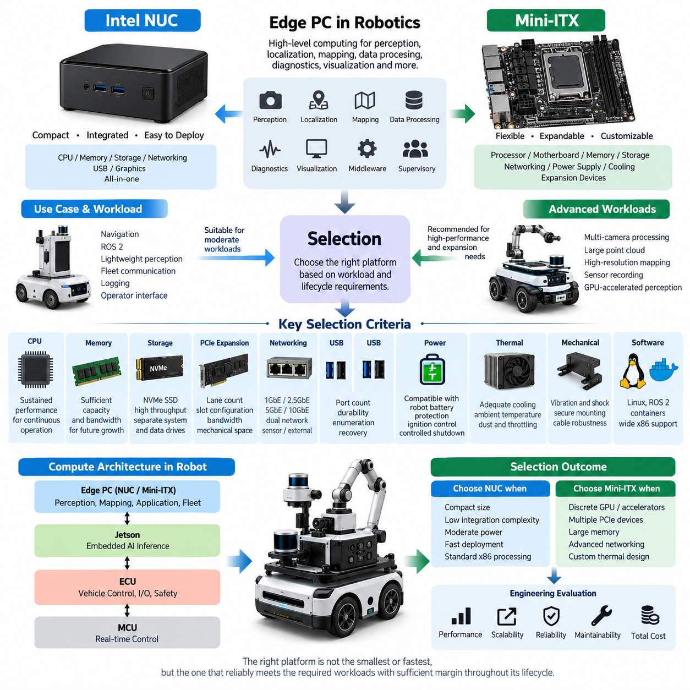
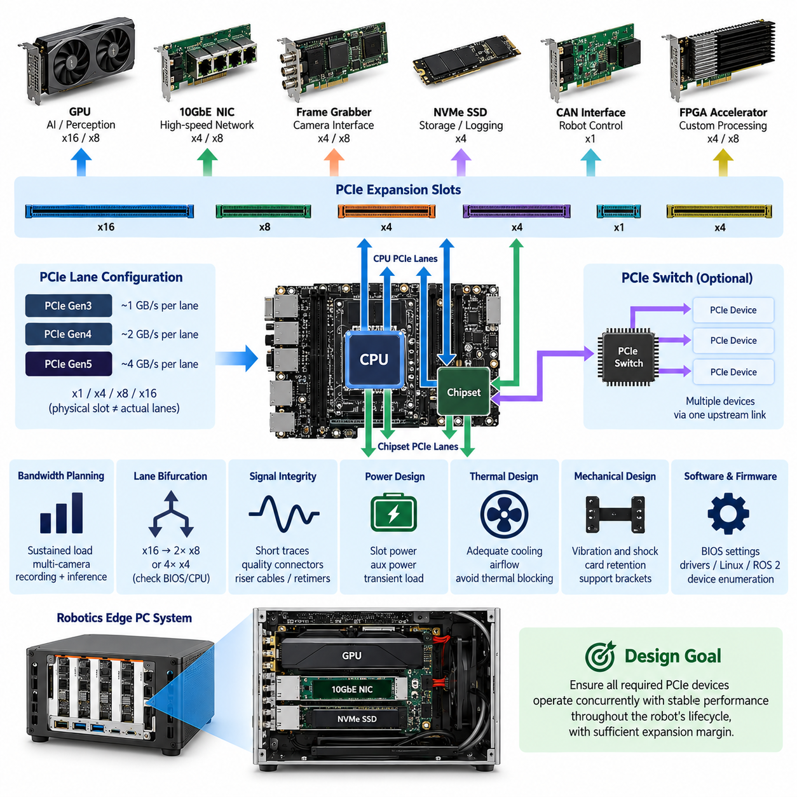
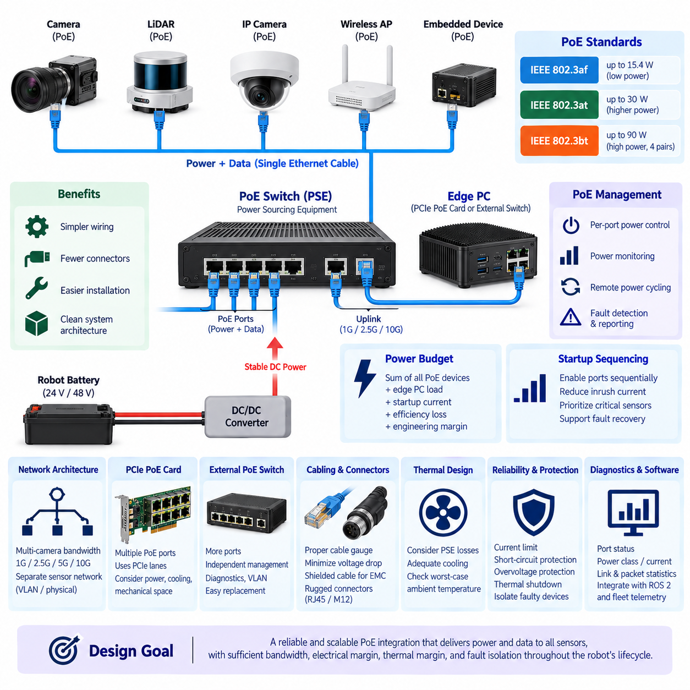
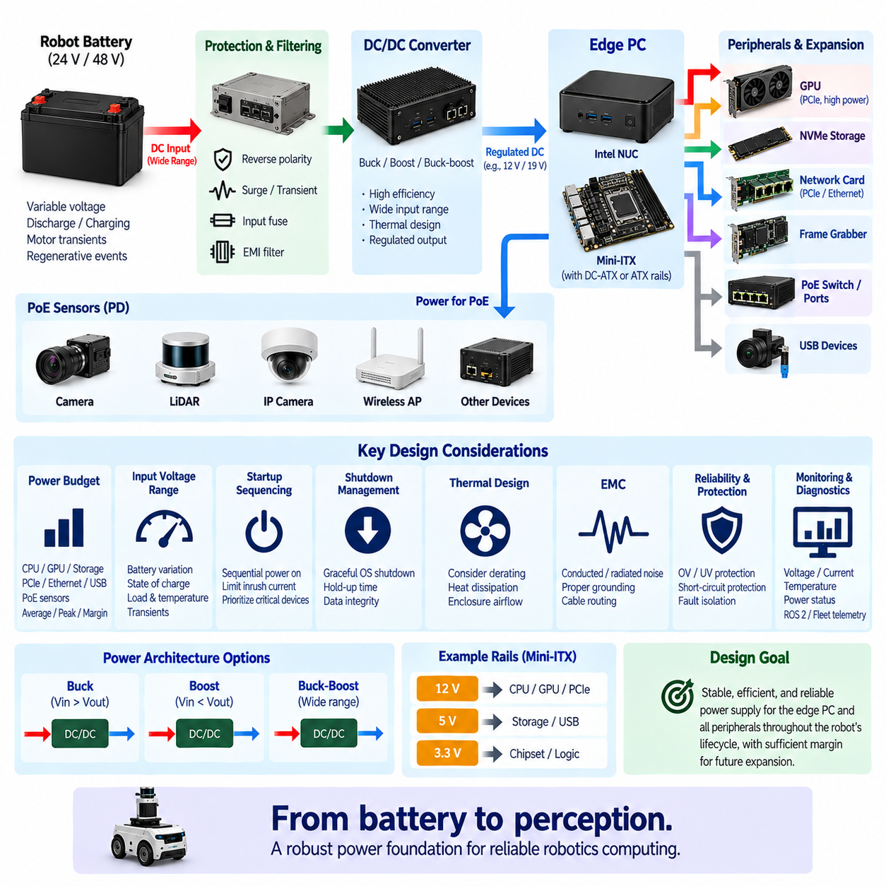
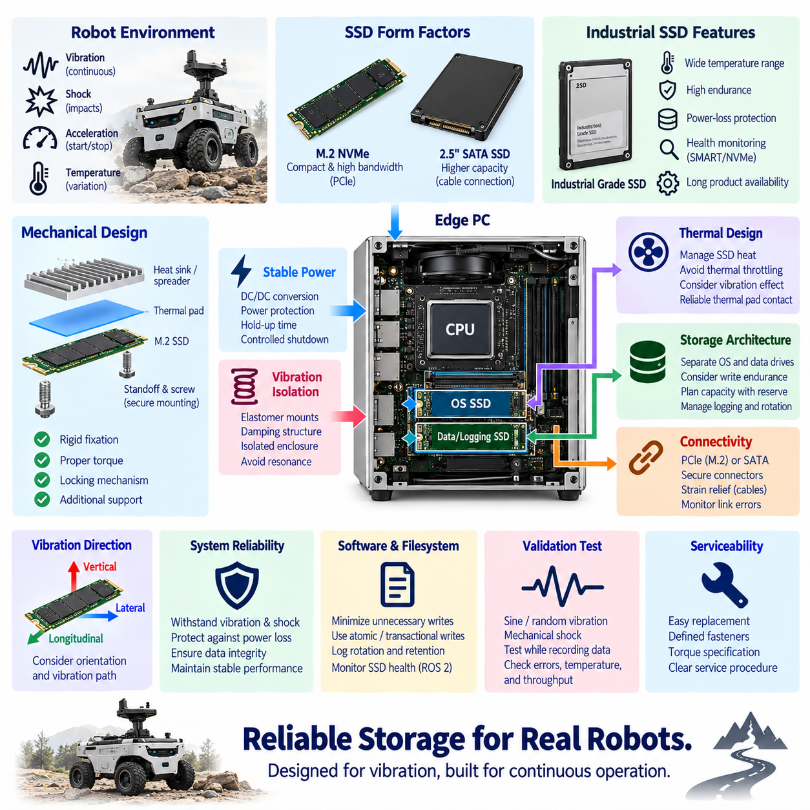

**Volume 16 Compute and AI Architecture**

# Chapter 04. Edge PC

## 04.01. Intel NUC/Mini-ITX Selection

{width="7.268055555555556in" height="7.268055555555556in"}

Selecting an Intel NUC or Mini-ITX platform for a robotics edge PC begins with defining the role of the computer within the overall compute architecture. Unlike an MCU responsible for deterministic control or a Jetson optimized for embedded AI inference, an edge PC typically executes higher-level perception, localization, mapping, data processing, diagnostics, visualization, middleware, and supervisory applications.

Intel NUC-class systems provide a compact and highly integrated computing platform suitable for robots where installation volume, development speed, and software compatibility are major priorities. CPU, memory interfaces, storage, networking, USB connectivity, and graphics functions are integrated into a small enclosure or board-level package. This reduces mechanical integration effort and allows rapid deployment of Linux, ROS 2, containers, and conventional x86 software.

Mini-ITX platforms provide greater architectural flexibility because the processor, motherboard, memory, storage, networking, power supply, cooling system, and expansion devices can be selected independently. The standard 170 × 170 mm motherboard format is larger than most NUC-class solutions, but it offers substantially more freedom for PCIe expansion, high-capacity memory, multiple NVMe devices, discrete GPUs, network adapters, frame grabbers, and specialized robot interfaces.

The first selection criterion should therefore be workload rather than physical size. A robot executing navigation, ROS 2 nodes, lightweight perception, fleet communication, logging, and operator interfaces may operate effectively on a modern NUC-class processor. A system performing multi-camera processing, large point-cloud manipulation, high-resolution mapping, sensor recording, or GPU-accelerated perception may require the higher memory capacity, PCIe bandwidth, and thermal envelope available from Mini-ITX.

Processor selection must consider sustained performance rather than short-duration benchmark results. Robotics workloads frequently execute continuously for many hours while receiving camera, LiDAR, radar, GNSS, and diagnostic data. A processor capable of high turbo frequency may initially appear powerful but can lose performance when enclosure temperature rises. The engineering target should therefore be stable sustained throughput under the expected robot ambient temperature and cooling condition.

Memory capacity and bandwidth strongly influence edge-PC behavior. ROS 2 processes, perception pipelines, SLAM, map databases, containers, visualization tools, and logging services can operate simultaneously and compete for memory. Memory should therefore include sufficient reserve for future software growth. NUC systems are attractive when moderate memory capacity is sufficient, while Mini-ITX platforms are preferable when large memory configurations or multiple high-bandwidth applications are expected.

Storage architecture should be treated as part of the compute design rather than as a secondary component. NVMe SSDs provide high throughput for sensor recording, map access, AI model loading, and software deployment, but sustained recording can generate significant thermal load and write endurance requirements. Where large datasets are continuously collected, separate system and data drives can reduce contention and simplify maintenance, recovery, and replacement procedures.

PCIe capability represents one of the most important differences between compact NUC systems and Mini-ITX architectures. Robotics platforms may require additional Ethernet controllers, CAN interfaces, GPU accelerators, GMSL frame grabbers, high-speed storage, or specialized acquisition cards. If these devices are expected during the product lifecycle, the available PCIe lane count, slot configuration, generation, bandwidth allocation, and mechanical clearance should be evaluated before motherboard selection.

Network architecture is equally important because an edge PC frequently becomes the aggregation point for high-bandwidth sensors. Multiple Gigabit Ethernet cameras, 3D LiDARs, external compute modules, and fleet communication links can create substantial traffic. Dual Ethernet interfaces are useful for separating sensor and external networks, while 2.5GbE, 5GbE, or 10GbE may become necessary when several high-data-rate devices operate concurrently.

USB connectivity can simplify prototype integration, but production robots should evaluate connector retention, cable robustness, enumeration behavior, and recovery after transient power events. USB cameras, GNSS receivers, development interfaces, and diagnostic devices are convenient during engineering, yet critical production sensors may benefit from Ethernet, automotive interfaces, or mechanically secured industrial connectors. Port count alone is therefore not a sufficient selection criterion.

Power architecture must be evaluated together with the robot battery system. Commercial NUC products often expect regulated DC adapters, whereas a mobile robot can expose the computer to battery variation, motor-induced transients, regenerative events, startup disturbances, and abrupt shutdown conditions. The selected platform should therefore be combined with an appropriate regulated power stage, protection circuit, ignition control, and controlled shutdown strategy.

Thermal design determines whether theoretical compute capability can be maintained in the field. NUC systems achieve compact packaging through tightly integrated cooling, while Mini-ITX allows larger heat sinks, fans, ducts, and chassis-level airflow. Robots operating outdoors, inside sealed compartments, or near motors and power electronics require analysis of ambient temperature, internal heat recirculation, dust accumulation, fan degradation, and thermal throttling.

Mechanical reliability is another distinction between consumer-oriented PCs and robot-grade edge computers. Mobile platforms introduce vibration, shock, repeated acceleration, connector movement, and continuous mechanical excitation. Memory modules, NVMe devices, PCIe cards, heat sinks, and cables must remain secure throughout the operating life. Mini-ITX provides greater packaging freedom, but that freedom also transfers more responsibility for structural retention and vibration engineering to the system designer.

Software compatibility is a major advantage of x86 edge PCs. Standard Linux distributions, ROS 2 packages, development tools, virtualization technologies, container runtimes, databases, visualization software, and many industrial SDKs are readily available. This makes NUC and Mini-ITX platforms particularly useful as integration computers positioned between embedded real-time controllers and specialized AI accelerators within a heterogeneous robot computing architecture.

A NUC is generally appropriate when compact packaging, low integration complexity, moderate power consumption, rapid software deployment, and conventional x86 processing are dominant requirements. Mini-ITX becomes more attractive when the robot requires discrete acceleration, several PCIe devices, large memory, multiple storage devices, advanced networking, or customized thermal engineering. The decision should therefore reflect expansion requirements across the complete product lifecycle rather than only the first prototype.

The edge PC should also be selected in relation to adjacent compute layers. MCU and ECU devices should retain deterministic motor, actuator, safety, and low-level I/O responsibilities, while Jetson-class processors can execute specialized embedded AI workloads. The x86 edge PC can then provide orchestration, high-level perception, mapping, logging, diagnostics, application services, and interfaces to fleet or on-premise infrastructure.

For Physical AI robots, this heterogeneous allocation becomes increasingly important because perception and intelligent behavior may evolve faster than the underlying control electronics. A modular Mini-ITX architecture provides substantial upgrade freedom, whereas a NUC provides compactness and deployment simplicity. Maintaining clear interfaces between control, AI acceleration, edge computing, and network services allows individual compute elements to evolve without redesigning the entire electrical architecture.

Final selection should therefore be based on a balanced engineering matrix covering CPU performance, memory, PCIe expansion, Ethernet bandwidth, storage capacity, power consumption, thermal margin, mechanical robustness, software compatibility, maintainability, lifecycle availability, and total integration cost. The preferred platform is not necessarily the smallest or fastest computer, but the one that sustains the required robot workloads with sufficient environmental and expansion margin throughout its intended service life.

## 04.02. PCIe Expansion Design

{width="7.268055555555556in" height="7.268055555555556in"}

PCIe expansion design in a robotics edge PC determines how high-performance peripherals share the processor's available communication resources. Devices such as discrete GPUs, high-speed Ethernet adapters, frame grabbers, CAN interfaces, NVMe storage, FPGA accelerators, and specialized sensor acquisition cards may all depend on PCI Express. The expansion architecture must therefore be planned as a system-level resource rather than treated simply as a collection of available slots.

PCI Express operates through point-to-point serial links composed of one or more lanes. Common configurations include x1, x2, x4, x8, and x16, with each generation increasing the transfer capability of an individual lane. A physical x16 connector does not necessarily provide sixteen electrically active lanes, so motherboard specifications must be examined carefully. Mechanical connector size, electrical lane allocation, PCIe generation, and actual processor connectivity are separate design parameters.

The first engineering step is to construct a PCIe resource map for the complete edge computer. Every planned device should be associated with its required lane width, PCIe generation, expected sustained bandwidth, latency sensitivity, and physical connector. The designer must then identify whether each interface originates directly from the CPU, from the platform chipset, or through a PCIe switch. This mapping reveals potential bottlenecks that may remain invisible when only individual slot specifications are considered.

CPU-direct PCIe connectivity is generally preferred for devices requiring high throughput or predictable latency. A discrete GPU used for perception or AI acceleration may require an x8 or x16 connection, while high-speed frame grabbers and network adapters can consume additional x4 or x8 resources. Chipset-connected devices may share an upstream link to the processor, meaning several apparently independent interfaces can compete for the same aggregate bandwidth when operating simultaneously.

Bandwidth planning should use realistic sustained traffic rather than theoretical peak interface ratings alone. Multi-camera systems can continuously transfer image streams, 3D LiDAR processing can generate substantial memory traffic, and sensor recording can write large datasets to NVMe storage while perception algorithms access the same data. PCIe utilization must therefore be evaluated under concurrent operation, particularly during worst-case recording, inference, visualization, and network transmission scenarios.

PCIe generation selection influences both bandwidth and implementation margin. Newer generations provide more bandwidth per lane, allowing an x4 interface to carry workloads that previously required wider connections. However, higher signaling rates also increase sensitivity to PCB routing, connector quality, riser cables, adapters, and signal loss. The newest generation is therefore not automatically the best choice when the required bandwidth can be achieved reliably using a lower generation with greater implementation margin.

Lane bifurcation allows a wider PCIe interface to be divided into several smaller interfaces when the processor and BIOS support the required configuration. For example, an x16 resource may potentially be organized as two x8 links or four x4 links. This can be valuable in robotics systems requiring several accelerators or NVMe devices, but bifurcation support must be verified at the CPU, motherboard, firmware, connector, and operating-system levels rather than assumed from the physical slot alone.

A PCIe switch can expand connectivity when the number of required endpoints exceeds the directly available root-port resources. Multiple downstream devices can communicate through one upstream PCIe connection, improving architectural flexibility and enabling modular expansion. The switch does not create additional processor bandwidth, however. If several downstream devices simultaneously generate heavy traffic, their combined throughput remains constrained by the upstream connection and switch architecture.

Discrete GPU integration requires more than allocating a sufficiently wide slot. The design must consider GPU dimensions, cooling airflow, auxiliary power connectors, peak electrical load, structural retention, and access to neighboring slots. In compact Mini-ITX systems, a dual-slot or larger GPU can physically block other interfaces even when sufficient PCIe lanes remain logically available. Electrical architecture and mechanical packaging must therefore be developed together.

High-speed Ethernet expansion can also become a major PCIe consumer. Multi-port 2.5GbE, 10GbE, or faster network adapters may aggregate cameras, LiDARs, storage, or external compute nodes. Their required PCIe bandwidth should include simultaneous traffic across all active ports rather than the nominal speed of only one connection. Network processing overhead, DMA behavior, packet rates, interrupt handling, and CPU affinity can further influence actual system performance.

Frame grabbers are particularly important when an edge PC receives multiple industrial or automotive camera streams. Depending on the camera architecture, PCIe cards may provide GMSL, FPD-Link, CoaXPress, or other specialized interfaces and transfer captured data directly into system memory. Their lane allocation should be evaluated together with GPU and memory traffic because perception pipelines can create continuous data movement from camera input through host memory toward acceleration hardware.

NVMe storage commonly uses PCIe x4 connectivity and can consume significant bandwidth during high-rate sensor logging. Multiple NVMe drives may be desirable to separate the operating system, applications, maps, AI models, and recorded sensor datasets. Designers should determine whether M.2 sockets use dedicated processor lanes or chipset resources and whether populating particular sockets disables SATA ports, reduces expansion-slot width, or changes the electrical configuration of other interfaces.

Direct memory access, or DMA, is fundamental to efficient high-throughput robotics computing. PCIe peripherals can transfer data without requiring the CPU to copy every block explicitly, reducing processor overhead and improving pipeline efficiency. Advanced architectures may further minimize unnecessary memory movement between acquisition devices, host memory, storage, and accelerators. The practical benefit depends on hardware, drivers, operating systems, and application frameworks supporting the required data-transfer path.

Interrupt architecture also affects PCIe system behavior. High-rate network, storage, and acquisition devices can generate substantial interrupt activity if drivers and queues are poorly configured. Modern devices commonly use MSI or MSI-X to distribute interrupt handling across processor cores, but system tuning may still be necessary. CPU affinity, receive queues, DMA buffers, and real-time task placement should be coordinated so peripheral traffic does not interfere with latency-sensitive robot functions.

Signal integrity becomes increasingly important when PCIe connections extend beyond short motherboard traces. Riser cards, flexible cables, backplanes, docking structures, and custom carrier boards introduce insertion loss, impedance discontinuities, reflections, and additional connectors. High-generation PCIe links may require careful channel budgeting or retimers. A robotics enclosure should therefore avoid unnecessarily long expansion paths and validate the complete electrical channel under realistic temperature and mechanical conditions.

Power delivery must be designed for both steady-state and transient loads of expansion devices. PCIe slots provide standardized power, but GPUs, accelerators, and specialized acquisition cards may require additional supply connectors. Robot battery variation and DC/DC converter behavior must be considered when several devices change processing states simultaneously. Adequate converter capacity, distribution protection, connector rating, grounding, and controlled startup sequencing help prevent instability during peak compute activity.

Thermal interaction between PCIe devices can become a system-level limitation before electrical bandwidth is exhausted. GPUs, high-speed network controllers, NVMe devices, PCIe switches, and frame grabbers may all dissipate heat in a compact enclosure. Airflow blocked by one large card can increase the temperature of neighboring components. Thermal design should therefore evaluate simultaneous worst-case workloads and maintain sufficient cooling margin without relying solely on component-level thermal specifications.

Mechanical robustness is essential for PCIe expansion in mobile robots because standard desktop cards were not necessarily designed for continuous vibration and shock. Heavy GPUs and tall expansion cards can impose significant loads on motherboard connectors. Brackets, card retainers, support frames, cable strain relief, and vibration-resistant mounting should be incorporated so that the motherboard slot is not the only structural support for an expansion device.

Firmware and software compatibility must be verified before finalizing the hardware architecture. BIOS settings can affect lane bifurcation, PCIe generation, resizable address space, power management, and device enumeration. Linux kernel support, ROS 2 integration, vendor drivers, CUDA or accelerator software, network drivers, and firmware versions should be validated as a complete configuration. Hardware compatibility without stable driver support does not constitute a production-ready robotics platform.

A robust PCIe expansion design therefore combines lane allocation, bandwidth analysis, topology, signal integrity, power, cooling, mechanical retention, firmware, and software into one coordinated architecture. Expansion margin should also be reserved for future sensors or accelerators. The objective is not to populate the maximum number of PCIe devices, but to ensure that every required device can operate concurrently at predictable performance throughout the robot's intended lifecycle.

## 04.03. PoE Integration

{width="7.268055555555556in" height="7.268055555555556in"}

Power over Ethernet integration allows a robotics edge PC to deliver network communication and electrical power through the same Ethernet cable. This is especially useful for distributed sensors such as industrial cameras, IP cameras, compact LiDAR units, wireless access points, and auxiliary embedded devices. By combining power and data, PoE can reduce harness complexity, connector count, installation effort, and the number of separate DC power branches required throughout the robot.

A PoE architecture contains power sourcing equipment, or PSE, and one or more powered devices, or PDs. The edge PC, PoE switch, or dedicated PoE network interface typically operates as the PSE, while cameras and other sensors operate as PDs. Before power is applied, standardized detection and classification procedures allow the PSE to determine whether the connected endpoint supports PoE and how much electrical power it may require.

IEEE 802.3af, 802.3at, and 802.3bt represent major PoE power classes used in practical systems. IEEE 802.3af supports relatively low-power endpoints, while 802.3at provides a higher power budget for devices such as advanced cameras. IEEE 802.3bt extends power delivery by using all four Ethernet pairs and supports substantially higher-power devices. Platform selection should therefore begin by identifying the PoE standard and maximum input requirement of every planned sensor.

The total PoE power budget is more important than the maximum rating of an individual port. A four-port interface may technically support high power on each connector while being unable to provide the maximum simultaneously to all ports. Robotics engineers should calculate the sum of worst-case PD consumption and include startup behavior, heater operation, illumination, actuator functions, environmental conditions, conversion losses, and appropriate engineering margin.

PoE can simplify camera architecture significantly. A conventional Ethernet camera may require one cable for communication and another pair of wires for DC power, increasing harness size and connector complexity. A PoE camera can use one Ethernet cable between the sensor and edge computer or switch. This becomes particularly valuable when several cameras are distributed around an AMR, inspection robot, mobile manipulator, or outdoor autonomous platform.

However, PoE does not eliminate the need for robot-level power engineering. The PSE ultimately receives energy from the robot battery through a DC/DC conversion and protection architecture. The battery voltage may vary with state of charge, acceleration, regenerative events, charging, or transient loads. The PoE subsystem must therefore be supplied from a stable electrical rail capable of maintaining the required output under worst-case robot operating conditions.

DC/DC converter sizing should include the edge PC load and the complete PoE load if both share the same power source. A system containing several cameras can experience a meaningful increase in electrical demand when all PDs become active simultaneously. Converter efficiency and thermal derating should also be considered because the input power required from the battery is greater than the useful power delivered to the remote PoE devices.

Startup sequencing can prevent excessive inrush current and improve system stability. Instead of enabling every PoE sensor immediately when the edge PC starts, ports can be activated sequentially where supported by the PSE hardware and software. This reduces simultaneous startup demand and allows critical sensors to receive priority. Controlled sequencing can also support fault recovery by restarting an individual sensor without rebooting the entire robot computer.

Per-port power control is a valuable feature in autonomous robots. A camera or network sensor that becomes unresponsive can sometimes be recovered by disabling and re-enabling its PoE supply remotely. When supported by the network controller or managed PoE switch, software can monitor device health and perform selective power cycling. This creates an additional recovery mechanism beyond application restart, driver reload, or complete system reboot.

Network bandwidth must be evaluated independently from the PoE power budget. Supplying sufficient electrical power does not guarantee adequate communication performance. Multiple high-resolution cameras can generate sustained Ethernet traffic that exceeds a 1GbE uplink even though every PoE port remains within its electrical rating. The architecture must therefore calculate both aggregate sensor data rate and aggregate electrical consumption as separate design dimensions.

A multi-camera edge PC may use several independent Ethernet interfaces or a PoE switch connected through a higher-speed uplink. For example, sensor-side Gigabit Ethernet connections can be aggregated into 2.5GbE, 5GbE, or 10GbE connectivity toward the edge computer. The appropriate topology depends on camera resolution, frame rate, compression, synchronization, recording requirements, and whether raw or processed data must traverse the network continuously.

PCIe PoE network cards provide a compact method of integrating multiple powered Ethernet ports directly into a Mini-ITX or industrial edge PC. Such cards combine Ethernet communication and PSE functionality but introduce PCIe lane, power, cooling, and mechanical requirements. Their aggregate network bandwidth and PoE output should be evaluated together with GPUs, frame grabbers, NVMe storage, and other PCIe devices in the complete expansion architecture.

An external managed PoE switch provides a different integration strategy. It can separate sensor networking from the edge PC motherboard and may offer more ports, independent power management, diagnostics, VLAN configuration, and easier replacement. The tradeoff is additional enclosure volume, power conversion, cabling, thermal dissipation, and another electronic module that must be mechanically secured and qualified for the robot environment.

Network segmentation improves reliability and security when PoE sensors form a dedicated perception network. Cameras and LiDAR devices can be isolated from fleet communication, maintenance access, cloud connectivity, and other external networks using separate physical interfaces or VLANs. This prevents unrelated traffic from competing directly with perception data and provides clearer boundaries for diagnostics, cybersecurity policies, and fault containment.

Cable selection affects both data integrity and power delivery. Ethernet conductors carry current while simultaneously transporting high-speed differential signals, so conductor resistance, cable length, temperature, bundling, shielding, and connector quality influence system performance. Excessive resistance increases voltage drop and cable heating. In compact robot harnesses, thermal effects can become more significant when multiple PoE cables are routed together through confined passages.

Shielded Ethernet can improve electromagnetic compatibility in electrically noisy robotic platforms, but shielding must be integrated with a deliberate grounding strategy. Motors, inverters, DC/DC converters, switching supplies, and high-current battery wiring can generate significant electromagnetic interference. Cable routing should maintain appropriate separation from noisy power circuits, while shield termination and chassis bonding should be designed to avoid unintended ground-current paths.

Connector robustness deserves particular attention because standard RJ45 connectors were primarily developed for stationary networking environments. Continuous vibration, shock, pulling forces, moisture, and repeated service operations can reduce connection reliability in mobile robots. Industrial locking Ethernet connectors, ruggedized RJ45 solutions, M12 Ethernet connectors, or protected internal mounting may be more appropriate depending on environmental and maintenance requirements.

Thermal design must include losses generated by the PSE electronics. Delivering tens or hundreds of watts to external devices requires switching and power-management components that dissipate heat inside the edge PC or PoE switch. A system may therefore remain within CPU and GPU temperature limits while the PoE circuitry approaches its own thermal limit. Worst-case analysis should include maximum sensor power, elevated ambient temperature, and reduced airflow.

Fault protection should prevent a damaged cable or sensor from disabling the complete perception system. Individual port current limiting, short-circuit protection, overvoltage protection, thermal shutdown, and fault reporting can isolate abnormal endpoints. Where mission requirements justify it, critical cameras may be distributed across separate PoE controllers or power domains so that a single PSE failure does not remove all visual perception capability simultaneously.

Software monitoring can transform PoE from a simple power-delivery mechanism into part of the robot diagnostic architecture. The system can record port state, negotiated power class, current consumption, link status, packet statistics, sensor availability, and recovery attempts. These measurements can be correlated with ROS 2 diagnostics and fleet telemetry, helping maintenance teams distinguish between sensor faults, cable failures, network congestion, and power-related problems.

PoE integration should therefore be designed simultaneously with Ethernet topology, PCIe expansion, edge-PC power supply, thermal management, harness routing, grounding, diagnostics, and mechanical packaging. Its primary value is not merely eliminating a power cable. Properly engineered PoE creates a modular sensor interface in which communication, power distribution, monitoring, isolation, and recovery can be managed as one coordinated subsystem.

For a production robotics platform, the preferred PoE solution is the architecture that supplies every required sensor under worst-case conditions while preserving network bandwidth, electrical margin, thermal margin, and fault isolation. Adequate reserve should remain for future cameras or sensors. This allows the edge PC and perception network defined within the broader compute architecture to evolve without requiring a complete redesign of the robot wiring and power-distribution system.

## 04.04. Edge PC Power Supply

{width="7.268055555555556in" height="7.268055555555556in"}

An edge PC power supply in a robotics platform must convert the robot's variable battery energy into stable electrical rails for processors, memory, storage, network interfaces, PCIe devices, and auxiliary peripherals. Unlike a stationary desktop computer connected to a regulated AC source, a mobile robot experiences battery discharge, charging, motor transients, regenerative events, connector disturbances, and abrupt operating-state changes. Power architecture must therefore be designed as part of the compute system itself.

The power design begins with the robot battery architecture and the acceptable input range of the edge PC. A nominal 24 V or 48 V battery does not remain at exactly that voltage throughout operation. Its terminal voltage changes with state of charge, battery chemistry, load current, temperature, charging condition, and transient behavior. The DC/DC conversion stage must maintain regulated output across the complete expected battery-voltage envelope rather than only at the nominal value.

Power budgeting should represent realistic simultaneous workloads. CPU processing, GPU acceleration, NVMe recording, PCIe communication, Ethernet traffic, USB peripherals, cooling fans, and PoE sensors can become active at the same time. The design should distinguish average consumption from sustained maximum and short-duration peak demand. Converter capacity based only on typical CPU power can become insufficient when several high-performance subsystems enter their maximum operating states simultaneously.

Engineering margin is necessary because the compute configuration can evolve during the robot lifecycle. Additional memory, storage, network adapters, sensors, or accelerators may increase consumption after the original design has been released. A power supply operated continuously near its maximum rating also has limited tolerance for elevated temperature and transient loads. Appropriate reserve capacity improves reliability while reducing the probability that future upgrades require redesign of the complete power subsystem.

DC/DC converter topology depends on the relationship between battery voltage and the edge PC input requirement. A buck converter is appropriate when the source always remains above the required output, while boost conversion is used when voltage must be increased. A buck-boost architecture can maintain a regulated output when the battery range may move above or below the target voltage. Efficiency, transient response, isolation, thermal performance, and electromagnetic compatibility must be evaluated together.

An Intel NUC-class computer may accept a relatively wide external DC input, whereas a Mini-ITX architecture can require ATX-style internal rails or a dedicated DC-ATX converter. Mini-ITX integration may therefore involve regulated input followed by generation of motherboard rails such as 12 V, 5 V, and 3.3 V. The exact architecture should follow the motherboard and peripheral requirements rather than assuming that conventional desktop power arrangements are suitable for a mobile robot.

PCIe expansion can substantially change the power architecture. A discrete GPU, high-speed network card, frame grabber, FPGA accelerator, or additional NVMe storage can increase both continuous and transient demand. Some devices draw power entirely from the PCIe connector, while others require auxiliary power connections. The edge PC supply must therefore be sized from the complete installed hardware configuration and include realistic expansion assumptions for the intended product lifecycle.

PoE integration introduces another major load because the edge computer or associated PoE switch may provide electrical energy to distributed cameras and sensors. The input power required by the PoE subsystem includes the consumption of all powered devices plus conversion and cable losses. When edge computing and PoE share a DC/DC converter, their combined worst-case demand must be included so that sensor activation does not destabilize the computer supply.

Transient behavior is especially important in mobile robots. Motors, steering actuators, pumps, manipulators, contactors, and other high-current loads can cause rapid changes in battery voltage. Regenerative braking or inductive switching can introduce opposite-polarity or overvoltage disturbances depending on the electrical architecture. Input filtering, transient suppression, adequate capacitance, and correctly selected protection components help prevent these disturbances from propagating into sensitive computing electronics.

Undervoltage behavior must be intentionally defined. If the battery voltage falls below the converter's stable operating region, allowing the edge PC to repeatedly reset can corrupt storage or create unpredictable robot behavior. The power controller should detect approaching undervoltage and coordinate a controlled response. Depending on system requirements, this can include reducing compute load, disabling noncritical peripherals, notifying supervisory software, or initiating an orderly operating-system shutdown.

Overvoltage protection provides a complementary defense against charging faults, regenerative events, wiring errors, and transient disturbances. Protection may include transient-voltage suppressors, surge suppression, input clamps, or controlled disconnect devices. The protection threshold must remain above legitimate operating voltage while staying below levels that could damage downstream electronics. Coordination between battery protection, PDU protection, DC/DC conversion, and edge-PC input protection avoids unnecessary duplication or protection gaps.

Reverse-polarity protection is valuable during manufacturing, maintenance, and field service because incorrect connection can immediately damage sensitive electronics. MOSFET-based protection can provide lower loss than a conventional series diode in higher-current systems. Input fusing or electronic circuit protection should also isolate a failed edge PC or converter from the rest of the robot power network while being coordinated with upstream protection devices.

Inrush current requires attention because an edge PC can contain substantial input capacitance. When power is first connected, charging these capacitors may produce a short high-current pulse that stresses connectors, relays, DC/DC converters, or battery protection circuits. Soft-start, pre-charge, current limiting, or staged power sequencing can reduce this effect. The appropriate solution depends on system capacitance, source impedance, switching devices, and allowable startup time.

Startup sequencing determines how computing and peripheral devices enter operation. The edge PC may be powered before cameras, PoE devices, storage modules, or external accelerators, allowing the operating system and monitoring services to initialize first. Critical localization and safety-related support devices can then receive priority over nonessential peripherals. Controlled sequencing reduces peak startup demand and provides a repeatable system initialization process for diagnostics and validation.

Shutdown management is equally important because abruptly removing power from a Linux-based edge PC can interrupt filesystem operations, database transactions, map updates, sensor logs, or AI model files. A power-management controller can detect ignition-off or shutdown requests and provide sufficient hold-up time for the operating system to terminate applications and synchronize storage. The main compute rail should be removed only after software confirms completion or a defined timeout expires.

Hold-up energy can be provided by input capacitance, a dedicated backup supply, or a small UPS architecture depending on required shutdown duration. The objective is generally not to operate the robot computer for an extended period after battery loss, but to provide enough time for safe data handling and controlled termination. Required energy should be calculated from edge-PC consumption, shutdown duration, converter efficiency, and the minimum voltage at which stable operation can be maintained.

Ignition control separates physical battery connection from logical computer operation. A low-power controller can remain active while the main edge PC is off, monitor ignition or robot-state signals, and command the high-power compute supply when required. This architecture enables delayed shutdown, scheduled wake-up, remote maintenance, and recovery functions without requiring the complete computer to remain continuously powered and consuming significant standby energy.

Thermal design and electrical sizing are closely connected because DC/DC converter output capability usually decreases as temperature rises. A converter rated for sufficient power under laboratory conditions may require derating inside a sealed robot enclosure. Efficiency losses become heat that must be removed from the power electronics. Converter location, heat sinking, airflow, enclosure conduction, ambient temperature, and nearby GPU or CPU heat sources must therefore be included in the power design.

Electromagnetic compatibility is another system-level requirement. Switching converters can generate conducted and radiated noise that affects cameras, Ethernet, GNSS, IMU, LiDAR, audio systems, and other sensitive electronics. Input and output filtering, short high-current loops, appropriate grounding, shielding, PCB layout, cable routing, and separation from sensor wiring help control interference. Power integrity and EMC should be validated under realistic compute and motor operating conditions.

Power monitoring improves diagnostics and lifecycle management. Measuring input voltage, current, converter temperature, output status, and accumulated energy consumption allows software to identify abnormal conditions before complete failure occurs. These values can be integrated with ROS 2 diagnostics and fleet telemetry so that engineers can correlate compute resets, thermal events, sensor failures, or performance degradation with actual electrical conditions recorded on the robot.

A robust edge PC power supply therefore combines conversion, protection, sequencing, monitoring, thermal management, EMC, controlled startup, and safe shutdown into one coordinated subsystem. Its objective is not simply to provide the nominal voltage required by the computer. It must maintain stable computing operation despite battery variation, transient loads, peripheral expansion, environmental stress, and abnormal electrical events throughout the robot's service life.

The final architecture should provide sufficient continuous power, transient capability, conversion efficiency, thermal margin, and future expansion reserve while remaining coordinated with the battery, PDU, PoE subsystem, PCIe devices, and compute architecture. A properly engineered supply enables the edge PC to operate as a dependable computing node rather than a consumer computer attached to a robot battery, providing the electrical foundation required for reliable perception, mapping, diagnostics, and Physical AI workloads.

## 04.05. Vibration SSD Design

{width="7.268055555555556in" height="7.268055555555556in"}

Vibration-resistant SSD design for a robotics edge PC must ensure that storage remains electrically, mechanically, and logically reliable while the robot is moving. Unlike stationary computers, mobile robots experience continuous vibration, repeated shocks, acceleration, wheel impacts, structural resonance, and temperature variation. Although solid-state drives contain no rotating disks, their connectors, solder joints, PCB assemblies, mounting structures, and NAND devices still require careful engineering for mobile operation.

The first design decision is the SSD form factor. M.2 NVMe devices provide compact packaging, high bandwidth, and direct PCIe connectivity, making them attractive for NUC, Mini-ITX, and industrial edge computers. However, the long and thin M.2 PCB can experience bending and connector stress under vibration. A mechanically robust design must therefore consider not only storage performance but also board dimensions, mounting points, retention method, mass distribution, and surrounding mechanical structure.

M.2 modules are typically inserted into an edge connector and secured at the opposite end with a small screw or retention mechanism. In a vibrating robot, this mounting arrangement can become a mechanical weak point if the module is unsupported or improperly tightened. Secure fastening, appropriate standoffs, controlled screw torque, locking mechanisms, and additional support can reduce relative movement between the SSD, motherboard, and connector during prolonged operation.

The orientation of the SSD relative to dominant vibration directions can influence mechanical loading. A module positioned where vibration repeatedly bends the PCB may experience greater stress than one aligned with a mechanically favorable axis. The edge-PC chassis, motherboard location, wheel suspension, motor mounting, and robot frame all influence transmitted vibration. Storage placement should therefore be evaluated as part of the complete structural vibration path rather than as an isolated motherboard component.

Vibration isolation can reduce mechanical energy transmitted from the robot chassis into the edge computer. Elastomer mounts, vibration-damping structures, isolation grommets, or suspended trays may be used between the compute enclosure and robot frame. Isolation must be designed carefully because an excessively soft mount can introduce large displacement or create a resonance near dominant excitation frequencies. The objective is controlled attenuation rather than simply maximizing mechanical softness.

Shock loading represents a different condition from continuous vibration. Outdoor AMRs and inspection robots can encounter curbs, joints, potholes, debris, ramps, or accidental impacts that produce short-duration high acceleration. Even if the SSD NAND itself tolerates high shock levels, the motherboard, connector, retention screw, heat sink, and surrounding structure must survive the same event. System qualification should therefore evaluate the assembled compute unit rather than relying only on the SSD component specification.

Industrial-grade SSD selection can provide advantages for robots expected to operate continuously in demanding environments. Such devices may offer wider operating temperature ranges, controlled component sourcing, enhanced endurance, power-loss protection, health monitoring, and longer product availability. These characteristics can be more important than peak benchmark performance because robotics storage frequently performs continuous logging, map access, software execution, database operations, and repeated field-data collection.

NAND flash technology affects endurance, performance, capacity, and cost. Storage used primarily for the operating system and applications has a different write profile from storage used for continuous camera, LiDAR, or diagnostic logging. High-rate sensor recording can consume a significant portion of the drive's write endurance over the robot lifecycle. SSD selection should therefore consider total bytes written, drive writes per day, expected service duration, and realistic field recording behavior.

Separating the system drive from the data-logging drive can improve both reliability and maintainability. The operating system, ROS 2 software, configuration, maps, and AI models can reside on one SSD, while high-volume sensor data is written to another. This prevents continuous logging from consuming the endurance of the system drive and reduces I/O contention. A failed or worn logging drive can also be replaced without rebuilding the complete robot software environment.

NVMe thermal behavior must be considered together with vibration design. High-performance SSD controllers can generate substantial heat during sustained writes, especially when recording multiple cameras or high-rate sensor streams. Thermal throttling can sharply reduce storage throughput and cause logging queues to accumulate. A heat spreader or heat sink can improve sustained performance, but its added mass must be mechanically supported so that vibration does not transfer excessive force into the M.2 connector or SSD PCB.

Thermal interface materials should maintain reliable contact despite vibration, manufacturing tolerance, and repeated temperature cycles. A thermal pad can connect the SSD controller or module to a heat spreader, motherboard shield, or chassis surface. Compression should be controlled so that the pad provides useful thermal conduction without bending the SSD. Mechanical and thermal design must therefore be coordinated instead of independently adding a heavy heat sink after the storage architecture has been completed.

Cable-based storage requires additional consideration when 2.5-inch SATA or externally mounted storage is used. SATA data and power connectors can loosen under repeated vibration if they lack positive retention. Locking connectors, short cables, strain relief, controlled routing, and mechanically secured drives improve reliability. Cable mass should not be allowed to pull continuously on the SSD connector, particularly where the harness is exposed to chassis movement or service access.

NVMe eliminates separate data cables but shifts reliability concerns toward the motherboard connector and PCIe interface. High-speed PCIe signals require stable electrical contact and good signal integrity. Intermittent connector movement can cause link errors, retraining, reduced link width, or device disappearance. Mechanical retention therefore contributes directly to communication reliability, and storage diagnostics should include monitoring for PCIe errors rather than only checking whether the filesystem remains accessible.

Power integrity is critical because vibration-related connector disturbances and robot-level electrical transients can both interrupt SSD operation. An unexpected power loss during metadata updates, database transactions, or filesystem writes can create corruption even when the SSD is mechanically undamaged. Stable DC/DC conversion, adequate local capacitance, controlled shutdown, and appropriate power-loss protection should therefore accompany mechanical vibration engineering.

Power-loss protection is especially valuable for storage containing critical logs, maps, configuration databases, or transactional information. Enterprise or industrial SSDs may include internal energy storage that allows volatile mapping information to be committed safely when input power disappears. This does not replace orderly operating-system shutdown, but it adds another protection layer when a battery disconnect, PDU fault, cable failure, or emergency electrical event removes power unexpectedly.

Filesystem and software architecture also influence storage resilience. Frequent unnecessary writes should be minimized, temporary data can be placed in memory where appropriate, and logging policies should include file rotation and capacity limits. Critical configuration data should be written atomically or with transactional mechanisms. These software measures reduce write amplification and limit the consequences of unexpected interruptions, complementing the mechanical and electrical protections applied to the SSD.

Storage capacity should include operational reserve rather than being sized only for the nominal dataset. Drives approaching full capacity can experience reduced performance and create failures in logging or application services. Sensor-recording systems should maintain controlled free space through retention policies, automatic transfer, or deletion of older datasets. Capacity planning should consider recording rate, mission duration, upload opportunities, maintenance intervals, and the amount of data that must survive communication outages.

SMART and NVMe health information can be integrated into robot diagnostics to detect storage degradation before failure. Useful parameters include temperature, percentage used, available spare capacity, media errors, unsafe shutdown count, power-on hours, data units written, and critical warnings. Monitoring these values through ROS 2 diagnostics or fleet telemetry enables maintenance teams to replace a deteriorating drive before it causes mission interruption or data loss.

Vibration qualification should represent the actual robot environment whenever possible. Laboratory testing can apply defined sinusoidal vibration, random vibration, and mechanical shock profiles, but field measurements provide valuable information about excitation generated by wheels, suspension, motors, road surfaces, manipulators, and structural resonance. Accelerometers mounted near the edge PC can characterize the real vibration spectrum and support more representative qualification conditions.

Validation should be performed while the SSD is actively operating rather than only when the computer is powered off. Sustained writes, reads, sensor logging, PCIe traffic, and thermal loading should continue during vibration and shock testing. Engineers should monitor filesystem errors, NVMe resets, PCIe link events, throughput variation, temperature, and application-level data loss. This combined test exposes interactions that separate mechanical or storage benchmarks may fail to reveal.

Serviceability must also be balanced with retention strength. An SSD that is permanently bonded into the computer may survive vibration but become difficult to replace in the field. A production design should allow controlled replacement using defined fasteners, torque specifications, thermal pads, retention brackets, and verification procedures. Clear service instructions help ensure that vibration resistance achieved during manufacturing is not lost after maintenance.

A robust vibration-resistant SSD architecture therefore combines suitable storage technology, mechanical retention, vibration isolation, thermal management, stable power, controlled shutdown, endurance planning, health monitoring, and realistic validation. The objective is not merely to select an SSD with a high shock specification, but to ensure that the complete storage path remains reliable while the robot continuously computes, records data, and moves through its operating environment.

For robotics edge computing, the preferred storage design maintains stable PCIe or SATA connectivity, sustained write performance, adequate endurance, thermal margin, and data integrity throughout the robot lifecycle. Mechanical mounting and software management are equally important parts of this architecture. When these elements are engineered together, the SSD becomes a dependable foundation for ROS 2 software, maps, AI models, diagnostics, sensor datasets, and long-duration Physical AI operation.
