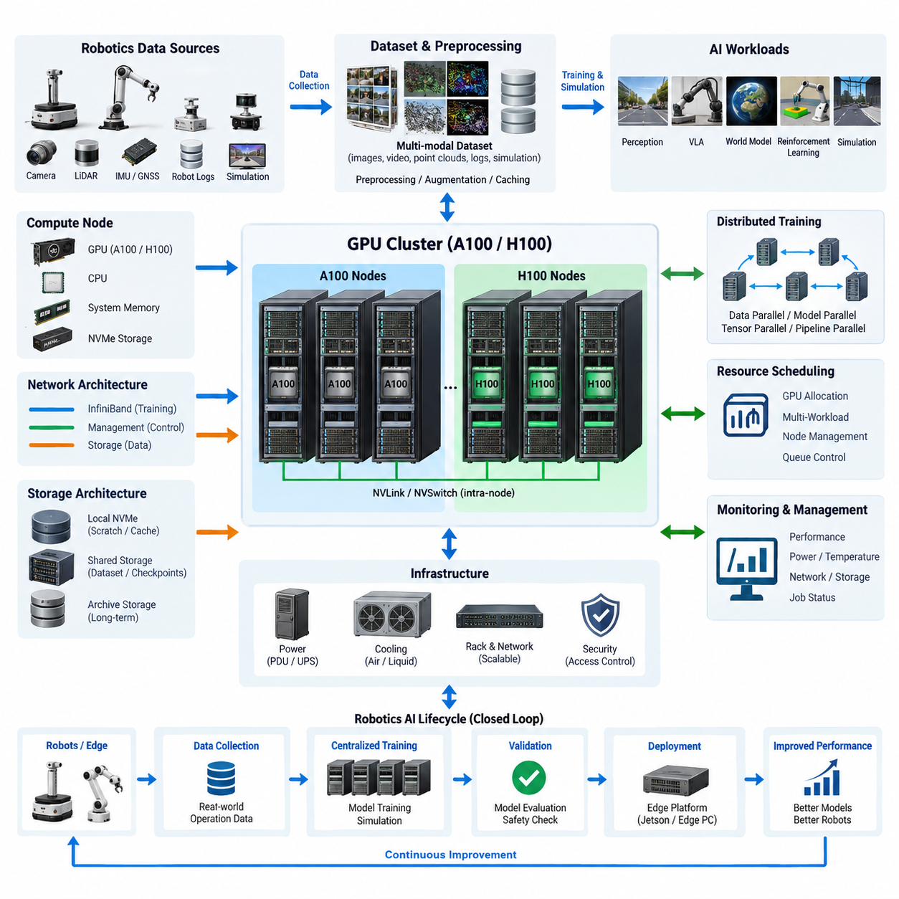
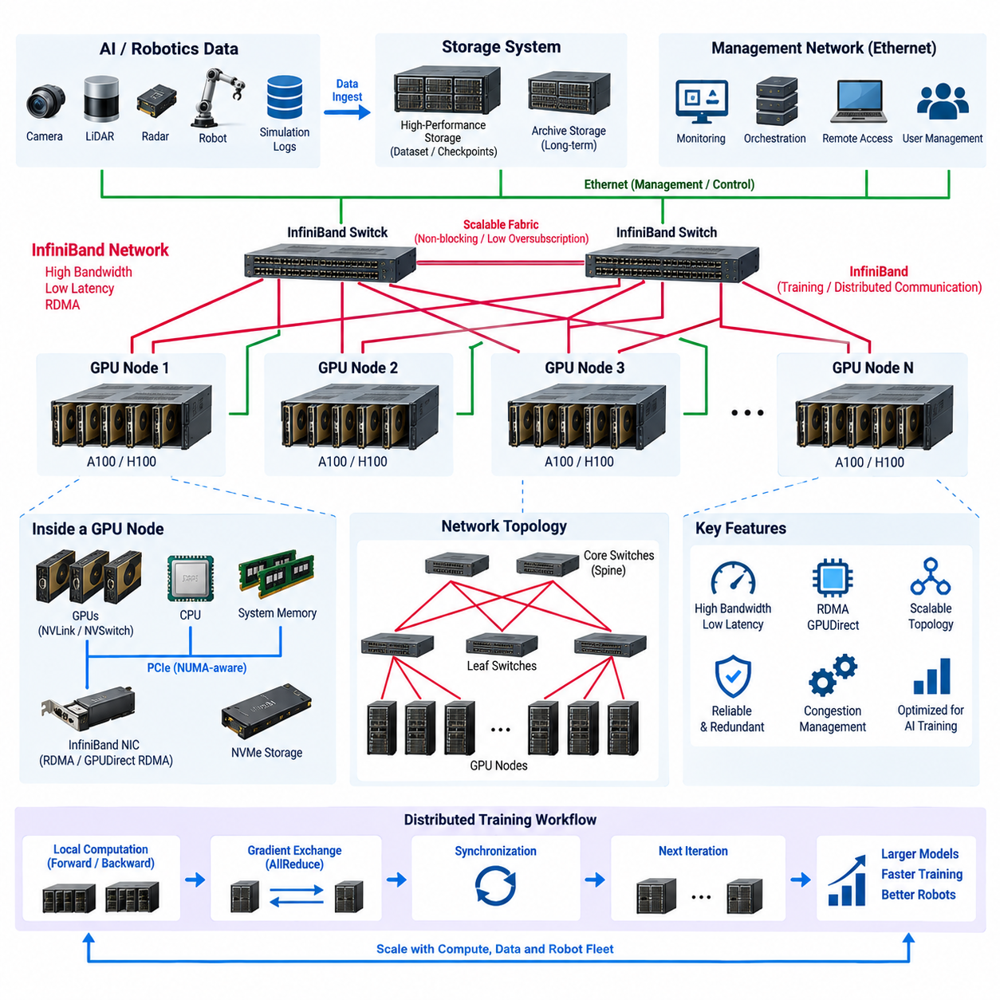
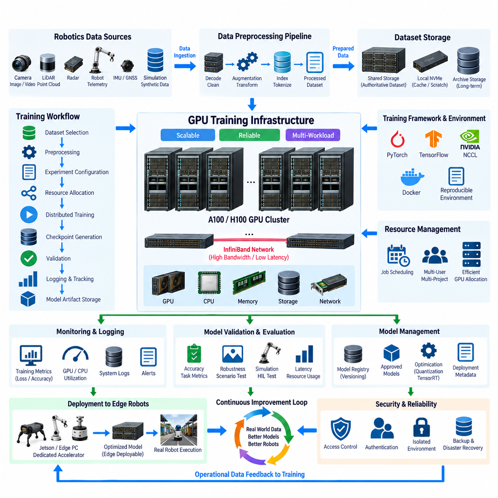
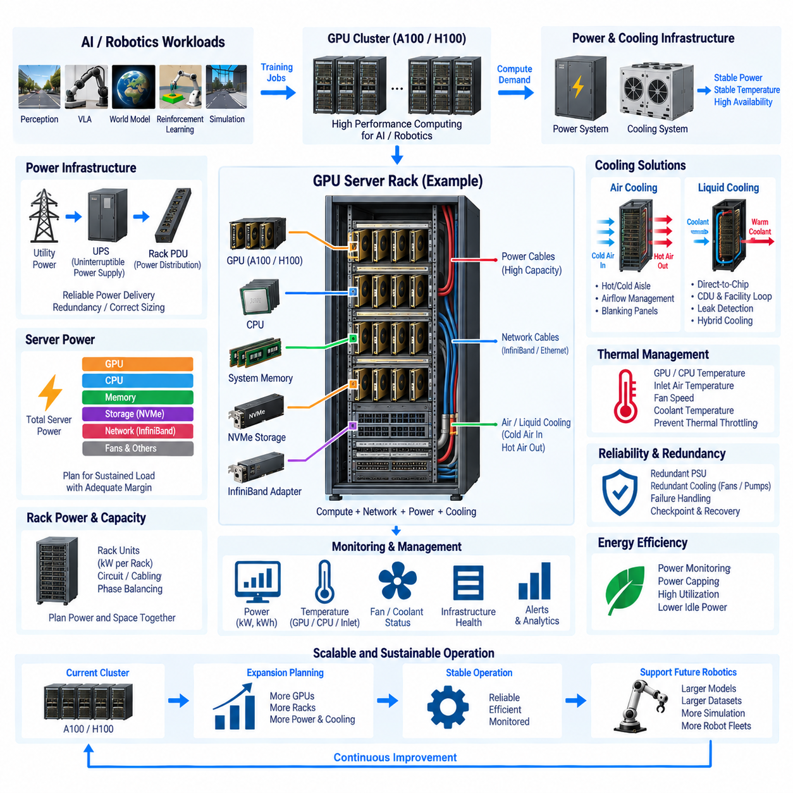
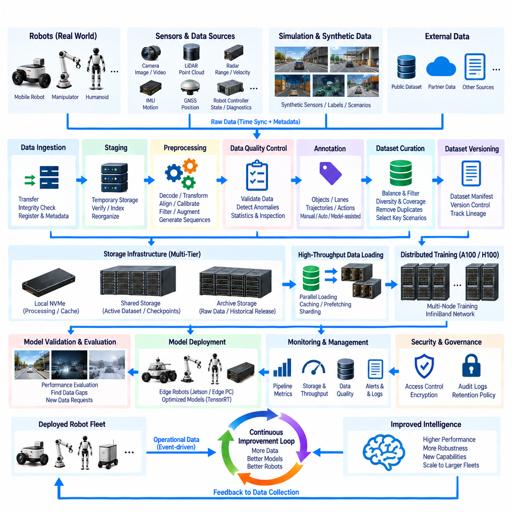

**Volume 16 Compute and AI Architecture**


# Chapter 05. GPU Server

##  

## 05.01. A100/H100 Cluster Design

{width="7.268055555555556in" height="7.268055555555556in"}

GPU clusters based on NVIDIA A100 and H100 accelerators provide the centralized computing foundation required for large-scale AI training, simulation, synthetic data generation, and model optimization in robotics. Within a robotics compute architecture, the cluster complements embedded Jetson platforms and edge PCs by executing workloads whose memory capacity, computational intensity, or training duration exceeds the practical limits of robot-mounted hardware.

A cluster should be designed as a complete computing system rather than as a collection of independent GPU servers. Compute nodes, accelerator topology, CPU resources, system memory, local storage, high-speed networking, shared storage, power distribution, cooling, scheduling, and monitoring must be engineered together. A bottleneck in any one subsystem can prevent expensive GPUs from reaching their expected utilization and significantly increase model development time.

A100 and H100 GPUs represent different generations of data-center acceleration and may coexist during infrastructure evolution. A100 nodes remain effective for many deep-learning, simulation, and data-processing workloads, while H100 nodes provide substantially higher performance for modern transformer-oriented training and large-scale mixed-precision computation. Cluster architecture should therefore classify workloads before assigning them to particular GPU generations.

GPU count alone is not a sufficient measure of cluster capability. Memory capacity per GPU, memory bandwidth, tensor computation capability, inter-GPU communication, host-to-device transfer performance, and workload scalability collectively determine useful performance. Large vision models, vision-language-action models, world models, multimodal foundation models, and high-resolution perception networks can place very different demands on these resources.

Inside a multi-GPU server, high-bandwidth GPU interconnection is essential because distributed training repeatedly exchanges parameters, gradients, activations, and synchronization information. NVLink and NVSwitch-based configurations reduce communication overhead compared with architectures that depend primarily on conventional PCIe paths. The objective is to make several physical GPUs behave as efficiently as possible as one tightly coupled computational domain.

The cluster network extends this communication domain across multiple servers. When a training job spans several nodes, network latency and bandwidth become part of the training critical path. High-speed InfiniBand or comparable low-latency fabrics are therefore normally separated from ordinary management Ethernet. This allows distributed GPU traffic to operate without competing with administration, monitoring, software deployment, and general storage-management communication.

A practical design separates networks according to their functions. A management network handles operating-system access, orchestration, monitoring, and administrative traffic, while a high-performance fabric carries distributed training communication. Storage traffic may use an additional dedicated path where dataset throughput is substantial. Such separation improves predictability and simplifies diagnosis when performance degradation occurs during large training jobs.

CPU and system-memory sizing must support the accelerators rather than merely satisfy minimum server requirements. CPUs execute data loading, preprocessing, augmentation, decompression, orchestration, and portions of simulation workloads. Insufficient CPU cores or memory bandwidth can leave GPUs waiting for input. Large host memory is also valuable for dataset caching, simulation processes, preprocessing pipelines, and workloads involving extensive metadata.

Storage architecture should be hierarchical. High-performance local NVMe storage provides temporary datasets, caches, checkpoints, and scratch space close to each compute node. Shared high-capacity storage maintains authoritative datasets, experiment outputs, model artifacts, and reusable training resources. Archival storage can preserve historical datasets and validated model versions without consuming the highest-performance storage tier.

Robotics workloads make storage design particularly demanding because training data is highly multimodal. Camera images and video, LiDAR point clouds, radar measurements, GNSS and IMU streams, robot telemetry, ROS bags, simulation outputs, annotations, and synthetic datasets may be consumed simultaneously. The data pipeline must deliver these streams quickly enough that accelerator utilization is not constrained by file access, decoding, or preprocessing.

Distributed training software converts the physical cluster into a usable AI platform. Training frameworks divide models, batches, or tensors across GPUs and coordinate collective communication between workers. Data parallelism is effective when models fit within individual GPU memory, while model, tensor, or pipeline parallelism becomes necessary as model size increases. The selected strategy must correspond to both network topology and accelerator memory capacity.

Resource scheduling is equally important because robotics organizations rarely run only one workload. Perception training, reinforcement learning, VLA development, world-model experiments, simulation, synthetic data generation, validation, and inference benchmarking may compete for the same infrastructure. A scheduler should allocate GPUs, CPUs, memory, storage, and node groups while preventing one experiment from unintentionally monopolizing shared resources.

Cluster topology should reflect expected scaling behavior. A small installation may begin with one multi-GPU node and later expand into several interconnected nodes. Designing network switches, rack space, power distribution, cooling capacity, storage bandwidth, and addressing schemes for expansion avoids disruptive redesign. Modular growth is especially useful when A100 resources are initially available but newer H100-class nodes are introduced later.

Reliability becomes increasingly important as training duration grows. A multi-day training job can be interrupted by GPU faults, network failures, storage problems, operating-system crashes, or facility-level power events. Regular checkpointing, redundant storage paths, hardware monitoring, job restart mechanisms, and reproducible software environments reduce the cost of such failures. Fault handling should therefore be considered part of the training architecture.

Power density is a fundamental design constraint for GPU clusters. Multiple high-end accelerators, CPUs, memory modules, NVMe devices, network adapters, and fans can create substantial rack-level electrical demand. Power supplies, PDUs, circuit capacity, UPS strategy, and facility distribution must be sized for sustained operation rather than average utilization. Expansion planning should reserve electrical capacity before additional GPU nodes are installed.

Cooling design must follow actual heat generation and airflow characteristics. Dense GPU servers produce concentrated thermal loads, and inadequate airflow can cause component throttling even when nominal room temperature appears acceptable. Rack placement, hot-aisle and cold-aisle organization, fan capability, inlet temperature, exhaust management, and potentially liquid-cooling support should be evaluated together with expected sustained GPU utilization.

Monitoring should combine infrastructure and AI workload information. GPU temperature, power consumption, memory usage, utilization, communication activity, CPU load, storage throughput, network congestion, and job status provide complementary views of system health. A GPU showing low utilization does not necessarily indicate insufficient workload; the root cause may instead be slow storage, preprocessing limitations, synchronization delay, or network contention.

Software environments should be reproducible across cluster nodes. GPU drivers, CUDA libraries, communication libraries, machine-learning frameworks, simulation packages, ROS-related tools, and project dependencies must remain compatible. Containerized environments are particularly useful because different robotics projects may require conflicting software versions. Reproducibility also allows a validated training environment to be restored when hardware nodes are replaced or upgraded.

Security boundaries are necessary because centralized AI infrastructure may contain valuable robot datasets and proprietary models. User authentication, role-based access, network segmentation, encrypted administrative access, controlled dataset permissions, audit logging, and protected model repositories should be incorporated from the beginning. On-premise deployment can strengthen data control, but physical ownership alone does not automatically provide adequate security.

The cluster should connect naturally to the wider robotics AI lifecycle described by the compute architecture. Robots and edge systems collect operational data, centralized infrastructure prepares datasets and performs training, validation systems evaluate resulting models, and approved artifacts are deployed back to edge platforms. This creates a closed development loop between field experience, centralized learning, model verification, and distributed robot execution.

For Physical AI, the GPU cluster increasingly serves purposes beyond conventional supervised learning. It can train multimodal perception models, world models, VLA systems, reinforcement-learning policies, and foundation models while also supporting large-scale simulation. Synthetic environments can generate rare events, safety scenarios, environmental variations, and interaction sequences that would be difficult or expensive to collect entirely from physical robots.

Simulation and training may share the same infrastructure but have different resource characteristics. Training often emphasizes tensor throughput and high-speed GPU communication, whereas simulation can demand substantial CPU resources, graphics processing, memory, and storage I/O. Separating workload queues or reserving node classes for specific purposes can prevent simulation jobs from degrading tightly synchronized distributed-training workloads.

A100-to-H100 migration should consequently be treated as architectural evolution rather than simple GPU replacement. Existing A100 nodes can continue supporting preprocessing, established training pipelines, simulation, evaluation, or medium-scale experiments while H100 resources are concentrated on computationally intensive foundation-model and multimodal training. This tiered allocation increases infrastructure lifetime and reduces unnecessary consumption of premium accelerators.

Capacity planning should ultimately begin with measurable workloads: dataset size, model parameter count, precision, batch size, training frequency, expected completion time, simulation concurrency, checkpoint volume, and number of simultaneous development teams. These requirements can then be translated into GPU count, memory requirements, network bandwidth, storage throughput, rack power, and cooling capacity instead of selecting hardware primarily from theoretical peak performance.

A well-designed A100/H100 cluster therefore forms the centralized intelligence-production layer of a robotics computing ecosystem. Its purpose is not simply to maximize GPU quantity, but to maintain balanced data movement, scalable communication, reliable operation, controlled power and thermal behavior, and reproducible AI workflows. When these elements are engineered as one system, the cluster becomes a sustainable foundation for progressively larger Physical AI models and robot fleets.

엔비디아 A100 및 H100 가속기(Accelerator)를 기반으로 하는 GPU 클러스터(GPU Cluster)는 로보틱스 분야에서 대규모 인공지능 학습(AI Training), 시뮬레이션(Simulation), 합성 데이터 생성(Synthetic Data Generation), 모델 최적화(Model Optimization)를 수행하기 위한 중앙집중형 컴퓨팅 기반을 제공한다. 로보틱스 컴퓨팅 아키텍처(Robotics Compute Architecture)에서 이러한 클러스터는 임베디드 젯슨 플랫폼(Embedded Jetson Platform)과 엣지 PC(Edge PC)를 보완하며, 로봇 탑재 하드웨어의 현실적인 한계를 넘어서는 메모리 용량, 연산 집약도 또는 장시간 학습이 필요한 워크로드(Workload)를 처리한다.

클러스터는 독립적인 GPU 서버(Server)의 단순한 집합이 아니라 하나의 완전한 컴퓨팅 시스템(Computing System)으로 설계해야 한다. 컴퓨트 노드(Compute Node), 가속기 토폴로지(Accelerator Topology), CPU 자원, 시스템 메모리(System Memory), 로컬 스토리지(Local Storage), 고속 네트워크(High-Speed Network), 공유 스토리지(Shared Storage), 전력 분배(Power Distribution), 냉각(Cooling), 스케줄링(Scheduling), 모니터링(Monitoring)을 통합적으로 설계해야 한다. 어느 하나의 서브시스템(Subsystem)에서 발생하는 병목은 고가의 GPU가 기대되는 활용률(Utilization)에 도달하지 못하게 하고 모델 개발 시간을 크게 증가시킬 수 있다.

A100과 H100 GPU는 서로 다른 세대의 데이터센터 가속기(Data-Center Accelerator)를 대표하며 인프라(Infrastructure)의 발전 과정에서 함께 운용할 수 있다. A100 노드는 다양한 딥러닝(Deep Learning), 시뮬레이션, 데이터 처리(Data Processing) 워크로드에 여전히 효과적이며, H100 노드는 최신 트랜스포머(Transformer) 중심 학습과 대규모 혼합 정밀도 연산(Mixed-Precision Computing)에서 훨씬 높은 성능을 제공한다. 따라서 클러스터 아키텍처는 특정 GPU 세대에 작업을 할당하기 전에 워크로드 특성을 먼저 분류해야 한다.

GPU 수량만으로 클러스터의 실제 성능을 평가하는 것은 충분하지 않다. GPU당 메모리 용량(Memory Capacity), 메모리 대역폭(Memory Bandwidth), 텐서 연산 성능(Tensor Computing Capability), GPU 간 통신(Inter-GPU Communication), 호스트-디바이스 전송 성능(Host-to-Device Transfer Performance), 워크로드 확장성(Workload Scalability)이 함께 실질적인 성능을 결정한다. 대규모 비전 모델(Vision Model), 비전-언어-행동 모델(Vision-Language-Action Model), 월드 모델(World Model), 멀티모달 파운데이션 모델(Multimodal Foundation Model), 고해상도 인지 네트워크(Perception Network)는 각각 매우 다른 자원 특성을 요구할 수 있다.

다중 GPU 서버(Multi-GPU Server) 내부에서는 분산 학습(Distributed Training) 과정에서 파라미터(Parameter), 그래디언트(Gradient), 활성값(Activation), 동기화 정보(Synchronization Information)를 반복적으로 교환하므로 고대역폭 GPU 인터커넥트(High-Bandwidth GPU Interconnect)가 매우 중요하다. NVLink 및 NVSwitch 기반 구성은 일반적인 PCIe 경로에 주로 의존하는 아키텍처보다 통신 오버헤드(Communication Overhead)를 줄일 수 있다. 핵심 목표는 여러 개의 물리적 GPU가 하나의 긴밀하게 결합된 연산 영역(Computational Domain)처럼 최대한 효율적으로 동작하도록 만드는 것이다.

클러스터 네트워크(Cluster Network)는 이러한 통신 영역을 여러 서버로 확장한다. 하나의 학습 작업(Training Job)이 여러 노드에 걸쳐 실행되면 네트워크 지연시간(Network Latency)과 대역폭(Bandwidth)이 학습 성능을 결정하는 핵심 경로(Critical Path)의 일부가 된다. 따라서 고속 인피니밴드(InfiniBand) 또는 이에 준하는 저지연 패브릭(Low-Latency Fabric)은 일반적인 관리용 이더넷(Management Ethernet)과 분리하는 것이 일반적이다. 이를 통해 분산 GPU 통신 트래픽이 시스템 관리, 모니터링, 소프트웨어 배포, 일반적인 스토리지 관리 통신과 경쟁하지 않도록 할 수 있다.

실용적인 설계에서는 네트워크를 기능에 따라 분리한다. 관리 네트워크(Management Network)는 운영체제 접근, 오케스트레이션(Orchestration), 모니터링 및 관리 트래픽을 담당하고, 고성능 패브릭(High-Performance Fabric)은 분산 학습 통신을 담당한다. 데이터셋(Dataset) 처리량이 매우 큰 경우 스토리지 트래픽(Storage Traffic)을 위한 별도의 전용 경로를 구성할 수도 있다. 이러한 분리는 성능 예측 가능성을 높이고 대규모 학습 작업 중 성능 저하가 발생했을 때 원인을 진단하기 쉽게 한다.

CPU와 시스템 메모리(System Memory)는 단순히 서버의 최소 요구사항을 만족시키는 수준이 아니라 가속기를 충분히 지원할 수 있도록 구성해야 한다. CPU는 데이터 로딩(Data Loading), 전처리(Preprocessing), 증강(Augmentation), 압축 해제(Decompression), 오케스트레이션 및 일부 시뮬레이션 워크로드를 처리한다. CPU 코어(Core) 또는 메모리 대역폭이 부족하면 GPU가 입력 데이터를 기다리면서 유휴 상태가 될 수 있다. 대용량 호스트 메모리(Host Memory)는 데이터셋 캐싱(Dataset Caching), 시뮬레이션 프로세스, 전처리 파이프라인(Preprocessing Pipeline), 대규모 메타데이터(Metadata)를 사용하는 작업에도 유용하다.

스토리지 아키텍처(Storage Architecture)는 계층형(Hierarchical)으로 구성하는 것이 적절하다. 고성능 로컬 NVMe 스토리지(Local NVMe Storage)는 임시 데이터셋, 캐시(Cache), 체크포인트(Checkpoint), 스크래치 공간(Scratch Space)을 각 컴퓨트 노드 가까이에 제공한다. 공유 대용량 스토리지(Shared High-Capacity Storage)는 기준 데이터셋, 실험 결과, 모델 아티팩트(Model Artifact), 재사용 가능한 학습 자원을 유지한다. 아카이브 스토리지(Archive Storage)는 가장 높은 성능의 스토리지 계층을 소비하지 않으면서 과거 데이터셋과 검증된 모델 버전을 장기간 보존할 수 있다.

로보틱스 워크로드는 학습 데이터가 본질적으로 멀티모달(Multimodal)이기 때문에 스토리지 설계에 특히 높은 요구사항을 부과한다. 카메라 이미지와 비디오(Video), 라이다 포인트 클라우드(LiDAR Point Cloud), 레이더 측정값(Radar Measurement), GNSS와 IMU 스트림(Stream), 로봇 텔레메트리(Robot Telemetry), ROS 백(ROS Bag), 시뮬레이션 결과, 어노테이션(Annotation), 합성 데이터셋이 동시에 사용될 수 있다. 데이터 파이프라인(Data Pipeline)은 파일 접근, 디코딩(Decoding), 전처리 때문에 가속기 활용률이 제한되지 않을 정도로 빠르게 이러한 데이터를 공급해야 한다.

분산 학습 소프트웨어(Distributed Training Software)는 물리적인 클러스터를 실제로 사용할 수 있는 AI 플랫폼(AI Platform)으로 변환한다. 학습 프레임워크(Training Framework)는 모델, 배치(Batch), 텐서(Tensor)를 여러 GPU에 분산하고 워커(Worker) 사이의 집단 통신(Collective Communication)을 조정한다. 모델이 개별 GPU 메모리에 들어갈 수 있다면 데이터 병렬화(Data Parallelism)가 효과적이며, 모델 크기가 증가하면 모델 병렬화(Model Parallelism), 텐서 병렬화(Tensor Parallelism), 파이프라인 병렬화(Pipeline Parallelism)가 필요해진다. 선택한 전략은 네트워크 토폴로지와 가속기 메모리 용량 모두에 부합해야 한다.

자원 스케줄링(Resource Scheduling) 역시 중요하다. 로보틱스 조직에서는 일반적으로 하나의 워크로드만 실행하지 않기 때문이다. 인지 모델 학습(Perception Training), 강화학습(Reinforcement Learning), VLA 개발, 월드 모델 실험, 시뮬레이션, 합성 데이터 생성, 검증(Validation), 추론 벤치마킹(Inference Benchmarking)이 동일한 인프라 자원을 두고 경쟁할 수 있다. 스케줄러(Scheduler)는 GPU, CPU, 메모리, 스토리지, 노드 그룹(Node Group)을 적절하게 할당하면서 특정 실험이 공유 자원을 의도하지 않게 독점하지 못하도록 관리해야 한다.

클러스터 토폴로지(Cluster Topology)는 예상되는 확장 특성을 반영해야 한다. 소규모 구축에서는 하나의 다중 GPU 노드에서 시작하여 이후 여러 개의 상호 연결된 노드로 확장할 수 있다. 네트워크 스위치(Network Switch), 랙 공간(Rack Space), 전력 분배, 냉각 용량, 스토리지 대역폭, 주소 체계(Addressing Scheme)를 초기 단계부터 확장 가능하도록 설계하면 향후 대규모 재설계를 방지할 수 있다. 특히 초기에는 A100 자원을 사용하고 이후 H100급 노드를 추가하는 경우 모듈식 확장(Modular Expansion)이 효과적이다.

학습 시간이 길어질수록 신뢰성(Reliability)의 중요성도 증가한다. 수일 동안 수행되는 학습 작업은 GPU 고장, 네트워크 장애, 스토리지 문제, 운영체제 오류, 시설 수준의 전원 장애로 중단될 수 있다. 정기적인 체크포인팅(Checkpointing), 이중화된 스토리지 경로(Redundant Storage Path), 하드웨어 모니터링(Hardware Monitoring), 작업 재시작 메커니즘(Job Restart Mechanism), 재현 가능한 소프트웨어 환경(Reproducible Software Environment)은 이러한 장애 비용을 줄여준다. 따라서 장애 대응(Fault Handling)은 학습 아키텍처의 일부로 설계해야 한다.

전력 밀도(Power Density)는 GPU 클러스터 설계의 기본적인 제약조건이다. 여러 개의 고성능 가속기, CPU, 메모리 모듈, NVMe 장치, 네트워크 어댑터(Network Adapter), 팬(Fan)은 랙 단위에서 상당한 전력을 요구한다. 전원공급장치(Power Supply), PDU(Power Distribution Unit), 회로 용량(Circuit Capacity), UPS 전략, 시설 전력 분배는 평균 활용률이 아니라 지속적인 고부하 운전을 기준으로 설계해야 한다. 추가 GPU 노드를 설치하기 전에 확장을 위한 전력 용량을 미리 확보하는 것이 중요하다.

냉각 설계(Cooling Design)는 실제 발열량과 공기 흐름(Airflow) 특성을 기준으로 해야 한다. 고밀도 GPU 서버는 집중적인 열 부하(Thermal Load)를 발생시키며 공기 흐름이 부족하면 실내 온도가 정상 범위에 있더라도 부품의 열 스로틀링(Thermal Throttling)이 발생할 수 있다. 랙 배치, 핫 아일(Hot Aisle)과 콜드 아일(Cold Aisle) 구성, 팬 용량, 흡입 공기 온도(Inlet Temperature), 배기 관리(Exhaust Management), 필요시 액체 냉각(Liquid Cooling) 지원을 지속적인 GPU 활용률과 함께 평가해야 한다.

모니터링(Monitoring)은 인프라 상태와 AI 워크로드 정보를 함께 분석할 수 있어야 한다. GPU 온도, 전력 소비, 메모리 사용량, 활용률, 통신 활동, CPU 부하, 스토리지 처리량(Storage Throughput), 네트워크 혼잡(Network Congestion), 작업 상태(Job Status)는 시스템 상태를 서로 다른 관점에서 보여준다. GPU 활용률이 낮다고 해서 반드시 워크로드 자체가 부족한 것은 아니며, 느린 스토리지, 전처리 한계, 동기화 지연 또는 네트워크 경합(Network Contention)이 실제 원인일 수 있다.

소프트웨어 환경(Software Environment)은 클러스터의 모든 노드에서 재현 가능해야 한다. GPU 드라이버(Driver), CUDA 라이브러리(Library), 통신 라이브러리, 머신러닝 프레임워크(Machine-Learning Framework), 시뮬레이션 패키지(Simulation Package), ROS 관련 도구, 프로젝트 의존성(Project Dependency)의 호환성을 유지해야 한다. 컨테이너화된 환경(Containerized Environment)은 서로 충돌하는 소프트웨어 버전을 요구하는 여러 로보틱스 프로젝트를 운영할 때 특히 유용하다. 재현성을 확보하면 하드웨어 노드를 교체하거나 업그레이드한 후에도 검증된 학습 환경을 복원할 수 있다.

중앙집중형 AI 인프라에는 가치가 높은 로봇 데이터셋과 독점 모델(Proprietary Model)이 저장될 수 있으므로 보안 경계(Security Boundary)가 필요하다. 사용자 인증(User Authentication), 역할 기반 접근 제어(Role-Based Access Control), 네트워크 세분화(Network Segmentation), 암호화된 관리 접근(Encrypted Administrative Access), 데이터셋 권한 관리, 감사 로그(Audit Logging), 보호된 모델 저장소(Model Repository)를 초기 설계 단계부터 포함해야 한다. 온프레미스(On-Premise) 구축은 데이터 통제력을 강화하지만 물리적으로 서버를 소유하는 것만으로 충분한 보안이 자동으로 확보되는 것은 아니다.

클러스터는 전체 로보틱스 AI 생명주기(Robotics AI Lifecycle)와 자연스럽게 연결되어야 한다. 로봇과 엣지 시스템(Edge System)이 운용 데이터를 수집하고, 중앙집중형 인프라가 데이터셋을 준비하여 모델을 학습하며, 검증 시스템(Validation System)이 생성된 모델을 평가한 후 승인된 모델 아티팩트를 다시 엣지 플랫폼에 배포한다. 이를 통해 현장 경험(Field Experience), 중앙집중형 학습(Centralized Learning), 모델 검증(Model Verification), 분산 로봇 실행(Distributed Robot Execution)을 연결하는 폐루프 개발 체계(Closed Development Loop)가 형성된다.

피지컬 AI(Physical AI)에서 GPU 클러스터는 기존의 지도학습(Supervised Learning)을 넘어서는 역할을 수행한다. 멀티모달 인지 모델(Multimodal Perception Model), 월드 모델, VLA 시스템, 강화학습 정책(Reinforcement-Learning Policy), 파운데이션 모델(Foundation Model)을 학습하는 동시에 대규모 시뮬레이션을 지원할 수 있다. 합성 환경(Synthetic Environment)을 이용하면 실제 로봇만으로 수집하기 어렵거나 비용이 많이 드는 희귀 이벤트(Rare Event), 안전 시나리오(Safety Scenario), 환경 변화(Environmental Variation), 상호작용 시퀀스(Interaction Sequence)를 생성할 수 있다.

시뮬레이션과 학습은 동일한 인프라를 공유할 수 있지만 요구하는 자원 특성은 서로 다르다. 학습은 일반적으로 텐서 처리량(Tensor Throughput)과 고속 GPU 통신을 중요하게 요구하는 반면, 시뮬레이션은 상당한 CPU 자원, 그래픽 처리(Graphics Processing), 메모리, 스토리지 입출력(Storage I/O)을 요구할 수 있다. 워크로드 큐(Workload Queue)를 분리하거나 특정 용도의 노드 클래스를 예약하면 시뮬레이션 작업이 긴밀하게 동기화된 분산 학습 작업의 성능을 저하시키는 것을 방지할 수 있다.

따라서 A100에서 H100으로의 마이그레이션(Migration)은 단순한 GPU 교체가 아니라 아키텍처 진화(Architectural Evolution)의 관점에서 접근해야 한다. 기존 A100 노드는 전처리, 검증된 학습 파이프라인, 시뮬레이션, 평가 또는 중간 규모 실험을 계속 담당하고, H100 자원은 연산 집약적인 파운데이션 모델과 멀티모달 모델 학습에 집중적으로 배치할 수 있다. 이러한 계층형 자원 할당(Tiered Resource Allocation)은 인프라의 사용 수명을 연장하고 고가의 가속기 자원이 불필요하게 소비되는 것을 줄인다.

용량 계획(Capacity Planning)은 최종적으로 데이터셋 크기, 모델 파라미터 수(Model Parameter Count), 정밀도(Precision), 배치 크기(Batch Size), 학습 빈도(Training Frequency), 목표 완료 시간, 동시 시뮬레이션 수, 체크포인트 용량, 동시 개발팀 수와 같은 측정 가능한 워크로드에서 시작해야 한다. 이러한 요구사항을 GPU 수량, 메모리 요구량, 네트워크 대역폭, 스토리지 처리량, 랙 전력, 냉각 용량으로 변환함으로써 이론적인 최대 성능만을 기준으로 하드웨어를 선택하는 오류를 방지할 수 있다.

잘 설계된 A100/H100 클러스터는 결국 로보틱스 컴퓨팅 생태계(Robotics Computing Ecosystem)의 중앙집중형 지능 생산 계층(Centralized Intelligence-Production Layer)을 형성한다. 그 목적은 단순히 GPU 수량을 최대화하는 것이 아니라 균형 잡힌 데이터 이동(Data Movement), 확장 가능한 통신(Scalable Communication), 신뢰성 높은 운용, 제어된 전력 및 열 관리, 재현 가능한 AI 워크플로(AI Workflow)를 유지하는 것이다. 이러한 요소를 하나의 시스템으로 통합 설계할 때 GPU 클러스터는 점점 더 대규모화되는 피지컬 AI 모델과 로봇 플릿(Robot Fleet)을 지속적으로 지원할 수 있는 핵심 기반이 된다.

##  

## 05.02. InfiniBand Network

{width="7.268055555555556in" height="7.268055555555556in"}

InfiniBand is a high-performance interconnect architecture designed for environments where extremely low latency, high bandwidth, and predictable communication are required between compute nodes. In an A100 or H100 GPU cluster, it forms the primary network fabric for distributed AI training, allowing multiple GPU servers to exchange gradients, parameters, activations, tensors, and synchronization data without depending on conventional Ethernet paths.

The importance of InfiniBand increases as training expands beyond a single multi-GPU server. GPUs within one server can communicate through PCIe, NVLink, or NVSwitch, but these technologies do not directly provide the inter-node fabric required across multiple servers. InfiniBand extends high-speed communication from the node level to the cluster level, enabling distributed applications to treat physically separated GPU systems as a coordinated computational resource.

An effective cluster therefore contains multiple communication domains. NVLink and NVSwitch provide high-bandwidth communication between GPUs inside a node, while InfiniBand connects GPU nodes across the cluster. Conventional Ethernet can remain responsible for management, monitoring, software installation, remote access, and general services. Separating these functions prevents administrative traffic from interfering with latency-sensitive distributed training communication.

InfiniBand performance is characterized by both bandwidth and latency. High link bandwidth allows large tensors and gradient buffers to move rapidly between nodes, while low latency reduces the cost of frequent synchronization operations. Both properties are important because distributed training does not simply transfer large files. It repeatedly performs communication operations during training iterations, making communication delay directly visible in total training time.

Distributed data-parallel training illustrates this requirement clearly. Each GPU or group of GPUs processes a portion of a training batch and calculates local gradients. These gradients must then be exchanged and combined before the next optimization step proceeds. Collective operations such as AllReduce therefore become part of the critical training path. If network communication is slow, GPUs may remain idle while waiting for synchronization even when their computational capability is extremely high.

Remote Direct Memory Access, commonly called RDMA, is a fundamental mechanism behind high-performance InfiniBand communication. RDMA allows data to move between memory regions of different systems with limited CPU involvement and fewer software-layer transitions than conventional network processing. This reduces CPU overhead and communication latency while allowing processors to concentrate on data preparation, simulation, orchestration, and other supporting workloads.

GPU clusters can extend this principle through direct GPU-oriented communication mechanisms such as GPUDirect RDMA. Instead of repeatedly staging communication data through host CPU memory, suitable configurations can transfer data more directly between GPU memory and the network interface. Reducing unnecessary memory copies is particularly valuable when large tensors are exchanged continuously across many nodes during distributed deep-learning training.

The network interface adapter is therefore a critical component rather than a secondary peripheral. Each GPU server requires sufficient network interface bandwidth to match its accelerator configuration and expected communication load. A server containing several high-performance GPUs can generate substantial inter-node traffic, so an undersized network adapter or insufficient PCIe connectivity can become a bottleneck even when the external InfiniBand fabric itself provides high bandwidth.

PCIe topology must consequently be considered together with the network topology. GPUs, network adapters, NVMe devices, and CPUs share internal I/O resources, and inefficient placement can force communication through additional CPU sockets or constrained PCIe paths. NUMA-aware system design and appropriate adapter placement can reduce these penalties. Physical server topology therefore influences the effective performance of the external network fabric.

InfiniBand switches connect individual compute nodes into a scalable cluster fabric. Small GPU clusters may operate with a single high-speed switch, while larger systems require multi-switch topologies. The objective is to provide sufficient aggregate bandwidth between communicating nodes while minimizing oversubscription and unnecessary switch hops. Network architecture should be selected according to expected cluster size, traffic pattern, distributed-training strategy, and future expansion requirements.

A non-blocking or low-oversubscription topology is desirable for tightly synchronized AI workloads because many nodes may communicate simultaneously. Severe oversubscription can produce congestion when several training workers exchange data at the same time. The theoretical speed of an individual InfiniBand link therefore does not guarantee cluster-level performance. Switch capacity, uplink structure, routing, and concurrent traffic must all be considered when estimating effective bandwidth.

Topology becomes increasingly important for large-scale model training. Data parallelism, tensor parallelism, pipeline parallelism, and model parallelism generate different communication patterns. Some workloads perform frequent collective communication among almost every participating GPU, while others exchange data mainly between neighboring stages. Mapping software communication patterns to the physical GPU and network topology can significantly improve training efficiency.

Communication libraries provide the software layer that allows AI frameworks to exploit this hardware. NVIDIA Collective Communications Library, commonly known as NCCL, supports optimized collective operations across GPUs and can use high-speed interconnects such as NVLink and InfiniBand. Distributed training frameworks build upon these communication mechanisms, allowing developers to scale applications without manually implementing low-level network transfers for every training operation.

Network configuration should support predictable communication rather than merely maximum peak throughput. Message size, queue configuration, routing behavior, adapter settings, communication libraries, and process placement can influence performance. Benchmarking should therefore include realistic distributed AI workloads in addition to basic network bandwidth tests. A fabric that performs well in a synthetic transfer benchmark may still expose inefficiencies during synchronized multi-node training.

Congestion management is another important design consideration. Multiple training jobs, simulation tasks, storage transfers, and model-processing workloads may operate simultaneously in a shared cluster. Without appropriate workload placement and network management, one communication-intensive job can affect others. Resource scheduling should therefore consider network demand together with GPU count, CPU resources, memory capacity, and storage requirements when allocating nodes.

Storage traffic should be evaluated carefully before sharing the same high-performance fabric. Large robotics datasets containing images, video, LiDAR point clouds, simulation outputs, and ROS data can create substantial I/O demand. In some architectures, InfiniBand can participate in high-performance storage access, but training synchronization and storage communication must be engineered so that large dataset transfers do not unpredictably interfere with collective GPU communication.

For robotics and Physical AI, this requirement becomes especially important because model development frequently combines enormous multimodal datasets with computationally intensive training. Vision-language-action models, world models, multimodal foundation models, perception networks, and reinforcement-learning systems can simultaneously stress GPUs, storage, CPUs, and networking. InfiniBand serves as the communication backbone that prevents inter-node data exchange from becoming the dominant limitation as these workloads scale.

Network reliability must also be considered because communication failures can interrupt distributed jobs involving many expensive accelerators. Adapter health, switch status, link errors, port utilization, retransmission-related indicators, and fabric-level events should be continuously monitored. When a training job slows unexpectedly, network telemetry can help distinguish communication problems from GPU, CPU, storage, preprocessing, or application-level bottlenecks.

Redundancy requirements depend on the role and scale of the cluster. Research systems may accept temporary interruption and restart jobs from checkpoints, whereas production AI infrastructure may require stronger fault isolation and alternative communication paths. The network architecture should therefore align with expected service availability, training duration, infrastructure cost, and the operational consequences of losing a switch, adapter, cable, or compute node.

Physical implementation also affects reliability and maintainability. High-speed adapters, optical or copper interconnects, switches, rack layout, cable length, airflow, labeling, and port allocation should be planned together. Dense GPU racks already impose significant thermal and packaging constraints, so network components must not obstruct server cooling or create difficult cable-management conditions. Expansion ports should be reserved when future GPU nodes are anticipated.

InfiniBand should not automatically replace every Ethernet connection in the system. Ethernet remains appropriate for cluster administration, SSH access, monitoring dashboards, software repositories, orchestration, external services, and many general-purpose data flows. A practical architecture assigns each network technology according to its role: Ethernet for broad connectivity and management, and InfiniBand for communication paths where distributed computation requires consistently high performance.

Security remains relevant even when InfiniBand operates primarily inside an isolated on-premise AI environment. Management access to switches and adapters should be controlled, cluster nodes should be authenticated through the surrounding infrastructure, and high-performance compute networks should be segmented from unnecessary external connectivity. The high-speed fabric should be treated as part of the protected AI infrastructure rather than as an implicitly trusted unmanaged network.

Performance validation should measure the complete communication path from GPU memory through the server I/O architecture, network adapter, switch fabric, remote adapter, and destination GPU. GPU-to-GPU communication bandwidth, collective-operation performance, latency, scaling efficiency, and GPU utilization during distributed workloads provide more meaningful indicators than link speed alone. Testing at increasing node counts can reveal when network scaling begins to limit computational scaling.

Capacity planning should consider not only the current number of GPU nodes but also the expected expansion of the A100/H100 cluster. Switch port count, adapter bandwidth, available PCIe lanes, cable infrastructure, rack placement, power requirements, and future topology should be planned before additional servers arrive. A fabric designed only for the initial installation can require expensive restructuring when the cluster expands from a few nodes to a significantly larger training system.

Within the overall GPU server architecture, InfiniBand ultimately acts as the inter-node nervous system of distributed AI computing. A100 and H100 accelerators provide computation, NVLink and NVSwitch provide tightly coupled intra-node GPU communication, and InfiniBand extends that high-performance communication across servers. Combined with appropriate storage, scheduling, monitoring, power, and cooling infrastructure, it enables individual GPU servers to operate as a coordinated AI training cluster.

For future Physical AI systems, the value of this architecture grows as models, datasets, simulation environments, and robot fleets become larger. Efficient InfiniBand networking allows compute capacity to scale without allowing communication overhead to consume the benefit of additional GPUs. The engineering objective is therefore not simply to install the fastest network available, but to construct a balanced fabric in which GPU computation, memory movement, distributed communication, and data delivery scale together as one integrated system.

인피니밴드(InfiniBand)는 컴퓨트 노드(Compute Node) 사이에서 매우 낮은 지연시간(Latency), 높은 대역폭(Bandwidth), 예측 가능한 통신 성능이 요구되는 환경을 위해 설계된 고성능 인터커넥트 아키텍처(High-Performance Interconnect Architecture)이다. A100 또는 H100 GPU 클러스터(GPU Cluster)에서 인피니밴드는 분산 AI 학습(Distributed AI Training)을 위한 핵심 네트워크 패브릭(Network Fabric)을 구성하며, 여러 GPU 서버가 일반적인 이더넷(Ethernet) 경로에 의존하지 않고 그래디언트(Gradient), 파라미터(Parameter), 활성값(Activation), 텐서(Tensor), 동기화 데이터(Synchronization Data)를 교환할 수 있도록 한다.

인피니밴드의 중요성은 학습이 하나의 다중 GPU 서버(Multi-GPU Server)를 넘어 확장될수록 더욱 커진다. 하나의 서버 내부에 있는 GPU들은 PCIe, NVLink 또는 NVSwitch를 통해 통신할 수 있지만, 이러한 기술만으로는 여러 서버 사이에 필요한 노드 간 패브릭(Inter-Node Fabric)을 직접 제공할 수 없다. 인피니밴드는 고속 통신을 노드 수준(Node Level)에서 클러스터 수준(Cluster Level)으로 확장하여 물리적으로 분리된 GPU 시스템들이 하나의 통합된 연산 자원(Coordinated Computational Resource)처럼 동작할 수 있도록 한다.

따라서 효과적인 클러스터는 여러 개의 통신 영역(Communication Domain)을 포함한다. NVLink와 NVSwitch는 노드 내부 GPU 사이에서 고대역폭 통신을 제공하고, 인피니밴드는 클러스터 전체의 GPU 노드를 연결한다. 일반적인 이더넷은 관리(Management), 모니터링(Monitoring), 소프트웨어 설치(Software Installation), 원격 접속(Remote Access), 일반 서비스(General Service)를 담당할 수 있다. 이러한 기능을 분리하면 관리 트래픽(Administrative Traffic)이 지연시간에 민감한 분산 학습 통신을 방해하는 것을 방지할 수 있다.

인피니밴드 성능은 대역폭(Bandwidth)과 지연시간(Latency) 모두에 의해 결정된다. 높은 링크 대역폭(Link Bandwidth)은 대규모 텐서와 그래디언트 버퍼(Gradient Buffer)를 노드 사이에서 빠르게 이동시킬 수 있게 하고, 낮은 지연시간은 빈번하게 수행되는 동기화 작업(Synchronization Operation)의 비용을 줄인다. 분산 학습은 단순히 대용량 파일을 전송하는 것이 아니라 학습 반복 과정에서 지속적으로 통신 작업을 수행하므로 두 특성 모두 중요하며, 통신 지연은 전체 학습 시간에 직접적인 영향을 준다.

분산 데이터 병렬 학습(Distributed Data-Parallel Training)은 이러한 요구사항을 명확하게 보여준다. 각각의 GPU 또는 GPU 그룹은 학습 배치(Training Batch)의 일부를 처리하고 로컬 그래디언트(Local Gradient)를 계산한다. 다음 최적화 단계(Optimization Step)를 진행하기 전에 이러한 그래디언트를 서로 교환하고 통합해야 한다. 따라서 올리듀스(AllReduce)와 같은 집단 연산(Collective Operation)이 학습의 핵심 경로(Critical Training Path)에 포함되며, 네트워크 통신이 느리면 GPU 자체의 연산 성능이 매우 높더라도 동기화를 기다리는 동안 유휴 상태(Idle State)가 발생할 수 있다.

일반적으로 RDMA라고 하는 원격 직접 메모리 접근(Remote Direct Memory Access)은 고성능 인피니밴드 통신의 핵심 메커니즘(Mechanism)이다. RDMA는 일반적인 네트워크 처리 방식보다 CPU 개입과 소프트웨어 계층 전환(Software-Layer Transition)을 줄이면서 서로 다른 시스템의 메모리 영역 사이에서 데이터를 직접 이동할 수 있도록 한다. 이를 통해 CPU 오버헤드(CPU Overhead)와 통신 지연을 줄이고, 프로세서가 데이터 준비(Data Preparation), 시뮬레이션(Simulation), 오케스트레이션(Orchestration) 및 기타 지원 워크로드에 집중할 수 있도록 한다.

GPU 클러스터는 GPUDirect RDMA와 같은 직접적인 GPU 중심 통신 메커니즘(GPU-Oriented Communication Mechanism)을 통해 이러한 원리를 더욱 확장할 수 있다. 적절한 구성에서는 통신 데이터를 반복적으로 호스트 CPU 메모리(Host CPU Memory)에 임시 저장하지 않고 GPU 메모리와 네트워크 인터페이스(Network Interface) 사이에서 보다 직접적으로 데이터를 전송할 수 있다. 불필요한 메모리 복사(Memory Copy)를 줄이는 것은 분산 딥러닝 학습 과정에서 많은 노드가 지속적으로 대규모 텐서를 교환할 때 특히 중요하다.

따라서 네트워크 인터페이스 어댑터(Network Interface Adapter)는 부수적인 주변장치가 아니라 핵심 구성요소이다. 각 GPU 서버에는 가속기 구성과 예상 통신 부하에 대응할 수 있는 충분한 네트워크 인터페이스 대역폭이 필요하다. 여러 개의 고성능 GPU가 탑재된 서버는 상당한 노드 간 트래픽(Inter-Node Traffic)을 생성할 수 있으므로, 네트워크 어댑터의 성능이 부족하거나 PCIe 연결성이 충분하지 않으면 외부 인피니밴드 패브릭 자체가 높은 대역폭을 제공하더라도 병목이 발생할 수 있다.

따라서 PCIe 토폴로지(PCIe Topology)는 네트워크 토폴로지(Network Topology)와 함께 고려해야 한다. GPU, 네트워크 어댑터, NVMe 장치 및 CPU는 내부 입출력 자원(I/O Resource)을 공유하며, 비효율적인 배치는 통신이 추가적인 CPU 소켓(Socket)을 통과하거나 제한된 PCIe 경로를 이용하도록 만들 수 있다. NUMA 인식 시스템 설계(NUMA-Aware System Design)와 적절한 어댑터 배치는 이러한 성능 손실을 줄일 수 있다. 따라서 물리적인 서버 토폴로지는 외부 네트워크 패브릭의 실질적인 성능에도 영향을 미친다.

인피니밴드 스위치(InfiniBand Switch)는 개별 컴퓨트 노드를 연결하여 확장 가능한 클러스터 패브릭(Scalable Cluster Fabric)을 구성한다. 소규모 GPU 클러스터는 하나의 고속 스위치로 운영할 수 있지만, 규모가 큰 시스템에서는 다중 스위치 토폴로지(Multi-Switch Topology)가 필요하다. 핵심 목표는 통신하는 노드 사이에 충분한 총 대역폭(Aggregate Bandwidth)을 제공하면서 오버서브스크립션(Oversubscription)과 불필요한 스위치 홉(Switch Hop)을 최소화하는 것이다. 네트워크 아키텍처는 예상 클러스터 규모, 트래픽 패턴(Traffic Pattern), 분산 학습 전략, 향후 확장 요구사항에 따라 선택해야 한다.

긴밀하게 동기화되는 AI 워크로드에는 논블로킹(Non-Blocking) 또는 낮은 오버서브스크립션(Low-Oversubscription) 토폴로지가 바람직하다. 많은 노드가 동시에 통신할 수 있기 때문에 심각한 오버서브스크립션은 여러 학습 워커(Training Worker)가 동시에 데이터를 교환할 때 네트워크 혼잡(Congestion)을 발생시킬 수 있다. 따라서 개별 인피니밴드 링크의 이론적인 속도만으로 클러스터 수준의 성능을 보장할 수 없으며, 스위치 용량, 업링크 구조(Uplink Structure), 라우팅(Routing), 동시 트래픽을 함께 고려해야 한다.

대규모 모델 학습(Large-Scale Model Training)에서는 토폴로지가 더욱 중요해진다. 데이터 병렬화(Data Parallelism), 텐서 병렬화(Tensor Parallelism), 파이프라인 병렬화(Pipeline Parallelism), 모델 병렬화(Model Parallelism)는 서로 다른 통신 패턴(Communication Pattern)을 생성한다. 일부 워크로드는 참여하는 거의 모든 GPU 사이에서 빈번한 집단 통신을 수행하는 반면, 다른 워크로드는 주로 인접한 단계(Stage) 사이에서 데이터를 교환한다. 소프트웨어 통신 패턴을 물리적인 GPU 및 네트워크 토폴로지에 적절하게 매핑(Mapping)하면 학습 효율을 크게 향상시킬 수 있다.

통신 라이브러리(Communication Library)는 AI 프레임워크가 이러한 하드웨어를 활용할 수 있도록 하는 소프트웨어 계층(Software Layer)을 제공한다. 일반적으로 NCCL이라고 하는 엔비디아 집단 통신 라이브러리(NVIDIA Collective Communications Library)는 GPU 사이의 최적화된 집단 연산을 지원하며 NVLink와 인피니밴드 같은 고속 인터커넥트(High-Speed Interconnect)를 활용할 수 있다. 분산 학습 프레임워크는 이러한 통신 메커니즘을 기반으로 하므로 개발자가 모든 학습 통신 작업에 대해 저수준 네트워크 전송을 직접 구현하지 않고도 애플리케이션을 확장할 수 있다.

네트워크 구성(Network Configuration)은 단순히 최대 피크 처리량(Peak Throughput)을 달성하는 것보다 예측 가능한 통신 성능을 제공하는 것을 목표로 해야 한다. 메시지 크기(Message Size), 큐 구성(Queue Configuration), 라우팅 동작, 어댑터 설정(Adapter Setting), 통신 라이브러리, 프로세스 배치(Process Placement)는 성능에 영향을 줄 수 있다. 따라서 벤치마킹(Benchmarking)은 기본적인 네트워크 대역폭 시험뿐만 아니라 실제 분산 AI 워크로드를 포함해야 하며, 합성 전송 벤치마크에서 높은 성능을 보이는 패브릭이라도 동기화된 다중 노드 학습에서는 비효율성이 나타날 수 있다.

혼잡 관리(Congestion Management) 역시 중요한 설계 요소이다. 여러 학습 작업, 시뮬레이션 작업, 스토리지 전송(Storage Transfer), 모델 처리 워크로드가 공유 클러스터에서 동시에 실행될 수 있다. 적절한 워크로드 배치(Workload Placement)와 네트워크 관리가 이루어지지 않으면 통신 집약적인 하나의 작업이 다른 작업에 영향을 줄 수 있다. 따라서 자원 스케줄링(Resource Scheduling)은 노드를 할당할 때 GPU 수량, CPU 자원, 메모리 용량, 스토리지 요구사항과 함께 네트워크 요구량도 고려해야 한다.

스토리지 트래픽(Storage Traffic)을 동일한 고성능 패브릭에서 공유하기 전에 신중하게 평가해야 한다. 이미지, 비디오, 라이다 포인트 클라우드(LiDAR Point Cloud), 시뮬레이션 출력, ROS 데이터로 구성된 대규모 로보틱스 데이터셋은 상당한 입출력 수요(I/O Demand)를 발생시킬 수 있다. 일부 아키텍처에서는 인피니밴드를 고성능 스토리지 접근에도 활용할 수 있지만, 대규모 데이터셋 전송이 GPU 집단 통신(Collective GPU Communication)을 예측 불가능하게 방해하지 않도록 학습 동기화 통신과 스토리지 통신을 함께 설계해야 한다.

로보틱스(Robotics)와 피지컬 AI(Physical AI)에서는 모델 개발 과정에서 방대한 멀티모달 데이터셋(Multimodal Dataset)과 연산 집약적인 학습을 결합하는 경우가 많기 때문에 이러한 요구사항이 특히 중요하다. 비전-언어-행동 모델(Vision-Language-Action Model), 월드 모델(World Model), 멀티모달 파운데이션 모델(Multimodal Foundation Model), 인지 네트워크(Perception Network), 강화학습 시스템(Reinforcement-Learning System)은 GPU, 스토리지, CPU, 네트워크에 동시에 높은 부하를 발생시킬 수 있다. 인피니밴드는 이러한 워크로드가 확장될 때 노드 간 데이터 교환이 주요 병목이 되는 것을 방지하는 통신 백본(Communication Backbone)의 역할을 한다.

많은 고가의 가속기가 참여하는 분산 작업은 통신 장애로 인해 중단될 수 있으므로 네트워크 신뢰성(Network Reliability)도 고려해야 한다. 어댑터 상태(Adapter Health), 스위치 상태(Switch Status), 링크 오류(Link Error), 포트 활용률(Port Utilization), 재전송 관련 지표, 패브릭 수준 이벤트(Fabric-Level Event)를 지속적으로 모니터링해야 한다. 학습 작업의 성능이 예상치 못하게 저하되었을 때 네트워크 텔레메트리(Network Telemetry)는 통신 문제를 GPU, CPU, 스토리지, 전처리 또는 애플리케이션 수준의 병목과 구분하는 데 도움을 준다.

이중화 요구사항(Redundancy Requirement)은 클러스터의 역할과 규모에 따라 달라진다. 연구용 시스템(Research System)은 일시적인 중단을 허용하고 체크포인트에서 작업을 다시 시작할 수 있지만, 운영용 AI 인프라(Production AI Infrastructure)는 더 강력한 장애 격리(Fault Isolation)와 대체 통신 경로(Alternative Communication Path)를 요구할 수 있다. 따라서 네트워크 아키텍처는 목표 서비스 가용성(Service Availability), 학습 시간, 인프라 비용, 스위치·어댑터·케이블·컴퓨트 노드 장애에 따른 운영 영향을 고려하여 결정해야 한다.

물리적 구현(Physical Implementation)도 신뢰성과 유지보수성(Maintainability)에 영향을 준다. 고속 어댑터, 광 또는 구리 인터커넥트(Optical or Copper Interconnect), 스위치, 랙 배치(Rack Layout), 케이블 길이, 공기 흐름(Airflow), 라벨링(Labeling), 포트 할당(Port Allocation)을 통합적으로 계획해야 한다. 고밀도 GPU 랙은 이미 상당한 열 및 패키징 제약을 가지므로 네트워크 구성요소가 서버 냉각을 방해하거나 복잡한 케이블 관리 문제를 발생시키지 않도록 해야 한다. 향후 GPU 노드 추가가 예상된다면 확장용 포트도 미리 확보해야 한다.

인피니밴드가 시스템의 모든 이더넷 연결을 자동으로 대체해야 하는 것은 아니다. 이더넷은 클러스터 관리, SSH 접속, 모니터링 대시보드(Monitoring Dashboard), 소프트웨어 저장소(Software Repository), 오케스트레이션, 외부 서비스 및 다양한 범용 데이터 흐름에 적합하다. 실용적인 아키텍처는 각 네트워크 기술에 적합한 역할을 부여하며, 광범위한 연결성과 관리에는 이더넷을 사용하고 지속적으로 높은 성능이 필요한 분산 연산 통신 경로에는 인피니밴드를 사용한다.

인피니밴드가 주로 격리된 온프레미스 AI 환경(On-Premise AI Environment) 내부에서 동작하더라도 보안(Security)은 여전히 중요하다. 스위치와 어댑터에 대한 관리 접근을 통제하고, 주변 인프라를 통해 클러스터 노드를 인증(Authentication)하며, 고성능 컴퓨팅 네트워크를 불필요한 외부 연결로부터 분리해야 한다. 고속 패브릭은 암묵적으로 신뢰할 수 있는 비관리형 네트워크(Unmanaged Network)가 아니라 보호해야 할 AI 인프라의 일부로 취급해야 한다.

성능 검증(Performance Validation)은 GPU 메모리에서 서버 입출력 아키텍처(Server I/O Architecture), 네트워크 어댑터, 스위치 패브릭(Switch Fabric), 원격 어댑터를 거쳐 목적지 GPU까지 이어지는 전체 통신 경로를 측정해야 한다. GPU 간 통신 대역폭, 집단 연산 성능(Collective-Operation Performance), 지연시간, 확장 효율(Scaling Efficiency), 분산 워크로드 실행 중 GPU 활용률은 단순한 링크 속도보다 의미 있는 지표를 제공한다. 노드 수를 점진적으로 증가시키며 시험하면 어느 시점부터 네트워크 확장성이 연산 확장성을 제한하기 시작하는지 확인할 수 있다.

용량 계획(Capacity Planning)은 현재의 GPU 노드 수뿐만 아니라 A100/H100 클러스터의 향후 확장까지 고려해야 한다. 스위치 포트 수(Switch Port Count), 어댑터 대역폭, 사용 가능한 PCIe 레인(PCIe Lane), 케이블 인프라(Cable Infrastructure), 랙 배치, 전력 요구사항, 향후 토폴로지를 추가 서버가 도입되기 전에 계획해야 한다. 초기 설치 규모에만 맞춰 설계된 패브릭은 클러스터가 몇 개의 노드에서 훨씬 큰 학습 시스템으로 확장될 때 비용이 많이 드는 구조 변경을 요구할 수 있다.

전체 GPU 서버 아키텍처(GPU Server Architecture)에서 인피니밴드는 궁극적으로 분산 AI 컴퓨팅(Distributed AI Computing)의 노드 간 신경망(Inter-Node Nervous System) 역할을 한다. A100과 H100 가속기가 연산을 담당하고, NVLink와 NVSwitch가 긴밀하게 결합된 노드 내부 GPU 통신(Intra-Node GPU Communication)을 제공하며, 인피니밴드는 이러한 고성능 통신을 여러 서버로 확장한다. 적절한 스토리지, 스케줄링, 모니터링, 전력, 냉각 인프라와 결합하면 개별 GPU 서버들이 하나의 통합된 AI 학습 클러스터로 동작할 수 있다.

미래의 피지컬 AI 시스템에서는 모델, 데이터셋, 시뮬레이션 환경(Simulation Environment), 로봇 플릿(Robot Fleet)의 규모가 커질수록 이러한 아키텍처의 가치가 더욱 증가한다. 효율적인 인피니밴드 네트워킹(InfiniBand Networking)은 추가 GPU를 투입했을 때 발생하는 성능 향상이 통신 오버헤드(Communication Overhead)에 의해 상쇄되지 않도록 컴퓨팅 용량의 확장을 지원한다. 따라서 공학적 목표는 단순히 가장 빠른 네트워크를 설치하는 것이 아니라 GPU 연산, 메모리 이동(Memory Movement), 분산 통신, 데이터 공급(Data Delivery)이 하나의 통합 시스템으로 균형 있게 확장되는 패브릭을 구축하는 것이다.

##  

## 05.03. Training Infrastructure

{width="7.268055555555556in" height="7.268055555555556in"}

A training infrastructure is the integrated environment that transforms GPU hardware, datasets, software frameworks, and engineering workflows into a repeatable AI development system. Within the GPU server architecture, it sits above the A100/H100 cluster and InfiniBand network, coordinating compute resources so that perception models, world models, VLA systems, reinforcement-learning policies, and other Physical AI models can be trained efficiently.

The infrastructure must be designed around complete training workflows rather than peak GPU performance alone. A typical workflow includes dataset selection, preprocessing, experiment configuration, resource allocation, distributed execution, checkpoint generation, validation, logging, and model artifact storage. Each stage depends on different combinations of GPU, CPU, memory, network, and storage resources, so the platform must coordinate these components as one system.

Training begins with reliable dataset access. Robotics datasets may contain camera images, video streams, LiDAR point clouds, radar measurements, IMU and GNSS records, robot telemetry, ROS bags, annotations, simulation outputs, and synthetic data. The infrastructure must preserve relationships between these modalities while supplying data at sufficient throughput to prevent high-performance GPUs from waiting for storage or preprocessing operations.

A hierarchical storage architecture supports this requirement. Shared storage maintains authoritative datasets, experiment results, checkpoints, and model artifacts, while local NVMe storage provides high-speed caching and temporary working space near individual compute nodes. Frequently accessed training samples can be staged locally before execution, reducing repeated network transfers and improving data-loading consistency during long-running GPU workloads.

Data preprocessing should be treated as a dedicated computational stage rather than an incidental function inside the training loop. Decoding, resizing, normalization, augmentation, point-cloud transformation, sequence generation, tokenization, and dataset indexing can consume substantial CPU and storage bandwidth. Preprocessing pipelines should therefore be parallelized and profiled so that input preparation scales together with GPU training capacity.

Experiment environments must remain reproducible across developers and compute nodes. GPU drivers, CUDA versions, communication libraries, Python packages, machine-learning frameworks, simulation tools, and project-specific dependencies can otherwise produce inconsistent results. Container technologies provide isolated software environments that can be versioned and redeployed, allowing the same training configuration to execute consistently on different A100 or H100 nodes.

Container images should represent controlled execution environments rather than temporary developer configurations. A validated image can include the training framework, CUDA runtime, NCCL libraries, data-processing utilities, project code, and required dependencies. Associating container versions with experiments improves traceability and makes it possible to reconstruct the software environment used to generate a particular model months after the original training run.

A resource scheduler converts the physical GPU cluster into a shared training platform. It allocates GPUs, CPUs, host memory, storage resources, and compute nodes according to job requirements and organizational priorities. Scheduling becomes essential when multiple teams simultaneously perform perception training, simulation, reinforcement learning, foundation-model development, validation, and benchmarking on the same infrastructure.

GPU allocation should reflect workload characteristics. Small experiments may require only one GPU, conventional deep-learning workloads may use several GPUs within one server, and large multimodal models may span multiple H100 nodes. Reserving an entire high-end server for a workload that uses only a fraction of its resources reduces utilization, while excessive sharing can create memory contention, I/O interference, and unpredictable training performance.

Distributed training allows workloads to scale beyond one GPU or one server. Data parallelism divides training samples among workers, while tensor, model, and pipeline parallelism divide increasingly large neural networks across accelerators. The training infrastructure must coordinate process launching, worker discovery, communication initialization, synchronization, error handling, and job termination across participating nodes.

High-speed communication is especially important when distributed jobs span several servers. NVLink and NVSwitch provide tightly coupled communication within suitable multi-GPU nodes, while InfiniBand extends the communication domain across nodes. NCCL and related communication mechanisms perform collective operations such as AllReduce, allowing gradients and other training information to be synchronized efficiently across the distributed accelerator topology.

Training jobs require configuration management so that experiments can be compared systematically. Hyperparameters, dataset versions, random seeds, model architecture, optimizer settings, precision mode, batch size, augmentation rules, checkpoint frequency, and hardware allocation should be recorded with each run. Without this information, a high-performing model may be difficult to reproduce, validate, debug, or certify for later deployment.

Experiment tracking provides a structured history of model development. Training and validation loss, accuracy metrics, task-specific scores, GPU utilization, learning rates, execution time, checkpoints, configuration files, and software versions can be associated with a unique experiment identifier. Engineers can then compare alternative models based on recorded evidence rather than relying on filenames or manually maintained notes.

Checkpoint management is essential for expensive and long-running workloads. Training state should be saved periodically so that a job can recover from hardware failures, network interruptions, software errors, or planned maintenance. Checkpoints may include model parameters, optimizer state, learning-rate scheduler state, training progress, and other information required to resume execution without restarting the entire training process.

Checkpoint frequency must balance reliability against storage and I/O overhead. Saving extremely large models too frequently can generate substantial storage traffic and temporarily reduce training throughput. Saving too infrequently increases the amount of computation lost after a failure. The appropriate interval therefore depends on model size, job duration, infrastructure reliability, checkpoint bandwidth, and the cost of repeating training iterations.

Mixed-precision training is an important capability of modern GPU infrastructure. Lower-precision numerical formats can reduce memory consumption and increase tensor processing throughput while appropriate training techniques preserve model quality. A100 and H100 accelerators provide specialized capabilities for AI arithmetic, but precision selection should be validated for each workload rather than assuming that the lowest available precision is always appropriate.

Monitoring must observe both training behavior and infrastructure behavior. Model loss may appear abnormal because of a software or dataset problem, but it can also coincide with GPU memory pressure, thermal throttling, storage delays, network congestion, or failed workers. Combining application metrics with GPU, CPU, memory, network, storage, temperature, and power telemetry provides a more complete explanation of training performance.

Logs should be centralized whenever possible. Distributed jobs can produce output from many workers across several compute nodes, making node-local logs difficult to analyze after a failure. Central collection of application logs, scheduler events, system messages, and infrastructure alerts enables engineers to reconstruct the sequence of events that preceded an error and reduces the time required to diagnose unsuccessful training runs.

Validation should be separated conceptually from training even when both use the same GPU cluster. Training optimizes model parameters, whereas validation determines whether the resulting model satisfies defined performance requirements. Robotics validation may evaluate perception accuracy, trajectory prediction, policy behavior, robustness, latency, resource consumption, or performance across environmental and operational scenarios.

Physical AI requires additional attention because offline model metrics alone may not represent real robot behavior. A model that performs well on a validation dataset may still fail under sensor noise, motion, occlusion, lighting changes, unfamiliar environments, or interaction with dynamic objects. The training infrastructure should therefore connect naturally to simulation, scenario testing, hardware-in-the-loop evaluation, and eventually controlled physical robot testing.

Simulation can operate as both a data source and an evaluation environment. Large GPU infrastructure can generate synthetic scenes, execute reinforcement-learning environments, create rare safety events, and evaluate policies across many scenarios in parallel. Simulation results can then return to the dataset pipeline, creating an iterative relationship between training, synthetic data generation, validation, and model improvement.

Model artifacts require formal lifecycle management after training. Candidate checkpoints, validated models, optimized inference engines, configuration files, calibration information, and deployment metadata should be stored with identifiable versions. A model repository should distinguish experimental artifacts from approved releases so that robots receive only models that have completed the required validation and deployment process.

The infrastructure should support transformation from training models to edge-deployable models. Central training may use large A100 or H100 resources, while target robots execute models on Jetson platforms, edge PCs, or dedicated accelerators. Export, quantization, graph optimization, TensorRT conversion, benchmarking, and hardware-specific validation therefore connect centralized training infrastructure with real-time robot execution.

Security and access control are necessary because training systems contain valuable datasets, source code, model weights, and operational robot information. Authentication, role-based permissions, isolated project environments, protected model repositories, controlled external connectivity, and audit logging should be incorporated into the platform. On-premise infrastructure is particularly valuable when sensitive robotics data must remain under organizational control.

Backup and disaster-recovery policies should distinguish replaceable intermediate data from irreplaceable assets. Temporary caches and reproducible preprocessing outputs may not require extensive protection, whereas original field datasets, annotations, validated model releases, experiment metadata, and critical source configurations should be protected. This classification prevents backup systems from being overwhelmed by unnecessary copies of large temporary training files.

Capacity planning must account for simultaneous workloads rather than evaluating one training job in isolation. The required infrastructure depends on the number of developers, concurrent experiments, dataset size, model scale, simulation demand, checkpoint generation, validation workload, and expected training completion time. GPU capacity should therefore be planned together with CPU, storage throughput, network bandwidth, and operational support resources.

A mature training infrastructure ultimately creates a closed development loop for robotics AI. Robots collect real-world data, datasets are curated and prepared, centralized GPU systems train new models, validation and simulation evaluate them, approved artifacts are optimized for edge hardware, and deployed robots generate new operational experience. The cycle continuously converts field data into improved intelligence while preserving traceability between data, experiments, models, and deployment.

Within the broader Compute and AI Architecture, the training infrastructure therefore acts as the operational layer connecting the A100/H100 cluster, InfiniBand network, storage architecture, AI software, and robot deployment environment. Its engineering objective is not simply faster training, but repeatable, scalable, observable, recoverable, and secure model development that can support increasingly complex Physical AI systems and growing robot fleets.

학습 인프라(Training Infrastructure)는 GPU 하드웨어(GPU Hardware), 데이터셋(Dataset), 소프트웨어 프레임워크(Software Framework), 엔지니어링 워크플로(Engineering Workflow)를 반복 가능한 AI 개발 시스템(Repeatable AI Development System)으로 통합하는 환경이다. GPU 서버 아키텍처(GPU Server Architecture)에서 학습 인프라는 A100/H100 클러스터(Cluster)와 인피니밴드 네트워크(InfiniBand Network)의 상위 계층에 위치하며, 인지 모델(Perception Model), 월드 모델(World Model), VLA 시스템(Vision-Language-Action System), 강화학습 정책(Reinforcement-Learning Policy) 및 기타 피지컬 AI 모델(Physical AI Model)을 효율적으로 학습할 수 있도록 컴퓨팅 자원을 조정한다.

학습 인프라는 GPU의 최대 성능만을 기준으로 하는 것이 아니라 전체 학습 워크플로(Training Workflow)를 중심으로 설계해야 한다. 일반적인 워크플로에는 데이터셋 선택(Dataset Selection), 전처리(Preprocessing), 실험 구성(Experiment Configuration), 자원 할당(Resource Allocation), 분산 실행(Distributed Execution), 체크포인트 생성(Checkpoint Generation), 검증(Validation), 로깅(Logging), 모델 아티팩트 저장(Model Artifact Storage)이 포함된다. 각 단계는 서로 다른 GPU, CPU, 메모리, 네트워크 및 스토리지 자원 조합에 의존하므로 플랫폼은 이러한 구성요소를 하나의 시스템으로 통합하여 조정해야 한다.

학습은 신뢰성 높은 데이터셋 접근(Reliable Dataset Access)에서 시작된다. 로보틱스 데이터셋(Robotics Dataset)은 카메라 이미지, 비디오 스트림(Video Stream), 라이다 포인트 클라우드(LiDAR Point Cloud), 레이더 측정값(Radar Measurement), IMU 및 GNSS 기록, 로봇 텔레메트리(Robot Telemetry), ROS 백(ROS Bag), 어노테이션(Annotation), 시뮬레이션 출력(Simulation Output), 합성 데이터(Synthetic Data)를 포함할 수 있다. 학습 인프라는 이러한 모달리티(Modality) 사이의 관계를 유지하면서 고성능 GPU가 스토리지 또는 전처리를 기다리지 않도록 충분한 처리량(Throughput)으로 데이터를 공급해야 한다.

계층형 스토리지 아키텍처(Hierarchical Storage Architecture)는 이러한 요구사항을 지원한다. 공유 스토리지(Shared Storage)는 기준 데이터셋, 실험 결과, 체크포인트, 모델 아티팩트를 유지하고, 로컬 NVMe 스토리지(Local NVMe Storage)는 개별 컴퓨트 노드(Compute Node) 가까이에서 고속 캐싱(Caching)과 임시 작업 공간을 제공한다. 자주 사용하는 학습 샘플(Training Sample)을 실행 전에 로컬에 스테이징(Staging)하면 반복적인 네트워크 전송을 줄이고 장시간 GPU 워크로드에서 데이터 로딩의 일관성을 향상시킬 수 있다.

데이터 전처리(Data Preprocessing)는 학습 루프(Training Loop) 내부의 부수적인 기능이 아니라 독립적인 연산 단계(Computational Stage)로 다루어야 한다. 디코딩(Decoding), 크기 조정(Resizing), 정규화(Normalization), 데이터 증강(Augmentation), 포인트 클라우드 변환(Point-Cloud Transformation), 시퀀스 생성(Sequence Generation), 토큰화(Tokenization), 데이터셋 인덱싱(Dataset Indexing)은 상당한 CPU 및 스토리지 대역폭을 사용할 수 있다. 따라서 입력 데이터 준비(Input Preparation)가 GPU 학습 용량과 함께 확장될 수 있도록 전처리 파이프라인을 병렬화(Parallelization)하고 프로파일링(Profiling)해야 한다.

실험 환경(Experiment Environment)은 개발자와 컴퓨트 노드가 달라지더라도 재현 가능(Reproducible)해야 한다. GPU 드라이버(GPU Driver), CUDA 버전, 통신 라이브러리(Communication Library), 파이썬 패키지(Python Package), 머신러닝 프레임워크(Machine-Learning Framework), 시뮬레이션 도구(Simulation Tool), 프로젝트별 의존성(Project-Specific Dependency)이 서로 다르면 일관되지 않은 결과가 발생할 수 있다. 컨테이너 기술(Container Technology)은 버전 관리와 재배포가 가능한 격리된 소프트웨어 환경(Isolated Software Environment)을 제공하여 동일한 학습 구성이 서로 다른 A100 또는 H100 노드에서도 일관되게 실행될 수 있도록 한다.

컨테이너 이미지(Container Image)는 일시적인 개발자 설정이 아니라 통제된 실행 환경(Controlled Execution Environment)을 나타내야 한다. 검증된 이미지는 학습 프레임워크, CUDA 런타임(CUDA Runtime), NCCL 라이브러리, 데이터 처리 유틸리티(Data-Processing Utility), 프로젝트 코드(Project Code), 필요한 의존성을 포함할 수 있다. 컨테이너 버전을 실험과 연결하여 관리하면 추적성(Traceability)이 향상되고, 최초 학습 이후 수개월이 지나더라도 특정 모델을 생성할 때 사용했던 소프트웨어 환경을 재구성할 수 있다.

자원 스케줄러(Resource Scheduler)는 물리적인 GPU 클러스터를 공유 가능한 학습 플랫폼(Shared Training Platform)으로 변환한다. 작업 요구사항과 조직의 우선순위에 따라 GPU, CPU, 호스트 메모리(Host Memory), 스토리지 자원, 컴퓨트 노드를 할당한다. 여러 팀이 동일한 인프라에서 인지 모델 학습, 시뮬레이션, 강화학습, 파운데이션 모델 개발(Foundation-Model Development), 검증, 벤치마킹(Benchmarking)을 동시에 수행하는 경우 스케줄링은 필수적인 기능이 된다.

GPU 할당(GPU Allocation)은 워크로드 특성을 반영해야 한다. 소규모 실험은 하나의 GPU만 필요할 수 있고, 일반적인 딥러닝 워크로드는 하나의 서버 내부에서 여러 GPU를 사용할 수 있으며, 대규모 멀티모달 모델(Multimodal Model)은 여러 H100 노드에 걸쳐 실행될 수 있다. 자원의 일부만 사용하는 워크로드에 고성능 서버 전체를 예약하면 활용률이 낮아지고, 반대로 지나친 공유는 메모리 경합(Memory Contention), 입출력 간섭(I/O Interference), 예측하기 어려운 학습 성능을 발생시킬 수 있다.

분산 학습(Distributed Training)은 워크로드를 하나의 GPU 또는 하나의 서버를 넘어 확장할 수 있도록 한다. 데이터 병렬화(Data Parallelism)는 학습 샘플을 여러 워커(Worker)에 분배하고, 텐서 병렬화(Tensor Parallelism), 모델 병렬화(Model Parallelism), 파이프라인 병렬화(Pipeline Parallelism)는 점점 더 커지는 신경망(Neural Network)을 여러 가속기에 분산한다. 학습 인프라는 참여 노드 전체에서 프로세스 실행(Process Launching), 워커 검색(Worker Discovery), 통신 초기화(Communication Initialization), 동기화(Synchronization), 오류 처리(Error Handling), 작업 종료(Job Termination)를 조정해야 한다.

분산 작업이 여러 서버에 걸쳐 실행될 때는 고속 통신(High-Speed Communication)이 특히 중요하다. NVLink와 NVSwitch는 적절한 다중 GPU 노드 내부에서 긴밀하게 결합된 통신을 제공하고, 인피니밴드(InfiniBand)는 이러한 통신 영역을 여러 노드로 확장한다. NCCL 및 관련 통신 메커니즘은 올리듀스(AllReduce)와 같은 집단 연산(Collective Operation)을 수행하여 분산된 가속기 토폴로지(Accelerator Topology) 전체에서 그래디언트와 기타 학습 정보를 효율적으로 동기화할 수 있도록 한다.

학습 작업에는 실험을 체계적으로 비교할 수 있도록 구성 관리(Configuration Management)가 필요하다. 하이퍼파라미터(Hyperparameter), 데이터셋 버전(Dataset Version), 난수 시드(Random Seed), 모델 아키텍처(Model Architecture), 옵티마이저 설정(Optimizer Setting), 정밀도 모드(Precision Mode), 배치 크기(Batch Size), 데이터 증강 규칙(Augmentation Rule), 체크포인트 주기(Checkpoint Frequency), 하드웨어 할당(Hardware Allocation)을 각 실행과 함께 기록해야 한다. 이러한 정보가 없으면 높은 성능의 모델을 얻더라도 이후 재현, 검증, 디버깅(Debugging), 인증(Certification)이 어려워질 수 있다.

실험 추적(Experiment Tracking)은 모델 개발의 구조화된 이력(Structured History)을 제공한다. 학습 및 검증 손실(Training and Validation Loss), 정확도 지표(Accuracy Metric), 작업별 평가 점수(Task-Specific Score), GPU 활용률(GPU Utilization), 학습률(Learning Rate), 실행 시간(Execution Time), 체크포인트, 구성 파일(Configuration File), 소프트웨어 버전을 고유한 실험 식별자(Experiment Identifier)와 연결할 수 있다. 이를 통해 엔지니어는 파일명이나 수동으로 관리되는 기록에 의존하지 않고 기록된 근거를 기반으로 여러 모델을 비교할 수 있다.

체크포인트 관리(Checkpoint Management)는 비용이 크고 장시간 실행되는 워크로드에 필수적이다. 하드웨어 장애, 네트워크 중단, 소프트웨어 오류 또는 계획된 유지보수(Planned Maintenance)가 발생한 경우 작업을 복구할 수 있도록 학습 상태(Training State)를 주기적으로 저장해야 한다. 체크포인트에는 모델 파라미터, 옵티마이저 상태(Optimizer State), 학습률 스케줄러 상태(Learning-Rate Scheduler State), 학습 진행 상태 및 전체 학습 과정을 처음부터 다시 시작하지 않고 실행을 재개하는 데 필요한 기타 정보가 포함될 수 있다.

체크포인트 주기는 신뢰성과 스토리지 및 입출력 오버헤드(I/O Overhead) 사이에서 균형을 이루어야 한다. 매우 큰 모델을 지나치게 자주 저장하면 상당한 스토리지 트래픽(Storage Traffic)이 발생하고 일시적으로 학습 처리량을 감소시킬 수 있다. 반대로 저장 간격이 지나치게 길면 장애 발생 후 손실되는 연산량이 증가한다. 따라서 적절한 저장 간격은 모델 크기, 작업 실행 시간, 인프라 신뢰성(Infrastructure Reliability), 체크포인트 대역폭, 반복 학습에 필요한 비용을 고려하여 결정해야 한다.

혼합 정밀도 학습(Mixed-Precision Training)은 현대 GPU 인프라의 중요한 기능이다. 낮은 정밀도의 수치 형식(Numerical Format)은 메모리 사용량을 줄이고 텐서 처리량(Tensor Throughput)을 증가시킬 수 있으며, 적절한 학습 기법을 적용하면 모델 품질을 유지할 수 있다. A100과 H100 가속기는 AI 연산에 특화된 기능을 제공하지만, 사용할 수 있는 가장 낮은 정밀도가 항상 적합하다고 가정해서는 안 되며 각 워크로드에 대해 정밀도 선택을 검증해야 한다.

모니터링(Monitoring)은 학습 동작과 인프라 동작을 모두 관찰해야 한다. 모델 손실(Model Loss)의 이상은 소프트웨어나 데이터셋 문제 때문에 발생할 수 있지만 GPU 메모리 압박(GPU Memory Pressure), 열 스로틀링(Thermal Throttling), 스토리지 지연(Storage Delay), 네트워크 혼잡(Network Congestion), 워커 장애(Worker Failure)와 동시에 발생할 수도 있다. 애플리케이션 지표(Application Metric)를 GPU, CPU, 메모리, 네트워크, 스토리지, 온도 및 전력 텔레메트리(Telemetry)와 함께 분석하면 학습 성능을 보다 종합적으로 설명할 수 있다.

가능하면 로그(Log)는 중앙집중화해야 한다. 분산 작업은 여러 컴퓨트 노드의 많은 워커에서 출력을 생성할 수 있기 때문에 노드 로컬 로그(Node-Local Log)는 장애 발생 후 분석하기 어렵다. 애플리케이션 로그, 스케줄러 이벤트(Scheduler Event), 시스템 메시지(System Message), 인프라 경고(Infrastructure Alert)를 중앙에서 수집하면 엔지니어가 오류 발생 이전의 사건 순서를 재구성할 수 있으며 실패한 학습 작업을 진단하는 데 필요한 시간을 줄일 수 있다.

검증(Validation)은 동일한 GPU 클러스터를 사용하더라도 개념적으로 학습과 분리해야 한다. 학습은 모델 파라미터를 최적화하는 과정인 반면, 검증은 생성된 모델이 정의된 성능 요구사항(Performance Requirement)을 만족하는지를 판단한다. 로보틱스 검증은 인지 정확도(Perception Accuracy), 궤적 예측(Trajectory Prediction), 정책 동작(Policy Behavior), 강건성(Robustness), 지연시간, 자원 소비(Resource Consumption), 다양한 환경 및 운용 시나리오에서의 성능을 평가할 수 있다.

피지컬 AI는 오프라인 모델 지표(Offline Model Metric)만으로 실제 로봇 동작을 완전히 표현하기 어렵기 때문에 추가적인 주의가 필요하다. 검증 데이터셋에서 우수한 성능을 보이는 모델도 센서 노이즈(Sensor Noise), 움직임(Motion), 가림(Occlusion), 조명 변화(Lighting Change), 익숙하지 않은 환경, 동적 객체(Dynamic Object)와의 상호작용에서는 실패할 수 있다. 따라서 학습 인프라는 시뮬레이션, 시나리오 시험(Scenario Testing), 하드웨어 인더 루프 평가(Hardware-in-the-Loop Evaluation), 최종적으로 통제된 실제 로봇 시험(Controlled Physical Robot Testing)과 자연스럽게 연결되어야 한다.

시뮬레이션(Simulation)은 데이터 소스(Data Source)이면서 동시에 평가 환경(Evaluation Environment)으로 활용될 수 있다. 대규모 GPU 인프라는 합성 장면(Synthetic Scene)을 생성하고, 강화학습 환경(Reinforcement-Learning Environment)을 실행하며, 희귀 안전 이벤트(Rare Safety Event)를 생성하고, 다양한 시나리오에서 정책을 병렬로 평가할 수 있다. 시뮬레이션 결과는 다시 데이터셋 파이프라인(Dataset Pipeline)으로 전달되어 학습, 합성 데이터 생성, 검증, 모델 개선 사이에 반복적인 관계를 형성할 수 있다.

모델 아티팩트(Model Artifact)는 학습이 완료된 이후 공식적인 생명주기 관리(Lifecycle Management)가 필요하다. 후보 체크포인트(Candidate Checkpoint), 검증된 모델(Validated Model), 최적화된 추론 엔진(Optimized Inference Engine), 구성 파일, 캘리브레이션 정보(Calibration Information), 배포 메타데이터(Deployment Metadata)를 식별 가능한 버전으로 저장해야 한다. 모델 저장소(Model Repository)는 실험용 아티팩트와 승인된 릴리스(Approved Release)를 구분하여 필요한 검증 및 배포 절차를 완료한 모델만 로봇에 전달되도록 해야 한다.

학습 인프라는 학습 모델(Training Model)을 엣지 배포 가능 모델(Edge-Deployable Model)로 변환하는 과정도 지원해야 한다. 중앙 학습은 대규모 A100 또는 H100 자원을 사용할 수 있지만 목표 로봇은 젯슨 플랫폼(Jetson Platform), 엣지 PC(Edge PC) 또는 전용 가속기(Dedicated Accelerator)에서 모델을 실행한다. 따라서 모델 내보내기(Export), 양자화(Quantization), 그래프 최적화(Graph Optimization), TensorRT 변환(Conversion), 벤치마킹, 하드웨어별 검증(Hardware-Specific Validation)이 중앙집중형 학습 인프라와 실시간 로봇 실행(Real-Time Robot Execution)을 연결한다.

학습 시스템에는 가치가 높은 데이터셋, 소스 코드(Source Code), 모델 가중치(Model Weight), 로봇 운용 정보가 포함되므로 보안(Security)과 접근 제어(Access Control)가 필요하다. 인증(Authentication), 역할 기반 권한(Role-Based Permission), 격리된 프로젝트 환경(Isolated Project Environment), 보호된 모델 저장소, 통제된 외부 연결(Controlled External Connectivity), 감사 로그(Audit Logging)를 플랫폼에 포함해야 한다. 특히 민감한 로보틱스 데이터를 조직 내부의 통제 아래 유지해야 하는 경우 온프레미스 인프라(On-Premise Infrastructure)는 중요한 가치를 가진다.

백업 및 재해 복구 정책(Backup and Disaster-Recovery Policy)은 대체 가능한 중간 데이터와 대체할 수 없는 자산을 구분해야 한다. 임시 캐시(Temporary Cache)와 재생성 가능한 전처리 출력은 광범위한 보호가 필요하지 않을 수 있지만, 원본 현장 데이터셋(Original Field Dataset), 어노테이션, 검증된 모델 릴리스, 실험 메타데이터(Experiment Metadata), 핵심 소스 구성(Critical Source Configuration)은 보호해야 한다. 이러한 분류를 통해 백업 시스템이 대규모 임시 학습 파일의 불필요한 복사본으로 과부하되는 것을 방지할 수 있다.

용량 계획(Capacity Planning)은 하나의 학습 작업만 독립적으로 평가하는 것이 아니라 동시 실행 워크로드(Concurrent Workload)를 고려해야 한다. 필요한 인프라 규모는 개발자 수, 동시 실험 수, 데이터셋 크기, 모델 규모, 시뮬레이션 요구량, 체크포인트 생성량, 검증 워크로드, 목표 학습 완료 시간에 따라 달라진다. 따라서 GPU 용량은 CPU, 스토리지 처리량(Storage Throughput), 네트워크 대역폭(Network Bandwidth), 운영 지원 자원(Operational Support Resource)과 함께 계획해야 한다.

성숙한 학습 인프라는 궁극적으로 로보틱스 AI를 위한 폐루프 개발 체계(Closed Development Loop)를 형성한다. 로봇이 실제 운용 데이터(Real-World Operational Data)를 수집하고, 데이터셋을 큐레이션(Curation)하고 준비하며, 중앙집중형 GPU 시스템이 새로운 모델을 학습하고, 검증과 시뮬레이션을 통해 모델을 평가한 후 승인된 아티팩트를 엣지 하드웨어에 맞게 최적화한다. 배포된 로봇은 다시 새로운 운용 경험을 생성하며, 이 순환 과정은 데이터, 실험, 모델, 배포 사이의 추적성을 유지하면서 현장 데이터를 지속적으로 개선된 지능으로 변환한다.

전체 컴퓨트 및 AI 아키텍처(Compute and AI Architecture)에서 학습 인프라는 A100/H100 클러스터, 인피니밴드 네트워크, 스토리지 아키텍처(Storage Architecture), AI 소프트웨어(AI Software), 로봇 배포 환경(Robot Deployment Environment)을 연결하는 운영 계층(Operational Layer)의 역할을 한다. 공학적 목표는 단순히 학습 속도를 높이는 것이 아니라 반복 가능(Repeatable), 확장 가능(Scalable), 관찰 가능(Observable), 복구 가능(Recoverable), 보안이 확보된(Secure) 모델 개발 체계를 구축하여 점점 복잡해지는 피지컬 AI 시스템과 확장되는 로봇 플릿(Robot Fleet)을 지속적으로 지원하는 것이다.

##  

## 05.04. GPU Server Power/Cooling

{width="7.268055555555556in" height="7.268055555555556in"}

GPU servers built around A100 and H100 accelerators concentrate exceptional computational capability into a relatively small physical volume, creating equally concentrated electrical and thermal demands. Power and cooling must therefore be treated as primary architectural elements rather than facility-level afterthoughts. Stable AI training depends on delivering sufficient electrical power while continuously removing heat without triggering throttling, instability, or hardware degradation.

Server power consumption includes much more than the GPUs themselves. CPUs, system memory, NVMe storage, InfiniBand adapters, motherboard components, fans, power-conversion circuits, and auxiliary devices contribute to total demand. During distributed training, several subsystems can operate near maximum utilization simultaneously, so power capacity should be calculated from realistic sustained workloads and worst-case operating conditions rather than idle or average measurements.

GPU thermal design power provides an important starting point, but it should not be interpreted as complete server power demand. A multi-GPU node can contain several high-power accelerators together with dual CPUs, large memory capacity, high-speed networking, and storage. The combined system can create several kilowatts of sustained load, making server configuration, rack density, power-supply sizing, and cooling capacity closely interdependent engineering decisions.

Power supply units must provide sufficient capacity, conversion efficiency, and operating margin for sustained computational workloads. Redundant PSU configurations are commonly used so that failure of one supply does not immediately stop a critical training node. However, redundancy is meaningful only when the remaining power path can support the required load, so PSU sizing must consider both normal operation and degraded conditions after a component failure.

Power distribution should be engineered from the server outward through rack PDUs, branch circuits, UPS systems, and facility electrical infrastructure. A rack containing several dense GPU servers may require substantially more power than a conventional IT rack. Circuit ratings, connector capacity, phase balancing, cable sizing, breaker coordination, and PDU limits must therefore be evaluated before determining how many GPU nodes can safely occupy a rack.

Rack-level power density is often a more useful design parameter than individual server consumption. Installing additional GPU servers may be physically possible while exceeding the electrical or thermal capacity of the rack. Capacity planning should therefore reserve both rack units and kilowatts. Future A100/H100 cluster expansion must account for available switch ports, power circuits, cooling capacity, floor loading, and service access simultaneously.

Uninterruptible power supply design should reflect the operational role of the cluster. A UPS may provide sufficient ride-through time for short disturbances, allow controlled shutdown during longer failures, or bridge the interval until backup generation becomes available. Attempting to support a large GPU cluster for extended periods entirely from batteries can become expensive, so required runtime should be determined from workload criticality and recovery strategy.

Distributed training changes the consequences of power interruption because failure of one node can affect an entire multi-node job. Checkpointing reduces the amount of training progress lost, while UPS protection and redundant power paths reduce unnecessary interruptions. Electrical reliability should therefore be coordinated with software recovery mechanisms rather than attempting to eliminate every possible failure exclusively through increasingly expensive facility redundancy.

Power monitoring should be performed at several levels. GPU telemetry can report accelerator power, while server management interfaces provide node-level information and intelligent PDUs can measure rack or outlet consumption. Combining these measurements allows engineers to understand how model architecture, GPU utilization, communication, storage activity, and cooling behavior influence actual electrical demand during different AI workloads.

Power capping can be useful when infrastructure limits are stricter than theoretical server capability. GPU or server power limits may reduce peak electrical demand and improve rack-level predictability, although excessive limits can reduce training performance. The appropriate operating point should therefore be determined by measuring performance per watt, job completion time, thermal behavior, and available facility capacity rather than maximizing accelerator power independently.

Almost all electrical energy consumed by a GPU server ultimately becomes heat that must be removed from the computing environment. Cooling architecture must therefore be sized according to sustained thermal load. A cluster consuming tens of kilowatts requires a corresponding heat-removal capability, and the problem becomes increasingly difficult as that load is concentrated into fewer racks containing high-density accelerator systems.

Air cooling remains practical for many GPU installations when server density and facility airflow are appropriate. Cold air enters the server, passes across GPUs, CPUs, memory, networking components, and power electronics, and exits as heated exhaust. Cooling performance depends not only on room temperature but also on airflow volume, pressure, inlet conditions, internal server design, rack arrangement, and separation of hot and cold air streams.

Hot-aisle and cold-aisle organization helps prevent heated exhaust from returning directly to server inlets. Servers should normally be oriented consistently so that airflow follows the intended front-to-back path. Poor rack arrangement, open rack spaces, cable obstruction, or uncontrolled recirculation can create localized hot spots even when the overall data-center temperature appears acceptable, causing individual GPU nodes to throttle unexpectedly.

Blanking panels and airflow management are simple but important elements of air-cooled infrastructure. Empty rack spaces can allow hot exhaust to circulate toward the front of the rack, while poorly routed power and network cables can restrict rear airflow. Effective cooling therefore depends on mechanical organization as well as cooling equipment, particularly in racks containing dense GPU servers and high-port-count InfiniBand networking.

Temperature monitoring should focus on server inlet conditions and component temperatures rather than relying only on ambient room sensors. GPU temperature, CPU temperature, memory temperature, network adapter temperature, fan speed, and inlet air measurements can reveal localized problems. Trends are especially valuable because a gradual increase in temperature at constant workload may indicate filter blockage, airflow degradation, fan wear, or increasing recirculation.

Thermal throttling directly affects AI productivity. When GPUs exceed defined thermal or power limits, clock frequencies may be reduced to protect the hardware. A training job may continue running without obvious failure while taking significantly longer to complete. Monitoring systems should therefore correlate GPU frequency, temperature, power, utilization, and training throughput so that cooling problems are recognized as performance problems rather than only hardware alarms.

Liquid cooling becomes increasingly attractive as accelerator power density rises beyond what conventional air cooling can manage efficiently. Direct-to-chip liquid cooling can remove heat from GPUs and CPUs through cold plates, while facility water loops and coolant distribution units transfer that heat away from the rack. Air cooling may still be required for memory, storage, networking, power supplies, and other components not connected to the liquid loop.

Liquid-cooled systems introduce additional engineering requirements. Coolant temperature, flow rate, pressure, material compatibility, leak detection, pumps, manifolds, quick-disconnect fittings, heat exchangers, and maintenance procedures become part of the compute infrastructure. The advantage is much higher heat-removal capability near the source, but the system must be designed so that a cooling fault does not create a widespread cluster outage.

Hybrid cooling can provide a practical transition strategy. Existing A100 nodes or lower-density servers may remain air cooled, while newer high-density H100-class systems use direct liquid cooling where required. This allows infrastructure to evolve gradually rather than forcing an immediate facility-wide conversion. Rack planning should nevertheless anticipate differences in plumbing, service clearance, weight, airflow, and heat rejection between cooling technologies.

Cooling redundancy should reflect workload criticality in the same way as electrical redundancy. Failure of a fan, pump, coolant distribution unit, or facility cooling component can rapidly affect high-density GPU hardware. Temperature alarms, redundant pumps where appropriate, controlled workload reduction, emergency shutdown logic, and job checkpointing can work together to protect equipment while minimizing the amount of computational work lost.

Power and cooling systems should be monitored as one operational domain because they are physically coupled. Increased GPU utilization raises electrical consumption and heat generation, which increases fan or liquid-cooling demand. Monitoring power, temperature, fan speed, coolant conditions, GPU clocks, and job performance together enables operators to identify whether a workload is compute-limited, power-limited, thermally limited, or constrained by facility infrastructure.

Energy efficiency becomes significant when clusters operate continuously. Accelerator utilization should remain high enough to justify the power consumed by servers and cooling equipment. Idle nodes can be placed into appropriate lower-power states, workloads can be consolidated when practical, and inefficient data pipelines should be corrected because GPUs consuming power while waiting for data represent both computational and energy waste.

Facility efficiency should also be distinguished from server efficiency. Even highly efficient GPU hardware can be supported by an inefficient cooling and power-delivery system. Conversion losses in UPS equipment, PDUs, power supplies, fans, pumps, chillers, and other infrastructure contribute to total energy consumption. Cluster design should therefore consider energy from the facility input through the final computation rather than evaluating GPU efficiency alone.

Physical AI workloads can produce highly variable power profiles. Large model training may maintain sustained accelerator utilization for days, simulation may alternate between GPU and CPU intensity, and preprocessing may emphasize storage and processors. Power and cooling infrastructure should tolerate these workload transitions without creating voltage instability, thermal excursions, or excessive cycling of facility equipment.

Expansion planning is especially important because compute hardware can often be purchased faster than electrical and cooling infrastructure can be upgraded. Adding another group of H100 servers may require new circuits, PDUs, UPS capacity, switch infrastructure, cooling equipment, or liquid distribution. Power and thermal capacity should therefore be reserved as part of the GPU cluster roadmap rather than addressed only after new servers arrive.

A balanced design connects compute density to facility capability. The highest possible number of GPUs per rack is not necessarily the best configuration if it produces difficult cooling, reduced redundancy, complicated maintenance, or expensive electrical upgrades. Distributing nodes across additional racks may sometimes provide better reliability and serviceability even when it uses more floor space and longer network connections.

Within the broader GPU server architecture, power and cooling form the physical foundation beneath the A100/H100 cluster, InfiniBand fabric, training infrastructure, and data pipeline. Their purpose is to keep every computational component within stable electrical and thermal operating limits while supporting predictable performance. Without this foundation, theoretical GPU capability cannot be converted reliably into sustained AI training throughput.

For future robotics and Physical AI infrastructure, power and cooling must scale together with model complexity, dataset size, simulation demand, and robot fleet growth. Successful engineering therefore requires coordinated planning of accelerators, racks, electrical distribution, UPS protection, airflow, liquid cooling, monitoring, redundancy, and facility capacity so that expanding computational intelligence remains physically sustainable, reliable, and economically manageable.

A100 및 H100 가속기(Accelerator)를 중심으로 구성된 GPU 서버(GPU Server)는 비교적 작은 물리적 공간에 매우 높은 연산 성능을 집중시키며, 이에 따라 전력 및 열 부하(Electrical and Thermal Demand) 역시 높은 밀도로 집중된다. 따라서 전력(Power)과 냉각(Cooling)은 시설 수준에서 나중에 고려하는 요소가 아니라 핵심 아키텍처 요소(Primary Architectural Element)로 다루어야 한다. 안정적인 AI 학습(AI Training)을 위해서는 충분한 전력을 공급하는 동시에 열을 지속적으로 제거하여 스로틀링(Throttling), 시스템 불안정성(System Instability), 하드웨어 열화(Hardware Degradation)를 방지해야 한다.

서버 전력 소비(Server Power Consumption)는 GPU 자체의 소비전력만으로 결정되지 않는다. CPU, 시스템 메모리(System Memory), NVMe 스토리지(Storage), 인피니밴드 어댑터(InfiniBand Adapter), 메인보드 구성요소(Motherboard Component), 팬(Fan), 전력 변환 회로(Power-Conversion Circuit), 보조 장치(Auxiliary Device)가 전체 전력 요구량에 기여한다. 분산 학습(Distributed Training)에서는 여러 서브시스템(Subsystem)이 동시에 최대 활용률에 근접하여 동작할 수 있으므로 유휴 상태나 평균 소비전력이 아니라 실제 지속 워크로드(Sustained Workload)와 최악 조건(Worst-Case Operating Condition)을 기준으로 전력 용량을 계산해야 한다.

GPU 열설계전력(Thermal Design Power)은 중요한 설계 출발점이지만 이를 서버 전체의 전력 요구량으로 해석해서는 안 된다. 다중 GPU 노드(Multi-GPU Node)는 여러 개의 고전력 가속기와 함께 듀얼 CPU(Dual CPU), 대용량 메모리, 고속 네트워크(High-Speed Networking), 스토리지를 포함할 수 있다. 이러한 시스템은 지속적으로 수 킬로와트(kW)의 부하를 발생시킬 수 있으므로 서버 구성(Server Configuration), 랙 밀도(Rack Density), 전원공급장치 용량(PSU Sizing), 냉각 용량(Cooling Capacity)은 서로 긴밀하게 연계하여 결정해야 한다.

전원공급장치(Power Supply Unit)는 지속적인 연산 워크로드를 지원하기 위해 충분한 용량, 변환 효율(Conversion Efficiency), 운용 여유도(Operating Margin)를 제공해야 한다. 하나의 전원공급장치에 장애가 발생하더라도 중요한 학습 노드가 즉시 중단되지 않도록 이중화 PSU 구성(Redundant PSU Configuration)을 일반적으로 사용할 수 있다. 그러나 하나의 구성요소가 고장 난 이후에도 남아 있는 전력 경로가 필요한 부하를 지원할 수 있을 때만 이중화가 의미가 있으므로 정상 운전뿐만 아니라 장애 후 성능 저하 상태(Degraded Condition)까지 고려하여 PSU 용량을 설계해야 한다.

전력 분배(Power Distribution)는 서버에서 시작하여 랙 PDU(Rack Power Distribution Unit), 분기 회로(Branch Circuit), UPS 시스템(Uninterruptible Power Supply System), 시설 전력 인프라(Facility Electrical Infrastructure)까지 전체 경로를 고려하여 설계해야 한다. 여러 대의 고밀도 GPU 서버가 설치된 랙은 일반적인 IT 랙보다 훨씬 많은 전력을 요구할 수 있다. 따라서 하나의 랙에 안전하게 설치할 수 있는 GPU 노드 수를 결정하기 전에 회로 정격(Circuit Rating), 커넥터 용량(Connector Capacity), 상 부하 균형(Phase Balancing), 케이블 규격(Cable Sizing), 차단기 협조(Breaker Coordination), PDU 한계를 평가해야 한다.

개별 서버의 소비전력보다 랙 수준 전력 밀도(Rack-Level Power Density)가 더 유용한 설계 지표가 되는 경우가 많다. 추가 GPU 서버를 물리적으로 설치할 공간이 있더라도 랙의 전력 또는 열 용량을 초과할 수 있다. 따라서 용량 계획(Capacity Planning)에서는 랙 유닛(Rack Unit)과 킬로와트(kW)를 모두 확보해야 한다. 향후 A100/H100 클러스터 확장에서는 사용 가능한 스위치 포트(Switch Port), 전력 회로, 냉각 용량, 바닥 하중(Floor Loading), 유지보수 공간(Service Access)을 동시에 고려해야 한다.

무정전 전원공급장치 설계(UPS Design)는 클러스터의 운영 역할에 따라 결정해야 한다. UPS는 짧은 전원 이상을 견딜 수 있는 충분한 지속 시간(Ride-Through Time)을 제공하거나, 장시간 정전 시 제어된 종료(Controlled Shutdown)를 가능하게 하거나, 비상 발전기(Backup Generation)가 동작할 때까지의 시간을 연결할 수 있다. 대규모 GPU 클러스터를 장시간 배터리만으로 운용하는 것은 비용이 매우 커질 수 있으므로 필요한 UPS 운전 시간은 워크로드 중요도(Workload Criticality)와 복구 전략(Recovery Strategy)에 따라 결정해야 한다.

분산 학습은 하나의 노드 장애가 전체 다중 노드 작업(Multi-Node Job)에 영향을 줄 수 있기 때문에 전원 중단의 영향을 확대한다. 체크포인팅(Checkpointing)은 손실되는 학습 진행량을 줄이고, UPS 보호와 이중화된 전력 경로(Redundant Power Path)는 불필요한 중단을 감소시킨다. 따라서 모든 장애를 고가의 시설 이중화만으로 제거하려 하기보다는 전기적 신뢰성(Electrical Reliability)과 소프트웨어 복구 메커니즘(Software Recovery Mechanism)을 연계하여 설계해야 한다.

전력 모니터링(Power Monitoring)은 여러 수준에서 수행해야 한다. GPU 텔레메트리(GPU Telemetry)는 가속기 전력을 제공하고, 서버 관리 인터페이스(Server Management Interface)는 노드 수준 정보를 제공하며, 지능형 PDU(Intelligent PDU)는 랙 또는 콘센트 단위 소비전력을 측정할 수 있다. 이러한 데이터를 결합하면 모델 아키텍처(Model Architecture), GPU 활용률(GPU Utilization), 통신, 스토리지 활동(Storage Activity), 냉각 동작이 다양한 AI 워크로드의 실제 전력 요구량에 어떤 영향을 주는지 파악할 수 있다.

인프라 한계가 서버의 이론적인 최대 성능보다 엄격한 경우 전력 제한(Power Capping)을 활용할 수 있다. GPU 또는 서버의 전력 한계를 설정하면 최대 전력 수요를 줄이고 랙 수준의 전력 예측 가능성을 향상시킬 수 있지만, 지나친 제한은 학습 성능을 저하시킬 수 있다. 따라서 가속기 전력만 최대화하는 것이 아니라 와트당 성능(Performance per Watt), 작업 완료 시간(Job Completion Time), 열 거동(Thermal Behavior), 사용 가능한 시설 용량을 측정하여 적절한 운용점을 결정해야 한다.

GPU 서버가 소비하는 전기에너지의 거의 대부분은 최종적으로 열로 변환되어 컴퓨팅 환경 외부로 제거되어야 한다. 따라서 냉각 아키텍처(Cooling Architecture)는 지속적인 열 부하(Sustained Thermal Load)를 기준으로 용량을 설계해야 한다. 수십 킬로와트의 전력을 소비하는 클러스터에는 그에 상응하는 열 제거 능력(Heat-Removal Capability)이 필요하며, 고밀도 가속기 시스템을 포함한 소수의 랙에 이러한 부하가 집중될수록 냉각 문제는 더욱 어려워진다.

공랭식 냉각(Air Cooling)은 서버 밀도와 시설 공기 흐름(Facility Airflow)이 적절하다면 많은 GPU 시스템에서 여전히 실용적이다. 차가운 공기가 서버 내부로 유입되어 GPU, CPU, 메모리, 네트워크 구성요소, 전력 전자장치(Power Electronics)를 지나고 가열된 배기 공기(Heated Exhaust)로 배출된다. 냉각 성능은 단순히 실내 온도뿐만 아니라 공기 유량(Airflow Volume), 압력(Pressure), 흡입 조건(Inlet Condition), 서버 내부 설계, 랙 배치, 냉기와 열기 흐름의 분리 정도에 따라 결정된다.

핫 아일(Hot Aisle)과 콜드 아일(Cold Aisle) 구성은 가열된 배기 공기가 서버 흡입구로 직접 다시 유입되는 것을 방지한다. 서버는 일반적으로 의도된 전면-후면(Front-to-Back) 공기 흐름이 유지되도록 동일한 방향으로 배치해야 한다. 부적절한 랙 배치, 비어 있는 랙 공간, 케이블에 의한 공기 흐름 방해, 제어되지 않는 재순환(Recirculation)은 데이터센터 전체 온도가 정상적으로 보이더라도 국부적인 핫스폿(Hot Spot)을 발생시켜 특정 GPU 노드에서 예상하지 못한 스로틀링을 유발할 수 있다.

블랭킹 패널(Blanking Panel)과 공기 흐름 관리(Airflow Management)는 공랭식 인프라에서 단순하지만 중요한 요소이다. 비어 있는 랙 공간을 통해 뜨거운 배기 공기가 랙 전면으로 순환할 수 있으며, 전력 및 네트워크 케이블이 잘못 배치되면 후면 공기 흐름이 제한될 수 있다. 따라서 효과적인 냉각은 냉각 장비뿐만 아니라 기계적 구성(Mechanical Organization)에도 의존하며, 특히 고밀도 GPU 서버와 많은 포트를 가진 인피니밴드 네트워크가 설치된 랙에서는 더욱 중요하다.

온도 모니터링(Temperature Monitoring)은 실내 주변 온도 센서(Ambient Room Sensor)에만 의존하지 않고 서버 흡입 조건과 구성요소 온도(Component Temperature)를 중심으로 수행해야 한다. GPU 온도, CPU 온도, 메모리 온도, 네트워크 어댑터 온도, 팬 속도(Fan Speed), 흡입 공기 온도(Inlet Air Temperature)를 통해 국부적인 문제를 발견할 수 있다. 특히 동일한 워크로드에서 온도가 점진적으로 상승한다면 필터 막힘(Filter Blockage), 공기 흐름 저하, 팬 마모(Fan Wear), 재순환 증가를 의미할 수 있으므로 장기적인 추세 분석(Trend Analysis)이 중요하다.

열 스로틀링(Thermal Throttling)은 AI 생산성에 직접적인 영향을 준다. GPU가 정의된 온도 또는 전력 한계를 초과하면 하드웨어를 보호하기 위해 클럭 주파수(Clock Frequency)가 낮아질 수 있다. 이 경우 학습 작업이 명확한 오류 없이 계속 실행되더라도 완료 시간이 상당히 길어질 수 있다. 따라서 모니터링 시스템은 GPU 주파수, 온도, 전력, 활용률, 학습 처리량(Training Throughput)을 연계하여 분석함으로써 냉각 문제를 단순한 하드웨어 경고가 아니라 성능 문제로 인식할 수 있어야 한다.

가속기의 전력 밀도가 기존 공랭 방식으로 효율적으로 처리하기 어려운 수준으로 증가하면 액체 냉각(Liquid Cooling)의 장점이 커진다. 직접 칩 액체 냉각(Direct-to-Chip Liquid Cooling)은 콜드 플레이트(Cold Plate)를 통해 GPU와 CPU에서 열을 제거하고, 시설 수배관 루프(Facility Water Loop)와 냉각수 분배 장치(Coolant Distribution Unit)를 통해 열을 랙 외부로 전달한다. 다만 액체 냉각 회로에 연결되지 않은 메모리, 스토리지, 네트워크, 전원공급장치 및 기타 구성요소에는 여전히 공랭이 필요할 수 있다.

액체 냉각 시스템은 추가적인 엔지니어링 요구사항을 발생시킨다. 냉각수 온도(Coolant Temperature), 유량(Flow Rate), 압력(Pressure), 재료 호환성(Material Compatibility), 누수 감지(Leak Detection), 펌프(Pump), 매니폴드(Manifold), 퀵 디스커넥트 피팅(Quick-Disconnect Fitting), 열교환기(Heat Exchanger), 유지보수 절차가 컴퓨팅 인프라의 일부가 된다. 열원 가까이에서 훨씬 높은 열 제거 능력을 제공한다는 장점이 있지만 하나의 냉각 장애가 클러스터 전체의 대규모 중단으로 이어지지 않도록 설계해야 한다.

하이브리드 냉각(Hybrid Cooling)은 현실적인 전환 전략이 될 수 있다. 기존 A100 노드 또는 상대적으로 낮은 밀도의 서버는 공랭식을 유지하면서 새로운 고밀도 H100급 시스템에는 필요한 경우 직접 액체 냉각을 적용할 수 있다. 이를 통해 시설 전체를 즉시 액체 냉각 방식으로 전환하지 않고도 인프라를 점진적으로 발전시킬 수 있다. 그러나 랙 계획 단계에서는 냉각 방식에 따른 배관(Plumbing), 유지보수 공간, 중량, 공기 흐름, 열 배출(Heat Rejection)의 차이를 미리 고려해야 한다.

냉각 이중화(Cooling Redundancy)는 전기적 이중화와 마찬가지로 워크로드 중요도를 반영해야 한다. 팬, 펌프, 냉각수 분배 장치 또는 시설 냉각 구성요소의 장애는 고밀도 GPU 하드웨어에 빠르게 영향을 미칠 수 있다. 온도 경보(Temperature Alarm), 필요한 경우 이중화 펌프(Redundant Pump), 제어된 워크로드 감소(Controlled Workload Reduction), 비상 종료 로직(Emergency Shutdown Logic), 작업 체크포인팅을 함께 사용하면 장비를 보호하면서 손실되는 연산 작업을 최소화할 수 있다.

전력과 냉각 시스템은 물리적으로 서로 연결되어 있으므로 하나의 운영 영역(Operational Domain)으로 통합 모니터링해야 한다. GPU 활용률이 증가하면 전력 소비와 발열량이 증가하고, 이에 따라 팬 또는 액체 냉각 시스템의 요구량도 증가한다. 전력, 온도, 팬 속도, 냉각수 상태(Coolant Condition), GPU 클럭, 작업 성능(Job Performance)을 함께 모니터링하면 워크로드가 연산 제한(Compute-Limited), 전력 제한(Power-Limited), 열 제한(Thermally Limited) 또는 시설 인프라 제한 상태인지 파악할 수 있다.

클러스터가 지속적으로 운영되는 경우 에너지 효율(Energy Efficiency)의 중요성이 커진다. 서버와 냉각 장비가 소비하는 전력을 정당화할 수 있을 만큼 가속기 활용률을 높게 유지해야 한다. 유휴 노드(Idle Node)는 적절한 저전력 상태(Lower-Power State)로 전환할 수 있고, 가능한 경우 워크로드를 통합(Workload Consolidation)할 수 있으며, 비효율적인 데이터 파이프라인(Data Pipeline)은 개선해야 한다. GPU가 데이터를 기다리면서 전력을 소비하는 상태는 연산 자원과 에너지를 동시에 낭비하는 것이다.

시설 효율(Facility Efficiency)은 서버 효율(Server Efficiency)과 구분하여 평가해야 한다. GPU 하드웨어 자체가 매우 효율적이더라도 이를 지원하는 냉각 및 전력 공급 시스템(Power-Delivery System)이 비효율적일 수 있다. UPS 장비, PDU, 전원공급장치, 팬, 펌프, 칠러(Chiller) 및 기타 인프라에서 발생하는 변환 손실(Conversion Loss)이 전체 에너지 소비에 포함된다. 따라서 클러스터 설계에서는 GPU 효율만 평가하는 것이 아니라 시설 전력 입력부터 최종 연산까지 전체 에너지 흐름을 고려해야 한다.

피지컬 AI 워크로드(Physical AI Workload)는 매우 다양한 전력 프로파일(Power Profile)을 생성할 수 있다. 대규모 모델 학습은 수일 동안 지속적인 가속기 활용률을 유지할 수 있고, 시뮬레이션은 GPU와 CPU 부하가 교대로 증가할 수 있으며, 전처리는 스토리지와 프로세서에 높은 부하를 줄 수 있다. 전력 및 냉각 인프라는 이러한 워크로드 전환(Workload Transition)을 수용하면서 전압 불안정(Voltage Instability), 급격한 온도 변화(Thermal Excursion), 시설 장비의 과도한 반복 동작(Excessive Cycling)을 방지해야 한다.

컴퓨팅 하드웨어는 전기 및 냉각 인프라보다 훨씬 빠르게 구매하고 설치할 수 있기 때문에 확장 계획(Expansion Planning)이 특히 중요하다. 새로운 H100 서버 그룹을 추가하려면 새로운 전력 회로, PDU, UPS 용량, 스위치 인프라, 냉각 장비 또는 액체 분배 시스템(Liquid Distribution System)이 필요할 수 있다. 따라서 새로운 서버가 도착한 이후에 대응하는 것이 아니라 GPU 클러스터 로드맵(GPU Cluster Roadmap)의 일부로 전력 및 열 용량을 사전에 확보해야 한다.

균형 잡힌 설계(Balanced Design)는 컴퓨팅 밀도(Compute Density)를 시설의 실제 수용 능력(Facility Capability)과 연결한다. 랙당 가능한 최대 GPU 수량이 반드시 최적의 구성을 의미하지는 않는다. 지나친 집적은 냉각 문제, 이중화 감소, 복잡한 유지보수, 고비용 전력 인프라 업그레이드를 발생시킬 수 있다. 더 많은 바닥 공간과 긴 네트워크 연결이 필요하더라도 노드를 추가 랙으로 분산하는 것이 경우에 따라 더 높은 신뢰성과 유지보수성(Serviceability)을 제공할 수 있다.

전체 GPU 서버 아키텍처(GPU Server Architecture)에서 전력과 냉각은 A100/H100 클러스터, 인피니밴드 패브릭(InfiniBand Fabric), 학습 인프라(Training Infrastructure), 데이터 파이프라인 아래에 위치하는 물리적 기반(Physical Foundation)을 형성한다. 그 목적은 모든 연산 구성요소를 안정적인 전기적·열적 운용 한계(Electrical and Thermal Operating Limit) 안에서 유지하면서 예측 가능한 성능을 지원하는 것이다. 이러한 기반이 확보되지 않으면 GPU가 가진 이론적 연산 성능을 지속적이고 신뢰할 수 있는 AI 학습 처리량으로 변환할 수 없다.

미래의 로보틱스(Robotics) 및 피지컬 AI 인프라에서는 모델 복잡도(Model Complexity), 데이터셋 규모(Dataset Size), 시뮬레이션 요구량(Simulation Demand), 로봇 플릿 규모(Robot Fleet Growth)가 증가함에 따라 전력과 냉각 역시 함께 확장되어야 한다. 성공적인 엔지니어링을 위해서는 가속기, 랙, 전력 분배, UPS 보호, 공기 흐름, 액체 냉각, 모니터링, 이중화, 시설 용량을 통합적으로 계획하여 증가하는 컴퓨팅 지능(Computational Intelligence)을 물리적으로 지속 가능(Sustainable)하고 신뢰성 높으며 경제적으로 관리 가능한 형태로 유지해야 한다.

##  

## 05.05. Data Pipeline Architecture

{width="7.268055555555556in" height="7.268055555555556in"}

A data pipeline architecture provides the continuous path through which robotics data moves from physical machines and simulation environments into centralized AI infrastructure. Within a GPU server system, the pipeline connects robot data collection, ingestion, preprocessing, storage, dataset management, distributed training, validation, and model deployment. Its purpose is to deliver trustworthy multimodal data to A100/H100 computing resources at sufficient speed and with complete traceability.

Robotics data originates from heterogeneous sources operating at different frequencies, resolutions, and data rates. Cameras generate image or video streams, LiDAR produces point clouds, radar measures range and velocity, IMUs provide high-frequency motion information, GNSS supplies global position, and robot controllers generate state, diagnostic, and actuator information. Simulation systems add synthetic sensor streams, labels, trajectories, and controlled scenario data to the same ecosystem.

Data collection must preserve temporal and contextual relationships between these sources. A camera frame, LiDAR scan, IMU measurement, robot pose, control command, and system event may describe the same physical moment and should remain associated throughout processing. Accurate timestamps, synchronized clocks, sequence identifiers, calibration information, and mission metadata are therefore fundamental components of the data architecture rather than optional annotations added after collection.

Time synchronization becomes especially important for Physical AI because learning systems often reconstruct interactions between perception, decision, and action. PTP, GNSS-derived timing, hardware timestamps, or other synchronization mechanisms can establish a common temporal reference across sensors and computers. The pipeline should preserve original timestamps even when data is subsequently copied, converted, compressed, segmented, or reorganized for training.

The ingestion layer transfers collected data from robots, test systems, simulation platforms, and external repositories into centralized infrastructure. Transfer may occur continuously through networks or periodically after a mission. The ingestion process should verify file integrity, identify incomplete transfers, register source information, and create metadata describing where, when, and under what operating conditions the data was generated.

Raw data should normally be preserved as an authoritative source whenever storage capacity and governance policies permit. Processing pipelines can then create derived representations without destroying the original evidence. This separation is important because preprocessing methods, calibration algorithms, annotation rules, and model requirements evolve over time. Retaining raw data allows future teams to regenerate improved datasets without repeating expensive physical data collection.

A staging layer provides temporary space between ingestion and long-term storage. Incoming files can be checked for corruption, decompressed, indexed, reorganized, and scanned for required metadata before being admitted into the primary dataset repository. High-speed NVMe storage is useful for this stage because preprocessing may involve repeated reads and writes that would otherwise place unnecessary load on shared long-term storage systems.

Preprocessing transforms raw sensor information into representations suitable for machine learning. Camera processing may include decoding, resizing, rectification, normalization, and frame selection, while LiDAR processing may include coordinate transformation, filtering, point-cloud accumulation, or voxelization. Sequence generation, sensor alignment, calibration application, trajectory extraction, and token preparation may also be required depending on the target model architecture.

Preprocessing should remain reproducible and version controlled. A dataset is not defined only by its raw files; it is also defined by the software, calibration parameters, filtering rules, transformation sequence, and configuration used to generate the training representation. Recording pipeline versions allows engineers to determine why two datasets derived from identical raw data may produce different model behavior.

Data quality control should operate throughout the pipeline rather than only before training. Missing frames, timestamp discontinuities, corrupted files, invalid calibration, sensor dropouts, unrealistic values, duplicated sequences, and incomplete missions can reduce training quality. Automated validation can identify many of these problems early, while statistical summaries and visual inspection can reveal anomalies that simple file-integrity checks cannot detect.

Annotation adds semantic information required by supervised or evaluation-oriented workloads. Depending on the application, labels may describe objects, segmentation regions, lanes, free space, trajectories, actions, events, interactions, robot states, or safety conditions. Annotation provenance should record whether labels were produced manually, automatically, synthetically, or through model-assisted processes so that confidence and quality can be evaluated later.

Dataset curation converts large collections of available data into purposeful training resources. More data is not automatically better if it contains excessive duplication, poor-quality sequences, or severe scenario imbalance. Curation should consider environmental diversity, sensor conditions, geographic coverage, operational modes, rare events, failure cases, object distributions, and task relevance so that the resulting dataset reflects the intended deployment domain.

Dataset versioning provides a stable reference for experiments. Once a training run begins, the exact dataset composition should be identifiable even if new robot data continues arriving. Dataset manifests can record sample identifiers, source locations, labels, calibration versions, preprocessing versions, and filtering decisions. This allows a model checkpoint to be traced back to the exact information that influenced its training.

Storage should be organized into performance tiers according to data lifecycle and access frequency. Local NVMe can support temporary processing and training caches, high-performance shared storage can serve active datasets and checkpoints, and high-capacity archive storage can preserve raw collections and historical releases. Moving data intelligently between tiers reduces infrastructure cost while maintaining sufficient throughput for active AI development.

The pipeline must provide enough throughput to keep expensive GPUs continuously supplied with training data. High-performance accelerators can process data faster than conventional storage systems can prepare it, particularly when workloads include video decoding, point-cloud transformation, or complex augmentation. Parallel data loaders, caching, prefetching, sharding, sequential access patterns, and local staging can reduce GPU idle time caused by input bottlenecks.

Distributed training introduces additional requirements because many workers may read different portions of the same dataset simultaneously. Dataset sharding can distribute access across storage resources and reduce contention, while deterministic sample assignment prevents unintended duplication between workers. Storage bandwidth, metadata performance, network capacity, and CPU preprocessing must scale with GPU count if adding accelerators is expected to reduce training time.

The relationship between the data pipeline and InfiniBand should be engineered carefully. InfiniBand primarily supports high-performance distributed computation, but some architectures may also use high-speed fabrics for storage access. Large dataset transfers should not interfere unpredictably with latency-sensitive GPU collective communication. Separate traffic paths, quality controls, or appropriately provisioned fabrics can preserve predictable training performance.

Simulation and synthetic-data systems should connect to the same dataset governance framework as real-world robot data. Synthetic scenes can provide automatically generated labels, controlled environmental variations, rare events, and safety-critical scenarios that are difficult to capture physically. Metadata should clearly identify synthetic origin, simulator configuration, scenario parameters, and generation versions so that synthetic and real data can be analyzed separately or combined deliberately.

The pipeline also supports closed-loop learning from deployed robot fleets. Operational robots can identify difficult scenarios, failures, low-confidence predictions, unusual sensor patterns, or human interventions and return selected data to centralized infrastructure. Rather than transferring every recorded byte indefinitely, event-driven selection and prioritization can concentrate storage and engineering effort on information with the highest potential learning value.

Fleet-scale collection requires policies for bandwidth and edge filtering. Robots may generate far more data than practical wireless or cloud links can continuously transfer. Edge systems can compress data, summarize routine operation, preserve high-value event windows, and schedule bulk uploads when appropriate connectivity becomes available. The pipeline must retain enough metadata to understand what was selected, discarded, compressed, or transformed at the robot.

Experiment tracking should connect datasets directly with training infrastructure. Each experiment can reference dataset version, preprocessing configuration, model code, container image, hyperparameters, hardware allocation, checkpoints, and evaluation results. This creates lineage from original sensor data through processing and training to the resulting model, enabling reproducibility and systematic comparison between model generations.

Model validation can generate new data requirements. If evaluation reveals poor performance in rain, darkness, crowded environments, unusual objects, sensor degradation, or specific robot maneuvers, those gaps can be converted into collection or simulation requests. The data pipeline therefore becomes an active component of model improvement rather than a one-directional mechanism that simply delivers existing files to training servers.

Security and governance must follow data throughout its lifecycle. Robotics datasets may contain proprietary environments, operational information, location data, images of people, or other sensitive content. Access permissions, encryption where appropriate, audit logs, retention policies, project isolation, and controlled export procedures should apply from ingestion through archive and prevent unrestricted copying of valuable datasets.

Backup policy should distinguish authoritative information from reproducible intermediate products. Original field data, critical annotations, calibration records, dataset manifests, and validated releases may require strong protection, while temporary caches and regenerated preprocessing outputs can often be recreated. Classifying data by recoverability prevents backup capacity from being consumed unnecessarily by transient AI processing artifacts.

Monitoring should expose both data quality and pipeline performance. Useful indicators include ingestion rate, transfer failures, storage utilization, preprocessing throughput, queue depth, cache efficiency, corrupted samples, dataset growth, data-loader performance, and GPU waiting time. These metrics reveal whether training performance is limited by computation or by the infrastructure responsible for preparing and delivering data.

Scalability must be designed from the beginning because robot fleets can transform data volume faster than compute hardware alone suggests. Increasing the number of robots increases sensor streams, mission logs, annotation demand, storage requirements, and network traffic. The architecture should therefore scale collection, metadata services, preprocessing workers, storage capacity, and dataset management together with A100/H100 training resources.

Within the broader Compute and AI Architecture, the data pipeline forms the information backbone connecting robots, simulation, storage, the A100/H100 cluster, InfiniBand networking, training infrastructure, validation systems, and edge deployment. Its engineering objective is not merely to move large quantities of data, but to preserve synchronization, quality, provenance, reproducibility, security, and performance throughout the complete AI lifecycle.

A mature Physical AI data pipeline ultimately creates a continuous intelligence feedback loop. Robots and simulations generate experience, the pipeline converts that experience into governed datasets, GPU infrastructure transforms datasets into models, validation identifies strengths and weaknesses, and approved models return to edge systems. New field experience then enters the pipeline again, allowing data, models, infrastructure, and robot behavior to improve together over successive development cycles.

데이터 파이프라인 아키텍처(Data Pipeline Architecture)는 로보틱스 데이터(Robotics Data)가 실제 물리적 장비와 시뮬레이션 환경(Simulation Environment)에서 중앙집중형 AI 인프라(Centralized AI Infrastructure)로 이동하는 연속적인 경로를 제공한다. GPU 서버 시스템(GPU Server System)에서 데이터 파이프라인은 로봇 데이터 수집(Robot Data Collection), 수집·유입(Ingestion), 전처리(Preprocessing), 스토리지(Storage), 데이터셋 관리(Dataset Management), 분산 학습(Distributed Training), 검증(Validation), 모델 배포(Model Deployment)를 연결한다. 그 목적은 신뢰할 수 있는 멀티모달 데이터(Multimodal Data)를 충분한 속도와 완전한 추적성(Traceability)을 유지하면서 A100/H100 컴퓨팅 자원에 공급하는 것이다.

로보틱스 데이터는 서로 다른 주파수(Frequency), 해상도(Resolution), 데이터 전송률(Data Rate)로 동작하는 이기종 데이터 소스(Heterogeneous Source)에서 생성된다. 카메라는 이미지 또는 비디오 스트림(Video Stream)을 생성하고, 라이다(LiDAR)는 포인트 클라우드(Point Cloud)를 생성하며, 레이더(Radar)는 거리와 속도를 측정한다. IMU는 고주파 모션 정보(High-Frequency Motion Information)를 제공하고, GNSS는 전역 위치(Global Position)를 제공하며, 로봇 제어기는 상태, 진단(Diagnostic), 액추에이터 정보(Actuator Information)를 생성한다. 시뮬레이션 시스템은 합성 센서 스트림(Synthetic Sensor Stream), 레이블(Label), 궤적(Trajectory), 통제된 시나리오 데이터(Controlled Scenario Data)를 동일한 데이터 생태계에 추가한다.

데이터 수집(Data Collection)은 이러한 데이터 소스 사이의 시간적·상황적 관계(Temporal and Contextual Relationship)를 보존해야 한다. 카메라 프레임(Camera Frame), 라이다 스캔(LiDAR Scan), IMU 측정값, 로봇 자세(Robot Pose), 제어 명령(Control Command), 시스템 이벤트(System Event)는 동일한 물리적 순간을 설명할 수 있으므로 전체 처리 과정에서 서로 연관된 상태를 유지해야 한다. 따라서 정확한 타임스탬프(Timestamp), 동기화된 클럭(Synchronized Clock), 시퀀스 식별자(Sequence Identifier), 캘리브레이션 정보(Calibration Information), 미션 메타데이터(Mission Metadata)는 데이터 수집 이후 추가되는 선택적인 주석이 아니라 데이터 아키텍처의 기본 구성요소이다.

피지컬 AI(Physical AI)에서는 학습 시스템이 인지(Perception), 의사결정(Decision), 행동(Action) 사이의 상호작용을 재구성하는 경우가 많기 때문에 시간 동기화(Time Synchronization)가 특히 중요하다. PTP, GNSS 기반 타이밍(GNSS-Derived Timing), 하드웨어 타임스탬프(Hardware Timestamp) 또는 기타 동기화 메커니즘(Synchronization Mechanism)을 통해 센서와 컴퓨터 사이에 공통 시간 기준(Common Temporal Reference)을 설정할 수 있다. 이후 데이터를 복사, 변환, 압축, 분할 또는 학습을 위해 재구성하더라도 파이프라인은 원본 타임스탬프를 보존해야 한다.

수집·유입 계층(Ingestion Layer)은 로봇, 시험 시스템(Test System), 시뮬레이션 플랫폼(Simulation Platform), 외부 저장소(External Repository)에서 수집된 데이터를 중앙집중형 인프라로 전송한다. 데이터 전송은 네트워크를 통해 지속적으로 수행하거나 미션 종료 후 주기적으로 수행할 수 있다. 수집 과정에서는 파일 무결성(File Integrity)을 검증하고, 불완전한 전송(Incomplete Transfer)을 식별하며, 데이터 출처(Source Information)를 등록하고, 데이터가 언제 어디서 어떠한 운용 조건(Operating Condition)에서 생성되었는지를 설명하는 메타데이터를 생성해야 한다.

스토리지 용량과 데이터 거버넌스 정책(Data Governance Policy)이 허용하는 경우 원시 데이터(Raw Data)는 일반적으로 권위 있는 원본 데이터(Authoritative Source)로 보존해야 한다. 처리 파이프라인은 원본 증거를 파괴하지 않으면서 파생 표현(Derived Representation)을 생성할 수 있다. 전처리 방법, 캘리브레이션 알고리즘(Calibration Algorithm), 어노테이션 규칙(Annotation Rule), 모델 요구사항(Model Requirement)은 시간이 지나면서 발전하기 때문에 이러한 분리는 중요하다. 원시 데이터를 유지하면 향후 팀이 비용이 많이 드는 실제 데이터 수집을 반복하지 않고도 개선된 데이터셋을 다시 생성할 수 있다.

스테이징 계층(Staging Layer)은 데이터 유입과 장기 스토리지(Long-Term Storage) 사이에 임시 공간을 제공한다. 유입되는 파일은 기본 데이터셋 저장소(Primary Dataset Repository)에 등록되기 전에 손상 여부를 검사하고, 압축을 해제하며, 인덱싱(Indexing), 재구성, 필수 메타데이터 검사를 수행할 수 있다. 고속 NVMe 스토리지(High-Speed NVMe Storage)는 이 단계에서 유용하며, 전처리 과정의 반복적인 읽기와 쓰기가 공유 장기 스토리지 시스템에 불필요한 부하를 발생시키는 것을 줄일 수 있다.

전처리(Preprocessing)는 원시 센서 정보를 머신러닝(Machine Learning)에 적합한 표현으로 변환한다. 카메라 처리는 디코딩(Decoding), 크기 조정(Resizing), 보정(Rectification), 정규화(Normalization), 프레임 선택(Frame Selection)을 포함할 수 있으며, 라이다 처리는 좌표 변환(Coordinate Transformation), 필터링(Filtering), 포인트 클라우드 누적(Point-Cloud Accumulation), 복셀화(Voxelization)를 포함할 수 있다. 목표 모델 아키텍처에 따라 시퀀스 생성(Sequence Generation), 센서 정렬(Sensor Alignment), 캘리브레이션 적용, 궤적 추출(Trajectory Extraction), 토큰 준비(Token Preparation)도 필요할 수 있다.

전처리는 재현 가능(Reproducible)하고 버전 관리(Version Control)가 가능해야 한다. 데이터셋은 원시 파일만으로 정의되는 것이 아니라 학습 표현(Training Representation)을 생성하는 데 사용된 소프트웨어, 캘리브레이션 파라미터(Calibration Parameter), 필터링 규칙(Filtering Rule), 변환 순서(Transformation Sequence), 구성(Configuration)에 의해서도 정의된다. 파이프라인 버전(Pipeline Version)을 기록하면 동일한 원시 데이터에서 파생된 두 데이터셋이 서로 다른 모델 동작(Model Behavior)을 생성하는 이유를 엔지니어가 추적할 수 있다.

데이터 품질 관리(Data Quality Control)는 학습 직전에만 수행하는 것이 아니라 파이프라인 전체에서 지속적으로 수행해야 한다. 누락된 프레임(Missing Frame), 타임스탬프 불연속(Timestamp Discontinuity), 손상된 파일(Corrupted File), 잘못된 캘리브레이션(Invalid Calibration), 센서 드롭아웃(Sensor Dropout), 비현실적인 값, 중복 시퀀스(Duplicated Sequence), 불완전한 미션(Incomplete Mission)은 학습 품질을 저하시킬 수 있다. 자동 검증(Automated Validation)을 통해 많은 문제를 조기에 식별할 수 있으며, 통계적 요약(Statistical Summary)과 시각적 검사(Visual Inspection)를 통해 단순한 파일 무결성 검사로 발견하기 어려운 이상을 확인할 수 있다.

어노테이션(Annotation)은 지도학습(Supervised Learning) 또는 평가 중심 워크로드(Evaluation-Oriented Workload)에 필요한 의미 정보를 추가한다. 응용 분야에 따라 레이블은 객체(Object), 세그멘테이션 영역(Segmentation Region), 차선(Lane), 자유 공간(Free Space), 궤적, 행동(Action), 이벤트(Event), 상호작용(Interaction), 로봇 상태(Robot State), 안전 조건(Safety Condition)을 표현할 수 있다. 어노테이션 출처(Annotation Provenance)에는 레이블이 수동, 자동, 합성 또는 모델 지원 방식(Model-Assisted Process)으로 생성되었는지를 기록하여 이후 신뢰도와 품질을 평가할 수 있도록 해야 한다.

데이터셋 큐레이션(Dataset Curation)은 대규모로 수집된 가용 데이터를 목적에 적합한 학습 자원으로 변환한다. 데이터에 과도한 중복, 품질이 낮은 시퀀스 또는 심각한 시나리오 불균형(Scenario Imbalance)이 포함되어 있다면 데이터 양이 많다고 해서 반드시 더 좋은 것은 아니다. 큐레이션에서는 환경 다양성(Environmental Diversity), 센서 조건(Sensor Condition), 지리적 범위(Geographic Coverage), 운용 모드(Operational Mode), 희귀 이벤트(Rare Event), 실패 사례(Failure Case), 객체 분포(Object Distribution), 작업 관련성(Task Relevance)을 고려하여 최종 데이터셋이 목표 배포 영역(Deployment Domain)을 적절하게 반영하도록 해야 한다.

데이터셋 버전 관리(Dataset Versioning)는 실험을 위한 안정적인 기준을 제공한다. 새로운 로봇 데이터가 계속 유입되더라도 학습 실행이 시작된 시점의 정확한 데이터셋 구성을 식별할 수 있어야 한다. 데이터셋 매니페스트(Dataset Manifest)는 샘플 식별자(Sample Identifier), 원본 위치(Source Location), 레이블, 캘리브레이션 버전, 전처리 버전, 필터링 결정(Filtering Decision)을 기록할 수 있다. 이를 통해 하나의 모델 체크포인트(Model Checkpoint)를 실제 학습에 영향을 준 정확한 데이터까지 역추적할 수 있다.

스토리지는 데이터 생명주기(Data Lifecycle)와 접근 빈도(Access Frequency)에 따라 여러 성능 계층(Performance Tier)으로 구성해야 한다. 로컬 NVMe는 임시 처리와 학습 캐시(Training Cache)를 지원하고, 고성능 공유 스토리지(High-Performance Shared Storage)는 활성 데이터셋(Active Dataset)과 체크포인트를 제공하며, 대용량 아카이브 스토리지(High-Capacity Archive Storage)는 원시 데이터와 과거 릴리스(Historical Release)를 보존할 수 있다. 데이터의 특성에 따라 계층 사이에서 지능적으로 이동시키면 활성 AI 개발에 필요한 처리량을 유지하면서 인프라 비용을 줄일 수 있다.

데이터 파이프라인은 고가의 GPU에 학습 데이터를 지속적으로 공급할 수 있는 충분한 처리량(Throughput)을 제공해야 한다. 고성능 가속기는 일반적인 스토리지 시스템이 데이터를 준비하는 속도보다 빠르게 데이터를 처리할 수 있으며, 특히 비디오 디코딩(Video Decoding), 포인트 클라우드 변환, 복잡한 데이터 증강(Complex Augmentation)이 포함된 워크로드에서 이러한 문제가 커진다. 병렬 데이터 로더(Parallel Data Loader), 캐싱(Caching), 프리페칭(Prefetching), 샤딩(Sharding), 순차 접근 패턴(Sequential Access Pattern), 로컬 스테이징(Local Staging)을 통해 입력 병목(Input Bottleneck)으로 인한 GPU 유휴 시간을 줄일 수 있다.

분산 학습(Distributed Training)에서는 많은 워커(Worker)가 동일한 데이터셋의 서로 다른 부분을 동시에 읽을 수 있기 때문에 추가적인 요구사항이 발생한다. 데이터셋 샤딩(Dataset Sharding)은 여러 스토리지 자원에 접근을 분산하여 경합(Contention)을 줄일 수 있으며, 결정론적 샘플 할당(Deterministic Sample Assignment)은 워커 사이에서 의도하지 않은 중복을 방지한다. GPU를 추가하여 학습 시간을 단축하려면 스토리지 대역폭, 메타데이터 성능(Metadata Performance), 네트워크 용량, CPU 전처리 능력도 GPU 수와 함께 확장되어야 한다.

데이터 파이프라인과 인피니밴드(InfiniBand)의 관계는 신중하게 설계해야 한다. 인피니밴드는 주로 고성능 분산 연산(High-Performance Distributed Computing)을 지원하지만 일부 아키텍처에서는 고속 패브릭(High-Speed Fabric)을 스토리지 접근에도 사용할 수 있다. 대규모 데이터셋 전송이 지연시간에 민감한 GPU 집단 통신(GPU Collective Communication)을 예측 불가능하게 방해해서는 안 된다. 별도의 트래픽 경로(Traffic Path), 품질 제어(Quality Control), 충분한 용량을 갖춘 패브릭을 통해 예측 가능한 학습 성능을 유지할 수 있다.

시뮬레이션 및 합성 데이터 시스템(Synthetic-Data System)은 실제 로봇 데이터와 동일한 데이터셋 거버넌스 프레임워크(Dataset Governance Framework)에 연결되어야 한다. 합성 장면(Synthetic Scene)은 자동 생성된 레이블, 통제된 환경 변화(Environmental Variation), 희귀 이벤트, 실제 환경에서 수집하기 어려운 안전 중요 시나리오(Safety-Critical Scenario)를 제공할 수 있다. 메타데이터에는 합성 데이터의 출처(Synthetic Origin), 시뮬레이터 구성(Simulator Configuration), 시나리오 파라미터(Scenario Parameter), 생성 버전(Generation Version)을 명확하게 기록하여 합성 데이터와 실제 데이터를 별도로 분석하거나 의도적으로 결합할 수 있도록 해야 한다.

데이터 파이프라인은 배포된 로봇 플릿(Robot Fleet)으로부터 폐루프 학습(Closed-Loop Learning)을 수행하는 것도 지원한다. 운용 중인 로봇은 어려운 시나리오, 실패, 낮은 신뢰도의 예측(Low-Confidence Prediction), 비정상적인 센서 패턴(Unusual Sensor Pattern), 사람의 개입(Human Intervention)을 식별하고 선택된 데이터를 중앙집중형 인프라로 반환할 수 있다. 기록된 모든 데이터를 무기한 전송하는 대신 이벤트 기반 선택(Event-Driven Selection)과 우선순위화(Prioritization)를 적용하면 학습 가치가 높은 정보에 스토리지와 엔지니어링 자원을 집중할 수 있다.

플릿 규모의 데이터 수집(Fleet-Scale Collection)에는 대역폭과 엣지 필터링(Edge Filtering)에 대한 정책이 필요하다. 로봇은 무선 또는 클라우드 연결을 통해 지속적으로 전송할 수 있는 양보다 훨씬 많은 데이터를 생성할 수 있다. 엣지 시스템(Edge System)은 데이터를 압축하고, 일반적인 운용 상태를 요약하며, 가치가 높은 이벤트 구간(Event Window)을 보존하고, 적절한 네트워크 연결이 확보되었을 때 대용량 업로드(Bulk Upload)를 수행할 수 있다. 파이프라인은 로봇에서 어떤 데이터가 선택, 폐기, 압축 또는 변환되었는지 이해할 수 있을 정도의 메타데이터를 유지해야 한다.

실험 추적(Experiment Tracking)은 데이터셋을 학습 인프라(Training Infrastructure)와 직접 연결해야 한다. 각각의 실험은 데이터셋 버전, 전처리 구성, 모델 코드(Model Code), 컨테이너 이미지(Container Image), 하이퍼파라미터(Hyperparameter), 하드웨어 할당(Hardware Allocation), 체크포인트, 평가 결과(Evaluation Result)를 참조할 수 있다. 이를 통해 원본 센서 데이터에서 처리와 학습을 거쳐 최종 모델에 이르는 데이터 계보(Data Lineage)가 형성되며, 모델 세대 간 재현성과 체계적인 비교가 가능해진다.

모델 검증(Model Validation)은 새로운 데이터 요구사항을 생성할 수 있다. 평가 과정에서 비, 어둠, 혼잡한 환경, 비정상적인 객체, 센서 성능 저하(Sensor Degradation), 특정 로봇 기동(Robot Maneuver)에서 낮은 성능이 확인되면 이러한 격차를 새로운 데이터 수집 또는 시뮬레이션 요구사항으로 변환할 수 있다. 따라서 데이터 파이프라인은 기존 파일을 단방향으로 학습 서버에 전달하는 단순한 메커니즘이 아니라 모델 개선(Model Improvement)을 능동적으로 지원하는 구성요소가 된다.

보안(Security)과 거버넌스(Governance)는 데이터의 전체 생명주기에 걸쳐 적용되어야 한다. 로보틱스 데이터셋에는 독점적인 환경(Proprietary Environment), 운용 정보(Operational Information), 위치 데이터(Location Data), 사람의 이미지 또는 기타 민감한 콘텐츠(Sensitive Content)가 포함될 수 있다. 접근 권한(Access Permission), 필요한 경우 암호화(Encryption), 감사 로그(Audit Log), 보존 정책(Retention Policy), 프로젝트 격리(Project Isolation), 통제된 외부 반출 절차(Controlled Export Procedure)를 데이터 유입부터 아카이브까지 적용하여 가치 있는 데이터셋이 제한 없이 복사되는 것을 방지해야 한다.

백업 정책(Backup Policy)은 권위 있는 원본 정보(Authoritative Information)와 재생성 가능한 중간 산출물(Reproducible Intermediate Product)을 구분해야 한다. 원본 현장 데이터(Original Field Data), 중요한 어노테이션, 캘리브레이션 기록(Calibration Record), 데이터셋 매니페스트, 검증된 릴리스(Validated Release)는 강력한 보호가 필요할 수 있지만, 임시 캐시(Temporary Cache)와 재생성 가능한 전처리 출력은 다시 생성할 수 있다. 데이터의 복구 가능성(Recoverability)에 따라 분류하면 일시적인 AI 처리 산출물이 불필요하게 백업 용량을 소비하는 것을 방지할 수 있다.

모니터링(Monitoring)은 데이터 품질과 파이프라인 성능(Pipeline Performance)을 모두 보여주어야 한다. 유용한 지표에는 데이터 유입률(Ingestion Rate), 전송 실패(Transfer Failure), 스토리지 활용률(Storage Utilization), 전처리 처리량(Preprocessing Throughput), 큐 깊이(Queue Depth), 캐시 효율(Cache Efficiency), 손상된 샘플(Corrupted Sample), 데이터셋 증가량(Dataset Growth), 데이터 로더 성능(Data-Loader Performance), GPU 대기 시간(GPU Waiting Time)이 포함된다. 이러한 지표를 통해 학습 성능이 연산 자체에 의해 제한되는지 아니면 데이터를 준비하고 공급하는 인프라에 의해 제한되는지 판단할 수 있다.

로봇 플릿은 컴퓨팅 하드웨어 증가만으로 예상하는 것보다 훨씬 빠르게 데이터 양을 증가시킬 수 있으므로 확장성(Scalability)은 초기 단계부터 설계해야 한다. 로봇 수가 증가하면 센서 스트림, 미션 로그(Mission Log), 어노테이션 요구량, 스토리지 요구량, 네트워크 트래픽도 함께 증가한다. 따라서 아키텍처는 A100/H100 학습 자원과 함께 데이터 수집, 메타데이터 서비스(Metadata Service), 전처리 워커(Preprocessing Worker), 스토리지 용량, 데이터셋 관리 기능을 동시에 확장할 수 있어야 한다.

전체 컴퓨트 및 AI 아키텍처(Compute and AI Architecture)에서 데이터 파이프라인은 로봇, 시뮬레이션, 스토리지, A100/H100 클러스터, 인피니밴드 네트워크(InfiniBand Networking), 학습 인프라, 검증 시스템(Validation System), 엣지 배포(Edge Deployment)를 연결하는 정보 백본(Information Backbone)을 형성한다. 그 공학적 목표는 단순히 대량의 데이터를 이동시키는 것이 아니라 전체 AI 생명주기(AI Lifecycle)에 걸쳐 동기화(Synchronization), 품질(Quality), 출처 추적성(Provenance), 재현성(Reproducibility), 보안, 성능을 지속적으로 유지하는 것이다.

성숙한 피지컬 AI 데이터 파이프라인(Physical AI Data Pipeline)은 궁극적으로 지속적인 지능 피드백 루프(Continuous Intelligence Feedback Loop)를 형성한다. 로봇과 시뮬레이션이 경험(Experience)을 생성하면 데이터 파이프라인이 이를 관리 가능한 데이터셋(Governed Dataset)으로 변환하고, GPU 인프라가 데이터셋을 모델로 변환하며, 검증 과정에서 모델의 강점과 약점을 식별한다. 승인된 모델은 다시 엣지 시스템으로 배포되고 새로운 현장 경험(Field Experience)이 다시 파이프라인으로 유입된다. 이를 통해 데이터, 모델, 인프라, 로봇 동작(Robot Behavior)이 반복되는 개발 주기마다 함께 지속적으로 개선된다.
