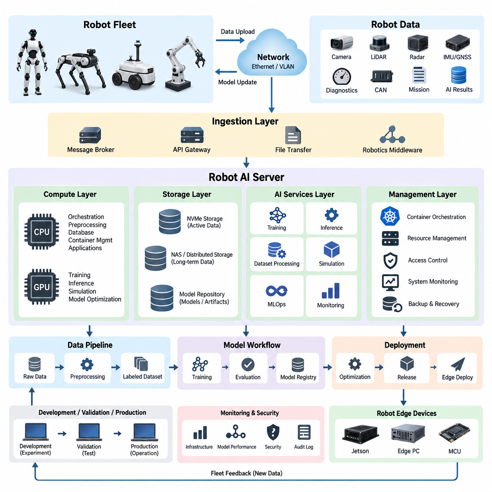
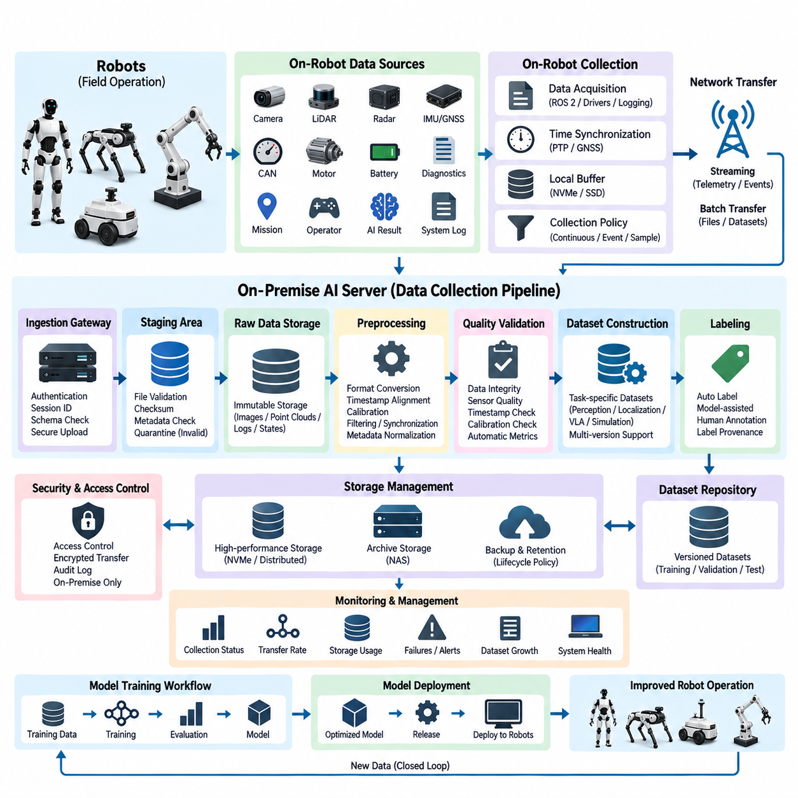
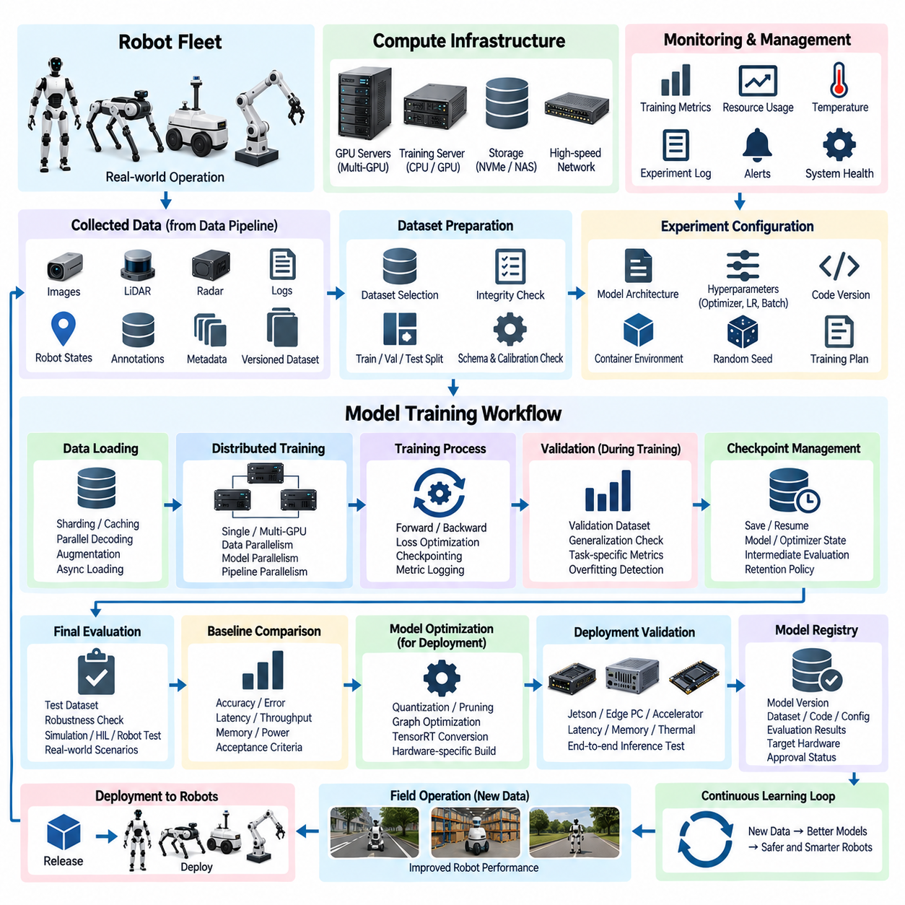
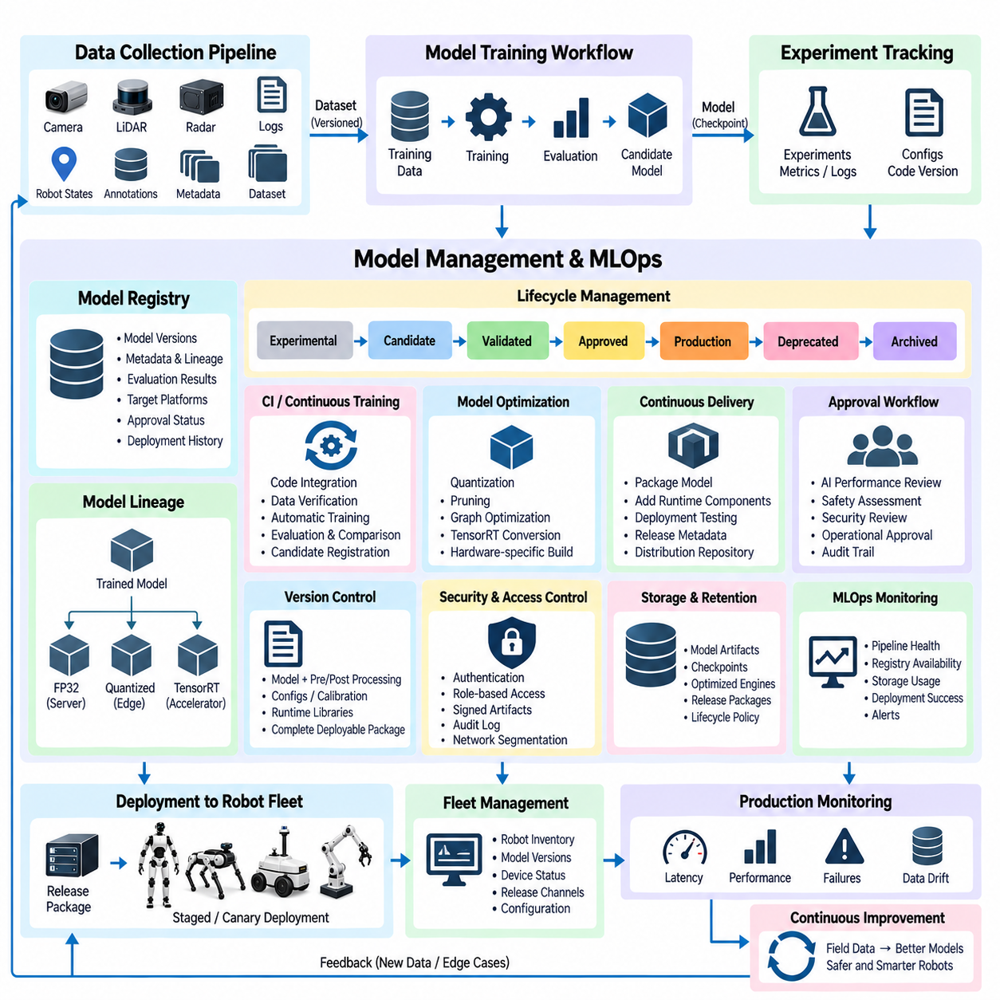
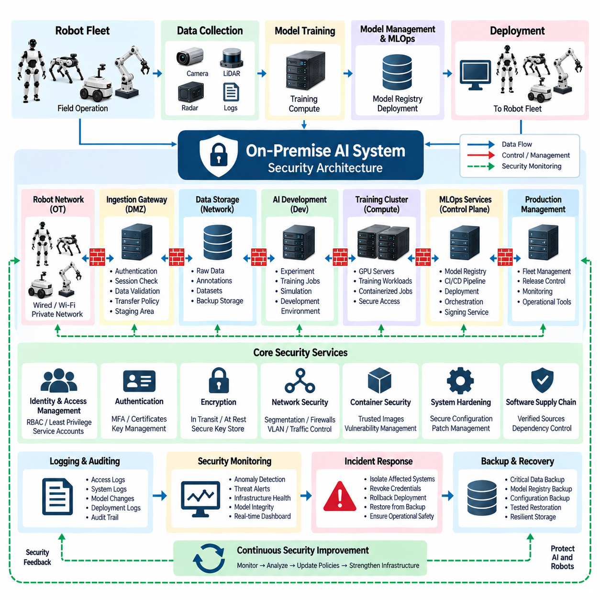

**Volume 16 Compute and AI Architecture**

# Chapter 06. On-Premise AI System

## 06.01. Robot AI Server Architecture

{width="7.268055555555556in" height="7.268055555555556in"}

로봇 AI 서버 아키텍처(Robot AI Server Architecture)는 로봇에서 생성되는 데이터(Robot-Generated Data), AI 모델 개발(AI Model Development), 검증(Validation), 배포(Deployment), 운영 모니터링(Operational Monitoring)을 온프레미스 환경(On-Premise Environment)에서 연결하는 중앙 집중형 컴퓨팅 기반(Centralized Computing Foundation)을 제공한다. 엄격한 전력 및 실시간 제약(Real-Time Constraints)을 충족해야 하는 개별 로봇 컴퓨터와 달리 서버 계층(Server Layer)은 고성능 GPU, CPU, 스토리지(Storage), 네트워킹(Networking) 자원을 집중적으로 구성할 수 있다. 따라서 로봇 플릿(Robot Fleet)과 AI 엔지니어링 인프라(AI Engineering Infrastructure)를 연결하는 핵심 컴퓨팅 백본(Computational Backbone)의 역할을 수행한다.

아키텍처는 로봇 측 실시간 실행(Robot-Side Real-Time Execution)과 서버 측 컴퓨팅 워크로드(Server-Side Computational Workload)를 분리해야 한다. 모션 제어(Motion Control), 비상 대응(Emergency Response), 위치 추정(Localization), 장애물 회피(Obstacle Avoidance)와 같은 지연시간에 민감한 기능(Latency-Critical Function)은 임베디드 컨트롤러(Embedded Controller), Jetson 플랫폼(Jetson Platform), 엣지 PC(Edge PC)에 유지한다. 서버는 대규모 인지 처리(Perception Processing), 데이터셋 준비(Dataset Preparation), 모델 학습(Model Training), 시뮬레이션(Simulation), 분석(Analytics), 모델 최적화(Model Optimization), 플릿 수준 학습(Fleet-Level Learning)을 담당한다. 이러한 분리를 통해 네트워크 지연이나 서버 장애가 로봇의 기본 안전 기능에 직접적인 영향을 주는 것을 방지한다.

실용적인 서버 아키텍처(Server Architecture)는 컴퓨팅(Compute), 스토리지(Storage), 네트워킹(Networking), AI 서비스(AI Services), 관리 계층(Management Layer)을 중심으로 구성된다. CPU 자원은 오케스트레이션(Orchestration), 전처리(Preprocessing), 데이터베이스 서비스(Database Services), 컨테이너 관리(Container Management), 일반 애플리케이션 워크로드(Application Workload)를 처리하며, GPU는 딥 뉴럴 네트워크 학습(Deep Neural Network Training)과 고처리량 추론(High-Throughput Inference)을 가속한다. 로컬 NVMe 스토리지(Local NVMe Storage)는 활성 데이터셋과 체크포인트(Checkpoint)를 위한 고속 작업 공간을 제공하고, 대용량 NAS 또는 분산 스토리지(Distributed Storage)는 장기간 센서 데이터, 학습 모델, 로그(Log), 시뮬레이션 자산(Simulation Asset)을 보존한다.

GPU 자원은 단순히 가속기(Accelerator)의 수를 최대화하기보다는 실제 워크로드(Workload)에 따라 선정해야 한다. 대규모 학습 작업(Large Training Job)은 고대역폭 GPU 통신(High-Bandwidth GPU Communication)으로 연결된 멀티 GPU 노드(Multi-GPU Node)가 필요할 수 있지만, 추론(Inference), 전처리(Preprocessing), 평가 서비스(Evaluation Service)는 소규모 GPU 파티션(GPU Partition)이나 독립 서버에서 실행할 수 있다. 인지 네트워크(Perception Network), VLM/VLA 모델(VLM/VLA Model), 월드 모델(World Model), 합성 데이터 파이프라인(Synthetic-Data Pipeline), 시뮬레이션 워크로드(Simulation Workload)가 불필요하게 서로를 차단하지 않고 공존할 수 있도록 컴퓨팅 자원을 동적으로 할당할 수 있어야 한다.

로봇 연결성(Robot Connectivity)은 또 하나의 중요한 아키텍처 경계(Architectural Boundary)를 형성한다. 로봇은 카메라 프레임(Camera Frame), LiDAR 포인트 클라우드(LiDAR Point Cloud), 레이더 관측 데이터(Radar Observation), IMU 및 GNSS 측정값, 진단 정보(Diagnostics), CAN 데이터, 임무 이력(Mission History), AI 추론 결과(AI Inference Result)를 지속적 또는 주기적으로 업로드할 수 있다. 이러한 데이터 스트림(Data Stream)은 학습 스토리지(Training Storage)에 직접 접근하는 대신 통제된 수집 서비스(Ingestion Service)를 통해 서버로 유입되어야 한다. 메시지 브로커(Message Broker), API 게이트웨이(API Gateway), 파일 전송 서비스(File-Transfer Service), 로보틱스 미들웨어(Robotics Middleware)를 이용하면 운영 네트워크(Operational Network)와 내부 AI 인프라를 분리할 수 있다.

로보틱스 데이터셋(Robotics Dataset)은 대량의 이미지 시퀀스(Image Sequence), 포인트 클라우드(Point Cloud), 멀티모달 기록(Multimodal Recording)을 포함하므로 수집 서버(Ingestion Server), GPU 노드(GPU Node), 스토리지 시스템(Storage System) 사이에는 일반적으로 고대역폭 이더넷(High-Bandwidth Ethernet)이 요구된다. 네트워크 설계(Network Design)는 최대 전송속도뿐만 아니라 여러 로봇의 동시 업로드, 데이터셋 복제(Dataset Replication), 학습 데이터 읽기(Training Read), 체크포인트 쓰기(Checkpoint Write), 관리 트래픽(Administrative Traffic)을 함께 고려해야 한다. 전용 네트워크 세그먼트(Network Segment) 또는 VLAN을 이용하여 로봇 통신, 스토리지 트래픽, GPU 클러스터 트래픽(GPU-Cluster Traffic), 관리 접근(Management Access), 외부 서비스 인터페이스(External Service Interface)를 분리할 수 있다.

스토리지 아키텍처(Storage Architecture)는 전체 AI 데이터 생명주기(AI Data Lifecycle)를 반영해야 한다. 원시 로봇 관측 데이터(Raw Robot Observation)는 먼저 변경 불가능하거나 통제된 원본 데이터(Source Data)로 보존하며, 이후 전처리 파이프라인(Preprocessing Pipeline)을 통해 동기화(Synchronization), 보정(Calibration), 필터링(Filtering), 라벨링(Labeling), 변환(Transformation)이 적용된 데이터셋을 생성한다. 학습 시스템(Training System)은 버전 관리된 데이터셋(Versioned Dataset)을 사용하고 체크포인트, 메트릭(Metric), 아티팩트(Artifact)를 생성한다. 검증된 모델은 통제된 모델 저장소(Model Repository)로 이동한다. 이러한 구성은 현장 관측 데이터, 데이터셋 버전, 실험(Experiment), 실제 배포된 로봇 소프트웨어 사이의 추적성(Traceability)을 확보한다.

시간 동기화(Time Synchronization)와 메타데이터 관리(Metadata Management)는 피지컬 AI 시스템(Physical AI System)에서 특히 중요하다. 의미 있는 학습 샘플(Training Sample)은 여러 센서와 로봇 행동(Robot Action) 사이의 관계에 의존하는 경우가 많기 때문이다. 카메라 영상, LiDAR 스캔(LiDAR Scan), 위치 추정 상태(Localization State), 액추에이터 명령(Actuator Command), 임무 상태(Mission State), 운영자 개입(Operator Intervention)은 일관된 타임스탬프(Timestamp)와 로봇 식별자(Robot Identity)를 통해 연결되어야 한다. 따라서 서버는 센서 데이터와 함께 동기화 정보, 캘리브레이션 버전(Calibration Version), 소프트웨어 버전, 하드웨어 구성(Hardware Configuration), 임무 상황(Mission Context), 환경 메타데이터(Environmental Metadata)를 보존해야 한다.

컨테이너화된 AI 서비스(Containerized AI Service)는 개발팀과 워크로드 사이의 소프트웨어 의존성(Software Dependency)을 격리하는 효과적인 방법이다. 학습 환경(Training Environment), 추론 서버(Inference Server), 데이터셋 처리기(Dataset Processor), 시뮬레이션 서비스, 데이터베이스, 대시보드(Dashboard), 로보틱스 게이트웨이(Robotics Gateway)는 각각 독립된 컨테이너(Container) 또는 서비스 그룹(Service Group)으로 운영할 수 있다. 컨테이너 오케스트레이션(Container Orchestration)은 CPU, GPU, 메모리, 스토리지 자원을 할당하면서 장애 서비스를 재시작하고 통제된 업그레이드(Controlled Upgrade)를 지원할 수 있다. 이를 통해 CUDA, 프레임워크(Framework), 드라이버(Driver), 애플리케이션 사이의 의존성 충돌을 줄일 수 있다.

로봇 AI 서버(Robot AI Server)는 실험(Experimentation)에서 실제 배포까지 이어지는 명확한 경로를 제공해야 한다. 엔지니어는 통제된 데이터셋을 이용해 모델을 개발하고 학습하며, 자동화 평가(Automated Evaluation)를 수행하고, 후보 모델(Candidate Model)을 기존 기준 모델(Baseline Model)과 비교한 후 정의된 승인 기준(Acceptance Criteria)을 만족하는 모델을 등록한다. 이후 배포 서비스(Deployment Service)는 최적화된 모델을 구성 정보(Configuration) 및 런타임 의존성(Runtime Dependency)과 함께 패키징하고, 관리된 릴리스 채널(Managed Release Channel)을 통해 Jetson 플랫폼, 엣지 PC 또는 다른 로봇 컴퓨팅 모듈(Robot Compute Module)로 배포할 수 있다.

모델 배포(Model Deployment)는 서버 하드웨어(Server Hardware)와 로봇 하드웨어(Robot Hardware)가 근본적으로 서로 다른 성능 범위(Performance Envelope)를 가진다는 점을 고려해야 한다. 대규모 GPU 자원을 이용해 학습된 모델은 엣지 배포(Edge Deployment) 전에 프루닝(Pruning), 양자화(Quantization), 그래프 최적화(Graph Optimization), TensorRT 컴파일(TensorRT Compilation), 입력 해상도 축소(Input Resolution Reduction), 아키텍처 수정(Architectural Modification)이 필요할 수 있다. 따라서 서버는 학습용 모델 표현(Training Representation)과 하드웨어별 배포 아티팩트(Hardware-Specific Deployment Artifact)를 모두 관리해야 한다. 또한 최적화 이후에도 허용 가능한 인지 정확도(Perception Accuracy), 지연시간(Latency), 메모리 사용량(Memory Consumption), 운영 강건성(Operational Robustness)이 유지되는지 검증해야 한다.

플릿 운영(Fleet Operation)은 서버를 단순한 학습 장비에서 지속적 학습 인프라(Continuous Learning Infrastructure)로 변화시킨다. 배포된 로봇은 새로운 관측 데이터, 어려운 사례(Difficult Case), 장애(Failure), 비정상적인 환경(Unusual Environment), 운영자 개입 데이터를 지속적으로 생성한다. 선택된 정보는 온프레미스 서버로 다시 전달되어 분류되고 새로운 데이터셋에 통합될 수 있다. 이후 업데이트된 모델을 다시 학습, 평가, 배포함으로써 물리적 운영(Physical Operation), 데이터 수집(Data Collection), 학습(Learning), 검증, 로봇 행동 개선(Improved Robot Behavior)을 연결하는 폐루프 엔지니어링 과정(Closed Engineering Loop)을 구축한다.

아키텍처는 동일한 물리적 하드웨어를 공유하는 경우에도 개발 환경(Development Environment), 검증 환경(Validation Environment), 운영 환경(Production Environment)을 구분해야 한다. 실험 코드(Experimental Code)와 검증되지 않은 모델이 운영 중인 로봇 서비스(Robot Service)를 직접 변경해서는 안 된다. 개발 자원은 빠른 실험을 지원하고, 검증 자원은 통제된 시험 조건(Test Condition)을 재현하며, 운영 서비스는 승인된 모델, 플릿 인터페이스(Fleet Interface), 운영 데이터베이스(Operational Database)를 처리한다. 환경 사이에 접근 제어(Access Control)와 릴리스 게이트(Release Gate)를 적용하면 미완성 AI 구성요소가 실제 로봇에 배포될 가능성을 줄일 수 있다.

신뢰성(Reliability)은 모든 구성요소를 무조건 이중화하는 방식이 아니라 아키텍처의 중요한 경계에서 필요한 수준의 이중화(Redundancy)를 적용하는 방식으로 확보해야 한다. 핵심 데이터베이스, 모델 저장소, 구성 기록(Configuration Record), 운영 서비스에는 백업(Backup)과 복구(Recovery) 메커니즘이 필요하지만, 재현 가능한 대규모 학습 작업은 일시적인 중단을 허용할 수도 있다. 따라서 스토리지 보호(Storage Protection), 네트워크 경로 이중화(Redundant Network Path), UPS 기반 전원 인프라, 서버 상태 모니터링(Server Health Monitoring), 열 모니터링(Thermal Monitoring), 자동 서비스 복구(Automated Service Recovery)는 각 장애가 운영에 미치는 영향에 따라 우선순위를 정해야 한다.

온프레미스 AI 시스템에는 로봇 텔레메트리(Robot Telemetry), 독점 데이터셋(Proprietary Dataset), 소스 코드(Source Code), 학습된 모델(Trained Model), 인증 정보(Credential), 잠재적으로 민감한 센서 기록(Sensitive Sensor Recording)이 포함되므로 보안(Security)은 특히 중요하다. 인증(Authentication), 역할 기반 권한 제어(Role-Based Authorization), 네트워크 세분화(Network Segmentation), 암호화 통신(Encrypted Communication), 감사 로그(Audit Logging), 안전한 모델 저장소(Secure Model Repository), 통제된 외부 연결(Controlled External Connectivity), 백업 보호(Backup Protection)를 초기 아키텍처 단계부터 포함해야 한다. 또한 하나의 로봇이 침해되더라도 전체 서버 환경이 자동으로 노출되지 않도록 로봇별 인증 정보를 독립적으로 관리해야 한다.

모니터링(Monitoring)은 일반적인 IT 자원뿐만 아니라 AI 고유의 동작까지 포함해야 한다. CPU 사용률, GPU 사용률, GPU 메모리, 온도, 스토리지 용량, 네트워크 처리량(Network Throughput), 서비스 가용성(Service Availability), 작업 상태(Job Status)는 인프라 상태를 보여준다. AI 모니터링(AI Monitoring)은 데이터셋 버전, 학습 손실(Training Loss), 검증 메트릭(Validation Metric), 추론 지연시간(Inference Latency), 모델 버전, 배포 상태(Deployment Status), 현장 성능 지표(Field-Performance Indicator)를 추가로 추적한다. 이러한 정보를 통합하면 엔지니어가 인프라 장애(Infrastructure Failure), 모델 성능 저하(Model Degradation), 데이터 품질 문제(Data-Quality Problem)를 구분할 수 있다.

확장성(Scalability)은 전체 아키텍처를 교체하는 방식이 아니라 모듈식 확장(Modular Expansion)을 통해 확보해야 한다. 초기 시스템은 하나의 GPU 서버, 로컬 NVMe 스토리지, NAS 용량, 관리 서버(Management Server)로 시작할 수 있다. 로봇 수와 데이터셋 규모가 증가하면 추가 GPU 노드, 스토리지 어레이(Storage Array), 고속 네트워크 스위치(High-Speed Network Switch), 백업 시스템, 전용 수집 서버를 단계적으로 추가할 수 있다. 따라서 동일한 논리 아키텍처(Logical Architecture)를 실험실 수준의 개발 환경에서 조직 전체의 피지컬 AI 인프라(Physical AI Infrastructure)까지 확장할 수 있다.

전체 컴퓨팅 및 AI 아키텍처(Compute and AI Architecture) 관점에서 로봇 AI 서버는 온프레미스 AI 시스템(On-Premise AI System)의 첫 번째 기반을 형성하며, 이후 이어지는 데이터 수집 파이프라인(Data Collection Pipeline), 모델 학습 워크플로(Model Training Workflow), MLOps 프레임워크(MLOps Framework), 보안 아키텍처(Security Architecture)와 자연스럽게 연결된다. 또한 앞선 장의 GPU 서버 인프라(GPU Server Infrastructure)와 이후 다루는 플릿 수준 AI(Fleet-Level AI) 및 분산 실행(Distributed Execution)을 연결함으로써 중앙 집중형 컴퓨팅(Centralized Computing)에서 실제 로봇에 배포되는 지능(Deployed Robotic Intelligence)까지 연속적인 기술 경로를 구축한다.

## 06.02. Data Collection Pipeline

{width="7.268055555555556in" height="7.268055555555556in"}

데이터 수집 파이프라인(Data Collection Pipeline)은 물리적 로봇(Physical Robot)과 온프레미스 AI 인프라(On-Premise AI Infrastructure)를 연결하는 운영상의 가교 역할을 한다. 그 목적은 단순히 센서 파일을 로봇에서 서버로 복사하는 것이 아니라, 멀티모달 운영 데이터(Multimodal Operational Data)를 AI 개발에 적합한 형태로 수집, 전송, 구성, 검증, 보존하는 것이다. 온프레미스 AI 시스템(On-Premise AI System)에서 이 파이프라인은 지속적으로 축적되는 로봇 경험(Robot Experience)을 학습, 검증, 진단, 시뮬레이션, 플릿 학습(Fleet Learning)에 활용할 수 있는 통제된 엔지니어링 자산(Engineering Asset)으로 변환한다.

로봇은 서로 다른 데이터 생성 속도와 운영 중요도를 가진 이기종 정보(Heterogeneous Information)를 생성한다. 카메라는 대용량 이미지 또는 비디오 스트림(Video Stream)을 생성하고, LiDAR는 포인트 클라우드(Point Cloud)를 생성하며, 레이더(Radar)는 객체 및 움직임 관측 정보를 제공한다. IMU와 GNSS 시스템은 고주파 위치 추정 정보(High-Frequency Localization Information)를 생성한다. 이외에도 CAN 메시지, 모터 상태, 배터리 정보, 진단 정보(Diagnostics), 임무 이벤트(Mission Event), 운영자 명령, AI 추론 결과(AI Inference Result), 시스템 로그(System Log) 등이 포함된다. 파이프라인은 이러한 데이터 소스를 하나의 획일적인 수집 방식으로 강제하지 않고 각각의 특성에 맞게 수용해야 한다.

데이터 획득(Data Acquisition)은 실시간 제어(Real-Time Control)를 방해하지 않는 범위에서 가능한 한 원래의 로봇 인터페이스(Robot Interface)에 가까운 위치에서 시작해야 한다. 센서 드라이버(Sensor Driver), ROS 2 노드(ROS 2 Node), CAN 인터페이스, 로깅 프로세스(Logging Process), 애플리케이션 서비스(Application Service)는 정보를 전용 수집 프로세스(Collection Process)로 전달할 수 있다. 안전 필수 제어 경로(Safety-Critical Control Path)는 대용량 데이터 기록과 독립적으로 유지해야 한다. 따라서 수집 소프트웨어(Collection Software)는 제동, 조향, 위치 추정, 모션 제어, 비상 기능에 불필요한 의존성을 추가하는 대신 필요한 정보를 관찰하거나 복제하는 방식으로 동작해야 한다.

정확한 타임스탬프(Timestamp)는 피지컬 AI 학습(Physical AI Training)이 인지(Perception), 로봇 상태(Robot State), 행동(Action) 사이의 관계에 의존하기 때문에 필수적이다. 카메라 프레임(Camera Frame), LiDAR 스캔(LiDAR Scan), 레이더 관측, IMU 측정값, 위치 추정 결과(Localization Estimate), 액추에이터 명령(Actuator Command), 임무 이벤트는 가능한 경우 공통 시간 기준(Common Time Reference)에 맞춰 정렬되어야 한다. PTP, GNSS 기반 타이밍(GNSS-Derived Timing), 하드웨어 타임스탬프(Hardware Timestamp), 동기화된 시스템 클록(Synchronized System Clock)을 통해 이러한 기준을 구축할 수 있으며, 메타데이터(Metadata)에는 클록 소스(Clock Source), 동기화 상태, 센서 주기, 알려진 시간 오차(Timing Uncertainty)를 기록해야 한다.

파이프라인은 수집된 센서 페이로드(Sensor Payload)를 각각 독립된 파일로 취급하기보다는 관련 상황 메타데이터(Contextual Metadata)를 함께 연결해야 한다. 유용한 정보에는 로봇 식별 정보(Robot Identity), 하드웨어 구성(Hardware Configuration), 센서 일련정보, 캘리브레이션 버전(Calibration Version), 소프트웨어 빌드(Software Build), AI 모델 버전, 임무 식별자(Mission Identifier), 운영 모드(Operating Mode), 맵 버전(Map Version), 위치 상황(Location Context), 가능한 경우 환경 조건(Environmental Condition)이 포함된다. 이러한 메타데이터를 통해 엔지니어는 데이터가 생성된 당시의 조건을 재구성할 수 있으며, 겉보기에 유사한 기록이 잘못 결합되는 것을 방지할 수 있다.

최신 로봇은 막대한 양의 데이터를 생성할 수 있기 때문에 모든 신호를 지속적으로 기록하는 방식은 현실적이지 않을 수 있다. 따라서 수집 정책(Collection Policy)은 연속 신호(Continuous Signal), 이벤트 트리거 기록(Event-Triggered Recording), 샘플링 데이터(Sampled Data), 진단 스냅샷(Diagnostic Snapshot), 선택적으로 보존되는 고가치 사례(High-Value Case)를 구분해야 한다. 로봇은 짧은 롤링 버퍼(Rolling Buffer)를 유지하다가 충돌, 위치 추정 실패, 비상 정지, 인지 불확실성(Perception Uncertainty), 운영자 개입, 비정상적인 장애물 또는 사전에 정의된 이벤트가 발생할 때 해당 데이터를 영구적으로 저장할 수 있다.

엣지 측 버퍼링(Edge-Side Buffering)은 네트워크 연결이 불안정하거나 사용할 수 없는 상황에서도 데이터 무결성(Data Integrity)을 보호한다. 실외, 대규모 시설 내부, 지하 공간 또는 무선 통신 범위의 경계에서 운용되는 로봇은 AI 서버에 지속적으로 연결된다고 가정할 수 없다. 로컬 NVMe 또는 SSD 스토리지는 업로드 상태(Upload State) 및 체크섬(Checksum)과 함께 수집 세션(Collection Session)을 임시로 저장할 수 있다. 통신이 복구되면 전송 서비스(Transfer Service)는 전체 데이터셋을 처음부터 다시 전송하거나 중요한 현장 데이터를 폐기하지 않고 중단된 업로드를 재개할 수 있다.

데이터 전송(Data Transport)은 페이로드 특성(Payload Characteristic)에 따라 선택해야 한다. 경량 텔레메트리(Telemetry)와 이벤트 정보는 메시징 시스템(Messaging System) 또는 로보틱스 미들웨어(Robotics Middleware)를 통해 전송할 수 있지만, 대용량 카메라 기록, 포인트 클라우드 아카이브(Point-Cloud Archive), 데이터셋 패키지(Dataset Package)는 신뢰성 높은 파일 또는 객체 전송 메커니즘(Object Transfer Mechanism)을 이용하는 것이 적합하다. 따라서 수집 아키텍처(Collection Architecture)는 모든 데이터 소스에 하나의 프로토콜을 적용하는 대신 스트리밍 전송(Streaming Transfer)과 배치 전송(Batch Transfer)을 결합할 수 있다. 네트워크 대역폭 제한이 발생하는 경우 임무 필수 네트워크 트래픽(Mission-Critical Network Traffic)이 백그라운드 데이터셋 업로드보다 항상 높은 우선순위를 가져야 한다.

수집 게이트웨이(Ingestion Gateway)는 로봇 네트워크(Robot Network)와 내부 AI 스토리지(AI Storage) 사이에 통제된 경계를 제공한다. 수신되는 세션은 인증(Authentication), 고유 식별자(Unique Identifier) 할당, 예상 스키마(Schema) 검증을 거쳐 적절한 스테이징 영역(Staging Location)으로 전달될 수 있다. 게이트웨이는 개별 로봇이 중앙 데이터셋이나 학습 인프라(Training Infrastructure)에 제한 없이 접근하는 것도 방지한다. 이러한 경계는 시스템이 소수의 개발 로봇에서 여러 운영 사이트에 분산된 대규모 플릿(Large Fleet)으로 확장될수록 더욱 중요해진다.

첫 번째 서버 측 저장 위치(Server-Side Destination)는 일반적으로 최종 학습 데이터셋(Final Training Dataset)이 아니라 스테이징 영역(Staging Area)이어야 한다. 스테이징 단계에서는 업로드된 데이터를 보존하면서 자동화된 프로세스를 통해 파일 완전성(File Completeness), 체크섬, 타임스탬프, 메시지 스키마(Message Schema), 메타데이터 가용성(Metadata Availability), 기본적인 센서 유효성(Sensor Validity)을 검증한다. 손상되거나 불완전한 세션은 조사를 위해 격리(Quarantine)할 수 있다. 수집 영역과 정제된 스토리지(Curated Storage)를 분리하면 잘못된 기록이 후속 데이터셋을 오염시키는 것을 방지하고 데이터 처리 작업(Data-Processing Operation)을 위한 복구 가능한 경계를 제공할 수 있다.

스토리지 정책(Storage Policy)이 허용하는 경우 원시 데이터(Raw Data)는 가능한 한 보존해야 한다. 전처리 알고리즘(Preprocessing Algorithm)과 AI 요구사항은 시간이 지나면서 변화하기 때문이다. 현재 특정 인지 작업에 필요하지 않은 카메라 영상도 향후 VLM 학습(VLM Training), 이상 분석(Anomaly Analysis), 월드 모델 개발(World-Model Development)에 활용될 수 있다. 마찬가지로 원시 LiDAR와 로봇 상태 정보는 향상된 캘리브레이션 또는 위치 추정 알고리즘을 이용하여 다시 처리할 수 있다. 따라서 아키텍처는 변경되지 않는 원시 데이터(Immutable Raw Data)와 재생성 가능한 파생 데이터셋(Derived Dataset)을 구분해야 한다.

전처리(Preprocessing)는 수집된 관측 정보를 후속 AI 워크로드(AI Workload)에 적합한 형태로 변환한다. 일반적인 작업에는 압축 해제(Decompression), 형식 변환(Format Conversion), 타임스탬프 정렬(Timestamp Alignment), 좌표 변환(Coordinate Transformation), 캘리브레이션 적용, 이미지 크기 조정(Image Resizing), 포인트 클라우드 필터링(Point-Cloud Filtering), 센서 동기화(Sensor Synchronization), 시퀀스 추출(Sequence Extraction), 메타데이터 정규화(Metadata Normalization)가 포함된다. 계산량이 많은 처리는 로봇 자원을 사용하는 대신 서버 CPU 또는 GPU에서 수행할 수 있다. 각각의 파생 아티팩트(Derived Artifact)는 원본 기록과 처리 구성(Processing Configuration)에 대한 참조 관계를 유지해야 한다.

품질 검증(Quality Validation)은 단순히 파일을 열 수 있는지만 확인하는 수준을 넘어야 한다. 카메라 스트림에는 프레임 손실(Dropped Frame), 흐림(Blur), 포화(Saturation), 노출 문제(Exposure Problem)가 발생할 수 있으며, LiDAR 기록에는 패킷 손실(Missing Packet) 또는 비정상적인 포인트 분포(Point Distribution)가 포함될 수 있다. IMU와 GNSS 스트림에서는 불연속성(Discontinuity)이 나타날 수 있으며, 하드웨어 정비 이후에는 캘리브레이션 관계(Calibration Relationship)가 유효하지 않을 수도 있다. 자동화된 품질 메트릭(Quality Metric)을 통해 의심스러운 세션을 학습 워크플로에 투입하기 전에 식별하고 센서 또는 로봇의 이상을 조기에 발견할 수 있다.

데이터셋 구축(Dataset Construction)은 검증된 기록을 특정 AI 목적과 연결된 통제된 데이터 집합(Controlled Collection)으로 변환한다. 인지 학습(Perception Training)에는 동기화된 카메라와 LiDAR 시퀀스가 필요할 수 있고, 위치 추정 연구(Localization Research)는 GNSS, IMU, 휠 오도메트리(Wheel Odometry), 맵 정보를 중점적으로 활용할 수 있다. 반면 VLA 또는 피지컬 AI 학습(Physical AI Learning)에는 관측 데이터와 명령(Command), 행동(Action), 작업 상태(Task State), 결과(Outcome)가 함께 필요할 수 있다. 따라서 하나의 범용 데이터셋 표현을 강제하기보다는 동일한 원시 기록으로부터 여러 종류의 파생 데이터셋을 생성할 수 있어야 한다.

라벨링(Labeling)은 자동 생성(Automated Generation), 기존 로봇 출력(Existing Robot Output), 시뮬레이션 기반 정보(Simulation-Derived Information), 사람에 의한 어노테이션(Human Annotation)을 결합할 수 있다. 기존 인지 모델은 검토 또는 수정 가능한 초기 라벨(Preliminary Label)을 생성할 수 있으며, 로봇 상태와 맵 정보를 이용해 일부 기하학적 또는 운영 라벨(Operational Label)을 자동 생성할 수도 있다. 모호한 객체, 비정상 이벤트, 작업 의미(Task Semantics), 장애 해석(Failure Interpretation)에는 여전히 사람의 어노테이션이 중요하다. 각 라벨이 자동, 수동 또는 하이브리드 방식(Hybrid Process) 중 어떤 방식으로 생성되었는지 알 수 있도록 라벨 출처(Label Provenance)를 기록해야 한다.

데이터셋 버전 관리(Dataset Versioning)는 데이터 수집과 모델 학습 사이의 재현성(Reproducibility)을 제공한다. 데이터셋이 특정 실험에 사용되도록 릴리스되면 데이터 구성 항목, 라벨, 전처리 파라미터(Preprocessing Parameter), 캘리브레이션 참조(Calibration Reference), 관련 메타데이터를 특정 버전으로 식별할 수 있어야 한다. 새로운 현장 데이터 또는 수정된 어노테이션은 기존 학습 입력을 조용히 변경하는 대신 새로운 버전을 생성해야 한다. 이를 통해 학습된 모델을 해당 모델 생성에 사용된 정확한 데이터 구성(Data Configuration)까지 역추적할 수 있다.

플릿 규모(Fleet Size)가 증가할수록 스토리지 생명주기 관리(Storage Lifecycle Management)의 중요성도 증가한다. 가치가 높은 원시 기록은 장기간 보존할 수 있지만 임시 캐시(Temporary Cache), 중간 전처리 결과(Intermediate Preprocessing Product), 중복 다운로드(Duplicated Download), 오래된 파생 아티팩트는 더 짧은 보존 정책(Retention Policy)을 적용할 수 있다. 자주 사용하는 학습 데이터는 고성능 NVMe 또는 분산 스토리지(Distributed Storage)에 저장하고, 아카이브 기록(Archived Recording)은 대용량 NAS 또는 백업 시스템(Backup System)으로 이동할 수 있다. 이러한 계층형 전략(Tiered Strategy)은 AI 개발 속도와 장기 스토리지 비용 사이의 균형을 제공한다.

보안(Security)과 개인정보 보호 제어(Privacy Control)는 파이프라인 전체에서 지속적으로 적용되어야 한다. 로봇 기록에는 사람, 시설, 지도, 운영 패턴(Operational Routine), 독점 환경(Proprietary Environment) 또는 기타 민감한 정보가 포함될 수 있다. 따라서 데이터는 수집 과정에서 인증되고, 전송 과정에서 보호되며, 역할에 따라 접근이 제한되고, 필요한 경우 감사 로그(Audit Log)에 기록되어야 한다. 민감한 데이터셋은 온프레미스 환경 내부에 완전히 유지할 수 있으며, 이를 통해 외부 클라우드 서비스(External Cloud Service)에 대한 의존성을 줄이면서 수집된 로봇 정보에 대한 조직의 통제권을 유지할 수 있다.

운영 모니터링(Operational Monitoring)은 데이터 수집 파이프라인 자체를 관찰 가능한 시스템(Observable System)으로 만들어야 한다. 엔지니어는 기록 상태(Recording Status), 로봇 스토리지 용량, 업로드 대기열(Upload Queue), 네트워크 처리량(Network Throughput), 전송 실패(Failed Transfer), 수집 속도(Ingestion Rate), 손상된 세션(Corrupted Session), 처리 백로그(Processing Backlog), 데이터셋 증가량(Dataset Growth), 스토리지 사용률(Storage Utilization)을 확인할 수 있어야 한다. 예상치 못하게 데이터 보고를 중단한 로봇이나 기록 특성이 변화한 센서를 경고(Alert)를 통해 식별할 수 있다. 이러한 지표는 데이터 수집을 비공식적인 로깅 작업에서 관리 가능한 운영 역량(Managed Production Capability)으로 발전시킨다.

파이프라인은 궁극적으로 배포된 로봇과 AI 엔지니어링 환경 사이의 폐루프 학습(Closed Learning Loop)을 지원한다. 현장 로봇은 새로운 객체, 환경, 장애, 엣지 케이스(Edge Case), 인간과의 상호작용(Human Interaction)을 경험하며, 선택된 관측 데이터는 데이터 수집 파이프라인을 통해 다시 전달되어 검증된 데이터셋으로 변환된다. 이러한 데이터셋은 이후 모델 학습 워크플로(Model Training Workflow)에 투입되고, 개선된 모델은 통제된 방식으로 로봇에 다시 배포되기 전에 개발 및 평가된다. 따라서 데이터 수집은 지속적인 플릿 지능(Continuous Fleet Intelligence)을 구현하는 첫 번째 단계가 된다.

전체 장 구성(Chapter Structure)에서 데이터 수집 파이프라인(Data Collection Pipeline)은 로봇 AI 서버 아키텍처(Robot AI Server Architecture)에 이어 배치되며, 이후의 모델 학습 워크플로(Model Training Workflow), 모델 관리 및 MLOps(Model Management and MLOps), 온프레미스 보안 설계(On-Premise Security Design)에 필요한 데이터 기반(Data Foundation)을 구축한다. 이러한 구성요소들은 온프레미스 서버를 단순한 정적 컴퓨팅 하드웨어(Static Computing Hardware)에서 통합 AI 생명주기 플랫폼(Integrated AI Lifecycle Platform)으로 전환한다. 따라서 데이터 수집 파이프라인은 단순한 저장 메커니즘(Storage Mechanism)이 아니라 물리적 로봇 경험을 재사용 가능하고 추적 가능하며 지속적으로 개선되는 AI 지식(AI Knowledge)으로 변환하는 통제된 인터페이스(Controlled Interface)이다.

## 06.03. Model Training Workflow

{width="7.268055555555556in" height="7.268055555555556in"}

모델 학습 워크플로(Model Training Workflow)는 정제된 로봇 데이터셋(Curated Robot Dataset)을 실제 물리 시스템에 배포할 수 있는 검증된 AI 모델(Validated AI Model)로 변환한다. 온프레미스 AI 시스템(On-Premise AI System)에서 학습은 단순한 GPU 연산 작업이 아니라 데이터셋 선택, 실험 구성(Experiment Configuration), 분산 컴퓨팅(Distributed Computing), 평가(Evaluation), 최적화(Optimization), 등록(Registration), 배포 준비(Deployment Readiness)를 연결하는 통제된 과정이다. 모든 학습 모델은 생성에 사용된 정확한 데이터, 소프트웨어, 파라미터(Parameter), 컴퓨팅 환경(Computing Environment)까지 추적할 수 있도록 추적성(Traceability)을 유지해야 한다.

학습은 명확하게 정의된 AI 목표(AI Objective)와 이에 대응하는 데이터셋 구성(Dataset Configuration)에서 시작한다. 인지 모델(Perception Model)은 동기화된 카메라, LiDAR, 레이더 관측 데이터가 필요할 수 있으며, 위치 추정 모델(Localization Model)은 GNSS, IMU, 오도메트리(Odometry), 맵 정보에 의존할 수 있다. VLM, VLA, 월드 모델(World Model), 피지컬 AI(Physical AI) 워크로드에는 언어(Language), 시간 시퀀스(Temporal Sequence), 로봇 상태, 행동(Action), 결과(Outcome)가 추가로 필요할 수 있다. 따라서 학습 워크플로는 앞선 데이터 수집 파이프라인(Data Collection Pipeline)에서 생성된 작업별 버전 관리 데이터셋(Task-Specific Versioned Dataset)을 사용한다.

연산을 시작하기 전에 데이터셋 무결성(Dataset Integrity)과 호환성(Compatibility)을 검증해야 한다. 학습 소프트웨어는 데이터셋 버전, 어노테이션 스키마(Annotation Schema), 캘리브레이션 참조(Calibration Reference), 전처리 구성(Preprocessing Configuration), 클래스 분포(Class Distribution), 시퀀스 구조(Sequence Structure), 예상 입력 차원(Input Dimension)을 확인해야 한다. 우발적인 데이터 누출(Data Leakage)을 방지하기 위해 학습(Training), 검증(Validation), 테스트(Test) 데이터 분할을 명확하게 식별해야 한다. 이러한 검사는 재현 가능한 입력 경계(Reproducible Input Boundary)를 구축하고, 일관되지 않거나 오염된 평가 데이터 때문에 모델 성능이 향상된 것처럼 보이는 위험을 줄인다.

실험 구성(Experiment Configuration)은 모델을 어떤 방식으로 학습할 것인지를 정의하며, 그 자체를 버전 관리되는 엔지니어링 아티팩트(Version-Controlled Engineering Artifact)로 취급해야 한다. 여기에는 아키텍처 선택(Architecture Selection), 초기화 방법(Initialization Method), 옵티마이저(Optimizer), 학습률(Learning Rate), 배치 크기(Batch Size), 증강 정책(Augmentation Policy), 손실 함수(Loss Function), 학습 기간(Training Duration), 랜덤 시드(Random Seed), 체크포인트 주기(Checkpoint Frequency), 하드웨어 요구사항(Hardware Requirement)이 포함될 수 있다. 성공하거나 실패한 실험을 문서화되지 않은 수동 설정에 의존하지 않고 재구성할 수 있도록 구성 파일(Configuration File)은 소스 코드 리비전(Source-Code Revision)과 데이터셋 식별자(Dataset Identifier)와 함께 저장해야 한다.

학습 환경(Training Environment) 역시 재현 가능해야 한다. CUDA 버전, GPU 드라이버(GPU Driver), 딥러닝 프레임워크(Deep-Learning Framework), Python 패키지, 사용자 정의 연산자(Custom Operator), 컴파일러 버전(Compiler Version), 지원 라이브러리(Supporting Library)는 실행 결과와 경우에 따라 수치적 결과(Numerical Result)에도 실질적인 영향을 줄 수 있다. 컨테이너화된 환경(Containerized Environment)은 이러한 의존성을 패키징하는 실용적인 방법을 제공한다. 학습 컨테이너(Training Container)는 특정 모델 프로젝트와 연결하여 워크스테이션(Workstation), 단일 서버(Single Server), 멀티 GPU 인프라(Multi-GPU Infrastructure)에서 통제된 소프트웨어 기준선(Software Baseline)을 유지하며 재사용할 수 있다.

컴퓨팅 자원(Compute Resource)은 모델 규모와 실험 목적에 따라 할당해야 한다. 소규모 실험과 디버깅 작업(Debugging Job)은 단일 GPU에서 실행할 수 있지만, 대규모 인지 네트워크, 파운데이션 모델(Foundation Model), 멀티모달 모델(Multimodal Model), 월드 모델은 멀티 GPU 서버(Multi-GPU Server) 또는 GPU 클러스터(GPU Cluster)가 필요할 수 있다. CPU 자원은 디코딩(Decoding), 데이터 증강(Augmentation), 전처리, 데이터 로딩(Data Loading)을 수행하며, 고속 NVMe 또는 분산 스토리지(Distributed Storage)는 학습 샘플을 공급한다. 균형 잡힌 자원 설계(Resource Design)를 통해 고가의 GPU가 스토리지 또는 전처리 작업을 기다리면서 유휴 상태(Idle State)에 머무는 것을 방지해야 한다.

대규모 학습(Large-Scale Training)은 모델 특성에 따라 데이터 병렬화(Data Parallelism), 모델 병렬화(Model Parallelism), 파이프라인 병렬화(Pipeline Parallelism) 또는 이들의 조합을 사용할 수 있다. 데이터 병렬화는 배치를 여러 GPU에 분산하고 그래디언트(Gradient)를 동기화하며, 모델 중심 접근법(Model-Oriented Approach)은 하나의 가속기(Accelerator)에 효율적으로 적재하기 어려운 네트워크를 분할한다. 규모가 증가할수록 고대역폭 GPU 인터커넥트(High-Bandwidth GPU Interconnect)와 클러스터 네트워크(Cluster Networking)의 중요성이 커진다. 다만 분산 실행(Distributed Execution)을 사용하더라도 실험 메타데이터(Experiment Metadata)를 통해 참여한 모든 컴퓨팅 자원과 소프트웨어 버전을 식별할 수 있어야 한다.

입력 파이프라인(Input Pipeline)은 재현성을 훼손하지 않으면서 GPU 활용률(GPU Utilization)을 유지할 수 있을 만큼 빠르게 데이터를 공급해야 한다. 데이터셋 샤딩(Dataset Sharding), 캐싱(Caching), 프리페칭(Prefetching), 병렬 디코딩(Parallel Decoding), 데이터 증강, 비동기 로딩(Asynchronous Loading)을 통해 처리량(Throughput)을 향상시킬 수 있다. 자주 사용하는 학습 데이터는 NVMe 스토리지에 스테이징(Staging)하고, 대규모 원본 데이터셋은 NAS 또는 분산 스토리지에 유지할 수 있다. 성능 모니터링(Performance Monitoring)을 통해 학습이 연산 병목(Compute-Bound), 스토리지 병목(Storage-Bound), CPU 병목(CPU-Bound), 네트워크 병목(Network-Bound) 중 어디에 해당하는지 식별하여 실제 병목 구간에 인프라 개선을 집중해야 한다.

학습 과정에서 시스템은 메트릭(Metric)과 운영 상태(Operational State)를 지속적으로 기록해야 한다. 손실값(Loss Value), 학습률, 정확도 지표(Accuracy Measure), 그래디언트 통계(Gradient Statistics), GPU 사용률, 메모리 사용량(Memory Consumption), 반복 처리 속도(Iteration Speed), 온도, 체크포인트 상태(Checkpoint Status)는 모델 동작과 인프라 상태를 동시에 파악할 수 있게 한다. 메트릭은 서로 분리된 로그로 저장하기보다는 실험 식별자(Experiment Identifier)와 연결해야 한다. 이를 통해 엔지니어는 학습 실행(Training Run)을 체계적으로 비교하고 발산(Divergence), 과적합(Overfitting), 불안정성(Instability), 비효율적인 자원 활용을 식별할 수 있다.

체크포인트 관리(Checkpoint Management)는 장시간 수행되는 실험을 보호하고 통제된 분석을 가능하게 한다. 모델 가중치(Model Weight), 옵티마이저 상태(Optimizer State), 스케줄러 상태(Scheduler State), 학습 진행 상태(Training Progress), 관련 구성 정보를 주기적으로 저장하면 중단된 작업을 처음부터 다시 시작하지 않고 재개할 수 있다. 또한 체크포인트를 이용하면 최종 학습 에포크(Training Epoch)가 반드시 최적이라고 가정하지 않고 중간 모델 상태(Intermediate Model State)를 평가할 수 있다. 보존 정책(Retention Policy)은 중요한 체크포인트를 유지하면서 고성능 스토리지를 과도하게 사용하는 중복 중간 파일을 제거하도록 구성해야 한다.

검증(Validation)은 학습이 완료된 이후에만 수행하는 것이 아니라 학습 과정 전반에 걸쳐 이루어져야 한다. 전용 검증 데이터셋(Validation Dataset)을 이용하면 파라미터 업데이트(Parameter Update)와 분리된 상태에서 일반화 성능(Generalization)을 측정할 수 있다. 로보틱스 애플리케이션(Robotics Application)의 유용한 메트릭에는 객체 검출 또는 세그멘테이션 정확도(Segmentation Accuracy), 깊이 오차(Depth Error), 위치 추정 오차(Localization Error), 궤적 예측 품질(Trajectory Prediction Quality), 행동 성공률(Action Success), 충돌 관련 지표(Collision-Related Indicator), 작업 완료 성능(Task Completion Performance)이 포함될 수 있다. 적절한 메트릭은 모델의 역할에 따라 달라지며 하나의 수치만으로 전체 로봇 능력(Robot Capability)을 대표해서는 안 된다.

학습이 완료된 모델은 최적화에 사용되지 않은 데이터셋과 시나리오를 이용하여 더욱 통제된 평가(Evaluation)를 거쳐야 한다. 평가에는 정상 조건(Nominal Case), 어려운 환경(Difficult Environment), 희귀 이벤트(Rare Event), 센서 성능 저하(Sensor Degradation), 조명 변화(Lighting Change), 동적 장애물(Dynamic Obstacle), 이전에 관측된 현장 장애(Field Failure)가 포함될 수 있다. 피지컬 AI 시스템은 추가적으로 시뮬레이션(Simulation), 리플레이(Replay), 소프트웨어 인 더 루프(Software-in-the-Loop), 하드웨어 인 더 루프(Hardware-in-the-Loop), 통제된 로봇 시험(Controlled Robot Testing)이 필요할 수 있다. 목적은 오프라인 메트릭(Offline Metric)의 향상이 실제 물리적 배포에 유용하고 충분히 강건한 행동으로 이어지는지를 판단하는 것이다.

기준 모델 비교(Baseline Comparison)는 실험 단계와 모델 승격(Model Promotion) 사이의 엔지니어링 게이트(Engineering Gate)를 제공한다. 후보 모델(Candidate Model)은 동일한 데이터셋, 메트릭, 런타임 조건(Runtime Condition), 승인 임계값(Acceptance Threshold)을 사용하여 현재 승인된 모델(Currently Approved Model)과 비교해야 한다. 정확도 향상은 추론 지연시간(Inference Latency), GPU 메모리, 전력 요구량(Power Demand), 모델 크기(Model Size), 장애 동작(Failure Behavior)과 함께 고려해야 한다. 실험실 정확도가 높더라도 로봇의 컴퓨팅 예산(Compute Budget)을 초과한다면 실제 운영 측면에서는 개선된 모델이라고 할 수 없다.

엣지 배포(Edge Deployment)를 목적으로 하는 모델은 학습 이후 추가적인 최적화가 필요한 경우가 많다. 양자화(Quantization), 프루닝(Pruning), 연산자 융합(Operator Fusion), 그래프 최적화(Graph Optimization), TensorRT 변환(TensorRT Conversion), 저정밀도 연산(Reduced Precision), 아키텍처별 컴파일(Architecture-Specific Compilation)을 통해 서버에서 학습된 모델을 효율적인 배포 아티팩트(Deployment Artifact)로 변환할 수 있다. 최적화 과정에서 수치적 동작이 달라질 수 있으므로 이후 다시 평가를 수행해야 한다. 따라서 워크플로는 원본 학습 체크포인트(Original Training Checkpoint)와 여기에서 생성된 각각의 하드웨어별 최적화 모델(Hardware-Specific Optimized Model)을 구분해야 한다.

배포 검증(Deployment Validation)은 가능한 경우 실제 대상 하드웨어(Target Hardware) 또는 이를 대표할 수 있는 하드웨어를 이용해야 한다. Jetson 플랫폼, 엣지 PC(Edge PC), 전용 가속기(Dedicated Accelerator), 서버 GPU는 서로 다른 메모리 제한, 실행 특성, 지원 연산자(Supported Operator), 열적 제약(Thermal Constraint)을 가진다. 측정 항목에는 종단 간 추론 지연시간(End-to-End Inference Latency), 처리량, 초기화 시간(Initialization Time), 최대 메모리 사용량(Peak Memory Consumption), 지속 열 동작(Sustained Thermal Behavior), 다른 로봇 워크로드와의 상호작용이 포함되어야 한다. 이 단계는 AI 벤치마크 성능(AI Benchmark Performance)과 실제 로봇 컴퓨팅 성능(Real Robot Computing Performance) 사이의 격차를 해소한다.

기술적 및 운영적 기준(Operational Criteria)을 만족하는 모델은 통제된 모델 레지스트리(Model Registry)에 등록할 수 있다. 등록 과정에서는 모델을 데이터셋 버전, 소스 코드 리비전, 학습 구성, 컨테이너 환경(Container Environment), 체크포인트, 평가 결과, 최적화 방법, 대상 하드웨어, 승인 상태(Approval Status)와 연결해야 한다. 모델 레지스트리는 실험과 배포 사이를 연결하는 공식 기준 정보(Authoritative Information)가 되며, 엔지니어링 팀이 각 로봇에서 정확히 어떤 모델이 동작하고 있으며 왜 해당 모델이 승인되었는지를 확인할 수 있게 한다.

실패한 실험(Failed Experiment) 역시 학습 후 사라지는 것이 아니라 엔지니어링 지식 기반(Engineering Knowledge Base)의 일부로 유지해야 한다. 실패한 구성, 불안정한 학습 동작, 성능 회귀(Performance Regression), 호환되지 않는 최적화(Incompatible Optimization), 자원 한계(Resource Limitation)를 기록하면 동일한 실수를 반복하는 것을 방지하고 향후 실험 계획을 개선할 수 있다. 따라서 온프레미스 학습 플랫폼(On-Premise Training Platform)의 가치는 성공적인 모델을 생성하는 데에만 있는 것이 아니라 조직의 데이터셋, 하드웨어, 로봇 요구사항에서 어떤 접근 방식이 효과적인지에 대한 구조화된 증거(Structured Evidence)를 축적하는 데에도 있다.

자동화(Automation)는 워크플로를 점진적으로 반복 가능한 학습 파이프라인(Repeatable Training Pipeline)으로 전환할 수 있다. 데이터셋 검증, 환경 생성(Environment Creation), 학습 실행, 체크포인트 생성, 메트릭 수집, 평가, 최적화, 등록을 예약 작업(Scheduled Job) 또는 이벤트 기반 작업(Event-Driven Job)을 통해 연결할 수 있다. 그러나 자동 실행(Automated Execution)이 자동 배포(Automatic Deployment)를 의미해서는 안 된다. 특히 로봇 움직임 또는 안전 관련 동작(Safety-Related Behavior)에 영향을 주는 모델은 명확한 승인 기준, 검증 증거(Validation Evidence), 승인 상태, 롤백 기능(Rollback Capability)에 따라 운영 로봇으로의 승격을 통제해야 한다.

보안 제어(Security Control)는 전체 워크플로에서 학습 데이터, 모델 가중치, 소스 코드, 인증 정보(Credential), 컴퓨팅 자원을 보호해야 한다. 역할 기반 접근 제어(Role-Based Access), 격리된 컨테이너(Isolated Container), 인증된 스토리지(Authenticated Storage), 통제된 저장소(Controlled Repository), 감사 기록(Audit Record), 제한된 외부 연결(Restricted External Connectivity)은 지식재산(Intellectual Property)과 데이터 주권(Data Sovereignty)을 보호하는 데 도움이 된다. 로봇 기록이나 학습 모델을 퍼블릭 클라우드 환경(Public Cloud Environment)으로 전송할 수 없는 경우 온프레미스 실행은 특히 중요한 가치를 가지며, 내부 네트워크 세분화(Internal Segmentation)를 통해 조직 내부에서도 불필요한 접근을 제한할 수 있다.

워크플로는 궁극적으로 일회성 개발 과정이 아니라 반복 가능한 순환 구조(Repeatable Loop)를 형성한다. 새로운 현장 데이터는 데이터 수집 파이프라인을 통해 유입되고, 데이터셋은 업데이트 및 버전 관리되며, 실험을 통해 후보 모델이 생성되고, 평가를 통해 개선 여부가 확인된다. 이후 최적화된 아티팩트가 배포되고 운영 결과가 다시 새로운 학습 근거(Training Evidence)로 돌아온다. 이러한 지속적인 순환 구조를 통해 물리적 경험(Physical Experience)과 AI 행동(AI Behavior)의 관계에 대한 재현성, 검증 규율(Validation Discipline), 통제력을 유지하면서 로봇 지능(Robot Intelligence)을 지속적으로 발전시킬 수 있다.

전체 장 구성(Chapter Structure)에서 모델 학습 워크플로(Model Training Workflow)는 로봇 AI 서버 아키텍처(Robot AI Server Architecture)와 데이터 수집 파이프라인(Data Collection Pipeline)에 이어 배치되며, 수집된 로봇 경험을 배포 가능한 지능(Deployable Intelligence)으로 변환하는 핵심 컴퓨팅 과정(Computational Process)을 제공한다. 그 결과는 자연스럽게 모델 관리 및 MLOps(Model Management and MLOps) 단계로 전달되어 모델 버전, 승인, 릴리스(Release), 모니터링, 생명주기 제어(Lifecycle Control)를 체계화할 수 있다. 이러한 구성요소들은 전체 컴퓨팅 및 AI 아키텍처(Compute and AI Architecture) 내에서 온프레미스 AI 시스템의 핵심 학습 루프(Core Learning Loop)를 구축한다.

## 06.04. Model Management (MLOps)

{width="7.268055555555556in" height="7.268055555555556in"}

모델 관리 및 MLOps(Model Management and MLOps)는 학습된 AI 모델이 실험 단계에서 검증되고 배포 가능하며 모니터링 및 유지보수가 가능한 로봇 지능(Robot Intelligence)으로 전환되는 과정을 통제하는 거버넌스 계층(Governance Layer)을 제공한다. 온프레미스 AI 시스템(On-Premise AI System)에서 이 기능은 모델 학습 워크플로(Model Training Workflow)와 실제 운영 로봇 플릿(Operational Robot Fleet)을 연결한다. 이를 통해 모델을 단순한 개별 파일이 아니라 식별 가능한 버전, 의존성(Dependency), 평가 증거(Evaluation Evidence), 대상 하드웨어(Target Hardware), 승인 상태(Approval State), 전체 생명주기 이력(Lifecycle History)을 가진 통제된 엔지니어링 자산(Engineering Asset)으로 관리할 수 있다.

모델 생명주기(Model Lifecycle)는 학습 실험(Training Experiment)이 관련 메타데이터(Metadata)와 함께 후보 체크포인트(Candidate Checkpoint)를 생성하면서 시작된다. 모델은 데이터셋 버전(Dataset Version), 소스 코드 리비전(Source-Code Revision), 실험 구성(Experiment Configuration), 학습 환경(Training Environment), 프레임워크 버전(Framework Version), 하이퍼파라미터(Hyperparameter), 메트릭(Metric), 학습에 사용된 하드웨어와 연결된 상태로 유지되어야 한다. 이러한 관계를 보존하면 엔지니어는 결과를 재현하고 외형상 유사한 두 모델이 평가 또는 실제 로봇 배포에서 서로 다르게 동작하는 원인을 분석할 수 있다.

모델 레지스트리(Model Registry)는 모델의 식별 정보와 생명주기 상태(Lifecycle Status)를 관리하는 공식 저장소(Authoritative Repository) 역할을 한다. 단순히 바이너리 가중치(Binary Weight)만 저장하는 것이 아니라 모델 버전, 설명, 계보(Lineage), 평가 결과, 최적화 아티팩트(Optimization Artifact), 대상 플랫폼(Target Platform), 승인 정보, 배포 이력(Deployment History)을 함께 관리해야 한다. 모델은 실험(Experimental), 후보(Candidate), 검증 완료(Validated), 승인(Approved), 운영(Production), 사용 중단(Deprecated), 아카이브(Archived) 등의 상태를 거칠 수 있다. 명시적인 상태 관리를 통해 미완성 실험 모델과 운영 승인을 받은 릴리스(Release)가 혼동되는 것을 방지한다.

모델 계보(Model Lineage)는 하나의 학습 모델에서 여러 배포 변형(Deployment Variant)이 생성될 수 있기 때문에 특히 중요하다. GPU 서버에서 생성된 완전 정밀도 체크포인트(Full-Precision Checkpoint)는 이후 양자화(Quantization), 프루닝(Pruning), TensorRT 변환(TensorRT Conversion), 또는 서로 다른 가속기(Accelerator)를 위한 컴파일 과정을 거칠 수 있다. 각각의 파생 아티팩트(Derived Artifact)는 원본 모델과의 부모 관계(Parent Relationship)를 유지하고 적용된 변환 과정을 기록해야 한다. 이를 통해 학습 체크포인트에서 Jetson, 엣지 PC(Edge PC), 서버 추론(Server Inference) 또는 기타 하드웨어별 배포 패키지까지 연결되는 추적 가능한 계층 구조(Traceable Hierarchy)를 구축할 수 있다.

버전 관리(Versioning)는 모델 가중치에만 적용해서는 안 된다. 의미 있는 모델 릴리스(Model Release)는 전처리 코드(Preprocessing Code), 캘리브레이션 가정(Calibration Assumption), 입력 해상도(Input Resolution), 클래스 정의(Class Definition), 정규화 파라미터(Normalization Parameter), 런타임 라이브러리(Runtime Library), TensorRT 엔진(TensorRT Engine), 구성 파일(Configuration File), 후처리 로직(Post-Processing Logic)에 의존할 수 있다. 이러한 구성요소 중 하나만 변경되어도 신경망 가중치가 동일한 상태에서 로봇 동작이 달라질 수 있다. 따라서 MLOps는 릴리스를 단순히 모델 파일 이름으로 식별하는 것이 아니라 배포 가능한 AI 패키지(Deployable AI Package) 전체를 하나의 버전 관리 시스템(Versioned System)으로 관리해야 한다.

승격 게이트(Promotion Gate)는 후보 모델이 운영 단계로 진행할 수 있는 조건을 정의한다. 자동화된 검사는 정확도, 강건성(Robustness), 추론 지연시간(Inference Latency), 메모리 사용량(Memory Consumption), 모델 크기(Model Size), 하드웨어 호환성(Hardware Compatibility), 승인된 기준 모델(Baseline Model) 대비 성능 회귀(Regression)를 검증할 수 있다. 로보틱스 애플리케이션(Robotics Application)은 추가적으로 시뮬레이션(Simulation), 리플레이(Replay), 소프트웨어 인 더 루프(Software-in-the-Loop), 하드웨어 인 더 루프(Hardware-in-the-Loop), 통제된 물리 시험(Controlled Physical Testing)을 요구할 수 있다. 인지, 계획 또는 로봇 행동에 영향을 미치는 모델은 단순히 학습 메트릭이 특정 수치 기준을 초과했다는 이유만으로 운영 단계에 진입해서는 안 된다.

지속적 통합(Continuous Integration)의 원칙은 학습 코드, 추론 소프트웨어(Inference Software), 구성, 모델 인터페이스(Model Interface)의 변경을 자동으로 검증하는 방식으로 AI 개발에 확장할 수 있다. 엔지니어가 소스 코드를 변경하거나 새로운 후보 모델을 제출하면 자동화 파이프라인(Automated Pipeline)이 단위 테스트(Unit Test), 인터페이스 검사(Interface Check), 데이터셋 호환성 테스트(Dataset Compatibility Test), 추론 테스트(Inference Test), 선택된 회귀 시나리오(Regression Scenario)를 실행할 수 있다. 이를 통해 개발 단계에서는 문제가 없어 보이지만 전처리, 런타임 실행(Runtime Execution), 로봇 인터페이스를 손상시키는 변경으로 인해 발생하는 통합 문제(Integration Problem)를 줄일 수 있다.

지속적 학습(Continuous Training)은 승인된 데이터셋이 업데이트될 때 반복적인 모델 생성을 자동화할 수 있다. 새로운 데이터셋 버전은 전처리 검증(Preprocessing Verification), 학습, 평가, 기준 모델 비교(Baseline Comparison), 후보 모델 등록(Candidate Registration)을 자동으로 시작할 수 있다. 그러나 지속적 학습과 자동 운영 릴리스(Automatic Production Release)는 명확히 구분되어야 한다. 생성된 모델은 새로운 후보이며, 실제 배포 전에 정해진 기술적 및 운영적 게이트(Operational Gate)를 충족해야 한다. 이러한 구분은 반복적인 수작업을 줄이면서도 엔지니어링 통제(Engineering Control)를 유지할 수 있게 한다.

지속적 전달(Continuous Delivery)은 검증된 모델을 대상 로봇 플랫폼(Target Robot Platform)에 통제된 방식으로 릴리스할 수 있도록 준비한다. 전달 파이프라인(Delivery Pipeline)은 승인된 모델을 가져와 하드웨어별 최적화(Hardware-Specific Optimization)를 적용하고, 필요한 런타임 구성요소(Runtime Component)를 패키징하며, 배포 테스트(Deployment Test)를 수행하고, 릴리스 메타데이터(Release Metadata)를 생성한 뒤 승인된 배포 저장소(Authorized Distribution Repository)에 아티팩트를 배치할 수 있다. 이후 엔지니어가 개별 로봇에 모델 파일을 수동으로 복사하는 대신 플릿 정책(Fleet Policy)에 따라 배포할 수 있다.

로봇 플릿은 운영 위험(Operational Risk)을 제한하는 배포 전략(Deployment Strategy)이 필요하다. 새로운 모델은 먼저 개발 로봇(Development Robot)에 설치한 뒤 검증 장비(Validation Unit) 또는 소규모 운영 로봇 집단에 적용하고 이후 전체 플릿으로 확대할 수 있다. 카나리 배포(Canary Deployment)는 제한된 로봇 집단에 새로운 모델을 먼저 적용하고, 단계적 롤아웃(Staged Rollout)은 배포 범위를 점진적으로 확대한다. 모니터링 과정에서 예상하지 못한 동작이 발견되면 전체 로봇에 모델이 배포되기 전에 배포를 중단할 수 있다. 이는 현장 조건(Field Condition)이 실험실 데이터셋과 크게 다른 경우 특히 중요하다.

롤백 기능(Rollback Capability)은 장애 발생 이후 임시로 구현하는 것이 아니라 배포 아키텍처(Deployment Architecture)에 처음부터 포함해야 한다. 로봇은 이전에 승인된 모델을 유지하거나 검증된 정상 배포 패키지(Known-Good Deployment Package)에 접근할 수 있어야 한다. 새로운 릴리스가 초기화에 실패하거나 지연시간 제한을 초과하고 비정상적인 출력을 생성하거나 운영 성능 회귀(Operational Regression)를 일으키면 이전 버전으로 복귀할 수 있어야 한다. 결정론적 복구(Deterministic Recovery)를 보장하기 위해 모델 가중치뿐만 아니라 모델 구성, 런타임 의존성, 전처리 구성요소도 일관되게 롤백되어야 한다.

플릿 인벤토리(Fleet Inventory)는 모든 로봇에서 실행 중인 AI 소프트웨어와 모델 버전을 식별할 수 있어야 한다. 유용한 기록에는 로봇 식별 정보(Robot Identity), 하드웨어 플랫폼(Hardware Platform), 펌웨어 또는 운영체제 버전(Operating-System Version), 배포된 모델 패키지, 배포 시간(Deployment Time), 구성, 현재 릴리스 채널(Release Channel)이 포함된다. 이러한 매핑이 없다면 엔지니어는 현장 장애와 특정 모델 릴리스 사이의 관계를 신뢰성 있게 분석할 수 없다. 따라서 플릿 수준 모델 인벤토리는 MLOps 구성 관리(Configuration Management)를 로봇 자산 관리(Robotics Asset Management) 및 운영 진단(Operational Diagnostics)과 연결한다.

운영 모니터링(Production Monitoring)은 서버 상태를 확인하는 수준을 넘어 배포 이후 모델의 동작을 관찰해야 한다. 런타임 정보(Runtime Information)에는 추론 지연시간, 처리량(Throughput), 메모리 사용량, GPU 사용률, 입력 누락(Dropped Input), 신뢰도 분포(Confidence Distribution), 장애 이벤트(Failure Event), 운영자 개입률(Intervention Rate), 작업 수준 성능(Task-Level Performance)이 포함될 수 있다. 대역폭과 개인정보 보호 제약(Privacy Constraint)에 따라 로봇은 요약된 메트릭만 전송하고, 대용량 센서 기록은 선택된 이벤트가 데이터 수집 파이프라인(Data Collection Pipeline)을 통한 업로드를 요구할 때까지 로컬에 유지할 수 있다.

배포된 소프트웨어가 변경되지 않더라도 실제 물리적 운영 환경이 변화하면 모델 성능(Model Performance)이 저하될 수 있다. 새로운 시설, 계절적 조건(Seasonal Condition), 조명, 객체 유형(Object Type), 사람의 행동(Human Behavior), 센서 노화(Sensor Aging), 로봇 하드웨어 변경 등은 학습 조건과 다른 데이터 분포(Data Distribution)를 발생시킬 수 있다. 따라서 MLOps는 현장 관측 데이터와 운영 지표를 모델 검증 과정에서 구축된 예상 기준선(Expected Baseline)과 비교하여 데이터 드리프트(Data Drift)와 성능 드리프트(Performance Drift)를 탐지할 수 있어야 한다.

모니터링 과정에서 어렵거나 비정상적인 사례가 탐지되면 선택된 관측 데이터를 다시 데이터 생명주기(Data Lifecycle)로 전달할 수 있다. 낮은 신뢰도의 예측(Low-Confidence Prediction), 운영자 개입, 위치 추정 실패(Localization Failure), 충돌, 비정상 장애물(Unusual Obstacle), 작업 실패(Task Failure)는 추가 분석과 라벨링(Labeling)의 후보가 될 수 있다. 검증 이후 이러한 사례는 새로운 데이터셋 버전에 포함되어 모델 학습 워크플로에서 사용할 수 있다. 이를 통해 MLOps는 배포 모니터링, 데이터 수집, 재학습(Retraining), 개선된 모델 릴리스를 연결하는 폐루프(Closed Loop)를 완성한다.

실험 추적(Experiment Tracking)과 운영 모델 관리(Production Model Management)는 서로 연결되어야 하지만 논리적으로는 구분되어야 한다. 연구팀은 수백 개의 실험을 수행할 수 있으며, 그중 상당수는 운영 상태로 전환될 필요가 없다. 실험 추적은 구성, 메트릭, 체크포인트, 비교 결과를 보존하고, 모델 레지스트리는 공식적인 생명주기 관리(Formal Lifecycle Control)에 진입한 모델을 관리한다. 이러한 역할을 분리하면 연구 추적성(Research Traceability)을 유지하면서 임시 실험으로 인해 운영 저장소가 과도하게 복잡해지는 것을 방지할 수 있다.

승인 워크플로(Approval Workflow)는 모델 승격 과정에 조직적 책임성(Organizational Accountability)을 부여한다. 서로 다른 역할이 AI 성능, 소프트웨어 통합(Software Integration), 로봇 검증(Robot Validation), 안전 평가(Safety Assessment), 사이버보안(Cybersecurity), 운영 릴리스(Operational Release)를 담당할 수 있다. 승인 기록(Approval Record)은 어떤 검증 증거가 검토되었으며 어떤 모델 버전이 승인되었는지를 식별해야 한다. 위험도가 높은 로봇 기능은 배포 전에 복수의 승인을 요구할 수 있다. 이렇게 생성된 감사 추적(Audit Trail)을 통해 모델 릴리스를 개발자 사이의 비공식적인 파일 전달이 아닌 공식적인 엔지니어링 의사결정(Engineering Decision)으로 관리할 수 있다.

모델 생명주기에 대한 침해가 전체 로봇 플릿에 영향을 미칠 수 있으므로 보안(Security)은 MLOps 제어 영역(Control Plane)을 보호해야 한다. 모델 저장소(Model Repository), 배포 인증 정보(Deployment Credential), 서명 키(Signing Key), 오케스트레이션 서비스(Orchestration Service), CI/CD 파이프라인(CI/CD Pipeline), 관리 인터페이스(Administrative Interface)에는 강력한 인증(Authentication)과 역할 기반 접근 제어(Role-Based Access Control)가 필요하다. 모델 아티팩트는 해시(Hash) 또는 암호학적 서명(Cryptographic Signature)을 적용하여 로봇이 설치 전에 진위성(Authenticity)과 무결성(Integrity)을 확인할 수 있도록 해야 한다. 네트워크 세분화(Network Segmentation)는 침해된 개발 시스템이 운영 로봇에 직접 접근할 가능성을 추가로 제한한다.

온프레미스 MLOps(On-Premise MLOps)는 데이터셋, 모델 또는 로봇 텔레메트리(Robot Telemetry)를 조직 내부에서 통제해야 하는 경우 특히 유용하다. 학습 인프라(Training Infrastructure), 레지스트리(Registry), 아티팩트 저장소(Artifact Repository), 모니터링 데이터베이스(Monitoring Database), 배포 서비스(Deployment Service)를 통제된 내부 네트워크에서 운영함으로써 민감한 정보를 시설 외부로 전송하지 않을 수 있다. 필요한 경우 외부 소프트웨어 저장소나 업데이트 서비스(Update Service)는 통제된 인터페이스를 통해 접근하면서 내부 로봇 데이터와 독점 모델 아티팩트(Proprietary Model Artifact)는 격리된 상태로 유지할 수 있다.

스토리지 정책(Storage Policy)은 시간이 지나면서 증가하는 실험, 체크포인트, 최적화 엔진(Optimized Engine), 릴리스, 로그, 아카이브 모델을 관리해야 한다. 운영 릴리스와 이를 뒷받침하는 검증 증거는 장기간 보존해야 하지만 중복된 중간 체크포인트는 생명주기 정책(Lifecycle Policy)에 따라 제거할 수 있다. 아카이브된 모델은 사고 분석(Incident Analysis), 과거 성능 비교(Historical Comparison), 규제 증거(Regulatory Evidence), 이전 로봇 구성에서 관측된 동작 재현이 필요한 경우 다시 사용할 수 있도록 복구 가능한 상태로 유지해야 한다.

MLOps 모니터링(MLOps Monitoring)은 모델뿐만 아니라 생명주기 인프라 자체의 건전성(Health)도 측정해야 한다. 파이프라인 장애(Pipeline Failure), 학습 대기열 지연(Training Queue Delay), 레지스트리 가용성(Registry Availability), 아티팩트 스토리지 용량, 배포 성공률(Deployment Success Rate), 롤백 이벤트(Rollback Event), 플릿 버전 분산(Fleet-Version Fragmentation), 모니터링 데이터 지연(Monitoring-Data Latency)은 운영 성숙도(Operational Maturity)를 나타내는 지표가 된다. 대시보드(Dashboard)와 경고(Alert)를 통해 이러한 문제를 모델 릴리스가 중단되거나 일부 로봇이 의도하지 않은 오래된 AI 구성을 사용하는 상황으로 발전하기 전에 파악할 수 있다.

완전한 MLOps 아키텍처(MLOps Architecture)는 통제된 피드백 사이클(Controlled Feedback Cycle)을 형성한다. 현장 데이터는 버전 관리된 데이터셋을 생성하고, 데이터셋은 재현 가능한 실험(Reproducible Experiment)을 생성하며, 검증된 후보 모델은 모델 레지스트리에 등록된다. 승인된 모델은 하드웨어별 배포 패키지로 변환되고, 통제된 롤아웃(Controlled Rollout)을 통해 로봇에 적용되며, 운영 모니터링은 다시 새로운 검증 증거를 생성한다. 각 전환 단계에서 식별 정보(Identity)와 출처 정보(Provenance)를 유지함으로써 조직은 무엇을 학습하고 검증하고 릴리스하고 실제 운영했는지에 대한 통제력을 잃지 않으면서 로봇 지능을 지속적으로 향상시킬 수 있다.

전체 장 구성(Chapter Structure)에서 모델 관리 및 MLOps(Model Management and MLOps)는 로봇 AI 서버 아키텍처(Robot AI Server Architecture), 데이터 수집 파이프라인(Data Collection Pipeline), 모델 학습 워크플로(Model Training Workflow)에 이어 배치되며, 이들의 결과를 통제된 운영 AI 생명주기(Governed Operational AI Lifecycle)로 전환한다. 또한 이후의 온프레미스 보안 설계(On-Premise Security Design)가 전체 인프라를 보호하기 위해 필요한 관리 프레임워크(Management Framework)를 구축한다. 이러한 구성요소들은 중앙 집중형 AI 컴퓨팅(Centralized AI Computing)을 로봇 플릿 전체에서 피지컬 AI(Physical AI)를 반복적으로 개발, 릴리스, 관찰, 복구하고 지속적으로 개선할 수 있는 통합 시스템으로 발전시킨다.

## 06.05. On-Prem Security Design

{width="7.268055555555556in" height="7.268055555555556in"}

온프레미스 보안 설계(On-Premise Security Design)는 조직의 통제 아래 유지되는 로봇 데이터, AI 모델, 컴퓨팅 인프라(Compute Infrastructure), 개발 서비스(Development Service), 플릿 배포 시스템(Fleet Deployment System)을 보호하는 보안 경계(Security Boundary)를 구축한다. 온프레미스 AI 시스템(On-Premise AI System)에서 보안은 단순히 서버 주변부만 보호하는 것이 아니라 전체 생명주기(Lifecycle)를 포괄해야 한다. 로봇 연결(Robot Connectivity), 데이터 수집(Data Ingestion), 스토리지(Storage), GPU 서버, MLOps 서비스, 모델 저장소(Model Repository), 관리 인터페이스(Administrative Interface), 배포 채널(Deployment Channel)은 모두 하나의 상호 연결된 보안 아키텍처(Security Architecture)의 일부가 된다.

기본적인 설계 원칙은 기능과 운영 위험(Operational Risk)에 따라 신뢰 영역(Trust Domain)을 분리하는 것이다. 로봇 네트워크(Robot Network), 데이터 수집 시스템(Data-Ingestion System), AI 개발 환경(AI Development Environment), 학습 클러스터(Training Cluster), 스토리지 네트워크(Storage Network), MLOps 서비스, 운영 관리(Production Management), 관리 인터페이스는 하나의 제한 없는 네트워크에서 운영되어서는 안 된다. 네트워크 세분화(Network Segmentation)는 하나의 구성요소가 침해되었을 때 횡적 이동(Lateral Movement)을 제한하고, 영역 간 통신을 명시적으로 허용된 서비스와 프로토콜(Protocol)에 따라 통제할 수 있게 한다.

로봇 네트워크는 물리적 기계가 보호된 서버 환경 외부에서 동작하고 이더넷(Ethernet), Wi-Fi, 사설 무선 네트워크(Private Wireless Network), 원격 시설(Remote Facility)을 통해 연결될 수 있기 때문에 특별한 주의가 필요하다. 로봇은 수집 또는 관리 서비스에 접근하기 전에 인증(Authentication)을 받아야 하며 자신의 역할에 필요한 권한만 부여받아야 한다. 하나의 로봇 인증 정보(Robot Credential)가 침해되더라도 다른 로봇, 중앙 스토리지, GPU 서버, 모델 저장소 또는 관리 시스템에 자동으로 접근할 수 있어서는 안 된다.

수집 게이트웨이(Ingestion Gateway)는 로봇에서 생성된 트래픽과 내부 AI 인프라 사이의 첫 번째 통제 인터페이스(Controlled Interface)를 제공할 수 있다. 로봇이 중앙 스토리지에 직접 데이터를 기록하도록 허용하는 대신 게이트웨이는 장치를 인증하고, 세션(Session)을 검증하며, 전송 정책(Transfer Policy)을 적용하고, 메타데이터(Metadata)를 검사한 뒤 승인된 데이터를 스테이징 영역(Staging Area)으로 전달한다. 이러한 아키텍처는 잘못된 형식의 트래픽, 승인되지 않은 트래픽 또는 예상하지 못한 트래픽이 중요한 데이터셋과 학습 시스템에 도달하기 전에 차단할 수 있는 보안 경계를 형성한다.

신원 및 접근 관리(Identity and Access Management)는 사용자, 로봇, 서비스, 자동화 파이프라인(Automated Pipeline)에 최소 권한 원칙(Principle of Least Privilege)을 적용해야 한다. 엔지니어는 데이터셋, 학습 작업(Training Job), 운영 모델(Production Model), 배포 시스템, 보안 관리(Security Administration)에 대해 서로 다른 권한이 필요할 수 있다. 서비스 계정(Service Account)은 개인 계정(Personal Account)과 분리하고, 자동화 프로세스에는 제한된 범위의 인증 정보만 부여해야 한다. 역할 기반 접근 제어(Role-Based Access Control)는 이러한 권한을 공식화하면서 공유 관리자 인증 정보(Shared Administrator Credential)에 대한 의존성을 줄일 수 있다.

인증 강도(Authentication Strength)는 비인가 접근(Unauthorized Access)이 발생했을 때의 영향을 고려하여 결정해야 한다. 관리 인터페이스, 모델 배포 서비스(Model Deployment Service), 보안 콘솔(Security Console), 민감한 저장소에는 위험도가 낮은 모니터링 엔드포인트(Monitoring Endpoint)보다 강력한 인증을 적용해야 한다. 다중요소 인증(Multi-Factor Authentication)은 권한이 높은 사용자의 접근을 보호할 수 있으며, 로봇과 소프트웨어 서비스는 인증서(Certificate), 암호화 키(Cryptographic Key) 또는 기타 기계 신원(Machine Identity)을 사용할 수 있다. 인증 정보는 소프트웨어 이미지에 영구적으로 내장하는 대신 발급(Issuance), 갱신(Renewal), 폐기(Revocation), 복구(Recovery) 절차를 명확하게 정의해야 한다.

암호화(Encryption)는 로봇, 서버, 스토리지 시스템, 관리 서비스 사이에서 이동하는 정보를 보호한다. 로봇 텔레메트리(Robot Telemetry), 모델 패키지(Model Package), 관리 명령(Administrative Command), 민감한 데이터셋은 가능한 경우 인증된 암호화 통신(Authenticated Encrypted Communication)을 사용해야 한다. 저장 데이터 암호화(Encryption at Rest)는 스토리지 장치, 백업 미디어(Backup Media), 모델 저장소, 이동형 시스템(Portable System)을 추가적으로 보호할 수 있다. 키 관리(Key Management)는 일반 데이터 스토리지와 분리하여 디스크 또는 백업만 확보했다고 해서 보호된 정보에 자동으로 접근할 수 없도록 해야 한다.

데이터 보안(Data Security)은 수집 파이프라인 전체에서 기밀성(Confidentiality)과 무결성(Integrity)을 모두 보존해야 한다. 원시 카메라 기록, LiDAR 데이터, 지도, 시설 정보, 사람과의 상호작용(Human Interaction), 운영 이력(Operational History), 어노테이션(Annotation)은 민감하거나 독점적인 정보(Proprietary Information)를 포함할 수 있다. 따라서 데이터셋 권한은 프로젝트와 역할 요구사항에 따라 설정해야 하며, 체크섬(Checksum), 해시(Hash), 변경 불가능한 스토리지 정책(Immutable Storage Policy), 통제된 버전 관리(Controlled Versioning)를 통해 비인가 변경을 탐지하고 학습 정보의 출처(Provenance)를 보존할 수 있다.

학습된 가중치(Trained Weight)는 상당한 지식재산(Intellectual Property)과 운영 지식(Operational Knowledge)을 포함할 수 있으므로 AI 모델 역시 소스 코드와 독점 데이터셋에 준하는 수준으로 보호해야 한다. 모델 레지스트리(Model Registry)와 아티팩트 저장소(Artifact Repository)는 읽기, 쓰기, 승격(Promotion), 삭제 권한을 제한해야 한다. 승인된 배포 아티팩트(Deployment Artifact)에는 해시 또는 디지털 서명(Digital Signature)을 적용하여 수신 시스템이 해당 모델이 승인된 릴리스 프로세스(Authorized Release Process)에서 생성되었으며 승인 이후 변경되지 않았음을 검증할 수 있도록 해야 한다.

MLOps 제어 영역(MLOps Control Plane)은 동시에 많은 로봇에 영향을 미칠 수 있기 때문에 특히 민감한 보안 영역(Security Domain)이다. CI/CD 파이프라인(CI/CD Pipeline), 모델 레지스트리, 아티팩트 저장소, 오케스트레이션 시스템(Orchestration System), 배포 서비스, 서명 인프라(Signing Infrastructure), 릴리스 관리 인터페이스(Release-Management Interface)는 강력한 격리(Isolation)와 감사(Auditing)가 필요하다. 침해된 개발 워크스테이션(Development Workstation)이 검증 게이트(Validation Gate)를 우회하여 승인되지 않은 모델을 운영 플릿에 직접 배포할 수 있어서는 안 된다.

개발 환경(Development Environment), 검증 환경(Validation Environment), 운영 환경(Production Environment)은 물리적 서버 자원을 공유하는 경우에도 논리적으로 분리되어야 한다. 개발 환경에는 실험을 위한 유연성이 필요하지만 운영 시스템에는 안정적인 구성과 더욱 엄격한 권한이 요구된다. 모델 승격(Model Promotion)은 직접적인 파일 복사가 아니라 통제된 인터페이스를 통해 수행해야 한다. 이러한 분리는 실험용 소프트웨어, 임시 인증 정보(Temporary Credential), 디버깅 서비스(Debugging Service), 검증되지 않은 의존성(Unvalidated Dependency)이 실제 운영 로봇 시스템에 포함될 가능성을 줄인다.

컨테이너 보안(Container Security)은 개별 AI 워크로드(AI Workload)까지 보호 범위를 확장한다. 학습, 전처리, 추론(Inference), 시뮬레이션(Simulation), MLOps 서비스는 컨테이너 내부에서 실행될 수 있지만 컨테이너화(Containerization)만으로 완전한 보안 경계를 구축할 수 있는 것은 아니다. 이미지는 통제된 저장소에서 제공되어야 하고 불필요한 권한은 제거하며 호스트 접근(Host Access)을 제한하고 의존성을 추적해야 한다. 취약점 관리(Vulnerability Management)는 기본 운영체제(Base Operating System), CUDA 환경, AI 프레임워크(AI Framework), 라이브러리, 컨테이너 이미지(Container Image)를 포함해야 한다.

서버 강화(Server Hardening)는 GPU 서버, 관리 노드(Management Node), 스토리지 시스템, 엣지 게이트웨이(Edge Gateway)의 공격 표면(Attack Surface)을 줄인다. 불필요한 서비스와 포트(Port)는 비활성화하고 권한이 높은 계정은 제한하며 운영체제를 유지보수하고 원격 관리는 통제된 관리 경로(Management Path)로 제한해야 한다. 구성 기준선(Configuration Baseline)을 통해 승인된 시스템 설정을 정의하면 예상하지 못한 변경을 탐지할 수 있다. 고성능 AI 인프라 역시 일반적인 운영 서버와 동일한 체계적인 시스템 강화 원칙(System Hardening Discipline)을 적용해야 한다.

네트워크 보안(Network Security)은 네트워크 세분화와 명시적인 트래픽 제어(Traffic Control)를 결합해야 한다. 방화벽(Firewall) 또는 이에 상응하는 정책 집행 기능(Policy Enforcement)은 어떤 로봇 네트워크가 수집 서비스와 통신할 수 있는지, 어떤 학습 노드가 스토리지에 접근할 수 있는지, 어떤 관리 시스템이 배포 인프라를 제어할 수 있는지를 정의한다. 필요에 따라 스토리지, 클러스터, 관리, 로봇 트래픽을 별도의 VLAN 또는 물리 네트워크(Physical Network)로 분리할 수 있다. 외부 인터넷 연결(External Internet Connectivity)은 실제로 필요한 시스템과 목적지에 한정해야 한다.

온프레미스 시스템도 시설 외부에서 근무하는 엔지니어의 지원이 필요할 수 있으므로 원격 접근(Remote Access)에는 추가적인 통제가 필요하다. 원격 사용자는 GPU 서버, NAS 시스템, 로봇 인터페이스 또는 관리 콘솔을 인터넷에 직접 노출하는 대신 관리되는 접근 지점(Managed Access Point)을 통해 내부 시스템에 접속해야 한다. 인증, 권한 부여(Authorization), 암호화 터널(Encrypted Tunnel), 세션 로깅(Session Logging), 제한된 네트워크 접근성을 적용하여 원격 유지보수(Remote Maintenance)가 내부 AI 환경으로 연결되는 통제되지 않은 경로를 만들지 않도록 해야 한다.

AI 인프라는 운영체제 패키지, GPU 드라이버, CUDA 라이브러리, Python 패키지, 컨테이너, 로보틱스 미들웨어(Robotics Middleware), 오픈소스 프레임워크(Open-Source Framework)에 의존하기 때문에 소프트웨어 공급망 보안(Software Supply-Chain Security)이 중요하다. 소프트웨어는 통제되거나 검증된 출처에서 확보해야 하며, 취약점이 발견되었을 때 영향을 받는 시스템을 식별할 수 있도록 충분한 추적 정보를 유지해야 한다. 의존성 버전과 컨테이너 구성은 재현 가능한 상태로 관리하여 보안 업데이트(Security Update)를 실제 시스템에 통제된 방식으로 배포하기 전에 시험할 수 있어야 한다.

백업 아키텍처(Backup Architecture)는 하드웨어 장애뿐만 아니라 악의적인 변경(Malicious Modification)으로부터도 데이터를 보호해야 한다. 핵심 데이터베이스, 모델 레지스트리, 구성 저장소(Configuration Repository), 소스 코드, 보안 기록(Security Record), 선택된 데이터셋에는 복구 가능한 백업(Recoverable Backup)이 필요하다. 일부 백업 사본은 운영 계정(Production Account)의 일반적인 수정 권한으로 변경할 수 없도록 보호해야 하며, 이를 통해 활성 시스템이 침해되어도 모든 복구 지점(Recovery Point)이 동시에 파괴되는 것을 방지할 수 있다. 또한 백업 파일이 존재한다는 사실만으로 복구가 보장된다고 가정하지 말고 실제 복원 절차(Restoration Procedure)를 시험해야 한다.

로깅(Logging)과 감사(Auditing)는 보안 아키텍처 전반의 활동에 대한 증거를 제공한다. 인증 이벤트(Authentication Event), 권한 작업(Privileged Action), 데이터셋 접근, 모델 등록, 승인 변경, 배포 작업, 구성 변경(Configuration Modification), 보안 경고(Security Alert), 관리 세션(Administrative Session)은 적절한 기록을 생성해야 한다. 중앙 집중식 로그 수집(Centralized Log Collection)을 통해 로봇, 서버, 스토리지, MLOps 시스템의 이벤트를 서로 연관시킬 수 있으며, 엔지니어가 일반적인 운영 장애와 의심스럽거나 승인되지 않은 동작을 구분하는 데 도움이 된다.

보안 모니터링(Security Monitoring)은 인프라 지표와 로보틱스 및 AI 생명주기 이벤트(AI Lifecycle Event)를 함께 분석해야 한다. 반복적인 인증 실패, 예상하지 못한 네트워크 연결, 비정상적인 데이터 전송, 승인되지 않은 모델 변경, 비정상적인 배포 시도, 갑작스러운 구성 변경은 시스템 침해(Compromise)를 나타낼 수 있다. 모니터링 시스템은 모든 저수준 이벤트를 운영자에게 전달하여 과부하시키기보다는 실제 대응 가능한 경고(Actionable Alert)를 생성해야 한다. 심각도(Severity)는 데이터 기밀성, 모델 무결성, 플릿 가용성(Fleet Availability), 물리적 운영(Physical Operation)에 미칠 수 있는 영향을 기준으로 결정해야 한다.

사고 대응(Incident Response)은 사이버보안 이벤트(Cybersecurity Event)가 실제 물리적 로봇에 영향을 미칠 수 있다는 점을 고려해야 한다. 대응 절차에는 로봇 격리(Robot Isolation), 인증 정보 폐기(Credential Revocation), 네트워크 세그먼트 차단, 모델 배포 중단, 로그 보존, 신뢰할 수 있는 구성(Trusted Configuration) 복원, 영향을 받은 소프트웨어의 롤백(Rollback)이 포함될 수 있다. 특히 로봇이 이동 중이거나 중요한 임무를 수행하는 상황에서는 보안 복구 과정이 추가적인 운영 위험을 발생시키지 않아야 한다. 따라서 사이버보안과 로봇 운영 안전(Robot Operational Safety)을 연계한 대응 계획이 필요하다.

온프레미스 아키텍처(On-Premise Architecture)는 민감한 로봇 정보, 독점 데이터셋, 모델 가중치, 운영 기록을 조직이 통제하는 인프라 내부에 유지할 수 있도록 하여 데이터 주권(Data Sovereignty)을 강화한다. 그러나 서버를 물리적으로 소유한다고 해서 자동으로 보안이 확보되는 것은 아니다. 내부 오용(Internal Misuse), 침해된 인증 정보, 취약한 소프트웨어, 승인되지 않은 장치, 구성 오류(Configuration Error)는 여전히 발생할 수 있다. 따라서 온프레미스 배포는 로컬 통제(Local Control)와 체계적인 신원, 네트워크, 시스템, 데이터, 생명주기 보안을 결합해야 한다.

보안 아키텍처는 로봇 플릿의 규모 증가에도 대응할 수 있어야 한다. 몇 대의 로봇을 사용하는 실험실 환경에서는 수동으로 관리하는 인증 정보와 단순한 네트워크 세분화를 사용할 수 있지만, 대규모 플릿에서는 자동화된 신원 프로비저닝(Identity Provisioning), 인증서 갱신(Certificate Renewal), 중앙 집중식 정책 관리(Centralized Policy Management), 플릿 인벤토리(Fleet Inventory), 보안 모니터링, 통제된 인증 폐기(Controlled Revocation)가 필요하다. 따라서 수백 대의 로봇이 추가되더라도 수동 관리 작업이 같은 비율로 증가하지 않도록 보안 메커니즘을 설계해야 한다.

최종적인 설계는 심층 방어(Defense-in-Depth) 원칙을 따른다. 장치 신원(Device Identity)은 로봇 접근을 보호하고, 네트워크 세분화는 통신 범위를 제한하며, 게이트웨이는 데이터 수집을 통제하고, 접근 관리는 서비스를 보호한다. 암호화는 정보를 보호하고, 서명된 아티팩트(Signed Artifact)는 모델 무결성을 보장하며, 모니터링은 이상(Anomaly)을 탐지하고, 백업은 복구를 지원한다. 하나의 보안 메커니즘이 모든 장애와 공격을 방지할 수 있다고 가정하지 않고 여러 독립적인 통제 계층을 적용함으로써 하나의 구성요소가 침해되어도 전체 AI 인프라 또는 로봇 플릿이 노출될 가능성을 줄인다.

전체 장 구성(Chapter Structure)에서 온프레미스 보안 설계(On-Premise Security Design)는 로봇 AI 서버 아키텍처(Robot AI Server Architecture), 데이터 수집 파이프라인(Data Collection Pipeline), 모델 학습 워크플로(Model Training Workflow), 모델 관리 및 MLOps(Model Management and MLOps)에 이어 온프레미스 AI 시스템을 완성한다. 앞선 절에서 구축한 컴퓨팅, 데이터, 학습, 모델 생명주기, 배포 메커니즘을 보호하며, 이러한 구성요소들은 이후 플릿 AI(Fleet AI)와 피지컬 AI 아키텍처(Physical AI Architecture)가 데이터, 모델, 인프라, 배포 권한(Deployment Authority)에 대한 조직의 소유권과 통제력을 유지하면서 운영될 수 있는 기반을 제공한다.
