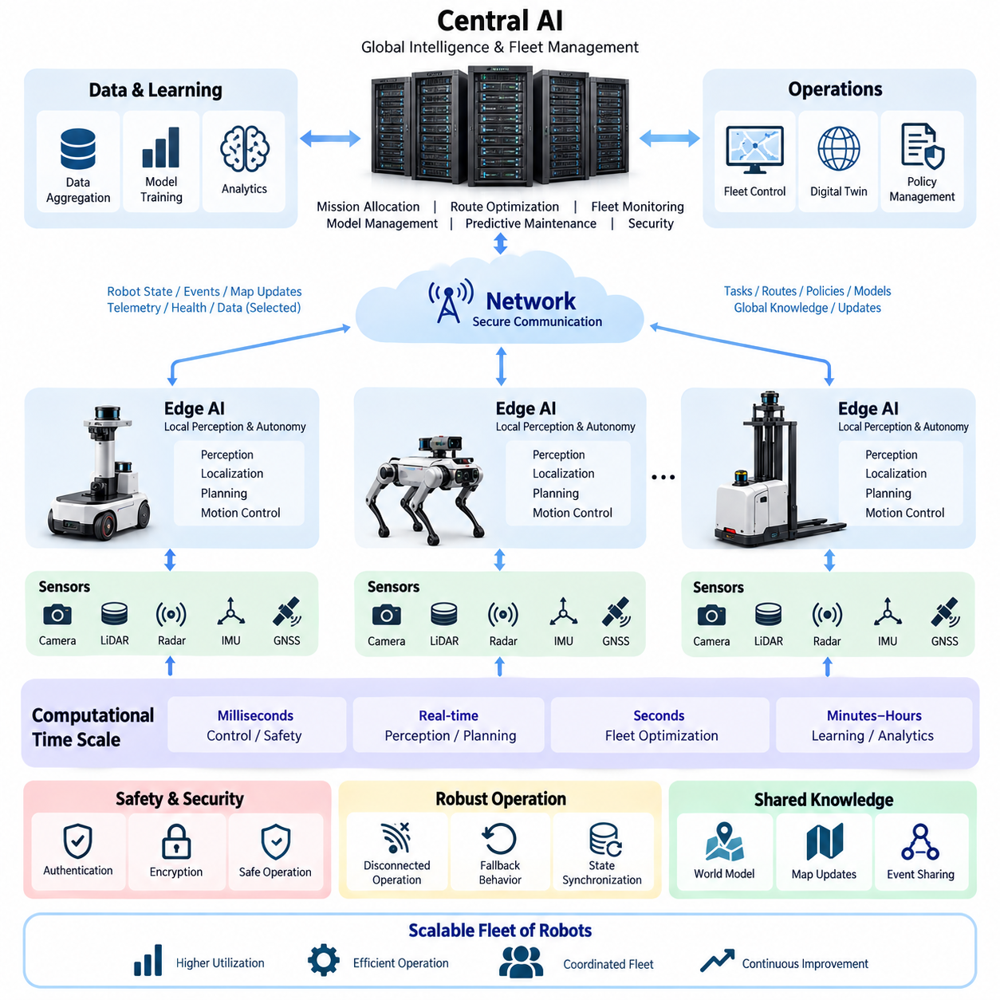
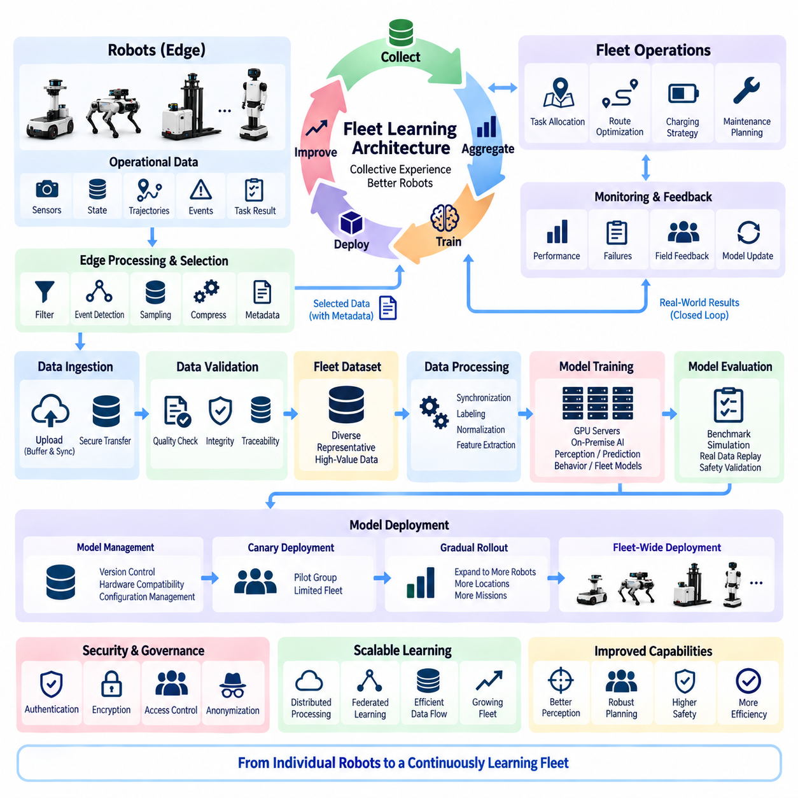
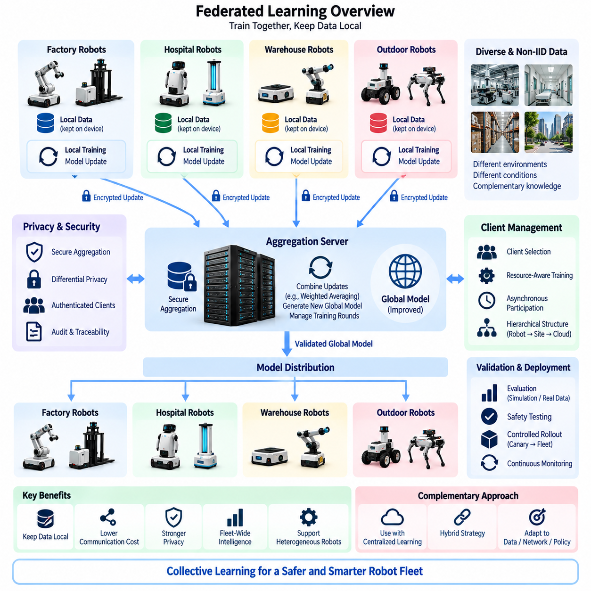
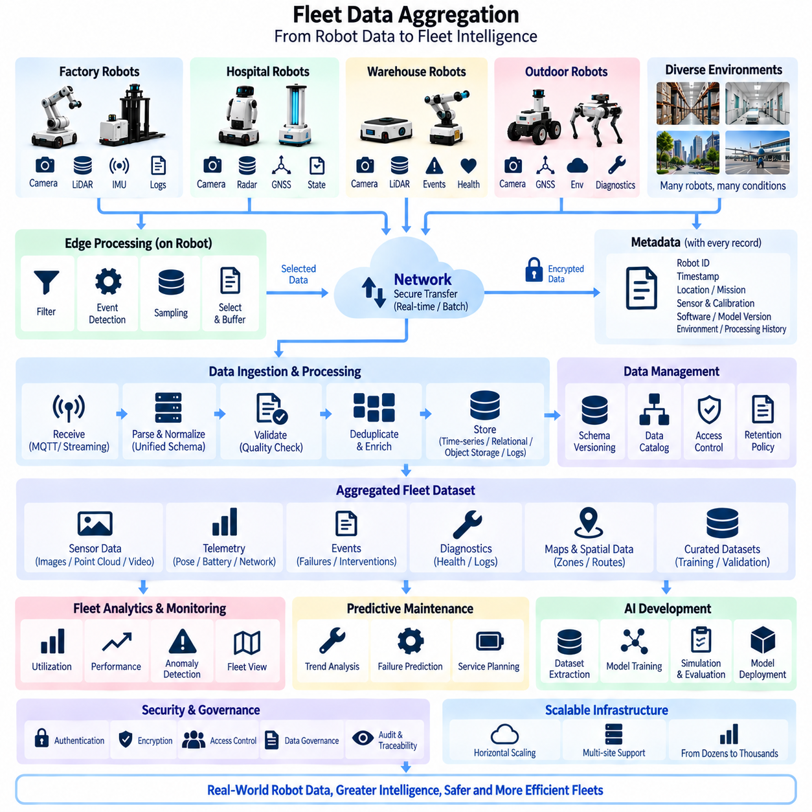
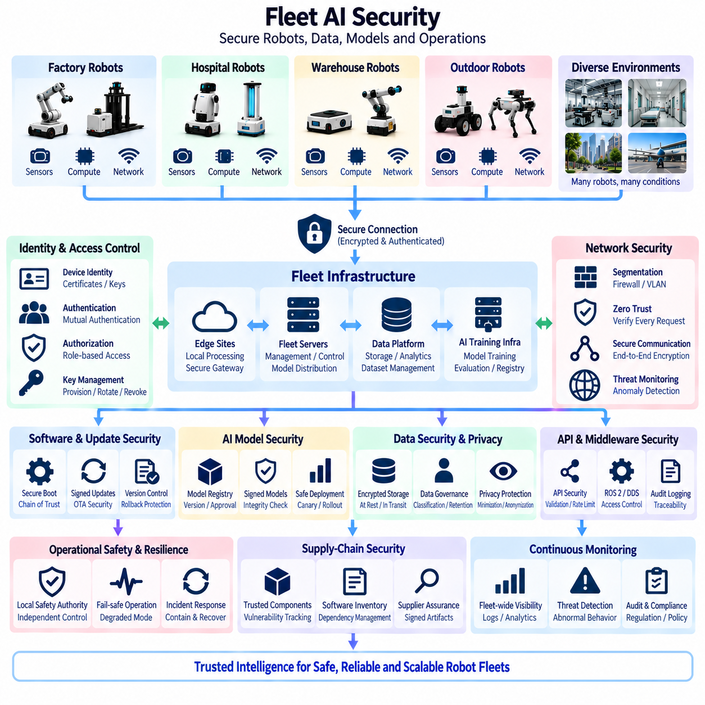

**Volume 16 Compute and AI Architecture**


# Chapter 07. Fleet AI

##  

## 07.01. Central AI/Distributed Execution

{width="7.268055555555556in" height="7.268055555555556in"}

Fleet AI becomes necessary when autonomous robots are no longer treated as isolated machines but as members of a coordinated operational system. A single robot may execute perception, localization, planning, and motion control locally, while a fleet-level intelligence layer observes the collective state of many robots. Central AI therefore focuses on coordination, optimization, policy management, and shared intelligence rather than replacing onboard autonomy.

Central AI with distributed execution separates fleet-wide reasoning from time-critical physical control. Computationally expensive analysis can be performed by an on-premise GPU server or central computing cluster, while each robot retains sufficient edge computing capability to operate independently. This separation prevents network latency or temporary communication loss from directly interrupting essential navigation, obstacle avoidance, braking, actuator control, or other safety-critical functions.

The central layer maintains a global representation of fleet conditions. It can combine robot position, mission state, battery level, payload condition, traffic information, charging availability, diagnostic status, and environmental observations into a common operational view. Because the central system observes conditions that are invisible to an individual robot, it can make decisions based on the overall efficiency and stability of the fleet rather than optimizing only one robot at a time.

Distributed execution places immediate perception and control close to the physical system. Cameras, LiDAR, radar, IMU, GNSS, and other sensors generate data that must often be interpreted within milliseconds. Transmitting every raw sensor stream to a remote server would create unnecessary bandwidth demand and unpredictable latency. Edge AI therefore processes high-rate sensor information locally and communicates selected states, events, features, or compressed observations to the central intelligence layer.

The architecture naturally produces several computational time scales. Motor control and emergency responses operate at the shortest intervals, local perception and trajectory generation operate at real-time robotic frequencies, and fleet optimization may operate over longer intervals. Model distribution, analytics, learning, and operational planning can occur even more slowly. Separating these time scales allows each computational task to be assigned to hardware and communication resources appropriate to its timing requirements.

A fundamental design principle is that central intelligence should provide objectives and constraints rather than continuous low-level actuator commands. The central system may assign a destination, mission priority, operating zone, traffic constraint, charging request, or behavioral policy. The robot then converts these higher-level instructions into locally executable trajectories and control actions. This preserves responsive physical behavior while still allowing coordinated fleet-wide operation.

Mission allocation is one of the strongest reasons for centralized intelligence. When multiple robots are available, the fleet controller can determine which platform should perform a task by considering distance, battery state, payload capability, sensor configuration, maintenance condition, workload, and mission priority. The resulting assignment can improve utilization because decisions are based on the state of the complete fleet instead of the limited knowledge available to individual robots.

Traffic coordination extends this concept from task assignment to shared-space management. Robots operating in corridors, intersections, elevators, loading areas, charging stations, gates, or narrow outdoor passages may compete for limited resources. Central AI can predict conflicts and coordinate priorities before physical congestion develops. Local robots nevertheless retain responsibility for immediate collision avoidance because unexpected people, vehicles, or obstacles cannot safely depend on remote decision latency.

Central AI can also provide global route optimization while local planners handle detailed motion. The fleet layer may select preferred corridors, reserve shared resources, distribute traffic, or redirect robots around congestion. The onboard planner then interprets the assigned route using current sensor observations and local maps. This hierarchical relationship combines the strategic advantage of global information with the responsiveness of local perception and planning.

Communication between central AI and distributed robots should therefore carry semantic information whenever practical rather than unrestricted raw data. Typical exchanges include robot pose, health state, task progress, detected events, map changes, resource requests, trajectory intentions, and policy updates. High-bandwidth sensor data may still be transferred for selected diagnostics, recording, retraining, or difficult cases, but continuous raw-data transmission should not be assumed as the normal operational mode.

A well-designed fleet architecture must explicitly tolerate communication degradation. Wireless networks can experience delay, packet loss, handover, interference, congestion, or complete temporary disconnection. The robot should therefore maintain a defined autonomous operating envelope when the central connection disappears. Depending on mission risk, it may continue the current task, move to a safe location, reduce speed, wait for reconnection, or execute a predefined fallback behavior rather than immediately becoming uncontrollable.

State synchronization becomes important when intelligence is divided across central and edge systems. The central server needs sufficiently recent information to reason about fleet conditions, while each robot must understand whether received commands are current and valid. Timestamps, sequence identifiers, version information, acknowledgments, and expiration rules can prevent stale instructions from being executed. Consistent time synchronization further improves event reconstruction, diagnostics, and multi-robot coordination.

The central layer can maintain a fleet-level world representation constructed from observations contributed by many robots. One robot may detect an obstruction, environmental change, restricted area, degraded road condition, or temporary traffic pattern that is relevant to other robots. After validation, the information can be incorporated into shared operational knowledge. Fleet intelligence consequently transforms individual observations into reusable knowledge that benefits robots that have never directly observed the original event.

This shared knowledge does not imply that every robot must maintain an identical internal world model. Different platforms may have different sensors, compute resources, mobility capabilities, or mission roles. Central AI can preserve a common semantic representation while distributing only the information required by each platform. A lightweight indoor AMR and a high-performance outdoor inspection robot can therefore participate in the same fleet architecture without requiring identical onboard hardware.

Hardware partitioning follows the same principle. MCU and ECU layers handle deterministic interfaces and low-level control, Jetson-class or industrial edge computers execute perception and autonomous functions, and centralized GPU servers provide heavier AI computation, analytics, optimization, and model lifecycle services. This layered arrangement fits the broader compute architecture in which MCU, ECU, Jetson, Edge PC, GPU Server, On-Premise AI, Fleet AI, and Physical AI form progressively broader computational scopes.

Central computing resources can execute algorithms that would be inefficient to replicate continuously on every robot. Large-scale scheduling, fleet simulation, global optimization, historical analytics, map consolidation, large AI models, and cross-robot inference can use server-class GPUs and larger memory pools. The results can then be transformed into compact policies, embeddings, routes, parameters, or models suitable for deployment to edge platforms with limited power and thermal budgets.

Distributed execution also improves scalability because the central server does not need to process every control cycle of every machine. As fleet size increases, robots continue performing most high-frequency computation locally, while the central system handles information whose value comes from aggregation. Scalable fleet architecture therefore depends not only on increasing server capacity but also on controlling message frequency, data granularity, computational placement, and the boundaries of central responsibility.

AI model deployment becomes another important central function. A validated perception, prediction, or behavior model can be registered centrally, associated with hardware compatibility and operating constraints, and distributed to selected robots. Deployment may proceed gradually through test groups before fleet-wide activation. Each robot should verify model integrity, version compatibility, available compute resources, and required dependencies before activating the new model in operational execution.

The architecture should also support rollback because a newer model is not automatically safer or more effective in every operating condition. Central management can observe performance after deployment and compare operational indicators across model versions. If unexpected behavior appears, affected robots can return to a previously validated configuration. Model versioning therefore becomes part of fleet configuration management rather than merely an AI development convenience.

Central AI can further support predictive fleet operation by analyzing historical and current telemetry across multiple machines. Repeated increases in motor current, thermal behavior, vibration, localization failures, sensor degradation, communication errors, or battery abnormalities may reveal patterns that are difficult to recognize from a single robot. Fleet-wide analysis can convert these distributed signals into maintenance priorities and operational restrictions before failures propagate into mission interruption.

Security boundaries must remain consistent with the distributed architecture. Central commands should be authenticated, robot identities should be controlled, communication should be protected, and software or model artifacts should be integrity-checked before execution. A compromised central service could otherwise influence many robots simultaneously, while a compromised robot could inject misleading fleet information. Trust therefore needs to be established in both directions rather than assuming that internal network participants are inherently trustworthy.

Safety authority must remain clearly separated from optimization authority. Fleet AI may recommend faster routes, higher utilization, closer scheduling, or different mission priorities, but these objectives cannot override local safety constraints. A robot should reject or modify a centrally generated instruction when local perception, safety logic, operating limits, or hardware protection mechanisms indicate that execution is unsafe. Distributed safety enforcement creates a final protective boundary around physical action.

The same separation becomes increasingly important as Physical AI models become more capable. A central VLA or other large multimodal model may interpret fleet context, reason about missions, or generate high-level action intentions, while onboard systems translate those intentions into validated executable behavior. Large-model reasoning can therefore contribute strategic intelligence without being directly connected to unrestricted actuator authority, reducing the consequences of uncertain or inappropriate model outputs.

Observability is essential because decisions are distributed across multiple computational layers. Operators and engineers need to reconstruct which component generated a mission, which policy version was active, what the robot perceived, why local execution deviated from a central request, and whether communication conditions affected the outcome. Structured telemetry, synchronized logs, event traces, model identifiers, and decision records provide the evidence required for diagnosis and continuous improvement.

Central AI and distributed execution ultimately form a hierarchical intelligence architecture rather than a simple client-server system. Central computing contributes global knowledge, fleet optimization, learning, coordination, and lifecycle management, while edge systems preserve real-time perception, autonomy, and physical control. The boundary between them should be determined by latency, bandwidth, safety, computational cost, resilience, and the geographic scope of information required for each decision.

This architecture also provides the foundation for the remaining Fleet AI functions in the volume. Once central intelligence and distributed execution are clearly separated, fleet learning can use experience gathered across robots, federated approaches can reduce unnecessary movement of sensitive data, aggregation pipelines can organize operational information, and fleet security can protect shared models and control channels. These capabilities extend the same principle: learn globally where beneficial, but execute physical intelligence locally where necessary.

함대 인공지능(Fleet AI)은 자율 로봇(Autonomous Robot)을 더 이상 독립적으로 동작하는 개별 기계로 보지 않고, 서로 협력하는 하나의 운영 시스템(Operational System)의 구성원으로 다룰 때 필요해진다. 개별 로봇은 인지(Perception), 위치추정(Localization), 계획(Planning), 운동 제어(Motion Control)를 로컬(Local)에서 수행할 수 있으며, 함대 수준 지능 계층(Fleet-Level Intelligence Layer)은 여러 로봇의 전체 상태를 관찰한다. 따라서 중앙 인공지능(Central AI)은 온보드 자율성(Onboard Autonomy)을 대체하기보다 조정(Coordination), 최적화(Optimization), 정책 관리(Policy Management), 공유 지능(Shared Intelligence)에 집중한다.

중앙 인공지능 기반 분산 실행(Central AI with Distributed Execution)은 함대 전체의 추론(Fleet-Wide Reasoning)과 시간 임계적인 물리 제어(Time-Critical Physical Control)를 분리한다. 계산량이 많은 분석은 온프레미스 GPU 서버(On-Premise GPU Server) 또는 중앙 컴퓨팅 클러스터(Central Computing Cluster)에서 수행하고, 각 로봇은 독립적으로 작동할 수 있는 충분한 엣지 컴퓨팅(Edge Computing) 능력을 유지한다. 이러한 분리는 네트워크 지연이나 일시적인 통신 단절이 필수적인 주행 및 안전 기능을 직접 중단시키는 것을 방지한다.

중앙 계층(Central Layer)은 함대 상태에 대한 전역 표현(Global Representation)을 유지한다. 로봇 위치, 임무 상태, 배터리 수준, 적재 상태, 교통 정보, 충전 가능 여부, 진단 상태, 환경 관측 정보를 결합하여 공통 운영 뷰(Common Operational View)를 구성할 수 있다. 중앙 시스템은 개별 로봇이 확인할 수 없는 전체 상황을 관찰하기 때문에 하나의 로봇만을 최적화하는 대신 함대 전체의 효율성과 안정성을 기준으로 의사결정을 수행할 수 있다.

분산 실행(Distributed Execution)은 즉각적인 인지와 제어를 물리 시스템 가까이에 배치한다. 카메라(Camera), 라이다(LiDAR), 레이더(Radar), 관성측정장치(IMU), 위성항법시스템(GNSS) 등의 센서는 수 밀리초 이내에 해석해야 하는 데이터를 생성할 수 있다. 모든 원시 센서 스트림(Raw Sensor Stream)을 원격 서버로 전송하면 불필요한 대역폭과 예측하기 어려운 지연이 발생한다. 따라서 엣지 인공지능(Edge AI)이 고속 센서 정보를 로컬에서 처리하고 선택된 상태, 이벤트, 특징 또는 압축된 관측 정보만 중앙 지능 계층으로 전달한다.

이 아키텍처(Architecture)는 자연스럽게 여러 계산 시간 척도(Computational Time Scale)를 형성한다. 모터 제어와 비상 대응은 가장 짧은 주기로 작동하며, 로컬 인지와 궤적 생성(Trajectory Generation)은 실시간 로봇 주기로 수행된다. 함대 최적화(Fleet Optimization)는 상대적으로 긴 주기로 수행할 수 있고, 모델 배포(Model Distribution), 분석(Analytics), 학습(Learning), 운영 계획(Operational Planning)은 더 느린 주기로 실행할 수 있다. 이러한 시간 척도의 분리를 통해 각 계산 작업을 요구되는 시간 특성에 적합한 하드웨어와 통신 자원에 할당할 수 있다.

중요한 설계 원칙은 중앙 지능(Central Intelligence)이 연속적인 저수준 액추에이터 명령(Low-Level Actuator Command)을 전달하는 대신 목표(Objective)와 제약조건(Constraint)을 제공하도록 하는 것이다. 중앙 시스템은 목적지, 임무 우선순위, 운영 영역, 교통 제약, 충전 요청 또는 행동 정책(Behavioral Policy)을 지정할 수 있다. 이후 로봇이 이러한 상위 수준 명령을 로컬에서 실행 가능한 궤적과 제어 동작으로 변환한다. 이를 통해 함대 전체의 협조 운영을 유지하면서도 물리적 행동의 즉각적인 반응성을 확보할 수 있다.

임무 할당(Mission Allocation)은 중앙 집중형 지능(Centralized Intelligence)이 필요한 가장 중요한 이유 중 하나이다. 여러 로봇을 사용할 수 있는 경우 함대 제어기(Fleet Controller)는 거리, 배터리 상태, 적재 능력, 센서 구성, 유지보수 상태, 작업 부하, 임무 우선순위를 고려하여 어떤 플랫폼이 작업을 수행할지 결정할 수 있다. 이러한 할당은 개별 로봇이 가진 제한된 정보가 아니라 전체 함대의 상태를 기반으로 이루어지므로 로봇 활용률(Utilization)을 향상시킬 수 있다.

교통 조정(Traffic Coordination)은 이러한 개념을 작업 할당에서 공유 공간 관리(Shared-Space Management)로 확장한다. 복도, 교차로, 엘리베이터, 적재 구역, 충전소, 게이트 또는 좁은 실외 통로에서 작동하는 로봇은 제한된 자원을 두고 경쟁할 수 있다. 중앙 인공지능은 충돌 가능성을 예측하고 실제 정체가 발생하기 전에 우선순위를 조정할 수 있다. 그러나 예상하지 못한 사람, 차량 또는 장애물에 대한 대응은 원격 의사결정 지연에 의존할 수 없으므로 즉각적인 충돌 회피(Immediate Collision Avoidance)는 로컬 로봇이 담당해야 한다.

중앙 인공지능은 전역 경로 최적화(Global Route Optimization)를 제공하고, 로컬 플래너(Local Planner)는 세부적인 움직임을 처리할 수 있다. 함대 계층은 선호 통로를 선택하고, 공유 자원을 예약하며, 교통량을 분산하거나 정체 구역을 우회하도록 로봇을 재지정할 수 있다. 이후 온보드 플래너(Onboard Planner)는 현재 센서 관측과 로컬 지도(Local Map)를 이용하여 할당된 경로를 해석한다. 이러한 계층적 관계(Hierarchical Relationship)는 전역 정보의 전략적 장점과 로컬 인지 및 계획의 즉각적인 대응성을 결합한다.

따라서 중앙 인공지능과 분산 로봇 사이의 통신은 가능한 경우 제한 없는 원시 데이터보다 의미 정보(Semantic Information)를 전달하도록 설계해야 한다. 대표적인 교환 정보에는 로봇 자세(Robot Pose), 상태 정보(Health State), 작업 진행 상황, 감지 이벤트, 지도 변경, 자원 요청, 궤적 의도(Trajectory Intention), 정책 업데이트 등이 포함된다. 고대역폭 센서 데이터는 특정 진단, 기록, 재학습(Retraining), 어려운 사례 분석을 위해 전송할 수 있지만 지속적인 원시 데이터 전송을 정상적인 운영 방식으로 가정해서는 안 된다.

잘 설계된 함대 아키텍처(Fleet Architecture)는 통신 성능 저하를 명시적으로 허용해야 한다. 무선 네트워크는 지연, 패킷 손실(Packet Loss), 핸드오버(Handover), 간섭, 혼잡 또는 일시적인 완전 단절을 경험할 수 있다. 따라서 중앙 연결이 사라지더라도 로봇은 정의된 자율 운용 범위(Autonomous Operating Envelope)를 유지해야 한다. 임무 위험도에 따라 현재 작업을 계속하거나 안전한 위치로 이동하고, 속도를 낮추거나 재연결을 기다리거나 미리 정의된 폴백 행동(Fallback Behavior)을 수행해야 한다.

상태 동기화(State Synchronization)는 지능이 중앙 시스템과 엣지 시스템에 분산될 때 중요해진다. 중앙 서버는 함대 상태를 판단할 수 있을 정도로 최신 정보를 확보해야 하며, 각 로봇은 수신된 명령이 현재 유효한 것인지 판단할 수 있어야 한다. 타임스탬프(Timestamp), 시퀀스 식별자(Sequence Identifier), 버전 정보, 승인 응답(Acknowledgment), 만료 규칙(Expiration Rule)을 사용하면 오래된 명령이 실행되는 것을 방지할 수 있다. 일관된 시간 동기화(Time Synchronization)는 이벤트 재구성, 진단 및 다중 로봇 조정에도 기여한다.

중앙 계층은 여러 로봇이 제공하는 관측 정보를 이용하여 함대 수준 세계 표현(Fleet-Level World Representation)을 유지할 수 있다. 한 로봇이 장애물, 환경 변화, 제한 구역, 노면 상태 악화 또는 일시적인 교통 패턴을 발견하면 해당 정보가 다른 로봇에도 중요할 수 있다. 검증된 정보는 공유 운영 지식(Shared Operational Knowledge)에 통합될 수 있다. 따라서 함대 지능은 개별 로봇의 관측을 원래 상황을 직접 경험하지 않은 다른 로봇도 활용할 수 있는 재사용 가능한 지식으로 변환한다.

이러한 공유 지식(Shared Knowledge)이 모든 로봇이 동일한 내부 세계 모델(Internal World Model)을 유지해야 한다는 의미는 아니다. 플랫폼마다 센서, 컴퓨팅 자원, 이동 능력 또는 임무 역할이 다를 수 있다. 중앙 인공지능은 공통 의미 표현(Common Semantic Representation)을 유지하면서 각 플랫폼에 필요한 정보만 배포할 수 있다. 따라서 경량 실내 자율이동로봇(Indoor AMR)과 고성능 실외 점검 로봇(Outdoor Inspection Robot)이 동일한 함대 아키텍처에 참여하면서도 동일한 온보드 하드웨어를 사용할 필요는 없다.

하드웨어 분할(Hardware Partitioning)도 동일한 원칙을 따른다. 마이크로컨트롤러(MCU)와 전자제어장치(ECU) 계층은 결정론적 인터페이스와 저수준 제어를 담당하고, 젯슨급(Jetson-Class) 또는 산업용 엣지 컴퓨터(Industrial Edge Computer)는 인지와 자율주행 기능을 실행하며, 중앙 GPU 서버(Centralized GPU Server)는 고부하 인공지능 계산, 분석, 최적화 및 모델 수명주기 서비스를 담당한다. 이러한 계층 구조는 MCU, ECU, Jetson, Edge PC, GPU Server, On-Premise AI, Fleet AI, Physical AI로 계산 범위가 점차 확장되는 전체 컴퓨팅 아키텍처와 연결된다.

중앙 컴퓨팅 자원(Central Computing Resource)은 모든 로봇에 지속적으로 복제하기에는 비효율적인 알고리즘을 실행할 수 있다. 대규모 스케줄링, 함대 시뮬레이션(Fleet Simulation), 전역 최적화, 이력 분석, 지도 통합(Map Consolidation), 대형 인공지능 모델(Large AI Model), 교차 로봇 추론(Cross-Robot Inference)은 서버급 GPU와 대용량 메모리를 활용할 수 있다. 그 결과를 엣지 플랫폼의 제한된 전력 및 열 설계 범위에서 실행 가능한 정책, 임베딩(Embedding), 경로, 파라미터 또는 모델 형태로 변환하여 배포할 수 있다.

분산 실행은 중앙 서버가 모든 로봇의 모든 제어 주기를 처리할 필요가 없으므로 확장성(Scalability)도 향상시킨다. 함대 규모가 증가하더라도 로봇은 대부분의 고주파 계산을 로컬에서 계속 수행하고, 중앙 시스템은 집계(Aggregation)를 통해 가치가 증가하는 정보를 처리한다. 따라서 확장 가능한 함대 아키텍처는 단순한 서버 용량 증설뿐만 아니라 메시지 주기, 데이터 세분성(Data Granularity), 계산 배치(Computational Placement), 중앙 책임 범위의 적절한 제어에 의해 결정된다.

인공지능 모델 배포(AI Model Deployment)는 또 하나의 중요한 중앙 기능이 된다. 검증된 인지, 예측 또는 행동 모델을 중앙에 등록하고 하드웨어 호환성 및 운영 제약조건과 연결한 후 선택된 로봇에 배포할 수 있다. 전체 함대에 적용하기 전에 시험 그룹을 대상으로 단계적으로 배포할 수도 있다. 각 로봇은 새로운 모델을 실제 운영에 활성화하기 전에 모델 무결성(Model Integrity), 버전 호환성, 사용 가능한 컴퓨팅 자원 및 필수 의존성을 확인해야 한다.

새로운 모델이 모든 운영 조건에서 자동으로 더 안전하거나 효과적인 것은 아니므로 아키텍처는 롤백(Rollback)도 지원해야 한다. 중앙 관리 시스템은 배포 이후 성능을 관찰하고 서로 다른 모델 버전의 운영 지표를 비교할 수 있다. 예상하지 못한 행동이 나타나면 해당 로봇을 이전에 검증된 구성으로 복귀시킬 수 있다. 따라서 모델 버전 관리(Model Versioning)는 단순한 인공지능 개발 편의 기능이 아니라 함대 구성 관리(Fleet Configuration Management)의 일부가 된다.

중앙 인공지능은 여러 로봇의 현재 및 과거 텔레메트리(Telemetry)를 분석하여 예측형 함대 운영(Predictive Fleet Operation)을 지원할 수도 있다. 모터 전류 증가, 열 거동, 진동, 위치추정 실패, 센서 성능 저하, 통신 오류 또는 배터리 이상이 반복되면 하나의 로봇만 분석해서는 발견하기 어려운 패턴이 나타날 수 있다. 함대 전체 분석은 이러한 분산 신호를 고장으로 인한 임무 중단이 발생하기 전에 유지보수 우선순위와 운영 제한으로 변환할 수 있다.

보안 경계(Security Boundary)는 분산 아키텍처와 일관되게 유지되어야 한다. 중앙 명령은 인증(Authentication)되어야 하고, 로봇 식별 정보(Identity)는 통제되어야 하며, 통신은 보호되고 소프트웨어와 모델 산출물은 실행 전에 무결성을 확인해야 한다. 중앙 서비스가 침해되면 여러 로봇에 동시에 영향을 줄 수 있고, 반대로 침해된 로봇이 잘못된 함대 정보를 주입할 수도 있다. 따라서 내부 네트워크 참여자를 무조건 신뢰하기보다 양방향으로 신뢰(Trust)를 확립해야 한다.

안전 권한(Safety Authority)은 최적화 권한(Optimization Authority)과 명확하게 분리되어야 한다. 함대 인공지능은 더 빠른 경로, 높은 활용률, 긴밀한 일정 또는 다른 임무 우선순위를 권고할 수 있지만 이러한 목표가 로컬 안전 제약(Local Safety Constraint)을 무시해서는 안 된다. 로컬 인지, 안전 로직, 운용 한계 또는 하드웨어 보호 메커니즘이 실행을 위험하다고 판단하면 로봇은 중앙에서 생성된 명령을 거부하거나 수정해야 한다. 분산 안전 집행(Distributed Safety Enforcement)은 물리적 행동을 보호하는 최종 경계를 형성한다.

피지컬 인공지능(Physical AI) 모델의 능력이 향상될수록 이러한 분리는 더욱 중요해진다. 중앙 비전-언어-행동 모델(Vision-Language-Action Model, VLA) 또는 다른 대형 멀티모달 모델(Large Multimodal Model)은 함대 상황을 해석하고 임무를 추론하거나 상위 수준 행동 의도(Action Intention)를 생성할 수 있다. 반면 온보드 시스템은 이러한 의도를 검증된 실행 가능 행동으로 변환한다. 따라서 대형 모델의 추론 능력을 전략적 지능에 활용하면서도 액추에이터에 대한 무제한 직접 제어 권한을 부여하지 않아 불확실하거나 부적절한 모델 출력의 영향을 줄일 수 있다.

관측 가능성(Observability)은 의사결정이 여러 계산 계층에 분산되기 때문에 필수적이다. 운영자와 엔지니어는 어떤 구성요소가 임무를 생성했는지, 어떤 정책 버전이 활성화되어 있었는지, 로봇이 무엇을 인지했는지, 로컬 실행이 중앙 요청과 달라진 이유가 무엇인지, 통신 상태가 결과에 영향을 주었는지를 재구성할 수 있어야 한다. 구조화된 텔레메트리, 동기화된 로그, 이벤트 추적(Event Trace), 모델 식별자 및 의사결정 기록은 진단과 지속적인 개선에 필요한 근거를 제공한다.

중앙 인공지능과 분산 실행은 궁극적으로 단순한 클라이언트-서버 시스템(Client-Server System)이 아니라 계층형 지능 아키텍처(Hierarchical Intelligence Architecture)를 구성한다. 중앙 컴퓨팅은 전역 지식, 함대 최적화, 학습, 조정 및 수명주기 관리를 제공하고, 엣지 시스템은 실시간 인지, 자율성 및 물리 제어를 유지한다. 두 영역의 경계는 지연시간(Latency), 대역폭(Bandwidth), 안전(Safety), 계산 비용, 복원력(Resilience), 그리고 각 의사결정에 필요한 정보의 지리적 범위에 따라 결정되어야 한다.

이 아키텍처는 본 볼륨(Volume)의 이후 함대 인공지능 기능을 위한 기반도 제공한다. 중앙 지능과 분산 실행의 역할이 명확히 분리되면 함대 학습(Fleet Learning)은 여러 로봇에서 수집한 경험을 활용할 수 있고, 연합학습(Federated Learning)은 민감한 데이터의 불필요한 이동을 줄일 수 있으며, 함대 데이터 집계(Fleet Data Aggregation)는 운영 정보를 체계화할 수 있다. 또한 함대 인공지능 보안(Fleet AI Security)은 공유 모델과 제어 채널을 보호할 수 있다. 이러한 기능은 모두 동일한 원칙, 즉 유리한 경우에는 전역적으로 학습하고 물리적 실행이 필요한 곳에서는 로컬에서 지능을 실행한다는 원칙을 확장한다.

##  

## 07.02. Fleet Learning Architecture

{width="7.268055555555556in" height="7.268055555555556in"}

Fleet learning extends autonomous robot intelligence from individual experience to collective improvement across an entire fleet. Instead of allowing each robot to learn only from its own missions, operational experiences from many robots are collected, organized, analyzed, and converted into reusable knowledge. This creates a continuous learning architecture in which every deployed robot can contribute to improving perception, prediction, planning, diagnostics, and operational policies for future fleet operation.

The architecture begins at the robot edge, where each platform continuously produces operational observations while performing its assigned mission. These observations may include sensor measurements, localization results, trajectories, detected objects, environmental conditions, control responses, system health, task outcomes, and exceptional events. Because raw robotic data can be extremely large, the edge system should determine which information has sufficient learning value before transferring it to fleet infrastructure.

Local data selection is therefore an important component of fleet learning. Routine operation may generate millions of similar frames that provide little additional information, while unusual obstacles, localization failures, near-collision situations, difficult lighting, unexpected human behavior, sensor degradation, or unsuccessful planning decisions may have significantly greater training value. Event-driven collection and intelligent sampling can reduce storage and communication requirements while preserving informative examples.

Each selected observation should be accompanied by contextual metadata that explains how and why the data was generated. Robot identity, hardware configuration, software version, AI model version, sensor calibration, timestamp, location context, mission type, environmental condition, and execution result can all influence interpretation. Without this context, two apparently similar sensor sequences may represent fundamentally different operational situations and could produce misleading conclusions during training or evaluation.

Fleet learning requires a structured data ingestion pipeline between distributed robots and centralized learning infrastructure. Robot data can first be buffered locally and transferred when network conditions, bandwidth, and operational policies permit. High-priority events may be uploaded immediately, while large sensor recordings can be transferred later through high-bandwidth connections. This asynchronous approach prevents learning traffic from competing unnecessarily with real-time command, telemetry, and safety communication.

After ingestion, fleet data must pass through validation and quality-control processes before becoming part of a training dataset. Corrupted files, incomplete sensor sequences, invalid timestamps, calibration inconsistencies, duplicated samples, or incompatible software versions should be detected. Data provenance should also be retained so that engineers can trace a training sample back to the robot, mission, configuration, and processing pipeline that produced it.

Centralized aggregation allows observations from many robots to be organized into a shared fleet dataset. The objective is not simply to accumulate the largest possible volume of information but to create representative coverage of the operational domain. Data should capture different environments, robot configurations, weather conditions, lighting, traffic patterns, object classes, mission types, failure modes, and rare events so that models do not become optimized only for frequently observed conditions.

The learning pipeline can transform collected data into training-ready representations through filtering, synchronization, labeling, annotation, normalization, and feature extraction. Multi-sensor observations may require temporal alignment among cameras, LiDAR, radar, IMU, GNSS, and robot state information. Accurate synchronization is particularly important when learning relationships between perception and physical action because incorrect timing can associate an observation with the wrong robot response.

Label generation can combine manual annotation, automated labeling, existing model predictions, simulation, and rule-based processing. Human review remains useful for ambiguous or safety-relevant examples, while automated pipelines can process large volumes of routine data. Active learning can further prioritize samples where current models show high uncertainty, disagreement, or poor performance, allowing annotation resources to focus on information likely to produce the greatest model improvement.

Fleet learning is especially valuable for discovering long-tail scenarios that individual robots encounter only rarely. A single robot may operate for months without experiencing a particular obstacle configuration or environmental failure, while hundreds of deployed robots collectively encounter many such cases. Aggregating these experiences increases the probability that rare but important situations become visible to the learning system and can be incorporated into future model development.

Training infrastructure can use the aggregated dataset to improve perception, prediction, behavior, or fleet-level models. GPU servers and on-premise AI infrastructure are suitable for computationally intensive retraining because they provide substantially greater compute and storage capacity than individual robot platforms. Training can begin from an existing validated model rather than rebuilding intelligence from the beginning whenever new fleet experience becomes available.

Continuous learning should not mean that every newly collected sample immediately changes deployed models. A controlled learning cycle separates data collection, dataset preparation, model training, evaluation, approval, deployment, and monitoring. This separation prevents unstable or poorly understood model changes from automatically reaching physical machines. Fleet learning therefore combines rapid accumulation of operational knowledge with disciplined model lifecycle management.

Evaluation should compare candidate models against validated baselines using both common scenarios and difficult fleet-derived cases. Performance can be measured across perception accuracy, prediction quality, planning success, robustness, computational latency, resource consumption, and mission-level outcomes. Safety-relevant scenarios deserve separate evaluation because an improvement in average model accuracy does not necessarily imply improvement in the rare conditions that determine operational risk.

Simulation and recorded-data replay can provide an intermediate validation layer before deployment to real robots. Newly trained models can be exposed to previously observed fleet scenarios, synthetic variations, difficult environmental conditions, and known failure cases without immediately affecting physical operation. Hardware-in-the-loop or robot-in-the-loop testing can then confirm that model behavior remains compatible with actual compute, sensors, communication, and control interfaces.

Once a model passes validation, deployment should proceed incrementally rather than updating the complete fleet simultaneously. A small group of representative robots can operate as a canary fleet or pilot group, allowing engineers to compare new and previous model behavior under real conditions. If operational indicators remain acceptable, deployment can gradually expand to additional robots, locations, or mission categories until the validated model becomes the fleet baseline.

Model distribution must account for differences among robot platforms. A fleet may contain multiple generations of compute hardware, sensors, mobility systems, and mission-specific configurations. Central model management should therefore associate each model with compatible hardware, required sensor inputs, memory requirements, inference latency, software dependencies, and operating constraints. Fleet learning becomes practical only when learned intelligence can be reliably mapped back onto heterogeneous physical platforms.

Feedback after deployment closes the learning loop. Robots operating with the new model generate fresh telemetry, events, confidence values, failures, and mission outcomes that can be compared with previous versions. If the new model improves performance, the evidence supports broader deployment. If unexpected regressions appear, deployment can be stopped or rolled back while the problematic cases are returned to the dataset for additional analysis and retraining.

This closed-loop process creates a cycle of deployment, observation, learning, validation, and redeployment. The fleet gradually becomes a distributed sensing and experience-generation system, while centralized infrastructure acts as the knowledge integration and model improvement layer. The value of a deployed robot therefore extends beyond completing its immediate mission because its operational experience can contribute to improving other robots across the fleet.

Fleet learning can also improve functions beyond perception models. Historical mission data can support better task allocation, route selection, charging strategies, congestion prediction, maintenance scheduling, and resource utilization. Repeated operational patterns may reveal which robot configuration performs best in particular environments or which mission policies create unnecessary energy consumption, waiting time, or component wear. Learning can consequently optimize both robot intelligence and fleet operations.

Shared learning must nevertheless preserve the distinction between global knowledge and local execution. A centrally improved model may encode experience gathered from many robots, but real-time inference and physical control can still occur at the edge. This allows fleet-wide experience to influence individual behavior without making every action dependent on continuous connectivity to the learning server. Learned intelligence can therefore be centralized during development and distributed during execution.

Data governance becomes increasingly important as fleet learning scales. Collected information may contain operationally sensitive environments, people, customer facilities, geographic information, or proprietary processes. Access control, encryption, retention policies, anonymization, audit records, and dataset permissions should therefore accompany the technical learning pipeline. The architecture should define not only how data is collected but also who can use it, for what purpose, and for how long.

Security must protect both directions of the learning cycle. Uploaded robot data should be authenticated so that manipulated observations cannot silently contaminate training datasets, while downloaded models should be verified before activation to prevent unauthorized software from reaching physical systems. Dataset integrity, model signatures, version control, secure transport, and controlled deployment authority collectively protect the fleet learning chain from data collection through execution.

Fleet learning also requires strong observability and reproducibility. Engineers should be able to determine which dataset produced a particular model, which training configuration was used, which evaluation results justified deployment, and which robots currently execute that version. Dataset versions, model registries, experiment records, deployment histories, and fleet telemetry create traceability across the complete AI lifecycle and make systematic investigation possible when unexpected behavior occurs.

As fleet size grows, the learning architecture can evolve from periodic centralized retraining toward more distributed approaches. Some preprocessing, feature extraction, event detection, or adaptation may occur directly on robots, reducing unnecessary data movement. In environments where raw data cannot leave the robot or operating site, federated learning can allow local training contributions to be aggregated without requiring every original dataset to be centrally transferred.

Fleet learning architecture therefore connects edge robots, communication networks, data aggregation, on-premise AI infrastructure, GPU training systems, model management, validation, and distributed deployment into one continuous intelligence lifecycle. It occupies the logical bridge between Central AI Distributed Execution and the following Federated Learning, Fleet Data Aggregation, and Fleet AI Security topics defined within the Fleet AI chapter of the Compute and AI Architecture structure.

The long-term objective is a fleet whose intelligence improves as operational experience accumulates. Individual robots remain responsible for responsive and safe physical execution, while collective experience is transformed into increasingly capable models and operational policies. Through controlled feedback loops, representative datasets, rigorous validation, secure deployment, and continuous monitoring, fleet learning converts many autonomous machines into a coordinated learning ecosystem rather than a collection of independently evolving robots.

함대 학습(Fleet Learning)은 자율 로봇(Autonomous Robot)의 지능을 개별 경험에서 전체 함대의 집단적 개선(Collective Improvement)으로 확장한다. 각 로봇이 자신의 임무에서 얻은 경험만으로 학습하도록 하는 대신, 여러 로봇의 운영 경험(Operational Experience)을 수집하고 체계화하며 분석하여 재사용 가능한 지식(Reusable Knowledge)으로 변환한다. 이를 통해 배치된 모든 로봇이 향후 함대의 인지, 예측, 계획, 진단 및 운영 정책을 개선하는 데 기여할 수 있는 지속적 학습 아키텍처(Continuous Learning Architecture)가 형성된다.

아키텍처는 로봇 엣지(Robot Edge)에서 시작되며, 각 플랫폼은 할당된 임무를 수행하면서 지속적으로 운영 관측 정보(Operational Observation)를 생성한다. 여기에는 센서 측정값, 위치추정 결과, 궤적(Trajectory), 탐지 객체, 환경 조건, 제어 응답, 시스템 상태, 작업 결과 및 예외 이벤트(Exceptional Event)가 포함될 수 있다. 로봇의 원시 데이터(Raw Data)는 매우 방대할 수 있으므로 엣지 시스템은 어떤 정보가 충분한 학습 가치(Learning Value)를 갖는지 판단한 후 함대 인프라로 전송해야 한다.

따라서 로컬 데이터 선택(Local Data Selection)은 함대 학습의 중요한 구성요소이다. 일상적인 운용에서는 추가적인 정보 가치가 거의 없는 수많은 유사 프레임이 생성될 수 있지만, 비정상적인 장애물, 위치추정 실패, 충돌 근접 상황, 어려운 조명 조건, 예상하지 못한 사람의 행동, 센서 성능 저하 또는 실패한 계획 결정은 훨씬 높은 학습 가치를 가질 수 있다. 이벤트 기반 수집(Event-Driven Collection)과 지능형 샘플링(Intelligent Sampling)을 사용하면 유용한 사례를 유지하면서 저장공간과 통신 요구량을 줄일 수 있다.

선택된 각 관측 정보에는 해당 데이터가 어떻게 그리고 왜 생성되었는지를 설명하는 상황 메타데이터(Contextual Metadata)가 함께 제공되어야 한다. 로봇 식별자, 하드웨어 구성, 소프트웨어 버전, 인공지능 모델 버전, 센서 보정 정보, 타임스탬프(Timestamp), 위치 상황, 임무 유형, 환경 조건 및 실행 결과는 모두 데이터 해석에 영향을 줄 수 있다. 이러한 상황 정보가 없으면 겉으로 유사한 두 센서 시퀀스가 실제로는 완전히 다른 운영 상황을 나타낼 수 있으며, 학습이나 평가 과정에서 잘못된 결론으로 이어질 수 있다.

함대 학습에는 분산된 로봇과 중앙 학습 인프라(Centralized Learning Infrastructure)를 연결하는 구조화된 데이터 수집 파이프라인(Data Ingestion Pipeline)이 필요하다. 로봇 데이터는 먼저 로컬에 버퍼링(Buffering)한 후 네트워크 상태, 대역폭 및 운영 정책이 허용할 때 전송할 수 있다. 우선순위가 높은 이벤트는 즉시 업로드하고 대용량 센서 기록은 고대역폭 연결을 통해 나중에 전송할 수 있다. 이러한 비동기 방식(Asynchronous Approach)은 학습 트래픽이 실시간 명령, 텔레메트리 및 안전 통신과 불필요하게 경쟁하는 것을 방지한다.

수집된 함대 데이터는 학습 데이터셋(Training Dataset)에 포함되기 전에 검증 및 품질 관리(Validation and Quality Control) 과정을 거쳐야 한다. 손상된 파일, 불완전한 센서 시퀀스, 잘못된 타임스탬프, 보정 불일치, 중복 샘플 또는 호환되지 않는 소프트웨어 버전을 탐지해야 한다. 또한 데이터 출처 추적성(Data Provenance)을 유지하여 엔지니어가 특정 학습 샘플을 생성한 로봇, 임무, 구성 및 처리 파이프라인까지 추적할 수 있도록 해야 한다.

중앙 집중형 집계(Centralized Aggregation)를 사용하면 여러 로봇에서 수집된 관측 정보를 공유 함대 데이터셋(Shared Fleet Dataset)으로 구성할 수 있다. 목적은 단순히 가능한 한 많은 데이터를 축적하는 것이 아니라 실제 운영 영역(Operational Domain)을 대표할 수 있는 범위를 확보하는 것이다. 서로 다른 환경, 로봇 구성, 기상 조건, 조명, 교통 패턴, 객체 종류, 임무 유형, 고장 모드 및 희귀 이벤트를 포함해야 모델이 빈번하게 관측되는 조건에만 최적화되는 것을 방지할 수 있다.

학습 파이프라인(Learning Pipeline)은 수집된 데이터를 필터링, 동기화, 라벨링(Labeling), 어노테이션(Annotation), 정규화(Normalization), 특징 추출(Feature Extraction)을 통해 학습 가능한 표현으로 변환할 수 있다. 다중 센서 관측은 카메라, 라이다(LiDAR), 레이더(Radar), 관성측정장치(IMU), 위성항법시스템(GNSS), 로봇 상태 정보 사이의 시간 정렬(Temporal Alignment)이 필요할 수 있다. 특히 인지와 물리적 행동 사이의 관계를 학습할 때 부정확한 동기화는 관측 정보와 잘못된 로봇 행동을 연결할 수 있으므로 정확한 시간 동기화가 중요하다.

라벨 생성(Label Generation)은 수동 어노테이션, 자동 라벨링, 기존 모델의 예측, 시뮬레이션 및 규칙 기반 처리(Rule-Based Processing)를 조합하여 수행할 수 있다. 모호하거나 안전과 관련된 사례에는 사람의 검토(Human Review)가 여전히 중요하며, 자동화된 파이프라인은 대량의 일상 데이터를 처리할 수 있다. 능동학습(Active Learning)은 현재 모델의 불확실성, 의견 불일치 또는 성능 저하가 높은 샘플을 우선 처리하여 모델 개선 효과가 클 가능성이 높은 정보에 어노테이션 자원을 집중하도록 할 수 있다.

함대 학습은 개별 로봇이 매우 드물게 경험하는 롱테일 시나리오(Long-Tail Scenario)를 발견하는 데 특히 유용하다. 하나의 로봇은 수개월 동안 특정 장애물 구성이나 환경적 실패를 한 번도 경험하지 않을 수 있지만, 수백 대의 로봇이 배치된 함대에서는 이러한 사례가 집단적으로 발생할 가능성이 높아진다. 경험을 집계함으로써 드물지만 중요한 상황이 학습 시스템에 노출되고 향후 모델 개발에 반영될 가능성을 높일 수 있다.

학습 인프라(Training Infrastructure)는 집계된 데이터셋을 이용하여 인지, 예측, 행동 또는 함대 수준 모델(Fleet-Level Model)을 개선할 수 있다. GPU 서버와 온프레미스 인공지능 인프라(On-Premise AI Infrastructure)는 개별 로봇 플랫폼보다 훨씬 높은 컴퓨팅 및 저장 능력을 제공하므로 계산량이 많은 재학습(Retraining)에 적합하다. 새로운 함대 경험이 추가될 때마다 처음부터 지능을 다시 구축하기보다는 기존에 검증된 모델을 기반으로 학습을 계속할 수 있다.

지속적 학습(Continuous Learning)은 새롭게 수집된 모든 샘플이 즉시 배포된 모델을 변경한다는 의미가 아니다. 통제된 학습 주기(Controlled Learning Cycle)는 데이터 수집, 데이터셋 준비, 모델 학습, 평가, 승인, 배포 및 모니터링을 분리한다. 이러한 분리는 불안정하거나 충분히 이해되지 않은 모델 변경이 물리적 로봇에 자동으로 적용되는 것을 방지한다. 따라서 함대 학습은 운영 지식을 빠르게 축적하면서도 엄격한 모델 수명주기 관리(Model Lifecycle Management)를 함께 수행해야 한다.

평가(Evaluation)는 일반적인 시나리오와 함대에서 수집된 어려운 사례를 모두 이용하여 후보 모델(Candidate Model)과 검증된 기준 모델(Validated Baseline)을 비교해야 한다. 성능은 인지 정확도, 예측 품질, 계획 성공률, 강건성(Robustness), 계산 지연시간, 자원 소비 및 임무 수준 결과를 기준으로 측정할 수 있다. 평균 모델 정확도의 향상이 운영 위험을 결정하는 희귀 조건의 개선을 반드시 의미하지는 않으므로 안전 관련 시나리오는 별도로 평가할 필요가 있다.

시뮬레이션(Simulation)과 기록 데이터 재생(Recorded-Data Replay)은 실제 로봇에 배포하기 전에 중간 검증 계층(Intermediate Validation Layer)을 제공할 수 있다. 새롭게 학습된 모델을 과거 함대 시나리오, 합성 변형(Synthetic Variation), 어려운 환경 조건 및 알려진 실패 사례에 적용하여 물리적 운영에 직접 영향을 주지 않고 검증할 수 있다. 이후 하드웨어 인더루프(Hardware-in-the-Loop) 또는 로봇 인더루프(Robot-in-the-Loop) 시험을 통해 모델이 실제 컴퓨팅, 센서, 통신 및 제어 인터페이스와 호환되는지 확인할 수 있다.

모델이 검증을 통과하면 전체 함대를 동시에 업데이트하기보다 단계적으로 배포해야 한다. 대표적인 소수의 로봇을 카나리 함대(Canary Fleet) 또는 파일럿 그룹(Pilot Group)으로 운영하여 실제 환경에서 신규 모델과 이전 모델의 행동을 비교할 수 있다. 운영 지표가 허용 범위 내에서 유지되면 추가 로봇, 운영 장소 또는 임무 범주로 점진적으로 배포를 확대하고 최종적으로 검증된 모델을 함대 기준 모델(Fleet Baseline)로 적용할 수 있다.

모델 배포(Model Distribution)는 로봇 플랫폼 간의 차이를 고려해야 한다. 함대에는 서로 다른 세대의 컴퓨팅 하드웨어, 센서, 이동 시스템 및 임무별 구성이 존재할 수 있다. 따라서 중앙 모델 관리(Central Model Management)는 각 모델을 호환 가능한 하드웨어, 필수 센서 입력, 메모리 요구량, 추론 지연시간(Inference Latency), 소프트웨어 의존성 및 운영 제약조건과 연결해야 한다. 학습된 지능을 이기종 물리 플랫폼(Heterogeneous Physical Platform)에 신뢰성 있게 다시 적용할 수 있을 때 함대 학습이 실질적인 의미를 갖는다.

배포 이후의 피드백(Feedback)은 학습 루프(Learning Loop)를 완성한다. 새로운 모델을 사용하는 로봇은 새로운 텔레메트리, 이벤트, 신뢰도 값, 실패 사례 및 임무 결과를 생성하며, 이를 이전 버전의 결과와 비교할 수 있다. 새로운 모델이 성능을 개선하면 더 넓은 배포를 위한 근거가 되고, 예상하지 못한 성능 저하가 나타나면 배포를 중단하거나 롤백(Rollback)한 후 문제가 된 사례를 데이터셋으로 반환하여 추가 분석과 재학습에 활용할 수 있다.

이러한 폐루프 과정(Closed-Loop Process)은 배포, 관측, 학습, 검증 및 재배포의 순환 구조를 형성한다. 함대는 점차 분산형 감지 및 경험 생성 시스템(Distributed Sensing and Experience-Generation System)으로 발전하고, 중앙 인프라는 지식 통합(Knowledge Integration)과 모델 개선 계층으로 기능한다. 따라서 배치된 로봇의 가치는 현재 할당된 임무를 수행하는 것에 그치지 않고, 해당 로봇의 운영 경험이 전체 함대의 다른 로봇을 개선하는 데 활용될 수 있다는 데까지 확장된다.

함대 학습은 인지 모델 이외의 기능도 개선할 수 있다. 과거 임무 데이터는 더 나은 작업 할당, 경로 선택, 충전 전략, 혼잡 예측, 유지보수 일정 및 자원 활용 최적화를 지원할 수 있다. 반복되는 운영 패턴을 분석하면 특정 환경에서 어떤 로봇 구성이 가장 높은 성능을 보이는지 또는 어떤 임무 정책이 불필요한 에너지 소비, 대기시간이나 부품 마모를 발생시키는지 파악할 수 있다. 따라서 학습은 개별 로봇 지능뿐만 아니라 전체 함대 운영도 최적화할 수 있다.

공유 학습(Shared Learning)은 전역 지식(Global Knowledge)과 로컬 실행(Local Execution)의 구분을 유지해야 한다. 중앙에서 개선된 모델은 여러 로봇에서 수집된 경험을 포함할 수 있지만, 실시간 추론과 물리적 제어는 여전히 엣지에서 수행할 수 있다. 이를 통해 모든 행동을 학습 서버와의 지속적인 연결에 의존하지 않으면서 함대 전체의 경험을 개별 로봇 행동에 반영할 수 있다. 따라서 학습 과정에서는 지능을 중앙화하고 실행 과정에서는 분산할 수 있다.

함대 학습의 규모가 확대될수록 데이터 거버넌스(Data Governance)의 중요성도 증가한다. 수집된 정보에는 운영상 민감한 환경, 사람, 고객 시설, 지리 정보 또는 독점적인 업무 프로세스가 포함될 수 있다. 따라서 접근 제어(Access Control), 암호화(Encryption), 보존 정책(Retention Policy), 익명화(Anonymization), 감사 기록(Audit Record), 데이터셋 권한 관리가 기술적 학습 파이프라인과 함께 적용되어야 한다. 아키텍처는 데이터 수집 방법뿐만 아니라 누가 어떤 목적으로 얼마 동안 데이터를 사용할 수 있는지도 정의해야 한다.

보안(Security)은 학습 주기의 양방향을 모두 보호해야 한다. 업로드되는 로봇 데이터는 조작된 관측 정보가 학습 데이터셋을 오염시키지 않도록 인증되어야 하며, 다운로드되는 모델은 승인되지 않은 소프트웨어가 물리 시스템에 적용되는 것을 방지하기 위해 활성화 전에 검증되어야 한다. 데이터셋 무결성(Dataset Integrity), 모델 서명(Model Signature), 버전 관리, 보안 전송(Secure Transport), 통제된 배포 권한이 결합되어 데이터 수집부터 실행까지 전체 함대 학습 체인을 보호한다.

함대 학습에는 높은 수준의 관측 가능성(Observability)과 재현성(Reproducibility)도 필요하다. 엔지니어는 특정 모델이 어떤 데이터셋에서 생성되었는지, 어떤 학습 구성이 사용되었는지, 어떤 평가 결과를 근거로 배포가 승인되었는지, 현재 어떤 로봇이 해당 버전을 실행하고 있는지를 확인할 수 있어야 한다. 데이터셋 버전, 모델 레지스트리(Model Registry), 실험 기록, 배포 이력 및 함대 텔레메트리는 전체 인공지능 수명주기의 추적성(Traceability)을 제공하고 예상하지 못한 행동이 발생했을 때 체계적인 분석을 가능하게 한다.

함대 규모가 증가하면 학습 아키텍처는 주기적인 중앙 재학습(Periodic Centralized Retraining)에서 더욱 분산된 방식으로 발전할 수 있다. 일부 전처리, 특징 추출, 이벤트 탐지 또는 적응(Adaptation)을 로봇에서 직접 수행하여 불필요한 데이터 이동을 줄일 수 있다. 원시 데이터가 로봇이나 운영 현장을 벗어날 수 없는 환경에서는 연합학습(Federated Learning)을 사용하여 모든 원본 데이터셋을 중앙으로 전송하지 않고도 로컬 학습 결과를 집계할 수 있다.

따라서 함대 학습 아키텍처(Fleet Learning Architecture)는 엣지 로봇(Edge Robot), 통신 네트워크, 데이터 집계(Data Aggregation), 온프레미스 인공지능 인프라, GPU 학습 시스템, 모델 관리, 검증 및 분산 배포를 하나의 연속적인 지능 수명주기(Continuous Intelligence Lifecycle)로 연결한다. 이는 컴퓨팅 및 인공지능 아키텍처(Compute and AI Architecture)의 함대 인공지능(Fleet AI) 장에서 중앙 인공지능 분산 실행(Central AI Distributed Execution)과 이후의 연합학습(Federated Learning), 함대 데이터 집계(Fleet Data Aggregation), 함대 인공지능 보안(Fleet AI Security)을 연결하는 논리적 가교 역할을 한다.

장기적인 목표는 운영 경험이 축적될수록 지능이 지속적으로 향상되는 함대를 구축하는 것이다. 개별 로봇은 신속하고 안전한 물리적 실행을 계속 담당하며, 집단 경험(Collective Experience)은 점점 더 높은 성능의 모델과 운영 정책으로 변환된다. 통제된 피드백 루프(Controlled Feedback Loop), 대표성 있는 데이터셋, 엄격한 검증, 안전한 배포 및 지속적인 모니터링을 통해 함대 학습은 다수의 자율 기계를 서로 독립적으로 진화하는 로봇의 집합이 아니라 하나의 협조형 학습 생태계(Coordinated Learning Ecosystem)로 전환한다.

##  

## 07.03. Federated Learning Overview

{width="7.268055555555556in" height="7.268055555555556in"}

Federated learning enables a robot fleet to improve shared AI models without requiring every robot to transfer its complete local dataset to a central training system. Instead of moving raw operational data, participating robots or edge sites perform selected training operations locally and transmit model updates to an aggregation server. The server combines these contributions into an improved global model and redistributes the resulting model to participating fleet members.

This approach extends the fleet learning architecture by changing where learning computation occurs and what information moves across the network. In conventional centralized learning, robot observations are collected into a shared dataset before training. In federated learning, significant portions of the training data can remain on the robot, local edge server, or operating site. The architecture therefore moves computation toward the data rather than requiring all data to move toward centralized computation.

A typical federated learning cycle begins with a validated global model maintained by the central AI infrastructure. The model and its training configuration are distributed to selected participating clients. Each client trains or fine-tunes the model using locally available operational data for a defined period or number of optimization steps. The resulting parameters, gradients, or other model updates are then prepared for transmission without requiring the original sensor recordings to leave the local environment.

The central aggregation service receives updates from multiple participants and combines them to generate a new global model. A basic strategy can use weighted averaging so that contributions reflect the amount of local training data or another defined weighting policy. More advanced aggregation methods may account for differences in data quality, client reliability, hardware capability, operating environment, or model convergence behavior. Aggregation therefore becomes a controlled knowledge-integration process rather than simple file collection.

After aggregation, the candidate global model must still pass validation before operational deployment. Federated learning changes the training architecture but does not remove the need for model evaluation, safety testing, version management, and controlled rollout. The aggregated model can be tested against reference datasets, recorded fleet scenarios, simulation environments, known failure cases, and safety-critical benchmarks before being approved for deployment to physical robots.

The architecture is particularly valuable when fleet data is geographically distributed. Robots may operate in factories, hospitals, campuses, warehouses, smart cities, ports, or customer facilities where transferring complete sensor datasets to one central location is undesirable or restricted. Local training allows knowledge from these environments to contribute to global intelligence while reducing the amount of operational information that must cross organizational, geographic, or network boundaries.

Federated learning can also reduce communication requirements when raw robotic datasets are much larger than the corresponding model updates. Cameras, LiDAR, radar, audio, and other sensors can generate large continuous data streams, whereas selected parameter updates may be substantially smaller. The actual communication advantage depends on model size, update frequency, compression, and training configuration, so federated learning should be designed together with network bandwidth and edge compute constraints.

Local data distributions are rarely identical across a robot fleet. An indoor logistics robot may observe corridors, elevators, shelves, and people, while an outdoor inspection robot may encounter roads, vegetation, weather, vehicles, and infrastructure. Even robots of the same type may experience different lighting, floor materials, traffic density, or user behavior. Federated learning must therefore handle non-independent and non-identically distributed data, commonly described as non-IID data.

Non-IID data creates both value and difficulty. The diversity of local experience can improve the global model by exposing it to conditions unavailable at a single site, but strongly different local distributions can cause training updates to move in conflicting directions. Aggregation policies, client selection, learning rates, local training duration, and model personalization may therefore need to be adjusted so that fleet diversity improves generalization rather than destabilizing convergence.

Client selection determines which robots or edge sites participate in each training round. It may be inefficient to activate every robot simultaneously, particularly when robots have different mission schedules, battery levels, network conditions, compute resources, or available datasets. The central coordinator can select an appropriate subset according to learning objectives and operational constraints, allowing training to occur without unnecessarily interfering with the primary mission of the physical system.

Resource-aware participation is especially important for robots because training competes with perception, planning, control, logging, and other onboard workloads. Local learning should not reduce the compute capacity required for safe real-time operation. Training may therefore be scheduled while a robot is charging, idle, connected to high-bandwidth infrastructure, or operating below defined compute and thermal limits. Fleet learning must remain subordinate to mission execution and safety requirements.

Federated learning can operate at several physical levels. Training may occur directly on individual robots, on local edge computers serving groups of robots, or on site-level servers that aggregate data from a local fleet before participating in a broader federation. Hierarchical federated learning can combine these levels, allowing robot-level knowledge to be aggregated locally before selected updates are transmitted to regional or central infrastructure.

This hierarchical structure is useful for large fleets distributed across many facilities. A factory or customer site can maintain its own local learning domain while contributing selected model knowledge to a global fleet model. Such organization can reduce wide-area communication, support site-specific policies, and create clearer data governance boundaries. It also aligns naturally with an architecture containing robot edge computing, on-premise AI systems, and central fleet AI infrastructure.

Privacy is an important motivation for federated learning, but keeping raw data local does not automatically guarantee complete privacy. Model updates can potentially reveal information about local training data under certain attack conditions. Privacy-preserving mechanisms such as secure aggregation, update clipping, differential privacy, controlled participation, and encryption can therefore be incorporated depending on the sensitivity and risk profile of the robotic application.

Secure aggregation allows the central service to obtain a combined result without necessarily inspecting each participant\'s individual update in ordinary form. This can reduce exposure of site-specific learning information and strengthen trust boundaries between participants. Cryptographic protection, authenticated clients, secure communication channels, and controlled key management should accompany the aggregation mechanism so that only authorized fleet members can contribute to the learning process.

The architecture must also defend against malicious or defective participants. A compromised robot could intentionally submit manipulated updates, while a malfunctioning client could unintentionally contribute corrupted parameters. Model poisoning, backdoor behavior, abnormal gradients, and unreliable training results can damage the shared model because aggregation distributes knowledge across the fleet. Update validation, anomaly detection, reputation mechanisms, and robust aggregation can reduce these risks.

Client identity and software integrity therefore become fundamental parts of federated learning security. Before accepting an update, the coordinator should know which authorized robot or site produced it and which software, model, and training configuration were used. Signed artifacts, authenticated communication, trusted execution environments where appropriate, model version control, and audit records can provide traceability from each contribution to the resulting global model.

Federated learning must also tolerate unreliable connectivity. Mobile robots can disconnect, change wireless access points, enter coverage gaps, or become unavailable because of mission priorities. A practical coordinator should not assume that every selected client will return an update within the same period. Training protocols can accommodate partial participation, delayed updates, communication retries, or asynchronous aggregation depending on the consistency requirements of the learning process.

Model compression can further improve federated communication efficiency. Quantization, sparsification, selective parameter exchange, low-rank updates, or other compression techniques can reduce the amount of information transmitted during each learning round. These methods introduce tradeoffs among bandwidth, computation, convergence speed, and model quality, so compression policies should be evaluated using representative robot hardware and realistic network conditions rather than communication volume alone.

Personalization becomes useful when one global model cannot optimally represent every robot or operating environment. A common fleet model can provide broadly learned capabilities, while selected layers, adapters, parameters, or policies are locally adapted to a particular robot type or site. This creates a balance between global knowledge sharing and local specialization, allowing the fleet to benefit from collective experience without forcing heterogeneous robots into an identical behavioral model.

The relationship between federated learning and centralized fleet learning should therefore be complementary rather than exclusive. Some datasets may be appropriate for centralized collection and GPU-server training, while sensitive, high-volume, or site-restricted data may remain local and contribute through federated updates. A hybrid architecture can choose the learning path according to data sensitivity, bandwidth, computational resources, model type, operational policy, and regulatory requirements.

Central GPU servers remain important even when federated learning is adopted. They can maintain the global model, coordinate training rounds, aggregate updates, execute large-scale evaluation, manage model registries, perform simulation, and train components using centrally available datasets. Federated learning redistributes part of the training workload but does not eliminate the need for centralized AI infrastructure or disciplined machine learning operations.

Observability and reproducibility remain necessary throughout the federation. The system should record which clients participated, which global model initiated a round, which training configuration was applied, how updates were aggregated, and which evaluation results justified the next model version. These records allow engineers to investigate performance changes and reproduce the learning process when an unexpected regression appears after aggregation or deployment.

Federated learning ultimately creates a distributed knowledge-sharing mechanism for Fleet AI. Robots preserve local responsibility for real-time physical execution while contributing experience to collective model improvement. Central infrastructure coordinates learning and integrates knowledge without requiring unrestricted transfer of every raw observation. The resulting architecture supports scalable learning across heterogeneous robots, sites, networks, and operational environments while maintaining stronger control over data movement.

Within the Compute and AI Architecture structure, Federated Learning follows Central AI Distributed Execution and Fleet Learning Architecture and precedes Fleet Data Aggregation and Fleet AI Security. Together, these topics describe a progression from coordinated fleet execution toward collective learning, distributed training, systematic data management, and secure fleet-wide intelligence.

The long-term objective is not simply to train one global model but to create an adaptable learning ecosystem in which knowledge can move safely between robots without requiring all underlying experience to move with it. By combining local training, secure aggregation, heterogeneous client management, validation, personalization, controlled deployment, and continuous feedback, federated learning allows a robot fleet to transform geographically distributed experience into shared intelligence while preserving local autonomy and operational boundaries.

연합학습(Federated Learning)은 모든 로봇이 전체 로컬 데이터셋(Local Dataset)을 중앙 학습 시스템(Central Training System)으로 전송하지 않고도 로봇 함대(Robot Fleet)가 공유 인공지능 모델(Shared AI Model)을 개선할 수 있도록 한다. 원시 운영 데이터(Raw Operational Data)를 이동시키는 대신 참여 로봇 또는 엣지 사이트(Edge Site)가 선택된 학습 작업을 로컬에서 수행하고 모델 업데이트(Model Update)를 집계 서버(Aggregation Server)로 전송한다. 서버는 이러한 기여를 결합하여 개선된 전역 모델(Global Model)을 생성하고 그 결과를 참여하는 함대 구성원에게 다시 배포한다.

이 접근법은 학습 계산이 수행되는 위치와 네트워크를 통해 이동하는 정보의 종류를 변경함으로써 함대 학습 아키텍처(Fleet Learning Architecture)를 확장한다. 기존의 중앙 집중형 학습(Centralized Learning)에서는 로봇의 관측 데이터를 공유 데이터셋으로 수집한 후 학습한다. 연합학습에서는 상당한 양의 학습 데이터가 로봇, 로컬 엣지 서버(Local Edge Server) 또는 운영 현장에 그대로 유지될 수 있다. 따라서 모든 데이터를 중앙 컴퓨팅으로 이동시키는 대신 계산을 데이터가 존재하는 위치로 이동시키는 아키텍처를 구성한다.

일반적인 연합학습 주기(Federated Learning Cycle)는 중앙 인공지능 인프라(Central AI Infrastructure)가 관리하는 검증된 전역 모델에서 시작한다. 모델과 학습 구성(Training Configuration)을 선택된 참여 클라이언트(Participating Client)에 배포한다. 각 클라이언트는 로컬에서 사용할 수 있는 운영 데이터를 이용하여 정해진 기간 또는 최적화 단계 동안 모델을 학습하거나 미세조정(Fine-Tuning)한다. 이후 원본 센서 기록을 로컬 환경 외부로 전송하지 않고 결과 파라미터(Parameter), 그래디언트(Gradient) 또는 기타 모델 업데이트를 전송할 수 있도록 준비한다.

중앙 집계 서비스(Central Aggregation Service)는 여러 참여자로부터 업데이트를 수신하고 이를 결합하여 새로운 전역 모델을 생성한다. 기본적인 방법에서는 로컬 학습 데이터의 양이나 정의된 가중치 정책(Weighting Policy)을 반영한 가중 평균(Weighted Averaging)을 사용할 수 있다. 보다 발전된 집계 방법은 데이터 품질, 클라이언트 신뢰도, 하드웨어 성능, 운영 환경 또는 모델 수렴 특성(Model Convergence Behavior)의 차이를 고려할 수 있다. 따라서 집계는 단순한 파일 수집이 아니라 통제된 지식 통합 과정(Knowledge-Integration Process)이 된다.

집계 이후에도 후보 전역 모델(Candidate Global Model)은 실제 운영에 배포되기 전에 검증 과정을 통과해야 한다. 연합학습은 학습 아키텍처를 변경하지만 모델 평가(Model Evaluation), 안전 시험(Safety Testing), 버전 관리(Version Management), 통제된 배포(Controlled Rollout)의 필요성을 제거하지 않는다. 집계된 모델은 물리적 로봇에 배포 승인을 받기 전에 기준 데이터셋, 기록된 함대 시나리오, 시뮬레이션 환경, 알려진 실패 사례 및 안전 임계 벤치마크(Safety-Critical Benchmark)를 이용하여 시험할 수 있다.

이 아키텍처는 함대 데이터가 지리적으로 분산된 경우 특히 유용하다. 로봇은 공장, 병원, 캠퍼스, 창고, 스마트시티, 항만 또는 고객 시설에서 운영될 수 있으며, 이러한 환경에서는 전체 센서 데이터셋을 하나의 중앙 위치로 전송하는 것이 바람직하지 않거나 제한될 수 있다. 로컬 학습(Local Training)은 조직적, 지리적 또는 네트워크 경계를 넘어 이동해야 하는 운영 정보의 양을 줄이면서 이러한 환경에서 획득한 지식이 전역 지능(Global Intelligence)에 기여할 수 있도록 한다.

원시 로봇 데이터셋이 해당 모델 업데이트보다 훨씬 큰 경우 연합학습은 통신 요구량도 줄일 수 있다. 카메라(Camera), 라이다(LiDAR), 레이더(Radar), 오디오(Audio) 및 기타 센서는 대규모 연속 데이터 스트림을 생성할 수 있지만 선택된 파라미터 업데이트는 이보다 상당히 작을 수 있다. 실제 통신 효율은 모델 크기, 업데이트 주기, 압축(Compression), 학습 구성에 따라 달라지므로 연합학습은 네트워크 대역폭과 엣지 컴퓨팅 제약조건을 함께 고려하여 설계해야 한다.

로컬 데이터 분포(Local Data Distribution)는 로봇 함대 전체에서 동일한 경우가 거의 없다. 실내 물류 로봇은 복도, 엘리베이터, 선반 및 사람을 주로 관측하는 반면, 실외 점검 로봇은 도로, 식생, 날씨, 차량 및 기반시설을 경험할 수 있다. 동일한 종류의 로봇이라도 조명, 바닥 재질, 교통 밀도 또는 사용자 행동이 서로 다를 수 있다. 따라서 연합학습은 독립적이고 동일하게 분포하지 않는 데이터(Non-Independent and Non-Identically Distributed Data), 즉 비독립 동일분포 데이터(Non-IID Data)를 처리해야 한다.

비독립 동일분포 데이터(Non-IID Data)는 가치와 어려움을 동시에 제공한다. 다양한 로컬 경험은 하나의 현장에서는 얻을 수 없는 조건을 전역 모델에 제공하여 성능 향상에 기여할 수 있지만, 로컬 데이터 분포의 차이가 매우 크면 학습 업데이트가 서로 상충되는 방향으로 진행될 수 있다. 따라서 함대의 다양성이 모델 수렴을 불안정하게 만드는 대신 일반화(Generalization)를 향상시키도록 집계 정책, 클라이언트 선택, 학습률(Learning Rate), 로컬 학습 기간 및 모델 개인화(Model Personalization)를 조정해야 할 수 있다.

클라이언트 선택(Client Selection)은 각 학습 라운드(Training Round)에 어떤 로봇 또는 엣지 사이트가 참여할지를 결정한다. 로봇마다 임무 일정, 배터리 수준, 네트워크 상태, 컴퓨팅 자원 또는 사용 가능한 데이터셋이 다르기 때문에 모든 로봇을 동시에 활성화하는 것은 비효율적일 수 있다. 중앙 조정기(Central Coordinator)는 학습 목표와 운영 제약조건에 따라 적절한 참여 그룹을 선택하여 물리 시스템의 주요 임무를 불필요하게 방해하지 않으면서 학습을 수행할 수 있다.

자원 인식형 참여(Resource-Aware Participation)는 로봇에서 특히 중요하다. 학습은 인지, 계획, 제어, 로깅(Logging) 및 기타 온보드 작업과 컴퓨팅 자원을 공유하기 때문이다. 로컬 학습이 안전한 실시간 운영에 필요한 계산 능력을 감소시켜서는 안 된다. 따라서 로봇이 충전 중이거나 유휴 상태일 때, 고대역폭 인프라에 연결되었을 때 또는 정의된 컴퓨팅 및 열 한계(Thermal Limit) 이하에서 작동할 때 학습을 수행하도록 계획할 수 있다. 함대 학습은 항상 임무 수행과 안전 요구사항보다 하위 우선순위를 가져야 한다.

연합학습은 여러 물리적 계층(Physical Level)에서 수행될 수 있다. 개별 로봇에서 직접 학습하거나, 여러 로봇을 지원하는 로컬 엣지 컴퓨터(Local Edge Computer) 또는 더 넓은 연합에 참여하기 전에 로컬 함대의 데이터를 집계하는 사이트 수준 서버(Site-Level Server)에서 수행할 수 있다. 계층형 연합학습(Hierarchical Federated Learning)은 이러한 계층을 결합하여 로봇 수준의 지식을 로컬에서 먼저 집계한 후 선택된 업데이트를 지역 또는 중앙 인프라로 전송할 수 있도록 한다.

이러한 계층 구조(Hierarchical Structure)는 여러 시설에 분산된 대규모 함대에 유용하다. 공장이나 고객 사이트는 자체적인 로컬 학습 영역(Local Learning Domain)을 유지하면서 선택된 모델 지식을 전역 함대 모델(Global Fleet Model)에 제공할 수 있다. 이러한 구성은 광역 통신(Wide-Area Communication)을 줄이고 사이트별 정책을 지원하며 더욱 명확한 데이터 거버넌스 경계(Data Governance Boundary)를 형성할 수 있다. 또한 로봇 엣지 컴퓨팅, 온프레미스 인공지능 시스템(On-Premise AI System), 중앙 함대 인공지능 인프라(Central Fleet AI Infrastructure)로 구성되는 아키텍처와 자연스럽게 연결된다.

개인정보 보호(Privacy)는 연합학습의 중요한 도입 목적이지만 원시 데이터를 로컬에 유지한다고 해서 완전한 개인정보 보호가 자동으로 보장되는 것은 아니다. 특정 공격 조건에서는 모델 업데이트를 통해 로컬 학습 데이터에 관한 정보가 노출될 가능성이 있다. 따라서 로봇 응용의 데이터 민감도와 위험 수준에 따라 보안 집계(Secure Aggregation), 업데이트 클리핑(Update Clipping), 차등 개인정보 보호(Differential Privacy), 참여 통제 및 암호화(Encryption)와 같은 개인정보 보호 메커니즘을 적용할 수 있다.

보안 집계(Secure Aggregation)는 중앙 서비스가 일반적인 형태의 개별 참여자 업데이트를 직접 확인하지 않으면서 결합된 결과를 획득할 수 있도록 한다. 이를 통해 사이트별 학습 정보의 노출을 줄이고 참여자 사이의 신뢰 경계(Trust Boundary)를 강화할 수 있다. 승인된 함대 구성원만 학습 과정에 참여하도록 암호학적 보호(Cryptographic Protection), 클라이언트 인증, 보안 통신 채널 및 통제된 키 관리(Key Management)를 집계 메커니즘과 함께 적용해야 한다.

아키텍처는 악의적이거나 결함이 있는 참여자에 대해서도 방어할 수 있어야 한다. 침해된 로봇은 의도적으로 조작된 업데이트를 제출할 수 있으며, 고장 난 클라이언트는 의도하지 않게 손상된 파라미터를 제공할 수 있다. 모델 포이즈닝(Model Poisoning), 백도어 행동(Backdoor Behavior), 비정상 그래디언트(Abnormal Gradient) 및 신뢰할 수 없는 학습 결과는 집계를 통해 지식이 전체 함대로 확산되기 때문에 공유 모델에 피해를 줄 수 있다. 업데이트 검증, 이상 탐지(Anomaly Detection), 평판 메커니즘(Reputation Mechanism), 강건한 집계(Robust Aggregation)를 통해 이러한 위험을 줄일 수 있다.

따라서 클라이언트 신원(Client Identity)과 소프트웨어 무결성(Software Integrity)은 연합학습 보안의 기본 요소가 된다. 업데이트를 수락하기 전에 조정기는 어떤 승인된 로봇 또는 사이트에서 업데이트가 생성되었는지, 어떤 소프트웨어, 모델 및 학습 구성이 사용되었는지를 확인할 수 있어야 한다. 서명된 산출물(Signed Artifact), 인증된 통신, 필요한 경우 신뢰 실행 환경(Trusted Execution Environment), 모델 버전 관리 및 감사 기록(Audit Record)을 통해 각 기여가 최종 전역 모델에 반영되는 과정까지 추적할 수 있다.

연합학습은 불안정한 연결(Unreliable Connectivity)에도 대응해야 한다. 이동 로봇은 연결이 끊어지거나 무선 액세스 포인트(Wireless Access Point)를 변경하고, 통신 음영지역에 진입하거나 임무 우선순위 때문에 일시적으로 사용할 수 없는 상태가 될 수 있다. 실용적인 조정기는 선택된 모든 클라이언트가 동일한 시간 안에 업데이트를 반환할 것이라고 가정해서는 안 된다. 학습 프로토콜은 일관성 요구사항에 따라 부분 참여(Partial Participation), 지연 업데이트, 통신 재시도 또는 비동기 집계(Asynchronous Aggregation)를 지원할 수 있다.

모델 압축(Model Compression)은 연합 통신 효율(Federated Communication Efficiency)을 더욱 향상시킬 수 있다. 양자화(Quantization), 희소화(Sparsification), 선택적 파라미터 교환(Selective Parameter Exchange), 저랭크 업데이트(Low-Rank Update) 또는 기타 압축 기법을 통해 각 학습 라운드에서 전송되는 정보량을 줄일 수 있다. 이러한 방법에는 대역폭, 계산량, 수렴 속도 및 모델 품질 사이의 상충관계(Trade-Off)가 있으므로 통신량만을 기준으로 판단하기보다 대표적인 로봇 하드웨어와 실제 네트워크 환경에서 압축 정책을 평가해야 한다.

하나의 전역 모델이 모든 로봇 또는 운영 환경을 최적으로 표현할 수 없는 경우 개인화(Personalization)가 유용하다. 공통 함대 모델(Common Fleet Model)은 광범위하게 학습된 기능을 제공하고, 특정 계층, 어댑터(Adapter), 파라미터 또는 정책은 특정 로봇 유형이나 사이트에 맞게 로컬에서 적응시킬 수 있다. 이를 통해 전역 지식 공유(Global Knowledge Sharing)와 로컬 특화(Local Specialization) 사이의 균형을 형성하여 이기종 로봇을 동일한 행동 모델로 강제하지 않으면서 집단 경험의 장점을 활용할 수 있다.

따라서 연합학습과 중앙 집중형 함대 학습(Centralized Fleet Learning)의 관계는 상호 배타적이기보다 상호 보완적이어야 한다. 일부 데이터셋은 중앙 수집과 GPU 서버 학습에 적합할 수 있는 반면, 민감하거나 대용량이거나 사이트 외부 반출이 제한된 데이터는 로컬에 유지하면서 연합 업데이트를 통해 학습에 기여할 수 있다. 하이브리드 아키텍처(Hybrid Architecture)는 데이터 민감도, 대역폭, 컴퓨팅 자원, 모델 유형, 운영 정책 및 규제 요구사항에 따라 적절한 학습 경로를 선택할 수 있다.

연합학습을 적용하더라도 중앙 GPU 서버(Central GPU Server)는 여전히 중요하다. 중앙 서버는 전역 모델을 관리하고, 학습 라운드를 조정하며, 업데이트를 집계하고, 대규모 평가를 수행하고, 모델 레지스트리(Model Registry)를 관리하며, 시뮬레이션을 수행하고, 중앙에서 사용할 수 있는 데이터셋을 이용하여 일부 구성요소를 학습할 수 있다. 연합학습은 학습 작업의 일부를 분산시키지만 중앙 인공지능 인프라 또는 체계적인 머신러닝 운영(Machine Learning Operations)의 필요성을 제거하지 않는다.

연합 전체에서 관측 가능성(Observability)과 재현성(Reproducibility)도 유지되어야 한다. 시스템은 어떤 클라이언트가 참여했는지, 어떤 전역 모델로 학습 라운드를 시작했는지, 어떤 학습 구성이 적용되었는지, 업데이트가 어떤 방식으로 집계되었는지, 어떤 평가 결과를 근거로 다음 모델 버전이 결정되었는지를 기록해야 한다. 이러한 기록을 통해 엔지니어는 집계 또는 배포 이후 예상하지 못한 성능 저하가 발생했을 때 변화 원인을 분석하고 학습 과정을 재현할 수 있다.

궁극적으로 연합학습은 함대 인공지능(Fleet AI)을 위한 분산형 지식 공유 메커니즘(Distributed Knowledge-Sharing Mechanism)을 형성한다. 로봇은 실시간 물리 실행에 대한 로컬 책임을 유지하면서 집단적 모델 개선에 자신의 경험을 제공한다. 중앙 인프라는 모든 원시 관측 정보의 무제한 전송을 요구하지 않으면서 학습을 조정하고 지식을 통합한다. 이를 통해 이기종 로봇, 사이트, 네트워크 및 운영 환경에 걸쳐 확장 가능한 학습을 지원하면서 데이터 이동에 대한 통제력을 강화할 수 있다.

컴퓨팅 및 인공지능 아키텍처(Compute and AI Architecture) 구조에서 연합학습(Federated Learning)은 중앙 인공지능 분산 실행(Central AI Distributed Execution)과 함대 학습 아키텍처(Fleet Learning Architecture)의 다음에 위치하고, 함대 데이터 집계(Fleet Data Aggregation)와 함대 인공지능 보안(Fleet AI Security)에 앞서 구성된다. 이러한 주제들은 조정된 함대 실행에서 집단 학습, 분산 학습, 체계적인 데이터 관리 및 안전한 함대 전체 지능으로 발전하는 과정을 설명한다.

장기적인 목표는 단순히 하나의 전역 모델을 학습하는 것이 아니라, 기반이 되는 모든 경험 데이터를 함께 이동시키지 않고도 로봇 사이에서 지식을 안전하게 이동할 수 있는 적응형 학습 생태계(Adaptable Learning Ecosystem)를 구축하는 것이다. 로컬 학습, 보안 집계, 이기종 클라이언트 관리(Heterogeneous Client Management), 검증, 개인화, 통제된 배포 및 지속적인 피드백을 결합함으로써 연합학습은 로봇 함대가 로컬 자율성(Local Autonomy)과 운영 경계(Operational Boundary)를 유지하면서 지리적으로 분산된 경험을 공유 지능(Shared Intelligence)으로 변환할 수 있도록 한다.

##  

## 07.04. Fleet Data Aggregation

{width="7.268055555555556in" height="7.268055555555556in"}

Fleet data aggregation provides the information foundation that allows many autonomous robots to operate as a coordinated and continuously improving fleet. Each robot generates sensor observations, localization states, trajectories, mission events, diagnostics, system health information, and AI inference results. Aggregation converts these distributed streams into structured fleet-level information that can support monitoring, analytics, learning, optimization, maintenance, and future model development.

The first architectural challenge is deciding what information should leave each robot. Cameras, LiDAR, radar, audio, IMU, GNSS, and internal system logs can generate data at rates that make unrestricted transmission impractical. Edge processing should therefore classify information according to operational value, urgency, bandwidth requirements, retention needs, and learning importance before transferring selected data toward central or on-premise infrastructure.

Robot-generated information can be divided conceptually into high-frequency telemetry, operational events, AI results, diagnostic records, and large sensor datasets. Telemetry may describe pose, velocity, battery condition, temperature, network quality, or mission progress, while events identify failures, obstacles, safety interventions, or task transitions. Large sensor recordings can be retained selectively for difficult scenarios, incident reconstruction, model training, and validation rather than continuously uploaded.

Edge filtering reduces unnecessary duplication before aggregation begins. A robot operating repeatedly along the same route may produce thousands of nearly identical observations, while a rare localization failure or unexpected obstacle can contain significantly greater information value. Event detection, novelty scoring, confidence thresholds, temporal sampling, and configurable recording policies can prioritize high-value data while preserving sufficient routine information for statistical analysis and baseline comparison.

Local buffering is necessary because mobile robots cannot assume continuous high-bandwidth connectivity. Selected data can be temporarily stored on onboard SSD or other edge storage and transmitted according to network availability and operational priority. Critical events may be uploaded immediately, ordinary telemetry can use periodic transmission, and large datasets may wait until the robot reaches a charging station or reliable high-speed network connection.

Every aggregated record requires metadata that preserves its operational meaning. Robot identifier, platform type, hardware configuration, sensor configuration, software release, AI model version, calibration version, timestamp, mission identifier, environmental context, and processing history can all affect interpretation. Metadata transforms isolated files into traceable engineering evidence and allows later analysis to distinguish changes caused by environment, hardware, software, or model behavior.

Time synchronization is especially important when aggregating information from multiple sensors and multiple robots. Camera frames, LiDAR scans, IMU measurements, GNSS positions, control commands, AI outputs, and system events must be associated with consistent timestamps. PTP, GNSS-derived time, or other synchronization mechanisms can establish a common temporal reference so that distributed observations can be reconstructed and compared accurately during analysis.

The ingestion layer receives information from robots and converts heterogeneous streams into manageable data flows. Message brokers, telemetry services, file transfer mechanisms, databases, object storage, and streaming pipelines can be combined according to data type. Small state messages may require low-latency streaming, whereas multi-gigabyte sensor recordings are better handled through asynchronous file transfer and scalable storage services.

Aggregation should preserve separation between real-time operational data and large historical datasets. Fleet control requires current robot state with predictable latency, while AI development may require months of accumulated sensor information. Mixing these workloads without resource isolation can allow large uploads or analytical jobs to interfere with operational communication. Separate logical pipelines can therefore share infrastructure while maintaining different priorities and service requirements.

A fleet data platform commonly requires several storage forms because no single database is optimal for every robotic workload. Time-series storage can efficiently retain telemetry, relational databases can manage robot and mission metadata, object storage can hold images, point clouds, video, and training datasets, while log systems can preserve diagnostic events. A catalog or metadata layer can connect these resources into a searchable fleet information environment.

Data normalization makes information from heterogeneous robots comparable. Different platforms may report velocity in different units, use different coordinate frames, encode diagnostic states differently, or produce sensor data with different resolutions. Common schemas, units, coordinate conventions, naming rules, quality flags, and interface definitions reduce ambiguity and allow fleet applications to consume information without implementing unique interpretation logic for every robot model.

Schema evolution must be controlled because fleet systems change over time. New sensors, software functions, diagnostic fields, or AI outputs introduce additional data structures while older robots may continue using previous formats. Versioned schemas and backward-compatible interfaces allow the aggregation platform to accept information from multiple generations without forcing the entire fleet to upgrade simultaneously.

Data quality assessment should occur as information enters the aggregation system. Missing timestamps, impossible positions, corrupted files, duplicated events, invalid sensor ranges, inconsistent identifiers, or incomplete metadata can reduce analytical reliability. Automated validation can flag or quarantine suspicious records rather than allowing low-quality information to silently enter datasets used for operational decisions or AI training.

Deduplication is particularly important when communication retries or overlapping recording mechanisms produce repeated information. Hashes, event identifiers, timestamps, sequence numbers, and robot-specific keys can help determine whether records represent new observations or retransmissions. Reliable deduplication reduces unnecessary storage and prevents duplicated events from distorting fleet statistics, failure rates, or training dataset distributions.

Fleet aggregation should retain data provenance from the point of generation through every processing stage. Engineers should be able to determine which robot generated an observation, which sensor and calibration produced it, which software transformed it, and which dataset later incorporated it. Provenance supports debugging, reproducibility, safety investigation, dataset governance, and removal of affected information when a sensor or processing defect is discovered.

Spatial aggregation adds another dimension to fleet intelligence. Observations from different robots can be associated with common maps, zones, routes, buildings, or geographic coordinates. Multiple robots may report congestion, obstacles, surface conditions, wireless coverage, or environmental changes from different positions and times. Combining these observations can create a fleet-level representation that is more complete than the local map maintained by any single robot.

Event aggregation transforms individual incidents into operational patterns. A single motor temperature warning may not indicate a systematic problem, but similar warnings across several robots with the same hardware configuration may reveal a fleet-wide reliability issue. Likewise, repeated localization failures in one physical area may indicate environmental difficulty rather than independent robot faults. Aggregated evidence therefore supports both robot diagnostics and infrastructure diagnosis.

Fleet analytics can derive higher-level indicators from the aggregated data. Mission completion rate, travel distance, energy consumption, charging frequency, idle time, localization stability, intervention frequency, network availability, component temperatures, and AI confidence trends can be evaluated across robots, sites, and time periods. These indicators provide a quantitative basis for improving fleet utilization, reliability, and operational policy.

Aggregated information also supports predictive maintenance. Long-term trends in motor current, battery resistance, vibration, thermal behavior, wheel performance, sensor health, or communication errors can be compared across similar robots. Models can identify deviations from normal fleet behavior and estimate when maintenance should occur. This shifts service strategy from reacting to failures toward condition-based and predictive maintenance.

For AI development, the aggregation layer becomes the gateway between real-world operation and the training infrastructure. High-value sensor examples, failure cases, uncertain predictions, unusual environmental conditions, and operator interventions can be extracted from fleet storage and assembled into curated datasets. These datasets can then enter labeling, preprocessing, training, simulation, evaluation, and model management pipelines within the broader on-premise AI architecture.

Data aggregation also complements federated learning. Federated learning can keep sensitive raw datasets local while exchanging model updates, but centralized aggregation remains useful for telemetry, metadata, approved datasets, benchmark samples, and operational statistics. A practical fleet architecture can therefore combine centralized data aggregation and federated model learning rather than treating them as mutually exclusive approaches.

Bandwidth management should be integrated into aggregation policy. Data priority, compression, upload scheduling, network type, robot mission state, and available bandwidth can determine when and how information is transferred. Critical safety or diagnostic events may receive immediate priority, while large training datasets can use deferred transfer. Adaptive policies prevent data collection from degrading command, control, or mission-critical communication.

Retention policies determine how long different information remains available. High-frequency raw sensor data may require large storage capacity and can be retained selectively, while compact mission summaries or maintenance records may remain useful for years. Storage tiers can move older information from high-performance systems to lower-cost archives while preserving metadata that allows engineers to locate and restore historical datasets when necessary.

Security must protect fleet data throughout collection, transmission, storage, processing, and access. Robot identities should be authenticated, communication encrypted, storage permissions controlled, and sensitive datasets protected according to operational policy. Integrity mechanisms should detect unauthorized modification because corrupted telemetry or manipulated training information could influence fleet decisions, maintenance conclusions, or future AI models.

Data governance defines the organizational rules surrounding the technical aggregation pipeline. Ownership, access rights, retention, anonymization, customer restrictions, geographic constraints, and permitted AI uses should be associated with datasets and metadata. This becomes increasingly important when robots operate in hospitals, factories, public spaces, customer facilities, or other environments where operational information may contain sensitive or proprietary content.

Observability of the aggregation infrastructure itself is equally important. Operators should monitor ingestion rate, transmission delay, storage utilization, dropped messages, validation failures, database health, queue depth, and processing latency. A fleet data platform that silently loses information can create misleading analytics and incomplete training datasets, so data pipeline health should be treated as an operational system metric.

Scalability requires the architecture to accommodate growth from a few robots to hundreds or thousands without redesigning the complete data system. Partitioning by robot, site, time, mission, or data type can distribute storage and processing workloads. Horizontal scaling, asynchronous processing, configurable sampling, and hierarchical site-level aggregation can prevent centralized infrastructure from becoming a bottleneck as the fleet expands.

Within the Compute and AI Architecture structure, Fleet Data Aggregation follows Central AI Distributed Execution, Fleet Learning Architecture, and Federated Learning, and it precedes Fleet AI Security. This position reflects its role as the data backbone connecting distributed robot operation with fleet intelligence, learning infrastructure, model improvement, diagnostics, and secure fleet-wide management.

The long-term objective is to transform massive amounts of distributed robot data into reliable fleet knowledge rather than merely accumulating files. Through edge selection, synchronized ingestion, standardized schemas, quality validation, scalable storage, provenance, analytics, governance, and secure access, fleet data aggregation creates a persistent information layer from which individual robot experiences can become operational intelligence for the entire fleet.

함대 데이터 집계(Fleet Data Aggregation)는 다수의 자율 로봇(Autonomous Robot)이 하나의 조정되고 지속적으로 개선되는 함대(Coordinated and Continuously Improving Fleet)로 운영될 수 있도록 하는 정보 기반을 제공한다. 각 로봇은 센서 관측, 위치추정 상태, 궤적(Trajectory), 임무 이벤트, 진단 정보, 시스템 상태 정보 및 인공지능 추론 결과(AI Inference Result)를 생성한다. 데이터 집계는 이러한 분산 데이터 스트림을 구조화된 함대 수준 정보(Fleet-Level Information)로 변환하여 모니터링, 분석, 학습, 최적화, 유지보수 및 향후 모델 개발을 지원한다.

첫 번째 아키텍처상의 과제는 각 로봇에서 어떤 정보를 외부로 전송할 것인지를 결정하는 것이다. 카메라(Camera), 라이다(LiDAR), 레이더(Radar), 오디오(Audio), 관성측정장치(IMU), 위성항법시스템(GNSS) 및 내부 시스템 로그(System Log)는 무제한 전송이 현실적으로 어려울 정도로 많은 데이터를 생성할 수 있다. 따라서 엣지 처리(Edge Processing)는 선택된 데이터를 중앙 또는 온프레미스 인프라(On-Premise Infrastructure)로 전송하기 전에 운영 가치, 긴급성, 대역폭 요구사항, 보존 필요성 및 학습 중요도에 따라 정보를 분류해야 한다.

로봇에서 생성되는 정보는 개념적으로 고주파 텔레메트리(High-Frequency Telemetry), 운영 이벤트(Operational Event), 인공지능 결과(AI Result), 진단 기록(Diagnostic Record), 대용량 센서 데이터셋으로 구분할 수 있다. 텔레메트리는 자세(Pose), 속도, 배터리 상태, 온도, 네트워크 품질 또는 임무 진행 상황을 나타낼 수 있으며, 이벤트는 고장, 장애물, 안전 개입 또는 작업 상태 전환을 나타낸다. 대용량 센서 기록은 지속적으로 업로드하기보다 어려운 시나리오, 사고 재구성, 모델 학습 및 검증을 위해 선택적으로 보존할 수 있다.

엣지 필터링(Edge Filtering)은 데이터 집계가 시작되기 전에 불필요한 중복을 줄인다. 동일한 경로를 반복적으로 운행하는 로봇은 거의 동일한 관측 정보를 수천 개 생성할 수 있지만, 드물게 발생하는 위치추정 실패나 예상하지 못한 장애물은 훨씬 높은 정보 가치를 가질 수 있다. 이벤트 탐지(Event Detection), 신규성 점수(Novelty Scoring), 신뢰도 임계값(Confidence Threshold), 시간 기반 샘플링(Temporal Sampling), 설정 가능한 기록 정책을 통해 통계 분석과 기준 비교에 필요한 일상 데이터를 유지하면서 가치가 높은 데이터를 우선적으로 선택할 수 있다.

이동 로봇은 지속적인 고대역폭 연결을 가정할 수 없으므로 로컬 버퍼링(Local Buffering)이 필요하다. 선택된 데이터는 온보드 SSD(Onboard SSD) 또는 기타 엣지 저장장치에 임시 저장하고 네트워크 가용성과 운영 우선순위에 따라 전송할 수 있다. 중요 이벤트는 즉시 업로드하고 일반 텔레메트리는 주기적으로 전송하며, 대용량 데이터셋은 로봇이 충전소 또는 안정적인 고속 네트워크 연결에 도달할 때까지 전송을 지연시킬 수 있다.

집계되는 모든 기록에는 운영상의 의미를 보존하는 메타데이터(Metadata)가 필요하다. 로봇 식별자, 플랫폼 유형, 하드웨어 구성, 센서 구성, 소프트웨어 릴리스, 인공지능 모델 버전, 보정 버전(Calibration Version), 타임스탬프(Timestamp), 임무 식별자, 환경 상황 및 처리 이력은 모두 데이터 해석에 영향을 줄 수 있다. 메타데이터는 개별 파일을 추적 가능한 엔지니어링 근거(Traceable Engineering Evidence)로 변환하며, 이후 분석에서 환경, 하드웨어, 소프트웨어 또는 모델 행동으로 인한 변화를 구분할 수 있도록 한다.

여러 센서와 여러 로봇의 정보를 집계할 때 시간 동기화(Time Synchronization)는 특히 중요하다. 카메라 프레임, 라이다 스캔, IMU 측정값, GNSS 위치, 제어 명령, 인공지능 출력 및 시스템 이벤트를 일관된 타임스탬프와 연결해야 한다. 정밀 시간 프로토콜(Precision Time Protocol, PTP), GNSS 기반 시간 또는 기타 동기화 메커니즘을 이용하여 공통 시간 기준(Common Temporal Reference)을 설정하면 분석 과정에서 분산된 관측 정보를 정확하게 재구성하고 비교할 수 있다.

수집 계층(Ingestion Layer)은 로봇에서 정보를 수신하여 이기종 스트림(Heterogeneous Stream)을 관리 가능한 데이터 흐름으로 변환한다. 메시지 브로커(Message Broker), 텔레메트리 서비스, 파일 전송 메커니즘, 데이터베이스, 객체 저장소(Object Storage), 스트리밍 파이프라인(Streaming Pipeline)을 데이터 유형에 따라 조합할 수 있다. 작은 상태 메시지는 저지연 스트리밍이 적합한 반면, 수 기가바이트 규모의 센서 기록은 비동기 파일 전송(Asynchronous File Transfer)과 확장 가능한 저장 서비스가 더 적합하다.

데이터 집계에서는 실시간 운영 데이터(Real-Time Operational Data)와 대규모 이력 데이터셋(Historical Dataset)을 분리해야 한다. 함대 제어에는 예측 가능한 지연시간으로 현재 로봇 상태를 제공해야 하지만, 인공지능 개발에는 수개월 동안 축적된 센서 정보가 필요할 수 있다. 자원 격리(Resource Isolation) 없이 이러한 워크로드를 혼합하면 대규모 업로드나 분석 작업이 운영 통신을 방해할 수 있다. 따라서 서로 다른 우선순위와 서비스 요구사항을 유지하는 별도의 논리적 파이프라인(Logical Pipeline)을 구성할 수 있다.

하나의 데이터베이스가 모든 로봇 워크로드에 최적화될 수 없으므로 함대 데이터 플랫폼(Fleet Data Platform)은 일반적으로 여러 저장 방식을 필요로 한다. 시계열 저장소(Time-Series Storage)는 텔레메트리를 효율적으로 보존할 수 있고, 관계형 데이터베이스(Relational Database)는 로봇 및 임무 메타데이터를 관리할 수 있다. 객체 저장소는 이미지, 포인트 클라우드(Point Cloud), 비디오 및 학습 데이터셋을 저장하고 로그 시스템(Log System)은 진단 이벤트를 보존할 수 있다. 카탈로그 또는 메타데이터 계층을 통해 이러한 자원을 검색 가능한 함대 정보 환경으로 연결할 수 있다.

데이터 정규화(Data Normalization)는 이기종 로봇에서 생성된 정보를 서로 비교할 수 있도록 한다. 서로 다른 플랫폼은 속도를 다른 단위로 보고하거나, 서로 다른 좌표계(Coordinate Frame)를 사용하거나, 진단 상태를 다르게 인코딩하거나, 서로 다른 해상도의 센서 데이터를 생성할 수 있다. 공통 스키마(Common Schema), 단위, 좌표 규칙, 명명 규칙, 품질 플래그(Quality Flag), 인터페이스 정의를 사용하면 모호성을 줄이고 함대 응용 시스템이 각 로봇 모델마다 별도의 해석 로직을 구현하지 않고도 정보를 사용할 수 있다.

함대 시스템은 시간이 지나면서 변화하므로 스키마 진화(Schema Evolution)를 통제해야 한다. 새로운 센서, 소프트웨어 기능, 진단 필드 또는 인공지능 출력이 추가되면서 새로운 데이터 구조가 도입되지만 기존 로봇은 이전 형식을 계속 사용할 수 있다. 버전 관리된 스키마(Versioned Schema)와 하위 호환 인터페이스(Backward-Compatible Interface)를 사용하면 전체 함대를 동시에 업그레이드하지 않고도 여러 세대의 정보를 집계 플랫폼에서 처리할 수 있다.

데이터가 집계 시스템에 입력될 때 데이터 품질 평가(Data Quality Assessment)를 수행해야 한다. 누락된 타임스탬프, 불가능한 위치, 손상된 파일, 중복 이벤트, 잘못된 센서 범위, 일관되지 않은 식별자 또는 불완전한 메타데이터는 분석 신뢰성을 저하시킬 수 있다. 자동 검증(Automated Validation)을 통해 의심스러운 기록을 표시하거나 격리하여 품질이 낮은 정보가 운영 의사결정이나 인공지능 학습에 사용되는 데이터셋에 조용히 포함되는 것을 방지할 수 있다.

통신 재시도 또는 중복된 기록 메커니즘으로 동일한 정보가 반복 생성될 수 있으므로 중복 제거(Deduplication)는 특히 중요하다. 해시(Hash), 이벤트 식별자, 타임스탬프, 시퀀스 번호(Sequence Number), 로봇별 키를 사용하여 기록이 새로운 관측 정보인지 재전송된 정보인지 판단할 수 있다. 신뢰성 높은 중복 제거는 불필요한 저장공간을 줄이고 반복된 이벤트가 함대 통계, 고장률 또는 학습 데이터셋 분포를 왜곡하는 것을 방지한다.

함대 데이터 집계는 데이터 생성 시점부터 모든 처리 단계까지 데이터 출처 추적성(Data Provenance)을 유지해야 한다. 엔지니어는 어떤 로봇이 관측 정보를 생성했는지, 어떤 센서와 보정 상태에서 생성되었는지, 어떤 소프트웨어가 이를 변환했는지, 이후 어떤 데이터셋에 포함되었는지를 확인할 수 있어야 한다. 출처 추적성은 디버깅(Debugging), 재현성(Reproducibility), 안전 조사, 데이터셋 거버넌스 및 센서나 처리 결함이 발견되었을 때 영향을 받은 정보를 제거하는 데 활용된다.

공간 데이터 집계(Spatial Aggregation)는 함대 지능에 또 다른 차원을 제공한다. 서로 다른 로봇의 관측 정보를 공통 지도, 구역, 경로, 건물 또는 지리 좌표와 연결할 수 있다. 여러 로봇이 서로 다른 위치와 시간에서 혼잡, 장애물, 노면 상태, 무선 통신 범위 또는 환경 변화를 보고할 수 있다. 이러한 관측 정보를 결합하면 하나의 로봇이 유지하는 로컬 지도(Local Map)보다 더욱 완전한 함대 수준 표현(Fleet-Level Representation)을 구성할 수 있다.

이벤트 집계(Event Aggregation)는 개별 사고나 이상 현상을 운영 패턴(Operational Pattern)으로 변환한다. 하나의 모터 온도 경고만으로는 체계적인 문제를 의미하지 않을 수 있지만, 동일한 하드웨어 구성을 가진 여러 로봇에서 유사한 경고가 발생하면 함대 전체의 신뢰성 문제를 나타낼 수 있다. 마찬가지로 특정 물리적 구역에서 위치추정 실패가 반복된다면 개별 로봇의 고장이 아니라 환경적 문제일 수 있다. 따라서 집계된 근거는 로봇 진단과 인프라 진단을 모두 지원한다.

함대 분석(Fleet Analytics)은 집계된 데이터에서 더욱 높은 수준의 지표를 도출할 수 있다. 임무 완료율, 이동 거리, 에너지 소비, 충전 빈도, 유휴 시간, 위치추정 안정성, 개입 빈도, 네트워크 가용성, 부품 온도 및 인공지능 신뢰도 추세를 로봇, 사이트 및 기간별로 평가할 수 있다. 이러한 지표는 함대 활용률, 신뢰성 및 운영 정책을 개선하기 위한 정량적 근거(Quantitative Basis)를 제공한다.

집계된 정보는 예측 유지보수(Predictive Maintenance)도 지원한다. 모터 전류, 배터리 저항, 진동, 열 거동, 휠 성능, 센서 상태 또는 통신 오류의 장기적인 추세를 유사한 로봇 사이에서 비교할 수 있다. 모델은 정상적인 함대 행동에서 벗어나는 편차를 식별하고 유지보수가 필요한 시점을 추정할 수 있다. 이를 통해 고장 발생 이후 대응하는 서비스 전략에서 상태 기반 유지보수(Condition-Based Maintenance)와 예측 유지보수 중심의 전략으로 전환할 수 있다.

인공지능 개발 측면에서 데이터 집계 계층(Data Aggregation Layer)은 실제 운영과 학습 인프라(Training Infrastructure)를 연결하는 게이트웨이 역할을 한다. 가치가 높은 센서 사례, 실패 사례, 불확실한 예측, 비정상적인 환경 조건 및 운영자 개입 정보를 함대 저장소에서 추출하여 정제된 데이터셋(Curated Dataset)으로 구성할 수 있다. 이러한 데이터셋은 더 넓은 온프레미스 인공지능 아키텍처에서 라벨링, 전처리, 학습, 시뮬레이션, 평가 및 모델 관리 파이프라인으로 전달될 수 있다.

데이터 집계는 연합학습(Federated Learning)과도 상호 보완적인 관계를 가진다. 연합학습은 민감한 원시 데이터셋을 로컬에 유지하면서 모델 업데이트를 교환할 수 있지만, 중앙 집중형 집계(Centralized Aggregation)는 텔레메트리, 메타데이터, 승인된 데이터셋, 벤치마크 샘플 및 운영 통계에 여전히 유용하다. 따라서 실용적인 함대 아키텍처에서는 중앙 집중형 데이터 집계와 연합 모델 학습(Federated Model Learning)을 상호 배타적인 방식이 아니라 함께 사용할 수 있다.

대역폭 관리(Bandwidth Management)는 데이터 집계 정책에 통합되어야 한다. 데이터 우선순위, 압축(Compression), 업로드 일정, 네트워크 유형, 로봇 임무 상태 및 사용 가능한 대역폭에 따라 정보가 언제 어떻게 전송되는지를 결정할 수 있다. 중요한 안전 또는 진단 이벤트는 즉각적인 우선순위를 부여하고 대규모 학습 데이터셋은 지연 전송(Deferred Transfer)을 사용할 수 있다. 적응형 정책(Adaptive Policy)을 통해 데이터 수집이 명령, 제어 또는 임무 핵심 통신을 저해하는 것을 방지한다.

보존 정책(Retention Policy)은 서로 다른 정보를 얼마나 오랫동안 유지할지를 결정한다. 고주파 원시 센서 데이터는 많은 저장 용량을 요구하므로 선택적으로 보존할 수 있지만, 압축된 임무 요약이나 유지보수 기록은 수년 동안 유용할 수 있다. 저장 계층(Storage Tier)을 이용하면 오래된 정보를 고성능 시스템에서 저비용 아카이브(Low-Cost Archive)로 이동하면서도 엔지니어가 필요할 때 과거 데이터셋을 검색하고 복원할 수 있는 메타데이터를 유지할 수 있다.

보안(Security)은 수집, 전송, 저장, 처리 및 접근의 전체 과정에서 함대 데이터를 보호해야 한다. 로봇 신원을 인증(Authentication)하고 통신을 암호화하며 저장소 권한을 통제하고 민감한 데이터셋을 운영 정책에 따라 보호해야 한다. 손상된 텔레메트리 또는 조작된 학습 정보가 함대 의사결정, 유지보수 분석 또는 향후 인공지능 모델에 영향을 줄 수 있으므로 무결성 메커니즘(Integrity Mechanism)을 통해 승인되지 않은 변경을 탐지해야 한다.

데이터 거버넌스(Data Governance)는 기술적인 데이터 집계 파이프라인을 둘러싼 조직적 규칙을 정의한다. 데이터 소유권, 접근 권한, 보존, 익명화(Anonymization), 고객 제한, 지리적 제약조건 및 허용된 인공지능 활용 범위를 데이터셋과 메타데이터에 연결해야 한다. 로봇이 병원, 공장, 공공장소, 고객 시설 또는 운영상 민감하거나 독점적인 정보가 포함될 수 있는 환경에서 작동할수록 이러한 관리 체계의 중요성이 더욱 증가한다.

데이터 집계 인프라 자체의 관측 가능성(Observability)도 중요하다. 운영자는 데이터 수집률(Ingestion Rate), 전송 지연, 저장소 사용량, 손실 메시지, 검증 실패, 데이터베이스 상태, 큐 깊이(Queue Depth), 처리 지연시간을 모니터링해야 한다. 함대 데이터 플랫폼이 정보를 인지하지 못한 상태에서 손실하면 잘못된 분석 결과와 불완전한 학습 데이터셋을 생성할 수 있으므로 데이터 파이프라인 상태(Data Pipeline Health)를 운영 시스템 지표로 관리해야 한다.

확장성(Scalability)을 확보하려면 몇 대의 로봇에서 수백 또는 수천 대의 로봇으로 증가하더라도 전체 데이터 시스템을 다시 설계하지 않고 대응할 수 있어야 한다. 로봇, 사이트, 시간, 임무 또는 데이터 유형을 기준으로 파티셔닝(Partitioning)하여 저장 및 처리 워크로드를 분산할 수 있다. 수평 확장(Horizontal Scaling), 비동기 처리, 설정 가능한 샘플링 및 계층형 사이트 수준 집계(Hierarchical Site-Level Aggregation)를 통해 함대 규모가 증가하더라도 중앙 인프라가 병목지점이 되는 것을 방지할 수 있다.

컴퓨팅 및 인공지능 아키텍처(Compute and AI Architecture)의 구조에서 함대 데이터 집계(Fleet Data Aggregation)는 중앙 인공지능 분산 실행(Central AI Distributed Execution), 함대 학습 아키텍처(Fleet Learning Architecture), 연합학습(Federated Learning)의 다음에 위치하며 함대 인공지능 보안(Fleet AI Security)에 앞서 구성된다. 이러한 위치는 분산된 로봇 운영과 함대 지능, 학습 인프라, 모델 개선, 진단 및 안전한 함대 전체 관리를 연결하는 데이터 백본(Data Backbone)으로서의 역할을 반영한다.

장기적인 목표는 방대한 양의 분산 로봇 데이터를 단순히 파일 형태로 축적하는 것이 아니라 신뢰할 수 있는 함대 지식(Fleet Knowledge)으로 변환하는 것이다. 엣지 선택(Edge Selection), 동기화된 수집(Synchronized Ingestion), 표준화된 스키마(Standardized Schema), 품질 검증, 확장 가능한 저장소, 데이터 출처 추적성, 분석, 거버넌스 및 안전한 접근을 결합함으로써 함대 데이터 집계는 개별 로봇의 경험을 전체 함대를 위한 운영 지능(Operational Intelligence)으로 변환할 수 있는 지속적인 정보 계층(Persistent Information Layer)을 구축한다.

##  

## 07.05. Fleet AI Security

{width="7.268055555555556in" height="7.268055555555556in"}

Fleet AI security protects the complete intelligence chain that connects autonomous robots, edge computers, communication networks, fleet servers, data platforms, training infrastructure, and operational applications. Unlike security for a single robot, fleet security must consider how compromise of one component can propagate across many machines. Identity, communication, software, models, data, control authority, and operational policies therefore require coordinated protection across the entire fleet architecture.

The attack surface expands significantly when robots operate as connected fleet members. Each robot may expose wireless interfaces, Ethernet, CAN gateways, maintenance ports, APIs, ROS 2 middleware, remote diagnostics, OTA services, and cloud or on-premise connections. Central servers add databases, dashboards, model registries, training systems, message brokers, and fleet-management interfaces. Security architecture must treat every connection between these components as a controlled trust boundary rather than assuming that an internal network is inherently safe.

Strong device identity provides the foundation for trusted fleet communication. Every robot, edge computer, server, and authorized service should possess a verifiable identity that cannot easily be copied or impersonated. Certificates, cryptographic keys, hardware-backed credentials, or secure identity modules can establish machine identity. The fleet controller should authenticate a robot before accepting telemetry, data, learning contributions, diagnostic requests, or operational messages from that device.

Mutual authentication is preferable because trust must operate in both directions. Robots need to verify that commands, policies, software packages, and AI models originate from authorized infrastructure, while central services must verify that incoming information originates from legitimate robots. This prevents an attacker from simply imitating a fleet server or inserting a fraudulent robot into the network and influencing fleet-wide decisions through false information.

Communication confidentiality and integrity are required because fleet messages may contain robot locations, mission information, sensor events, system status, model updates, or control instructions. Encryption protects information from unauthorized observation, while integrity mechanisms detect modification during transmission. Secure transport should cover robot-to-server, server-to-robot, site-to-site, administrative, model-distribution, and data-transfer channels rather than protecting only external Internet connections.

Network segmentation limits the consequences of compromise. Safety-related communication, robot control, fleet management, AI training, data storage, maintenance access, and general corporate networks should not automatically share unrestricted connectivity. Firewalls, VLANs, access-control policies, gateways, and application-level authorization can create controlled communication paths. A compromised analytics workstation should not automatically gain direct access to low-level robot control interfaces.

Zero-trust principles are useful for fleet AI because physical location inside a factory or private network does not prove that a device or user is trustworthy. Each request should be evaluated according to identity, authorization, device state, service role, and context. Access can be limited to the minimum resources required for a specific function, reducing the possibility that one stolen credential or compromised endpoint provides unrestricted movement through the fleet infrastructure.

Authorization must be separated from authentication. A valid identity proves who or what is communicating, but it does not determine which actions should be permitted. Role-based or attribute-based access control can distinguish fleet operators, maintenance engineers, AI developers, administrators, robots, training services, and external support personnel. High-impact functions such as emergency policy changes, model deployment, remote control, or fleet-wide configuration updates should receive particularly strict authorization.

Robot software integrity begins before normal operation. Secure boot can establish a chain of trust from hardware initialization through firmware, operating system, middleware, and application software. Signed software packages allow the robot to reject unauthorized binaries or modified updates. Hardware security modules, trusted platform modules, or secure elements can protect cryptographic material and support device attestation where the platform and risk requirements justify their use.

Over-the-air update security is especially important because OTA mechanisms intentionally provide a path for changing deployed robots. Update packages should be authenticated, integrity-checked, version-controlled, and compatible with the target hardware before installation. Rollback protection can prevent unauthorized installation of vulnerable historical versions, while controlled rollback procedures should still allow operators to return safely to a previously validated release when a legitimate new deployment fails.

AI models must be treated as controlled software assets rather than ordinary data files. A modified perception, prediction, planning, or VLA model can change physical robot behavior even when conventional application software remains intact. Model registries should therefore maintain version, origin, approval state, compatibility, evaluation evidence, and cryptographic integrity information. Robots should activate only models that satisfy defined trust and deployment policies.

Model distribution requires protection from both unauthorized replacement and accidental incompatibility. Before activation, the edge platform should verify the model signature, expected hash, hardware target, runtime dependency, required sensors, memory demand, and approved configuration. Canary deployment and gradual rollout reduce the blast radius of an unexpected defect. A problematic model can then be stopped before it reaches every robot in the fleet.

Fleet learning introduces additional security risks because operational experience becomes an input to future intelligence. Attackers may attempt data poisoning by injecting misleading observations into centralized training datasets or manipulating local contributions in federated learning. Even unintentional sensor faults can contaminate learning data. Provenance, quality validation, anomaly detection, client authentication, dataset versioning, and controlled approval help prevent unreliable information from silently influencing future models.

Federated learning requires special protection because model updates arrive from distributed participants. A compromised client may submit malicious gradients or parameters designed to degrade the global model or introduce a hidden behavior. Robust aggregation, update clipping, anomaly analysis, participant reputation, secure aggregation, and controlled client selection can reduce this exposure. Raw data remaining local improves data control but does not eliminate security or privacy risks.

Fleet data aggregation must preserve confidentiality, integrity, and traceability throughout the data lifecycle. Sensor recordings, maps, telemetry, diagnostics, mission history, customer-site information, and training datasets can contain sensitive operational information. Access controls, encryption at rest and in transit, retention rules, dataset classification, audit logs, and provenance records should follow information from robot generation through storage, processing, training, archiving, and deletion.

Privacy protection becomes important when robot sensors observe people or environments not intended for unrestricted reuse. Camera, audio, location, and behavioral information may require stricter handling than ordinary machine telemetry. Edge filtering, minimization, anonymization, masking, retention limits, and purpose-based access can reduce unnecessary exposure. The security architecture should therefore protect not only system availability but also information associated with people and customer environments.

API security is critical because fleet management increasingly depends on software interfaces. REST, gRPC, WebSocket, MQTT, DDS, ROS 2, and proprietary interfaces may connect robots, dashboards, services, and external systems. Authentication, authorization, input validation, rate limiting, secure configuration, interface versioning, and logging should be consistently applied. An apparently minor API can become a fleet-wide attack path when it has access to shared operational services.

ROS 2 and DDS deployments require deliberate security configuration rather than relying solely on network isolation. Robot topics, services, and actions may contain perception information, navigation states, commands, or system configuration. Permissions should restrict which participants can publish, subscribe, invoke services, or access specific resources. Namespace design and communication policy should reflect functional boundaries so that unnecessary components cannot influence safety-relevant execution.

Safety and cybersecurity must interact without becoming identical disciplines. Cybersecurity protects systems against unauthorized or malicious actions, while functional safety addresses hazards that may occur even without an attacker. A cyberattack can nevertheless create a safety hazard by changing commands, disabling sensors, corrupting localization, or altering models. Security architecture should therefore ensure that compromised high-level services cannot directly bypass independent local safety mechanisms.

Local safety authority provides an important containment boundary. Even when a central fleet service is compromised or sends an inappropriate instruction, onboard safety logic should enforce speed limits, collision avoidance, emergency stopping, actuator constraints, and operating envelopes. Central AI may optimize missions and routes, but it should not possess unrestricted authority to override validated local safety controls. This limits the physical consequences of failures in higher-level intelligence.

Resilience requires the fleet to continue operating safely when security mechanisms detect abnormal conditions. A robot may isolate a suspicious communication channel, reject an invalid model, disable remote commands, or enter a degraded operating mode while retaining essential local autonomy. Depending on mission risk, it may complete a safe maneuver, stop in a controlled location, return to base, or wait for authorized recovery rather than failing unpredictably.

Security monitoring should combine information from robots, networks, servers, and applications. Repeated authentication failures, unusual traffic patterns, unexpected configuration changes, abnormal model updates, unauthorized API calls, software integrity failures, or unexplained robot behavior can indicate compromise. Central security analytics can correlate weak signals across many machines and detect fleet-level patterns that would be difficult to recognize from one robot alone.

Logging and auditability are essential for incident investigation. Security-relevant actions should record identity, timestamp, source, target, command, configuration, model version, and result where appropriate. Time synchronization allows events from robots, gateways, servers, and administrative systems to be reconstructed in the correct sequence. Protected logs also provide evidence for determining whether abnormal behavior originated from software defects, operational mistakes, hardware faults, or malicious activity.

Incident response must account for the physical nature of the fleet. Conventional IT systems can sometimes be disconnected immediately, but abruptly isolating a moving robot may create additional hazards. Response procedures should define how to revoke credentials, quarantine devices, stop model distribution, isolate network segments, preserve evidence, recover trusted software, and return robots to service while maintaining safe physical behavior throughout the process.

Credential and key lifecycle management becomes increasingly important as fleet size grows. Keys must be securely provisioned, rotated, renewed, revoked, and replaced without requiring uncontrolled manual intervention on every robot. When a robot is serviced, transferred, compromised, or retired, its credentials should no longer provide fleet access. Scalable identity lifecycle management prevents old or duplicated credentials from becoming persistent security weaknesses.

Supply-chain security extends protection beyond software developed internally. Robot systems contain operating systems, drivers, libraries, containers, AI frameworks, firmware, third-party applications, and hardware components from multiple suppliers. Vulnerability tracking, software inventories, signed artifacts, dependency management, controlled repositories, and update procedures help identify which deployed robots are affected when a component vulnerability is discovered.

Security architecture should be designed for heterogeneous fleets rather than assuming identical hardware and software. Indoor AMRs, outdoor robots, inspection vehicles, manipulators, quadrupeds, and future Physical AI platforms may use different compute modules, sensors, operating systems, and communication technologies. Common identity, authorization, logging, model governance, and security policy frameworks can provide fleet-wide consistency while allowing platform-specific enforcement mechanisms.

Within the Compute and AI Architecture structure, Fleet AI Security completes the Fleet AI chapter following Central AI Distributed Execution, Fleet Learning Architecture, Federated Learning, and Fleet Data Aggregation. Its role is to protect the execution, learning, communication, and data mechanisms introduced by those preceding architectural layers so that increasing fleet intelligence does not simultaneously create uncontrolled fleet-wide risk.

The long-term objective is a fleet in which intelligence can be shared broadly while authority and trust remain tightly controlled. Authentication establishes identity, authorization limits capability, encryption protects communication, secure boot and signed deployment protect software and models, data governance protects information, monitoring detects abnormal behavior, and local safety boundaries contain failures. Together, these mechanisms create a resilient security foundation for scalable Fleet AI and future Physical AI systems.

함대 인공지능 보안(Fleet AI Security)은 자율 로봇(Autonomous Robot), 엣지 컴퓨터(Edge Computer), 통신 네트워크(Communication Network), 함대 서버(Fleet Server), 데이터 플랫폼(Data Platform), 학습 인프라(Training Infrastructure), 운영 애플리케이션(Operational Application)을 연결하는 전체 지능 체인(Intelligence Chain)을 보호한다. 단일 로봇의 보안과 달리 함대 보안은 하나의 구성요소가 침해되었을 때 그 영향이 다수의 로봇으로 확산될 가능성을 고려해야 한다. 따라서 신원, 통신, 소프트웨어, 모델, 데이터, 제어 권한 및 운영 정책을 전체 함대 아키텍처에 걸쳐 통합적으로 보호해야 한다.

로봇이 연결된 함대 구성원(Connected Fleet Member)으로 운영되면 공격 표면(Attack Surface)이 크게 확대된다. 각 로봇은 무선 인터페이스, 이더넷(Ethernet), CAN 게이트웨이(CAN Gateway), 유지보수 포트, API, ROS 2 미들웨어(Middleware), 원격 진단, 무선 업데이트(OTA) 서비스, 클라우드 또는 온프레미스 연결을 제공할 수 있다. 중앙 서버에는 데이터베이스, 대시보드, 모델 레지스트리(Model Registry), 학습 시스템, 메시지 브로커(Message Broker), 함대 관리 인터페이스가 추가된다. 보안 아키텍처는 내부 네트워크를 본질적으로 안전하다고 가정하지 않고 각 구성요소 사이의 모든 연결을 통제된 신뢰 경계(Trust Boundary)로 다루어야 한다.

강력한 장치 신원(Device Identity)은 신뢰할 수 있는 함대 통신의 기반을 제공한다. 모든 로봇, 엣지 컴퓨터, 서버 및 승인된 서비스는 쉽게 복제하거나 위조할 수 없는 검증 가능한 신원(Verifiable Identity)을 가져야 한다. 인증서(Certificate), 암호화 키(Cryptographic Key), 하드웨어 기반 자격증명(Hardware-Backed Credential), 보안 신원 모듈(Secure Identity Module)을 통해 장치 신원을 확립할 수 있다. 함대 제어기는 해당 장치의 텔레메트리, 데이터, 학습 기여, 진단 요청 또는 운영 메시지를 수락하기 전에 로봇을 인증해야 한다.

신뢰는 양방향으로 작동해야 하므로 상호 인증(Mutual Authentication)이 바람직하다. 로봇은 명령, 정책, 소프트웨어 패키지 및 인공지능 모델이 승인된 인프라에서 생성되었는지 확인해야 하며, 중앙 서비스 역시 수신된 정보가 정상적인 로봇에서 생성되었는지 검증해야 한다. 이를 통해 공격자가 함대 서버를 가장하거나 허위 로봇을 네트워크에 삽입하여 잘못된 정보를 통해 함대 전체의 의사결정에 영향을 주는 것을 방지할 수 있다.

함대 메시지에는 로봇 위치, 임무 정보, 센서 이벤트, 시스템 상태, 모델 업데이트 또는 제어 명령이 포함될 수 있으므로 통신 기밀성(Communication Confidentiality)과 무결성(Integrity)이 필요하다. 암호화(Encryption)는 승인되지 않은 정보 열람을 방지하고 무결성 메커니즘은 전송 중 정보 변경을 탐지한다. 보안 전송(Secure Transport)은 외부 인터넷 연결뿐만 아니라 로봇-서버, 서버-로봇, 사이트-사이트, 관리자 연결, 모델 배포 및 데이터 전송 채널 전체에 적용되어야 한다.

네트워크 분할(Network Segmentation)은 시스템 침해의 영향을 제한한다. 안전 관련 통신, 로봇 제어, 함대 관리, 인공지능 학습, 데이터 저장, 유지보수 접근 및 일반 기업 네트워크가 자동으로 무제한 연결을 공유해서는 안 된다. 방화벽(Firewall), 가상 근거리 통신망(VLAN), 접근 제어 정책, 게이트웨이(Gateway), 애플리케이션 수준 권한 관리를 통해 통제된 통신 경로를 구축할 수 있다. 침해된 분석용 워크스테이션이 저수준 로봇 제어 인터페이스에 자동으로 직접 접근할 수 있어서는 안 된다.

물리적으로 공장이나 사설 네트워크 내부에 존재한다는 사실만으로 장치 또는 사용자를 신뢰할 수 있는 것은 아니므로 제로 트러스트(Zero Trust) 원칙은 함대 인공지능에 유용하다. 각 요청은 신원, 권한, 장치 상태, 서비스 역할 및 상황에 따라 평가해야 한다. 특정 기능에 필요한 최소한의 자원만 접근하도록 제한함으로써 하나의 탈취된 자격증명이나 침해된 엔드포인트(Endpoint)를 통해 전체 함대 인프라로 무제한 이동하는 위험을 줄일 수 있다.

권한 부여(Authorization)는 인증(Authentication)과 분리되어야 한다. 유효한 신원은 누가 또는 무엇이 통신하고 있는지를 증명하지만 어떤 작업을 허용할 것인지를 결정하지는 않는다. 역할 기반 접근 제어(Role-Based Access Control) 또는 속성 기반 접근 제어(Attribute-Based Access Control)를 통해 함대 운영자, 유지보수 엔지니어, 인공지능 개발자, 관리자, 로봇, 학습 서비스 및 외부 지원 인력을 구분할 수 있다. 비상 정책 변경, 모델 배포, 원격 제어 또는 함대 전체 구성 업데이트와 같이 영향이 큰 기능에는 특히 엄격한 권한 관리가 필요하다.

로봇 소프트웨어 무결성(Software Integrity)은 정상적인 운영이 시작되기 전부터 확보되어야 한다. 보안 부팅(Secure Boot)은 하드웨어 초기화에서 펌웨어(Firmware), 운영체제, 미들웨어 및 애플리케이션 소프트웨어까지 신뢰 체인(Chain of Trust)을 구축할 수 있다. 서명된 소프트웨어 패키지(Signed Software Package)를 사용하면 승인되지 않은 바이너리 또는 변경된 업데이트를 로봇이 거부할 수 있다. 하드웨어 보안 모듈(Hardware Security Module), 신뢰 플랫폼 모듈(Trusted Platform Module) 또는 보안 요소(Secure Element)를 통해 암호화 자격 정보를 보호하고 필요에 따라 장치 증명(Device Attestation)을 지원할 수 있다.

무선 업데이트 보안(OTA Security)은 배치된 로봇의 소프트웨어를 변경하기 위한 경로를 의도적으로 제공하기 때문에 특히 중요하다. 업데이트 패키지는 설치 전에 인증, 무결성 검사, 버전 관리 및 대상 하드웨어와의 호환성 검증을 수행해야 한다. 롤백 방지(Rollback Protection)를 통해 취약한 과거 버전의 비인가 설치를 차단하는 한편, 정상적인 신규 배포에 문제가 발생한 경우에는 통제된 롤백(Controlled Rollback)을 통해 이전에 검증된 릴리스로 안전하게 복귀할 수 있어야 한다.

인공지능 모델(AI Model)은 일반적인 데이터 파일이 아니라 통제된 소프트웨어 자산(Controlled Software Asset)으로 취급해야 한다. 변경된 인지, 예측, 계획 또는 비전-언어-행동 모델(Vision-Language-Action Model, VLA)은 기존 애플리케이션 소프트웨어가 정상이어도 로봇의 물리적 행동을 변경할 수 있다. 따라서 모델 레지스트리는 버전, 출처, 승인 상태, 호환성, 평가 근거 및 암호학적 무결성 정보를 관리해야 한다. 로봇은 정의된 신뢰 및 배포 정책을 충족하는 모델만 활성화해야 한다.

모델 배포(Model Distribution)는 비인가 교체와 의도하지 않은 호환성 문제 모두로부터 보호되어야 한다. 활성화하기 전에 엣지 플랫폼은 모델 서명(Model Signature), 예상 해시(Hash), 대상 하드웨어, 런타임 의존성(Runtime Dependency), 필수 센서, 메모리 요구량 및 승인된 구성을 확인해야 한다. 카나리 배포(Canary Deployment)와 단계적 롤아웃(Gradual Rollout)을 적용하면 예상하지 못한 결함의 영향 범위(Blast Radius)를 줄이고 문제가 있는 모델이 전체 함대로 확산되기 전에 배포를 중단할 수 있다.

함대 학습(Fleet Learning)은 운영 경험이 미래 지능의 입력으로 사용되기 때문에 추가적인 보안 위험을 발생시킨다. 공격자는 잘못된 관측 정보를 중앙 학습 데이터셋에 주입하거나 연합학습(Federated Learning)의 로컬 기여를 조작하여 데이터 포이즈닝(Data Poisoning)을 시도할 수 있다. 의도하지 않은 센서 결함도 학습 데이터를 오염시킬 수 있다. 데이터 출처 추적성(Provenance), 품질 검증, 이상 탐지(Anomaly Detection), 클라이언트 인증, 데이터셋 버전 관리 및 통제된 승인을 통해 신뢰할 수 없는 정보가 향후 모델에 영향을 주는 것을 방지해야 한다.

연합학습은 분산된 참여자로부터 모델 업데이트를 수신하므로 특별한 보호가 필요하다. 침해된 클라이언트는 전역 모델의 성능을 저하시키거나 숨겨진 행동을 삽입하기 위한 악의적인 그래디언트(Gradient) 또는 파라미터를 제출할 수 있다. 강건한 집계(Robust Aggregation), 업데이트 클리핑(Update Clipping), 이상 분석, 참여자 평판, 보안 집계(Secure Aggregation), 통제된 클라이언트 선택을 통해 이러한 위험을 줄일 수 있다. 원시 데이터를 로컬에 유지하면 데이터 통제력은 향상되지만 보안 및 개인정보 위험 자체가 제거되는 것은 아니다.

함대 데이터 집계(Fleet Data Aggregation)는 전체 데이터 수명주기(Data Lifecycle)에 걸쳐 기밀성, 무결성 및 추적성을 유지해야 한다. 센서 기록, 지도, 텔레메트리, 진단 정보, 임무 이력, 고객 사이트 정보 및 학습 데이터셋에는 민감한 운영 정보가 포함될 수 있다. 접근 제어, 저장 및 전송 암호화, 보존 규칙(Retention Rule), 데이터셋 분류, 감사 로그(Audit Log), 출처 기록을 로봇의 데이터 생성부터 저장, 처리, 학습, 보관 및 삭제까지 유지해야 한다.

로봇 센서가 사람이나 무제한 재사용을 목적으로 하지 않은 환경을 관측하는 경우 개인정보 보호(Privacy Protection)가 중요해진다. 카메라, 오디오, 위치 및 행동 정보는 일반적인 기계 텔레메트리보다 엄격한 관리가 필요할 수 있다. 엣지 필터링(Edge Filtering), 데이터 최소화(Data Minimization), 익명화(Anonymization), 마스킹(Masking), 보존 기간 제한 및 목적 기반 접근(Purpose-Based Access)을 통해 불필요한 노출을 줄일 수 있다. 따라서 보안 아키텍처는 시스템 가용성뿐만 아니라 사람과 고객 환경에 관련된 정보도 보호해야 한다.

함대 관리가 점차 소프트웨어 인터페이스에 의존하기 때문에 API 보안(API Security)은 매우 중요하다. REST, gRPC, WebSocket, MQTT, DDS, ROS 2 및 독자적인 인터페이스가 로봇, 대시보드, 서비스 및 외부 시스템을 연결할 수 있다. 인증, 권한 부여, 입력 검증(Input Validation), 속도 제한(Rate Limiting), 보안 구성, 인터페이스 버전 관리 및 로깅을 일관되게 적용해야 한다. 단순해 보이는 API라도 공유 운영 서비스에 접근할 수 있다면 함대 전체의 공격 경로가 될 수 있다.

ROS 2 및 DDS 배포에서는 네트워크 격리에만 의존하지 않고 의도적인 보안 구성이 필요하다. 로봇 토픽(Topic), 서비스(Service), 액션(Action)에는 인지 정보, 내비게이션 상태, 명령 또는 시스템 구성이 포함될 수 있다. 어떤 참여자가 특정 자원에 게시(Publish), 구독(Subscribe), 서비스 호출 또는 접근할 수 있는지를 권한 정책으로 제한해야 한다. 네임스페이스(Namespace) 설계와 통신 정책은 기능적 경계를 반영하여 불필요한 구성요소가 안전 관련 실행에 영향을 줄 수 없도록 해야 한다.

안전(Safety)과 사이버보안(Cybersecurity)은 서로 연계되어야 하지만 동일한 분야로 취급해서는 안 된다. 사이버보안은 승인되지 않거나 악의적인 행동으로부터 시스템을 보호하는 반면 기능 안전(Functional Safety)은 공격자가 존재하지 않는 상황에서도 발생할 수 있는 위험을 다룬다. 그러나 사이버공격은 명령 변경, 센서 비활성화, 위치추정 정보 손상 또는 모델 변조를 통해 안전 위험을 발생시킬 수 있다. 따라서 보안 아키텍처는 침해된 상위 서비스가 독립적인 로컬 안전 메커니즘(Local Safety Mechanism)을 직접 우회하지 못하도록 해야 한다.

로컬 안전 권한(Local Safety Authority)은 중요한 격리 경계(Containment Boundary)를 제공한다. 중앙 함대 서비스가 침해되거나 부적절한 명령을 전송하더라도 온보드 안전 로직은 속도 제한, 충돌 회피, 비상 정지(Emergency Stop), 액추에이터 제약 및 운용 범위(Operating Envelope)를 강제해야 한다. 중앙 인공지능은 임무와 경로를 최적화할 수 있지만 검증된 로컬 안전 제어를 무제한으로 무시할 권한을 가져서는 안 된다. 이를 통해 상위 수준 지능의 장애가 물리 시스템에 미치는 영향을 제한할 수 있다.

복원력(Resilience)을 확보하려면 보안 메커니즘이 비정상 상태를 탐지한 경우에도 함대가 안전하게 동작할 수 있어야 한다. 로봇은 의심스러운 통신 채널을 격리하거나 잘못된 모델을 거부하고, 원격 명령을 비활성화하거나 필수적인 로컬 자율성을 유지하면서 성능 저하 운용 모드(Degraded Operating Mode)로 전환할 수 있다. 임무 위험도에 따라 안전한 동작을 완료하거나 통제된 위치에서 정지하고, 기지로 복귀하거나 승인된 복구를 기다림으로써 예측 불가능한 장애를 방지할 수 있다.

보안 모니터링(Security Monitoring)은 로봇, 네트워크, 서버 및 애플리케이션의 정보를 통합해야 한다. 반복되는 인증 실패, 비정상적인 트래픽 패턴, 예상하지 못한 구성 변경, 비정상적인 모델 업데이트, 승인되지 않은 API 호출, 소프트웨어 무결성 실패 또는 설명되지 않는 로봇 행동은 시스템 침해를 나타낼 수 있다. 중앙 보안 분석(Central Security Analytics)은 여러 로봇에서 발생하는 약한 신호를 연관 분석하여 개별 로봇만으로는 발견하기 어려운 함대 수준의 보안 패턴을 탐지할 수 있다.

로깅(Logging)과 감사 가능성(Auditability)은 사고 조사에 필수적이다. 보안과 관련된 작업은 필요에 따라 신원, 타임스탬프, 출발지, 대상, 명령, 구성, 모델 버전 및 실행 결과를 기록해야 한다. 시간 동기화(Time Synchronization)를 통해 로봇, 게이트웨이, 서버 및 관리 시스템에서 발생한 이벤트를 올바른 순서로 재구성할 수 있다. 보호된 로그는 비정상적인 행동이 소프트웨어 결함, 운영 실수, 하드웨어 고장 또는 악의적인 활동에서 발생했는지를 판단하기 위한 근거도 제공한다.

사고 대응(Incident Response)은 함대가 물리적 시스템이라는 특성을 고려해야 한다. 일반적인 정보기술 시스템은 경우에 따라 즉시 네트워크에서 분리할 수 있지만 움직이는 로봇을 갑자기 격리하면 추가적인 위험이 발생할 수 있다. 대응 절차는 물리적 안전을 유지하면서 자격증명 취소, 장치 격리, 모델 배포 중단, 네트워크 세그먼트 격리, 증거 보존, 신뢰할 수 있는 소프트웨어 복구 및 로봇의 서비스 복귀 방법을 정의해야 한다.

함대 규모가 증가할수록 자격증명 및 키 수명주기 관리(Credential and Key Lifecycle Management)의 중요성도 증가한다. 모든 로봇에 통제되지 않은 수동 작업을 수행하지 않고도 키를 안전하게 프로비저닝(Provisioning), 순환(Rotation), 갱신, 취소 및 교체할 수 있어야 한다. 로봇이 정비되거나 양도되고, 침해되거나 폐기될 경우 기존 자격증명이 더 이상 함대 접근 권한을 제공해서는 안 된다. 확장 가능한 신원 수명주기 관리를 통해 오래되거나 복제된 자격증명이 지속적인 보안 취약점이 되는 것을 방지할 수 있다.

공급망 보안(Supply-Chain Security)은 내부에서 개발한 소프트웨어를 넘어 전체 시스템으로 보호 범위를 확장한다. 로봇 시스템에는 여러 공급업체가 제공하는 운영체제, 드라이버, 라이브러리, 컨테이너(Container), 인공지능 프레임워크, 펌웨어, 서드파티 애플리케이션 및 하드웨어 구성요소가 포함된다. 취약점 추적(Vulnerability Tracking), 소프트웨어 인벤토리(Software Inventory), 서명된 산출물, 의존성 관리, 통제된 저장소 및 업데이트 절차를 통해 특정 구성요소의 취약점이 발견되었을 때 어떤 배치 로봇이 영향을 받는지 파악할 수 있다.

보안 아키텍처는 모든 하드웨어와 소프트웨어가 동일하다고 가정하기보다 이기종 함대(Heterogeneous Fleet)를 고려하여 설계해야 한다. 실내 자율이동로봇(Indoor AMR), 실외 로봇(Outdoor Robot), 점검 차량(Inspection Vehicle), 매니퓰레이터(Manipulator), 사족보행 로봇(Quadruped), 미래의 피지컬 인공지능 플랫폼(Physical AI Platform)은 서로 다른 컴퓨팅 모듈, 센서, 운영체제 및 통신 기술을 사용할 수 있다. 공통 신원, 권한 관리, 로깅, 모델 거버넌스(Model Governance), 보안 정책 프레임워크를 적용하면 플랫폼별 보안 메커니즘을 허용하면서도 함대 전체의 일관성을 유지할 수 있다.

컴퓨팅 및 인공지능 아키텍처(Compute and AI Architecture)의 구조에서 함대 인공지능 보안(Fleet AI Security)은 중앙 인공지능 분산 실행(Central AI Distributed Execution), 함대 학습 아키텍처(Fleet Learning Architecture), 연합학습(Federated Learning), 함대 데이터 집계(Fleet Data Aggregation)에 이어 함대 인공지능(Fleet AI) 장을 완성한다. 이는 앞선 아키텍처 계층에서 도입한 실행, 학습, 통신 및 데이터 메커니즘을 보호하여 함대 지능의 향상이 동시에 통제되지 않은 함대 전체 위험으로 확대되지 않도록 하는 역할을 한다.

장기적인 목표는 지능을 광범위하게 공유하면서도 권한(Authority)과 신뢰(Trust)를 엄격하게 통제할 수 있는 함대를 구축하는 것이다. 인증은 신원을 확립하고, 권한 부여는 수행 가능한 기능을 제한하며, 암호화는 통신을 보호한다. 보안 부팅과 서명된 배포는 소프트웨어와 모델을 보호하고, 데이터 거버넌스는 정보를 보호하며, 모니터링은 비정상 행동을 탐지하고, 로컬 안전 경계(Local Safety Boundary)는 장애의 영향을 제한한다. 이러한 메커니즘을 통합함으로써 확장 가능한 함대 인공지능과 미래 피지컬 인공지능 시스템을 위한 복원력 있는 보안 기반(Resilient Security Foundation)을 구축할 수 있다.
