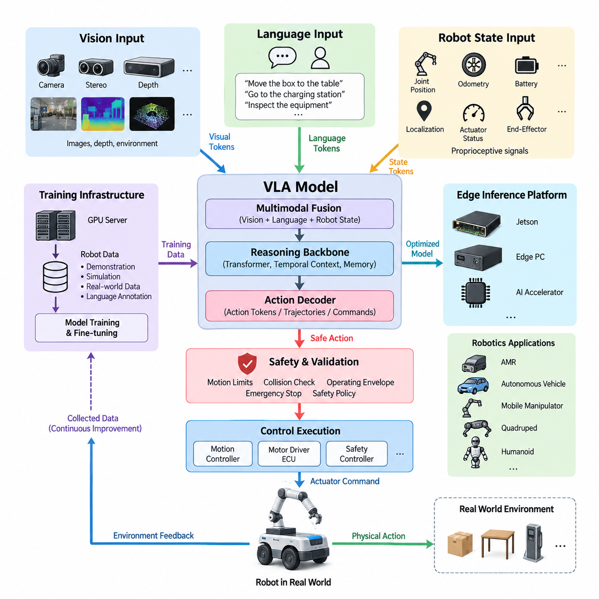
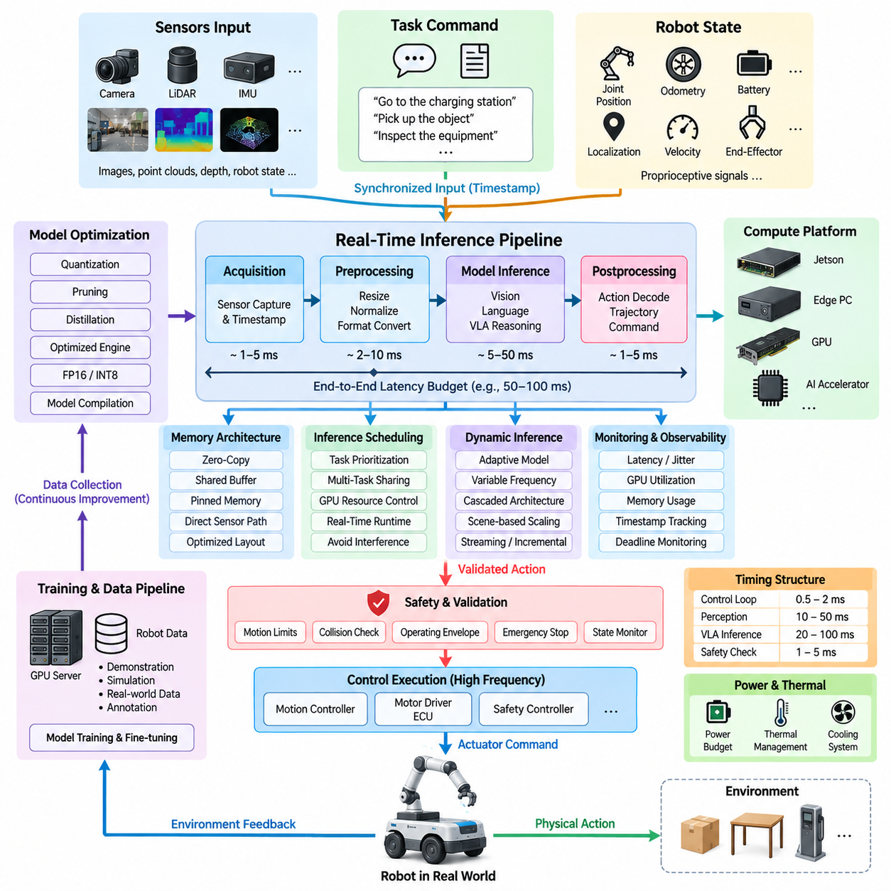
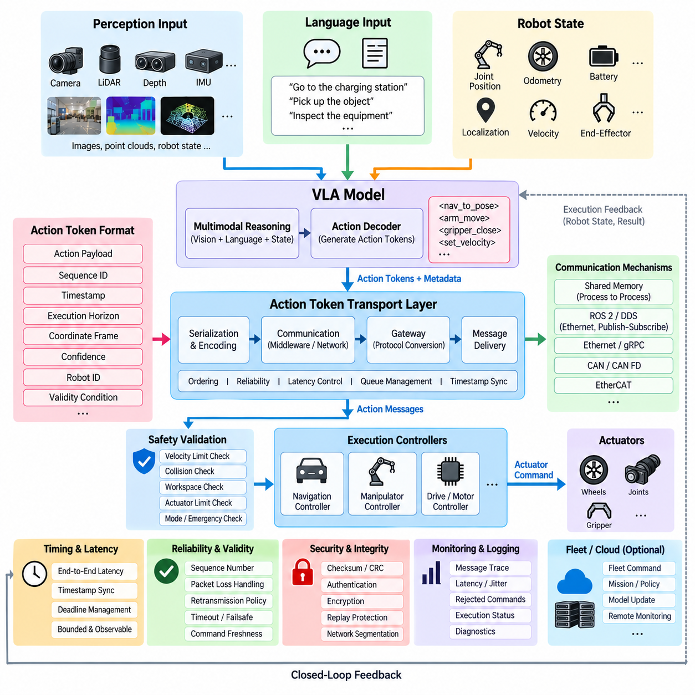
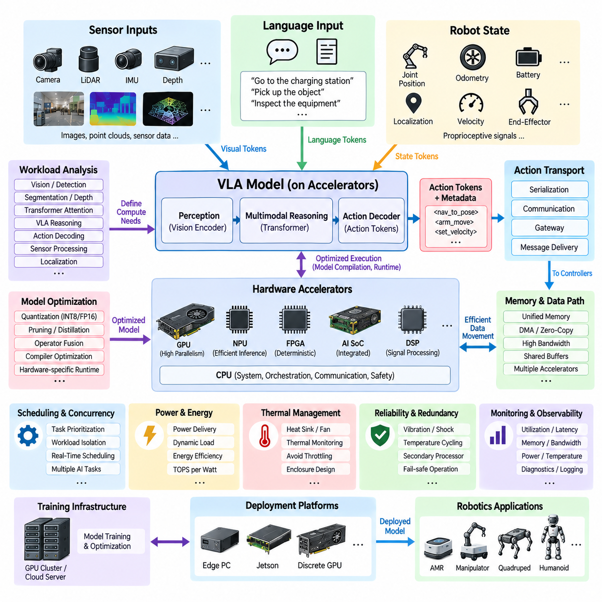
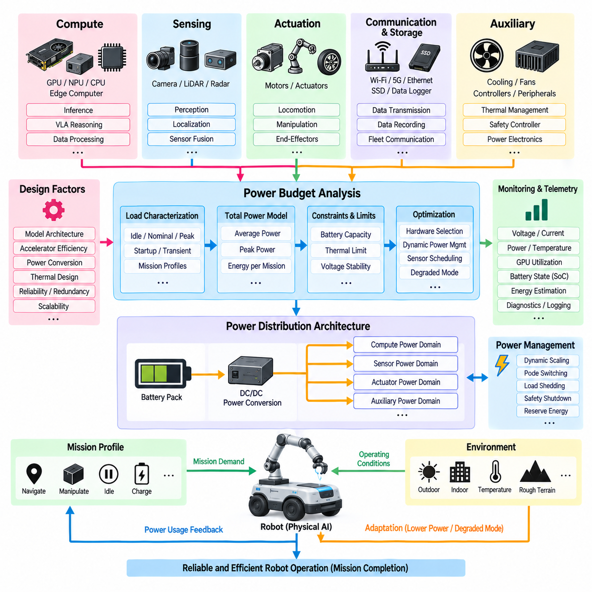

**Volume 16 Compute and AI Architecture**


# Chapter 08. Physical AI Architecture

##  

## 08.01. VLA Model Architecture

{width="7.268055555555556in" height="7.268055555555556in"}

A Vision-Language-Action model, or VLA, is an integrated Physical AI architecture that converts multimodal observations and language-level intent into executable robot actions. Unlike conventional robotic systems that separate perception, semantic reasoning, planning, and control into independently engineered modules, a VLA model learns relationships across these domains within a shared computational framework. The architecture therefore connects what the robot perceives, what the task means, and what physical behavior should occur next.

The vision pathway provides the model with information about the physical environment. Inputs may originate from monocular, stereo, depth, or other perception cameras and can be combined with representations derived from additional robot sensors. A visual encoder transforms raw observations into compact feature tokens representing objects, spatial relationships, free space, human activity, robot state, and task-relevant environmental conditions. These tokens become the perceptual context used by subsequent reasoning and action-generation stages.

The language pathway represents commands, goals, constraints, task descriptions, and contextual knowledge in a tokenized semantic space. Instructions such as moving an object, navigating toward a destination, inspecting equipment, or interacting with a person are converted into embeddings that can be jointly processed with visual features. Language therefore acts not merely as a human interface but as a flexible task specification mechanism that allows the same robot intelligence architecture to support many behaviors without constructing a dedicated control program for every individual task.

Multimodal fusion is the central mechanism connecting vision and language. Visual tokens and language tokens are projected into compatible representation spaces and processed through attention-based networks so that linguistic concepts can be grounded in observed physical entities. A command referring to a particular object, location, direction, or condition must become associated with the corresponding visual evidence. This grounding process allows the model to interpret instructions according to the current scene rather than treating language and perception as independent information streams.

The reasoning backbone maintains the contextual representation needed to determine an appropriate behavior. Transformer-based architectures are commonly suited to this role because attention mechanisms can model relationships among instructions, visual observations, robot state, and previous actions over time. For Physical AI, temporal context is particularly important because an action changes the environment and consequently changes the observations available to the model. The architecture must therefore operate as a repeated perception-reasoning-action loop rather than as a single static prediction process.

The action component converts the multimodal latent representation into a form that can influence physical motion. Depending on the robot architecture, outputs may represent discrete action tokens, continuous trajectories, poses, velocities, manipulation commands, navigation objectives, or intermediate motion intentions. The VLA model does not necessarily replace every deterministic controller. Instead, it can generate higher-level or intermediate actions that are subsequently executed by real-time motion controllers, motor-control ECUs, safety controllers, and other deterministic subsystems.

Action tokenization provides an important interface between learned intelligence and robotic execution. Continuous robot behaviors can be quantized or encoded into structured action representations that a transformer can predict similarly to other token sequences. Alternatively, continuous-action heads can directly estimate motion parameters. The appropriate representation depends on control frequency, robot dynamics, manipulation precision, compute resources, and safety requirements. This action interface also establishes the architectural boundary addressed by downstream action-token transport and real-time inference mechanisms.

A practical VLA architecture should incorporate robot-state information in addition to vision and language. Joint positions, wheel velocities, odometry, actuator status, localization, battery state, end-effector state, and other proprioceptive signals provide information that cannot always be inferred reliably from camera observations. Encoding these signals together with multimodal context allows the model to reason not only about the external world but also about the robot\'s current physical configuration and operational capability before producing an action.

Memory and temporal history further extend the architecture beyond instantaneous perception. A robot operating in a dynamic environment must distinguish newly observed events from persistent scene structure and understand how previous actions produced current conditions. Short-term observation histories, latent-state memories, previous action tokens, or recurrent context windows can provide this continuity. Such temporal representations are particularly important for navigation, manipulation sequences, human interaction, recovery behavior, and tasks in which relevant objects temporarily disappear from the camera view.

The inference architecture must be designed around the compute hierarchy of the robot. Vision encoding and multimodal reasoning may execute on a Jetson-class platform, an edge PC, a dedicated accelerator, or a combination of processors, while larger training workloads remain on GPU servers or on-premise AI infrastructure. This reflects the broader compute hierarchy of MCU, ECU, Jetson platform, edge PC, GPU server, on-premise AI system, fleet AI, and Physical AI architecture defined within the volume structure.

Training and deployment are therefore separate but tightly connected architectural concerns. Large-scale GPU infrastructure can train or fine-tune the VLA model using robot demonstrations, teleoperation trajectories, simulation data, synthetic scenes, language annotations, and operational datasets. The resulting model can then be compressed, quantized, distilled, partitioned, or otherwise optimized for edge execution. Data collected from deployed robots can subsequently return through controlled data pipelines and fleet-learning infrastructure to improve later model versions.

Physical execution requires a stronger safety boundary than ordinary language or vision inference. A statistically generated action should not automatically receive unrestricted authority over motors and actuators. The VLA output should pass through validation layers that can enforce motion limits, collision constraints, operating envelopes, emergency states, actuator limits, and system-level safety policies. Safety PLCs, dedicated MCUs, drive controllers, and independent emergency-stop paths can remain outside the learned model so that critical protection does not depend solely on neural-network behavior.

Latency is equally fundamental because the usefulness of an intelligent prediction depends on when it becomes available. Camera acquisition, preprocessing, token generation, multimodal inference, action decoding, communication, and actuator response collectively form the end-to-end VLA latency path. Different portions of this pipeline may operate at different frequencies. Semantic reasoning can run more slowly than low-level servo control, while deterministic controllers maintain fast stabilization loops between VLA updates. This hierarchical timing model enables advanced reasoning without forcing a large neural model to execute every electrical control cycle.

The resulting system is best understood as an intelligence layer embedded within a broader robotics compute architecture rather than as a standalone neural network. Vision provides environmental evidence, language specifies intent, robot state describes physical capability, multimodal reasoning connects these representations, and the action decoder produces executable intent. Real-time controllers then transform that intent into controlled physical behavior while safety systems independently supervise execution. This separation combines learned generalization with the deterministic properties required by practical robotic hardware.

Within Physical AI, the long-term significance of VLA architecture is its ability to create a common intelligence interface across different robot forms. An indoor AMR, outdoor autonomous vehicle, mobile manipulator, quadruped, humanoid, or other embodied platform may possess different actuators and dynamics while sharing portions of visual understanding, language reasoning, task knowledge, and action abstraction. The surrounding electrical, communication, sensor, compute, and safety architectures therefore become the physical foundation upon which increasingly general VLA-based robot intelligence can be deployed.

비전-언어-행동 모델(Vision-Language-Action Model, VLA)은 다중모달 관측(Multimodal Observation)과 언어 수준의 의도(Language-Level Intent)를 실행 가능한 로봇 행동(Executable Robot Action)으로 변환하는 통합 피지컬 AI(Physical AI) 아키텍처이다. 인식(Perception), 의미 추론(Semantic Reasoning), 계획(Planning), 제어(Control)를 독립적으로 설계된 모듈로 분리하는 기존 로봇 시스템과 달리, VLA 모델은 이러한 영역 사이의 관계를 하나의 공유 연산 프레임워크(Shared Computational Framework) 안에서 학습한다. 따라서 이 아키텍처는 로봇이 무엇을 인식하는지, 작업이 무엇을 의미하는지, 그리고 다음에 어떤 물리적 행동을 수행해야 하는지를 연결한다.

비전 경로(Vision Pathway)는 모델에 물리적 환경(Physical Environment)에 관한 정보를 제공한다. 입력은 단안 카메라(Monocular Camera), 스테레오 카메라(Stereo Camera), 깊이 카메라(Depth Camera) 또는 기타 인식 카메라(Perception Camera)에서 획득할 수 있으며, 추가적인 로봇 센서에서 생성된 표현과 결합할 수도 있다. 비전 인코더(Visual Encoder)는 원시 관측 데이터를 객체(Object), 공간 관계(Spatial Relationship), 자유 공간(Free Space), 인간 활동(Human Activity), 로봇 상태(Robot State), 작업 관련 환경 조건(Task-Relevant Environmental Condition)을 표현하는 압축된 특징 토큰(Feature Token)으로 변환한다. 이러한 토큰은 이후의 추론 및 행동 생성 단계에서 사용되는 지각적 문맥(Perceptual Context)이 된다.

언어 경로(Language Pathway)는 명령(Command), 목표(Goal), 제약 조건(Constraint), 작업 설명(Task Description), 문맥 지식(Contextual Knowledge)을 토큰화된 의미 공간(Tokenized Semantic Space)으로 표현한다. 객체를 이동하거나 목적지로 이동하고, 장비를 검사하거나 사람과 상호작용하는 등의 지시는 임베딩(Embedding)으로 변환되어 시각 특징(Visual Feature)과 함께 처리된다. 따라서 언어는 단순한 인간-로봇 인터페이스(Human-Robot Interface)를 넘어 유연한 작업 명세 메커니즘(Task Specification Mechanism)으로 기능하며, 개별 작업마다 전용 제어 프로그램을 구축하지 않고도 동일한 로봇 지능 아키텍처가 다양한 행동을 지원할 수 있도록 한다.

다중모달 융합(Multimodal Fusion)은 비전과 언어를 연결하는 핵심 메커니즘이다. 시각 토큰(Visual Token)과 언어 토큰(Language Token)은 호환 가능한 표현 공간(Compatible Representation Space)으로 투영되고 어텐션 기반 네트워크(Attention-Based Network)를 통해 처리되므로, 언어적 개념이 관측된 물리적 개체와 연결될 수 있다. 특정 객체, 위치, 방향 또는 조건을 지칭하는 명령은 해당하는 시각적 증거(Visual Evidence)와 연관되어야 한다. 이러한 그라운딩(Grounding) 과정은 모델이 언어와 인식을 독립적인 정보 흐름으로 처리하는 대신 현재 장면(Current Scene)에 따라 명령을 해석할 수 있도록 한다.

추론 백본(Reasoning Backbone)은 적절한 행동을 결정하는 데 필요한 문맥 표현(Contextual Representation)을 유지한다. 트랜스포머 기반 아키텍처(Transformer-Based Architecture)는 어텐션 메커니즘(Attention Mechanism)을 통해 명령, 시각 관측, 로봇 상태, 이전 행동 사이의 시간적 관계를 모델링할 수 있으므로 이러한 역할에 적합하다. 피지컬 AI(Physical AI)에서는 행동이 환경을 변화시키고, 그 결과 모델이 사용할 수 있는 관측 정보 역시 변화하기 때문에 시간적 문맥(Temporal Context)이 특히 중요하다. 따라서 아키텍처는 단일 정적 예측(Static Prediction)이 아니라 반복적인 인식-추론-행동 루프(Perception-Reasoning-Action Loop)로 동작해야 한다.

행동 구성요소(Action Component)는 다중모달 잠재 표현(Multimodal Latent Representation)을 실제 물리적 움직임에 영향을 줄 수 있는 형태로 변환한다. 로봇 아키텍처에 따라 출력은 이산 행동 토큰(Discrete Action Token), 연속 궤적(Continuous Trajectory), 자세(Pose), 속도(Velocity), 조작 명령(Manipulation Command), 내비게이션 목표(Navigation Objective) 또는 중간 수준의 운동 의도(Intermediate Motion Intention)를 표현할 수 있다. VLA 모델이 모든 결정론적 제어기(Deterministic Controller)를 대체할 필요는 없다. 대신 상위 수준 또는 중간 수준의 행동을 생성하고, 이를 실시간 모션 제어기(Real-Time Motion Controller), 모터 제어 ECU(Motor-Control ECU), 안전 제어기(Safety Controller) 및 기타 결정론적 하위 시스템이 실행하도록 구성할 수 있다.

행동 토큰화(Action Tokenization)는 학습 기반 지능(Learned Intelligence)과 로봇 실행(Robotic Execution)을 연결하는 중요한 인터페이스를 제공한다. 연속적인 로봇 행동은 양자화(Quantization)되거나 구조화된 행동 표현(Structured Action Representation)으로 인코딩되어 트랜스포머가 다른 토큰 시퀀스(Token Sequence)와 유사한 방식으로 예측할 수 있다. 또는 연속 행동 헤드(Continuous-Action Head)가 운동 파라미터(Motion Parameter)를 직접 추정할 수도 있다. 적절한 표현 방식은 제어 주기(Control Frequency), 로봇 동역학(Robot Dynamics), 조작 정밀도(Manipulation Precision), 연산 자원(Compute Resource), 안전 요구사항(Safety Requirement)에 따라 결정된다. 이러한 행동 인터페이스는 이후의 행동 토큰 전송(Action-Token Transport)과 실시간 추론(Real-Time Inference) 메커니즘이 다루는 아키텍처 경계도 형성한다.

실용적인 VLA 아키텍처는 비전과 언어뿐 아니라 로봇 상태 정보(Robot-State Information)도 포함해야 한다. 관절 위치(Joint Position), 휠 속도(Wheel Velocity), 오도메트리(Odometry), 액추에이터 상태(Actuator Status), 위치 추정(Localization), 배터리 상태(Battery State), 엔드 이펙터 상태(End-Effector State) 및 기타 고유수용성 신호(Proprioceptive Signal)는 카메라 관측만으로 항상 신뢰성 있게 추론할 수 없는 정보를 제공한다. 이러한 신호를 다중모달 문맥과 함께 인코딩하면 모델은 행동을 생성하기 전에 외부 세계뿐 아니라 로봇의 현재 물리적 구성과 운용 가능 상태까지 함께 추론할 수 있다.

메모리(Memory)와 시간 이력(Temporal History)은 아키텍처를 순간적인 인식 이상의 영역으로 확장한다. 동적 환경(Dynamic Environment)에서 동작하는 로봇은 새롭게 관측된 사건과 지속적인 장면 구조(Persistent Scene Structure)를 구분하고, 이전 행동이 현재 상태를 어떻게 만들어냈는지를 이해해야 한다. 단기 관측 이력(Short-Term Observation History), 잠재 상태 메모리(Latent-State Memory), 이전 행동 토큰(Previous Action Token), 순환 문맥 창(Recurrent Context Window)은 이러한 연속성을 제공할 수 있다. 이러한 시간적 표현은 내비게이션, 연속 조작, 인간 상호작용, 복구 행동(Recovery Behavior), 그리고 관련 객체가 일시적으로 카메라 시야에서 사라지는 작업에서 특히 중요하다.

추론 아키텍처(Inference Architecture)는 로봇의 연산 계층(Compute Hierarchy)을 중심으로 설계되어야 한다. 비전 인코딩(Vision Encoding)과 다중모달 추론(Multimodal Reasoning)은 젯슨급 플랫폼(Jetson-Class Platform), 엣지 PC(Edge PC), 전용 가속기(Dedicated Accelerator) 또는 여러 프로세서의 조합에서 실행할 수 있으며, 대규모 학습 작업은 GPU 서버(GPU Server)나 온프레미스 AI 인프라(On-Premise AI Infrastructure)에서 수행할 수 있다. 이는 MCU, ECU, 젯슨 플랫폼(Jetson Platform), 엣지 PC(Edge PC), GPU 서버(GPU Server), 온프레미스 AI 시스템(On-Premise AI System), 플릿 AI(Fleet AI), 피지컬 AI 아키텍처(Physical AI Architecture)로 이어지는 전체 연산 계층 구조를 반영한다.

따라서 학습(Training)과 배포(Deployment)는 서로 분리되어 있으면서도 긴밀하게 연결된 아키텍처 요소이다. 대규모 GPU 인프라(Large-Scale GPU Infrastructure)는 로봇 시연(Robot Demonstration), 원격조작 궤적(Teleoperation Trajectory), 시뮬레이션 데이터(Simulation Data), 합성 장면(Synthetic Scene), 언어 주석(Language Annotation), 실제 운용 데이터셋(Operational Dataset)을 이용하여 VLA 모델을 학습하거나 미세조정(Fine-Tuning)할 수 있다. 이후 생성된 모델은 엣지 실행(Edge Execution)을 위해 압축(Compression), 양자화(Quantization), 지식 증류(Distillation), 분할(Partitioning) 또는 기타 최적화 과정을 거칠 수 있다. 배포된 로봇에서 수집한 데이터는 통제된 데이터 파이프라인과 플릿 학습 인프라(Fleet-Learning Infrastructure)를 통해 다시 수집되어 후속 모델 버전을 개선하는 데 활용될 수 있다.

물리적 실행(Physical Execution)은 일반적인 언어 또는 비전 추론보다 훨씬 강력한 안전 경계(Safety Boundary)를 요구한다. 확률적으로 생성된 행동이 모터와 액추에이터에 제한 없이 직접적인 제어 권한을 가져서는 안 된다. VLA 출력은 운동 제한(Motion Limit), 충돌 제약(Collision Constraint), 운용 영역(Operating Envelope), 비상 상태(Emergency State), 액추에이터 제한(Actuator Limit), 시스템 수준 안전 정책(System-Level Safety Policy)을 강제할 수 있는 검증 계층(Validation Layer)을 통과해야 한다. 안전 PLC(Safety PLC), 전용 MCU(Dedicated MCU), 드라이브 제어기(Drive Controller), 독립 비상 정지 경로(Independent Emergency-Stop Path)는 학습 모델 외부에 유지하여 핵심 보호 기능이 신경망의 동작에만 의존하지 않도록 할 수 있다.

지연시간(Latency) 역시 핵심적인 요소이다. 지능형 예측의 유용성은 결과 자체뿐 아니라 그 결과가 언제 제공되는지에 의해 결정되기 때문이다. 카메라 획득(Camera Acquisition), 전처리(Preprocessing), 토큰 생성(Token Generation), 다중모달 추론(Multimodal Inference), 행동 디코딩(Action Decoding), 통신(Communication), 액추에이터 응답(Actuator Response)은 전체 VLA 종단 간 지연시간 경로(End-to-End VLA Latency Path)를 구성한다. 파이프라인의 각 부분은 서로 다른 주기로 동작할 수 있다. 의미 추론(Semantic Reasoning)은 저수준 서보 제어(Low-Level Servo Control)보다 느리게 실행될 수 있으며, 결정론적 제어기는 VLA 업데이트 사이에서도 빠른 안정화 루프(Stabilization Loop)를 유지한다. 이러한 계층형 타이밍 모델(Hierarchical Timing Model)은 대규모 신경망이 모든 전기적 제어 주기를 직접 실행하지 않으면서도 고급 추론을 활용할 수 있게 한다.

결과적으로 VLA 시스템은 독립적인 신경망(Standalone Neural Network)이 아니라 보다 광범위한 로봇 연산 아키텍처(Robotics Compute Architecture)에 내장된 지능 계층(Intelligence Layer)으로 이해하는 것이 적절하다. 비전은 환경적 증거(Environmental Evidence)를 제공하고, 언어는 의도(Intent)를 정의하며, 로봇 상태는 물리적 수행 능력(Physical Capability)을 설명한다. 다중모달 추론은 이러한 표현을 연결하고 행동 디코더(Action Decoder)는 실행 가능한 의도(Executable Intent)를 생성한다. 이후 실시간 제어기가 해당 의도를 제어된 물리적 행동으로 변환하며, 안전 시스템은 실행 과정을 독립적으로 감독한다. 이러한 분리는 학습 기반 일반화(Learned Generalization)와 실제 로봇 하드웨어에 필요한 결정론적 특성(Deterministic Property)을 결합한다.

피지컬 AI(Physical AI) 관점에서 VLA 아키텍처의 장기적인 중요성은 서로 다른 형태의 로봇에 공통 지능 인터페이스(Common Intelligence Interface)를 제공할 수 있다는 점에 있다. 실내 자율이동로봇(Indoor AMR), 실외 자율주행 차량(Outdoor Autonomous Vehicle), 모바일 매니퓰레이터(Mobile Manipulator), 사족보행 로봇(Quadruped), 휴머노이드(Humanoid) 및 기타 체화형 플랫폼(Embodied Platform)은 서로 다른 액추에이터와 동역학을 가지면서도 시각적 이해(Visual Understanding), 언어 추론(Language Reasoning), 작업 지식(Task Knowledge), 행동 추상화(Action Abstraction)의 일부를 공유할 수 있다. 따라서 이를 둘러싼 전기(Electrical), 통신(Communication), 센서(Sensor), 연산(Compute), 안전(Safety) 아키텍처는 점차 범용화되는 VLA 기반 로봇 지능을 실제 물리 시스템에 배포하기 위한 핵심 기반이 된다.

##  

## 08.02. Real Time Inference Design

{width="7.268055555555556in" height="7.268055555555556in"}

Real-time inference design for Physical AI defines how perception, reasoning, and action-generation models execute within strict timing constraints while interacting with a continuously changing physical environment. Unlike offline AI inference, robot inference must deliver useful results before the surrounding world or robot state changes significantly. The architecture must therefore treat latency, determinism, compute scheduling, data movement, and control-loop synchronization as fundamental design parameters rather than secondary performance optimizations.

A practical architecture separates inference workloads according to their required update rates. Low-level motor control, stabilization, emergency response, and actuator supervision may operate at hundreds or thousands of cycles per second, while perception networks commonly operate at camera or sensor frame rates. VLA reasoning and semantic task interpretation can operate at lower frequencies when appropriate. This hierarchical timing structure prevents computationally expensive AI models from becoming directly responsible for every high-frequency control cycle.

The end-to-end inference path begins when sensors acquire information from the environment and robot. Camera images, LiDAR measurements, depth data, localization information, proprioceptive signals, and task commands must be captured, timestamped, preprocessed, and delivered to the appropriate AI models. Each stage introduces latency, so real-time performance cannot be evaluated using neural-network execution time alone. Sensor acquisition, memory transfer, preprocessing, inference, postprocessing, communication, and actuator response must be considered as one complete timing chain.

Latency budgeting assigns an allowable execution time to each stage of this chain. If a robotic function requires an action decision within a defined deadline, the total available time must be distributed among sensing, preprocessing, model execution, action decoding, safety validation, network transport, and controller response. This approach makes timing requirements measurable at the system level and prevents individual components from consuming excessive portions of the available response window. Worst-case behavior is especially important for safety-related functions.

Inference scheduling becomes more complex when several AI workloads share the same GPU or edge processor. Object detection, segmentation, depth estimation, localization support, VLA inference, speech processing, and monitoring functions may compete for GPU cores, memory bandwidth, and accelerator resources. The runtime architecture must establish priorities and execution policies so that critical workloads receive predictable compute access. Noncritical analytics or logging tasks should not delay perception or action-generation workloads that participate directly in robot behavior.

Asynchronous pipelines can improve utilization by allowing sensing, preprocessing, inference, and control execution to proceed concurrently rather than sequentially. While one camera frame is being processed by an AI model, the next frame can be acquired and prepared, and a previously generated command can be evaluated by the control system. Such pipelining increases throughput, but designers must carefully manage frame age and temporal consistency. High throughput is not useful if actions are generated from observations that have become too old for the current physical situation.

Memory architecture strongly affects real-time inference performance. Repeated copying of high-resolution images or large tensor data between CPU memory, GPU memory, and accelerator buffers can consume significant time and bandwidth. Zero-copy mechanisms, shared buffers, pinned memory, direct sensor-to-accelerator paths, and optimized tensor layouts can reduce unnecessary transfers. For edge robotics, memory bandwidth may become as important as raw computational throughput because multiple perception models can simultaneously process large sensor streams.

Model optimization provides another major mechanism for meeting real-time requirements. Neural networks can be quantized, pruned, distilled, compiled, or converted into hardware-optimized execution engines. Reduced-precision computation such as FP16 or INT8 can significantly decrease memory consumption and inference time when supported by the target accelerator. Optimization, however, must be validated against task accuracy and operational robustness because a faster model provides little benefit if compression materially degrades perception, reasoning, or action quality.

Dynamic inference strategies can adapt computational effort to the current operating condition. A robot moving through an uncomplicated environment may use a lightweight model, reduced input resolution, or lower inference frequency, while complex scenes can activate more capable processing. Cascaded architectures can first execute inexpensive models and invoke larger models only when uncertainty or task complexity increases. Such strategies improve average compute efficiency while preserving access to stronger reasoning when the operational situation requires it.

VLA-based Physical AI introduces additional timing challenges because multimodal reasoning can be substantially more computationally demanding than conventional perception networks. Vision tokens, language tokens, robot-state representations, temporal history, and action context may all participate in a single inference cycle. The system must control context length, token count, model size, and decoding strategy so that action generation remains responsive. Streaming or incremental processing can reduce repeated computation by reusing previously calculated representations when the scene changes gradually.

Action generation also requires careful temporal design. Autoregressive generation of long action-token sequences can create unacceptable delay if every future action must be produced sequentially before execution begins. The architecture can instead generate short action horizons, action chunks, trajectories, or intermediate motion goals that are passed to deterministic controllers. The robot can execute the current segment while the AI system prepares subsequent actions, creating a rolling inference-and-control process that balances model intelligence with physical responsiveness.

The boundary between AI inference and deterministic control is therefore essential. VLA or other learned models can determine semantic intentions, target objects, navigation goals, manipulation strategies, or short-horizon actions, while real-time controllers handle trajectory tracking, motor commands, steering, braking, joint control, and stabilization. This division allows relatively variable AI inference latency to coexist with tightly bounded control loops. It also prevents temporary AI delays from immediately destabilizing the physical platform.

Safety supervision must operate independently of the normal AI inference path. Generated actions should be checked against velocity limits, acceleration limits, collision constraints, restricted regions, actuator capabilities, robot state, and emergency conditions before execution. A dedicated MCU, safety controller, safety PLC, or drive-level protection mechanism can maintain essential protection even when the GPU, VLA model, operating system, or communication layer becomes delayed or unavailable. AI inference should never become the sole mechanism responsible for maintaining a safe physical state.

Deadline monitoring detects situations in which an inference result arrives too late to remain valid. Every observation and resulting action can carry timestamps so that the execution layer can determine the age of the information used for decision making. If the permitted latency is exceeded, the system may reject the action, retain the previous safe command, reduce velocity, transition to a degraded operating mode, or initiate a controlled stop. This converts timing from an assumed property into an explicitly supervised system variable.

The compute platform must consequently be selected according to sustained real-time behavior rather than peak AI performance alone. Jetson-class processors, edge PCs, GPUs, and dedicated AI accelerators should be evaluated using model latency, memory bandwidth, thermal behavior, power limits, concurrent workload performance, and long-duration stability. Thermal throttling is particularly important because an accelerator that meets timing requirements during a short benchmark may violate deadlines after prolonged operation inside a robot enclosure.

Real-time inference also interacts directly with power and thermal architecture. Increasing GPU frequency or activating additional accelerators can reduce inference latency but increases electrical power consumption and heat generation. Conversely, aggressive power limiting can increase execution time and deadline risk. Physical AI compute design must therefore coordinate inference performance with available battery energy, DC power capacity, cooling capability, enclosure temperature, and mission duration. Real-time performance is ultimately a system-level hardware and software property.

Observability is required to validate the complete architecture. Runtime telemetry should measure sensor timestamps, queue depth, preprocessing time, model execution time, GPU utilization, memory consumption, action-decoding latency, communication delay, control response, temperature, and deadline violations. Average latency alone is insufficient because occasional long delays can be more dangerous than consistently moderate latency. Percentile distributions, maximum observed latency, jitter, and worst-case operating scenarios should therefore be examined during validation.

The resulting real-time inference architecture connects the VLA model to the remaining Physical AI compute stack. Multimodal models provide intelligent interpretation and action generation, optimized edge hardware provides bounded computational resources, action-token transport carries generated intentions toward execution systems, and deterministic controllers maintain fast physical control. Hardware accelerators and power-budget design then determine how much inference capability can be sustained continuously within the robot, forming the foundation for the subsequent Physical AI architecture elements.

피지컬 AI(Physical AI)를 위한 실시간 추론 설계(Real-Time Inference Design)는 지속적으로 변화하는 물리적 환경과 상호작용하면서 인식(Perception), 추론(Reasoning), 행동 생성(Action Generation) 모델이 엄격한 시간 제약(Timing Constraint) 내에서 어떻게 실행되는지를 정의한다. 오프라인 AI 추론(Offline AI Inference)과 달리 로봇 추론은 주변 환경이나 로봇 상태가 크게 변화하기 전에 유효한 결과를 제공해야 한다. 따라서 아키텍처에서는 지연시간(Latency), 결정성(Determinism), 연산 스케줄링(Compute Scheduling), 데이터 이동(Data Movement), 제어 루프 동기화(Control-Loop Synchronization)를 부차적인 성능 최적화가 아니라 핵심 설계 변수로 다루어야 한다.

실용적인 아키텍처는 필요한 갱신 주기(Update Rate)에 따라 추론 워크로드(Inference Workload)를 분리한다. 저수준 모터 제어(Low-Level Motor Control), 안정화(Stabilization), 비상 대응(Emergency Response), 액추에이터 감독(Actuator Supervision)은 초당 수백 또는 수천 회의 주기로 동작할 수 있으며, 인식 네트워크(Perception Network)는 일반적으로 카메라 또는 센서의 프레임 속도(Frame Rate)에 맞추어 동작한다. VLA 추론(VLA Reasoning)과 의미 기반 작업 해석(Semantic Task Interpretation)은 필요에 따라 더 낮은 주기로 실행할 수 있다. 이러한 계층형 타이밍 구조(Hierarchical Timing Structure)는 연산량이 큰 AI 모델이 모든 고주파 제어 주기를 직접 담당하는 것을 방지한다.

종단 간 추론 경로(End-to-End Inference Path)는 센서가 환경과 로봇으로부터 정보를 획득하는 순간부터 시작된다. 카메라 영상(Camera Image), 라이다 측정값(LiDAR Measurement), 깊이 데이터(Depth Data), 위치 추정 정보(Localization Information), 고유수용성 신호(Proprioceptive Signal), 작업 명령(Task Command)은 획득, 타임스탬프(Timestamp) 부여, 전처리(Preprocessing)를 거쳐 적절한 AI 모델로 전달되어야 한다. 각 단계에서 지연시간이 발생하므로 실시간 성능은 신경망 실행 시간만으로 평가할 수 없다. 센서 획득, 메모리 전송(Memory Transfer), 전처리, 추론, 후처리(Postprocessing), 통신(Communication), 액추에이터 응답(Actuator Response)을 하나의 완전한 타이밍 체인(Timing Chain)으로 고려해야 한다.

지연시간 예산(Latency Budgeting)은 이러한 처리 체인의 각 단계에 허용 가능한 실행 시간을 할당한다. 로봇 기능이 정해진 데드라인(Deadline) 내에 행동 결정을 내려야 한다면 전체 가용 시간은 센싱(Sensing), 전처리, 모델 실행(Model Execution), 행동 디코딩(Action Decoding), 안전 검증(Safety Validation), 네트워크 전송(Network Transport), 제어기 응답(Controller Response)에 분배되어야 한다. 이러한 접근법은 시스템 수준에서 시간 요구사항을 측정 가능하게 만들고 특정 구성요소가 전체 응답 시간의 과도한 부분을 소비하는 것을 방지한다. 특히 안전 관련 기능에서는 최악 조건 동작(Worst-Case Behavior)이 중요하다.

여러 AI 워크로드가 동일한 GPU 또는 엣지 프로세서(Edge Processor)를 공유하면 추론 스케줄링(Inference Scheduling)은 더욱 복잡해진다. 객체 검출(Object Detection), 분할(Segmentation), 깊이 추정(Depth Estimation), 위치 추정 지원(Localization Support), VLA 추론, 음성 처리(Speech Processing), 모니터링 기능(Monitoring Function)이 GPU 코어, 메모리 대역폭(Memory Bandwidth), 가속기 자원(Accelerator Resource)을 두고 경쟁할 수 있다. 런타임 아키텍처(Runtime Architecture)는 중요한 워크로드가 예측 가능한 연산 자원을 확보할 수 있도록 우선순위와 실행 정책을 설정해야 한다. 중요도가 낮은 분석이나 로깅 작업(Logging Task)이 로봇 행동에 직접 관여하는 인식 또는 행동 생성 워크로드를 지연시켜서는 안 된다.

비동기 파이프라인(Asynchronous Pipeline)은 센싱, 전처리, 추론, 제어 실행(Control Execution)을 순차적으로 처리하는 대신 동시에 진행함으로써 자원 활용도를 높일 수 있다. 하나의 카메라 프레임이 AI 모델에서 처리되는 동안 다음 프레임을 획득하고 준비할 수 있으며, 이전에 생성된 명령은 제어 시스템에서 평가할 수 있다. 이러한 파이프라이닝(Pipelining)은 처리량(Throughput)을 증가시키지만 프레임 경과 시간(Frame Age)과 시간적 일관성(Temporal Consistency)을 신중하게 관리해야 한다. 현재의 물리적 상황에 비해 지나치게 오래된 관측 데이터를 기반으로 행동을 생성한다면 높은 처리량 자체는 의미가 없다.

메모리 아키텍처(Memory Architecture)는 실시간 추론 성능에 큰 영향을 미친다. 고해상도 영상이나 대규모 텐서 데이터(Tensor Data)를 CPU 메모리, GPU 메모리, 가속기 버퍼(Accelerator Buffer) 사이에서 반복적으로 복사하면 상당한 시간과 대역폭이 소비될 수 있다. 제로카피 메커니즘(Zero-Copy Mechanism), 공유 버퍼(Shared Buffer), 고정 메모리(Pinned Memory), 센서-가속기 직접 경로(Direct Sensor-to-Accelerator Path), 최적화된 텐서 레이아웃(Optimized Tensor Layout)은 불필요한 데이터 전송을 줄일 수 있다. 엣지 로보틱스(Edge Robotics)에서는 여러 인식 모델이 대용량 센서 스트림을 동시에 처리하기 때문에 메모리 대역폭이 순수 연산 성능만큼 중요한 요소가 될 수 있다.

모델 최적화(Model Optimization)는 실시간 요구사항을 충족하기 위한 또 하나의 핵심 수단이다. 신경망은 양자화(Quantization), 가지치기(Pruning), 지식 증류(Distillation), 컴파일(Compilation) 또는 하드웨어 최적화 실행 엔진(Hardware-Optimized Execution Engine)으로 변환할 수 있다. 대상 가속기가 지원한다면 FP16이나 INT8과 같은 저정밀 연산(Reduced-Precision Computation)을 사용하여 메모리 사용량과 추론 시간을 크게 줄일 수 있다. 그러나 압축으로 인해 인식, 추론 또는 행동 품질이 실질적으로 저하된다면 빠른 모델의 이점이 감소하므로 최적화 결과는 작업 정확도(Task Accuracy)와 운용 강건성(Operational Robustness)을 기준으로 검증해야 한다.

동적 추론 전략(Dynamic Inference Strategy)은 현재의 운용 조건에 따라 연산량을 조절할 수 있다. 단순한 환경을 이동하는 로봇은 경량 모델(Lightweight Model), 낮은 입력 해상도(Reduced Input Resolution), 낮은 추론 주기(Lower Inference Frequency)를 사용할 수 있으며, 복잡한 장면에서는 더 높은 성능의 처리를 활성화할 수 있다. 계단식 아키텍처(Cascaded Architecture)는 먼저 연산 비용이 낮은 모델을 실행하고 불확실성(Uncertainty)이나 작업 복잡도(Task Complexity)가 증가할 때만 더 큰 모델을 호출할 수 있다. 이러한 전략은 평균 연산 효율을 높이면서 복잡한 운용 상황에서는 강력한 추론 능력을 사용할 수 있게 한다.

VLA 기반 피지컬 AI(VLA-Based Physical AI)는 다중모달 추론(Multimodal Reasoning)이 기존 인식 네트워크보다 훨씬 많은 연산을 요구할 수 있기 때문에 추가적인 타이밍 문제를 발생시킨다. 비전 토큰(Vision Token), 언어 토큰(Language Token), 로봇 상태 표현(Robot-State Representation), 시간 이력(Temporal History), 행동 문맥(Action Context)이 하나의 추론 주기에 모두 참여할 수 있다. 시스템은 행동 생성의 응답성을 유지하기 위해 문맥 길이(Context Length), 토큰 수(Token Count), 모델 크기(Model Size), 디코딩 전략(Decoding Strategy)을 제어해야 한다. 스트리밍 처리(Streaming Processing) 또는 증분 처리(Incremental Processing)를 이용하면 장면이 점진적으로 변화할 때 이전에 계산된 표현을 재사용하여 반복 연산을 줄일 수 있다.

행동 생성(Action Generation) 역시 세심한 시간적 설계를 필요로 한다. 긴 행동 토큰 시퀀스(Action-Token Sequence)를 자기회귀 방식(Autoregressive Generation)으로 생성하면 실행을 시작하기 전에 모든 미래 행동을 순차적으로 생성해야 하는 경우 허용하기 어려운 지연이 발생할 수 있다. 대신 짧은 행동 구간(Short Action Horizon), 행동 청크(Action Chunk), 궤적(Trajectory), 중간 수준의 운동 목표(Intermediate Motion Goal)를 생성하여 결정론적 제어기(Deterministic Controller)로 전달할 수 있다. 로봇이 현재 구간을 실행하는 동안 AI 시스템은 후속 행동을 준비함으로써 모델의 지능과 물리적 응답성을 균형 있게 결합하는 연속 추론-제어 과정(Rolling Inference-and-Control Process)을 구성할 수 있다.

따라서 AI 추론(AI Inference)과 결정론적 제어(Deterministic Control) 사이의 경계가 매우 중요하다. VLA 또는 다른 학습 모델은 의미적 의도(Semantic Intention), 대상 객체(Target Object), 내비게이션 목표(Navigation Goal), 조작 전략(Manipulation Strategy), 단기 행동(Short-Horizon Action)을 결정할 수 있으며, 실시간 제어기는 궤적 추종(Trajectory Tracking), 모터 명령(Motor Command), 조향(Steering), 제동(Braking), 관절 제어(Joint Control), 안정화(Stabilization)를 담당한다. 이러한 역할 분리는 상대적으로 변동성이 있는 AI 추론 지연시간과 엄격하게 제한된 제어 루프를 공존하게 하며, 일시적인 AI 지연이 물리 플랫폼의 즉각적인 불안정으로 이어지는 것을 방지한다.

안전 감독(Safety Supervision)은 정상적인 AI 추론 경로와 독립적으로 동작해야 한다. 생성된 행동은 실행 전에 속도 제한(Velocity Limit), 가속도 제한(Acceleration Limit), 충돌 제약(Collision Constraint), 제한 구역(Restricted Region), 액추에이터 성능(Actuator Capability), 로봇 상태, 비상 조건(Emergency Condition)에 대해 검사되어야 한다. 전용 MCU(Dedicated MCU), 안전 제어기(Safety Controller), 안전 PLC(Safety PLC), 드라이브 수준 보호 메커니즘(Drive-Level Protection Mechanism)은 GPU, VLA 모델, 운영체제 또는 통신 계층이 지연되거나 사용할 수 없는 상황에서도 필수적인 보호 기능을 유지할 수 있다. AI 추론이 안전한 물리 상태를 유지하는 유일한 수단이 되어서는 안 된다.

데드라인 모니터링(Deadline Monitoring)은 추론 결과가 너무 늦게 도착하여 더 이상 유효하지 않은 상황을 감지한다. 모든 관측 정보와 이에 따른 행동에 타임스탬프를 부여하면 실행 계층(Execution Layer)은 의사결정에 사용된 정보의 경과 시간(Age)을 판단할 수 있다. 허용된 지연시간을 초과하면 시스템은 해당 행동을 거부하거나 이전의 안전 명령을 유지하고, 속도를 낮추거나 성능 저하 운용 모드(Degraded Operating Mode)로 전환하거나 제어된 정지(Controlled Stop)를 수행할 수 있다. 이를 통해 타이밍을 단순히 가정되는 특성이 아니라 명시적으로 감독되는 시스템 변수로 전환할 수 있다.

따라서 연산 플랫폼(Compute Platform)은 최고 AI 성능(Peak AI Performance)만이 아니라 지속적인 실시간 동작(Sustained Real-Time Behavior)을 기준으로 선정해야 한다. 젯슨급 프로세서(Jetson-Class Processor), 엣지 PC(Edge PC), GPU, 전용 AI 가속기(Dedicated AI Accelerator)는 모델 지연시간(Model Latency), 메모리 대역폭, 열적 특성(Thermal Behavior), 전력 제한(Power Limit), 동시 워크로드 성능(Concurrent Workload Performance), 장시간 안정성(Long-Duration Stability)을 기준으로 평가해야 한다. 특히 열 스로틀링(Thermal Throttling)은 짧은 벤치마크에서는 타이밍 요구사항을 충족했던 가속기가 로봇 인클로저 내부에서 장시간 동작한 이후 데드라인을 위반하게 만들 수 있으므로 중요하다.

실시간 추론은 전력 및 열 아키텍처(Power and Thermal Architecture)와도 직접적으로 연관된다. GPU 주파수를 높이거나 추가 가속기를 활성화하면 추론 지연시간을 줄일 수 있지만 전력 소비(Electrical Power Consumption)와 발열(Heat Generation)이 증가한다. 반대로 과도한 전력 제한은 실행 시간을 증가시키고 데드라인 위반 위험을 높일 수 있다. 따라서 피지컬 AI 연산 설계는 추론 성능을 사용 가능한 배터리 에너지(Battery Energy), DC 전력 용량(DC Power Capacity), 냉각 능력(Cooling Capability), 인클로저 온도(Enclosure Temperature), 임무 지속시간(Mission Duration)과 함께 조정해야 한다. 실시간 성능은 궁극적으로 하드웨어와 소프트웨어가 결합된 시스템 수준 특성(System-Level Property)이다.

전체 아키텍처를 검증하려면 관측 가능성(Observability)이 필요하다. 런타임 텔레메트리(Runtime Telemetry)는 센서 타임스탬프, 큐 깊이(Queue Depth), 전처리 시간, 모델 실행 시간, GPU 사용률(GPU Utilization), 메모리 사용량(Memory Consumption), 행동 디코딩 지연시간, 통신 지연, 제어 응답(Control Response), 온도(Temperature), 데드라인 위반(Deadline Violation)을 측정해야 한다. 간헐적으로 발생하는 긴 지연이 일정한 수준의 중간 지연보다 더 위험할 수 있으므로 평균 지연시간만으로는 충분하지 않다. 따라서 검증 과정에서는 백분위 지연시간 분포(Percentile Latency Distribution), 최대 관측 지연시간(Maximum Observed Latency), 지터(Jitter), 최악 운용 시나리오(Worst-Case Operating Scenario)를 함께 평가해야 한다.

결과적으로 실시간 추론 아키텍처(Real-Time Inference Architecture)는 VLA 모델을 피지컬 AI 연산 스택(Physical AI Compute Stack)의 나머지 요소와 연결한다. 다중모달 모델(Multimodal Model)은 지능형 해석과 행동 생성을 제공하고, 최적화된 엣지 하드웨어(Optimized Edge Hardware)는 제한된 연산 자원을 제공하며, 행동 토큰 전송(Action-Token Transport)은 생성된 의도를 실행 시스템으로 전달한다. 결정론적 제어기는 빠른 물리 제어를 유지하고, 하드웨어 가속기(Hardware Accelerator)와 전력 예산 설계(Power-Budget Design)는 로봇 내부에서 어느 수준의 추론 능력을 지속적으로 유지할 수 있는지를 결정한다. 이러한 구조는 이후의 피지컬 AI 아키텍처 요소를 구성하기 위한 기반이 된다.

##  

## 08.03. Action Token Transport

{width="7.268055555555556in" height="7.268055555555556in"}

Action token transport defines the communication architecture that carries AI-generated behavioral intentions from a Vision-Language-Action model or other Physical AI reasoning component toward deterministic robot execution systems. The transport layer occupies the boundary between probabilistic AI inference and real-time physical control. Its purpose is not merely to transmit numerical commands, but to preserve the meaning, timing, ordering, validity, and safety context of generated actions as they move through the robot compute architecture.

An action token is a machine-interpretable representation of intended robot behavior. Depending on the model and platform, a token may describe a discrete command, target pose, velocity, trajectory segment, manipulation primitive, navigation objective, gripper operation, or higher-level task transition. Multiple tokens can form an action sequence representing behavior over a short temporal horizon. This abstraction allows learned AI models to communicate with heterogeneous robotic platforms without directly generating every low-level electrical or actuator command.

The transport architecture begins at the action decoder of the VLA model. Multimodal reasoning produces a latent representation of the required behavior, and the decoder converts that representation into structured action tokens or continuous action parameters. Before transmission, these outputs should be packaged into a defined message format containing the action payload together with metadata such as sequence identifiers, timestamps, execution horizons, coordinate frames, confidence information, robot identifiers, and validity conditions.

Temporal information is essential because an action has meaning only within the physical state for which it was generated. Every action message should therefore be associated with the observation time, generation time, and, when required, intended execution time. The receiving controller can compare these timestamps with its local clock and reject stale commands. Accurate time synchronization across the AI computer, edge controller, ECU, and actuator network becomes a fundamental requirement when action tokens cross multiple computational and communication domains.

Sequence management preserves the intended order of actions. Network delays, asynchronous processing, retransmissions, or parallel inference pipelines can cause messages to arrive at different times or in an unexpected order. Sequence numbers and action identifiers allow the execution layer to detect missing, duplicated, or reordered tokens. The controller can then determine whether to execute, buffer, discard, or request replacement of a command rather than blindly applying every message that arrives at its interface.

Action transport must also distinguish between commands that require reliable delivery and those whose value rapidly expires. A high-level navigation goal may tolerate retransmission because receiving the instruction correctly is more important than minimum latency. A rapidly updated velocity command may instead become obsolete before a retransmitted packet arrives. Transport policies should therefore reflect action semantics, allowing reliability, latency, queue depth, history, and delivery behavior to be configured according to the physical consequence of each message class.

The communication mechanism can vary across the robot compute hierarchy. Action tokens may move between processes through shared memory or inter-process communication, between computers through Ethernet-based middleware, and toward embedded controllers through CAN, CAN FD, EtherCAT, or other deterministic interfaces. ROS 2 and DDS can provide structured publish-subscribe communication at higher computational layers, while gateways translate selected commands into compact messages appropriate for ECU, motor-controller, or actuator networks.

A gateway is especially important when the AI domain and control domain use different data models. The VLA system may express an action as a semantic instruction or short trajectory, while a real-time controller requires target velocity, steering angle, joint position, torque limit, or actuator mode. The gateway performs controlled translation between these representations. This translation should be explicitly defined so that changes in the AI model do not unintentionally alter the electrical or control interface expected by downstream hardware.

Coordinate-frame information must accompany spatial actions whenever ambiguity is possible. A target pose may be expressed in a global map frame, robot base frame, camera frame, manipulator base frame, or end-effector frame. Transmitting coordinates without frame identity can result in physically incorrect behavior even when every numerical value is received correctly. Action messages should therefore identify the reference frame and, where necessary, the transform version or timestamp associated with the spatial representation.

Transport latency forms part of the end-to-end Physical AI response time. Action encoding, serialization, queueing, middleware processing, network transmission, gateway conversion, safety validation, and controller reception all contribute to the delay between AI inference and physical execution. The architecture should measure these components rather than treating communication as instantaneous. Bounded and observable latency is particularly important when short-horizon actions are generated continuously by a real-time VLA inference pipeline.

Queue design strongly influences action freshness. Large communication queues can prevent packet loss but may cause old actions to remain in the system after newer decisions have already been generated. For continuously updated robot commands, retaining only the most recent valid action can be safer and more responsive than processing every historical message. For ordered manipulation sequences, however, preserving multiple commands may be necessary. Queue policy must therefore be matched to the temporal semantics of the action rather than selected only for communication efficiency.

Safety validation should remain between action reception and unrestricted actuator execution. Transport integrity confirms that the intended data arrived correctly, but it does not prove that the action itself is physically safe. The execution architecture should evaluate received commands against velocity, acceleration, workspace, collision, actuator, operating-mode, and emergency-state constraints. Commands violating these boundaries can be rejected, clipped, transformed, or replaced by predefined safe behavior before reaching motor or drive controllers.

A command-validity mechanism defines what happens when communication is interrupted. Each action can include a validity duration, deadline, or heartbeat dependency. If new commands stop arriving, the controller should not indefinitely execute the last AI-generated intention unless that behavior has explicitly been designed as safe. Depending on the robot function, communication timeout can trigger command hold, zero velocity, controlled deceleration, trajectory cancellation, degraded operation, or transition to an independent safety state.

Integrity protection is also required because corrupted action data can directly affect physical motion. Message structures can incorporate checksums, cyclic redundancy checks, length validation, range checking, and schema or version identifiers. Communication systems may provide additional integrity and authentication mechanisms. At system level, the receiver should validate both message structure and physical plausibility before accepting a command, creating multiple barriers between malformed data and actuator execution.

Security becomes increasingly important when action tokens cross Ethernet, wireless, fleet, or remote-compute boundaries. Unauthorized modification, injection, replay, or impersonation of action messages could create unsafe robot behavior. Authentication, authorization, encryption where appropriate, secure session management, replay protection, network segmentation, and controlled gateway interfaces should therefore protect command channels. Safety and cybersecurity remain distinct engineering disciplines, but both converge at the action-transport boundary because compromised communication can produce physical consequences.

The transport system should support observability for development and validation. Engineers need to trace an action from model output through serialization, communication, gateway processing, safety validation, controller acceptance, and actuator response. Logging sequence numbers, timestamps, message age, transport latency, rejected commands, timeout events, and execution status allows failures to be reconstructed. Such traceability is particularly valuable when diagnosing intermittent behaviors that involve interactions between AI inference, networking, and physical control.

Feedback completes the transport loop. Controllers should report whether an action was accepted, rejected, completed, interrupted, or modified by safety logic. Robot state, actuator status, localization, and execution results then return to the perception and reasoning layers as updated context. The VLA model can use this information during subsequent inference cycles, preventing the architecture from assuming that every generated action was executed exactly as predicted and enabling closed-loop Physical AI behavior.

For fleet-connected robots, action transport should maintain a clear distinction between central intelligence and local execution authority. Fleet AI or an on-premise server may distribute missions, policies, semantic goals, or model updates, but time-critical actuator control should normally remain local to the robot. Loss of external connectivity should therefore not destroy essential control or safety capability. Local controllers can maintain bounded autonomous behavior while higher-level communication is restored.

Ultimately, action token transport provides the engineered bridge between VLA intelligence and physical machinery. The VLA architecture determines what should happen, real-time inference determines when the decision becomes available, action transport preserves and delivers that decision, and downstream controllers determine how it is physically executed. Together with hardware acceleration and power-budget design, this interface enables Physical AI models to operate as part of a dependable robot compute system rather than as isolated neural-network demonstrations.

행동 토큰 전송(Action Token Transport)은 비전-언어-행동 모델(Vision-Language-Action Model, VLA) 또는 기타 피지컬 AI(Physical AI) 추론 구성요소에서 생성된 행동 의도(Behavioral Intention)를 결정론적 로봇 실행 시스템(Deterministic Robot Execution System)으로 전달하는 통신 아키텍처(Communication Architecture)를 정의한다. 전송 계층(Transport Layer)은 확률적 AI 추론(Probabilistic AI Inference)과 실시간 물리 제어(Real-Time Physical Control)의 경계에 위치한다. 그 목적은 단순히 수치 명령을 전송하는 것이 아니라 생성된 행동이 로봇 연산 아키텍처를 통과하는 동안 의미, 타이밍, 순서, 유효성, 안전 문맥(Safety Context)을 유지하는 것이다.

행동 토큰(Action Token)은 로봇이 수행해야 할 의도된 행동을 기계가 해석할 수 있는 형태(Machine-Interpretable Representation)로 표현한 것이다. 모델과 플랫폼에 따라 토큰은 이산 명령(Discrete Command), 목표 자세(Target Pose), 속도(Velocity), 궤적 구간(Trajectory Segment), 조작 프리미티브(Manipulation Primitive), 내비게이션 목표(Navigation Objective), 그리퍼 동작(Gripper Operation), 상위 수준 작업 전환(High-Level Task Transition)을 나타낼 수 있다. 여러 토큰을 결합하면 짧은 시간 구간(Short Temporal Horizon)의 행동을 나타내는 행동 시퀀스(Action Sequence)를 구성할 수 있다. 이러한 추상화는 학습 기반 AI 모델이 모든 저수준 전기 또는 액추에이터 명령을 직접 생성하지 않고도 서로 다른 로봇 플랫폼과 통신할 수 있도록 한다.

전송 아키텍처(Transport Architecture)는 VLA 모델의 행동 디코더(Action Decoder)에서 시작된다. 다중모달 추론(Multimodal Reasoning)은 필요한 행동의 잠재 표현(Latent Representation)을 생성하고, 디코더는 이를 구조화된 행동 토큰(Structured Action Token) 또는 연속 행동 파라미터(Continuous Action Parameter)로 변환한다. 전송하기 전에 이러한 출력은 행동 페이로드(Action Payload)와 함께 시퀀스 식별자(Sequence Identifier), 타임스탬프(Timestamp), 실행 구간(Execution Horizon), 좌표 프레임(Coordinate Frame), 신뢰도 정보(Confidence Information), 로봇 식별자(Robot Identifier), 유효 조건(Validity Condition) 등의 메타데이터를 포함하는 정의된 메시지 형식(Message Format)으로 패키징되어야 한다.

시간 정보(Temporal Information)는 행동이 생성된 물리적 상태에서만 해당 행동이 의미를 가지기 때문에 필수적이다. 따라서 모든 행동 메시지는 관측 시간(Observation Time), 생성 시간(Generation Time), 필요한 경우 의도된 실행 시간(Intended Execution Time)과 연결되어야 한다. 수신 제어기(Receiving Controller)는 이러한 타임스탬프를 자신의 로컬 시계(Local Clock)와 비교하여 오래된 명령(Stale Command)을 거부할 수 있다. 행동 토큰이 여러 연산 및 통신 영역을 통과하는 경우 AI 컴퓨터, 엣지 제어기(Edge Controller), ECU, 액추에이터 네트워크(Actuator Network) 사이의 정확한 시간 동기화(Time Synchronization)가 핵심 요구사항이 된다.

시퀀스 관리(Sequence Management)는 의도된 행동 순서를 유지한다. 네트워크 지연(Network Delay), 비동기 처리(Asynchronous Processing), 재전송(Retransmission), 병렬 추론 파이프라인(Parallel Inference Pipeline)으로 인해 메시지가 서로 다른 시간에 도착하거나 예상과 다른 순서로 수신될 수 있다. 시퀀스 번호(Sequence Number)와 행동 식별자(Action Identifier)를 사용하면 실행 계층(Execution Layer)이 누락, 중복 또는 순서가 변경된 토큰을 감지할 수 있다. 이를 통해 제어기는 인터페이스에 도착하는 모든 메시지를 무조건 적용하는 대신 명령을 실행, 버퍼링(Buffering), 폐기 또는 대체 요청할지를 판단할 수 있다.

행동 전송(Action Transport)은 신뢰성 있는 전달(Reliable Delivery)이 필요한 명령과 가치가 빠르게 소멸하는 명령을 구분해야 한다. 상위 수준 내비게이션 목표(High-Level Navigation Goal)는 최소 지연시간보다 명령을 정확히 수신하는 것이 중요하므로 재전송을 허용할 수 있다. 반면 빠르게 갱신되는 속도 명령(Velocity Command)은 재전송된 패킷이 도착하기 전에 이미 유효성을 잃을 수 있다. 따라서 전송 정책(Transport Policy)은 행동의 의미적 특성을 반영해야 하며, 각 메시지 클래스(Message Class)의 물리적 영향에 따라 신뢰성, 지연시간, 큐 깊이(Queue Depth), 이력(History), 전달 동작(Delivery Behavior)을 설정할 수 있어야 한다.

통신 메커니즘(Communication Mechanism)은 로봇 연산 계층(Robot Compute Hierarchy)에 따라 달라질 수 있다. 행동 토큰은 프로세스 사이에서는 공유 메모리(Shared Memory) 또는 프로세스 간 통신(Inter-Process Communication)을 통해 이동할 수 있고, 컴퓨터 사이에서는 이더넷 기반 미들웨어(Ethernet-Based Middleware)를 이용할 수 있으며, 임베디드 제어기(Embedded Controller) 방향으로는 CAN, CAN FD, EtherCAT 또는 기타 결정론적 인터페이스(Deterministic Interface)를 사용할 수 있다. ROS 2와 DDS는 상위 연산 계층에서 구조화된 발행-구독 통신(Publish-Subscribe Communication)을 제공할 수 있으며, 게이트웨이(Gateway)는 선택된 명령을 ECU, 모터 제어기 또는 액추에이터 네트워크에 적합한 압축 메시지(Compact Message)로 변환한다.

AI 영역(AI Domain)과 제어 영역(Control Domain)이 서로 다른 데이터 모델(Data Model)을 사용하는 경우 게이트웨이는 특히 중요하다. VLA 시스템은 행동을 의미적 명령(Semantic Instruction)이나 짧은 궤적(Short Trajectory)으로 표현할 수 있지만, 실시간 제어기는 목표 속도(Target Velocity), 조향각(Steering Angle), 관절 위치(Joint Position), 토크 제한(Torque Limit), 액추에이터 모드(Actuator Mode)를 요구할 수 있다. 게이트웨이는 이러한 표현 사이에서 통제된 변환(Controlled Translation)을 수행한다. 이 변환은 AI 모델이 변경되더라도 하위 하드웨어가 요구하는 전기 및 제어 인터페이스가 의도하지 않게 변경되지 않도록 명확하게 정의되어야 한다.

공간적 행동(Spatial Action)에 모호성이 존재할 가능성이 있다면 좌표 프레임 정보(Coordinate-Frame Information)를 반드시 함께 전달해야 한다. 목표 자세는 글로벌 맵 프레임(Global Map Frame), 로봇 베이스 프레임(Robot Base Frame), 카메라 프레임(Camera Frame), 매니퓰레이터 베이스 프레임(Manipulator Base Frame), 엔드 이펙터 프레임(End-Effector Frame)으로 표현될 수 있다. 프레임 식별 정보 없이 좌표만 전송하면 모든 수치가 정확하게 전달되더라도 물리적으로 잘못된 행동이 발생할 수 있다. 따라서 행동 메시지는 기준 프레임(Reference Frame)을 식별하고 필요한 경우 공간 표현과 관련된 변환 버전(Transform Version)이나 타임스탬프도 포함해야 한다.

전송 지연시간(Transport Latency)은 종단 간 피지컬 AI 응답시간(End-to-End Physical AI Response Time)의 일부를 구성한다. 행동 인코딩(Action Encoding), 직렬화(Serialization), 큐잉(Queueing), 미들웨어 처리(Middleware Processing), 네트워크 전송(Network Transmission), 게이트웨이 변환(Gateway Conversion), 안전 검증(Safety Validation), 제어기 수신(Controller Reception)은 모두 AI 추론과 물리적 실행 사이의 지연에 영향을 준다. 아키텍처에서는 통신을 순간적으로 이루어지는 과정으로 가정하지 말고 이러한 구성요소를 실제로 측정해야 한다. 특히 실시간 VLA 추론 파이프라인이 단기 행동을 지속적으로 생성하는 경우 제한되고 관측 가능한 지연시간(Bounded and Observable Latency)이 중요하다.

큐 설계(Queue Design)는 행동의 최신성(Action Freshness)에 큰 영향을 미친다. 대용량 통신 큐는 패킷 손실(Packet Loss)을 방지할 수 있지만 새로운 결정이 이미 생성된 이후에도 오래된 행동이 시스템에 남아 있게 만들 수 있다. 지속적으로 갱신되는 로봇 명령에서는 모든 과거 메시지를 처리하는 것보다 가장 최근의 유효 행동만 유지하는 것이 더 안전하고 응답성이 높을 수 있다. 반면 순서가 중요한 조작 시퀀스(Manipulation Sequence)에서는 여러 명령을 보존해야 할 수 있다. 따라서 큐 정책(Queue Policy)은 단순한 통신 효율이 아니라 행동의 시간적 의미(Temporal Semantics)에 맞추어 설계해야 한다.

안전 검증(Safety Validation)은 행동 수신과 액추에이터의 무제한 실행 사이에 유지되어야 한다. 전송 무결성(Transport Integrity)은 의도한 데이터가 정확하게 도착했다는 것을 확인하지만 해당 행동 자체가 물리적으로 안전하다는 것을 보장하지는 않는다. 실행 아키텍처는 수신된 명령을 속도, 가속도, 작업 공간(Workspace), 충돌(Collision), 액추에이터, 운용 모드(Operating Mode), 비상 상태(Emergency State)의 제약 조건과 비교하여 평가해야 한다. 이러한 경계를 위반하는 명령은 모터 또는 드라이브 제어기에 전달되기 전에 거부, 제한(Clipping), 변환 또는 사전에 정의된 안전 행동(Safe Behavior)으로 대체할 수 있다.

명령 유효성 메커니즘(Command-Validity Mechanism)은 통신이 중단되었을 때 시스템이 어떻게 동작해야 하는지를 정의한다. 각 행동에는 유효 시간(Validity Duration), 데드라인(Deadline), 하트비트 의존성(Heartbeat Dependency)을 포함할 수 있다. 새로운 명령이 더 이상 수신되지 않을 경우 해당 동작이 명시적으로 안전하도록 설계된 것이 아니라면 제어기가 마지막 AI 생성 의도를 무기한 실행해서는 안 된다. 로봇 기능에 따라 통신 타임아웃(Communication Timeout)은 명령 유지(Command Hold), 영속도(Zero Velocity), 제어 감속(Controlled Deceleration), 궤적 취소(Trajectory Cancellation), 성능 저하 운용(Degraded Operation), 독립 안전 상태(Independent Safety State)로의 전환을 유발할 수 있다.

손상된 행동 데이터(Corrupted Action Data)는 물리적 움직임에 직접적인 영향을 줄 수 있으므로 무결성 보호(Integrity Protection)도 필요하다. 메시지 구조에는 체크섬(Checksum), 순환 중복 검사(Cyclic Redundancy Check, CRC), 길이 검증(Length Validation), 범위 검사(Range Checking), 스키마 또는 버전 식별자(Schema or Version Identifier)를 포함할 수 있다. 통신 시스템은 추가적인 무결성 및 인증 메커니즘(Authentication Mechanism)을 제공할 수도 있다. 시스템 수준에서 수신기는 명령을 수락하기 전에 메시지 구조와 물리적 타당성(Physical Plausibility)을 모두 검증하여 비정상 데이터와 액추에이터 실행 사이에 다중 보호 장벽을 형성해야 한다.

행동 토큰이 이더넷(Ethernet), 무선 네트워크(Wireless Network), 플릿(Fleet), 원격 연산(Remote Compute) 영역을 통과하는 경우 보안(Security)은 더욱 중요해진다. 행동 메시지의 무단 변경(Unauthorized Modification), 삽입(Injection), 재생 공격(Replay), 위장(Impersonation)은 안전하지 않은 로봇 행동을 유발할 수 있다. 따라서 인증(Authentication), 권한 부여(Authorization), 필요한 경우 암호화(Encryption), 안전한 세션 관리(Secure Session Management), 재생 공격 방지(Replay Protection), 네트워크 분할(Network Segmentation), 통제된 게이트웨이 인터페이스를 통해 명령 채널을 보호해야 한다. 안전(Safety)과 사이버보안(Cybersecurity)은 서로 다른 공학 분야이지만 침해된 통신이 물리적 결과를 초래할 수 있기 때문에 행동 전송 경계에서 서로 연결된다.

전송 시스템은 개발과 검증을 위한 관측 가능성(Observability)을 지원해야 한다. 엔지니어는 모델 출력(Model Output)에서 직렬화, 통신, 게이트웨이 처리, 안전 검증, 제어기 수락(Controller Acceptance), 액추에이터 응답까지 하나의 행동을 추적할 수 있어야 한다. 시퀀스 번호, 타임스탬프, 메시지 경과 시간(Message Age), 전송 지연시간, 거부된 명령(Rejected Command), 타임아웃 이벤트(Timeout Event), 실행 상태(Execution Status)를 기록하면 장애 상황을 재구성할 수 있다. 이러한 추적 가능성(Traceability)은 AI 추론, 네트워크, 물리 제어 사이의 상호작용으로 발생하는 간헐적 이상 동작을 진단하는 데 특히 유용하다.

피드백(Feedback)은 행동 전송 루프(Action Transport Loop)를 완성한다. 제어기는 행동이 수락, 거부, 완료, 중단되었는지 또는 안전 로직(Safety Logic)에 의해 수정되었는지를 보고해야 한다. 이후 로봇 상태, 액추에이터 상태, 위치 추정, 실행 결과(Execution Result)는 갱신된 문맥으로 인식 및 추론 계층에 다시 전달된다. VLA 모델은 후속 추론 주기에서 이 정보를 활용함으로써 생성된 모든 행동이 예측한 그대로 실행되었다고 가정하는 것을 방지하고 폐루프 피지컬 AI 동작(Closed-Loop Physical AI Behavior)을 구현할 수 있다.

플릿 연결 로봇(Fleet-Connected Robot)의 경우 행동 전송은 중앙 지능(Central Intelligence)과 로컬 실행 권한(Local Execution Authority)을 명확하게 구분해야 한다. 플릿 AI(Fleet AI) 또는 온프레미스 서버(On-Premise Server)는 임무(Mission), 정책(Policy), 의미적 목표(Semantic Goal), 모델 업데이트(Model Update)를 배포할 수 있지만 시간에 민감한 액추에이터 제어(Time-Critical Actuator Control)는 일반적으로 로봇 내부에서 수행되어야 한다. 따라서 외부 연결이 끊어져도 필수적인 제어 또는 안전 기능이 상실되어서는 안 된다. 로컬 제어기는 상위 수준 통신이 복구될 때까지 제한된 범위의 자율 동작(Bounded Autonomous Behavior)을 유지할 수 있다.

궁극적으로 행동 토큰 전송(Action Token Transport)은 VLA 지능(VLA Intelligence)과 물리적 기계 시스템(Physical Machinery)을 연결하는 공학적 가교(Engineered Bridge)를 제공한다. VLA 아키텍처는 무엇을 수행해야 하는지를 결정하고, 실시간 추론(Real-Time Inference)은 그 결정이 언제 제공되는지를 결정하며, 행동 전송은 해당 결정을 보존하여 실행 시스템에 전달한다. 이후 하위 제어기는 이를 실제 물리적으로 어떻게 실행할지를 결정한다. 하드웨어 가속(Hardware Acceleration) 및 전력 예산 설계(Power-Budget Design)와 함께 이러한 인터페이스는 피지컬 AI 모델이 독립적인 신경망 시연(Isolated Neural-Network Demonstration)을 넘어 신뢰성 있는 로봇 연산 시스템(Dependable Robot Compute System)의 일부로 동작할 수 있도록 한다.

##  

## 08.04. Hardware Accelerator Design

{width="7.268055555555556in" height="7.268055555555556in"}

Hardware accelerator design for Physical AI determines how computationally intensive perception, multimodal reasoning, and action-generation workloads are mapped onto specialized processing resources inside a robot. General-purpose CPUs remain important for operating systems, orchestration, communication, and supervisory logic, but modern AI workloads require much higher parallel throughput. GPUs, NPUs, tensor accelerators, DSPs, FPGAs, and dedicated AI SoCs therefore become fundamental components of the Physical AI compute architecture.

The accelerator architecture should begin with workload characterization rather than device selection. Vision encoders, object detection, segmentation, depth estimation, transformer attention, VLA reasoning, action decoding, localization support, and sensor processing have different computational structures. Some operations are dominated by matrix multiplication, while others depend heavily on memory access, preprocessing, sequential execution, or specialized signal-processing functions. Understanding this workload composition allows hardware resources to be assigned according to actual computational behavior.

GPUs are particularly effective for highly parallel neural-network operations and remain a primary accelerator for advanced robotic AI. Thousands of parallel execution units can process convolution, matrix multiplication, attention, and tensor operations efficiently, while specialized tensor-processing units accelerate reduced-precision arithmetic. In a Physical AI platform, the GPU can execute perception networks and multimodal models while the CPU handles system coordination, middleware, diagnostics, and application-level management.

Integrated AI SoCs provide another important design option for mobile robots. Platforms combining CPU cores, GPU resources, AI accelerators, memory controllers, video engines, and high-speed interfaces can reduce board area, power consumption, and communication overhead. Jetson-class systems exemplify this architecture by integrating general computation and accelerated AI processing within a compact edge platform. Such integration is particularly valuable for AMRs, mobile manipulators, quadrupeds, and humanoids where size, weight, power, and thermal capacity are limited.

Dedicated NPUs or tensor accelerators can provide higher performance per watt for supported neural-network operations. These devices are optimized for matrix and tensor computation and commonly emphasize low-precision formats such as INT8, FP8, FP16, or other hardware-specific representations. Their efficiency can make them attractive for continuously operating perception or inference workloads. However, model compatibility, operator support, compiler maturity, memory capacity, and runtime flexibility must be evaluated before assigning critical Physical AI functions to them.

FPGAs provide a different acceleration model based on configurable hardware pipelines. They can implement deterministic preprocessing, sensor interfaces, image pipelines, timestamp processing, protocol conversion, or specialized neural-network operators with tightly controlled latency. Their parallel dataflow architecture can be useful when predictable timing is more important than general programmability. FPGA development, however, requires greater hardware-design effort and should be justified by latency, interface, determinism, or customization requirements that cannot be satisfied efficiently by conventional processors.

Hardware partitioning determines which workload executes on which processor. Camera preprocessing may use dedicated video engines or GPU kernels, neural perception may execute on a GPU or NPU, VLA reasoning may require a larger GPU, and deterministic control should remain on an MCU or real-time controller. This heterogeneous compute architecture allows each processing technology to operate where it is strongest instead of forcing all robotic functions onto a single high-performance processor.

Data movement between accelerators is often as important as computation itself. Transferring large images, point clouds, feature maps, and model tensors repeatedly between CPU, GPU, NPU, and system memory can consume bandwidth and introduce substantial latency. Shared-memory architectures, unified memory, direct memory access, zero-copy buffers, and accelerator-aware middleware can reduce unnecessary transfers. Hardware accelerator design must therefore analyze the complete data path rather than comparing only peak TOPS or FLOPS specifications.

Memory capacity also constrains the models that can execute on an edge platform. Large VLA and multimodal models require storage for parameters, activations, attention caches, visual tokens, temporal context, and intermediate tensors. Several simultaneously executing perception models can further increase demand. Designers must evaluate usable memory after operating-system and application overhead, not merely installed capacity. Memory bandwidth and access contention should also be considered when multiple accelerators or workloads operate concurrently.

Precision selection directly influences accelerator efficiency. FP32 may provide broad numerical range but consumes more memory and computational resources than lower-precision formats. FP16, BF16, FP8, and INT8 can improve throughput and reduce memory traffic when the model and accelerator support them. Quantization-aware training or post-training quantization can further reduce resource requirements. The selected precision should nevertheless be validated against perception accuracy, reasoning quality, action stability, and rare operational conditions.

Accelerator utilization depends strongly on model compilation and runtime software. AI frameworks normally transform trained models into optimized computational graphs and hardware-specific kernels. Operator fusion, constant folding, memory planning, kernel selection, graph optimization, and hardware-specific compilation can substantially improve execution performance. The software toolchain must therefore be treated as part of the accelerator architecture because nominal hardware capability cannot be realized if the compiler or runtime cannot efficiently map the target model onto the device.

Concurrency becomes critical when multiple Physical AI functions share accelerator resources. A robot may simultaneously execute camera perception, LiDAR processing, VLA inference, localization assistance, speech recognition, anomaly detection, and recording functions. Scheduling policies should prevent background tasks from monopolizing compute or memory bandwidth. Priority streams, workload isolation, execution quotas, separate accelerators, or time-partitioned processing can be used when predictable response time is required for critical inference functions.

Accelerator redundancy may be considered for robots requiring higher availability. A secondary processor can provide degraded perception or simplified autonomy if the primary AI accelerator fails, overheats, or becomes unavailable. This does not necessarily require duplicating the complete high-performance AI stack. A smaller independent processor may execute essential obstacle detection, localization support, safe navigation, or controlled-stop functions, allowing the system to transition into a reduced-capability state rather than immediately losing all autonomous behavior.

Thermal design is inseparable from accelerator selection. GPUs and high-performance AI processors can generate significant heat during sustained inference, particularly when several models execute concurrently. Heat sinks, fans, heat pipes, cold plates, enclosure airflow, thermal interface materials, and temperature monitoring must maintain the processor below throttling limits. A system that achieves excellent benchmark performance for several minutes but reduces clock frequency during long missions does not provide dependable real-time AI performance.

Power delivery must also support accelerator transients and sustained load. AI processors can rapidly change power consumption as workloads begin, stop, or change complexity. DC/DC converters, power distribution units, wiring, connectors, and local regulators should be designed for these dynamic conditions. Voltage stability is important because transient drops can reset or destabilize compute modules. Hardware accelerator design therefore connects directly with the Physical AI power-budget architecture that follows this section.

Energy efficiency should be evaluated using useful robotic performance rather than accelerator specifications alone. TOPS per watt can provide a rough comparison, but actual efficiency depends on model utilization, precision, memory traffic, compiler optimization, idle behavior, and thermal conditions. A theoretically powerful accelerator operating at low utilization may consume more mission energy than a smaller processor optimized for the required workload. Measurements using representative robot models and sensor streams provide more meaningful engineering evidence.

Reliability considerations include vibration, shock, temperature cycling, dust, humidity, connector integrity, and long-duration operation. Accelerator modules installed in mobile robots experience harsher conditions than conventional data-center hardware. Mechanical mounting, PCB support, cooling attachment, SSD retention, connector locking, and cable strain relief should therefore be considered alongside computational design. Environmental qualification is especially important for outdoor AMRs, inspection vehicles, and other robots operating beyond controlled indoor environments.

Observability enables engineers to determine whether accelerator resources are meeting system requirements. Runtime monitoring can collect processor utilization, tensor-core activity, memory usage, bandwidth, inference latency, queue depth, power consumption, clock frequency, and temperature. Correlating these measurements with robot behavior reveals whether missed deadlines originate from model execution, memory contention, thermal throttling, communication, or scheduling. Such telemetry supports both laboratory optimization and field diagnostics.

A scalable Physical AI architecture can use different accelerator tiers for different robot classes while maintaining a common software and model interface. Lightweight robots may use an integrated edge SoC, higher-performance robots may combine an edge processor with a discrete GPU, and research or premium platforms may employ multiple accelerators. Training and large-scale optimization can remain on GPU servers or on-premise infrastructure, while deployment models are adapted to the compute envelope of each robot platform.

Ultimately, hardware accelerator design transforms AI model requirements into a realizable robotic compute platform. The VLA architecture defines the intelligence workload, real-time inference establishes timing constraints, and action-token transport connects model output to execution. Hardware accelerators then provide the computational throughput needed to sustain these functions within practical limits of memory, latency, thermal capacity, reliability, and electrical power. The remaining design problem is therefore to determine how this compute capability fits within the complete Physical AI power budget.

피지컬 AI(Physical AI)를 위한 하드웨어 가속기 설계(Hardware Accelerator Design)는 연산 집약적인 인식(Perception), 다중모달 추론(Multimodal Reasoning), 행동 생성(Action Generation) 워크로드를 로봇 내부의 특화된 처리 자원(Specialized Processing Resource)에 어떻게 배치할지를 결정한다. 범용 CPU(General-Purpose CPU)는 운영체제, 오케스트레이션(Orchestration), 통신, 감독 로직(Supervisory Logic)에 여전히 중요하지만 현대 AI 워크로드는 훨씬 높은 병렬 처리량(Parallel Throughput)을 요구한다. 따라서 GPU, NPU, 텐서 가속기(Tensor Accelerator), DSP, FPGA, 전용 AI SoC(Dedicated AI SoC)는 피지컬 AI 연산 아키텍처의 핵심 구성요소가 된다.

가속기 아키텍처(Accelerator Architecture)는 장치 선정(Device Selection)이 아니라 워크로드 특성 분석(Workload Characterization)에서 시작해야 한다. 비전 인코더(Vision Encoder), 객체 검출(Object Detection), 분할(Segmentation), 깊이 추정(Depth Estimation), 트랜스포머 어텐션(Transformer Attention), VLA 추론(VLA Reasoning), 행동 디코딩(Action Decoding), 위치 추정 지원(Localization Support), 센서 처리(Sensor Processing)는 서로 다른 연산 구조를 가진다. 일부 연산은 행렬 곱셈(Matrix Multiplication)이 지배적이며, 다른 연산은 메모리 접근, 전처리, 순차 실행 또는 특화된 신호 처리 기능에 크게 의존한다. 이러한 워크로드 구성을 이해하면 실제 연산 특성에 따라 하드웨어 자원을 배치할 수 있다.

GPU(Graphics Processing Unit)는 고도의 병렬 신경망 연산(Parallel Neural-Network Operation)에 특히 효과적이며 고급 로봇 AI를 위한 주요 가속기로 활용된다. 수천 개의 병렬 실행 유닛(Parallel Execution Unit)이 합성곱(Convolution), 행렬 곱셈, 어텐션, 텐서 연산(Tensor Operation)을 효율적으로 처리할 수 있으며, 특화된 텐서 처리 유닛(Tensor-Processing Unit)은 저정밀 연산(Reduced-Precision Arithmetic)을 가속한다. 피지컬 AI 플랫폼에서 GPU는 인식 네트워크와 다중모달 모델을 실행하고 CPU는 시스템 조정, 미들웨어(Middleware), 진단(Diagnostics), 애플리케이션 수준 관리(Application-Level Management)를 담당할 수 있다.

통합 AI SoC(Integrated AI SoC)는 모바일 로봇을 위한 또 하나의 중요한 설계 대안이다. CPU 코어, GPU 자원, AI 가속기, 메모리 제어기(Memory Controller), 비디오 엔진(Video Engine), 고속 인터페이스(High-Speed Interface)를 결합한 플랫폼은 보드 면적, 전력 소비, 통신 오버헤드(Communication Overhead)를 줄일 수 있다. 젯슨급 시스템(Jetson-Class System)은 범용 연산과 가속 AI 처리를 소형 엣지 플랫폼(Compact Edge Platform)에 통합한 대표적인 아키텍처이다. 이러한 통합은 크기, 중량, 전력, 열 용량에 제약이 있는 AMR, 모바일 매니퓰레이터(Mobile Manipulator), 사족보행 로봇(Quadruped), 휴머노이드(Humanoid)에서 특히 중요하다.

전용 NPU(Neural Processing Unit) 또는 텐서 가속기(Tensor Accelerator)는 지원되는 신경망 연산에서 더 높은 와트당 성능(Performance per Watt)을 제공할 수 있다. 이러한 장치는 행렬 및 텐서 연산에 최적화되며 일반적으로 INT8, FP8, FP16 또는 기타 하드웨어 특화 표현(Hardware-Specific Representation)과 같은 저정밀 형식을 적극적으로 활용한다. 높은 효율성으로 인해 지속적으로 동작하는 인식 또는 추론 워크로드에 적합할 수 있다. 그러나 핵심 피지컬 AI 기능을 할당하기 전에 모델 호환성(Model Compatibility), 연산자 지원(Operator Support), 컴파일러 성숙도(Compiler Maturity), 메모리 용량, 런타임 유연성(Runtime Flexibility)을 평가해야 한다.

FPGA(Field-Programmable Gate Array)는 구성 가능한 하드웨어 파이프라인(Configurable Hardware Pipeline)을 기반으로 하는 다른 형태의 가속 모델을 제공한다. FPGA는 결정론적 전처리(Deterministic Preprocessing), 센서 인터페이스, 이미지 파이프라인(Image Pipeline), 타임스탬프 처리(Timestamp Processing), 프로토콜 변환(Protocol Conversion), 특수 신경망 연산자를 엄격하게 제어된 지연시간으로 구현할 수 있다. 병렬 데이터플로 아키텍처(Parallel Dataflow Architecture)는 범용 프로그래밍 가능성보다 예측 가능한 타이밍이 중요한 경우 유용하다. 다만 FPGA 개발에는 더 많은 하드웨어 설계 노력이 필요하므로 기존 프로세서로 효율적으로 충족하기 어려운 지연시간, 인터페이스, 결정성 또는 맞춤화 요구사항이 있을 때 적용하는 것이 적절하다.

하드웨어 분할(Hardware Partitioning)은 어떤 워크로드를 어떤 프로세서에서 실행할지를 결정한다. 카메라 전처리는 전용 비디오 엔진이나 GPU 커널(GPU Kernel)을 사용할 수 있고, 신경망 기반 인식은 GPU 또는 NPU에서 실행할 수 있으며, VLA 추론은 더 큰 GPU를 요구할 수 있다. 반면 결정론적 제어(Deterministic Control)는 MCU 또는 실시간 제어기(Real-Time Controller)에 유지하는 것이 적절하다. 이러한 이기종 연산 아키텍처(Heterogeneous Compute Architecture)는 모든 로봇 기능을 하나의 고성능 프로세서에 집중시키는 대신 각 처리 기술을 가장 적합한 영역에서 활용할 수 있게 한다.

가속기 사이의 데이터 이동(Data Movement)은 연산 자체만큼 중요할 수 있다. 대용량 영상, 포인트 클라우드(Point Cloud), 특징 맵(Feature Map), 모델 텐서(Model Tensor)를 CPU, GPU, NPU, 시스템 메모리 사이에서 반복적으로 전송하면 대역폭을 소비하고 상당한 지연시간을 발생시킬 수 있다. 공유 메모리 아키텍처(Shared-Memory Architecture), 통합 메모리(Unified Memory), 직접 메모리 접근(Direct Memory Access, DMA), 제로카피 버퍼(Zero-Copy Buffer), 가속기 인식 미들웨어(Accelerator-Aware Middleware)를 이용하면 불필요한 전송을 줄일 수 있다. 따라서 하드웨어 가속기 설계에서는 최고 TOPS 또는 FLOPS 사양만 비교하지 말고 전체 데이터 경로를 분석해야 한다.

메모리 용량(Memory Capacity)은 엣지 플랫폼에서 실행할 수 있는 모델의 규모도 제한한다. 대규모 VLA 및 다중모달 모델은 파라미터(Parameter), 활성값(Activation), 어텐션 캐시(Attention Cache), 비전 토큰(Vision Token), 시간적 문맥(Temporal Context), 중간 텐서(Intermediate Tensor)를 저장할 공간이 필요하다. 여러 인식 모델을 동시에 실행하면 메모리 요구량은 더욱 증가한다. 설계자는 단순한 설치 메모리 용량이 아니라 운영체제와 애플리케이션 오버헤드를 제외한 실제 사용 가능 메모리를 평가해야 한다. 여러 가속기나 워크로드가 동시에 동작할 때 발생하는 메모리 대역폭과 접근 경합(Access Contention)도 고려해야 한다.

정밀도 선택(Precision Selection)은 가속기의 효율에 직접적인 영향을 준다. FP32는 넓은 수치 표현 범위(Numerical Range)를 제공하지만 낮은 정밀도 형식보다 더 많은 메모리와 연산 자원을 소비한다. 모델과 가속기가 지원한다면 FP16, BF16, FP8, INT8을 통해 처리량을 높이고 메모리 트래픽(Memory Traffic)을 줄일 수 있다. 양자화 인식 학습(Quantization-Aware Training) 또는 학습 후 양자화(Post-Training Quantization)를 사용하면 자원 요구량을 더욱 감소시킬 수 있다. 그러나 선택한 정밀도는 인식 정확도, 추론 품질, 행동 안정성(Action Stability), 드물게 발생하는 운용 조건(Rare Operational Condition)에 대해 검증해야 한다.

가속기 활용률(Accelerator Utilization)은 모델 컴파일(Model Compilation)과 런타임 소프트웨어(Runtime Software)의 영향을 크게 받는다. AI 프레임워크는 일반적으로 학습된 모델을 최적화된 연산 그래프(Optimized Computational Graph)와 하드웨어 특화 커널(Hardware-Specific Kernel)로 변환한다. 연산자 융합(Operator Fusion), 상수 폴딩(Constant Folding), 메모리 계획(Memory Planning), 커널 선택(Kernel Selection), 그래프 최적화(Graph Optimization), 하드웨어 특화 컴파일을 통해 실행 성능을 크게 향상시킬 수 있다. 따라서 컴파일러나 런타임이 대상 모델을 장치에 효율적으로 매핑하지 못하면 하드웨어의 명목상 성능을 실현할 수 없으므로 소프트웨어 툴체인(Software Toolchain) 역시 가속기 아키텍처의 일부로 다루어야 한다.

여러 피지컬 AI 기능이 가속기 자원을 공유하는 경우 동시성(Concurrency)이 중요해진다. 로봇은 카메라 인식, 라이다 처리, VLA 추론, 위치 추정 지원, 음성 인식(Speech Recognition), 이상 탐지(Anomaly Detection), 기록 기능을 동시에 실행할 수 있다. 스케줄링 정책(Scheduling Policy)은 백그라운드 작업이 연산 자원이나 메모리 대역폭을 독점하지 못하도록 해야 한다. 핵심 추론 기능에 예측 가능한 응답시간이 필요한 경우 우선순위 스트림(Priority Stream), 워크로드 격리(Workload Isolation), 실행 할당량(Execution Quota), 독립 가속기 또는 시간 분할 처리(Time-Partitioned Processing)를 사용할 수 있다.

높은 가용성(High Availability)이 요구되는 로봇에서는 가속기 이중화(Accelerator Redundancy)를 고려할 수 있다. 주 AI 가속기가 고장 나거나 과열되거나 사용할 수 없는 경우 보조 프로세서(Secondary Processor)가 제한된 인식 또는 단순화된 자율 기능을 제공할 수 있다. 반드시 전체 고성능 AI 스택을 동일하게 복제할 필요는 없다. 소형 독립 프로세서가 필수 장애물 검출(Essential Obstacle Detection), 위치 추정 지원, 안전 내비게이션(Safe Navigation), 제어 정지(Controlled Stop)를 실행하도록 구성하면 모든 자율 기능을 즉시 상실하는 대신 시스템을 제한 기능 상태(Reduced-Capability State)로 전환할 수 있다.

열 설계(Thermal Design)는 가속기 선정과 분리할 수 없는 요소이다. GPU와 고성능 AI 프로세서는 지속적인 추론 과정에서 상당한 열을 발생시킬 수 있으며 여러 모델을 동시에 실행하면 그 영향은 더욱 커진다. 방열판(Heat Sink), 팬(Fan), 히트 파이프(Heat Pipe), 콜드 플레이트(Cold Plate), 인클로저 공기 흐름(Enclosure Airflow), 열 인터페이스 재료(Thermal Interface Material), 온도 모니터링(Temperature Monitoring)을 통해 프로세서가 스로틀링 한계(Throttling Limit) 이하에서 동작하도록 해야 한다. 몇 분 동안의 벤치마크에서는 높은 성능을 보이지만 장시간 임무에서 클록 주파수가 감소하는 시스템은 신뢰성 있는 실시간 AI 성능을 제공한다고 보기 어렵다.

전력 공급(Power Delivery)은 가속기의 순간 부하(Transient Load)와 지속 부하(Sustained Load)를 모두 지원해야 한다. AI 프로세서는 워크로드가 시작되거나 종료되고 복잡도가 변화함에 따라 전력 소비가 빠르게 변할 수 있다. DC/DC 컨버터(DC/DC Converter), 전력 분배 장치(Power Distribution Unit, PDU), 배선(Wiring), 커넥터(Connector), 로컬 레귤레이터(Local Regulator)는 이러한 동적 조건을 고려하여 설계해야 한다. 순간적인 전압 강하(Voltage Drop)가 연산 모듈의 리셋이나 불안정을 유발할 수 있으므로 전압 안정성(Voltage Stability)이 중요하다. 따라서 하드웨어 가속기 설계는 다음 절의 피지컬 AI 전력 예산 아키텍처(Physical AI Power-Budget Architecture)와 직접 연결된다.

에너지 효율(Energy Efficiency)은 가속기 사양 자체가 아니라 실제로 유용한 로봇 성능(Useful Robotic Performance)을 기준으로 평가해야 한다. 와트당 TOPS(TOPS per Watt)는 대략적인 비교 기준을 제공하지만 실제 효율은 모델 활용률, 정밀도, 메모리 트래픽, 컴파일러 최적화, 유휴 동작(Idle Behavior), 열적 조건에 따라 달라진다. 이론적으로 강력한 가속기라도 낮은 활용률로 동작하면 요구 워크로드에 최적화된 소형 프로세서보다 더 많은 임무 에너지(Mission Energy)를 소비할 수 있다. 대표적인 로봇 모델과 센서 스트림을 사용한 측정이 더욱 의미 있는 공학적 근거를 제공한다.

신뢰성(Reliability)을 평가할 때는 진동(Vibration), 충격(Shock), 온도 사이클링(Temperature Cycling), 먼지(Dust), 습도(Humidity), 커넥터 무결성(Connector Integrity), 장시간 동작(Long-Duration Operation)을 고려해야 한다. 모바일 로봇에 설치된 가속기 모듈은 일반적인 데이터센터 하드웨어보다 가혹한 환경을 경험한다. 따라서 기계적 장착(Mechanical Mounting), PCB 지지(PCB Support), 냉각 장치 고정(Cooling Attachment), SSD 고정(SSD Retention), 커넥터 잠금(Connector Locking), 케이블 스트레인 릴리프(Cable Strain Relief)를 연산 설계와 함께 고려해야 한다. 특히 실외 AMR(Outdoor AMR), 점검 차량(Inspection Vehicle), 기타 통제된 실내 환경 밖에서 운용되는 로봇에서는 환경 적합성 검증(Environmental Qualification)이 중요하다.

관측 가능성(Observability)을 확보하면 가속기 자원이 시스템 요구사항을 충족하고 있는지를 엔지니어가 판단할 수 있다. 런타임 모니터링(Runtime Monitoring)을 통해 프로세서 활용률, 텐서 코어 활동(Tensor-Core Activity), 메모리 사용량, 대역폭, 추론 지연시간(Inference Latency), 큐 깊이(Queue Depth), 전력 소비, 클록 주파수(Clock Frequency), 온도를 수집할 수 있다. 이러한 측정값을 로봇 동작과 연계하면 데드라인 누락(Missed Deadline)이 모델 실행, 메모리 경합, 열 스로틀링(Thermal Throttling), 통신 또는 스케줄링 중 어디에서 발생하는지 분석할 수 있다. 이러한 텔레메트리(Telemetry)는 실험실 최적화와 현장 진단 모두를 지원한다.

확장 가능한 피지컬 AI 아키텍처(Scalable Physical AI Architecture)는 공통 소프트웨어 및 모델 인터페이스(Common Software and Model Interface)를 유지하면서 로봇 종류에 따라 서로 다른 가속기 등급(Accelerator Tier)을 사용할 수 있다. 경량 로봇은 통합 엣지 SoC(Integrated Edge SoC)를 사용할 수 있고, 고성능 로봇은 엣지 프로세서와 외장 GPU(Discrete GPU)를 결합할 수 있으며, 연구 또는 프리미엄 플랫폼은 여러 가속기를 사용할 수 있다. 학습과 대규모 최적화는 GPU 서버 또는 온프레미스 인프라(On-Premise Infrastructure)에서 수행하고, 배포 모델은 각 로봇 플랫폼의 연산 한계(Compute Envelope)에 맞추어 조정할 수 있다.

궁극적으로 하드웨어 가속기 설계(Hardware Accelerator Design)는 AI 모델의 요구사항을 실제 구현 가능한 로봇 연산 플랫폼(Robotic Compute Platform)으로 변환한다. VLA 아키텍처(VLA Architecture)는 지능 워크로드(Intelligence Workload)를 정의하고, 실시간 추론(Real-Time Inference)은 타이밍 제약(Timing Constraint)을 설정하며, 행동 토큰 전송(Action-Token Transport)은 모델 출력을 실행 시스템과 연결한다. 하드웨어 가속기는 이러한 기능을 메모리, 지연시간, 열 용량(Thermal Capacity), 신뢰성, 전력이라는 현실적인 제약 내에서 지속적으로 수행하기 위한 연산 처리량을 제공한다. 따라서 다음 설계 과제는 이러한 연산 능력을 전체 피지컬 AI 전력 예산(Physical AI Power Budget) 안에 어떻게 통합할 것인지를 결정하는 것이다.

##  

## 08.05. Physical AI Power Budget

{width="7.268055555555556in" height="7.268055555555556in"}

Physical AI power budgeting defines how electrical energy is allocated across the computing, sensing, communication, control, and supporting infrastructure required to operate intelligent robots. Unlike conventional embedded systems, Physical AI platforms may continuously execute perception networks, VLA reasoning, localization, sensor fusion, and action generation while controlling physical machinery. Power design must therefore consider not only average consumption but also peak demand, transient behavior, thermal limits, mission duration, and degraded operating modes.

The power budget should begin with a complete inventory of electrical loads. Major consumers typically include AI processors, CPUs, GPUs, NPUs, edge computers, cameras, LiDARs, radar, communication modules, storage devices, cooling systems, controllers, and peripheral electronics. Motors and actuators may dominate total robot energy, but computing and sensing often represent a large continuous auxiliary load. Separating propulsion, actuation, compute, sensing, and auxiliary domains makes energy consumption easier to analyze and control.

Each load should be characterized using multiple operating states rather than a single rated value. An AI accelerator may exhibit different consumption during idle operation, perception inference, VLA reasoning, model loading, or simultaneous multi-model execution. Cameras and LiDARs may operate continuously, intermittently, or at reduced rates depending on mission state. The resulting power model should therefore represent idle, nominal, peak, startup, emergency, and degraded conditions to capture realistic robot operation.

Peak power is especially important because simultaneous workload activation can create short periods of demand significantly above the mission average. GPU inference, sensor startup, communication transmission, cooling fans, steering systems, manipulators, and propulsion loads may overlap. DC/DC converters, batteries, power distribution units, connectors, wiring, and protection devices must tolerate these combinations without excessive voltage drop or unwanted shutdown. Peak-load analysis should therefore include realistic concurrency rather than independently measured maximum values that can never occur together.

Transient power behavior requires additional attention for high-performance AI accelerators. GPUs and other processors can rapidly transition from low-power states to intensive computation, producing fast changes in current demand. If the power distribution network has excessive impedance, these transients can cause local voltage instability, processor reset, or communication failure. Appropriate converter response, local capacitance, power-plane design, cable sizing, and connector selection help maintain stable supply voltage during dynamic AI workloads.

The compute power budget is closely linked to model architecture. Larger VLA models, higher image resolutions, longer context windows, increased inference frequency, and simultaneous perception networks generally require more accelerator activity and memory traffic. A model that fits computationally on a GPU may still be unsuitable for a mobile robot if sustained operation exceeds the available electrical or thermal envelope. AI architecture should therefore be optimized against watts, latency, and task performance simultaneously rather than computational capability alone.

Hardware accelerator selection provides one of the strongest mechanisms for controlling AI power consumption. GPUs offer high flexibility and parallel throughput, while NPUs and dedicated tensor accelerators can provide higher efficiency for supported workloads. Integrated AI SoCs can reduce data-transfer and peripheral overhead, and FPGAs or DSPs may efficiently handle specialized preprocessing functions. The optimal architecture may therefore distribute workloads across heterogeneous processors rather than operating every AI function on the largest available GPU.

Dynamic power management can adapt compute consumption to mission requirements. When the robot is stationary or operating in a simple environment, perception frequency, camera resolution, GPU clocks, model size, or active accelerator count can be reduced. Complex navigation, manipulation, or emergency situations can temporarily activate higher-performance modes. This adaptive strategy allows the platform to reserve maximum computing capability for situations in which it produces meaningful operational benefit instead of continuously consuming peak power.

Sensor power should be considered together with computational demand because sensing and inference are functionally coupled. Increasing camera frame rate or enabling additional LiDAR, radar, or depth sensors not only consumes sensor power but also increases downstream data processing. Conversely, disabling unnecessary sensors can reduce both direct electrical consumption and AI workload. Mission-aware sensor scheduling can therefore produce system-level energy savings that are larger than the sensor\'s individual rated power would suggest.

Communication and storage also contribute to the continuous power budget. Ethernet switches, wireless radios, cellular modems, GNSS receivers, SSDs, data recorders, and fleet communication modules may remain active throughout a mission. High-rate logging of images and point clouds increases storage activity and can also increase CPU and network utilization. Data architecture should consequently distinguish information required for immediate autonomy from information collected for diagnostics, fleet learning, or later model training.

Cooling power is part of the AI power budget rather than an independent overhead. Fans, pumps, and other active thermal-management components consume energy specifically because compute hardware generates heat. Increasing accelerator power may therefore increase both direct electrical consumption and secondary cooling demand. The effective energy cost of an AI workload should include this supporting infrastructure, particularly in sealed or outdoor enclosures where thermal rejection can require substantial design margin.

Power conversion efficiency influences how much battery energy actually reaches the computing hardware. A robot may convert a 48 V battery bus into 24 V, 12 V, 5 V, or processor-specific rails through several conversion stages. Losses in DC/DC converters, wiring, connectors, protection devices, and local regulators reduce overall efficiency and appear as additional heat. The budget should therefore distinguish useful load power from battery-side input power and account for conversion efficiency under realistic operating loads.

Power-domain architecture can isolate critical functions from high-demand AI loads. Safety controllers, emergency-stop circuits, communication gateways, and essential low-level control electronics can be supplied through protected power domains that remain operational even if the main AI computer is reset or intentionally shut down. Separate switching and protection also allow nonessential accelerators or sensors to be disconnected during faults or low-energy conditions while preserving the robot\'s ability to reach a controlled safe state.

Mission energy is obtained by integrating power consumption over time rather than considering watts alone. A robot may spend portions of its mission navigating, waiting, manipulating, communicating, charging, or executing intensive AI reasoning. Each phase has a different power profile. Combining these profiles with expected mission duration produces a more realistic energy estimate and enables engineers to determine whether the battery can support both mobility and Physical AI computation throughout the required operating period.

Battery sizing should include usable capacity rather than nominal capacity alone. State-of-charge limits, discharge-rate effects, temperature, battery aging, conversion losses, reserve energy, and safety margins reduce the energy available for normal missions. A power budget that consumes the entire nominal battery capacity leaves no margin for route deviation, communication failure, obstacle recovery, or return-to-charge behavior. Energy reserves should therefore be explicitly associated with safe mission completion.

Power budgeting also supports degraded operating modes. If battery state becomes low, temperature rises, or an accelerator exceeds its permitted power envelope, the robot can reduce AI workload before reaching a critical condition. Lower inference rates, smaller models, reduced sensor configurations, limited speed, disabled nonessential logging, or simplified autonomy can extend remaining operating time. Such degradation should be intentionally designed and validated rather than emerging unpredictably from processor throttling or battery protection.

Thermal and power budgets must be solved together because nearly all electrical energy consumed by computing equipment eventually becomes heat. A processor configured for a higher power limit may reduce inference latency but require larger cooling hardware and consume mission energy more rapidly. Conversely, restricting processor power can reduce thermal load while increasing inference time. The optimal operating point depends on the interaction among AI performance, real-time deadlines, cooling capability, ambient temperature, and required mission endurance.

Instrumentation is necessary to validate the theoretical budget against real operation. Voltage, current, power, temperature, GPU utilization, processor clocks, sensor activity, and battery state can be logged during representative missions. Measurements should capture startup, steady navigation, complex perception, VLA inference, manipulation, communication, and fault conditions. Comparing measured energy profiles with design assumptions reveals hidden loads, unexpected concurrency, conversion losses, or thermal behavior that static component specifications may not expose.

Power telemetry can also become part of runtime intelligence. The robot can estimate remaining mission energy from current consumption, battery state, planned route, task complexity, and expected compute workload. Fleet systems can use this information to schedule charging, redistribute missions, or select robots with sufficient remaining energy. Physical AI power management can therefore evolve from static electrical sizing into an active resource-management function integrated with autonomy and fleet operation.

Scalability requires the power architecture to support different compute configurations without redesigning the entire robot. A lightweight model may use an integrated Jetson-class platform, while a higher-performance configuration may add discrete GPUs or dedicated accelerators. Modular power domains, appropriately sized converters, configurable cooling, and standardized compute interfaces allow these tiers to share a common architectural foundation while maintaining different power and performance envelopes.

Ultimately, the Physical AI power budget closes the relationship among intelligence, computation, and physical energy. VLA model architecture defines what intelligence must be executed, real-time inference defines how quickly it must execute, action-token transport connects intelligence to control, and hardware accelerators provide the required computational throughput. Power-budget engineering determines whether all of these capabilities can operate continuously and safely within the robot\'s battery, distribution, cooling, reliability, and mission constraints.

피지컬 AI 전력 예산(Physical AI Power Budget)은 지능형 로봇을 운용하는 데 필요한 연산(Computing), 센싱(Sensing), 통신(Communication), 제어(Control), 지원 인프라(Supporting Infrastructure)에 전기 에너지를 어떻게 할당할지를 정의한다. 기존 임베디드 시스템(Embedded System)과 달리 피지컬 AI 플랫폼(Physical AI Platform)은 물리적 기계를 제어하면서 인식 네트워크(Perception Network), VLA 추론(VLA Reasoning), 위치 추정(Localization), 센서 융합(Sensor Fusion), 행동 생성(Action Generation)을 지속적으로 실행할 수 있다. 따라서 전력 설계는 평균 소비전력뿐 아니라 최대 수요(Peak Demand), 과도 응답(Transient Behavior), 열 한계(Thermal Limit), 임무 지속시간(Mission Duration), 성능 저하 운용 모드(Degraded Operating Mode)까지 고려해야 한다.

전력 예산(Power Budget)은 전체 전기 부하(Electrical Load)에 대한 완전한 목록을 작성하는 것에서 시작해야 한다. 주요 소비 장치에는 AI 프로세서(AI Processor), CPU, GPU, NPU, 엣지 컴퓨터(Edge Computer), 카메라(Camera), 라이다(LiDAR), 레이더(Radar), 통신 모듈(Communication Module), 저장장치(Storage Device), 냉각 시스템(Cooling System), 제어기(Controller), 주변 전자장치(Peripheral Electronics)가 포함된다. 모터와 액추에이터가 로봇 전체 에너지 소비를 지배할 수 있지만 연산과 센싱 역시 상당한 연속 보조 부하(Continuous Auxiliary Load)를 구성한다. 추진(Propulsion), 구동(Actuation), 연산, 센싱, 보조 전력 영역(Auxiliary Power Domain)을 분리하면 에너지 소비를 더욱 쉽게 분석하고 제어할 수 있다.

각 부하는 하나의 정격값(Rated Value)이 아니라 여러 운용 상태(Operating State)를 기준으로 특성화해야 한다. AI 가속기(AI Accelerator)는 유휴 동작(Idle Operation), 인식 추론(Perception Inference), VLA 추론, 모델 로딩(Model Loading), 다중 모델 동시 실행(Simultaneous Multi-Model Execution)에 따라 서로 다른 전력 소비 특성을 보일 수 있다. 카메라와 라이다도 임무 상태에 따라 지속적, 간헐적 또는 낮은 주기로 동작할 수 있다. 따라서 실제 로봇 운용을 반영하기 위해 전력 모델(Power Model)은 유휴(Idle), 정상(Nominal), 최대(Peak), 기동(Startup), 비상(Emergency), 성능 저하(Degraded) 조건을 표현해야 한다.

최대 전력(Peak Power)은 여러 워크로드가 동시에 활성화될 때 임무 평균보다 훨씬 높은 단시간 전력 수요가 발생할 수 있기 때문에 특히 중요하다. GPU 추론, 센서 기동, 통신 송신, 냉각 팬(Cooling Fan), 조향 시스템(Steering System), 매니퓰레이터(Manipulator), 추진 부하(Propulsion Load)가 서로 중첩될 수 있다. DC/DC 컨버터(DC/DC Converter), 배터리(Battery), 전력 분배 장치(Power Distribution Unit, PDU), 커넥터(Connector), 배선(Wiring), 보호 장치(Protection Device)는 과도한 전압 강하나 의도하지 않은 시스템 정지 없이 이러한 조합을 견딜 수 있어야 한다. 따라서 최대 부하 분석(Peak-Load Analysis)은 실제로 동시에 발생할 수 없는 개별 최대값을 단순 합산하기보다 현실적인 동시성(Concurrency)을 고려해야 한다.

과도 전력 동작(Transient Power Behavior)은 고성능 AI 가속기에서 추가적인 주의가 필요하다. GPU와 기타 프로세서는 저전력 상태에서 고강도 연산 상태로 빠르게 전환할 수 있으며 이 과정에서 전류 수요가 급격하게 변화한다. 전력 분배 네트워크(Power Distribution Network)의 임피던스가 지나치게 높으면 이러한 과도 부하로 인해 국부적인 전압 불안정(Local Voltage Instability), 프로세서 리셋(Processor Reset), 통신 장애(Communication Failure)가 발생할 수 있다. 적절한 컨버터 응답(Converter Response), 로컬 커패시턴스(Local Capacitance), 전력 플레인 설계(Power-Plane Design), 케이블 크기 선정(Cable Sizing), 커넥터 선정은 동적인 AI 워크로드에서도 안정적인 공급 전압을 유지하는 데 도움을 준다.

연산 전력 예산(Compute Power Budget)은 모델 아키텍처(Model Architecture)와 긴밀하게 연결된다. 더 큰 VLA 모델, 높은 영상 해상도, 긴 문맥 창(Context Window), 높은 추론 주기(Inference Frequency), 여러 인식 네트워크의 동시 실행은 일반적으로 더 많은 가속기 활동과 메모리 트래픽(Memory Traffic)을 요구한다. 어떤 모델이 GPU에서 연산 가능하더라도 지속적인 동작이 사용 가능한 전기적 또는 열적 한계(Electrical or Thermal Envelope)를 초과한다면 모바일 로봇에 적합하지 않을 수 있다. 따라서 AI 아키텍처는 연산 능력만이 아니라 전력(Watts), 지연시간(Latency), 작업 성능(Task Performance)을 동시에 고려하여 최적화해야 한다.

하드웨어 가속기 선정(Hardware Accelerator Selection)은 AI 전력 소비를 제어하는 가장 강력한 수단 중 하나이다. GPU는 높은 유연성과 병렬 처리량(Parallel Throughput)을 제공하며, NPU와 전용 텐서 가속기(Dedicated Tensor Accelerator)는 지원되는 워크로드에서 더 높은 효율을 제공할 수 있다. 통합 AI SoC(Integrated AI SoC)는 데이터 전송 및 주변장치 오버헤드(Peripheral Overhead)를 줄일 수 있고 FPGA나 DSP는 특화된 전처리 기능을 효율적으로 처리할 수 있다. 따라서 최적의 아키텍처는 모든 AI 기능을 가장 큰 GPU에서 실행하기보다 이기종 프로세서(Heterogeneous Processor)에 워크로드를 분산하는 형태가 될 수 있다.

동적 전력 관리(Dynamic Power Management)는 임무 요구사항에 따라 연산 전력 소비를 조절할 수 있다. 로봇이 정지해 있거나 단순한 환경에서 운용될 때는 인식 주기, 카메라 해상도, GPU 클록(GPU Clock), 모델 크기(Model Size), 활성 가속기 수를 줄일 수 있다. 복잡한 내비게이션, 조작 또는 비상 상황에서는 일시적으로 고성능 모드(High-Performance Mode)를 활성화할 수 있다. 이러한 적응형 전략(Adaptive Strategy)은 최대 연산 능력이 실제 운용상의 이점을 제공하는 상황에만 이를 사용함으로써 지속적인 최대 전력 소비를 방지한다.

센싱과 추론은 기능적으로 결합되어 있으므로 센서 전력(Sensor Power)은 연산 수요와 함께 고려해야 한다. 카메라 프레임 속도(Frame Rate)를 높이거나 추가적인 라이다, 레이더, 깊이 센서(Depth Sensor)를 활성화하면 센서 자체의 전력뿐 아니라 이후의 데이터 처리량도 증가한다. 반대로 불필요한 센서를 비활성화하면 직접적인 전기 소비와 AI 워크로드를 동시에 줄일 수 있다. 따라서 임무 인식형 센서 스케줄링(Mission-Aware Sensor Scheduling)은 개별 센서의 정격 전력만으로 예상되는 것보다 더 큰 시스템 수준 에너지 절감(System-Level Energy Saving)을 제공할 수 있다.

통신과 저장장치도 지속적인 전력 예산에 포함된다. 이더넷 스위치(Ethernet Switch), 무선 통신 장치(Wireless Radio), 셀룰러 모뎀(Cellular Modem), GNSS 수신기(GNSS Receiver), SSD, 데이터 기록 장치(Data Recorder), 플릿 통신 모듈(Fleet Communication Module)은 임무 전체에 걸쳐 계속 활성화될 수 있다. 영상과 포인트 클라우드(Point Cloud)를 높은 데이터율로 기록하면 저장장치의 동작량뿐 아니라 CPU 및 네트워크 사용량도 증가할 수 있다. 따라서 데이터 아키텍처(Data Architecture)는 즉각적인 자율주행에 필요한 정보와 진단, 플릿 학습(Fleet Learning), 후속 모델 학습을 위해 수집되는 정보를 구분해야 한다.

냉각 전력(Cooling Power)은 독립적인 오버헤드가 아니라 AI 전력 예산의 일부이다. 팬, 펌프(Pump), 기타 능동 열관리 구성요소(Active Thermal-Management Component)는 연산 하드웨어에서 발생하는 열을 제거하기 위해 에너지를 소비한다. 따라서 가속기 전력을 증가시키면 직접적인 전기 소비뿐 아니라 2차적인 냉각 전력 수요도 증가할 수 있다. 특히 밀폐형 또는 실외용 인클로저(Outdoor Enclosure)처럼 방열을 위해 상당한 설계 여유가 필요한 환경에서는 AI 워크로드의 실질적인 에너지 비용에 이러한 지원 인프라를 포함해야 한다.

전력 변환 효율(Power Conversion Efficiency)은 배터리 에너지 중 실제로 연산 하드웨어에 전달되는 비율을 결정한다. 로봇은 48 V 배터리 버스(Battery Bus)를 여러 단계의 변환을 통해 24 V, 12 V, 5 V 또는 프로세서 전용 전원 레일(Processor-Specific Rail)로 변환할 수 있다. DC/DC 컨버터, 배선, 커넥터, 보호 장치, 로컬 레귤레이터(Local Regulator)의 손실은 전체 효율을 감소시키며 추가적인 열로 나타난다. 따라서 전력 예산에서는 실제 부하에 사용되는 유효 전력(Useful Load Power)과 배터리 측 입력 전력(Battery-Side Input Power)을 구분하고 현실적인 운용 부하에서의 변환 효율을 반영해야 한다.

전력 도메인 아키텍처(Power-Domain Architecture)를 이용하면 핵심 기능을 고전력 AI 부하로부터 분리할 수 있다. 안전 제어기(Safety Controller), 비상 정지 회로(Emergency-Stop Circuit), 통신 게이트웨이(Communication Gateway), 필수 저수준 제어 전자장치(Essential Low-Level Control Electronics)는 메인 AI 컴퓨터가 리셋되거나 의도적으로 종료되더라도 계속 동작하는 보호된 전력 영역(Protected Power Domain)을 통해 공급할 수 있다. 독립적인 스위칭과 보호 기능을 사용하면 고장이나 저에너지 조건에서 비필수 가속기 또는 센서의 전원을 차단하면서도 로봇이 제어된 안전 상태(Controlled Safe State)에 도달할 수 있는 능력을 유지할 수 있다.

임무 에너지(Mission Energy)는 단순히 전력의 와트값만을 고려하는 것이 아니라 시간에 따른 전력 소비를 적분하여 산출한다. 로봇은 임무 중 내비게이션, 대기, 조작, 통신, 충전 또는 고강도 AI 추론을 수행하는 데 서로 다른 시간을 사용할 수 있다. 각 단계는 서로 다른 전력 프로파일(Power Profile)을 가진다. 이러한 프로파일을 예상 임무 지속시간과 결합하면 보다 현실적인 에너지 요구량을 산출할 수 있으며, 배터리가 이동 기능과 피지컬 AI 연산을 필요한 운용시간 전체에 걸쳐 지원할 수 있는지를 판단할 수 있다.

배터리 크기 선정(Battery Sizing)은 명목 용량(Nominal Capacity)이 아니라 사용 가능 용량(Usable Capacity)을 기준으로 해야 한다. 충전 상태(State of Charge, SOC) 제한, 방전율 효과(Discharge-Rate Effect), 온도, 배터리 노화(Battery Aging), 변환 손실, 예비 에너지(Reserve Energy), 안전 여유(Safety Margin)는 정상 임무에 사용할 수 있는 에너지를 감소시킨다. 명목 배터리 용량 전체를 소비하도록 설계된 전력 예산에는 경로 변경, 통신 장애, 장애물 회피 및 복구, 충전 위치로의 복귀(Return-to-Charge)를 위한 여유가 없다. 따라서 안전한 임무 완료를 위한 에너지 예비량을 명시적으로 확보해야 한다.

전력 예산 설계는 성능 저하 운용 모드(Degraded Operating Mode)도 지원한다. 배터리 상태가 낮아지거나 온도가 상승하거나 가속기가 허용된 전력 한계를 초과하는 경우 로봇은 임계 상태에 도달하기 전에 AI 워크로드를 감소시킬 수 있다. 낮은 추론 주기, 소형 모델(Smaller Model), 축소된 센서 구성(Reduced Sensor Configuration), 제한 속도(Limited Speed), 비필수 로깅 비활성화, 단순화된 자율 기능(Simplified Autonomy)을 통해 남은 운용시간을 연장할 수 있다. 이러한 성능 저하는 프로세서 스로틀링(Processor Throttling)이나 배터리 보호 기능에 의해 예측 불가능하게 발생하도록 두기보다 의도적으로 설계하고 검증해야 한다.

거의 모든 연산 장치가 소비하는 전기 에너지는 결국 열로 변환되므로 열 예산(Thermal Budget)과 전력 예산은 함께 해결해야 한다. 더 높은 전력 한계로 설정된 프로세서는 추론 지연시간을 줄일 수 있지만 더 큰 냉각 하드웨어를 요구하고 임무 에너지를 더 빠르게 소비한다. 반대로 프로세서 전력을 제한하면 열 부하는 감소하지만 추론 시간이 증가할 수 있다. 최적 운용점(Optimal Operating Point)은 AI 성능, 실시간 데드라인(Real-Time Deadline), 냉각 능력(Cooling Capability), 주변 온도(Ambient Temperature), 요구 임무 지속시간의 상호작용에 따라 결정된다.

이론적인 전력 예산을 실제 운용 결과와 검증하기 위해서는 계측(Instrumentation)이 필요하다. 대표적인 임무 수행 중 전압(Voltage), 전류(Current), 전력(Power), 온도(Temperature), GPU 활용률(GPU Utilization), 프로세서 클록(Processor Clock), 센서 활동(Sensor Activity), 배터리 상태를 기록할 수 있다. 측정에는 기동, 정상 내비게이션, 복잡한 인식, VLA 추론, 조작, 통신, 고장 조건(Fault Condition)이 포함되어야 한다. 측정된 에너지 프로파일을 설계 가정과 비교하면 정적인 부품 사양만으로는 확인하기 어려운 숨겨진 부하(Hidden Load), 예상하지 못한 동시성, 변환 손실, 열적 동작을 발견할 수 있다.

전력 텔레메트리(Power Telemetry)는 런타임 지능(Runtime Intelligence)의 일부로 활용할 수도 있다. 로봇은 현재 소비전력, 배터리 상태, 계획된 경로(Planned Route), 작업 복잡도(Task Complexity), 예상 연산 워크로드를 기반으로 남은 임무 에너지(Remaining Mission Energy)를 추정할 수 있다. 플릿 시스템(Fleet System)은 이러한 정보를 활용하여 충전 일정을 설정하고, 임무를 재분배하거나, 충분한 잔여 에너지를 가진 로봇을 선택할 수 있다. 따라서 피지컬 AI 전력 관리는 정적인 전기 용량 산정에서 자율 기능 및 플릿 운용과 통합된 능동 자원 관리 기능(Active Resource-Management Function)으로 발전할 수 있다.

확장성(Scalability)을 확보하려면 전체 로봇을 다시 설계하지 않고도 서로 다른 연산 구성을 지원할 수 있는 전력 아키텍처가 필요하다. 경량 모델은 통합 젯슨급 플랫폼(Integrated Jetson-Class Platform)을 사용할 수 있으며, 고성능 구성에서는 외장 GPU(Discrete GPU) 또는 전용 가속기를 추가할 수 있다. 모듈형 전력 도메인(Modular Power Domain), 적절한 용량의 컨버터, 구성 가능한 냉각 시스템(Configurable Cooling), 표준화된 연산 인터페이스(Standardized Compute Interface)를 적용하면 서로 다른 전력 및 성능 한계(Power and Performance Envelope)를 유지하면서도 여러 등급의 플랫폼이 공통 아키텍처 기반을 공유할 수 있다.

궁극적으로 피지컬 AI 전력 예산(Physical AI Power Budget)은 지능(Intelligence), 연산(Computation), 물리적 에너지(Physical Energy) 사이의 관계를 완성한다. VLA 모델 아키텍처(VLA Model Architecture)는 어떤 지능 기능을 실행해야 하는지를 정의하고, 실시간 추론(Real-Time Inference)은 얼마나 빠르게 실행해야 하는지를 정의하며, 행동 토큰 전송(Action-Token Transport)은 지능을 제어 시스템과 연결하고, 하드웨어 가속기(Hardware Accelerator)는 필요한 연산 처리량(Computational Throughput)을 제공한다. 전력 예산 공학(Power-Budget Engineering)은 이러한 모든 기능이 로봇의 배터리, 전력 분배, 냉각, 신뢰성, 임무 제약(Mission Constraint) 안에서 지속적이고 안전하게 동작할 수 있는지를 최종적으로 결정한다.
