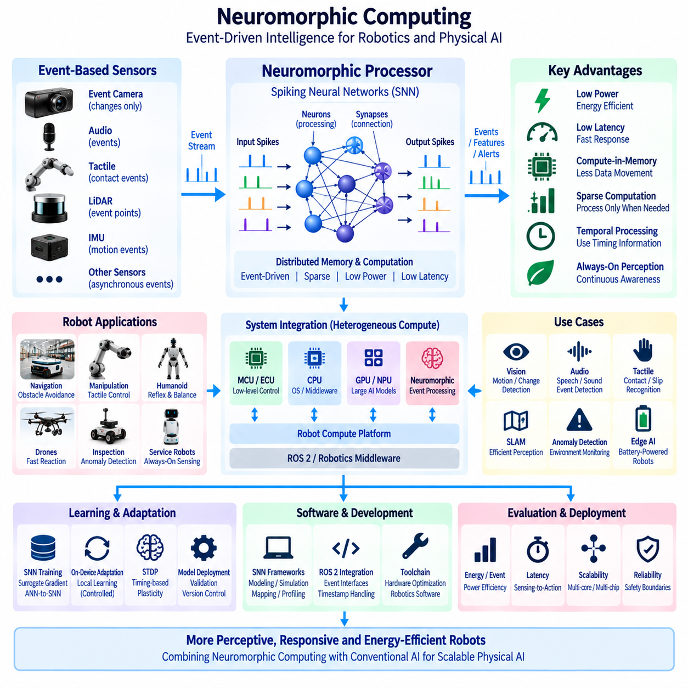
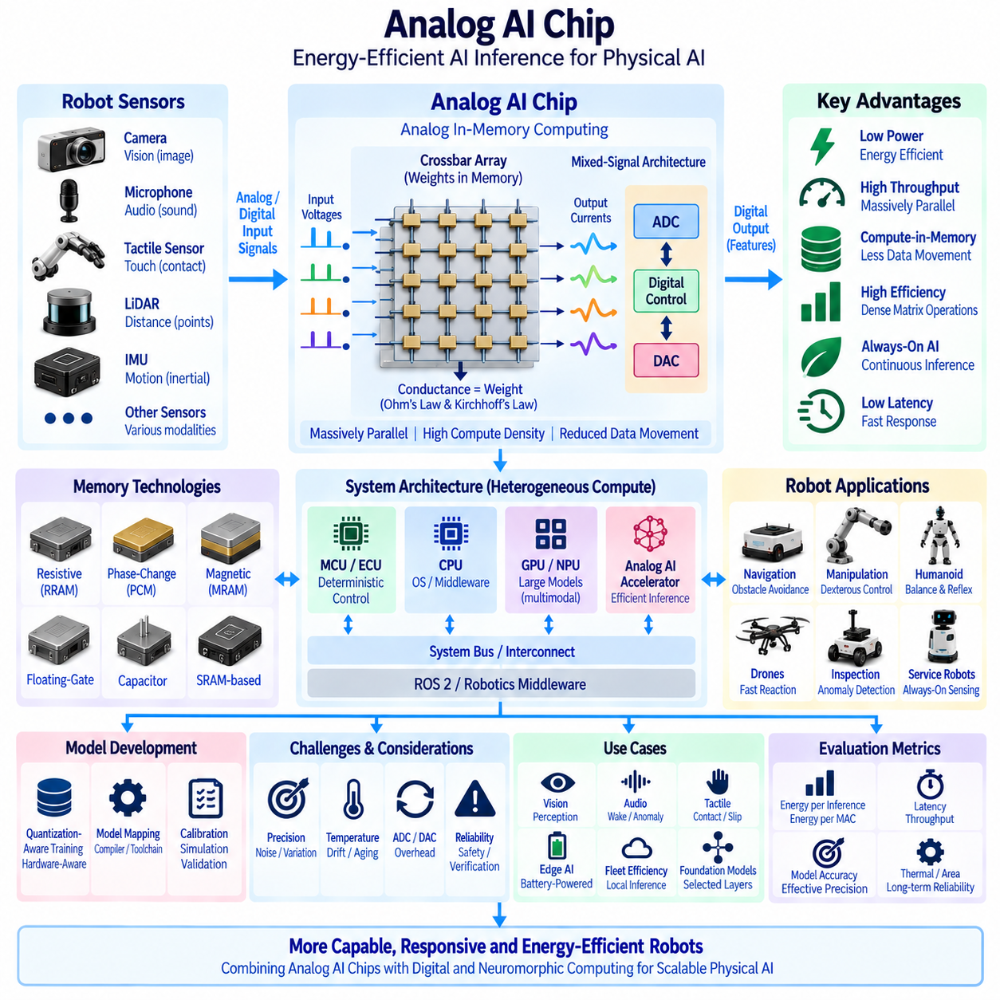
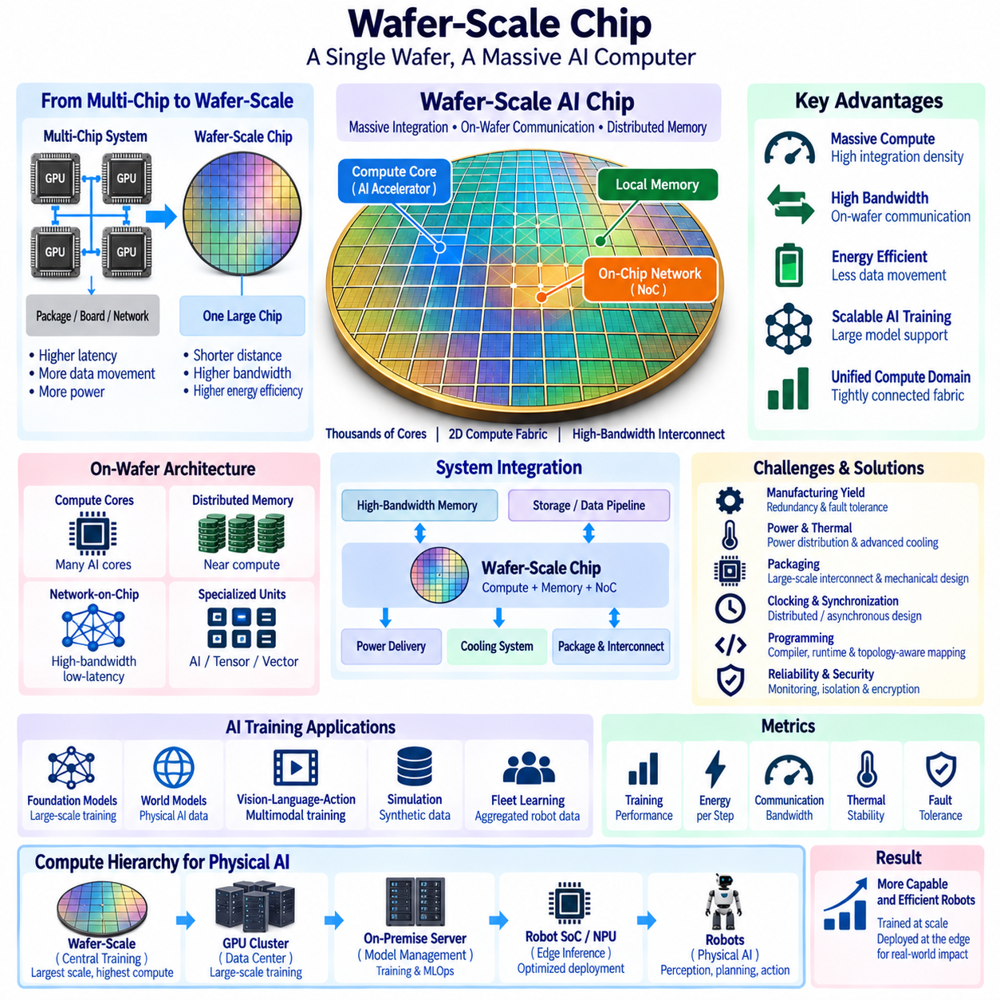
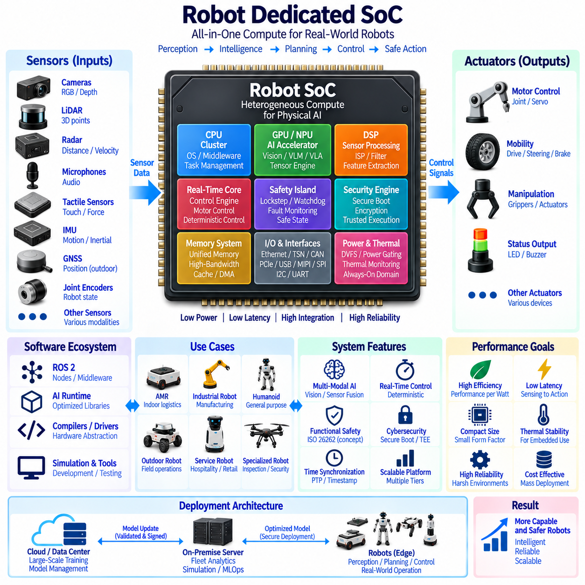
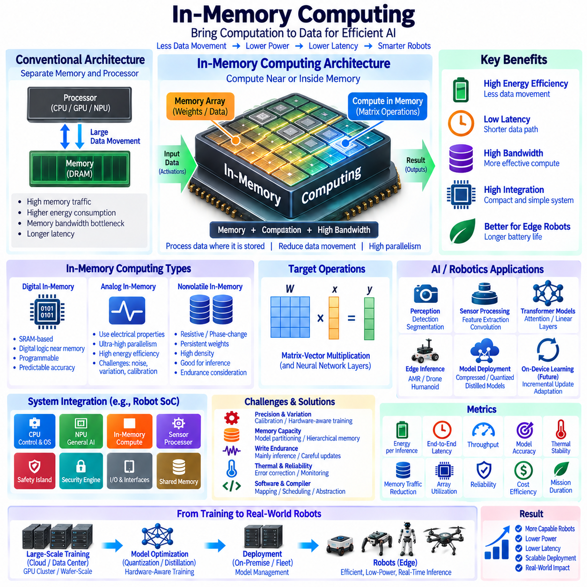

**Volume 16 Compute and AI Architecture**

# Chapter 09. Future AI Computing

## 09.01. Neuromorphic Computing

{width="7.268055555555556in" height="7.268055555555556in"}

뉴로모픽 컴퓨팅(Neuromorphic Computing)은 생물학적 신경계(Biological Nervous System)의 구조와 동작 원리에서 영감을 받은 컴퓨팅 패러다임(Computing Paradigm)이다. 순차적인 명령 실행과 연속적인 수치 처리에 주로 의존하는 대신, 뉴로모픽 시스템은 뉴런과 유사한 처리 요소(Neuron-Like Processing Element)와 시냅스와 유사한 연결(Synapse-Like Connection)을 중심으로 계산을 구성한다. 이러한 접근법은 엄격한 전력, 지연시간 및 열 제약조건에서 인지, 판단 및 반응을 지속적으로 수행해야 하는 로보틱스(Robotics)와 피지컬 인공지능(Physical AI)에 특히 적합하다.

기존 프로세서(Conventional Processor)는 계산과 메모리를 분리하기 때문에 처리 장치와 메모리 장치 사이에서 데이터를 반복적으로 이동해야 한다. 인공지능 워크로드가 증가할수록 이러한 데이터 이동은 중요한 비용 요소가 되며, 산술 연산뿐만 아니라 메모리 접근과 데이터 전송에서도 에너지와 지연시간이 발생한다. 뉴로모픽 아키텍처(Neuromorphic Architecture)는 상태 정보와 계산을 서로 가까운 위치에 배치하고 고도로 분산된 로컬 상호작용(Local Interaction)을 통해 정보를 처리함으로써 이러한 한계를 줄이려 한다.

뉴로모픽 컴퓨팅의 핵심 개념은 스파이킹 신경망(Spiking Neural Network, SNN)이다. 일반적으로 연속적인 값의 활성화(Activation)를 사용하여 통신하는 기존 인공신경망과 달리 SNN은 스파이크(Spike)라고 불리는 이산 이벤트(Discrete Event)를 교환한다. 뉴런은 시간에 따라 입력 이벤트를 누적하고 내부 상태가 정의된 조건에 도달하면 출력 스파이크를 발생시킨다. 따라서 정보는 신호의 크기뿐만 아니라 스파이크 발생 시점, 빈도, 시간적 관계 및 희소 활성 패턴(Sparse Activity Pattern)을 통해서도 표현될 수 있다.

이벤트 구동형 계산(Event-Driven Computation)은 하드웨어가 언제 실제 계산을 수행하는지를 변화시킨다. 기존 인공지능 가속기(AI Accelerator)는 입력 정보의 상당 부분이 거의 변하지 않는 경우에도 미리 정해진 계산 주기에 따라 밀집 행렬 연산(Dense Matrix Operation)을 수행하는 경우가 많다. 뉴로모픽 프로세서(Neuromorphic Processor)는 관련 이벤트가 발생하기 전까지 대부분 비활성 상태를 유지할 수 있다. 따라서 모든 값을 동일한 속도로 지속적으로 처리하는 대신 입력의 정보량과 변화에 따라 계산을 활성화할 수 있다.

이러한 특성은 이벤트 기반 센서(Event-Based Sensor)와 자연스럽게 결합된다. 예를 들어 이벤트 카메라(Event Camera)는 고정된 시간 간격마다 완전한 이미지 프레임을 전송하는 대신 로컬 밝기 변화를 비동기적으로 보고할 수 있다. 뉴로모픽 처리와 결합하면 센서 이벤트를 이벤트 구동형 인지 파이프라인(Event-Driven Perception Pipeline)에 직접 전달할 수 있다. 이를 통해 대부분의 영상 영역에 변화가 없는 장면에서 중복 계산을 줄이면서 움직임과 중요한 환경 변화에는 빠르게 대응할 수 있다.

시간 정보(Temporal Information)는 뉴로모픽 계산의 핵심 요소이다. 생물학적 인지와 제어는 시간에 따라 발생하는 이벤트 사이의 관계에 크게 의존하며, SNN은 뉴런의 내부 상태에 시간적 동역학(Temporal Dynamics)을 직접 포함한다. 이러한 특성으로 인해 뉴로모픽 접근법은 움직임 인지, 시간 패턴 인식, 오디오 처리, 촉각 센싱, 센서 융합(Sensor Fusion), 이상 탐지(Anomaly Detection) 등 관측 정보의 발생 시점과 시간 관계가 중요한 다양한 로봇 기능에 활용될 가능성이 있다.

희소 계산(Sparse Computation)은 또 다른 잠재적인 효율성 이점을 제공한다. 특정 순간에는 일부 뉴런이나 시냅스만 활성화될 수 있으므로 하드웨어 자원을 현재 이벤트에 반응하는 네트워크 영역에 집중할 수 있다. 워크로드와 하드웨어 아키텍처가 이러한 희소성을 효과적으로 활용하면 밀집 신경 연산을 지속적으로 실행하는 방식보다 전력 소비를 크게 줄일 수 있다. 이러한 특성은 배터리 크기를 증가시키지 않으면서 장시간 동작해야 하는 배터리 기반 로봇(Battery-Powered Robot)에 매력적이다.

저지연(Low Latency)은 피지컬 인공지능에서도 매우 중요하다. 빠르게 변화하는 장애물을 만난 로봇이 계산을 시작하기 전에 항상 완전한 센서 프레임, 대규모 배치(Batch) 또는 원격 서버 응답을 기다릴 필요는 없다. 이벤트 구동형 아키텍처는 이벤트가 도착하는 즉시 정보를 처리하여 센싱에서 반응까지의 경로를 단축할 가능성이 있다. 이는 고속 장애물 탐지, 충돌 회피, 매니퓰레이션(Manipulation), 반사적 제어(Reflexive Control) 등 수 밀리초의 차이가 물리적 안전에 영향을 줄 수 있는 기능에 중요하다.

따라서 뉴로모픽 프로세서는 CPU, GPU, NPU 및 기존 인공지능 가속기를 완전히 대체하는 기술이라기보다 상호 보완적인 기술로 볼 수 있다. GPU는 대규모 밀집 신경망, 파운데이션 모델(Foundation Model), 학습, 시뮬레이션 및 병렬 수치 계산에 여전히 매우 효과적이다. CPU는 범용 제어와 시스템 관리에 필수적이다. 뉴로모픽 하드웨어는 시간 처리, 희소 활성, 이벤트 구동형 센싱 및 에너지 효율성이 구조적인 장점을 제공하는 특정 워크로드를 담당할 수 있다.

이기종 로봇 컴퓨팅 플랫폼(Heterogeneous Robot Compute Platform)은 워크로드 특성에 따라 이러한 기술을 결합할 수 있다. 마이크로컨트롤러(MCU) 또는 전자제어장치(ECU)는 결정론적 저수준 제어를 유지하고, CPU는 운영체제와 미들웨어 기능을 실행하며, GPU 또는 NPU는 고성능 인지 및 멀티모달 추론(Multimodal Inference)을 수행할 수 있다. 동시에 뉴로모픽 프로세서는 선택된 이벤트 구동형 센싱이나 빠른 시간 기반 추론을 처리함으로써 각각의 워크로드를 계산 구조에 적합한 하드웨어에 배치할 수 있다.

센서 전처리(Sensor Preprocessing)는 뉴로모픽 가속(Neuromorphic Acceleration)의 실용적인 적용 후보이다. 모든 원시 관측 정보를 고전력 GPU로 직접 전송하는 대신 뉴로모픽 프런트엔드(Neuromorphic Front End)가 변화, 시간 패턴, 이상 상태 또는 중요 이벤트를 탐지하고 관련 정보만 후속 처리 단계로 전달할 수 있다. 이는 하드웨어 수준에서 이벤트 구동형 어텐션 메커니즘(Event-Driven Attention Mechanism)을 형성하며 전체 로봇 아키텍처에서 후단 대역폭, 메모리 트래픽 및 계산 요구량을 감소시킬 수 있다.

뉴로모픽 컴퓨팅은 상시 인지(Always-On Perception)도 지원할 수 있다. 이동 로봇은 고성능 프로세서가 저전력 상태로 동작하는 동안에도 소리, 움직임, 진동, 근접도, 접촉 또는 기타 환경 신호를 지속적으로 모니터링해야 할 수 있다. 저전력 뉴로모픽 서브시스템(Neuromorphic Subsystem)은 지속적인 센싱 계층으로 활성화된 상태를 유지하고 중요한 조건이 탐지된 경우에만 고성능 컴퓨팅 자원을 활성화하여 시스템 수준의 에너지 관리를 향상시킬 수 있다.

로봇 오디오 처리(Robotic Audio Processing)는 음향 신호가 본질적으로 시간적 특성을 가지므로 또 다른 적합한 사례이다. 뉴로모픽 시스템은 음성 특성, 방향 변화, 비정상적인 기계음, 경보음, 충격 또는 환경 음향 패턴을 나타내는 이벤트 시퀀스를 처리할 가능성이 있다. 피지컬 인공지능 시스템에서는 이러한 처리가 메인 GPU를 지속적으로 점유하지 않으면서 비전, 라이다, 레이더 및 기타 센싱 모달리티를 보완하는 효율적인 상시 환경 인식 채널(Always-On Awareness Channel)을 제공할 수 있다.

촉각 센싱(Tactile Sensing)과 매니퓰레이션에도 강한 시간적 특성이 존재한다. 로봇 손과 매니퓰레이터는 접촉, 압력 변화, 미끄러짐(Slip), 진동 및 물질 상호작용을 나타내는 고주파 신호를 수신할 수 있다. 이벤트 구동형 처리는 변하지 않는 센서 값을 반복적으로 처리하는 대신 접촉 상태의 변화에 계산을 집중할 수 있다. 이를 통해 빠른 반사적 반응을 지원하고 촉각 센싱과 저수준 매니퓰레이션 제어 사이에 추가적인 계산 경로를 제공할 수 있다.

뉴로모픽 시스템의 학습 방법은 기존 딥러닝(Deep Learning)과 중요한 차이가 있다. 표준 역전파(Backpropagation)는 미분 가능한 연산을 가정하지만 이산적인 스파이크는 직접적인 그래디언트 계산을 어렵게 한다. 따라서 SNN 개발에는 대리 그래디언트(Surrogate Gradient) 방법, 학습된 인공신경망의 변환, 로컬 학습 규칙(Local Learning Rule) 또는 기타 학습 방식을 사용할 수 있다. 학습 방법의 선택은 정확도, 하드웨어 효율성, 시간적 행동 및 기존 인공지능 개발 파이프라인과의 호환성에 영향을 준다.

스파이크 타이밍 의존 가소성(Spike-Timing-Dependent Plasticity, STDP)은 뉴로모픽 시스템과 관련된 생물학적 영감의 학습 원리를 보여준다. 연결의 변화는 시냅스 전 뉴런(Pre-Synaptic Neuron)과 시냅스 후 뉴런(Post-Synaptic Neuron)의 상대적인 활성 시점에 따라 결정될 수 있으므로 시간적 관계가 학습에 영향을 줄 수 있다. 실제 로봇 인공지능이 생물학적 시스템을 정확하게 재현할 필요는 없지만, 이러한 메커니즘은 대규모 중앙 집중형 학습에만 의존하지 않고 로컬 상호작용을 통해 적응이 가능할 수 있음을 보여준다.

따라서 온디바이스 적응(On-Device Adaptation)은 중요한 장기적 가능성이다. 로봇은 시간이 지나면서 변화하는 환경에서 운영되며, 선택된 뉴로모픽 학습 메커니즘을 사용하면 데이터를 중앙 GPU 서버로 지속적으로 전송하지 않고 센서 가까이에서 제한적인 적응을 수행할 수 있다. 로컬 적응(Local Adaptation)은 개인화된 센싱, 환경 보정, 이상 인식 또는 변화하는 시간 패턴을 지원할 수 있다. 그러나 통제되지 않은 온라인 학습(Online Learning)은 검증, 안정성, 안전 및 사이버보안 문제를 발생시키므로 엄격한 아키텍처 경계가 필요하다.

뉴로모픽 컴퓨팅은 소프트웨어 개발 모델(Software Development Model)에도 변화를 가져온다. 기존 인공지능 프레임워크는 주로 텐서(Tensor), 계층, 밀집 수치 연산 및 GPU 실행을 중심으로 최적화되어 있다. 뉴로모픽 애플리케이션에는 스파이크, 뉴런 상태, 시간적 동역학, 연결 구조 및 비동기 이벤트의 표현이 필요하다. 따라서 툴체인(Toolchain)은 보다 광범위한 로봇 소프트웨어 환경과 통합되면서 모델 생성, 시뮬레이션, 매핑, 프로파일링(Profiling), 배포 및 하드웨어별 최적화를 지원해야 한다.

ROS 2 및 로봇 미들웨어와의 통합에는 신중한 인터페이스 설계가 필요하다. 뉴로모픽 처리는 비동기적으로 동작할 수 있지만 기존의 많은 로봇 소프트웨어 구성요소는 주기적인 메시지나 프레임 기반 데이터를 예상한다. 따라서 게이트웨이(Gateway)를 통해 이벤트 스트림을 기존 표현으로 변환하거나 호환 가능한 애플리케이션에 이벤트 네이티브 인터페이스(Event-Native Interface)를 제공할 수 있다. 비동기 이벤트를 변환할 때 시간적 관계를 유지하지 않으면 뉴로모픽 처리의 핵심 장점 중 하나가 사라질 수 있으므로 타임스탬프 보존이 중요하다.

벤치마킹(Benchmarking)은 기존의 추론 정확도만 평가해서는 안 된다. 관련 평가 지표에는 추론 또는 이벤트당 에너지(Energy per Inference or Event), 센싱-행동 지연시간(Sensing-to-Action Latency), 이벤트 처리량(Event Throughput), 메모리 트래픽, 유휴 전력(Idle Power), 시간적 정확도 및 실제 희소 워크로드에서의 강건성이 포함된다. 매우 희소한 벤치마크에서는 효율적으로 보이는 뉴로모픽 시스템도 실제 애플리케이션에서 밀집된 연속 활동이 발생하면 장점이 감소할 수 있으므로 실제 로봇 센서와 운영 환경을 반영하여 평가해야 한다.

확장성(Scalability)은 뉴런과 시냅스 자원을 실제 하드웨어에 어떻게 매핑하는지에 따라 달라진다. 대규모 SNN은 여러 처리 코어 또는 칩 사이의 통신을 필요로 할 수 있으므로 인터커넥트 아키텍처(Interconnect Architecture)가 중요해진다. 스파이크 트래픽이 밀집되면 통신 오버헤드가 증가하여 희소 계산에서 기대했던 효율성을 감소시킬 수 있다. 따라서 복잡한 로봇 지능으로 뉴로모픽 처리를 확장할 때 네트워크 토폴로지, 라우팅, 메모리 지역성(Memory Locality), 뉴런 배치 및 워크로드 분할이 중요한 설계 변수가 된다.

신뢰성(Reliability)과 결정론적 동작(Deterministic Behavior)도 고려해야 한다. 물리적 로봇은 안전 제약조건에서 동작하며 비동기 이벤트 구동형 처리는 기존의 주기적 파이프라인과 다른 시간 특성을 가질 수 있다. 뉴로모픽 출력이 안전 관련 제어에 영향을 주도록 허용하기 전에 엔지니어는 최악 조건 지연시간(Worst-Case Latency), 이벤트 혼잡, 이벤트 손실, 프로세서 포화 및 장애 모드를 이해해야 한다. 따라서 뉴로모픽 가속은 명확하게 정의된 안전 및 감독 경계(Safety and Supervisory Boundary) 안에서 통합되어야 한다.

뉴로모픽 프로세서는 전력과 열 제약이 이동 플랫폼에 탑재할 수 있는 지능의 양을 결정하는 경우가 많기 때문에 특히 엣지(Edge)에서 매력적이다. 지속적인 GPU 사용률을 낮추면 운영 시간을 연장하고 냉각 요구사항을 줄이며 더 작은 컴퓨팅 모듈을 사용할 수 있다. 실외 자율이동로봇(Outdoor AMR), 드론(Drone), 휴머노이드(Humanoid), 사족보행 로봇(Quadruped), 소형 점검 로봇(Compact Inspection Robot)에서는 이러한 개선이 페이로드, 배터리 용량, 인클로저 설계, 신뢰성 및 전체 시스템 아키텍처에 직접적인 영향을 줄 수 있다.

함대 수준(Fleet Level)에서는 뉴로모픽 엣지 처리(Neuromorphic Edge Processing)를 통해 중앙 인프라로 전송해야 하는 정보량을 줄일 수 있다. 로컬 이벤트 탐지(Local Event Detection)는 지속적인 센서 스트림을 통신 전에 압축된 이벤트, 특징 또는 경고로 변환할 수 있다. 중앙 인공지능과 GPU 서버는 함대 최적화, 대형 모델 추론, 학습, 이력 분석 및 모델 관리에 집중하고, 분산된 뉴로모픽 장치는 물리 센서 가까이에서 선택적인 저전력 인지와 시간 기반 처리를 수행할 수 있다.

따라서 뉴로모픽 컴퓨팅은 독립적인 프로세서 기술이라기보다 더 광범위한 이기종 피지컬 인공지능 아키텍처(Heterogeneous Physical AI Architecture)의 일부로 이해해야 한다. 뉴로모픽 컴퓨팅의 가장 강력한 역할은 희소 시간 정보(Sparse Temporal Information), 비동기 센싱, 저지연 및 에너지 효율성이 서로 결합되는 영역에서 나타난다. 기존 컴퓨팅은 범용 로보틱스와 대규모 인공지능에 계속 필수적이며, 뉴로모픽 하드웨어는 워크로드 특성이 추가적인 아키텍처 복잡성을 정당화할 때 선택할 수 있는 전문화된 실행 영역(Specialized Execution Domain)을 제공한다.

뉴로모픽 컴퓨팅의 장기적인 중요성은 피지컬 인공지능 시스템이 현실 세계와의 지속적인 상호작용을 더욱 효율적으로 처리하도록 하는 데 있다. 이벤트 구동형 센서, 스파이킹 신경망, 분산 메모리 및 계산(Distributed Memory and Computation), 희소 활성(Sparse Activation), 시간적 추론(Temporal Reasoning), 저전력 엣지 실행을 결합함으로써 뉴로모픽 아키텍처는 의미 있는 환경 변화에 빠르게 반응하면서 더욱 오랫동안 인지 상태를 유지할 수 있는 로봇 시스템으로 발전할 수 있는 경로를 제공한다.

미래의 로봇 아키텍처는 기존 딥러닝, 파운데이션 모델, 월드 모델(World Model), 뉴로모픽 인지(Neuromorphic Perception), 결정론적 제어(Deterministic Control)를 하나의 통합된 컴퓨팅 계층 구조(Unified Compute Hierarchy) 안에서 결합할 수 있다. 대규모 GPU 시스템은 고성능 추론과 학습을 제공하고 뉴로모픽 서브시스템은 역동적인 물리 환경과의 효율적인 상시 상호작용을 담당할 수 있다. 아키텍처의 목표는 생물학적 뇌를 문자 그대로 모방하는 것이 아니라 확장 가능하고 신속하게 반응하며 에너지 효율적인 피지컬 인공지능을 구현하는 데 실질적인 장점을 제공하는 생물학적 계산 원리를 활용하는 것이다.

## 09.02. Analog AI Chip

{width="7.268055555555556in" height="7.268055555555556in"}

아날로그 인공지능 칩(Analog AI Chip)은 기존의 디지털 산술 연산에만 의존하는 대신 물리적인 전기량을 통해 정보를 표현하고 조작하여 선택된 인공지능 연산을 수행한다. 전압(Voltage), 전류(Current), 컨덕턴스 상태(Conductance State), 전하(Charge) 또는 기타 아날로그 특성이 계산에 직접 참여할 수 있다. 피지컬 인공지능(Physical AI) 시스템에서는 이러한 접근법을 통해 신경망 추론에 사용되는 대규모 곱셈-누산(Multiply-and-Accumulate, MAC) 연산에서 발생하는 에너지 소비와 데이터 이동을 줄일 수 있다는 점에서 중요하다.

기존 디지털 인공지능 가속기(Conventional Digital AI Accelerator)는 일반적으로 가중치(Weight)와 활성값(Activation)을 이진 수치로 표현하고 이를 메모리와 산술 연산 장치 사이에서 반복적으로 이동시킨다. 산술 연산 자체가 효율적이더라도 메모리 접근은 상당한 에너지를 소비하고 지연시간을 증가시킬 수 있다. 아날로그 인공지능 아키텍처(Analog AI Architecture)는 모델 파라미터를 계산 구조 가까이에 또는 계산 구조 내부에 직접 저장하여 메모리 접근과 계산을 함께 수행함으로써 이러한 오버헤드를 줄이려 한다.

가장 중요한 아키텍처 개념은 아날로그 인메모리 컴퓨팅(Analog In-Memory Computing)이다. 개별 신경망 가중치를 메모리에서 읽어 별도의 곱셈-누산 장치로 전송하는 대신 프로그래밍 가능한 메모리 소자의 배열(Array)이 다수의 가중치를 동시에 표현할 수 있다. 입력 신호를 배열에 인가하면 회로의 물리적 반응을 이용하여 많은 곱셈과 누산 연산을 병렬로 수행할 수 있다. 이는 메모리, 계산, 대역폭 및 에너지 사이의 기본적인 관계를 변화시킨다.

크로스바 배열(Crossbar Array)은 이러한 컴퓨팅 모델과 대표적으로 연관되는 구조이다. 전도성 소자(Conductive Element)를 행과 열의 교차점에 배치하고 각 소자가 프로그래밍 가능한 가중치 또는 가중치의 일부를 표현하도록 구성한다. 행에 입력 전압을 인가하면 컨덕턴스를 통해 전류가 흐르고 열을 따라 누적된 전류가 가중합(Weighted Sum)을 나타낸다. 따라서 옴의 법칙(Ohm\'s Law)과 키르히호프 전류 법칙(Kirchhoff\'s Current Law)이 신경망 행렬 연산을 구현하는 물리적 메커니즘의 일부가 된다.

이러한 대규모 병렬 연산(Massively Parallel Operation)은 행렬-벡터 곱(Matrix-Vector Multiplication)이 많은 신경망 워크로드의 주요 계산을 차지하기 때문에 특히 중요하다. 디지털 프로세서는 수많은 개별 산술 명령을 실행하거나 디지털 MAC 배열을 사용하는 반면, 아날로그 배열은 회로 자체의 전기적 동작을 통해 다수의 가중 연산을 동시에 수행할 수 있다. 이를 통해 모델 파라미터의 이동을 크게 줄이면서 매우 높은 계산 밀도(Computational Density)를 확보할 가능성이 있다.

아날로그 인공지능이 전체 인공지능 시스템을 모두 아날로그 영역에서 동작시켜야 한다는 의미는 아니다. 실제 아키텍처는 일반적으로 아날로그 계산 배열과 디지털 제어(Digital Control), 메모리 관리, 활성화 함수, 스케줄링, 통신 및 시스템 인터페이스를 결합하는 혼합신호 시스템(Mixed-Signal System)으로 구성된다. 디지털-아날로그 변환기(Digital-to-Analog Converter, DAC)는 디지털 입력을 전기 신호로 변환하고, 아날로그-디지털 변환기(Analog-to-Digital Converter, ADC)는 누적된 아날로그 결과를 후속 처리를 위한 디지털 표현으로 변환한다.

이러한 데이터 변환기(Data Converter)는 필수적이지만 동시에 아키텍처 오버헤드를 발생시킨다. ADC와 DAC 회로는 전력을 소비하고 실리콘 면적을 차지하며, 특히 높은 정밀도 또는 높은 샘플링 속도가 요구되는 경우 지연시간을 증가시킨다. 따라서 아날로그 인공지능 칩의 효율은 아날로그 계산 배열 자체뿐만 아니라 주변 회로(Peripheral Circuitry)에 의해서도 결정된다. 행렬 계산이 매우 효율적이더라도 변환과 데이터 이동이 전체 에너지 소비를 지배하면 상당한 장점이 상쇄될 수 있다.

정밀도(Precision)는 또 하나의 근본적인 고려사항이다. 디지털 계산은 지정된 비트 폭(Bit Width) 내에서 높은 반복성을 가진 수치 표현을 제공할 수 있지만, 아날로그 계산은 회로 잡음, 소자 편차(Device Variation), 온도, 공급 전압, 노화 및 제조 편차의 영향을 받는다. 따라서 아날로그 인공지능 아키텍처는 일반적으로 효율성 향상을 위해 통제된 수치적 불확실성(Numerical Uncertainty)을 수용한다. 신경망은 일정 수준의 계산 오차를 허용할 수 있기 때문에 인공지능 추론은 이러한 상충관계에 적합한 워크로드가 될 수 있다.

양자화 인식 학습(Quantization-Aware Training)과 하드웨어 인식 학습(Hardware-Aware Training)은 이러한 한계에서도 모델이 성공적으로 동작하도록 지원할 수 있다. 모델 개발 과정에서 정밀도 감소, 컨덕턴스 편차, 잡음, 비선형 동작, 포화(Saturation) 또는 기타 하드웨어 영향을 시뮬레이션할 수 있다. 이를 통해 모델은 실제 물리 소자에서 재현할 수 없는 수학적으로 이상적인 계산만을 가정하는 대신 대상 아날로그 가속기의 특성에서도 강건하게 동작하도록 학습될 수 있다.

메모리 기술(Memory Technology)은 아날로그 인공지능 아키텍처에 큰 영향을 준다. 후보 구현 방식에는 저항성 메모리(Resistive Memory), 상변화 메모리(Phase-Change Memory), 자기 메모리(Magnetic Memory), 플로팅 게이트 소자(Floating-Gate Device), 커패시터 기반 구조(Capacitor-Based Structure), SRAM 지원 아날로그 계산(SRAM-Assisted Analog Computing) 또는 기타 기술이 포함될 수 있다. 각 기술은 프로그래밍 정밀도, 데이터 유지 특성, 내구성, 쓰기 에너지, 집적 밀도, 편차, 제조 성숙도 및 기존 반도체 공정과의 호환성에서 서로 다른 상충관계를 가진다.

저항성 소자(Resistive Device)는 컨덕턴스가 신경망 가중치를 직접 표현할 수 있다는 점에서 특히 흥미롭다. 다수의 이러한 소자를 배열로 구성하면 전류의 흐름을 이용하여 자연스럽게 가중합을 구현할 수 있다. 그러나 실제 적용에서는 소자 간 편차, 제한된 컨덕턴스 상태, 프로그래밍 오차, 드리프트(Drift), 내구성 한계 및 비선형 동작을 처리해야 한다. 따라서 시스템 수준의 효율은 소자 물리(Device Physics)와 알고리즘 보상(Algorithmic Compensation)의 결합에 의해 결정된다.

아날로그 인공지능 칩은 전력 및 열 예산이 제한되는 엣지 추론(Edge Inference)에서 상당한 이점을 제공할 수 있다. 이동 로봇은 GPU 성능을 지속적으로 증가시키면 배터리 크기, 냉각 시스템, 인클로저(Enclosure) 부피 및 운용시간에 영향을 받는다. 선택된 신경망 계층을 효율적인 아날로그 가속기에서 실행하면 반복적인 추론에 필요한 에너지를 줄이고 중앙 서버와 지속적으로 통신하지 않고도 더 많은 지능을 로컬에서 활성 상태로 유지할 수 있다.

인지 워크로드(Perception Workload)는 로봇 시스템이 합성곱(Convolution), 어텐션(Attention), 프로젝션(Projection), 특징 변환(Feature Transformation), 행렬 곱셈을 반복적으로 실행하기 때문에 자연스러운 적용 후보이다. 카메라, 오디오, 레이더, 촉각 및 기타 센서 처리 네트워크는 계산 구조가 아날로그 배열에 효율적으로 매핑될 경우 이점을 얻을 수 있다. 특히 대규모 가중치 행렬을 계산 배열에 상주시켜 외부 메모리에서 반복적으로 전송하지 않고 여러 번 재사용할 수 있을 때 가장 큰 장점이 나타날 수 있다.

상시 인공지능(Always-On AI)도 잠재적인 응용 분야이다. 로봇은 메인 GPU가 완전히 활성화되지 않은 상태에서도 웨이크 이벤트(Wake Event), 이상 상태, 사람, 움직임, 음향 패턴, 장비 상태 또는 환경 변화를 지속적으로 탐지해야 할 수 있다. 저전력 아날로그 추론 서브시스템(Analog Inference Subsystem)이 선택된 신경망 모델을 지속적으로 처리하고 더 복잡한 추론이 필요한 경우에만 고성능 프로세서를 활성화하면 시스템의 평균 전력 소비를 줄일 수 있다.

따라서 아날로그 인공지능은 이기종 피지컬 인공지능 컴퓨팅 아키텍처(Heterogeneous Physical AI Compute Architecture)에 참여할 수 있다. 마이크로컨트롤러(MCU) 또는 전자제어장치(ECU)는 결정론적 제어를 실행하고, CPU는 운영체제와 미들웨어를 관리하며, GPU와 NPU는 대규모 멀티모달 모델(Multimodal Model)을 실행하고, 아날로그 가속기는 적합한 대용량 신경망 연산을 처리할 수 있다. 목표는 모든 알고리즘을 하나의 프로세서 유형에 강제로 배치하는 것이 아니라 지연시간, 정밀도, 에너지, 프로그래밍 가능성 및 워크로드 구조에 따라 계산을 배분하는 것이다.

모든 신경망 연산이 아날로그 하드웨어에 효율적으로 매핑되는 것은 아니므로 이러한 워크로드 분할(Workload Partitioning)에는 신중한 분석이 필요하다. 대규모 행렬 연산은 상당한 이점을 얻을 수 있지만 제어 흐름(Control Flow), 인덱싱(Indexing), 희소하고 불규칙한 연산, 기호 처리(Symbolic Processing), 범용 소프트웨어는 일반적으로 디지털 프로세서에 더 적합하다. 따라서 실용적인 시스템에서는 아날로그 실행 영역과 디지털 실행 영역 사이에서 중간 결과를 이동하는 데 필요한 오버헤드를 최소화해야 한다.

트랜스포머(Transformer)와 파운데이션 모델(Foundation Model) 워크로드는 기회와 과제를 동시에 제공한다. 대규모 행렬 연산은 아날로그 병렬성을 활용할 가능성이 있지만 모델 크기, 정밀도 요구사항, 동적 활성값(Dynamic Activation), 어텐션 구조 및 빈번한 중간 데이터 이동은 구현을 복잡하게 한다. 따라서 초기 아날로그 가속은 전체 대규모 언어 모델이나 멀티모달 모델을 순수한 아날로그 하드웨어에서 실행하기보다 특정 선형 계층(Linear Layer) 또는 반복적인 행렬 연산을 대상으로 할 수 있다.

가중치 고정 실행(Weight-Stationary Execution)은 추론에서 특히 매력적이다. 학습된 모델 가중치를 아날로그 배열에 프로그래밍하면 다수의 입력 벡터를 처리하는 동안 물리적으로 해당 배열에 계속 유지할 수 있다. 이를 통해 기존 인공지능 시스템의 주요 에너지 소비 요소 중 하나인 외부 메모리로부터의 반복적인 가중치 읽기를 줄일 수 있다. 동일한 모델을 장시간 지속적으로 실행하는 로봇 인지 시스템에서는 이러한 장점이 더욱 커질 수 있다.

아날로그 하드웨어에서 직접 학습하는 것은 빈번하고 정밀한 가중치 업데이트, 그래디언트 계산 및 안정적인 수치 동작이 필요하므로 추론보다 어렵다. 일부 아키텍처에서는 온칩 학습(On-Chip Learning) 또는 인메모리 학습(In-Memory Learning)을 연구하지만, 많은 실용적 시스템에서는 기존 GPU 인프라를 사용하여 모델을 학습한 후 검증된 모델을 아날로그 가속기에 매핑하여 배포할 수 있다. 이를 통해 높은 유연성을 가진 모델 개발과 에너지 효율적인 엣지 실행을 분리할 수 있다.

따라서 모델 매핑(Model Mapping)은 소프트웨어 툴체인(Software Toolchain)의 중요한 부분이 된다. 대규모 신경망 행렬은 배열 크기, 정밀도, 소자 특성 및 사용 가능한 메모리 용량에 따라 여러 물리적 배열로 분할해야 할 수 있다. 또한 컴파일 과정에서 보정 파라미터(Calibration Parameter), 스케일링 계수(Scaling Factor), 양자화 규칙, 변환기 설정 및 오차 보상 정보를 생성해야 할 수 있다. 따라서 배포는 알고리즘, 컴파일러 및 하드웨어를 함께 최적화하는 문제로 발전한다.

아날로그 회로의 물리적 동작은 장치와 운영 조건에 따라 달라질 수 있으므로 보정(Calibration)은 필수적이다. 시스템은 제조, 시작, 유지보수 또는 주기적인 운영 과정에서 배열의 응답을 특성화하고 보정 파라미터를 사용하여 예측 가능한 오차를 보상할 수 있다. 온도 센서, 기준 회로(Reference Circuit), 디지털 보정(Digital Correction), 중복성(Redundancy) 또는 적응형 보정을 사용하면 로봇이 변화하는 열적·전기적 환경에서 동작할 때 안정성을 향상시킬 수 있다.

신뢰성(Reliability)은 로봇의 전체 운용 수명에 걸쳐 평가해야 한다. 이동 플랫폼은 온도 변화, 진동, 전원 변동, 반복적인 시작 주기 및 장시간 운영을 경험한다. 기반 기술에 따라 아날로그 가중치 표현은 소자가 노화하면서 드리프트하거나 변화할 수 있다. 따라서 모니터링, 자가진단(Self-Test), 재보정(Recalibration), 고장 탐지 및 기존 프로세서를 이용한 폴백 실행(Fallback Execution)이 강건한 피지컬 인공지능 아키텍처의 중요한 요소가 될 수 있다.

안전 관련 기능(Safety-Relevant Function)은 아날로그 계산의 불확실성이 통제되지 않은 물리적 행동으로 전달되어서는 안 되므로 특별한 주의가 필요하다. 아날로그 가속기에서 생성된 인지 또는 예측 결과는 신뢰도 임계값, 타당성 검사(Plausibility Test), 중복 센싱(Redundant Sensing), 감독 로직(Supervisory Logic) 또는 독립적인 안전 채널을 통해 검증할 수 있다. 비상 정지와 같은 결정론적 안전 기능은 최악 조건의 동작을 적절하게 검증할 수 있는 아키텍처에 유지되어야 한다.

아날로그 인공지능의 벤치마킹(Benchmarking)은 이론적인 초당 연산량만을 평가하기보다 시스템 수준의 측정이 필요하다. 중요한 지표에는 추론당 에너지(Energy per Inference), MAC당 에너지(Energy per MAC), 종단간 지연시간(End-to-End Latency), 처리량(Throughput), 유효 정밀도(Effective Precision), 모델 정확도, 변환기 오버헤드, 메모리 트래픽, 열 특성, 보정 안정성, 실리콘 면적 및 온도 변화에 따른 성능이 포함된다. 비현실적인 조건을 통해 효율성을 과장하지 않도록 동일한 워크로드와 정확도 목표를 기준으로 비교해야 한다.

아날로그 인공지능과 뉴로모픽 컴퓨팅(Neuromorphic Computing)은 상호 보완적이지만 서로 구별되는 기술이다. 뉴로모픽 시스템은 이벤트 구동형 시간 처리, 스파이크, 희소 활성 및 뉴런에서 영감을 받은 동역학을 강조하는 반면, 아날로그 인공지능은 주로 물리적 전기 계산을 이용하여 수치 기반 신경망 연산을 가속한다. 미래의 칩은 두 접근법의 요소를 결합할 수 있지만 로봇 컴퓨팅 시스템을 설계할 때 각각의 아키텍처적 목적과 최적 워크로드를 명확히 구분해야 한다.

함대 수준(Fleet Level)에서는 효율적인 아날로그 추론을 통해 지속적으로 동작하는 엣지 지능(Edge Intelligence)의 전력 요구량을 줄일 수 있다. 로봇은 더 많은 인지 처리를 로컬에서 수행하고 원시 센서 스트림 대신 상위 수준 특징을 전송할 수 있으며, 중앙 GPU 서버는 대규모 추론, 함대 학습, 시뮬레이션, 모델 학습 및 이력 분석에 집중할 수 있다. 이는 시간 임계적인 물리 지능을 로봇 가까이에서 실행하고 계산 집약적인 공유 지능은 중앙 자원을 활용한다는 광범위한 원칙을 지원한다.

아날로그 인공지능은 하드웨어-소프트웨어 공동설계(Hardware-Software Co-Design)에도 영향을 준다. 신경망 아키텍처, 양자화 방법, 메모리 기술, 회로 특성, 컴파일러 매핑, 보정, 열 설계 및 로봇 워크로드를 서로 독립적으로 최적화할 수 없다. GPU에서 높은 성능을 보이는 모델이 아날로그 가속기에서도 가장 효율적인 모델이라는 보장은 없다. 따라서 피지컬 인공지능 개발에서는 실제 센싱, 지연시간, 전력 및 신뢰성 요구사항을 중심으로 모델과 하드웨어를 함께 설계하는 접근법이 중요해진다.

아날로그 인공지능 칩의 장기적인 중요성은 기존 컴퓨팅 아키텍처에서 막대한 양의 신경망 데이터를 이동시키는 데 필요한 에너지 비용을 극복하는 데 있다. 메모리 소자와 전기 회로가 행렬 계산에 직접 참여하도록 함으로써 아날로그 인공지능은 훨씬 높은 추론 효율성을 달성할 수 있는 경로를 제공한다. 그러나 실제 성공 여부는 정밀도, 편차, 데이터 변환 오버헤드, 프로그래밍 가능성, 신뢰성 및 제조 복잡성을 얼마나 효과적으로 통제하는가에 달려 있다.

미래의 피지컬 인공지능 플랫폼은 CPU, GPU, NPU, 뉴로모픽 프로세서 및 아날로그 인공지능 가속기(Analog AI Accelerator)를 하나의 통합된 이기종 컴퓨팅 계층 구조(Unified Heterogeneous Computing Hierarchy) 안에서 결합할 수 있다. 대규모 디지털 프로세서는 유연한 추론과 모델 실행을 계속 제공하고, 특화된 아날로그 하드웨어는 적합한 반복적 신경망 연산을 훨씬 낮은 에너지로 가속할 수 있다. 아키텍처의 목표는 각각의 계산을 물리적 구현이 지능, 지연시간, 전력, 강건성 및 확장성 사이에서 가장 적절한 균형을 제공하는 위치에 배치하는 것이다.

## 09.03. Wafer Scale Chip

{width="7.268055555555556in" height="7.268055555555556in"}

웨이퍼 스케일 칩(Wafer-Scale Chip)은 프로세서를 비교적 작은 다이(Die)로 분할해야 한다는 기존 반도체 컴퓨팅의 전제를 넘어서는 기술이다. 실리콘 웨이퍼(Silicon Wafer)를 여러 개의 독립적인 칩으로 절단한 후 패키지, 보드 및 외부 네트워크를 통해 다시 연결하는 대신, 웨이퍼 스케일 집적(Wafer-Scale Integration)은 웨이퍼의 매우 넓은 영역을 하나의 통합된 컴퓨팅 시스템으로 활용한다. 이러한 접근법은 산술 연산 자체보다 통신, 메모리 대역폭 및 데이터 이동이 점차 성능의 주요 제약요인이 되고 있는 인공지능 워크로드를 대상으로 한다.

기존 멀티칩 인공지능 시스템(Multi-Chip AI System)은 PCIe, 고속 패브릭(High-Speed Fabric), 네트워크 스위치를 통해 다수의 GPU, 가속기 또는 프로세서 다이를 연결하여 계산 성능을 확장한다. 이러한 시스템은 매우 높은 총연산 성능을 제공할 수 있지만 장치 사이의 통신은 칩 내부 통신보다 느리고 더 많은 에너지를 소비한다. 웨이퍼 스케일 아키텍처(Wafer-Scale Architecture)는 훨씬 더 많은 통신을 실리콘 내부로 이동시켜 처리 요소 사이의 물리적 거리를 줄이고 사용 가능한 인터커넥트 대역폭(Interconnect Bandwidth)을 증가시키려 한다.

근본적인 장점은 집적 밀도(Integration Density)에서 발생한다. 하나의 웨이퍼에는 매우 많은 수의 프로세싱 코어(Processing Core), 로컬 메모리(Local Memory), 통신 라우터(Communication Router), 특화된 인공지능 실행 장치를 배치할 수 있는 물리적 공간이 존재한다. 각 가속기를 독립적인 외부 통신 경계를 가진 장치로 취급하는 대신 이러한 자원을 거대한 2차원 컴퓨팅 패브릭(Two-Dimensional Computing Fabric)으로 구성할 수 있다. 대규모 인공지능 워크로드를 긴밀하게 통합된 실행 환경 안에서 웨이퍼 전체에 분산하여 처리할 수 있다.

온웨이퍼 통신(On-Wafer Communication)은 이러한 아키텍처의 핵심이다. 수천 개의 컴퓨팅 요소는 활성값(Activation), 그래디언트(Gradient), 파라미터, 중간 텐서(Intermediate Tensor), 동기화 정보를 효율적으로 교환해야 한다. 고밀도 네트워크온칩(Network-on-Chip)은 인접 영역 사이에 짧고 높은 대역폭의 통신 경로를 제공하고, 계층형 경로를 통해 웨이퍼의 더 넓은 영역을 연결할 수 있다. 이를 통해 기존에는 별도의 가속기 패키지 사이에서 수행되던 통신에 대한 외부 네트워크 의존성을 줄일 수 있다.

로컬 메모리 분산(Local Memory Distribution)도 마찬가지로 중요하다. 인공지능 워크로드는 파라미터와 중간 결과를 컴퓨팅 장치와 외부 메모리 사이에서 이동하는 과정에서 성능 제약을 받는 경우가 많다. 웨이퍼 스케일 시스템은 메모리 자원을 프로세싱 코어 가까이에 배치하여 자주 접근하는 데이터를 계산 위치에 물리적으로 가깝게 유지할 수 있다. 따라서 분산 메모리 아키텍처(Distributed Memory Architecture)는 지연시간과 에너지 소비를 줄이면서 전체 컴퓨팅 영역에 매우 높은 총대역폭을 제공할 수 있다.

이 아키텍처는 특히 대규모 신경망 학습(Large Neural-Network Training)에 적합하다. 파운데이션 모델(Foundation Model), 멀티모달 모델(Multimodal Model), 월드 모델(World Model), 비전-언어-행동 모델(Vision-Language-Action Model, VLA) 및 기타 대규모 인공지능 시스템은 방대한 텐서 연산과 병렬 작업자 사이의 통신을 필요로 한다. 모델 파라미터 또는 중간 상태가 다수의 기존 가속기에 분산되면 동기화가 주요 병목이 될 수 있다. 웨이퍼 스케일 집적은 훨씬 더 큰 규모의 긴밀하게 연결된 컴퓨팅 영역을 제공하여 이러한 경계의 일부를 줄일 수 있다.

모델 병렬화(Model Parallelism)는 웨이퍼 스케일 패브릭에 자연스럽게 매핑될 수 있다. 신경망의 서로 다른 부분을 각각 다른 프로세서 영역에서 실행하고 고대역폭 온웨이퍼 링크를 통해 중간 활성값을 전달할 수 있다. 텐서 병렬화(Tensor Parallelism)는 대규모 행렬 연산을 여러 컴퓨팅 영역으로 분할할 수 있고, 파이프라인 병렬화(Pipeline Parallelism)는 연속적인 모델 단계를 서로 다른 영역에 배치할 수 있다. 따라서 넓은 물리적 패브릭 자체가 인공지능 워크로드를 표현하는 프로그래밍 가능한 공간 구조가 된다.

데이터 병렬화(Data Parallelism)도 이러한 방식과 결합할 수 있다. 여러 영역이 서로 다른 학습 샘플을 처리하면서 통신 패브릭을 통해 모델 정보를 공유하거나 동기화할 수 있다. 대규모 학습 시스템에서는 리덕션(Reduction), 브로드캐스트(Broadcast), 파라미터 동기화와 같은 집합 통신(Collective Operation)이 빈번하게 필요하므로 이를 효율적으로 처리하는 것이 중요하다. 기존 서버 및 네트워크 경계를 반복적으로 통과하지 않고 이러한 작업을 수행하면 전체 시스템 활용률을 향상시킬 수 있다.

웨이퍼 스케일 집적이 외부 메모리의 필요성을 제거하는 것은 아니다. 대규모 인공지능 모델과 학습 데이터셋은 웨이퍼에서 직접 사용할 수 있는 저장 용량을 초과할 수 있다. 따라서 고대역폭 메모리(High-Bandwidth Memory), 외부 메모리 시스템, 스토리지 서버 및 데이터 파이프라인이 전체 아키텍처의 일부로 계속 필요할 수 있다. 설계 목표는 지연시간에 민감하고 반복적으로 접근되는 정보를 가능한 한 컴퓨팅 가까이에 유지하면서 대용량 저장에는 외부 계층을 활용하는 것이다.

가장 큰 엔지니어링 과제 중 하나는 제조 수율(Manufacturing Yield)이다. 기존 반도체 제조에서 웨이퍼를 작은 다이로 분할하는 이유 중 하나는 일부 결함이 개별 칩에만 영향을 주도록 하여 전체 웨이퍼가 무효화되는 것을 방지하기 위해서이다. 웨이퍼 스케일 프로세서는 매우 넓은 실리콘 영역 전체에 결함이 전혀 없다고 가정할 수 없다. 따라서 일부 코어, 메모리 블록 또는 통신 링크를 사용할 수 없더라도 계속 동작할 수 있도록 아키텍처를 설계해야 한다.

중복성(Redundancy)은 이러한 문제에 대응하는 실용적인 방법이다. 추가적인 처리 요소와 통신 경로를 포함하여 결함이 있는 자원을 비활성화하고 해당 영역을 우회하여 워크로드를 라우팅할 수 있다. 제조 시험 과정에서 시스템은 사용 가능한 영역과 사용할 수 없는 영역을 식별하고 정상적으로 동작하는 구성요소를 이용하여 논리적 토폴로지(Logical Topology)를 구성할 수 있다. 따라서 내결함성(Fault Tolerance)은 선택적인 신뢰성 기능이 아니라 근본적인 아키텍처 요구사항이 된다.

결함 영역을 제거한 이후에도 라우팅(Routing)은 강건하게 유지되어야 한다. 통신 링크 또는 프로세싱 타일(Processing Tile)을 사용할 수 없는 경우 네트워크 패브릭은 정상 자원 사이의 연결성을 유지할 수 있는 대체 경로를 제공해야 한다. 라우팅 알고리즘, 예비 링크(Spare Link), 설정 가능한 스위치 및 토폴로지 인식 컴파일(Topology-Aware Compilation)을 결합하여 각 웨이퍼에서 실제로 동작하는 구조에 인공지능 워크로드를 매핑할 수 있다. 이를 통해 가능한 범위에서 하드웨어 결함을 상위 수준 모델 실행으로부터 추상화할 수 있다.

전력 공급(Power Delivery)은 또 다른 주요 과제이다. 매우 큰 프로세서는 넓은 실리콘 표면 전체에서 상당한 전력을 소비할 수 있기 때문이다. 저항성 손실과 전압 변동을 최소화하면서 많은 활성 영역에 안정적인 전압을 공급해야 한다. 따라서 전력 분배 네트워크(Power Distribution Network), 패키지 설계, 전압 조정(Voltage Regulation), 워크로드 스케줄링 및 물리적 배치를 함께 설계해야 한다. 최대 활성 상태(Peak Activity)는 전체 웨이퍼 스케일 시스템의 전기적 한계와 분리하여 고려할 수 없다.

열 관리(Thermal Management)는 전력 공급과 밀접하게 연결된다. 수천 개의 활성 처리 요소가 높은 열밀도(Heat Density)를 발생시킬 수 있으며 불균형한 워크로드는 국부적인 핫스팟(Hot Spot)을 형성할 수 있다. 냉각 시스템은 기존 프로세서보다 훨씬 넓은 영역에서 열을 제거하면서 허용 가능한 온도 구배(Temperature Gradient)를 유지해야 한다. 온도 센서, 워크로드 배치, 동적 전력 관리(Dynamic Power Management), 냉각판(Cooling Plate), 액체 냉각(Liquid Cooling), 시스템 수준의 공기 흐름이 컴퓨팅 아키텍처의 핵심 구성요소가 될 수 있다.

패키징(Packaging)은 일반적인 반도체 다이를 패키징하는 방식과 근본적으로 다르다. 웨이퍼 스케일 장치는 매우 큰 구조 전체에 걸쳐 전기적 연결, 기계적 지지, 전력 공급, 냉각 인터페이스 및 외부 통신을 제공해야 한다. 온도 변화에 따라 실리콘 표면과 주변 재료의 물리적 거동이 서로 다르기 때문에 기계적 응력(Mechanical Stress)과 열팽창(Thermal Expansion)도 통제해야 한다. 따라서 패키지 엔지니어링(Package Engineering)은 프로세서 아키텍처와 분리할 수 없는 요소가 된다.

물리적 크기가 증가하면 클럭과 동기화(Clocking and Synchronization)도 더욱 어려워진다. 신호가 넓은 웨이퍼를 이동하는 데 유한한 시간이 필요하므로 전체 시스템을 작은 동기식 프로세서처럼 동일하게 취급하는 것은 현실적이지 않다. 아키텍처는 분산 클럭(Distributed Clock), 로컬 동기 영역(Locally Synchronous Region), 비동기 통신(Asynchronous Communication) 또는 신중하게 설계된 동기화 도메인(Synchronization Domain)을 사용할 수 있다. 소프트웨어와 하드웨어 모두 물리적으로 거대한 컴퓨팅 패브릭의 시간 특성을 수용해야 한다.

이러한 시스템을 프로그래밍하려면 개별 코어보다 높은 수준의 추상화(Abstraction)가 필요하다. 개발자가 수천 개의 처리 요소에 모든 텐서 연산을 수동으로 배치해서는 안 된다. 컴파일러(Compiler)와 런타임 시스템(Runtime System)은 모델 분할, 메모리 할당, 통신 매핑, 연산 스케줄링 및 결함이 있거나 사용할 수 없는 자원의 우회를 수행할 수 있다. 부적절한 워크로드 매핑은 웨이퍼의 넓은 영역을 활용하지 못하게 만들 수 있으므로 효과적인 소프트웨어 도구는 실리콘 자체만큼 중요하다.

토폴로지 인식 컴파일(Topology-Aware Compilation)은 물리적 지역성(Physical Locality)을 활용할 수 있다. 많은 정보를 교환하는 연산은 서로 가까운 위치에 배치하고 독립적인 워크로드는 더 먼 영역에 배치할 수 있다. 자주 재사용되는 텐서는 이를 사용하는 컴퓨팅 요소 가까이에 유지할 수 있다. 이를 통해 물리적인 칩 레이아웃이 하나의 최적화 변수가 되며 컴파일러의 결정이 통신 에너지, 실행 지연시간 및 열 분포에 영향을 줄 수 있다.

여러 웨이퍼 스케일 시스템을 연결하면 하나의 웨이퍼를 넘어 추가적인 확장성(Scalability)을 확보할 수 있다. 그러나 이 경우 통신 계층 구조가 다시 나타난다. 웨이퍼 내부 통신이 가장 빠르고, 웨이퍼 시스템 사이의 통신은 더 많은 비용이 필요하며, 저장장치 또는 원격 인프라와의 통신은 그보다 더 느리다. 따라서 분산 인공지능 소프트웨어는 가능한 경우 통신 집약적인 워크로드를 가장 낮은 지연시간을 제공하는 영역 내부에 배치해야 한다.

이러한 계층형 통신 모델(Hierarchical Communication Model)은 기존 GPU 클러스터의 지역성 인식 설계(Locality-Aware Design)와 유사하지만 물리적인 규모가 다르다. 시스템은 로컬 프로세서 통신, 웨이퍼 수준 패브릭, 웨이퍼 간 링크(Inter-Wafer Link), 랙 수준 네트워킹(Rack-Level Networking), 데이터센터 네트워킹으로 구성될 수 있다. 스케줄링 소프트웨어는 이러한 계층을 전략적으로 활용하여 긴밀하게 결합된 텐서 연산은 웨이퍼 내부에 유지하고 통신 요구량이 낮은 워크로드는 더 넓은 인프라에 분산할 수 있다.

피지컬 인공지능(Physical AI)에서 웨이퍼 스케일 컴퓨팅은 대부분의 이동 로봇에 직접 탑재하기보다 중앙 집중형 학습(Centralized Training) 및 대규모 지능 인프라(Large-Scale Intelligence Infrastructure)에 더 적합하다. 전력, 냉각, 크기 및 패키징 요구사항 때문에 일반적인 배터리 기반 자율이동로봇(AMR)이나 소형 로봇 플랫폼에는 적합하지 않다. 대신 대규모 모델을 학습하고 평가한 후 압축(Compression), 양자화(Quantization), 증류(Distillation) 또는 기타 최적화를 통해 로봇 엣지 컴퓨터에 배포할 수 있도록 하는 데 가치가 있다.

대규모 월드 모델 학습(Large-Scale World-Model Training)은 특히 중요한 미래 응용 분야이다. 피지컬 인공지능 시스템은 비디오, 라이다(LiDAR), 행동(Action), 궤적(Trajectory), 언어, 고유수용감각(Proprioception) 및 멀티모달 센서 이력으로 구성된 방대한 데이터셋을 생성할 수 있다. 이러한 데이터에서 예측 표현(Predictive Representation)을 학습하려면 상당한 계산과 통신이 모두 필요하다. 웨이퍼 스케일 아키텍처는 복잡한 공간적·시간적·행동 조건부 물리 동역학을 표현하는 모델을 학습하기 위한 긴밀하게 결합된 환경을 제공할 수 있다.

비전-언어-행동 모델(Vision-Language-Action Model) 역시 대규모 중앙 컴퓨팅 자원의 이점을 얻을 수 있다. 이러한 모델의 학습은 비주얼 인코더(Visual Encoder), 언어 표현(Language Representation), 행동 토큰(Action Token), 시간적 문맥(Temporal Context) 및 로봇 시연 데이터셋을 결합할 수 있다. 웨이퍼 스케일 컴퓨팅은 개발 과정에서 요구되는 대규모 행렬 연산과 통신 집약적 병렬 학습을 가속하고, 이후 생성된 모델을 로봇 엣지 하드웨어에서 실시간 실행할 수 있는 더 작은 배포 모델로 변환할 수 있다.

시뮬레이션(Simulation)과 합성 데이터 생성(Synthetic-Data Generation) 역시 대규모 계산 자원을 소비할 수 있다. 피지컬 인공지능 개발에는 수백만 번의 시뮬레이션 상호작용, 환경 변화, 센서 구성 또는 정책 평가가 필요할 수 있다. 특히 대규모 신경망 모델이 방대한 시뮬레이션 데이터셋을 처리해야 하는 경우 웨이퍼 스케일 시스템이 이러한 파이프라인의 인공지능 처리에 기여할 수 있다. 기존 CPU 및 GPU 인프라는 물리 엔진(Physics Engine), 렌더링(Rendering), 오케스트레이션(Orchestration) 및 특화된 워크로드를 위해 상호 보완적으로 활용될 수 있다.

함대 학습(Fleet Learning)은 또 다른 활용 가능성을 제공한다. 다수의 로봇은 운영 데이터, 실패 사례, 어려운 시나리오 및 모델 피드백을 지속적으로 생성할 수 있다. 중앙 인프라는 승인된 정보를 집계하여 대규모 재학습 또는 모델 평가를 수행할 수 있다. 웨이퍼 스케일 컴퓨팅은 이러한 아키텍처에서 고성능 지능 엔진(High-Capacity Intelligence Engine)으로 기능하고, 로봇은 지연시간에 민감한 인지, 계획 및 안전 기능을 계속 로컬에서 실행할 수 있다.

이러한 역할 분담은 중앙 집중형 지능 용량(Centralized Intelligence Capacity)과 엣지 실행 효율성(Edge Execution Efficiency)의 차이를 보여준다. 웨이퍼 스케일 시스템은 인프라 규모에서 긴밀하게 통합된 계산 성능을 극대화하는 반면, 로봇 전용 시스템온칩(Robot-Dedicated SoC), NPU, 아날로그 인공지능 가속기(Analog AI Accelerator), 뉴로모픽 프로세서(Neuromorphic Processor)는 자원이 제한된 엣지 환경을 대상으로 한다. 미래의 피지컬 인공지능 아키텍처는 두 접근법을 함께 사용하여 중앙에서 더욱 강력한 모델을 학습하고 최적화된 모델을 이기종 로봇 컴퓨팅 플랫폼에 배포할 수 있다.

대규모 컴퓨팅 시스템은 런타임 장애(Runtime Failure)를 견뎌야 하므로 제조 이후에도 신뢰성(Reliability)은 중요하다. 처리 영역, 메모리 요소, 통신 링크, 전력 구성요소 또는 냉각 서브시스템은 운영 중 성능이 저하되거나 장애가 발생할 수 있다. 상태 모니터링(Health Monitoring), 오류 탐지, 중복 자원, 워크로드 마이그레이션(Workload Migration), 단계적 성능 저하(Graceful Degradation)를 통해 모든 로컬 장애를 전체 시스템 장애로 처리하지 않고 유용한 계산을 지속할 수 있다.

보안(Security) 역시 플랫폼에 통합되어야 한다. 웨이퍼 스케일 시스템은 독점적인 모델, 로봇 데이터셋, 시뮬레이션 결과 및 민감한 함대 정보를 처리할 수 있다. 기반 프로세서 아키텍처가 기존 방식과 다르더라도 보안 부팅(Secure Boot), 인증된 소프트웨어, 워크로드 격리(Workload Isolation), 암호화 통신, 접근 제어, 모델 보호 및 감사 로깅(Audit Logging)은 여전히 필요하다. 매우 높은 컴퓨팅 밀도는 인프라의 무단 사용이나 모델 탈취를 방지해야 할 필요성을 더욱 증가시킨다.

따라서 벤치마킹(Benchmarking)은 최대 산술 처리량(Peak Arithmetic Throughput)만을 평가해서는 안 된다. 실효 학습 성능, 모델 활용률, 통신 대역폭, 메모리 용량과 대역폭, 학습 단계당 에너지(Energy per Training Step), 열 특성, 내결함성, 확장 효율성(Scaling Efficiency), 컴파일러 품질 및 종단간 문제 해결 시간(End-to-End Time-to-Solution)이 더욱 의미 있는 시스템 지표이다. 통신, 메모리, 전력 또는 소프트웨어가 계산 성능 활용을 제한한다면 막대한 이론적 계산 능력도 실제 시스템에서는 제한적인 이점만 제공할 수 있다.

컴퓨팅 및 인공지능 아키텍처(Compute and AI Architecture)의 구조에서 웨이퍼 스케일 칩(Wafer-Scale Chip)은 미래 인공지능 컴퓨팅(Future AI Computing) 영역에서 뉴로모픽 컴퓨팅(Neuromorphic Computing)과 아날로그 인공지능 칩(Analog AI Chip)의 다음에 위치하고, 로봇 전용 시스템온칩(Robot-Dedicated SoC)과 인메모리 컴퓨팅(In-Memory Computing)에 앞서 구성된다. 이러한 위치는 이벤트 구동형 처리, 아날로그 계산, 로봇 특화 집적 및 메모리 이동 감소와 함께 극단적인 실리콘 집적(Extreme Silicon Integration)을 통한 인공지능 확장이라는 상호 보완적인 미래 방향을 나타낸다.

웨이퍼 스케일 컴퓨팅의 장기적인 중요성은 하나의 실리콘 웨이퍼 전체를 작은 칩을 생산하기 위한 단순한 제조 기판이 아니라 프로그래밍 가능한 인공지능 머신(Programmable AI Machine)으로 활용할 수 있다는 데 있다. 하나의 물리적 패브릭에 대규모 계산, 분산 메모리 및 고대역폭 통신을 통합함으로써 기존 가속기 클러스터를 제한하는 여러 경계를 줄이고, 점점 더 대형화되고 통신 집약적으로 발전하는 인공지능 모델을 위한 강력한 플랫폼을 구축할 수 있다.

미래의 피지컬 인공지능 생태계(Physical AI Ecosystem)는 웨이퍼 스케일 학습 인프라(Wafer-Scale Training Infrastructure)를 GPU 클러스터, 온프레미스 인공지능 서버(On-Premise AI Server), 로봇 전용 시스템온칩, 뉴로모픽 프로세서, 아날로그 가속기 및 인메모리 컴퓨팅과 결합할 수 있다. 웨이퍼 스케일 시스템은 모든 컴퓨팅 계층을 대체하는 것이 아니라 모델 생성과 대규모 지능을 위한 극단적인 중앙 컴퓨팅 계층(Extreme Centralized Compute Tier)을 제공한다. 전체적인 목표는 계산 밀도, 통신 지역성(Communication Locality), 에너지, 지연시간, 신뢰성 및 물리적 제약조건 사이에서 가장 적절한 균형을 제공하는 위치에서 각각의 워크로드를 실행하는 계층형 컴퓨팅 아키텍처를 구축하는 것이다.

## 09.04. Robot Dedicated SoC

{width="7.268055555555556in" height="7.268055555555556in"}

로봇 전용 시스템온칩(Robot Dedicated SoC)은 로봇 시스템의 계산, 통신, 센싱, 제어, 안전 및 인공지능 요구사항에 특화하여 설계된 시스템온칩(System-on-Chip)이다. PC, 서버 또는 모바일 장치용 범용 프로세서를 로봇에 적용하는 방식과 달리, 로봇 전용 SoC는 인지(Perception), 지능(Intelligence), 계획(Planning), 물리적 행동(Physical Action) 사이의 실시간 상호작용 루프를 중심으로 이기종 컴퓨팅 자원을 통합한다. 목표는 크기, 전력, 지연시간, 비용 및 시스템 복잡성을 줄이는 동시에 집적도와 신뢰성을 향상시키는 것이다.

현대의 로봇은 근본적으로 서로 다른 여러 형태의 계산을 동시에 요구한다. 상위 수준 인공지능 워크로드는 대규모 병렬 처리를 필요로 하고, 결정론적 제어(Deterministic Control)는 예측 가능한 실행 타이밍을 요구하며, 센서 파이프라인은 지속적인 고대역폭 처리를 필요로 한다. 또한 복잡한 소프트웨어에 장애가 발생하더라도 안전 기능은 계속 유지되어야 한다. 전용 SoC는 CPU 코어, GPU 또는 NPU 가속기, DSP, 마이크로컨트롤러, 메모리 컨트롤러, 보안 엔진 및 특화 인터페이스를 하나의 조정된 아키텍처에 통합하여 이러한 요구사항을 동시에 처리할 수 있다.

CPU 서브시스템(CPU Subsystem)은 운영체제, 미들웨어, 작업 관리, 통신 프로토콜, 내비게이션 소프트웨어 및 시스템 오케스트레이션(System Orchestration)을 위한 범용 계산을 제공한다. 멀티코어 CPU 클러스터는 상위 수준 애플리케이션 워크로드를 인프라 서비스 및 중요 관리 기능과 분리할 수 있다. 가상화(Virtualization) 또는 하드웨어 격리(Hardware Isolation)를 추가하면 Linux 기반 인공지능 소프트웨어, 실시간 애플리케이션 및 감독 기능이 서로 제한 없이 간섭하지 않으면서 공존할 수 있다.

인공지능 가속(AI Acceleration)은 인지뿐만 아니라 점차 의사결정까지 신경망에 의존하고 있기 때문에 핵심적인 요소이다. 통합 GPU, NPU, 텐서 가속기(Tensor Accelerator) 또는 특화 행렬 엔진(Matrix Engine)은 객체 탐지, 세그멘테이션(Segmentation), 깊이 추정, 위치추정, 멀티모달 융합(Multimodal Fusion), 트랜스포머 모델(Transformer Model) 및 기타 신경망 워크로드를 실행할 수 있다. 별도의 가속기 카드를 사용하는 방식과 비교하면 온칩 집적(On-Chip Integration)은 통신 거리를 줄이고 일부 외부 인터페이스를 제거하여 에너지 효율성과 센싱-추론 지연시간(Sensing-to-Inference Latency)을 개선할 수 있다.

미래의 로봇 SoC는 점차 멀티모달 피지컬 인공지능(Multimodal Physical AI)을 지원해야 한다. 하나의 로봇은 RGB 카메라, 깊이 카메라, 라이다(LiDAR), 레이더(Radar), 마이크, 촉각 센서, 관성측정장치(IMU), 위성항법시스템(GNSS), 관절 엔코더 및 내부 진단 신호를 동시에 처리할 수 있다. 전용 전처리 엔진(Dedicated Preprocessing Engine)은 데이터가 대형 인공지능 가속기로 전달되기 전에 이미지 신호 처리, 필터링, 압축, 특징 추출, 타임스탬프 처리 및 센서 동기화를 수행하여 불필요한 원시 데이터가 고가치 컴퓨팅 자원을 점유하는 것을 방지할 수 있다.

실시간 제어(Real-Time Control)는 고성능 인공지능 추론과 다른 실행 영역을 필요로 한다. 모터 제어, 액추에이터 협조 제어, 안정화, 조향, 제동, 관절 제어 및 비상 동작은 GPU 스케줄링이나 가변적인 신경망 지연시간에 의존할 수 없는 결정론적 주기를 요구할 수 있다. 따라서 로봇 전용 SoC에는 메인 애플리케이션 프로세서와 독립적으로 계속 동작할 수 있는 실시간 CPU 코어, 락스텝 프로세서(Lockstep Processor), 마이크로컨트롤러 아일랜드(Microcontroller Island) 또는 전용 제어 엔진을 통합할 수 있다.

이러한 분리는 계층형 제어 아키텍처(Hierarchical Control Architecture)를 가능하게 한다. 상위 수준 인공지능은 환경을 해석하고 목표를 생성하며 행동을 선택하거나 궤적을 계산할 수 있고, 실시간 프로세서는 정의된 물리적 제약조건 안에서 검증된 명령을 실행할 수 있다. 상위 수준 인공지능이 과부하되거나 중단되거나 잘못된 명령을 생성하더라도 하위 수준 제어기는 액추에이터 제한과 안전 상태를 유지할 수 있다. 따라서 전용 하드웨어 경계는 확률적 지능(Probabilistic Intelligence)과 결정론적 기계 제어(Deterministic Machine Control)를 분리하는 데 도움을 준다.

기능 안전(Functional Safety)은 SoC 아키텍처에 직접 설계될 수 있다. 안전 아일랜드(Safety Island)는 독립적인 프로세서, 메모리, 워치독(Watchdog), 클럭 소스, 진단 로직 및 통신 인터페이스를 포함할 수 있다. 락스텝 실행(Lockstep Execution), 오류 정정 메모리(Error-Correcting Memory), 메모리 보호, 고장 모니터링 및 하드웨어 워치독을 통해 선택된 장애가 물리적 행동으로 확산되기 전에 탐지할 수 있다. 이러한 메커니즘은 자율이동로봇, 산업용 로봇, 휴머노이드(Humanoid), 실외 플랫폼 및 사람 주변에서 동작하는 기타 기계에서 특히 중요하다.

사이버보안(Cybersecurity) 역시 매우 중요하다. 고도로 통합된 로봇 프로세서는 디지털 정보뿐만 아니라 물리적 행동까지 제어하기 때문이다. 보안 부팅(Secure Boot)은 실행 전에 펌웨어와 소프트웨어를 검증할 수 있으며, 하드웨어 신뢰점(Hardware Root of Trust)은 암호화 키와 장치 신원을 보호할 수 있다. 보안 저장소, 메모리 격리, 인증된 업데이트, 신뢰 실행 환경(Trusted Execution Environment), 하드웨어 암호화 및 롤백 방지(Anti-Rollback) 메커니즘은 로봇의 전체 수명주기에 걸쳐 소프트웨어, 인공지능 모델, 구성 데이터 및 통신 자격증명을 보호할 수 있다.

로봇 전용 SoC에는 광범위한 통신 인터페이스도 필요하다. 이더넷(Ethernet), 시간 민감형 네트워킹(Time-Sensitive Networking, TSN), CAN, CAN FD, UART, SPI, I2C, PCIe, USB, MIPI CSI 및 기타 인터페이스를 통해 센서, 액추에이터, 저장장치, 외부 가속기 및 차량 제어기를 연결할 수 있다. 이러한 인터페이스를 통합하면 외부 브리지 장치 수를 줄이고 전체 로봇 전자 아키텍처에서 대역폭, 동기화, 진단, 보안 및 실시간 통신을 더욱 긴밀하게 관리할 수 있다.

시간 동기화(Time Synchronization)는 센서가 많은 피지컬 인공지능 시스템에서 특히 중요하다. 카메라 프레임, 라이다 포인트, 레이더 측정값, IMU 샘플, 액추에이터 상태 및 위치추정 정보는 공통 시간 기준(Common Temporal Reference)에 맞춰 정렬되어야 하는 경우가 많다. 하드웨어 타임스탬핑(Hardware Timestamping), 정밀 시간 프로토콜(Precision Time Protocol, PTP), 동기화된 센서 트리거 및 결정론적 통신 경로를 사용하면 시간 불확실성을 줄일 수 있다. 정확한 시간 정렬은 센서 융합, 매핑, 위치추정, 인지 및 학습 데이터 품질을 향상시킨다.

현대의 인공지능 모델은 높은 메모리 대역폭을 필요로 하는 반면 임베디드 로봇은 엄격한 전력 제한을 가지므로 메모리 아키텍처(Memory Architecture)는 SoC 성능에 큰 영향을 준다. 공유 메모리(Shared Memory)는 CPU, GPU, NPU 및 센서 처리 엔진 사이의 불필요한 데이터 복사를 줄일 수 있다. 고대역폭 메모리 컨트롤러, 지능형 캐싱(Intelligent Caching), 로컬 가속기 메모리, 압축 및 직접 메모리 접근(Direct Memory Access, DMA) 엔진은 데이터를 필요한 프로세서 가까이에 유지하여 대규모 센서 텐서와 모델 파라미터의 반복적인 이동에서 발생하는 에너지 소비를 줄일 수 있다.

통합 메모리(Unified Memory)는 여러 프로세서가 동일한 인지 또는 계획 데이터에 접근해야 하는 이기종 실행 환경을 단순화할 수 있다. 카메라 파이프라인이 프레임을 공유 메모리에 기록하면 인공지능 가속기가 이를 처리하고, CPU가 생성된 객체 정보를 해석한 후 계획 엔진이 해당 표현을 반복적인 전체 버퍼 복사 없이 사용할 수 있다. 따라서 제로카피(Zero-Copy) 또는 저복사(Low-Copy) 데이터 경로는 로봇 인지 루프의 종단간 지연시간을 줄이기 위한 중요한 아키텍처 목표가 된다.

많은 로봇이 배터리로 동작하기 때문에 전력 관리(Power Management)는 또 하나의 핵심 요구사항이다. 서로 다른 컴퓨팅 영역이 항상 최대 성능으로 동작할 필요는 없으므로 동적 전압 및 주파수 조정(Dynamic Voltage and Frequency Scaling, DVFS), 클럭 게이팅(Clock Gating), 파워 게이팅(Power Gating), 절전 상태 및 워크로드 인식 스케줄링을 통해 평균 전력 소비를 줄일 수 있다. 상시 동작하는 저전력 영역(Always-On Low-Power Domain)은 필수 센서를 감시하고 필요할 때만 대형 인공지능 엔진을 활성화하여 계산 능력과 임무 지속시간을 균형 있게 관리할 수 있다.

열 설계(Thermal Design)는 전력 관리와 밀접하게 연결된다. 데이터센터 가속기와 달리 로봇 프로세서는 공기 흐름이 제한된 소형 밀폐형 인클로저 내부에서 배터리, 센서 또는 액추에이터와 가까운 위치에 동작할 수 있다. SoC는 신뢰성을 저하시키거나 대형 냉각 시스템을 요구할 정도의 과도한 열을 발생시키지 않으면서 필요한 성능을 유지해야 한다. 온도 센서, 동적 워크로드 마이그레이션(Dynamic Workload Migration), 전력 제한, 주파수 제어 및 효율적인 패키징을 통해 로봇의 열적 운용 범위(Thermal Envelope) 안에서 동작을 유지할 수 있다.

패키징(Packaging)과 물리적 집적(Physical Integration)은 로봇 전용 SoC를 더욱 차별화할 수 있다. 첨단 패키징(Advanced Packaging) 또는 시스템인패키지(System-in-Package) 기술을 통해 프로세서를 메모리, 전력관리 구성요소, 통신 장치 또는 보안 요소와 결합할 수 있다. 보드 면적을 줄이면 더 작은 컴퓨팅 모듈과 더 짧은 전기적 경로를 구현할 수 있다. 이는 전자기 적합성(Electromagnetic Compatibility), 기계적 강건성 및 진동 내성을 향상시키면서 소형 로봇 플랫폼의 설치를 단순화할 수 있다.

로봇 SoC는 소프트웨어 생태계와 독립적으로 평가할 수 없으므로 하드웨어-소프트웨어 공동설계(Hardware-Software Co-Design)가 필수적이다. 운영체제, ROS 2, 미들웨어, 인공지능 런타임(AI Runtime), 컴파일러, 장치 드라이버, 안전 소프트웨어, 시뮬레이션 환경 및 배포 도구가 이기종 하드웨어를 효율적으로 활용해야 한다. 표준 API와 추상화 계층(Abstraction Layer)을 사용하면 로보틱스 소프트웨어 스택 전체에 과도한 하드웨어 종속 로직을 포함하지 않고도 애플리케이션이 가속기를 활용할 수 있다.

ROS 2 통합(ROS 2 Integration)은 실제 배포에서 특히 중요하다. 하드웨어 가속 기능은 최적화된 라이브러리, ROS 2 노드(Node), 제로카피 통신, 공유 메모리 전송 또는 가속기 인식 미들웨어(Accelerator-Aware Middleware)를 통해 제공할 수 있다. 센서 및 인공지능 파이프라인에서는 불필요한 직렬화(Serialization)와 메모리 복제를 최소화해야 한다. 결정론적 통신 메커니즘은 일반 ROS 2 트래픽과 공존하면서 인지, 계획, 진단 및 제어 워크로드에 각각의 시간 요구조건에 적합한 통신 특성을 제공할 수 있다.

로봇 전용 SoC에는 위치추정 및 매핑(Localization and Mapping)을 위한 가속 기능도 포함될 수 있다. 비주얼 오도메트리(Visual Odometry), 특징 추출, 스테레오 깊이 추정, 포인트 클라우드 처리(Point-Cloud Processing), 스캔 매칭(Scan Matching), 점유맵 생성(Occupancy Generation) 및 센서 융합은 자율 로봇에서 상당한 컴퓨팅 자원을 반복적으로 사용한다. 전용 엔진 또는 최적화된 인공지능 가속기를 사용하면 이러한 작업에서 발생하는 CPU와 GPU 부하를 줄여 의미론적 이해, 계획 및 상위 수준 지능을 위한 자원을 확보할 수 있다.

피지컬 인공지능이 발전함에 따라 트랜스포머, 비전-언어 모델(Vision-Language Model, VLM), 비전-언어-행동 모델(Vision-Language-Action Model, VLA), 소형 월드 모델(Compact World Model)의 엣지 추론 중요성이 증가할 것이다. 따라서 미래 SoC에는 어텐션(Attention), 저정밀 행렬 연산, 희소성(Sparsity), 양자화(Quantization), 대규모 공유 메모리 대역폭에 최적화된 텐서 엔진이 포함될 수 있다. 목표는 반드시 가장 큰 파운데이션 모델을 로컬에서 실행하는 것이 아니라 로봇의 전력 및 지연시간 한계에서 유용한 멀티모달 추론을 제공하는 압축·증류 또는 작업 특화 모델을 지원하는 것이다.

모델 배포(Model Deployment)를 위해서는 다양한 수치 형식에 대한 하드웨어 지원이 필요하다. INT8, INT4, FP16, BF16 및 잠재적으로 더 낮은 정밀도 또는 혼합 정밀도(Mixed Precision) 표현은 정확도, 처리량, 메모리 용량 및 에너지 사이에서 서로 다른 균형을 제공할 수 있다. 효율적인 양자화 실행(Quantized Execution)을 통해 더 큰 모델을 제한된 임베디드 메모리에 배치할 수 있다. 따라서 하드웨어 인식 모델 최적화(Hardware-Aware Model Optimization)는 중앙 집중형 학습과 로봇 전용 SoC 배포 사이의 표준 단계가 될 수 있다.

SoC는 더 큰 중앙 집중형 및 분산형 아키텍처 안에서 주요 엣지 지능 계층(Edge Intelligence Layer)으로 동작할 수 있다. 로봇은 지연시간에 민감한 인지, 위치추정, 계획, 제어 및 안전 기능을 로컬에서 실행하고, 온프레미스 서버(On-Premise Server) 또는 클라우드 인프라는 대규모 학습, 함대 분석, 시뮬레이션, 모델 관리 및 이력 분석을 수행한다. 업데이트된 모델은 검증, 최적화 및 서명된 후 통제된 수명주기 관리(Lifecycle Management)를 통해 호환 가능한 로봇 SoC에 다시 배포할 수 있다.

함대 배포(Fleet Deployment)가 확대되면 하드웨어 일관성(Hardware Consistency)의 중요성이 증가한다. 수백 또는 수천 대의 로봇이 공통 SoC 플랫폼을 사용하면 소프트웨어 버전, 인공지능 런타임, 모델 최적화, 진단, 사이버보안 정책 및 성능 특성을 더욱 쉽게 표준화할 수 있다. 공통 하드웨어 추상화(Common Hardware Abstraction)는 서로 다른 로봇에서 생성된 데이터를 알려진 센서, 타임스탬프, 컴퓨팅 및 소프트웨어 구성 안에서 해석할 수 있게 하므로 함대 학습(Fleet Learning)도 단순화할 수 있다.

동시에 로봇 제품군은 여러 수준의 SoC 성능 계층(Performance Tier)을 필요로 할 수 있다. 소형 실내 자율이동로봇(Indoor AMR)은 저전력과 비용을 우선할 수 있고, 실외 자율 로봇(Outdoor Autonomous Robot)은 더 높은 인지 및 통신 용량을 요구할 수 있으며, 휴머노이드 또는 고급 매니퓰레이션 플랫폼은 훨씬 더 높은 인공지능 및 제어 성능을 필요로 할 수 있다. 확장 가능한 SoC 아키텍처는 CPU 코어 수, 가속기 용량, 메모리 대역폭, 인터페이스 및 전력 범위를 변경하면서 공통 소프트웨어와 안전 개념을 재사용할 수 있다.

신뢰성(Reliability)은 가혹한 로봇 운용 환경을 고려해야 한다. 온도 사이클, 진동, 충격, 전자기 간섭(Electromagnetic Interference), 불안정한 전원 상태 및 장시간 운영은 임베디드 전자장치에 영향을 줄 수 있다. 오류 정정, 고장 탐지, 워치독, 전압 모니터링, 열 모니터링, 진단 인터페이스 및 성능 저하 운용 모드(Degraded Operating Mode)를 통해 복원력(Resilience)을 향상시킬 수 있다. 프로세서는 하나의 컴퓨팅 장애가 통제되지 않은 물리적 행동으로 이어지지 않도록 예측 가능한 복구를 지원해야 한다.

로봇 전용 SoC는 전체 시스템 복잡성도 줄일 수 있다. 별도의 CPU, GPU, 마이크로컨트롤러, 인터페이스 브리지, 보안 칩 및 센서 프로세서를 사용하면 추가적인 보드, 커넥터, 전력 변환기, 냉각 구조 및 소프트웨어 통합이 필요하다. 적합한 기능을 하나의 장치로 통합하면 구성요소 수와 통신 오버헤드를 줄일 수 있다. 그러나 과도한 집적은 단일 장애점(Single Point of Failure)을 만들 수 있으므로 독립적인 안전 기능과 중복성 요구사항은 시스템 설계의 일부로 유지되어야 한다.

따라서 벤치마킹(Benchmarking)은 최대 인공지능 처리량만이 아니라 완전한 로봇 워크로드를 평가해야 한다. 관련 지표에는 센싱-행동 지연시간(Sensing-to-Action Latency), 와트당 인공지능 성능(AI Performance per Watt), 메모리 대역폭, 결정론적 제어 지연시간, 센서 처리량, 유휴 전력(Idle Power), 열 안정성, 모델 호환성, 안전 기능, 통신 성능 및 종단간 애플리케이션 효율성이 포함된다. 이론적 TOPS가 높더라도 메모리, 소프트웨어, 입출력 또는 열적 제약으로 실제 활용이 제한되면 로봇에서 높은 성능을 제공하지 못할 수 있다.

로봇 전용 SoC는 다양한 미래 컴퓨팅 기술이 융합되는 지점(Convergence Point)이 될 수 있다. 기존 디지털 인공지능 가속과 함께 인메모리 컴퓨팅(In-Memory Computing), 이벤트 구동형 처리(Event-Driven Processing), 뉴로모픽 서브시스템(Neuromorphic Subsystem), 특화 안전 프로세서 및 첨단 센서 인터페이스가 공존할 수 있다. 모든 기술을 즉시 통합할 필요는 없지만, SoC는 각각의 가속 기술이 성숙하고 실질적인 가치가 증가함에 따라 센싱과 제어에 더욱 가까운 위치로 이동할 수 있는 플랫폼을 제공한다.

미래 피지컬 인공지능 컴퓨팅(Future Physical AI Computing)에서 로봇 전용 SoC의 전략적 의미는 범용 컴퓨팅 하드웨어를 로봇에 적용하는 단계에서 벗어나 로봇 자체를 중심으로 실리콘을 설계하는 단계로 전환하는 데 있다. 인지, 인공지능 추론, 실시간 제어, 안전, 통신, 보안, 메모리 및 전력 관리가 하나의 조정된 아키텍처를 구성한다. 이를 통해 개별적인 컴퓨팅 벤치마크를 최적화하는 대신 로봇의 전체 물리적 상호작용 루프(Physical Interaction Loop)를 중심으로 시스템을 최적화할 수 있다.

장기적인 목표는 전력 소비, 열 부하, 전자장치 부피 또는 통합 복잡성을 비례하여 증가시키지 않으면서 점점 더 지능적인 로봇을 지원할 수 있는 소형 컴퓨팅 플랫폼을 구축하는 것이다. 이기종 컴퓨팅(Heterogeneous Compute), 공유 메모리, 결정론적 제어, 인공지능 가속, 센서 처리, 안전 및 보안을 통합함으로써 로봇 전용 SoC는 개별 로봇에서 대규모 자율 함대(Autonomous Fleet)에 이르기까지 확장 가능한 피지컬 인공지능 플랫폼의 핵심 전자 기반(Central Electronic Foundation)이 될 수 있다.

## 09.05. In-Memory Computing

{width="7.268055555555556in" height="7.268055555555556in"}

인메모리 컴퓨팅(In-Memory Computing)은 선택된 계산을 메모리 내부 또는 메모리와 매우 가까운 위치로 이동시켜 데이터가 분리된 메모리와 처리 장치 사이를 반복적으로 이동하지 않도록 하는 기술이다. 이러한 접근법은 현대 인공지능 시스템의 근본적인 한계 중 하나인 대규모 모델 파라미터와 중간 데이터를 이동시키는 데 필요한 에너지, 지연시간 및 대역폭 비용을 해결하는 것을 목표로 한다. 피지컬 인공지능(Physical AI)에서는 이러한 데이터 이동 감소를 통해 엄격한 전력 및 열 제약조건에서 엣지 추론(Edge Inference)의 효율성을 향상시킬 수 있다.

기존 컴퓨팅(Conventional Computing)은 일반적으로 프로세서와 메모리가 분리된 구조를 사용하며, CPU, GPU 또는 가속기가 메모리에서 데이터를 가져와 연산을 수행한 후 결과를 다시 기록한다. 신경망 규모가 증가하면서 산술 연산 장치의 성능은 지속적으로 향상되고 있지만 메모리 트래픽(Memory Traffic)은 여전히 주요 병목이 될 수 있다. 인메모리 컴퓨팅은 메모리 구조가 직접 계산에 참여하거나 저장된 데이터 가까이에서 연산을 수행하도록 하여 이러한 관계를 변화시킨다.

핵심 목표는 이른바 메모리 장벽(Memory Wall)을 최소화하는 것이다. 인공지능 워크로드는 가중치, 활성값(Activation), 특징맵(Feature Map), 어텐션 행렬(Attention Matrix) 및 기타 텐서(Tensor)에 반복적으로 접근하며, 이러한 값을 이동하는 데 필요한 에너지가 산술 연산 자체에 필요한 에너지보다 커질 수도 있다. 정보가 저장된 위치에서 직접 처리하면 메모리 트랜잭션(Memory Transaction)을 줄이고 데이터 경로를 단축하며 실효 계산 대역폭(Effective Computational Bandwidth)을 증가시킬 수 있다.

메모리 내 처리(Processing-in-Memory)와 메모리 내 연산(Compute-in-Memory)은 서로 밀접하게 관련된 아키텍처 개념이다. 메모리 내 처리는 프로그래밍 가능한 로직 또는 처리 요소를 메모리 배열 가까이에 배치할 수 있으며, 메모리 내 연산은 메모리 셀이나 배열 자체가 수학적 연산에 보다 직접적으로 참여하도록 한다. 구현 방식에 따라 정확한 경계는 달라질 수 있지만 두 접근법 모두 물리적으로 분리된 저장 영역과 계산 영역 사이의 통신을 줄이는 것을 목표로 한다.

행렬-벡터 곱(Matrix-Vector Multiplication)은 많은 신경망 워크로드에서 주요 연산을 차지하기 때문에 중요한 적용 대상이다. 전체 가중치 행렬을 기존 곱셈-누산(Multiply-and-Accumulate, MAC) 장치로 전송하는 대신 인메모리 아키텍처는 가중치를 메모리 배열에 상주시킨 상태에서 입력 벡터를 해당 구조에 직접 적용할 수 있다. 이를 통해 다수의 가중 연산을 저장된 파라미터 가까이에서 실행하여 반복적인 가중치 이동을 크게 줄일 수 있다.

디지털 인메모리 컴퓨팅(Digital In-Memory Computing)은 디지털 회로 기술을 사용하여 이러한 연산을 수행한다. SRAM 또는 기타 디지털 메모리 구조에 로컬 로직을 추가하여 곱셈, 누산, 비트 단위 연산(Bitwise Operation), 비교 또는 기타 기능을 지원할 수 있다. 디지털 구현은 데이터 저장과 산술 연산 사이의 거리를 줄이면서도 예측 가능한 수치 동작을 포함하여 기존 이진 계산(Binary Computation)의 여러 장점을 유지할 수 있다.

아날로그 인메모리 컴퓨팅(Analog In-Memory Computing)은 메모리 배열의 전기적 특성을 사용하여 수학적 연산을 수행한다. 컨덕턴스(Conductance), 전류, 전압 또는 전하가 값을 표현하고 곱셈과 누산에 직접 참여할 수 있다. 특히 행렬 연산에서 매우 높은 병렬성과 에너지 효율성을 제공할 가능성이 있지만 정밀도, 잡음, 소자 편차(Device Variation), 변환 회로, 보정(Calibration) 및 장기 안정성과 관련된 과제를 발생시킨다.

따라서 인메모리 컴퓨팅과 아날로그 인공지능(Analog AI)은 서로 중첩되는 영역이 있지만 동일한 개념은 아니다. 아날로그 인공지능은 물리적인 아날로그 값을 이용한 계산을 강조하는 반면 인메모리 컴퓨팅은 메모리 내부 또는 가까운 위치에서 계산하여 데이터 이동을 줄이는 데 중점을 둔다. 인메모리 아키텍처는 디지털, 아날로그 또는 혼합신호(Mixed-Signal) 방식으로 구현될 수 있으며, 아날로그 가속기가 반드시 메모리 셀을 주요 계산 구조로 사용할 필요도 없다.

메모리 기술(Memory Technology)은 아키텍처의 많은 특성을 결정한다. SRAM은 높은 속도와 기존 반도체 공정과의 우수한 호환성을 제공하지만 상대적으로 저장 밀도가 낮다. 저항성 램(Resistive RAM), 상변화 메모리(Phase-Change Memory), 자기 메모리(Magnetic Memory) 및 기타 프로그래밍 가능한 소자와 같은 차세대 비휘발성 기술은 더 높은 밀도로 파라미터 저장과 계산을 결합할 가능성이 있지만 내구성, 편차, 프로그래밍 정확도 및 제조 성숙도는 여전히 중요한 고려사항이다.

비휘발성 인메모리 컴퓨팅(Nonvolatile In-Memory Computing)은 학습된 가중치를 전원이 제거된 이후에도 유지할 수 있기 때문에 신경망 추론에 특히 유용할 수 있다. 로봇은 선택된 모델 파라미터를 계산 배열 내부에 직접 유지하여 시작 과정에서 외부 저장장치로부터 반복적으로 로딩하지 않을 수 있다. 기반 메모리 기술에 따라 이러한 방식은 초기화 오버헤드를 줄이고 소형 상시 준비형 추론 서브시스템(Always-Ready Inference Subsystem)을 지원할 수 있다.

가중치 고정 실행(Weight-Stationary Execution)은 인메모리 컴퓨팅과 자연스럽게 결합된다. 신경망 가중치는 계산 위치 가까이에 유지되고 활성값 스트림이 반복적으로 적용된다. 이는 동일한 학습 파라미터를 사용하여 카메라, 레이더, 오디오, 촉각 또는 기타 센서 입력을 지속적으로 처리하는 로봇 인지 모델에 유용하다. 동일한 모델을 더 빈번하게 재사용할수록 반복적인 가중치 전송을 제거함으로써 얻는 잠재적인 이점은 더욱 커질 수 있다.

따라서 센서 처리(Sensor Processing)는 피지컬 인공지능의 유망한 응용 분야이다. 특징 추출, 합성곱(Convolution), 프로젝션(Projection), 분류, 세그멘테이션(Segmentation) 및 일부 트랜스포머 연산은 대규모의 반복적인 행렬 계산을 포함한다. 인메모리 가속(In-Memory Acceleration)은 이러한 파이프라인에서 적합한 부분을 더 낮은 에너지로 실행하고 CPU, GPU 및 NPU를 불규칙 연산, 상위 수준 추론, 계획 및 범용 로보틱스 소프트웨어에 사용할 수 있도록 한다.

트랜스포머 모델(Transformer Model)은 선형 계층에 대규모 행렬 곱셈과 상당한 파라미터 이동이 포함되므로 추가적인 기회를 제공한다. 일부 프로젝션, 피드포워드(Feed-Forward) 또는 어텐션 관련 연산을 인메모리 가속기에 매핑할 수 있다. 그러나 동적 활성값(Dynamic Activation), 비선형 연산, 정규화(Normalization), 제어 로직 및 중간 데이터 이동은 여전히 기존 프로세싱을 필요로 하므로 전체 트랜스포머를 메모리 내부로 이동하기보다는 이기종 실행(Heterogeneous Execution)이 더욱 실용적이다.

피지컬 인공지능 파운데이션 모델(Physical AI Foundation Model)은 이러한 이기종 접근법의 이점을 활용할 수 있다. 대규모 모델은 GPU 클러스터 또는 웨이퍼 스케일 인프라(Wafer-Scale Infrastructure)를 사용하여 중앙에서 학습한 후 로봇 배포를 위해 압축, 양자화(Quantization), 증류(Distillation) 또는 분할할 수 있다. 빈번하게 실행되는 계층은 인메모리 가속기에 매핑하고 유연하거나 동적으로 변화하는 기능은 CPU, GPU 또는 NPU에 유지함으로써 범용 프로그래밍 가능성을 유지하면서 에너지를 최적화할 수 있다.

메모리 용량(Memory Capacity)은 현실적인 제약사항으로 남아 있다. 대규모 모델에는 사용 가능한 인메모리 계산 배열보다 더 많은 파라미터가 포함될 수 있으므로 여러 배열 또는 메모리 계층으로 분할해야 할 수 있다. 모델 매핑 소프트웨어(Model Mapping Software)는 어떤 파라미터를 상주시킬 것인지, 어떤 연산을 로컬에서 실행할 것인지, 언제 기존 자원과 인메모리 자원 사이에서 데이터를 이동할 것인지를 결정해야 한다. 부적절한 분할은 기대했던 효율성 이점의 상당 부분을 제거할 수 있다.

따라서 데이터플로 아키텍처(Dataflow Architecture)가 매우 중요하다. 중간 텐서는 불필요한 복사를 최소화하면서 시스템을 통과해야 한다. 직접 메모리 접근(Direct Memory Access, DMA), 공유 메모리, 로컬 버퍼, 가속기 인터커넥트(Accelerator Interconnect) 및 신중하게 설계된 스케줄링을 통해 인메모리 컴퓨팅과 다른 프로세서를 연결할 수 있다. 목표는 단순히 하나의 행렬 연산을 가속하는 것이 아니라 전체 추론 파이프라인에서 종단간 데이터 이동(End-to-End Data Movement)을 줄이는 것이다.

정밀도(Precision)는 또 하나의 중요한 설계 변수이다. 인공지능 추론에서는 INT8, INT4, FP16, BF16, 혼합 정밀도(Mixed Precision) 및 기타 압축된 수치 형식의 사용이 증가하고 있다. 인메모리 컴퓨팅 아키텍처는 낮은 정밀도를 활용하여 저장 밀도, 병렬성 및 에너지 효율성을 높일 수 있다. 그러나 모델은 허용 가능한 정확도를 유지해야 하며 대상 메모리 아키텍처의 수치 특성을 반영하기 위해 하드웨어 인식 양자화(Hardware-Aware Quantization)가 필요할 수 있다.

하드웨어 인식 학습(Hardware-Aware Training)은 배포 성능을 더욱 향상시킬 수 있다. 학습 과정에서 제한된 정밀도, 메모리 셀 편차, 아날로그 잡음, 포화(Saturation), 소자 드리프트(Device Drift) 또는 기타 구현 영향을 모델링하여 신경망이 실제 하드웨어에 더욱 강건하게 동작하도록 만들 수 있다. 이는 물리적 계산 특성이 기존 소프트웨어 프레임워크가 가정하는 이상적인 수학적 연산과 차이가 있는 아날로그 또는 차세대 메모리 구현에서 특히 중요하다.

보정(Calibration)은 예측 가능한 하드웨어 편차를 보상할 수 있다. 메모리 배열은 제조, 시작 또는 운영 과정에서 특성화할 수 있으며 디지털 로직이나 소프트웨어를 통해 보정 계수를 적용할 수 있다. 온도 모니터링, 기준 셀(Reference Cell), 중복성(Redundancy), 적응형 스케일링(Adaptive Scaling) 및 주기적인 재보정(Recalibration)을 통해 일관성을 향상시킬 수 있다. 다양한 환경 조건에서 운영되는 로봇에서는 예상 운용 수명 전체에 걸쳐 실용적으로 보정을 수행할 수 있어야 한다.

메모리 소자가 빈번하게 업데이트되는 경우 쓰기 내구성(Write Endurance)이 중요해진다. 추론 워크로드에서는 모델 가중치를 비교적 안정적으로 유지할 수 있으므로 지속적인 온디바이스 학습(On-Device Training)보다 지원하기 쉽다. 반면 온라인 학습(Online Learning)은 반복적인 파라미터 변경을 요구하여 일부 비휘발성 메모리 기술의 마모를 가속할 수 있다. 따라서 아키텍처는 메모리를 주로 추론, 간헐적인 모델 업데이트 또는 지속적인 적응 중 어떤 목적으로 사용할 것인지 고려해야 한다.

메모리 내 학습(Training in Memory)은 장기적인 가능성을 제공한다. 가중치 업데이트와 그래디언트 관련 연산을 저장된 파라미터 가까이에서 실행할 수 있다면 인공지능 학습 과정에서 발생하는 막대한 데이터 이동의 일부를 줄일 수 있다. 그러나 학습은 더 높은 수치 안정성, 빈번한 쓰기, 옵티마이저 상태(Optimizer State) 및 복잡한 통신을 요구한다. 따라서 중앙 집중형 디지털 가속기가 계속 주요 역할을 담당하면서 인메모리 기술이 일부 학습 연산을 점진적으로 가속하는 형태가 현실적일 수 있다.

전력 효율성(Power Efficiency)은 로보틱스에서 인메모리 컴퓨팅을 적용하는 가장 강력한 동기 중 하나이다. 배터리 기반 시스템은 제한된 에너지를 이동, 센싱, 통신, 계산, 냉각 및 페이로드 기능에 분배해야 한다. 인공지능 메모리 트래픽을 줄이면 계산 전력 소비를 낮추고 임무 지속시간을 연장할 수 있다. 또한 냉각 요구사항을 감소시켜 더 작은 엣지 모듈을 구현하고 소형 자율이동로봇(AMR), 드론, 휴머노이드 및 점검 로봇의 설계 자유도를 높일 수 있다.

낮은 지연시간(Low Latency) 역시 중요한 장점이다. 가중치와 계산이 물리적으로 가까이 위치하면 외부 메모리 버스를 통한 반복적인 데이터 전송을 줄일 수 있다. 이를 통해 인지 및 예측 작업의 추론 파이프라인을 단축할 수 있다. 그러나 안전이 중요한 로봇 시스템에서는 평균 지연시간만으로 충분하지 않으며, 결과가 물리적 제어에 영향을 주기 전에 최악 조건 지연시간(Worst-Case Latency), 메모리 경합, 스케줄링 동작 및 장애 조건도 이해해야 한다.

따라서 인메모리 컴퓨팅은 계층형 로봇 아키텍처(Hierarchical Robot Architecture) 안에 통합되어야 한다. 결정론적 제어(Deterministic Control)와 안전 기능은 검증된 실시간 프로세서에 유지하고 인메모리 가속기는 적합한 신경망 워크로드를 지원할 수 있다. CPU는 시스템 소프트웨어와 오케스트레이션을 관리하고, GPU 또는 NPU는 유연한 고성능 모델을 실행하며, 특화된 메모리 중심 엔진(Memory-Centric Engine)은 반복적인 연산을 가속한다. 각각의 컴퓨팅 영역은 가장 적합한 워크로드 특성을 담당한다.

로봇 전용 시스템온칩(Robot Dedicated SoC)에 통합하는 것은 자연스러운 미래 방향이다. 인메모리 계산 배열은 CPU 클러스터, NPU, 센서 프로세서, 안전 아일랜드(Safety Island), 보안 엔진 및 공유 메모리와 하나의 장치 또는 첨단 패키지(Advanced Package) 안에서 공존할 수 있다. 이러한 통합은 통신 경로를 더욱 단축하고 SoC 스케줄러가 전력, 지연시간 및 정확도 요구사항에 따라 신경망 계층을 기존 실행 자원과 메모리 중심 실행 자원 사이에 동적으로 배치할 수 있도록 한다.

실제 적용을 위해서는 소프트웨어 지원이 필수적이다. 컴파일러(Compiler)는 호환 가능한 연산을 식별하고 신경망을 분할하며 메모리 배열을 할당하고 데이터 전송을 스케줄링하고 양자화를 적용하며 하드웨어별 실행 계획을 생성해야 한다. 인공지능 프레임워크와 로봇 미들웨어는 개발자가 개별 메모리 셀이나 가속기 배열을 직접 제어하지 않고도 이러한 기능을 사용할 수 있도록 실용적인 추상화(Abstraction)를 제공해야 한다.

ROS 2 통합(ROS 2 Integration)은 이러한 하드웨어 추상화 위에서 이루어질 수 있다. 인지 노드(Perception Node)는 개별 신경망 계층이 NPU, GPU 또는 인메모리 가속기 중 어디에서 실행되는지 알 필요 없이 최적화된 추론 런타임을 호출할 수 있다. 제로카피 통신(Zero-Copy Communication)과 공유 메모리 전송(Shared-Memory Transport)을 통해 소프트웨어 수준에서도 불필요한 데이터 이동을 더욱 줄일 수 있으며, 동일한 메모리 중심 원칙을 반도체 아키텍처에서 전체 로보틱스 데이터 파이프라인으로 확장할 수 있다.

신뢰성(Reliability)을 위해서는 결함이 있거나 성능이 저하된 메모리 셀과 계산 영역을 탐지할 수 있는 메커니즘이 필요하다. 오류 정정(Error Correction), 중복성, 자가진단(Self-Test), 고장 매핑(Fault Mapping), 예비 자원(Spare Resource) 및 폴백 실행(Fallback Execution)을 통해 일부 요소의 신뢰성이 저하되더라도 서비스를 유지할 수 있다. 메모리가 계산에도 참여하기 때문에 장애는 저장된 파라미터와 산술 결과 모두에 영향을 줄 수 있으므로 장기간 운영되는 자율 시스템에서는 상태 모니터링(Health Monitoring)이 특히 중요하다.

사이버보안(Cybersecurity)은 계산 메모리에 직접 저장된 모델 파라미터를 보호해야 한다. 보안 부팅(Secure Boot), 인증된 모델 로딩, 암호화된 외부 통신, 접근 제어, 메모리 격리, 하드웨어 신뢰점(Hardware Root of Trust) 및 보안 업데이트 메커니즘을 통해 비인가 모델 교체나 추출을 방지할 수 있다. 영구 메모리(Persistent Memory)가 전원 차단 이후에도 신경망 가중치를 유지한다면 하드웨어를 수리, 이전 또는 폐기할 때 보안 삭제(Secure Erasure)와 수명주기 관리도 중요해진다.

벤치마킹(Benchmarking)은 이론적인 연산량만이 아니라 전체 시스템 동작을 평가해야 한다. 관련 지표에는 추론당 에너지(Energy per Inference), 메모리 트래픽 감소율, 종단간 지연시간, 처리량(Throughput), 모델 정확도, 유효 정밀도(Effective Precision), 배열 활용률(Array Utilization), 쓰기 내구성, 열 특성, 보정 안정성, 실리콘 면적 및 소프트웨어 오버헤드가 포함된다. 데이터 변환 비용, 가속기 사이의 데이터 이동 및 메모리 배열 외부에 남아 있는 처리 비용도 비교에 포함해야 한다.

함대 수준(Fleet Level)에서는 효율적인 인메모리 추론을 통해 로봇이 더 많은 지능을 로컬에서 처리하면서 중앙 인프라로 전송하는 원시 정보의 양을 줄일 수 있다. 엣지 시스템은 의미론적 특징(Semantic Feature), 탐지 결과, 궤적 또는 선택된 이벤트를 생성하고 중앙 서버는 대규모 학습, 시뮬레이션, 함대 학습(Fleet Learning) 및 모델 거버넌스(Model Governance)를 수행할 수 있다. 검증된 모델은 이후 로봇의 로컬 컴퓨팅 아키텍처에 맞게 최적화된 형태로 다시 배포될 수 있다.

따라서 인메모리 컴퓨팅은 미래 인공지능 컴퓨팅(Future AI Computing)에서 뉴로모픽 컴퓨팅(Neuromorphic Computing), 아날로그 인공지능(Analog AI), 웨이퍼 스케일 컴퓨팅(Wafer-Scale Computing), 로봇 전용 시스템온칩(Robot Dedicated SoC)을 상호 보완한다. 뉴로모픽 시스템은 이벤트 구동형 처리를 통해 불필요한 활동을 줄이고, 아날로그 인공지능은 물리적 전기 계산을 활용하며, 웨이퍼 스케일 시스템은 중앙 집중형 집적을 극대화하고, 로봇 SoC는 이기종 엣지 기능을 통합한다. 인메모리 컴퓨팅은 특히 메모리와 계산 사이의 데이터 이동 비용을 줄이는 데 초점을 맞춘다.

인메모리 컴퓨팅의 장기적인 중요성은 메모리를 수동적인 저장 자원(Passive Storage Resource)에서 계산 아키텍처의 능동적인 구성요소(Active Computational Component)로 변화시키는 데 있다. 인공지능 모델이 계속 대형화됨에 따라 단순히 산술 처리량만 증가시키는 방식으로는 데이터 이동에서 발생하는 에너지 및 대역폭 한계를 해결할 수 없다. 계산을 저장된 파라미터 가까이로 이동시키는 것은 모든 값이 기존 프로세서-메모리 경계를 반복적으로 통과하지 않고도 더 높은 효율성을 달성할 수 있는 경로를 제공한다.

미래의 피지컬 인공지능 플랫폼(Future Physical AI Platform)은 중앙 집중형 GPU 또는 웨이퍼 스케일 학습과 CPU, NPU, 뉴로모픽 엔진(Neuromorphic Engine), 아날로그 가속기 및 인메모리 컴퓨팅을 포함하는 이기종 엣지 시스템을 결합할 수 있다. 아키텍처의 목표는 유연성, 안전성, 신뢰성 및 프로그래밍 가능성을 유지하면서 데이터와 계산을 가능한 한 가까운 위치에 배치하는 것이다. 인메모리 컴퓨팅은 현실 세계의 자율 기계 내부에서 지속적으로 동작할 수 있는 소형, 저지연, 고효율 지능을 구축하기 위한 핵심 기술이 될 수 있다.
